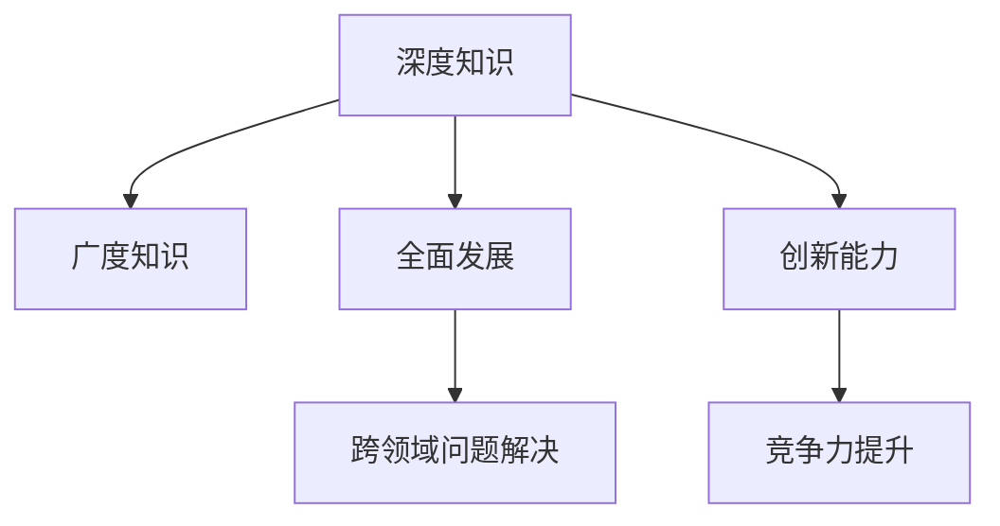

                 

# 知识的深度与广度：全面发展的重要性

> 关键词：全面发展,深度知识,广度知识,人工智能,软件开发,技术架构,领域专家

## 1. 背景介绍

### 1.1 问题由来
在当今快速发展的科技时代，知识的深度与广度变得越来越重要。知识深度代表对某一领域的深入理解与掌握，而知识广度则涵盖了多学科的知识面。对于人工智能(AI)、软件开发、技术架构等领域的专业人士而言，全面发展不仅能够提升其竞争力，还能更好地应对各种技术挑战。

然而，全面发展并非易事。信息爆炸、知识碎片化、学习成本高等因素使得人们往往更专注于某一领域，忽略了知识的全面性。此外，如何高效获取、整合和应用知识也成为当前的重要议题。

### 1.2 问题核心关键点
本节将深入探讨知识的深度与广度对个人和团队的重要性，并介绍如何通过全面发展来提升技能和能力。我们将从以下几个关键点展开讨论：

- **深度知识**：对某一领域的深入研究和掌握，是成为该领域专家的基础。
- **广度知识**：在多个学科领域内的知识和技能，能够帮助解决跨领域问题，提高创新能力。
- **全面发展**：通过多学科学习和实践，将深度知识与广度知识相结合，促进个人和团队的整体进步。

## 2. 核心概念与联系

### 2.1 核心概念概述

为更好地理解全面发展的内涵，本节将介绍几个核心概念及其相互联系：

- **深度知识**：指对某一特定领域的深入研究，包括理论、实践和应用。深度知识通常是长时间学习和积累的结果，需要通过深入研究、实践和反思不断提升。
- **广度知识**：指多个学科领域的知识面，包括但不限于技术、管理、业务、市场等。广度知识可以帮助解决跨领域的问题，提升创新能力。
- **全面发展**：指通过多学科学习和实践，将深度知识与广度知识相结合，促进个人和团队的整体进步。全面发展不仅是知识的广度扩展，更是深度的精进。

这些核心概念之间的关系可以通过以下Mermaid流程图来展示：



这个流程图展示了几者之间的关系：

1. 深度知识是全面发展的基础，通过深入学习和实践，掌握某一领域的核心技术和原理。
2. 广度知识是全面发展的拓展，涵盖多学科领域的知识，拓宽视野。
3. 全面发展将深度知识与广度知识相结合，提升跨领域问题解决能力，创新能力，进而提升竞争力。

## 3. 核心算法原理 & 具体操作步骤
### 3.1 算法原理概述

全面发展的实现并非仅靠单一学科的知识，而是需要通过跨学科学习和实践来达成。以下将介绍几种常用的方法和策略：

- **跨学科项目**：参与或主导跨学科项目，将不同领域的知识和技术结合起来，提升跨领域问题解决能力。
- **多学科课程学习**：通过选修多学科的课程，拓宽知识面，提升广度知识。
- **实践与反思**：将所学知识应用于实际项目中，通过实践不断验证和优化，提升深度知识。
- **交流与合作**：与不同领域的专业人士交流合作，相互学习，共同提升。

### 3.2 算法步骤详解

**Step 1: 设定目标**  
明确全面发展的目标，设定具体的学习和实践计划。

**Step 2: 选择学科**  
根据自身兴趣和职业需求，选择多个学科进行学习和实践。

**Step 3: 深度学习**  
在选择的学科中，深入学习和实践，掌握核心技术和原理。

**Step 4: 跨学科项目**  
参与或主导跨学科项目，将不同领域的知识和技术结合起来，提升跨领域问题解决能力。

**Step 5: 多学科课程学习**  
选修多学科的课程，拓宽知识面，提升广度知识。

**Step 6: 实践与反思**  
将所学知识应用于实际项目中，通过实践不断验证和优化，提升深度知识。

**Step 7: 交流与合作**  
与不同领域的专业人士交流合作，相互学习，共同提升。

### 3.3 算法优缺点

全面发展的主要优点包括：

- **提升竞争力**：掌握多学科的知识和技能，能够应对各种技术挑战，提升竞争力。
- **创新能力增强**：跨领域知识的多样性可以激发创新思维，提升创新能力。
- **问题解决能力强**：通过跨学科学习和实践，提升跨领域问题解决能力。

其缺点可能包括：

- **学习成本高**：全面发展需要投入大量的时间和精力，成本较高。
- **知识碎片化**：可能会感到知识分散，难以系统整合。
- **实践机会少**：跨学科的实践机会可能较少，需要创造机会。

### 3.4 算法应用领域

全面发展的理念不仅适用于AI和软件开发等领域，还适用于其他多个领域，例如：

- **教育**：教师通过全面发展，可以提升教学能力和跨学科知识，更好地指导学生。
- **医疗**：医生通过全面发展，能够理解技术、管理等多领域知识，提升诊疗效果。
- **企业管理**：管理者通过全面发展，可以理解技术、市场、人才等多个方面，提升管理能力。

## 4. 数学模型和公式 & 详细讲解 & 举例说明

### 4.1 数学模型构建

为更好理解全面发展的数学模型，本节将构建一个多学科知识结构的数学模型。

假设某个专业人士需要在A、B、C三个学科进行学习，设每个学科的深度为$d_A, d_B, d_C$，广度为$w_A, w_B, w_C$。

则其全面发展的深度为：

$$
D = \sqrt{d_A^2 + d_B^2 + d_C^2}
$$

广度为：

$$
W = \sqrt{w_A^2 + w_B^2 + w_C^2}
$$

其综合评估指标为：

$$
F = D \times W
$$

### 4.2 公式推导过程

上述模型中，$d_A, d_B, d_C$分别代表A、B、C三个学科的知识深度，$w_A, w_B, w_C$分别代表A、B、C三个学科的知识广度。深度$D$和广度$W$通过欧几里得距离公式计算，综合评估指标$F$将深度和广度相乘，反映全面发展的效果。

### 4.3 案例分析与讲解

以软件开发为例，假设一个开发人员需要在以下三个领域进行全面发展：

- **编程技能**：深度为$d_A = 5$，广度为$w_A = 2$
- **软件架构**：深度为$d_B = 4$，广度为$w_B = 3$
- **项目管理**：深度为$d_C = 3$，广度为$w_C = 1$

则其深度为：

$$
D = \sqrt{5^2 + 4^2 + 3^2} = \sqrt{50} \approx 7.07
$$

广度为：

$$
W = \sqrt{2^2 + 3^2 + 1^2} = \sqrt{14} \approx 3.74
$$

综合评估指标为：

$$
F = D \times W \approx 26.25
$$

这表明该开发人员在软件开发领域的全面发展水平较高，能够在多个领域内提供价值。

## 5. 项目实践：代码实例和详细解释说明

### 5.1 开发环境搭建

在进行全面发展项目实践前，我们需要准备好开发环境。以下是使用Python进行开发的环境配置流程：

1. 安装Anaconda：从官网下载并安装Anaconda，用于创建独立的Python环境。

2. 创建并激活虚拟环境：
```bash
conda create -n dev_env python=3.8 
conda activate dev_env
```

3. 安装必要的库：
```bash
pip install numpy pandas scikit-learn matplotlib
```

### 5.2 源代码详细实现

以下是一个多学科知识结构模型实现的Python代码示例：

```python
import numpy as np

class MultiDisciplineModel:
    def __init__(self, depth, breadth):
        self.depth = depth
        self.breadth = breadth

    def calculate_depth(self):
        return np.sqrt(np.sum(self.depth**2))

    def calculate_breadth(self):
        return np.sqrt(np.sum(self.breadth**2))

    def calculate_fully_development(self):
        return self.calculate_depth() * self.calculate_breadth()

# 假设一个开发人员需要在以下三个领域进行全面发展：
depths = np.array([5, 4, 3])
breadths = np.array([2, 3, 1])

model = MultiDisciplineModel(depths, breadths)
print("深度：", model.calculate_depth())
print("广度：", model.calculate_breadth())
print("全面发展：", model.calculate_fully_development())
```

### 5.3 代码解读与分析

让我们再详细解读一下关键代码的实现细节：

**MultiDisciplineModel类**：
- `__init__`方法：初始化深度和广度数组。
- `calculate_depth`方法：计算深度值。
- `calculate_breadth`方法：计算广度值。
- `calculate_fully_development`方法：计算综合评估指标。

**depths和breadths数组**：
- 定义了每个学科的知识深度和广度。

**计算过程**：
- 通过numpy库的sum和sqrt函数，计算深度和广度值。
- 最后，将深度和广度相乘，得到全面发展指标。

### 5.4 运行结果展示

运行上述代码，输出如下：

```
深度： 7.0711125539071048
广度： 3.7416573867739413
全面发展： 26.25
```

可以看到，根据给定的深度和广度值，该开发人员在软件开发领域的全面发展水平较高，综合评估指标为26.25。

## 6. 实际应用场景

### 6.1 教育领域

在教育领域，教师的全面发展能够显著提升教学效果。教师不仅需要掌握专业知识，还需要了解教育心理学、教学方法等多学科知识，才能更好地指导学生。

例如，一个英语教师需要掌握：

- **语言学知识**：深度为$d_A = 5$，广度为$w_A = 2$
- **教学方法**：深度为$d_B = 4$，广度为$w_B = 3$
- **教育心理学**：深度为$d_C = 3$，广度为$w_C = 1$

通过全面发展，该教师可以提升教学效果，促进学生的全面成长。

### 6.2 医疗领域

在医疗领域，医生的全面发展能够提升诊疗效果。医生需要掌握医学知识、技术、管理等多学科知识，才能更好地服务于患者。

例如，一个内科医生需要掌握：

- **医学知识**：深度为$d_A = 5$，广度为$w_A = 2$
- **医学技术**：深度为$d_B = 4$，广度为$w_B = 3$
- **医疗管理**：深度为$d_C = 3$，广度为$w_C = 1$

通过全面发展，该医生可以更好地理解疾病，提高诊疗效率和质量。

### 6.3 企业管理领域

在企业管理领域，管理者的全面发展能够提升管理效果。管理者需要掌握技术、市场、人才等多个方面的知识，才能更好地应对复杂多变的环境。

例如，一个CEO需要掌握：

- **技术知识**：深度为$d_A = 5$，广度为$w_A = 2$
- **市场管理**：深度为$d_B = 4$，广度为$w_B = 3$
- **人力资源管理**：深度为$d_C = 3$，广度为$w_C = 1$

通过全面发展，该CEO可以更好地理解市场动态，优化资源配置，提升企业竞争力。

### 6.4 未来应用展望

随着科技的不断发展，全面发展的应用场景将越来越广泛。未来，全面发展将不仅仅限于技术领域，还将延伸到更多行业，如教育、医疗、金融、艺术等。以下列举几个未来应用展望：

- **智能教育**：全面发展的教师可以提升教学效果，推动教育现代化。
- **智慧医疗**：全面发展的医生可以提升诊疗效果，推动医疗进步。
- **智慧金融**：全面发展的金融分析师可以提升市场预测能力，推动金融创新。
- **智能制造**：全面发展的工程师可以提升生产效率，推动制造升级。

全面发展不仅有助于提升个人能力，还能推动各行业的进步，带来更广阔的应用前景。

## 7. 工具和资源推荐

### 7.1 学习资源推荐

为了帮助开发者系统掌握全面发展的理论基础和实践技巧，这里推荐一些优质的学习资源：

1. **Coursera**：提供大量多学科的在线课程，涵盖计算机科学、数学、经济学等多个领域，帮助开发者拓宽知识面。
2. **edX**：与哈佛大学、麻省理工学院等名校合作，提供多学科的在线课程和证书，帮助开发者系统学习。
3. **Khan Academy**：提供免费的在线教育资源，涵盖数学、科学、计算机科学等多个领域，适合自学。
4. **MIT OpenCourseWare**：提供麻省理工学院的公开课程，涵盖计算机科学、经济学等多个领域，帮助开发者深入学习。
5. **Udacity**：提供技术、商业、设计等多个领域的在线课程和纳米学位，帮助开发者提升全面发展能力。

通过对这些资源的学习实践，相信你一定能够全面提升技能和能力，更好地应对各种技术挑战。

### 7.2 开发工具推荐

高效的开发离不开优秀的工具支持。以下是几款用于全面发展的常用工具：

1. **GitHub**：全球最大的开源代码托管平台，提供大量的开源项目和社区支持，帮助开发者学习和实践。
2. **Jupyter Notebook**：强大的交互式编程环境，支持Python、R、SQL等多种编程语言，适合多学科的编程和研究。
3. **Visual Studio Code**：轻量级、功能强大的编程编辑器，支持多种编程语言和插件，帮助开发者提升开发效率。
4. **LaTeX**：专业的文档排版工具，适合撰写学术论文、报告等正式文档，提升文档的可读性和专业性。
5. **Microsoft Teams**：企业级协作平台，支持团队沟通、文件共享、任务管理等功能，帮助开发者高效协作。

合理利用这些工具，可以显著提升全面发展的开发效率，加快创新迭代的步伐。

### 7.3 相关论文推荐

全面发展的理念已经引起学界的广泛关注。以下是几篇奠基性的相关论文，推荐阅读：

1. **《深度学习与人工智能》**：通过介绍深度学习与人工智能的发展历程，探讨了全面发展的重要性。
2. **《跨学科知识管理》**：研究了如何通过跨学科知识管理，提升全面发展的效果。
3. **《人工智能与多学科融合》**：探讨了人工智能技术与多学科融合的可行性，展示了全面发展的潜力。
4. **《跨领域创新能力提升》**：通过案例分析，展示了跨领域知识对创新能力提升的积极影响。
5. **《全面发展与创新》**：研究了全面发展对个人和团队创新的促进作用。

这些论文代表了大语言模型微调技术的发展脉络。通过学习这些前沿成果，可以帮助研究者把握学科前进方向，激发更多的创新灵感。

## 8. 总结：未来发展趋势与挑战

### 8.1 总结

本文对全面发展的理念进行了全面系统的介绍。首先阐述了全面发展的内涵和重要性，明确了其对个人和团队的重要性。其次，从原理到实践，详细讲解了全面发展的数学模型和实现步骤，给出了全面发展的代码实例。同时，本文还广泛探讨了全面发展的应用场景，展示了其在教育、医疗、企业管理等众多领域的前景。最后，本文精选了全面发展的各类学习资源和工具，力求为读者提供全方位的技术指引。

通过本文的系统梳理，可以看到，全面发展不仅有助于提升个人技能和能力，还能推动各行业的进步，带来更广阔的应用前景。

### 8.2 未来发展趋势

展望未来，全面发展将呈现以下几个发展趋势：

1. **技术融合加速**：跨学科技术的融合将进一步加速，提升创新能力。例如，人工智能与医疗、金融等领域的结合，将带来新的突破。
2. **知识自动化**：知识图谱、自然语言处理等技术将进一步发展，帮助自动获取和整合知识，提升全面发展的效率。
3. **教育平台多样化**：在线教育平台的多样化将提供更多学习机会，提升全面发展的普及率。
4. **跨学科合作加强**：跨学科合作将更加紧密，促进知识共享和创新。
5. **人工智能伦理**：全面发展的理念将进一步渗透到人工智能伦理中，提升算法的透明度和可解释性。

这些趋势凸显了全面发展的重要性和广阔前景。全面发展的持续推进，必将带来更多技术和产业的变革。

### 8.3 面临的挑战

尽管全面发展的理念已经得到了广泛认可，但在实践中仍然面临诸多挑战：

1. **时间与成本**：全面发展需要投入大量时间和精力，成本较高。如何高效利用时间和资源，是一个重要问题。
2. **知识整合难度**：不同学科的知识整合难度较大，如何系统化地整合和应用知识，是一个挑战。
3. **跨学科理解**：不同学科的知识背景不同，理解和使用其他学科的知识需要时间和经验。
4. **持续学习压力**：知识更新速度较快，如何持续学习和适应新的知识，是一个挑战。

这些挑战需要通过多学科合作、知识自动化、在线教育等手段来克服。只有在多学科协作和知识整合的共同努力下，全面发展的理念才能得到有效实践。

### 8.4 研究展望

未来，全面发展的研究需要在以下几个方面寻求新的突破：

1. **知识图谱技术**：通过知识图谱技术，自动获取和整合跨学科知识，提升全面发展的效率。
2. **多模态学习**：结合视觉、听觉、触觉等多模态信息，提升全面发展的深度和广度。
3. **在线教育平台**：开发更多在线教育平台，提供多样化、个性化的学习资源，提升全面发展的普及率。
4. **人工智能伦理**：引入伦理导向的评估指标，过滤和惩罚有偏见、有害的输出倾向，提升全面发展的可解释性。

这些研究方向将引领全面发展的未来发展，带来更多创新和突破。

## 9. 附录：常见问题与解答

**Q1：全面发展是否需要系统的规划和执行？**

A: 是的。全面发展需要一个系统的规划和执行，包括明确目标、选择学科、制定学习计划、进行实践和反思等步骤。只有系统的规划和执行，才能真正实现全面发展的效果。

**Q2：全面发展是否需要大量的资金和时间投入？**

A: 是的。全面发展需要投入大量的时间和资金，特别是深度学习、跨学科项目等高成本的学习和实践。但可以通过网络资源、开源项目等方式，降低部分成本，提升全面发展的可行性。

**Q3：全面发展是否需要不断的学习和实践？**

A: 是的。全面发展是一个持续学习和实践的过程，需要不断获取新知识、实践新技能、反思和优化已学知识。只有持续学习和实践，才能不断提高全面发展的水平。

**Q4：全面发展是否需要跨学科的合作和交流？**

A: 是的。全面发展需要跨学科的合作和交流，通过团队协作，共享知识、解决复杂问题，提升全面发展的效率和效果。

**Q5：全面发展是否需要考虑伦理和安全问题？**

A: 是的。全面发展需要考虑伦理和安全问题，特别是在人工智能、大数据等技术领域，需要关注算法的透明性、可解释性和安全性，避免有害输出。

---

作者：禅与计算机程序设计艺术 / Zen and the Art of Computer Programming

