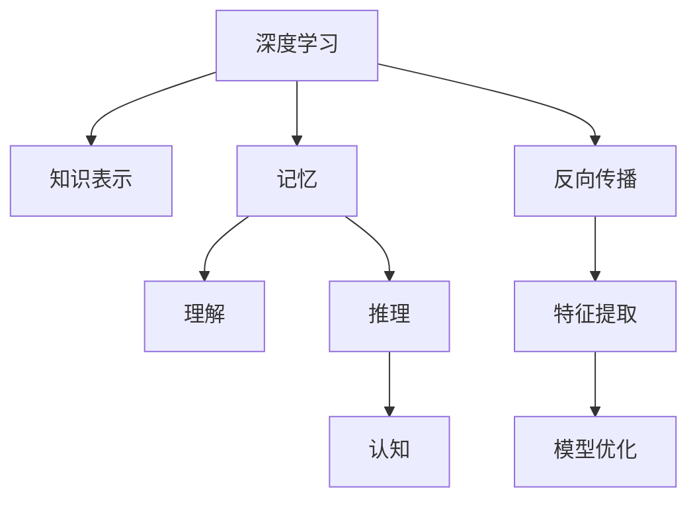

                 

# 知识的深度学习：从记忆到理解的飞跃

> 关键词：深度学习, 知识表示, 记忆, 理解, 推理, 认知, 人工智能

## 1. 背景介绍

在当今信息爆炸的时代，知识的深度学习已成为人工智能领域的前沿研究方向。它不仅致力于提升计算机处理信息的深度和广度，更重要的是实现从记忆到理解的飞跃，使机器能够像人类一样进行复杂的认知推理和决策。深度学习技术的崛起，尤其是神经网络的突破，让这一愿景变得触手可及。本文将深入探讨深度学习在知识表示、记忆和理解方面的进展，并展望未来的发展趋势与挑战。

## 2. 核心概念与联系

### 2.1 核心概念概述

为更好地理解深度学习在知识处理方面的应用，本节将介绍几个密切相关的核心概念：

- **深度学习**：一种利用多层神经网络模拟人脑处理复杂信息的技术。通过反向传播算法更新网络参数，使得模型能够自动提取数据中的特征，从而进行分类、回归、生成等任务。

- **知识表示**：指将人类知识以计算机能够理解的形式存储在模型中。知识表示方式包括符号逻辑、语义网络、向量空间等，其中向量空间模型（如Word2Vec、BERT等）在自然语言处理（NLP）中应用广泛。

- **记忆**：指深度学习模型在训练过程中学习到的数据特征和模式。记忆不仅包括短期的输入特征，还包括长期的知识积累。

- **理解**：指深度学习模型在已有记忆的基础上，进行复杂的逻辑推理、语义理解等认知操作。理解能力是深度学习模型的最终目标，它使得机器能够处理未知的新数据。

- **推理**：指深度学习模型基于已有知识和推理规则，进行逻辑判断和决策。推理能力使得机器能够在缺乏直接标注数据的情况下，做出合理的预测和判断。

- **认知**：指深度学习模型模拟人类认知过程，进行感知、记忆、理解、推理等高级功能。认知是深度学习的重要方向，致力于构建通用人工智能（AGI）。

这些核心概念之间的逻辑关系可以通过以下Mermaid流程图来展示：



这个流程图展示深度学习的核心概念及其之间的关系：

1. 深度学习通过反向传播算法，提取数据特征，更新模型参数。
2. 模型学习到的数据特征即为记忆。
3. 基于记忆，模型进行理解、推理等高级认知操作。
4. 认知过程需要依赖于知识表示、推理规则等。
5. 反向传播、特征提取、模型优化等技术支撑深度学习的高效实现。

## 3. 核心算法原理 & 具体操作步骤

### 3.1 算法原理概述

深度学习在知识处理方面的核心思想是通过多层神经网络，模拟人类认知过程，实现从数据到知识，再到推理的理解能力。深度学习模型通常由多个层次组成，每一层提取不同层次的特征，最终输出符合任务要求的输出。其中，自编码器、生成对抗网络（GAN）、卷积神经网络（CNN）、循环神经网络（RNN）和Transformer等架构，在深度学习中具有代表性。

### 3.2 算法步骤详解

以下详细解释深度学习在知识表示、记忆和理解方面的详细步骤：

**Step 1: 数据准备与预处理**
- 收集并准备用于深度学习的标注数据集，如图片、文本、语音等。
- 对数据进行预处理，包括去噪、归一化、分词、标签编码等步骤，以提高模型的输入效率和训练效果。

**Step 2: 构建深度学习模型**
- 选择或设计适合任务的深度学习模型架构，如卷积神经网络（CNN）、循环神经网络（RNN）、Transformer等。
- 对模型进行初始化，并设置损失函数、优化器等超参数。

**Step 3: 特征提取与记忆构建**
- 通过模型训练，提取输入数据的特征表示。
- 在特征表示的基础上，构建模型的记忆，即模型学习到的数据特征和模式。

**Step 4: 理解与推理**
- 基于记忆，构建理解模块，如Transformer中的多头自注意力机制，实现对输入数据的语义理解。
- 通过推理模块，如逻辑回归、分类器等，对理解后的数据进行推理和决策。

**Step 5: 模型评估与优化**
- 使用验证集评估模型的理解能力和推理能力。
- 根据评估结果，调整模型超参数、优化算法等，提高模型的性能。

### 3.3 算法优缺点

深度学习在知识处理方面具有以下优点：
1. 强大的特征提取能力。通过多层神经网络，深度学习能够自动提取数据的高级特征。
2. 灵活的模型架构。深度学习模型可以根据任务需求，灵活设计层数、层类型等参数。
3. 强大的泛化能力。深度学习模型在大量数据上训练，能够对未知数据进行有效泛化。

同时，该方法也存在一定的局限性：
1. 数据依赖性强。深度学习模型依赖大量标注数据进行训练，数据获取成本高。
2. 计算资源消耗大。深度学习模型参数量巨大，训练和推理消耗大量计算资源。
3. 模型可解释性差。深度学习模型通常被视为"黑盒"，难以解释其内部工作机制。
4. 训练时间长。深度学习模型训练时间较长，调试和优化困难。

尽管存在这些局限性，但深度学习在知识处理方面的强大能力和广泛应用，使其成为当前人工智能研究的热点。未来相关研究的重点在于如何进一步提高模型的可解释性，优化计算资源消耗，提高训练效率，并增强模型的泛化能力和迁移学习能力。

### 3.4 算法应用领域

深度学习在知识处理方面的应用已经覆盖了众多领域，包括：

- 自然语言处理（NLP）：通过Word2Vec、BERT等模型，实现文本分类、情感分析、机器翻译、问答系统等任务。
- 计算机视觉（CV）：通过CNN、ResNet等模型，实现图像识别、目标检测、图像生成等任务。
- 语音识别：通过RNN、LSTM等模型，实现语音转文字、语音识别等任务。
- 医疗健康：通过深度学习模型，实现医学影像诊断、个性化治疗推荐等任务。
- 金融分析：通过深度学习模型，实现风险评估、投资策略优化等任务。
- 自动驾驶：通过深度学习模型，实现环境感知、路径规划等任务。

除了这些经典领域外，深度学习还被创新性地应用于更多场景中，如推荐系统、智能客服、智能家居等，为各行各业带来了变革性影响。随着深度学习技术的不断进步，相信其在更多领域的创新应用将不断涌现，推动人工智能技术的全面发展。

## 4. 数学模型和公式 & 详细讲解

### 4.1 数学模型构建

深度学习模型通常由多个层次组成，每一层提取不同层次的特征。以下以卷积神经网络（CNN）为例，介绍其数学模型构建过程。

假设输入数据为 $x \in \mathbb{R}^{n}$，输出标签为 $y \in \{0, 1\}$，卷积神经网络的结构如下：

```
Input Layer
|
Convolutional Layer
|
Max-Pooling Layer
|
Fully Connected Layer
|
Output Layer
```

其中，输入层接收原始数据，卷积层和池化层提取特征，全连接层和输出层进行分类。每一层的计算公式如下：

- 输入层：$x$
- 卷积层：$\sigma(Wx + b)$
- 池化层：$P(\sigma(Wx + b))$
- 全连接层：$S(W^Tx + b)$
- 输出层：$\sigma(W^TS + b)$

其中，$\sigma$ 为激活函数，$W$ 和 $b$ 为权重和偏置，$P$ 为池化操作。

### 4.2 公式推导过程

以卷积神经网络中的卷积层和池化层为例，推导其计算公式。

卷积层的计算公式为：
$$
y = \sigma(Wx + b) = \sigma\left(\sum_i^m w_i \cdot x_i + b\right)
$$

其中，$w_i$ 为卷积核的权重，$b$ 为偏置，$\sigma$ 为激活函数。

池化层的计算公式为：
$$
y' = P(\sigma(Wx + b)) = \sigma\left(\sum_j^p w_j \cdot P(x_j) + b\right)
$$

其中，$w_j$ 为池化核的权重，$b$ 为偏置，$P$ 为池化操作。

以上公式展示了卷积神经网络的计算过程，通过多层次的特征提取，深度学习模型可以逐步从数据中学习到更高级的特征表示。

### 4.3 案例分析与讲解

以图像识别任务为例，介绍卷积神经网络（CNN）的实际应用。

假设任务为识别手写数字图片，输入图片大小为 $28\times28$，共有 10 个输出类别。可以设计如下卷积神经网络：

```
Input Layer
|
Convolutional Layer1
|
Max-Pooling Layer1
|
Convolutional Layer2
|
Max-Pooling Layer2
|
Fully Connected Layer1
|
Fully Connected Layer2
|
Output Layer
```

具体参数设置如下：
- 输入层：$28\times28=784$ 维向量。
- Convolutional Layer1：$3\times3$ 卷积核，$32$ 个卷积核，$ReLU$ 激活函数。
- Max-Pooling Layer1：$2\times2$ 池化窗口，$2\times2$ 池化步长。
- Convolutional Layer2：$3\times3$ 卷积核，$64$ 个卷积核，$ReLU$ 激活函数。
- Max-Pooling Layer2：$2\times2$ 池化窗口，$2\times2$ 池化步长。
- Fully Connected Layer1：$7\times7\times64$ 输入，$128$ 个输出，$ReLU$ 激活函数。
- Fully Connected Layer2：$128$ 输入，$10$ 个输出，$Softmax$ 激活函数。
- Output Layer：$Softmax$ 激活函数。

训练过程中，采用交叉熵损失函数进行优化，最小化损失函数：
$$
L = -\frac{1}{N}\sum_{i=1}^N y_i \log(\hat{y_i})
$$

其中，$y_i$ 为真实标签，$\hat{y_i}$ 为模型预测概率。

通过反向传播算法更新网络参数，使得模型在大量标注数据上逐步学习到数字图片的高级特征表示，并能够对新图片进行准确分类。

## 5. 项目实践：代码实例和详细解释说明

### 5.1 开发环境搭建

在进行深度学习项目实践前，需要准备好开发环境。以下是使用Python进行TensorFlow开发的环境配置流程：

1. 安装Anaconda：从官网下载并安装Anaconda，用于创建独立的Python环境。

2. 创建并激活虚拟环境：
```bash
conda create -n tensorflow-env python=3.8 
conda activate tensorflow-env
```

3. 安装TensorFlow：根据CUDA版本，从官网获取对应的安装命令。例如：
```bash
conda install tensorflow -c tf -c conda-forge
```

4. 安装各类工具包：
```bash
pip install numpy pandas scikit-learn matplotlib tqdm jupyter notebook ipython
```

完成上述步骤后，即可在`tensorflow-env`环境中开始深度学习实践。

### 5.2 源代码详细实现

以下是一个简单的卷积神经网络模型实现，用于手写数字识别任务：

```python
import tensorflow as tf
from tensorflow.keras import layers

# 定义模型
model = tf.keras.Sequential([
    layers.Conv2D(32, (3, 3), activation='relu', input_shape=(28, 28, 1)),
    layers.MaxPooling2D((2, 2)),
    layers.Conv2D(64, (3, 3), activation='relu'),
    layers.MaxPooling2D((2, 2)),
    layers.Flatten(),
    layers.Dense(128, activation='relu'),
    layers.Dense(10, activation='softmax')
])

# 编译模型
model.compile(optimizer='adam',
              loss='sparse_categorical_crossentropy',
              metrics=['accuracy'])

# 加载数据集
(x_train, y_train), (x_test, y_test) = tf.keras.datasets.mnist.load_data()

# 数据预处理
x_train = x_train.reshape(-1, 28, 28, 1) / 255.0
x_test = x_test.reshape(-1, 28, 28, 1) / 255.0

# 训练模型
model.fit(x_train, y_train, epochs=10, validation_data=(x_test, y_test))
```

### 5.3 代码解读与分析

以上代码实现了一个简单的卷积神经网络，用于手写数字识别任务。

- 第一层为卷积层，$3\times3$ 卷积核，$32$ 个卷积核，$ReLU$ 激活函数。
- 第二层为池化层，$2\times2$ 池化窗口，$2\times2$ 池化步长。
- 第三层为卷积层，$3\times3$ 卷积核，$64$ 个卷积核，$ReLU$ 激活函数。
- 第四层为池化层，$2\times2$ 池化窗口，$2\times2$ 池化步长。
- 第五层为全连接层，$7\times7\times64$ 输入，$128$ 个输出，$ReLU$ 激活函数。
- 第六层为全连接层，$128$ 输入，$10$ 个输出，$Softmax$ 激活函数。

通过反向传播算法更新网络参数，使得模型在训练数据集上逐步学习到手写数字图片的高级特征表示，并能够对测试数据集进行准确分类。

## 6. 实际应用场景

### 6.1 智能医疗

深度学习在医疗领域的应用非常广泛，从医学影像诊断到个性化治疗推荐，都能看到其身影。深度学习模型能够从大量医疗数据中学习到丰富的知识表示，从而实现复杂疾病的早期诊断、精准治疗等任务。

例如，在医学影像诊断中，可以通过卷积神经网络（CNN）对CT、MRI等医学影像进行分类和分割。在个性化治疗推荐中，可以通过深度学习模型对患者数据进行建模，并结合专家知识库，推荐最佳治疗方案。

### 6.2 金融分析

金融市场瞬息万变，深度学习在金融分析领域也发挥了重要作用。通过深度学习模型，可以对历史数据进行建模，预测市场走势、评估风险等任务。例如，可以通过卷积神经网络（CNN）对股票价格变化进行预测，通过循环神经网络（RNN）对市场情绪进行分析。

### 6.3 自动驾驶

自动驾驶是深度学习的重要应用场景之一，通过深度学习模型，可以实现环境感知、路径规划等任务。例如，可以通过卷积神经网络（CNN）对摄像头采集的图像进行识别，通过循环神经网络（RNN）对驾驶行为进行决策。

### 6.4 未来应用展望

随着深度学习技术的不断发展，其在更多领域的应用将不断拓展。例如：

- 在智慧医疗领域，深度学习模型将进一步提升医疗服务的智能化水平，辅助医生诊疗，加速新药开发进程。
- 在智能教育领域，深度学习技术将应用于作业批改、学情分析、知识推荐等方面，因材施教，促进教育公平，提高教学质量。
- 在智慧城市治理中，深度学习技术将应用于城市事件监测、舆情分析、应急指挥等环节，提高城市管理的自动化和智能化水平，构建更安全、高效的未来城市。
- 在企业生产、社会治理、文娱传媒等众多领域，深度学习技术也将不断涌现，为经济社会发展注入新的动力。

## 7. 工具和资源推荐

### 7.1 学习资源推荐

为了帮助开发者系统掌握深度学习技术的理论基础和实践技巧，这里推荐一些优质的学习资源：

1. 《深度学习》系列博文：由深度学习领域专家撰写，深入浅出地介绍了深度学习的基本概念和前沿技术。

2. Coursera《深度学习专项课程》：由深度学习领域的权威教授Andrew Ng主讲，涵盖深度学习的核心内容，包括卷积神经网络（CNN）、循环神经网络（RNN）、生成对抗网络（GAN）等。

3. 《TensorFlow实战深度学习》书籍：TensorFlow的官方文档，介绍了深度学习的基本概念和实践技巧，适合初学者入门。

4. GitHub上的深度学习项目：提供了大量开源深度学习项目，方便开发者学习和借鉴。

5. Arxiv上的深度学习论文：深度学习领域的研究前沿，可以通过阅读论文了解最新的研究成果。

通过对这些资源的学习实践，相信你一定能够快速掌握深度学习技术的精髓，并用于解决实际的NLP问题。

### 7.2 开发工具推荐

高效的开发离不开优秀的工具支持。以下是几款用于深度学习开发的常用工具：

1. TensorFlow：由Google主导开发的开源深度学习框架，生产部署方便，适合大规模工程应用。

2. PyTorch：基于Python的开源深度学习框架，灵活动态的计算图，适合快速迭代研究。

3. Keras：高层次的深度学习框架，简单易用，适合初学者上手。

4. Weights & Biases：模型训练的实验跟踪工具，可以记录和可视化模型训练过程中的各项指标，方便对比和调优。

5. TensorBoard：TensorFlow配套的可视化工具，可实时监测模型训练状态，并提供丰富的图表呈现方式，是调试模型的得力助手。

合理利用这些工具，可以显著提升深度学习模型的开发效率，加快创新迭代的步伐。

### 7.3 相关论文推荐

深度学习在知识处理方面的发展源于学界的持续研究。以下是几篇奠基性的相关论文，推荐阅读：

1. AlexNet：卷积神经网络的开创性工作，展示了卷积神经网络在图像识别中的强大能力。

2. RNN与LSTM：循环神经网络及其变体在序列数据处理中的应用，展示了循环神经网络在语言建模、机器翻译等任务中的效果。

3. Transformer：Transformer模型在自然语言处理中的应用，展示了自注意力机制在语言理解中的优势。

4. GAN：生成对抗网络在图像生成、视频合成等任务中的创新应用，展示了生成对抗网络在创造性任务中的潜力。

5. Capsule Network：胶囊网络在图像识别中的创新设计，展示了胶囊网络在提高特征表示能力方面的优势。

这些论文代表深度学习在知识处理方面的发展脉络。通过学习这些前沿成果，可以帮助研究者把握学科前进方向，激发更多的创新灵感。

## 8. 总结：未来发展趋势与挑战

### 8.1 总结

本文对深度学习在知识表示、记忆和理解方面的进展进行了全面系统的介绍。首先阐述了深度学习在知识处理方面的研究背景和意义，明确了深度学习在从数据到知识，再到推理的理解能力方面的独特价值。其次，从原理到实践，详细讲解了深度学习模型的构建、特征提取、记忆构建、理解与推理等详细步骤，给出了深度学习项目开发的完整代码实例。同时，本文还广泛探讨了深度学习在智能医疗、金融分析、自动驾驶等多个领域的应用前景，展示了深度学习技术的广阔前景。

通过本文的系统梳理，可以看到，深度学习在知识处理方面的强大能力和广泛应用，使其成为当前人工智能研究的热点。未来深度学习技术将在更多领域得到应用，为人类认知智能的进化带来深远影响。

### 8.2 未来发展趋势

展望未来，深度学习在知识处理方面的发展将呈现以下几个趋势：

1. 模型规模持续增大。随着算力成本的下降和数据规模的扩张，深度学习模型的参数量还将持续增长。超大规模模型蕴含的丰富知识表示，有望支撑更加复杂多变的下游任务。

2. 模型训练效率提升。随着硬件设备的不断升级，深度学习模型的训练速度将进一步提升，训练时间和计算资源的消耗将大幅减少。

3. 模型可解释性增强。随着深度学习模型的广泛应用，模型可解释性变得越来越重要。未来将开发更多的模型可解释性技术，使得模型能够更好地解释其内部工作机制和决策过程。

4. 模型跨领域迁移能力提升。未来的深度学习模型将具备更强的跨领域迁移能力，能够在大规模数据上进行预训练，并在小规模任务上进行微调，从而在更多领域取得优异效果。

5. 知识表示方法多样化。未来的知识表示方法将更加多样化，包括符号表示、逻辑表示、向量表示等，以满足不同任务的需求。

6. 知识表示与推理结合紧密。未来的知识表示方法将与推理结合更加紧密，实现知识的高效提取和应用。

以上趋势凸显了深度学习在知识处理方面的广阔前景。这些方向的探索发展，必将进一步提升深度学习模型的性能和应用范围，为人类认知智能的进化带来深远影响。

### 8.3 面临的挑战

尽管深度学习在知识处理方面已经取得了瞩目成就，但在迈向更加智能化、普适化应用的过程中，仍面临诸多挑战：

1. 数据依赖性强。深度学习模型依赖大量标注数据进行训练，数据获取成本高。对于长尾应用场景，难以获得充足的高质量标注数据。

2. 计算资源消耗大。深度学习模型参数量巨大，训练和推理消耗大量计算资源。超大规模模型的计算需求将进一步提升。

3. 模型可解释性差。深度学习模型通常被视为"黑盒"，难以解释其内部工作机制和决策过程。这对于医疗、金融等高风险应用尤为重要。

4. 训练时间长。深度学习模型训练时间较长，调试和优化困难。如何提高训练效率，减少训练时间，是未来重要的研究方向。

5. 知识表示能力有限。当前的深度学习模型知识表示能力有限，难以处理复杂的符号和逻辑推理任务。

6. 模型泛化能力不足。对于测试样本的微小扰动，深度学习模型的泛化性能往往大打折扣。

7. 知识迁移能力不足。当前深度学习模型跨领域迁移能力有限，难以适应新领域的任务。

8. 知识表示与推理结合不够紧密。未来的知识表示方法需要与推理结合更加紧密，实现知识的高效提取和应用。

这些挑战凸显了深度学习在知识处理方面的复杂性和局限性。解决这些问题，需要学界和产业界的共同努力，探索新的技术方向和应用场景，推动深度学习技术的不断进步。

### 8.4 研究展望

面对深度学习在知识处理方面面临的诸多挑战，未来的研究需要在以下几个方面寻求新的突破：

1. 探索无监督和半监督学习范式。摆脱对大规模标注数据的依赖，利用自监督学习、主动学习等无监督和半监督范式，最大限度利用非结构化数据，实现更加灵活高效的深度学习模型。

2. 开发更多模型可解释性技术。探索如何更好地解释深度学习模型的内部工作机制和决策过程，提高模型的可解释性和可信任度。

3. 研究跨领域知识迁移技术。开发更加高效的跨领域知识迁移方法，提升深度学习模型的泛化能力和迁移学习能力。

4. 融合知识表示与推理技术。开发更加紧密的知识表示与推理结合方法，实现知识的高效提取和应用。

5. 探索知识表示与推理的新方法。探索新的知识表示和推理方法，如符号逻辑、图形网络、神经网络等，以提升深度学习模型的知识处理能力。

这些研究方向将引领深度学习技术在知识处理方面的不断进步，为构建智能系统提供更加强大和灵活的工具和方法。

## 9. 附录：常见问题与解答

**Q1：深度学习模型是否需要大量标注数据？**

A: 深度学习模型通常需要大量标注数据进行训练，数据获取成本较高。但对于一些任务，如数据生成、无监督学习等，深度学习模型也能取得不错的效果。如何在大规模无标注数据上进行有效的自监督学习，是未来研究的重要方向。

**Q2：如何提高深度学习模型的训练效率？**

A: 提高深度学习模型训练效率可以从以下几个方面入手：
1. 硬件优化：使用GPU、TPU等高性能硬件设备，提升计算速度。
2. 模型压缩：使用模型剪枝、量化等技术，减少模型参数量，降低计算开销。
3. 分布式训练：使用分布式训练技术，在多个设备上并行计算，提升训练速度。
4. 优化算法：使用Adam、Adafactor等高效优化算法，提高模型收敛速度。
5. 数据增强：通过数据增强技术，扩充训练集，提高模型泛化能力。

**Q3：如何提高深度学习模型的可解释性？**

A: 提高深度学习模型可解释性可以从以下几个方面入手：
1. 模型简化：使用简化模型结构，减少复杂度，提高可解释性。
2. 可视化技术：使用可视化技术，展示模型内部特征和决策过程，提高可解释性。
3. 特征工程：通过特征选择、特征提取等技术，提高模型的可解释性。
4. 知识图谱：构建知识图谱，将符号知识与深度学习模型结合，提高可解释性。

**Q4：深度学习模型在实际应用中面临哪些挑战？**

A: 深度学习模型在实际应用中面临的挑战包括：
1. 数据依赖性强。深度学习模型依赖大量标注数据进行训练，数据获取成本高。
2. 计算资源消耗大。深度学习模型参数量巨大，训练和推理消耗大量计算资源。
3. 模型可解释性差。深度学习模型通常被视为"黑盒"，难以解释其内部工作机制和决策过程。
4. 训练时间长。深度学习模型训练时间较长，调试和优化困难。
5. 知识表示能力有限。当前的深度学习模型知识表示能力有限，难以处理复杂的符号和逻辑推理任务。
6. 模型泛化能力不足。对于测试样本的微小扰动，深度学习模型的泛化性能往往大打折扣。
7. 知识迁移能力不足。当前深度学习模型跨领域迁移能力有限，难以适应新领域的任务。
8. 知识表示与推理结合不够紧密。未来的知识表示方法需要与推理结合更加紧密，实现知识的高效提取和应用。

**Q5：如何优化深度学习模型的跨领域迁移能力？**

A: 优化深度学习模型的跨领域迁移能力可以从以下几个方面入手：
1. 数据增强：通过数据增强技术，扩充训练集，提高模型泛化能力。
2. 迁移学习：在预训练模型上进行微调，提高模型的迁移学习能力。
3. 多任务学习：同时训练多个相关任务，提升模型的跨领域迁移能力。
4. 知识图谱：构建知识图谱，将符号知识与深度学习模型结合，提高可解释性和迁移能力。
5. 领域适应：针对特定领域，进行领域适应训练，提升模型的领域迁移能力。

这些研究方向将引领深度学习技术在知识处理方面的不断进步，为构建智能系统提供更加强大和灵活的工具和方法。

---

作者：禅与计算机程序设计艺术 / Zen and the Art of Computer Programming

