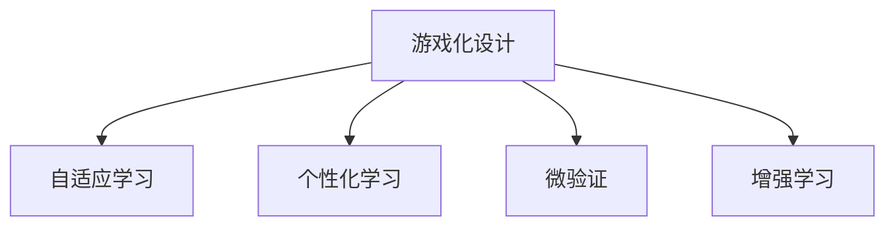

                 

## 1. 背景介绍

### 1.1 问题由来

在当今知识爆炸的时代，获取知识变得更加便捷，但如何保持学习的参与度和持续性却成为了一个难题。传统的被动接受知识的方式，不仅效率低下，而且难以适应学习者的多样化需求。如何设计更吸引人的学习体验，让学习成为一种游戏化过程，是教育技术领域亟待解决的问题。

### 1.2 问题核心关键点

游戏化设计（Gamification）是指将游戏的元素和机制应用到非游戏场景中，以提升参与度、增强动机和改善体验。在教育领域，游戏化设计通过引入挑战、奖励、反馈、竞争等元素，使学习过程变得有趣和富有挑战性，从而提高学习者的参与度和学习效果。

游戏化设计的核心在于如何设计合理的挑战和奖励机制，以及如何通过数据反馈和动态调整，使学习者能够持续保持兴趣和动力。这需要从心理学、认知科学和行为科学等多个角度进行综合考虑，设计出既有趣又有效的学习体验。

## 2. 核心概念与联系

### 2.1 核心概念概述

为了更好地理解知识游戏化设计的原理和应用，本节将介绍几个密切相关的核心概念：

- **游戏化设计（Gamification）**：将游戏元素引入非游戏领域，以提升参与度和效率的设计策略。
- **自适应学习（Adaptive Learning）**：根据学习者的反馈和表现，动态调整教学内容和难度，以适应学习者的个体差异。
- **个性化学习（Personalized Learning）**：根据学习者的兴趣、能力和学习历史，提供定制化的学习内容和路径，满足个性化需求。
- **微验证（Micro-Assessment）**：通过频繁的、低强度的测试，及时提供反馈，帮助学习者掌握知识。
- **增强学习（Reinforcement Learning）**：通过奖励和惩罚机制，引导学习者的行为，使其向期望的目标不断靠近。

这些核心概念之间的逻辑关系可以通过以下Mermaid流程图来展示：



这个流程图展示了一些核心概念之间的相互联系和相互作用。

## 3. 核心算法原理 & 具体操作步骤
### 3.1 算法原理概述

知识游戏化设计的核心思想是通过引入游戏元素，使学习过程变得有趣和富有挑战性，从而提高学习者的参与度和学习效果。其核心算法原理包括以下几个方面：

- **挑战设计**：通过设定明确的、可实现的学习目标，使学习者有明确的方向和动力。
- **奖励机制**：通过给予学习者及时的、有价值的奖励，增强学习动机。
- **反馈系统**：通过即时、具体的反馈，帮助学习者理解自己的学习状态和进步，及时调整学习策略。
- **竞争元素**：通过引入一定的竞争机制，激发学习者的竞争意识和自我超越的动力。

### 3.2 算法步骤详解

基于游戏化设计原理的算法步骤主要包括以下几个关键步骤：

**Step 1: 需求分析与目标设定**
- 分析目标受众的学习需求和行为特点，确定学习的核心目标。
- 设定具体的、可量化的学习目标，如掌握某项技能、完成某个项目等。

**Step 2: 游戏元素设计**
- 根据学习目标，设计相应的游戏元素，如任务、关卡、积分等。
- 引入适当的挑战和奖励机制，如阶段性奖励、成就系统等。

**Step 3: 自适应学习算法设计**
- 设计自适应算法，根据学习者的表现动态调整学习内容和难度。
- 使用机器学习算法，如强化学习、贝叶斯网络等，实时分析学习者的状态和进展。

**Step 4: 个性化学习路径生成**
- 根据学习者的兴趣、能力和学习历史，生成个性化的学习路径和内容。
- 使用推荐系统算法，如协同过滤、基于内容的推荐等，优化学习内容的选择和推荐。

**Step 5: 微验证与即时反馈**
- 设计微验证系统，通过频繁的、低强度的测试，评估学习者的学习成果。
- 及时提供反馈，帮助学习者了解自己的学习状态和不足。

**Step 6: 增强学习机制**
- 引入增强学习算法，通过奖励和惩罚机制，引导学习者的行为。
- 根据学习者的表现，动态调整奖励和惩罚的策略，使其更有效。

### 3.3 算法优缺点

基于游戏化设计原理的算法具有以下优点：
- 提高参与度：通过游戏元素的设计，使学习过程变得有趣和富有挑战性，提高学习者的参与度和动机。
- 个性化适应：根据学习者的表现和兴趣，生成个性化的学习路径和内容，满足多样化需求。
- 即时反馈：通过频繁的微验证和即时反馈，帮助学习者及时了解自己的学习状态和进步，促进学习效率。

同时，该算法也存在一定的局限性：
- 设计复杂：需要根据具体的学习目标和受众特点，设计合适的游戏元素和机制。
- 技术要求高：需要结合机器学习、数据挖掘、推荐系统等多种技术，实现复杂的自适应和个性化功能。
- 资源消耗大：游戏化设计涉及大量的交互和数据处理，对计算资源和存储资源的要求较高。

尽管存在这些局限性，但就目前而言，基于游戏化设计的学习算法仍是大规模学习场景中应用最为广泛的方法之一。未来相关研究的重点在于如何进一步降低设计复杂度和资源消耗，提高算法的可扩展性和效率。

### 3.4 算法应用领域

基于游戏化设计原理的算法在多个领域都得到了广泛的应用，例如：

- 教育培训：通过引入挑战、奖励和反馈机制，使学习过程更加有趣和富有挑战性。在K-12教育、职业培训等多个领域广泛应用。
- 企业培训：在企业内部，通过游戏化培训方式，使员工学习更加高效和有动力。
- 在线学习平台：如Coursera、Udemy等在线学习平台，通过游戏化设计，提高学习者的参与度和完成率。
- 游戏化辅导：针对特定领域的知识学习，通过游戏化辅导工具，使学习过程变得有趣和有效。
- 知识竞赛：通过知识竞赛和挑战赛，激发学习者的竞争意识和自我超越的动力。

## 4. 数学模型和公式 & 详细讲解 & 举例说明
### 4.1 数学模型构建

基于游戏化设计原理的算法模型主要涉及以下几个方面的数学构建：

- **目标函数设计**：定义学习者的学习目标和评估指标，如掌握某项技能的概率、完成某项任务的时间等。
- **奖励和惩罚函数**：定义学习者的行为奖励和惩罚机制，如正确回答问题的奖励、错误回答的惩罚等。
- **自适应算法**：使用机器学习算法，如强化学习、贝叶斯网络等，实时调整学习内容和难度。

### 4.2 公式推导过程

以一个简单的微验证系统为例，设学习者的正确答案数为$C$，错误答案数为$W$，学习者回答$N$个问题，则学习者的准确率$p$可以表示为：

$$
p = \frac{C}{C+W}
$$

根据学习者的准确率，可以设计奖励和惩罚机制。假设正确回答每个问题获得$R$分，错误回答每个问题扣$P$分，则学习者的总得分$S$可以表示为：

$$
S = R \times C - P \times W
$$

通过调整$R$和$P$的值，可以设计出不同的奖励和惩罚策略，以适应不同的学习目标和受众特点。

### 4.3 案例分析与讲解

下面以一个简单的游戏化学习平台为例，展示如何应用游戏化设计原理进行知识学习：

**学习目标**：掌握某项编程技能，通过编写程序解决问题。

**游戏元素设计**：
- **任务设计**：将学习任务分解为多个子任务，每个子任务代表一个关卡。
- **挑战设计**：每个关卡中，设置不同难度的编程问题，使学习者有明确的学习目标和挑战。
- **奖励机制**：完成每个子任务后，给予一定的积分和奖励，如徽章、证书等。
- **反馈系统**：每个问题后，提供即时反馈，帮助学习者了解错误原因和改进方法。

**自适应学习算法设计**：
- **学习者分析**：通过学习者的答题记录，分析其掌握程度和学习习惯。
- **动态调整**：根据学习者的表现，动态调整任务难度和内容，使学习者能够保持在最佳学习状态。

**个性化学习路径生成**：
- **兴趣识别**：通过学习者的兴趣和反馈，识别其偏好的学习内容和方法。
- **路径生成**：生成个性化的学习路径和内容，满足学习者的多样化需求。

**增强学习机制**：
- **奖励和惩罚**：根据学习者的表现，给予相应的奖励和惩罚，引导其向期望目标前进。
- **学习调整**：根据学习者的表现和反馈，动态调整奖励和惩罚策略，使其更有效。

## 5. 项目实践：代码实例和详细解释说明
### 5.1 开发环境搭建

在进行知识游戏化设计实践前，我们需要准备好开发环境。以下是使用Python进行开发的环境配置流程：

1. 安装Anaconda：从官网下载并安装Anaconda，用于创建独立的Python环境。

2. 创建并激活虚拟环境：
```bash
conda create -n gamification-env python=3.8 
conda activate gamification-env
```

3. 安装所需Python包：
```bash
pip install gym scikit-learn numpy pandas matplotlib tqdm jupyter notebook ipython
```

4. 安装游戏化设计工具：
```bash
pip install pygamification
```

完成上述步骤后，即可在`gamification-env`环境中开始游戏化设计实践。

### 5.2 源代码详细实现

下面以一个简单的编程技能学习平台为例，给出使用PyGamification进行游戏化设计的PyTorch代码实现。

**学习者数据分析模块**：

```python
from sklearn.preprocessing import StandardScaler
from sklearn.cluster import KMeans

class LearnerAnalyzer:
    def __init__(self, data):
        self.data = data
        self.scaler = StandardScaler()
        self.kmeans = KMeans(n_clusters=5)

    def fit(self):
        self.scaler.fit(self.data)
        self.kmeans.fit(self.data)

    def analyze(self):
        scaled_data = self.scaler.transform(self.data)
        cluster_labels = self.kmeans.predict(scaled_data)
        return cluster_labels
```

**任务设计和挑战模块**：

```python
import gym
from gym import spaces

class ProgrammingTask(gym.Env):
    def __init__(self, problem):
        self.problem = problem
        self.observation_space = spaces.Box(low=-1, high=1, shape=(1,))
        self.action_space = spaces.Discrete(2)
        self.terminal = False

    def step(self, action):
        # 执行学习者的行为
        result = self.problem(action)
        reward = 0 if result == 'correct' else -1
        self.terminal = True
        return result, reward, self.terminal, {}

    def reset(self):
        self.terminal = False
        return self.observation_space.sample()

    def render(self):
        pass

class ProgrammingChallenge:
    def __init__(self, tasks, reward):
        self.tasks = tasks
        self.reward = reward

    def solve(self, action):
        return self.tasks[action]
```

**奖励机制和反馈模块**：

```python
class RewardSystem:
    def __init__(self, correct_reward, incorrect_reward):
        self.correct_reward = correct_reward
        self.incorrect_reward = incorrect_reward

    def reward(self, correct_answer):
        if correct_answer:
            return self.correct_reward
        else:
            return self.incorrect_reward

class FeedbackSystem:
    def __init__(self, correct_feedback, incorrect_feedback):
        self.correct_feedback = correct_feedback
        self.incorrect_feedback = incorrect_feedback

    def feedback(self, correct_answer):
        if correct_answer:
            return self.correct_feedback
        else:
            return self.incorrect_feedback
```

**自适应学习算法模块**：

```python
class AdaptiveLearning:
    def __init__(self, learner_analyzer, challenge_generator, reward_system, feedback_system):
        self.learner_analyzer = learner_analyzer
        self.challenge_generator = challenge_generator
        self.reward_system = reward_system
        self.feedback_system = feedback_system

    def learn(self, learner_data):
        self.learner_analyzer.fit(learner_data)
        cluster_labels = self.learner_analyzer.analyze()
        self.challenge_generator.generate_tasks(cluster_labels)
        return self.challenge_generator.get_tasks()
```

**个性化学习路径生成模块**：

```python
class PersonalizedLearningPath:
    def __init__(self, tasks, learner_profile):
        self.tasks = tasks
        self.learner_profile = learner_profile

    def generate_path(self):
        # 根据学习者的兴趣和能力，生成个性化的学习路径
        pass
```

**增强学习机制模块**：

```python
class ReinforcementLearning:
    def __init__(self, environment, reward_system, feedback_system):
        self.environment = environment
        self.reward_system = reward_system
        self.feedback_system = feedback_system

    def train(self, learner_data):
        for episode in range(1000):
            observation = self.environment.reset()
            for step in range(10):
                action = self.environment.action_space.sample()
                next_observation, reward, terminal, _ = self.environment.step(action)
                self.environment.feedback(reward_system.reward(next_observation == 'correct'))
                if terminal:
                    break
```

### 5.3 代码解读与分析

让我们再详细解读一下关键代码的实现细节：

**LearnerAnalyzer类**：
- `__init__`方法：初始化数据、scaler和kmeans。
- `fit`方法：对数据进行标准化和聚类分析。
- `analyze`方法：返回聚类标签，用于自适应学习算法。

**ProgrammingTask和ProgrammingChallenge类**：
- `__init__`方法：定义环境和任务的参数。
- `step`方法：执行学习者的行为，并返回结果和奖励。
- `reset`方法：重置任务状态。
- `render`方法：展示任务界面。
- `solve`方法：解决挑战任务，返回正确答案。

**RewardSystem和FeedbackSystem类**：
- `__init__`方法：初始化奖励和反馈参数。
- `reward`方法：根据正确答案返回奖励。
- `feedback`方法：根据正确答案返回反馈。

**AdaptiveLearning类**：
- `__init__`方法：初始化学习者分析器、挑战生成器和奖励反馈系统。
- `learn`方法：分析学习者的聚类标签，生成挑战任务。

**PersonalizedLearningPath类**：
- `__init__`方法：初始化任务和学习者特征。
- `generate_path`方法：生成个性化学习路径。

**ReinforcementLearning类**：
- `__init__`方法：初始化环境和奖励反馈系统。
- `train`方法：通过增强学习算法，训练学习者的行为策略。

通过上述代码实现，我们可以看到，基于游戏化设计原理的算法可以很好地应用于编程技能的学习平台，通过引入挑战、奖励和反馈机制，使学习过程变得有趣和富有挑战性，同时通过自适应学习算法和个性化路径生成，满足学习者的多样化需求。

## 6. 实际应用场景
### 6.1 教育培训

游戏化设计在教育培训领域的应用非常广泛。传统的被动接受知识的方式，难以适应学习者的多样化需求。通过引入挑战、奖励和反馈机制，使学习过程变得有趣和富有挑战性，从而提高学习者的参与度和学习效果。

在K-12教育中，游戏化学习平台可以设计各种有趣的游戏关卡，如数学解题、语文阅读理解等，通过即时奖励和反馈，激发学习者的学习兴趣。在职业培训中，游戏化学习方式也可以使员工学习更加高效和有动力。

### 6.2 企业培训

在企业内部，通过游戏化培训方式，使员工学习更加高效和有动力。例如，设计各种与企业业务相关的挑战任务，如模拟销售场景、项目管理案例等，通过奖励和反馈机制，提高员工的学习动机和效果。

### 6.3 在线学习平台

在线学习平台如Coursera、Udemy等，通过游戏化设计，使学习过程更加有趣和有挑战性，提高学习者的参与度和完成率。例如，设计各种有趣的课程模块，通过设置阶段性奖励和成就系统，激励学习者完成课程。

### 6.4 游戏化辅导

针对特定领域的知识学习，通过游戏化辅导工具，使学习过程变得有趣和有效。例如，针对编程、数学、物理等领域的知识学习，设计各种有趣的游戏关卡，通过奖励和反馈机制，帮助学习者掌握知识。

### 6.5 知识竞赛

通过知识竞赛和挑战赛，激发学习者的竞争意识和自我超越的动力。例如，设计各种有趣的知识竞赛活动，如编程马拉松、数学解题大赛等，通过设定高额的奖金和荣誉奖励，吸引学习者积极参与。

## 7. 工具和资源推荐
### 7.1 学习资源推荐

为了帮助开发者系统掌握知识游戏化设计的理论基础和实践技巧，这里推荐一些优质的学习资源：

1. **《游戏化设计：原理与实践》（作者：Jane McGonigal）**：这本书系统介绍了游戏化设计的原理和实践方法，涵盖了各种游戏元素和机制的运用。

2. **《自适应学习：理论与实践》（作者：Eva Glaser）**：这本书介绍了自适应学习的基本理论和算法，并提供了丰富的案例和实践指导。

3. **《个性化学习：技术与方法》（作者：Mona K.W.B的一致学习平台**）：这本书介绍了个性化学习的基本概念和算法，并提供了实用的技术和方法。

4. **《机器学习：理论与应用》（作者：Tom Mitchell）**：这本书系统介绍了机器学习的基本理论和算法，并提供了大量的案例和应用场景。

5. **《深度学习：理论与实践》（作者：Ian Goodfellow）**：这本书介绍了深度学习的基本理论和算法，并提供了丰富的案例和实践指导。

通过对这些资源的学习实践，相信你一定能够快速掌握知识游戏化设计的精髓，并用于解决实际的NLP问题。

### 7.2 开发工具推荐

高效的开发离不开优秀的工具支持。以下是几款用于知识游戏化设计开发的常用工具：

1. **PyGamification**：一个用于游戏化设计的Python库，支持多种游戏元素和机制，方便开发游戏化学习平台。

2. **Gym**：一个用于开发和测试强化学习算法的Python库，可以方便地构建环境、设计任务和测试算法。

3. **Jupyter Notebook**：一个用于数据科学和机器学习开发的交互式笔记本，支持Python、R、Matlab等多种语言，方便开发者进行实验和协作。

4. **TensorBoard**：一个用于可视化机器学习实验的Python库，可以实时监测模型训练状态，并提供丰富的图表呈现方式，方便调试和学习。

5. **Weights & Biases**：一个用于实验跟踪的Python库，可以记录和可视化实验过程，帮助开发者优化模型和算法。

合理利用这些工具，可以显著提升知识游戏化设计的开发效率，加快创新迭代的步伐。

### 7.3 相关论文推荐

知识游戏化设计的理论研究近年来取得了不少进展，以下是几篇具有代表性的论文：

1. **《游戏化学习：理论、模型与实践》（作者：Eva Glaser）**：这篇文章介绍了游戏化学习的理论基础和应用模型，并提供了丰富的案例和实践指导。

2. **《自适应学习：理论、模型与实践》（作者：Tomas Petricek）**：这篇文章介绍了自适应学习的理论基础和算法，并提供了丰富的案例和实践指导。

3. **《个性化学习：理论与实践》（作者：Jane McGonigal）**：这篇文章介绍了个性化学习的理论基础和算法，并提供了丰富的案例和实践指导。

4. **《增强学习：理论与实践》（作者：Geoffrey Hinton）**：这篇文章介绍了增强学习的理论基础和算法，并提供了丰富的案例和实践指导。

这些论文代表了大语言模型微调技术的发展脉络。通过学习这些前沿成果，可以帮助研究者把握学科前进方向，激发更多的创新灵感。

## 8. 总结：未来发展趋势与挑战
### 8.1 总结

本文对基于游戏化设计原理的算法进行了全面系统的介绍。首先阐述了游戏化设计在教育和技术领域的应用背景和意义，明确了游戏化设计在提升学习参与度和效果方面的独特价值。其次，从原理到实践，详细讲解了游戏化设计的数学原理和关键步骤，给出了知识游戏化设计的完整代码实例。同时，本文还广泛探讨了游戏化设计在教育培训、企业培训、在线学习等多个领域的应用前景，展示了游戏化设计的广泛应用潜力。此外，本文精选了游戏化设计的各类学习资源，力求为读者提供全方位的技术指引。

通过本文的系统梳理，可以看到，基于游戏化设计原理的算法正在成为教育技术领域的重要范式，极大地提升了学习的参与度和效果。未来，伴随游戏化设计的不断演进，将会有更多的创新应用涌现，为教育技术的发展注入新的活力。

### 8.2 未来发展趋势

展望未来，知识游戏化设计的趋势将呈现以下几个方向：

1. **自适应和个性化**：未来，游戏化设计将更加注重自适应和个性化，通过数据分析和算法优化，使学习过程更加符合学习者的个性化需求和认知特征。

2. **动态调整**：游戏化设计将更加灵活和动态，根据学习者的实时反馈和表现，动态调整任务难度和内容，使学习者能够保持在最佳学习状态。

3. **增强现实**：未来，游戏化设计将结合增强现实技术，通过虚拟现实和互动游戏，使学习过程更加沉浸和互动。

4. **多模态学习**：游戏化设计将更加注重多模态学习，结合语音、图像、视频等多种媒介，提供更加丰富的学习体验。

5. **数据驱动**：未来，游戏化设计将更加依赖数据驱动，通过大数据分析和机器学习算法，优化游戏元素和机制，提高学习效果。

6. **社交互动**：游戏化设计将更加注重社交互动，通过协作和竞争机制，激发学习者的学习动机和兴趣。

这些趋势凸显了知识游戏化设计的广阔前景。这些方向的探索发展，必将进一步提升学习的参与度和效果，为教育技术的发展注入新的动力。

### 8.3 面临的挑战

尽管知识游戏化设计取得了不少进展，但在迈向更加智能化、普适化应用的过程中，它仍面临诸多挑战：

1. **设计复杂**：需要根据具体的学习目标和受众特点，设计合适的游戏元素和机制，设计过程较为复杂。

2. **技术要求高**：需要结合机器学习、数据挖掘、推荐系统等多种技术，实现复杂的自适应和个性化功能。

3. **资源消耗大**：游戏化设计涉及大量的交互和数据处理，对计算资源和存储资源的要求较高。

4. **数据隐私**：在收集和处理学习者的数据时，需要关注数据隐私和安全问题，避免数据泄露和滥用。

5. **技术标准**：目前游戏化设计的标准和规范尚未完全统一，需要更多的行业协作和标准制定。

尽管存在这些挑战，但通过技术创新和多方协作，这些挑战终将一一克服，知识游戏化设计必将在教育技术领域发挥更大的作用。

### 8.4 研究展望

面向未来，知识游戏化设计的进一步研究可以从以下几个方面进行探索：

1. **混合现实学习**：结合虚拟现实和现实世界的混合现实技术，提供更加沉浸和互动的学习体验。

2. **自适应算法优化**：通过优化自适应算法，使游戏化设计更加高效和个性化，提升学习效果。

3. **多模态数据融合**：通过融合多模态数据，提供更加全面和准确的学习内容，满足多样化的学习需求。

4. **社交网络学习**：通过引入社交网络机制，使学习者之间可以进行互动和协作，提高学习动机和效果。

5. **实时数据分析**：通过实时数据分析，及时调整学习内容和难度，使学习过程更加动态和高效。

这些研究方向将推动知识游戏化设计的不断发展，为学习者提供更加丰富和高效的学习体验，加速教育的数字化和智能化进程。

## 9. 附录：常见问题与解答
**Q1：如何设计合适的游戏元素和机制？**

A: 设计合适的游戏元素和机制，需要根据具体的学习目标和受众特点进行综合考虑。以下是一些设计原则：

1. **明确目标**：明确学习目标和期望结果，使游戏元素和机制能够有效引导学习者。

2. **简单易懂**：游戏元素和机制应该简单易懂，方便学习者理解和操作。

3. **多样性**：设计多样化的游戏元素和机制，使学习过程更加丰富和有趣。

4. **逐步提升**：设计逐步提升的游戏难度，使学习者能够不断挑战自我，提高学习动机。

5. **即时反馈**：通过即时反馈，使学习者能够及时了解自己的学习状态和进步，促进学习效果。

6. **多渠道反馈**：结合视觉、听觉、触觉等多渠道反馈，使学习过程更加生动和互动。

**Q2：如何设计自适应学习算法？**

A: 设计自适应学习算法，需要考虑以下几个关键因素：

1. **数据收集和分析**：收集学习者的反馈和行为数据，进行分析和建模。

2. **任务生成和动态调整**：根据学习者的表现和反馈，动态生成和调整任务难度和内容。

3. **评估和优化**：设计评估指标，优化自适应算法，提高学习效果。

4. **个性化推荐**：根据学习者的兴趣和能力，推荐个性化的学习内容和路径。

5. **适应性增强**：通过增强学习算法，使学习者能够不断适应新的学习任务和挑战。

**Q3：如何设计奖励和惩罚机制？**

A: 设计奖励和惩罚机制，需要考虑以下几个关键因素：

1. **明确目标**：明确奖励和惩罚的目标和标准，使学习者能够理解规则和期望。

2. **多样化奖励**：设计多样化的奖励形式，如徽章、证书、奖励积分等，满足学习者的多样化需求。

3. **即时奖励**：通过即时奖励，使学习者能够及时了解自己的学习状态和进步。

4. **合理惩罚**：设计合理的惩罚机制，避免过于严苛，但也不应过于宽容。

5. **动态调整**：根据学习者的表现和反馈，动态调整奖励和惩罚策略，使机制更加有效。

**Q4：如何设计反馈系统？**

A: 设计反馈系统，需要考虑以下几个关键因素：

1. **及时性**：反馈应及时提供，使学习者能够及时了解自己的学习状态和进步。

2. **具体性**：反馈应具体明确，帮助学习者了解错误原因和改进方法。

3. **多样性**：反馈形式可以多样，如文字、声音、图像等，使学习者更加容易理解和接受。

4. **多渠道反馈**：结合视觉、听觉、触觉等多渠道反馈，使学习过程更加生动和互动。

**Q5：如何设计个性化的学习路径？**

A: 设计个性化的学习路径，需要考虑以下几个关键因素：

1. **数据分析**：通过数据分析，了解学习者的兴趣、能力和学习历史。

2. **兴趣识别**：根据学习者的兴趣和反馈，识别其偏好的学习内容和方式。

3. **路径生成**：根据学习者的兴趣和能力，生成个性化的学习路径和内容。

4. **动态调整**：根据学习者的表现和反馈，动态调整学习路径和内容，使其更加符合学习者的需求。

**Q6：如何设计增强学习算法？**

A: 设计增强学习算法，需要考虑以下几个关键因素：

1. **模型设计**：选择合适的模型，如Q-learning、Deep Q-Network等，进行强化学习。

2. **奖励设计**：设计合理的奖励和惩罚机制，引导学习者的行为。

3. **学习调整**：根据学习者的表现和反馈，动态调整奖励和惩罚策略，使其更有效。

4. **数据收集**：收集学习者的行为数据，进行分析和建模。

5. **模型优化**：通过优化模型，提高学习效果和效率。

**Q7：如何设计安全的知识游戏化学习平台？**

A: 设计安全的知识游戏化学习平台，需要考虑以下几个关键因素：

1. **数据隐私**：保护学习者的数据隐私，避免数据泄露和滥用。

2. **安全机制**：设计安全机制，防止恶意攻击和数据篡改。

3. **权限管理**：通过权限管理，限制学习者的访问和使用权限。

4. **应急处理**：设计应急处理机制，应对可能的异常情况和安全威胁。

这些问题的解答，旨在帮助开发者更好地理解知识游戏化设计的核心概念和关键技术，从而在设计学习平台时能够更加全面和细致，提升学习者的参与度和效果。

---

作者：禅与计算机程序设计艺术 / Zen and the Art of Computer Programming

