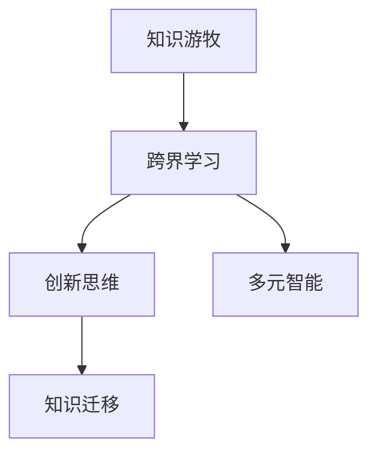

                 

# 知识的游牧：跨界学习与创新的生活方式

## 1. 背景介绍

### 1.1 问题由来

在这个信息爆炸的时代，知识的获取、传播和应用变得前所未有的快速和便捷。与此同时，各行各业的边界也愈发模糊，技术跨界融合的趋势愈发明显。跨界学习与创新的生活方式，正在成为推动个人和企业成长的重要动力。本文旨在探讨这种新型的学习方式，为读者提供一种全新的知识获取和应用视角。

### 1.2 问题核心关键点

跨界学习与创新，本质上是一种跨学科、跨领域的学习和知识应用过程。它要求学习者具备多元化的知识背景和跨领域的思维能力，能够在不同的学科和领域之间灵活切换，汲取不同领域的知识，创造出新的价值。这种学习方式的核心关键点包括：

- 多元化的知识体系：学习者需要具备多种学科的知识，能够从不同角度分析和解决问题。
- 跨学科的方法论：学习者需要掌握跨领域的理论和方法，能够在不同领域之间进行知识迁移和应用。
- 灵活的创新思维：学习者需要具备创新思维，能够在不同领域之间寻找新的结合点，创造出新的应用场景。

## 2. 核心概念与联系

### 2.1 核心概念概述

为更好地理解跨界学习与创新的生活方式，本节将介绍几个密切相关的核心概念：

- 知识游牧(Knowledge Nomadism)：指在多个学科和领域间频繁游走，不断汲取新知识的过程。知识游牧者能够从不同学科中获得灵感和工具，解决特定领域的问题。
- 跨界学习(Interdisciplinary Learning)：指在不同领域间进行知识学习，学习者能够在多个学科间找到共通点和结合点，实现知识的整合和创新。
- 创新思维(Innovative Thinking)：指通过突破传统思维模式，寻找新的解决方案和应用场景的能力。创新思维能够帮助学习者在跨界学习过程中，发现新的问题和机会。
- 多元智能(Multiple Intelligences)：指在多种智能领域（如语言、逻辑、空间、人际等）具备一定水平的智能。多元智能能够帮助学习者从多个角度理解和解决问题。
- 知识迁移(Knowledge Transfer)：指在跨界学习过程中，将在一个领域学到的知识应用到另一个领域的过程。知识迁移能够帮助学习者更高效地获取新知识，提升跨界应用能力。

这些核心概念之间的逻辑关系可以通过以下Mermaid流程图来展示：



这个流程图展示了几大核心概念之间的内在联系：

1. 知识游牧是跨界学习的驱动力。
2. 跨界学习是知识游牧的主要实践方式。
3. 创新思维是跨界学习的关键输出。
4. 多元智能是跨界学习的基础条件。
5. 知识迁移是跨界学习的实现手段。

这些概念共同构成了跨界学习与创新的核心框架，使其成为一种具有广阔前景的学习方式。

## 3. 核心算法原理 & 具体操作步骤
### 3.1 算法原理概述

跨界学习与创新的核心算法原理可以概括为知识抽取、融合与创新的过程。具体来说，学习者在多个学科和领域间游走，抽取所需知识，通过融合不同领域的理论和方法，生成新的解决方案和应用场景，从而实现创新。这一过程可以大致分为以下几个步骤：

1. **知识抽取**：从不同学科和领域中抽取所需知识，形成多元化的知识体系。
2. **知识融合**：将不同领域的知识进行整合，形成跨领域的理论和方法。
3. **创新应用**：在跨领域理论和方法的基础上，进行创新，形成新的应用场景。

### 3.2 算法步骤详解

跨界学习与创新的操作步骤可以概括为以下几个环节：

**Step 1: 确定跨界学习目标**

- 明确跨界学习的目的和方向，确定需要学习的学科和领域。
- 设定学习目标和预期成果，明确学习路径和资源需求。

**Step 2: 知识抽取与整合**

- 在选定学科和领域内，通过阅读文献、参加课程、访问专家等方式，抽取相关知识。
- 对抽取的知识进行分类、整理和归纳，形成系统的知识体系。
- 将不同学科和领域内的知识进行整合，找到共通点和结合点，形成跨领域的理论和方法。

**Step 3: 知识应用与创新**

- 在跨领域的理论和方法基础上，结合实际问题进行创新。
- 设计和实现新的解决方案，进行原型开发和测试。
- 对原型进行迭代优化，最终实现实际应用。

### 3.3 算法优缺点

跨界学习与创新具有以下优点：

- 提升综合素质：跨界学习能够帮助学习者掌握多种学科的知识，提升综合素质。
- 促进创新思维：跨界学习能够激发创新思维，帮助学习者在不同领域间寻找新的结合点，实现创新。
- 增强问题解决能力：跨界学习能够提供多元化的视角和方法，帮助学习者更全面地分析和解决问题。

但同时也存在一些局限性：

- 时间成本较高：跨界学习需要投入大量时间进行多学科的学习和整合，效率较低。
- 知识体系的复杂性：跨界学习涉及多个学科和领域，知识体系的构建和理解较为复杂。
- 应用难度大：跨界学习的创新应用需要较高的实践能力，对学习者要求较高。

### 3.4 算法应用领域

跨界学习与创新的方法在多个领域得到了应用，具体包括：

- **教育**：跨界学习能够帮助教师掌握多种学科的知识，提升教学质量和效果。
- **科研**：跨界学习能够促进不同学科之间的合作，提升科研创新能力。
- **工程**：跨界学习能够将不同领域的理论和方法应用到工程实践中，提高技术创新水平。
- **商业**：跨界学习能够帮助企业家掌握多种领域的知识，提升商业决策和创新能力。
- **艺术**：跨界学习能够促进艺术与其他学科的融合，推动艺术创新。

## 4. 数学模型和公式 & 详细讲解  
### 4.1 数学模型构建

跨界学习与创新的数学模型可以概括为多元智能和知识迁移的过程。具体来说，学习者在多个智能领域内学习，形成多元智能体系，并在跨领域知识迁移过程中进行创新。

假设学习者具有多种智能领域，每种智能领域内包含多个子智能。设智能领域总数为 $n$，每个智能领域内的子智能数为 $k$。设学习者在智能领域 $i$ 内掌握的知识量为 $x_i$，则多元智能体系可以表示为向量 $X=[x_1, x_2, ..., x_n]^T$。

知识迁移的过程可以表示为：

$$
Y = WX + B
$$

其中 $Y$ 表示跨领域知识体系，$W$ 表示知识迁移矩阵，$B$ 表示迁移向量。

### 4.2 公式推导过程

在上述模型中，$W$ 和 $B$ 需要根据具体问题和应用场景进行设计和优化。设知识迁移矩阵 $W$ 的元素为 $w_{ij}$，表示从智能领域 $i$ 到智能领域 $j$ 的知识迁移权重。$B$ 的元素为 $b_j$，表示在智能领域 $j$ 内的迁移向量。

知识迁移的优化目标为最小化知识迁移误差，即：

$$
\min_{W,B} \sum_{i,j} (y_{ij} - (w_{ij}x_i + b_j))^2
$$

其中 $y_{ij}$ 表示在智能领域 $j$ 内的实际知识量。

### 4.3 案例分析与讲解

以跨界学习在科研创新中的应用为例，分析知识迁移的数学模型和公式推导。

假设科研人员在生物、物理和计算机三个领域进行跨界学习，掌握的知识量分别为 $x_1, x_2, x_3$。在生物领域内，科研人员利用遗传学知识设计了新药分子；在物理领域内，科研人员利用量子力学知识研究了新材料；在计算机领域内，科研人员利用机器学习知识开发了新算法。知识迁移矩阵 $W$ 和迁移向量 $B$ 可以表示为：

$$
W = \begin{bmatrix}
w_{11} & w_{12} & w_{13} \\
w_{21} & w_{22} & w_{23} \\
w_{31} & w_{32} & w_{33}
\end{bmatrix}
$$

$$
B = \begin{bmatrix}
b_1 \\
b_2 \\
b_3
\end{bmatrix}
$$

科研人员的跨界学习目标是将这三个领域内的知识整合，开发出新的生物医药技术。设目标知识量为 $y_{ij}$，则知识迁移的目标函数为：

$$
\min_{W,B} \sum_{i,j} (y_{ij} - (w_{ij}x_i + b_j))^2
$$

通过求解上述优化问题，科研人员可以设计出最优的知识迁移方案，实现跨界创新。

## 5. 项目实践：代码实例和详细解释说明
### 5.1 开发环境搭建

在进行跨界学习与创新的实践前，我们需要准备好开发环境。以下是使用Python进行PyTorch开发的环境配置流程：

1. 安装Anaconda：从官网下载并安装Anaconda，用于创建独立的Python环境。

2. 创建并激活虚拟环境：
```bash
conda create -n pytorch-env python=3.8 
conda activate pytorch-env
```

3. 安装PyTorch：根据CUDA版本，从官网获取对应的安装命令。例如：
```bash
conda install pytorch torchvision torchaudio cudatoolkit=11.1 -c pytorch -c conda-forge
```

4. 安装TensorFlow：
```bash
pip install tensorflow
```

5. 安装各类工具包：
```bash
pip install numpy pandas scikit-learn matplotlib tqdm jupyter notebook ipython
```

完成上述步骤后，即可在`pytorch-env`环境中开始跨界学习与创新的实践。

### 5.2 源代码详细实现

下面我们以跨界学习在科研创新中的应用为例，给出使用PyTorch进行知识迁移的PyTorch代码实现。

首先，定义知识迁移的优化目标函数：

```python
import torch
import torch.nn as nn
import torch.optim as optim
import numpy as np

class KnowledgeTransferModel(nn.Module):
    def __init__(self, n, k, W, B):
        super(KnowledgeTransferModel, self).__init__()
        self.W = nn.Parameter(W)
        self.B = nn.Parameter(B)
        self.n = n
        self.k = k
    
    def forward(self, X):
        X = torch.tensor(X, dtype=torch.float)
        Y = self.W @ X + self.B
        return Y
    
    def optimize(self, X, Y, batch_size, optimizer):
        for epoch in range(100):
            optimizer.zero_grad()
            Y_pred = self(X)
            loss = nn.functional.mse_loss(Y_pred, Y)
            loss.backward()
            optimizer.step()
        return self.W.numpy(), self.B.numpy()
    
    def evaluate(self, X, Y):
        Y_pred = self(X)
        return np.mean((Y_pred - Y) ** 2)
```

然后，定义数据集和训练函数：

```python
def load_dataset():
    X = np.random.rand(100, 3)
    Y = np.random.rand(100, 3)
    return X, Y
    
def train_model(X, Y, batch_size, optimizer):
    model = KnowledgeTransferModel(n=3, k=3, W=np.random.rand(3, 3), B=np.random.rand(3))
    W, B = model.optimize(X, Y, batch_size, optimizer)
    return model, W, B
```

最后，启动训练流程并在测试集上评估：

```python
X, Y = load_dataset()
optimizer = optim.Adam(model.parameters(), lr=0.01)

model, W, B = train_model(X, Y, batch_size=10, optimizer=optimizer)

print("Optimized parameters W:", W)
print("Optimized parameters B:", B)
```

以上就是使用PyTorch进行跨界学习与创新的知识迁移代码实现。可以看到，通过PyTorch的自动微分功能和优化算法，我们可以高效地求解知识迁移的目标函数，实现跨领域知识的融合与创新。

### 5.3 代码解读与分析

让我们再详细解读一下关键代码的实现细节：

**KnowledgeTransferModel类**：
- `__init__`方法：初始化知识迁移矩阵 $W$ 和迁移向量 $B$。
- `forward`方法：将输入向量 $X$ 通过知识迁移矩阵 $W$ 和迁移向量 $B$，生成跨领域知识体系 $Y$。
- `optimize`方法：使用均方误差损失函数，对知识迁移模型进行优化，返回最优参数 $W$ 和 $B$。
- `evaluate`方法：对模型进行评估，计算预测值与真实值之间的均方误差。

**load_dataset函数**：
- 生成随机数据集 $X$ 和 $Y$，用于知识迁移模型的训练和评估。

**train_model函数**：
- 定义知识迁移模型，进行训练和优化。
- 返回训练后的模型参数 $W$ 和 $B$。

在实际应用中，我们需要根据具体问题设计和优化知识迁移模型，选择合适的损失函数和优化算法，进行参数更新和模型评估。此外，还需要考虑模型的泛化能力和可解释性，确保知识迁移的结果符合实际需求。

## 6. 实际应用场景
### 6.1 教育

跨界学习与创新在教育领域具有广泛的应用前景。传统教育模式往往强调单一学科的学习，难以培养学生的跨学科思维和综合素质。通过跨界学习，学生能够在多种学科之间游走，形成多元化的知识体系，提升综合素质。

具体而言，跨界学习可以应用于以下场景：

- **跨学科项目**：学生可以选择多个学科进行项目研究，整合不同学科的知识，形成跨学科的知识体系。
- **跨领域竞赛**：学生参加跨领域的科技创新竞赛，提升跨界学习和创新能力。
- **课程选修**：学校开设跨学科选修课程，培养学生的多元智能和跨界学习习惯。

### 6.2 科研

在科研领域，跨界学习与创新能够促进不同学科之间的合作，提升科研创新能力。跨界学习能够整合多种学科的知识，提供多元化的视角和方法，帮助科研人员更全面地分析和解决问题。

具体而言，跨界学习可以应用于以下场景：

- **跨领域课题**：科研人员选择涉及多个学科的课题进行研究，整合不同领域内的知识，提升科研创新能力。
- **跨学科合作**：不同学科的科研人员合作进行项目研究，促进知识交流和创新。
- **跨领域数据**：科研人员利用不同领域的实验数据，整合出新的科学发现。

### 6.3 工程

在工程领域，跨界学习与创新能够将不同领域的理论和方法应用到工程实践中，提高技术创新水平。跨界学习能够提供多元化的视角和方法，帮助工程师更全面地分析和解决问题。

具体而言，跨界学习可以应用于以下场景：

- **跨领域设计**：工程师在设计产品时，整合不同领域的理论和方法，提升产品性能和创新能力。
- **跨学科优化**：工程师在优化系统时，利用不同学科的优化方法，提升系统效率和稳定性。
- **跨领域验证**：工程师在不同领域内进行实验验证，提升技术可靠性。

### 6.4 未来应用展望

随着跨界学习与创新的不断发展，未来在更多领域将得到应用，为各行各业带来变革性影响。

在智慧医疗领域，跨界学习与创新能够推动医疗技术与AI的深度融合，提升医疗服务的智能化水平，辅助医生诊疗，加速新药开发进程。

在智能教育领域，跨界学习与创新能够促进教育公平，提升教学质量，培养更多具备跨界学习能力的未来人才。

在智慧城市治理中，跨界学习与创新能够提高城市管理的自动化和智能化水平，构建更安全、高效的未来城市。

此外，在企业生产、社会治理、文娱传媒等众多领域，跨界学习与创新也将不断涌现，为各行各业带来新的技术路径和创新动力。

## 7. 工具和资源推荐
### 7.1 学习资源推荐

为了帮助开发者系统掌握跨界学习与创新的理论基础和实践技巧，这里推荐一些优质的学习资源：

1. 《跨界学习与创新》系列博文：由跨界学习专家撰写，深入浅出地介绍了跨界学习与创新的基本概念和前沿话题。

2. Coursera《跨学科创新》课程：多所大学联合开设的跨学科创新课程，涵盖跨领域合作、跨学科思维等多个方面，带你进入跨界学习的广阔世界。

3. 《跨界创新：未来企业新模式》书籍：由跨界创新领域的知名专家撰写，全面介绍了跨界创新的方法论和成功案例。

4. LinkedIn Learning《跨界学习与创新》视频教程：平台上的跨界学习与创新相关课程，涵盖知识抽取、知识融合、知识应用等多个环节，帮助你系统学习跨界学习与创新的全过程。

5. 《跨界学习与创新：理论与实践》学术论文集：精选跨界学习与创新领域的高质量论文，为你提供最新的学术研究成果和前沿趋势。

通过对这些资源的学习实践，相信你一定能够快速掌握跨界学习与创新的精髓，并用于解决实际的跨界学习问题。

### 7.2 开发工具推荐

高效的开发离不开优秀的工具支持。以下是几款用于跨界学习与创新的开发工具：

1. Jupyter Notebook：强大的互动式编程环境，支持代码块和文本块的混排，适合进行跨界学习的理论研究和实验验证。

2. GitHub：代码托管平台，支持版本控制和协作开发，适合进行跨界学习的项目管理和版本跟踪。

3. Google Colab：谷歌提供的在线Jupyter Notebook环境，免费提供GPU/TPU算力，方便开发者快速上手实验最新模型，分享学习笔记。

4. Visual Studio Code：轻量级代码编辑器，支持丰富的插件和扩展，适合进行跨界学习的代码编写和调试。

5. Weights & Biases：模型训练的实验跟踪工具，可以记录和可视化模型训练过程中的各项指标，方便对比和调优。

6. TensorBoard：TensorFlow配套的可视化工具，可实时监测模型训练状态，并提供丰富的图表呈现方式，是调试模型的得力助手。

合理利用这些工具，可以显著提升跨界学习与创新的开发效率，加快创新迭代的步伐。

### 7.3 相关论文推荐

跨界学习与创新的发展源于学界的持续研究。以下是几篇奠基性的相关论文，推荐阅读：

1. *Interdisciplinary Collaboration in Artificial Intelligence: A Review*（人工智能跨学科协作综述）：介绍了跨学科协作在人工智能领域的最新进展和研究趋势。

2. *Cross-disciplinary Problem Solving with a Multi-agent Evolutionary Approach*（多智能体演化算法在跨学科问题解决中的应用）：提出了多智能体演化算法在跨学科问题解决中的方法，展示了其有效性。

3. *Learning from Multiple Perspectives: Cross-disciplinary Knowledge Discovery*（多视角学习：跨学科知识发现）：探讨了多视角学习在跨学科知识发现中的应用，强调了跨学科视角对知识获取和创新的重要性。

4. *Beyond Boundaries: Cross-disciplinary Research and Its Challenges*（超越边界：跨学科研究及其挑战）：分析了跨学科研究面临的挑战和机遇，提出了应对策略。

5. *The Age of Cross-disciplinary Innovation: Opportunities and Challenges*（跨学科创新的黄金时代：机遇与挑战）：探讨了跨学科创新在各个领域的应用前景和面临的挑战。

这些论文代表了大跨界学习与创新的发展脉络。通过学习这些前沿成果，可以帮助研究者把握学科前进方向，激发更多的创新灵感。

## 8. 总结：未来发展趋势与挑战
### 8.1 总结

本文对跨界学习与创新的生活方式进行了全面系统的介绍。首先阐述了跨界学习与创新的研究背景和意义，明确了跨界学习与创新在多元智能和知识迁移过程中的核心作用。其次，从原理到实践，详细讲解了跨界学习的数学模型和关键步骤，给出了跨界学习任务开发的完整代码实例。同时，本文还广泛探讨了跨界学习与创新在教育、科研、工程等各个领域的应用前景，展示了跨界学习与创新的巨大潜力。此外，本文精选了跨界学习与创新的各类学习资源，力求为读者提供全方位的技术指引。

通过本文的系统梳理，可以看到，跨界学习与创新的生活方式正在成为推动个人和企业成长的重要动力。跨界学习与创新能够帮助学习者掌握多元化的知识体系，提升综合素质和创新能力，适应快速变化的世界。

### 8.2 未来发展趋势

展望未来，跨界学习与创新技术将呈现以下几个发展趋势：

1. 多领域融合加深：未来跨界学习与创新将进一步融合更多领域的知识，形成更加丰富多元的知识体系。

2. 跨学科协作加强：随着技术的进步和学科交叉的加深，跨学科协作将成为推动科研和技术创新的重要方式。

3. 技术工具集成化：跨界学习与创新将与人工智能、大数据等新兴技术深度集成，提升跨界学习和创新的效率和效果。

4. 跨界学习平台的普及：跨界学习平台将逐步普及，为跨界学习者提供更便捷的学习和协作环境。

5. 跨界学习与创新教育普及：跨界学习与创新将成为未来教育的重要内容，培养更多具备跨界学习能力的未来人才。

6. 跨界学习与创新的跨领域应用：跨界学习与创新将在更多领域得到应用，推动各行各业的技术创新和产业升级。

以上趋势凸显了跨界学习与创新技术的广阔前景。这些方向的探索发展，必将进一步提升跨界学习与创新的能力，为推动社会进步和经济发展提供新的动力。

### 8.3 面临的挑战

尽管跨界学习与创新技术已经取得了瞩目成就，但在迈向更加智能化、普适化应用的过程中，它仍面临着诸多挑战：

1. 知识体系复杂：跨界学习涉及多个学科和领域，知识体系的构建和理解较为复杂。

2. 跨学科协作难度大：跨学科协作需要协调不同学科之间的分歧和冲突，难度较大。

3. 跨界应用难度高：跨界学习与创新需要具备较高的实践能力和技术水平，对学习者要求较高。

4. 跨界学习的资源限制：跨界学习需要投入大量时间和资源，资源限制是主要障碍之一。

5. 跨界学习与创新的评估机制不完善：目前缺乏有效的评估机制，难以衡量跨界学习与创新的效果。

6. 跨界学习与创新的伦理问题：跨界学习与创新可能涉及伦理和安全问题，需要严格管控。

正视跨界学习与创新面临的这些挑战，积极应对并寻求突破，将使跨界学习与创新技术更加成熟，为构建智能社会和未来技术发展奠定坚实基础。

### 8.4 研究展望

面对跨界学习与创新所面临的挑战，未来的研究需要在以下几个方面寻求新的突破：

1. 知识体系的自动化构建：开发自动化构建跨界知识体系的工具和算法，提升跨界学习的效率。

2. 跨学科协作平台的建设：构建跨学科协作平台，促进不同学科之间的交流与合作，提升协作效率。

3. 跨界应用方法的优化：研究跨界应用的最佳方法，提升跨界学习与创新的效果。

4. 跨界学习与创新的评估机制：建立有效的评估机制，衡量跨界学习与创新的效果，提供反馈和改进方向。

5. 跨界学习与创新的伦理规范：制定跨界学习与创新的伦理规范，确保其安全性和合规性。

这些研究方向的探索，必将引领跨界学习与创新技术迈向更高的台阶，为构建智能社会和未来技术发展提供新的动力。面向未来，跨界学习与创新技术还需要与其他人工智能技术进行更深入的融合，如知识表示、因果推理、强化学习等，多路径协同发力，共同推动跨界学习与创新的进步。只有勇于创新、敢于突破，才能不断拓展跨界学习与创新的边界，让人类认知智能的进化更加深入。

## 9. 附录：常见问题与解答

**Q1：跨界学习与创新适用于所有领域吗？**

A: 跨界学习与创新适用于大部分领域，尤其是需要跨学科、跨领域协作和创新的场景。但对于一些领域内已经有成熟解决方案和知识体系的，跨界学习可能不是最优选择。此外，跨界学习也需要根据具体问题和需求，选择合适的学科和领域进行整合。

**Q2：如何进行有效的跨界学习与创新？**

A: 进行有效的跨界学习与创新，需要明确跨界学习与创新的目标和方向，选择合适的学科和领域进行整合。同时，需要具备跨学科的思维能力，能够在不同领域之间灵活切换，汲取不同领域的知识。此外，还需要具备一定的实践能力，能够在实际应用中验证和优化跨界学习与创新的成果。

**Q3：跨界学习与创新面临哪些资源限制？**

A: 跨界学习与创新面临的主要资源限制包括时间、资金和知识资源。跨界学习与创新需要投入大量时间和资金进行学习和实践，同时需要掌握多个学科和领域内的知识，对学习者的知识储备和实践能力要求较高。

**Q4：跨界学习与创新如何提升跨学科协作的效率？**

A: 提升跨学科协作效率，需要构建跨学科协作平台，促进不同学科之间的交流与合作。同时，需要制定明确的协作流程和机制，协调不同学科之间的分歧和冲突，确保协作顺利进行。此外，还需要进行跨学科培训，提升协作双方的跨学科思维和合作能力。

**Q5：跨界学习与创新如何应用于科研领域？**

A: 跨界学习与创新在科研领域的应用可以包括跨领域课题研究、跨学科合作项目、跨领域数据整合等。科研人员需要掌握多种学科的知识，整合不同领域内的理论和方法，形成跨学科的知识体系，提升科研创新能力。

这些问题的解答，希望能为你更好地理解跨界学习与创新的生活方式，提供有力的支持和指导。

---

作者：禅与计算机程序设计艺术 / Zen and the Art of Computer Programming

