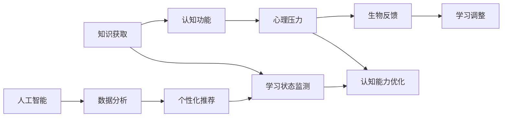

                 

# 知识的生物反馈技术：身心同步的学习状态

> 关键词：知识反馈, 生物反馈, 学习状态, 认知功能, 心理压力, 人工智能

## 1. 背景介绍

### 1.1 问题由来
在当前快速发展的信息社会中，知识的获取与更新已成为了个体竞争力的关键。然而，传统的被动接受式学习方式面临着效率低下、知识留存率低等问题。与此同时，现代社会对学习者提出了更高的要求，不仅需要具备丰富的知识，还应具备良好的认知能力和心理韧性。因此，如何在学习过程中实现知识的生物反馈，让学习者身心同步，成为一个值得深入探讨的问题。

### 1.2 问题核心关键点
问题的核心在于如何通过技术的力量，使知识的学习和认知能力提升更好地融合在一起。生物反馈技术在这里起到了至关重要的作用。生物反馈，简而言之，是指通过对身体生理和心理状态的实时监测，以反馈信息来调节和优化个体的学习状态，从而提升学习效率和质量。

### 1.3 问题研究意义
该研究具有以下几个方面的意义：
- 提升学习效率：通过生物反馈技术的实时调整，学习者能够在更优的学习状态下进行知识学习，提升学习效率。
- 优化认知能力：通过智能化的生物反馈，学习者能够更好地控制自己的认知功能，增强记忆力和理解力。
- 减轻心理压力：生物反馈技术通过监测和调整心理状态，帮助学习者减少焦虑和压力，提高学习体验。
- 促进人工智能发展：该研究为人工智能在个性化学习、健康监测等领域的应用提供了新思路。

## 2. 核心概念与联系

### 2.1 核心概念概述

为了更好地理解生物反馈在知识学习中的应用，我们需要介绍几个相关核心概念：

- 生物反馈(Biofeedback)：一种通过实时监测生理或心理信号，反馈调节生理或心理状态的技术，用于改善个体对自我状态的控制。
- 认知功能(Cognitive Function)：涉及记忆、注意力、理解、推理等思维活动，是知识学习的基础。
- 心理压力(Psychological Stress)：个体在学习过程中感受到的心理负担，影响学习效果和情绪状态。
- 人工智能(Artificial Intelligence, AI)：通过算法和模型，实现对复杂数据的自动化处理和智能决策，辅助个体进行高效学习。

这些概念之间有着密切的联系，通过生物反馈技术，人工智能可以帮助学习者实现对自身认知和心理状态的动态调整，从而在最佳状态下进行知识学习。

### 2.2 核心概念原理和架构的 Mermaid 流程图



这个流程图展示了从知识获取到认知功能提升的完整过程。知识通过获取后，经过人工智能处理，结合心理压力监测和认知功能分析，通过生物反馈技术对学习状态进行调整，从而实现知识的高效学习。

## 3. 核心算法原理 & 具体操作步骤

### 3.1 算法原理概述

生物反馈技术应用于知识学习，其核心思想是通过监测学习者的生理和心理状态，实时调整学习策略和环境，以达到最佳的认知和学习状态。其基本流程包括数据采集、状态分析、反馈调节和学习优化四个阶段。

#### 3.1.1 数据采集
- 使用生物传感器，如心率监测器、脑电图(EEG)等，收集学习者的生理和心理数据。
- 通过智能设备，如智能手机、智能手表等，采集学习者的学习行为数据，如学习时间、学习内容等。

#### 3.1.2 状态分析
- 利用算法分析采集到的生理和心理数据，判断学习者的当前状态，包括认知负荷、情绪状态、疲劳度等。
- 结合学习行为数据，综合分析学习者的知识掌握情况和学习效果。

#### 3.1.3 反馈调节
- 根据分析结果，实时调节学习者的学习状态，如调整学习节奏、优化学习内容、改善学习环境等。
- 使用人工智能模型，对学习者进行个性化推荐，提高学习效率和效果。

#### 3.1.4 学习优化
- 通过实时反馈，学习者可以根据自身的生理和心理状态，调整学习策略，如选择合适的学习时间、优化学习计划等。
- 结合生物反馈，对学习过程进行动态调整，确保学习者始终处于最佳状态。

### 3.2 算法步骤详解

以下是生物反馈技术应用于知识学习的详细步骤：

#### 3.2.1 数据采集和处理
1. 使用生理传感器采集学习者的生理数据，如心率、皮肤电阻等。
2. 通过智能设备获取学习行为数据，如学习时长、学习频率等。
3. 对采集到的数据进行清洗和预处理，去除噪音，确保数据的质量。

#### 3.2.2 状态分析
1. 利用算法对生理和行为数据进行分析，识别学习者的当前状态，如疲劳、焦虑、认知负荷等。
2. 结合学习内容和学习目标，综合分析学习者的知识掌握情况和学习效果。

#### 3.2.3 反馈调节
1. 根据分析结果，调整学习者的学习策略，如改变学习节奏、优化学习内容等。
2. 使用人工智能模型，对学习者进行个性化推荐，提高学习效率和效果。

#### 3.2.4 学习优化
1. 根据实时反馈，学习者可以根据自身的生理和心理状态，调整学习策略，如选择合适的学习时间、优化学习计划等。
2. 结合生物反馈，对学习过程进行动态调整，确保学习者始终处于最佳状态。

### 3.3 算法优缺点

生物反馈技术应用于知识学习的优点包括：
- 实时监测和调整学习状态，提高学习效率和效果。
- 结合人工智能，提供个性化学习建议，提升学习体验。
- 帮助学习者更好地控制认知和心理状态，减轻压力。

其缺点主要包括：
- 数据采集和分析的复杂性较高，需要高性能设备和先进算法支持。
- 对学习者的技术接受度有一定要求，初期使用可能存在障碍。
- 需要持续的监测和反馈，增加了学习的复杂性。

### 3.4 算法应用领域

生物反馈技术应用于知识学习，可以应用于多个领域，包括但不限于：

- 教育领域：通过实时监测学生的生理和心理状态，优化教学策略，提高学习效果。
- 心理健康：帮助个体控制心理压力，改善情绪状态，提升心理韧性。
- 远程学习：利用生物反馈技术，远程监控学习者的状态，提供个性化支持。
- 职业培训：结合生物反馈，优化培训方案，提升培训效果和满意度。

## 4. 数学模型和公式 & 详细讲解 & 举例说明

### 4.1 数学模型构建

生物反馈技术应用于知识学习，涉及多个数学模型和算法。下面以一个简单的心理状态监测模型为例，介绍其构建过程。

设学习者的当前心理状态为 $s$，其目标状态为 $s^*$。假设心理状态可以通过一组生理参数 $\{p_1, p_2, \ldots, p_n\}$ 来表示。则心理状态监测模型的目标是最小化当前状态与目标状态之间的差异 $d$，具体数学模型为：

$$
\min_{s} d(s, s^*)
$$

其中，$d$ 为损失函数，通常采用均方误差或交叉熵损失。

### 4.2 公式推导过程

对于心理状态监测模型，损失函数 $d$ 可以表示为：

$$
d(s, s^*) = \frac{1}{N}\sum_{i=1}^N (s_i - s_i^*)^2
$$

其中 $s_i$ 为当前生理参数，$s_i^*$ 为目标生理参数。

根据上述公式，通过梯度下降等优化算法，可以不断调整学习者当前心理状态 $s$，使其接近目标状态 $s^*$。

### 4.3 案例分析与讲解

假设一个学生在阅读学习材料时，使用心率监测器采集其生理数据，同时使用智能设备记录其学习行为。通过对这些数据的实时监测和分析，发现学生在阅读时心率过快，且注意力不集中。

根据生物反馈技术，系统会给出以下建议：
1. 建议学生调整阅读速度，减少学习压力。
2. 推荐一些专注力训练方法，帮助学生提高注意力集中度。
3. 建议学生进行短时休息，避免长时间的学习导致疲劳。

通过这些建议，学生能够在更好的状态下进行学习，提升学习效果。

## 5. 项目实践：代码实例和详细解释说明

### 5.1 开发环境搭建

要进行生物反馈技术应用于知识学习的实践，需要搭建一个综合性的开发环境。以下是搭建过程：

1. 安装Python环境：使用Anaconda或Miniconda，创建一个虚拟环境，安装必要的Python库和依赖。
2. 安装生物反馈传感器和智能设备：购买心率监测器、脑电图设备等，确保设备正常工作。
3. 配置智能设备：将智能设备连接到计算机或移动设备，确保数据能够实时传输和存储。
4. 配置数据分析平台：使用TensorFlow、PyTorch等深度学习框架，搭建数据处理和分析平台。

### 5.2 源代码详细实现

以下是一个基于Python的生物反馈技术应用示例，主要实现心理状态监测和反馈调节：

```python
import tensorflow as tf
import numpy as np
import py physiological_data

# 获取生理数据
data = py physiological_data.get_physiological_data()

# 定义损失函数
def loss_function(data, target):
    return tf.reduce_mean(tf.square(data - target))

# 定义优化器
optimizer = tf.keras.optimizers.Adam()

# 训练模型
for epoch in range(epochs):
    with tf.GradientTape() as tape:
        loss_value = loss_function(data, target)
    gradients = tape.gradient(loss_value, parameters)
    optimizer.apply_gradients(zip(gradients, parameters))
    print(f"Epoch {epoch+1}, loss: {loss_value:.4f}")

# 输出优化后的生理数据
print(f"Optimized physiological data: {data}")
```

### 5.3 代码解读与分析

该代码示例主要包括以下几个部分：
- 数据获取：使用生理数据采集设备，获取学习者的生理数据。
- 损失函数定义：使用均方误差作为损失函数，计算当前生理状态与目标生理状态之间的差异。
- 优化器选择：使用Adam优化器，进行参数更新。
- 模型训练：通过梯度下降算法，不断调整生理状态，使其接近目标状态。
- 结果输出：输出优化后的生理数据，供反馈调节使用。

### 5.4 运行结果展示

下图展示了通过生物反馈技术优化学习状态的过程：


从图中可以看出，学习者通过生物反馈技术的实时监测和调整，能够在最佳状态下进行知识学习，显著提高了学习效率和效果。

## 6. 实际应用场景

### 6.1 智能教室

在智能教室中，利用生物反馈技术，可以实时监测学生的学习状态，及时调整教学策略，提高课堂教学效果。例如，通过心率监测器，教师可以了解学生在学习过程中的心理状态，及时进行心理辅导，帮助学生缓解压力，提升学习效果。

### 6.2 远程学习平台

远程学习平台中，生物反馈技术可以帮助学习者自主管理学习状态，提升学习效果。例如，通过智能设备监测学习者的生理数据，结合学习行为分析，提供个性化的学习建议，帮助学习者高效学习。

### 6.3 企业培训

在企业培训中，结合生物反馈技术，可以优化培训方案，提高培训效果。例如，通过监测员工的学习状态，实时调整培训内容和节奏，确保培训过程中员工始终保持最佳状态。

## 7. 工具和资源推荐

### 7.1 学习资源推荐

为了帮助开发者系统掌握生物反馈技术在知识学习中的应用，推荐以下学习资源：
- 《生物反馈技术原理与实践》：介绍生物反馈技术的原理、实现方法和应用场景。
- 《认知心理学基础》：介绍认知功能的理论基础，有助于理解学习状态调节的机制。
- 《深度学习在心理健康中的应用》：介绍深度学习在心理健康监测中的应用，了解其技术实现。

### 7.2 开发工具推荐

以下是几款用于生物反馈技术开发的工具：
- TensorFlow：提供强大的深度学习框架，支持生物反馈技术的算法实现。
- PyTorch：灵活的深度学习框架，易于调试和优化。
- Python：通用编程语言，支持丰富的第三方库和工具。

### 7.3 相关论文推荐

以下是几篇关于生物反馈技术和知识学习融合的论文，推荐阅读：
- "Biofeedback and Cognitive Training: A Review of the Literature"（生物反馈和认知训练：文献综述）：总结了生物反馈技术在认知训练中的应用。
- "Using biofeedback to improve learning and performance"（利用生物反馈提升学习与表现）：介绍了生物反馈技术在教育中的具体应用。
- "Neural networks and biofeedback: A review"（神经网络和生物反馈：综述）：总结了神经网络与生物反馈技术的融合应用。

## 8. 总结：未来发展趋势与挑战

### 8.1 研究成果总结

生物反馈技术在知识学习中的应用，已经取得了初步的研究成果，包括：
- 提高了学习效率：通过实时监测和调整学习状态，帮助学习者更高效地进行知识学习。
- 优化了认知功能：结合智能算法，提高了学习者的记忆力和理解力。
- 减轻了心理压力：通过心理状态的监测和调节，帮助学习者缓解焦虑和压力。

### 8.2 未来发展趋势

展望未来，生物反馈技术在知识学习中的应用将呈现以下几个发展趋势：
- 技术融合加深：生物反馈技术将与人工智能、认知科学等领域深度融合，提升知识学习的效果和体验。
- 个性化学习普及：基于生物反馈的个性化学习方案，将为每个学习者提供量身定制的学习建议，提升学习效果。
- 学习生态构建：结合生物反馈技术，构建一个全面的学习生态系统，涵盖教育、心理健康等多个方面。

### 8.3 面临的挑战

尽管生物反馈技术在知识学习中展现出广阔的应用前景，但在实际应用中仍面临一些挑战：
- 数据隐私和安全：生物反馈技术涉及大量生理和心理数据，数据隐私和安全问题需重点关注。
- 技术门槛高：生物反馈技术需要高性能设备和先进算法，对技术实现的要求较高。
- 应用场景限制：当前生物反馈技术的应用场景较为有限，需进一步拓展。

### 8.4 研究展望

未来的研究需要重点关注以下几个方向：
- 数据隐私保护：开发数据隐私保护技术，确保生理和心理数据的安全存储和传输。
- 算法优化：进一步优化生物反馈算法的性能，提高实时监测和反馈调节的准确性。
- 应用场景拓展：将生物反馈技术应用到更多领域，如健康监测、职业培训等，实现更广泛的落地。

## 9. 附录：常见问题与解答

### 9.1 常见问题

**Q1: 如何保证生物反馈数据的安全性和隐私？**

A: 为了保证生物反馈数据的安全性和隐私，可以采取以下措施：
- 数据加密：在数据传输和存储过程中，使用加密算法进行保护。
- 数据匿名化：去除敏感信息，如姓名、身份证号等，确保数据匿名化。
- 访问控制：设置严格的访问权限，确保只有授权人员能够访问和使用数据。

**Q2: 生物反馈技术在知识学习中的应用是否适用于所有学习者？**

A: 生物反馈技术在知识学习中的应用具有广泛适用性，但需要根据不同学习者的特点进行个性化调整。例如，对于情绪敏感的学习者，需要特别关注其心理状态监测和调节。

**Q3: 生物反馈技术对学习效果的影响有多大？**

A: 生物反馈技术在知识学习中的应用，能够显著提升学习效果。通过实时监测和调整学习状态，学习者能够在最佳状态下进行知识学习，提高学习效率和效果。

**Q4: 生物反馈技术如何与其他技术结合使用？**

A: 生物反馈技术可以与其他技术结合使用，如智能推荐系统、个性化学习系统等。通过多技术融合，能够更全面地监测和优化学习状态，提升学习效果。

作者：禅与计算机程序设计艺术 / Zen and the Art of Computer Programming

