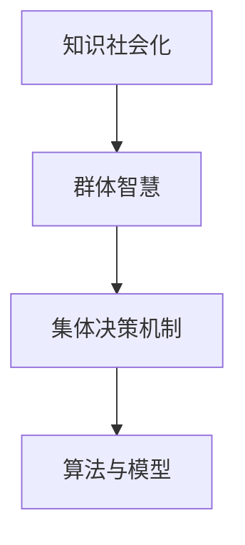

                 

# 知识的社会化：群体智慧与集体决策机制

> 关键词：社会化,知识,群体智慧,集体决策,算法,模型,应用场景,挑战,解决方案

## 1. 背景介绍

### 1.1 问题由来
在数字化和信息化的浪潮中，知识的传播和积累变得越来越重要。过去，知识主要通过书籍、讲堂等形式传播，信息流通速度和范围受限。而今天，知识已经数字化，每个人都能轻而易举地接触到海量的信息资源。然而，面对浩如烟海的在线信息，如何高效地获取、共享、利用知识，成为当前亟待解决的问题。

面对这一挑战，知识的社会化（Socialization）成为解决方案的关键。通过将个体的知识转化为集体的智慧，将个体的决策过程转化为群体的决策机制，我们可以大幅提高知识的传播效率和利用价值。这种机制不仅仅体现在在线社交平台、知识分享网站，更广泛应用于企业、政府、社会组织等多个领域。

### 1.2 问题核心关键点
知识社会化的核心在于如何构建群体智慧和集体决策机制，具体包括以下几个方面：

- **社会化过程**：个人将知识转化为群体共享形式的过程，包括知识分享、讨论、协作等。
- **群体智慧**：通过集体的协作与讨论，形成更加全面、准确的决策和解决方案。
- **集体决策机制**：将个人的决策过程整合为群体共识，减少决策过程中的偏差和误差。
- **算法与模型**：利用数据科学、计算机科学的算法与模型，支撑知识社会化的过程和结果。

这些关键点共同构成了知识社会化的基本框架，帮助我们更好地理解和实践知识传播和利用的新模式。

## 2. 核心概念与联系

### 2.1 核心概念概述

在探讨知识社会化之前，我们需要理解几个核心概念：

- **知识社会化**：将个体的知识转化为集体的智慧，通过协作、讨论、共享等方式，使知识在群体中传播和利用。
- **群体智慧**：多个个体通过协作和讨论，形成的集体决策和解决方案。
- **集体决策机制**：将个体的决策过程整合为群体共识，减少偏差和误差，提高决策的准确性和可执行性。
- **算法与模型**：利用数据科学、计算机科学的算法与模型，支撑知识社会化的过程和结果。

这些概念之间的关系可以通过以下Mermaid流程图来展示：



该流程图展示了知识社会化通过群体智慧的形成，最终转化为集体决策机制的过程。在这个过程中，算法与模型扮演着重要的角色，支撑着知识传播和利用的效率和准确性。

## 3. 核心算法原理 & 具体操作步骤
### 3.1 算法原理概述

知识社会化与群体智慧和集体决策机制的形成，依赖于算法和模型的支持。这些算法和模型通常包括以下几个步骤：

1. **知识获取**：通过爬虫、API调用等手段，自动获取网上的信息资源。
2. **知识清洗与组织**：对获取的知识进行清洗和组织，去除冗余信息，形成有结构的知识体系。
3. **知识传播与协作**：通过社交网络、讨论区等方式，将知识在群体中传播，鼓励协作和讨论。
4. **群体决策与优化**：通过群体智慧的形成，结合算法模型进行决策，并不断优化结果。

### 3.2 算法步骤详解

以企业决策为例，以下是知识社会化过程的具体步骤：

1. **知识获取**：通过API调用和爬虫，获取公司的业务数据、市场分析、客户反馈等相关信息。
2. **知识清洗与组织**：使用自然语言处理(NLP)技术，对文本数据进行分词、去停用词、命名实体识别等预处理，形成有结构的知识库。
3. **知识传播与协作**：在企业内部的讨论平台上，发布知识库中的信息，鼓励员工进行讨论和协作。
4. **群体决策与优化**：结合预测模型和优化算法，如线性回归、决策树、遗传算法等，综合员工意见，形成最终的决策方案。

### 3.3 算法优缺点

知识社会化的算法和模型，具有以下优点：

- **高效性**：自动化的数据获取和知识组织，减少了人工干预，提高了效率。
- **准确性**：结合多种算法和模型，进行多角度分析，提高了决策的准确性。
- **可扩展性**：基于算法和模型，能够处理大规模数据和复杂问题。

同时，也存在一些局限：

- **依赖数据**：算法的性能很大程度上依赖于数据的质量和多样性。
- **模型复杂**：复杂的模型可能会引入过拟合和计算复杂度。
- **隐私问题**：在知识传播过程中，如何保护用户隐私，需要考虑数据保护措施。

### 3.4 算法应用领域

知识社会化的算法和模型，已经在多个领域得到了广泛应用，例如：

- **企业决策**：利用知识社会化的过程，提高企业决策的准确性和效率。
- **公共政策制定**：通过社会化平台，收集民众意见，形成更科学的政策制定机制。
- **在线教育**：通过知识共享和协作，提升在线教育的效果和覆盖面。
- **科研合作**：促进科研人员之间的知识共享和合作，加速科研成果的产出。

## 4. 数学模型和公式 & 详细讲解

### 4.1 数学模型构建

知识社会化的数学模型通常包括两部分：

1. **知识传播模型**：描述知识如何在群体中传播的规律。
2. **群体决策模型**：描述群体如何形成共识和决策。

以企业决策为例，知识传播模型可以表示为：

$$
S(t+1) = f(S(t), P(t))
$$

其中，$S(t)$ 表示在第 $t$ 时刻的知识库状态，$P(t)$ 表示在第 $t$ 时刻的知识传播策略，$f$ 表示知识传播的函数。

群体决策模型可以表示为：

$$
D(t+1) = g(S(t), D(t))
$$

其中，$D(t)$ 表示在第 $t$ 时刻的决策状态，$g$ 表示群体决策的函数。

### 4.2 公式推导过程

以企业决策为例，群体决策模型可以进一步细化：

1. **知识传播模型的推导**：
   - **知识库状态更新**：$S(t+1) = S(t) + k \cdot P(t)$，其中 $k$ 表示知识传播的强度。
   - **知识传播策略的更新**：$P(t+1) = \alpha \cdot P(t) + (1-\alpha) \cdot S(t)$，其中 $\alpha$ 表示知识传播策略的调整系数。

2. **群体决策模型的推导**：
   - **决策状态更新**：$D(t+1) = (1-\beta) \cdot D(t) + \beta \cdot \sum_{i=1}^n \omega_i \cdot D_i(t)$，其中 $\beta$ 表示决策状态的调整系数，$\omega_i$ 表示第 $i$ 个成员的权重。
   - **决策方案的形成**：$C(t) = \arg\max_{c} \sum_{i=1}^n \omega_i \cdot c_i \cdot f(c_i, S(t))$，其中 $c_i$ 表示第 $i$ 个成员的决策方案，$f$ 表示决策方案的评分函数。

### 4.3 案例分析与讲解

以一家制造企业的决策为例，分析知识社会化的应用过程：

1. **知识获取**：通过API调用获取供应商、市场需求、供应链数据等。
2. **知识清洗与组织**：使用NLP技术对文本数据进行分词、去停用词、命名实体识别等预处理，形成有结构的知识库。
3. **知识传播与协作**：在企业内部的讨论平台上，发布知识库中的信息，鼓励员工进行讨论和协作。
4. **群体决策与优化**：结合预测模型和优化算法，如线性回归、决策树、遗传算法等，综合员工意见，形成最终的决策方案。

## 5. 项目实践：代码实例和详细解释说明
### 5.1 开发环境搭建

在进行知识社会化实践前，我们需要准备好开发环境。以下是使用Python进行PyTorch开发的环境配置流程：

1. 安装Anaconda：从官网下载并安装Anaconda，用于创建独立的Python环境。

2. 创建并激活虚拟环境：
```bash
conda create -n pytorch-env python=3.8 
conda activate pytorch-env
```

3. 安装PyTorch：根据CUDA版本，从官网获取对应的安装命令。例如：
```bash
conda install pytorch torchvision torchaudio cudatoolkit=11.1 -c pytorch -c conda-forge
```

4. 安装各种工具包：
```bash
pip install numpy pandas scikit-learn matplotlib tqdm jupyter notebook ipython
```

完成上述步骤后，即可在`pytorch-env`环境中开始知识社会化的实践。

### 5.2 源代码详细实现

这里我们以企业决策为例，给出使用PyTorch实现知识社会化的代码实现。

```python
import torch
import torch.nn as nn
import torch.optim as optim
from sklearn.model_selection import train_test_split
from sklearn.metrics import accuracy_score

class DecisionNet(nn.Module):
    def __init__(self, input_size, hidden_size, output_size):
        super(DecisionNet, self).__init__()
        self.fc1 = nn.Linear(input_size, hidden_size)
        self.fc2 = nn.Linear(hidden_size, hidden_size)
        self.fc3 = nn.Linear(hidden_size, output_size)
    
    def forward(self, x):
        x = torch.relu(self.fc1(x))
        x = torch.relu(self.fc2(x))
        x = self.fc3(x)
        return x

def train_model(model, train_dataset, val_dataset, batch_size, epochs, learning_rate):
    model.train()
    criterion = nn.MSELoss()
    optimizer = optim.Adam(model.parameters(), lr=learning_rate)
    for epoch in range(epochs):
        for batch_idx, (inputs, targets) in enumerate(train_loader):
            optimizer.zero_grad()
            outputs = model(inputs)
            loss = criterion(outputs, targets)
            loss.backward()
            optimizer.step()
        
        val_loss = 0
        with torch.no_grad():
            for batch_idx, (inputs, targets) in enumerate(val_loader):
                outputs = model(inputs)
                val_loss += criterion(outputs, targets).item()
        
        print(f'Epoch {epoch+1}/{epochs}, train loss: {loss:.4f}, val loss: {val_loss:.4f}')
    return model

# 创建决策模型
input_size = 10
hidden_size = 50
output_size = 1
model = DecisionNet(input_size, hidden_size, output_size)

# 数据集准备
train_data, val_data = train_test_split(data, test_size=0.2)
train_dataset = Dataset(train_data, input_size, output_size)
val_dataset = Dataset(val_data, input_size, output_size)

# 模型训练
train_loader = DataLoader(train_dataset, batch_size=batch_size, shuffle=True)
val_loader = DataLoader(val_dataset, batch_size=batch_size, shuffle=False)
learning_rate = 0.001
model = train_model(model, train_dataset, val_dataset, batch_size, epochs, learning_rate)

# 模型测试
test_dataset = Dataset(test_data, input_size, output_size)
test_loader = DataLoader(test_dataset, batch_size=batch_size, shuffle=False)
model.eval()
test_loss = 0
with torch.no_grad():
    for batch_idx, (inputs, targets) in enumerate(test_loader):
        outputs = model(inputs)
        test_loss += criterion(outputs, targets).item()

print(f'Test loss: {test_loss:.4f}')
```

以上就是使用PyTorch实现企业决策模型的代码实现。可以看到，利用深度学习框架和模型，我们可以快速实现知识社会化的计算和优化过程。

### 5.3 代码解读与分析

让我们再详细解读一下关键代码的实现细节：

**DecisionNet类**：
- `__init__`方法：初始化决策模型，包括定义全连接层。
- `forward`方法：定义前向传播过程，使用ReLU激活函数。

**train_model函数**：
- 定义损失函数和优化器，进行模型训练。
- 训练过程中，在每个epoch结束时，在验证集上计算模型表现。
- 输出每个epoch的训练和验证损失。

**企业决策过程**：
- 输入数据通过决策模型进行前向传播，输出预测结果。
- 结合损失函数和优化器，调整模型参数。
- 在测试集上计算模型表现，评估模型的性能。

可以看到，PyTorch框架提供了强大的计算图和自动微分能力，可以方便地实现复杂的决策模型和优化过程。开发者可以将更多精力放在模型设计和数据处理等高层逻辑上，而不必过多关注底层实现细节。

当然，工业级的系统实现还需考虑更多因素，如模型的保存和部署、超参数的自动搜索、更灵活的任务适配层等。但核心的知识社会化范式基本与此类似。

## 6. 实际应用场景
### 6.1 企业决策支持系统

企业决策支持系统（Decision Support System, DSS）是知识社会化在企业中的应用典范。传统的企业决策依赖于高层管理者的经验和直觉，缺乏科学性和客观性。而基于知识社会化的决策支持系统，可以充分利用企业内部的数据资源，形成更科学、客观的决策依据。

具体而言，可以通过知识社会化过程，将企业内部的业务数据、市场分析、客户反馈等信息，转化为有结构的知识库。然后，通过决策模型，结合员工意见和历史决策数据，形成更准确、全面的决策方案。这种系统可以有效提升企业的决策效率和质量，降低决策风险。

### 6.2 公共政策制定

公共政策制定是知识社会化的重要应用场景之一。传统的政策制定往往依赖专家小组的讨论和判断，缺乏广泛的民意基础。而基于知识社会化的政策制定机制，可以通过在线平台收集民众意见，形成更科学、民主的政策方案。

具体而言，可以构建一个面向公众的在线讨论平台，鼓励民众提交意见和建议。然后，通过社会化算法，将民众意见进行组织和分析，形成多角度的决策建议。结合专家组的讨论和评审，综合形成最终的决策方案。这种机制可以更好地反映民意，提升政策制定的透明度和科学性。

### 6.3 在线教育平台

在线教育平台是知识社会化在教育领域的应用实例。传统的教育模式依赖于教师的讲授和批改，缺乏互动和协作。而基于知识社会化的在线教育平台，可以通过知识共享和协作，提升教育的效果和覆盖面。

具体而言，可以通过在线讨论区和协作平台，鼓励学生和教师进行互动和协作。教师可以发布课程内容和问题，学生可以在讨论区中提出问题和讨论答案。然后，通过知识社会化算法，将讨论结果进行组织和分析，形成更丰富的教学资源。这种平台可以激发学生的学习兴趣和参与度，提升在线教育的互动性和有效性。

### 6.4 未来应用展望

随着知识社会化的不断发展，未来的应用场景将更加广泛。

在智慧城市治理中，基于知识社会化的平台可以有效收集民众意见，提升城市管理的自动化和智能化水平。在智慧医疗领域，通过知识社会化过程，可以实现医生间的协作和知识共享，提升医疗服务的质量和效率。在金融领域，通过知识社会化的平台，可以收集和分析市场信息，形成更科学的投资决策。

未来的知识社会化系统将更加智能、高效，能够更好地支撑企业决策、公共政策制定、在线教育等多个领域，为社会各界带来新的变革。

## 7. 工具和资源推荐
### 7.1 学习资源推荐

为了帮助开发者系统掌握知识社会化的理论基础和实践技巧，这里推荐一些优质的学习资源：

1. 《群体智慧与社会化网络》系列博文：由社会化网络专家撰写，深入浅出地介绍了群体智慧的形成机制和社会化网络的构建方法。

2. 《社会化计算与协作》课程：斯坦福大学开设的社会化计算课程，有Lecture视频和配套作业，带你入门社会化计算的基础知识和经典模型。

3. 《社会化网络与知识共享》书籍：社会化网络领域的经典著作，详细介绍了社会化网络的构建、分析和管理方法。

4. HiveCupid开源项目：社会化网络分析工具，提供了丰富的社交数据集和算法实现，是研究社会化网络的重要资源。

通过对这些资源的学习实践，相信你一定能够快速掌握知识社会化的精髓，并用于解决实际的决策支持、公共政策制定等问题。

### 7.2 开发工具推荐

高效的开发离不开优秀的工具支持。以下是几款用于知识社会化开发的常用工具：

1. Python：广泛使用的高级编程语言，拥有丰富的数据科学、机器学习库支持。
2. PyTorch：基于Python的开源深度学习框架，灵活动态的计算图，适合快速迭代研究。
3. TensorFlow：由Google主导开发的开源深度学习框架，生产部署方便，适合大规模工程应用。
4. Jupyter Notebook：免费的交互式编程环境，支持多种语言和工具，方便开发和分享。
5. Weights & Biases：模型训练的实验跟踪工具，可以记录和可视化模型训练过程中的各项指标，方便对比和调优。

合理利用这些工具，可以显著提升知识社会化任务的开发效率，加快创新迭代的步伐。

### 7.3 相关论文推荐

知识社会化技术的发展源于学界的持续研究。以下是几篇奠基性的相关论文，推荐阅读：

1. Social Computing: An Introduction to the Sociotechnical Systems Framework for Online Collaboration：介绍社会化计算的理论框架和应用实践。
2. Social Knowledge Discovery in Social Media Networks：探讨社交网络中知识发现的算法和方法。
3. Knowledge Mining and Analysis in Social Media：讨论社交媒体中的知识挖掘和分析技术。
4. The Adaptive Structure of Social Networks：分析社会网络的结构和演化机制。

这些论文代表了大规模知识社会化的发展脉络。通过学习这些前沿成果，可以帮助研究者把握学科前进方向，激发更多的创新灵感。

## 8. 总结：未来发展趋势与挑战
### 8.1 总结

本文对知识社会化的过程和机制进行了全面系统的介绍。首先阐述了知识社会化的背景和意义，明确了其在提高决策效率和质量方面的独特价值。其次，从原理到实践，详细讲解了知识社会化的数学模型和具体实现过程，给出了知识社会化的完整代码实例。同时，本文还探讨了知识社会化在多个领域的应用场景，展示了知识社会化的广泛应用前景。最后，本文精选了知识社会化的各类学习资源，力求为读者提供全方位的技术指引。

通过本文的系统梳理，可以看到，知识社会化技术已经成为推动决策支持和公共政策制定的重要手段，具备显著的实际应用价值。未来，伴随知识的数字化和信息化的发展，知识社会化技术将进一步得到广泛应用，为各行各业带来深远影响。

### 8.2 未来发展趋势

展望未来，知识社会化技术将呈现以下几个发展趋势：

1. **多源数据融合**：未来知识社会化系统将更好地整合多种数据源，提升决策的全面性和准确性。例如，结合社交网络数据、新闻媒体数据、金融数据等，形成更加全面的决策依据。
2. **实时性增强**：未来的知识社会化系统将具备更强的实时性，能够快速响应用户需求，提供即时的决策支持。例如，结合流式数据处理技术，实时分析社交媒体数据，形成动态的决策方案。
3. **智能化提升**：未来的知识社会化系统将具备更高的智能化水平，能够进行自动化的知识发现和决策优化。例如，结合机器学习和人工智能技术，自动分析用户意见，形成更优的决策方案。
4. **跨领域应用**：未来的知识社会化技术将拓展到更多领域，如智慧城市、智慧医疗、智能制造等，提升各行业的智能化水平。
5. **隐私保护**：随着数据量的增加，用户隐私保护将变得更加重要。未来的知识社会化系统将加强隐私保护措施，确保用户数据的安全和匿名性。

这些趋势凸显了知识社会化技术的广阔前景，预示着其在未来的重要地位和广泛应用。

### 8.3 面临的挑战

尽管知识社会化技术已经取得了显著成就，但在迈向更加智能化、普适化应用的过程中，仍面临一些挑战：

1. **数据质量问题**：知识社会化的效果很大程度上依赖于数据的质量和多样性。如何保证数据的多样性和准确性，需要考虑数据采集、清洗和预处理等方面的问题。
2. **计算资源限制**：大规模知识社会化过程需要大量的计算资源，如何高效利用计算资源，提高系统性能，需要考虑算法优化和硬件加速等方面的问题。
3. **隐私和伦理问题**：在知识社会化过程中，如何保护用户隐私，避免信息泄露和滥用，需要考虑数据保护、用户同意等方面的问题。
4. **系统复杂性**：知识社会化系统的设计和管理复杂度较高，需要考虑系统架构、用户界面、数据流等方面的问题。
5. **用户参与度**：知识社会化系统的成功依赖于用户积极参与和贡献，如何提高用户参与度和活跃度，需要考虑激励机制、互动设计等方面的问题。

这些挑战需要我们在实际应用中不断探索和解决，才能实现知识社会化技术的可持续发展。

### 8.4 研究展望

未来，知识社会化技术的研究方向将聚焦于以下几个方面：

1. **多源数据融合技术**：研究如何更好地整合多源数据，提升决策的全面性和准确性。例如，结合机器学习和深度学习技术，自动分析多源数据，形成更优的决策方案。
2. **实时决策支持系统**：研究如何实现更高效的实时决策支持系统，支持用户即时的决策需求。例如，结合流式数据处理和机器学习技术，实现动态决策支持。
3. **智能决策引擎**：研究如何构建智能化的决策引擎，自动分析用户意见，形成更优的决策方案。例如，结合自然语言处理和知识图谱技术，自动抽取和推理用户意见。
4. **隐私保护机制**：研究如何更好地保护用户隐私，避免信息泄露和滥用。例如，结合匿名化技术、差分隐私技术，保护用户数据的隐私性。
5. **用户参与机制**：研究如何提高用户参与度和活跃度，形成更积极的社区环境。例如，结合激励机制、互动设计，增强用户的贡献意愿和互动性。

这些研究方向将进一步推动知识社会化技术的创新和应用，为社会各界带来新的变革和机遇。

## 9. 附录：常见问题与解答

**Q1：知识社会化是否适用于所有应用场景？**

A: 知识社会化的效果很大程度上依赖于应用场景的特点。对于需要大量专家知识、多角度分析的场景，如金融、医疗等领域，知识社会化具有显著优势。但对于一些需要实时响应、快速决策的场景，如在线客服、实时交易等，知识社会化可能不够高效。

**Q2：如何提高知识社会化的效果？**

A: 提高知识社会化的效果，需要考虑以下几个方面：

1. 数据的多样性和准确性：获取高质量的多源数据，提升数据的多样性和准确性。
2. 算法的优化和选择：选择合适的算法和模型，进行多角度分析，提升决策的全面性和准确性。
3. 用户参与度和激励机制：提高用户的参与度和贡献意愿，增强社区的活跃度和贡献度。
4. 隐私保护和伦理问题：加强隐私保护和数据安全，确保用户数据的安全和匿名性。

**Q3：知识社会化系统的开发难点在哪里？**

A: 知识社会化系统的开发难点主要在于：

1. 数据的多源整合：如何高效整合多种数据源，提升数据的全面性和准确性。
2. 算法的选择和优化：如何选择和优化算法，提升系统的性能和效率。
3. 隐私保护和用户激励：如何保护用户隐私，提升用户参与度和贡献意愿。

这些难点需要我们在实际开发中不断探索和解决，才能实现知识社会化技术的可持续发展。

**Q4：知识社会化系统如何应用到大规模数据中？**

A: 在大规模数据的应用中，知识社会化系统可以采用以下几个策略：

1. 分布式计算：利用分布式计算技术，提升数据处理和分析的效率。例如，结合Hadoop、Spark等技术，实现大规模数据的社会化分析。
2. 流式数据处理：利用流式数据处理技术，实现实时决策支持。例如，结合Apache Flink、Apache Kafka等技术，实现实时数据的社会化分析。
3. 数据分层处理：将大规模数据进行分层处理，提升数据的处理效率。例如，结合数据湖、数据仓库等技术，实现数据的分层管理和分析。

这些策略可以帮助我们更好地应用知识社会化技术到大规模数据中，提升系统的性能和效率。

**Q5：知识社会化系统如何应用到跨领域场景中？**

A: 知识社会化系统在跨领域场景中的应用，需要考虑以下几个方面：

1. 多领域数据整合：如何整合多种领域的知识，提升决策的全面性和准确性。例如，结合多领域的数据挖掘和分析技术，形成更全面的决策依据。
2. 领域知识的抽取和应用：如何抽取领域知识，并应用到跨领域场景中。例如，结合领域知识图谱和智能推荐技术，提升跨领域决策的精度和效果。
3. 跨领域用户协作：如何促进跨领域用户之间的协作和知识共享。例如，结合多领域的用户界面和协作工具，增强跨领域用户的互动和协作。

这些策略可以帮助我们更好地应用知识社会化技术到跨领域场景中，提升跨领域的决策效果和应用价值。

---

作者：禅与计算机程序设计艺术 / Zen and the Art of Computer Programming

