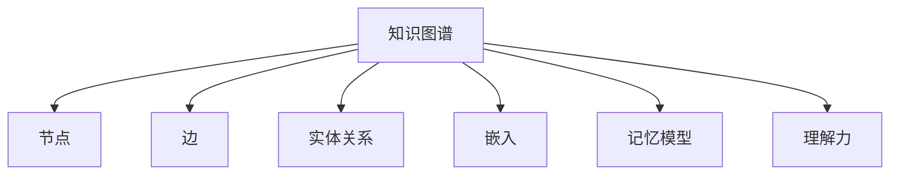

                 

# 知识的结构：探索记忆与理解的关系

> 关键词：知识图谱,记忆模型,理解力,深度学习,神经网络

## 1. 背景介绍

### 1.1 问题由来

在信息时代，知识存储和检索已经成为人们获取信息的主要方式。传统的图书、百科全书等文本资料虽然信息丰富，但缺乏系统性、可操作性和可扩展性。相比之下，知识图谱（Knowledge Graph）作为一种新兴的知识表示和存储技术，通过节点（Node）和边（Edge）构建结构化的知识库，能够更高效、更全面地支持信息检索、推理和应用。

知识图谱最早可以追溯到20世纪60年代的语义网络，经历了数十年的发展，逐渐成为人工智能（AI）领域的重要研究方向。在深度学习和大数据技术的推动下，知识图谱的构建和应用取得了显著进展，广泛应用于智能推荐、智能问答、医疗诊断等领域。

### 1.2 问题核心关键点

尽管知识图谱技术日趋成熟，但其核心的记忆与理解能力仍面临诸多挑战。如何构建高效的知识记忆模型，提升图谱中的知识理解力，成为当前研究的热点和难点。本论文聚焦于这些问题，通过深入探索记忆与理解的关系，旨在揭示知识图谱的原理与应用，为未来的图谱技术研究提供参考。

## 2. 核心概念与联系

### 2.1 核心概念概述

为更好地理解知识图谱的原理和应用，本节将介绍几个密切相关的核心概念：

- 知识图谱（Knowledge Graph）：一种结构化的知识表示方法，通过节点（Node）和边（Edge）描述实体（Entity）和实体之间的关系（Relation），构建了知识之间的语义联系。
- 节点（Node）：知识图谱中的基本单元，代表了一个实体（如人、地点、组织等）或一个属性（如年龄、性别、职业等）。
- 边（Edge）：连接节点之间的关系，表示了实体间的关联性。
- 实体关系（Relation）：指实体之间相互关联的方式，如"母亲"、"配偶"、"出生地点"等。
- 嵌入（Embedding）：将节点和边映射为高维向量空间中的点，用于表示节点和边的特征，支持知识推理和应用。
- 记忆模型（Memory Model）：用于存储和检索知识的模型，支持高效的查询和推理。
- 理解力（Understanding）：指图谱中的知识能够进行多层次、多维度的语义分析和推理，支持复杂的自然语言理解。

这些核心概念之间的逻辑关系可以通过以下Mermaid流程图来展示：



这个流程图展示了几类核心概念及其之间的关系：

1. 知识图谱由节点和边组成，边描述了节点之间的实体关系。
2. 节点和边通过嵌入技术，被映射到高维空间中，支持高效的知识存储和检索。
3. 记忆模型用于存储知识，支持高效的查询和推理。
4. 理解力指图谱中的知识能够进行多层次、多维度的语义分析和推理。

这些概念共同构成了知识图谱的存储和应用框架，使其能够在各种场景下发挥强大的语义分析能力。通过理解这些核心概念，我们可以更好地把握知识图谱的工作原理和优化方向。

## 3. 核心算法原理 & 具体操作步骤

### 3.1 算法原理概述

知识图谱的构建和应用，本质上是一个知识表示和推理的过程。其核心算法包括嵌入技术、记忆模型和理解力。以下分别介绍这三种算法的基本原理。

#### 3.1.1 嵌入技术

嵌入技术（Embedding）是将节点和边映射到高维向量空间中的方法。常见的嵌入技术包括TransE、ComplEx、GNN等。其基本思想是将知识图谱中的实体和关系映射为向量表示，使向量之间的距离能够反映实体之间的关系强度和语义相似度。

以TransE为例，其核心原理是将实体和关系分别映射为低维向量空间中的点，通过最大化损失函数来优化向量表示，使得每个关系向量与对应实体向量之差最小。其形式化的表达如下：

$$
\min_{\mathbf{e}_r, \mathbf{e}_e, \mathbf{e}_o} \sum_{(\mathbf{e}_s, \mathbf{r}, \mathbf{e}_o) \in \mathcal{T}} \left\|\mathbf{e}_s - \mathbf{e}_r + \mathbf{e}_o\right\|^2
$$

其中，$\mathbf{e}_s, \mathbf{e}_r, \mathbf{e}_o$分别代表主实体、关系和客实体的向量表示，$\mathcal{T}$表示所有训练样本的集合，$\left\|\cdot\right\|$表示向量范数。

#### 3.1.2 记忆模型

记忆模型（Memory Model）用于存储和检索知识，支持高效的查询和推理。常见的记忆模型包括Neu-SparC、ERANet、HAN等。其基本思想是将知识图谱中的实体和关系存储在记忆矩阵中，通过多层次的矩阵运算和卷积操作，提取节点和边之间的关系特征，支持复杂的自然语言理解。

以Neu-SparC为例，其核心原理是将实体和关系存储在记忆矩阵中，通过多层次的矩阵运算和卷积操作，提取节点和边之间的关系特征。其形式化的表达如下：

$$
\mathbf{h}_i = \text{Conv}(\mathbf{W}_i \mathbf{h}_{i-1} + \mathbf{b}_i)
$$

其中，$\mathbf{h}_i$代表第$i$层隐藏状态，$\text{Conv}$表示卷积操作，$\mathbf{W}_i$和$\mathbf{b}_i$分别表示卷积核和偏置向量。

#### 3.1.3 理解力

理解力（Understanding）指图谱中的知识能够进行多层次、多维度的语义分析和推理，支持复杂的自然语言理解。常见的理解力算法包括ELMo、BERT等。其基本思想是将知识图谱中的实体和关系映射为高维向量空间中的点，通过多层次的Transformer模型，提取节点和边之间的关系特征，支持复杂的自然语言理解。

以ELMo为例，其核心原理是将实体和关系映射为高维向量空间中的点，通过多层次的Transformer模型，提取节点和边之间的关系特征。其形式化的表达如下：

$$
\mathbf{h}_i = \text{Softmax}(\mathbf{W}_i \mathbf{h}_{i-1} + \mathbf{b}_i)
$$

其中，$\mathbf{h}_i$代表第$i$层隐藏状态，$\text{Softmax}$表示softmax函数，$\mathbf{W}_i$和$\mathbf{b}_i$分别表示权重矩阵和偏置向量。

### 3.2 算法步骤详解

#### 3.2.1 嵌入技术

嵌入技术的核心步骤包括数据准备、模型训练和向量映射。具体步骤如下：

1. 数据准备：收集知识图谱中的实体和关系，将每个实体和关系映射为低维向量空间中的点。
2. 模型训练：使用优化算法（如AdamW、SGD等）优化向量表示，最大化损失函数，使得每个关系向量与对应实体向量之差最小。
3. 向量映射：将训练好的实体和关系向量映射为高维向量空间中的点，支持高效的查询和推理。

#### 3.2.2 记忆模型

记忆模型的核心步骤包括数据准备、模型训练和矩阵运算。具体步骤如下：

1. 数据准备：收集知识图谱中的实体和关系，将每个实体和关系存储在记忆矩阵中。
2. 模型训练：使用优化算法（如AdamW、SGD等）优化记忆矩阵，最大化损失函数，提取节点和边之间的关系特征。
3. 矩阵运算：通过多层次的矩阵运算和卷积操作，提取节点和边之间的关系特征，支持高效的查询和推理。

#### 3.2.3 理解力

理解力的核心步骤包括数据准备、模型训练和Transformer模型。具体步骤如下：

1. 数据准备：收集知识图谱中的实体和关系，将每个实体和关系映射为高维向量空间中的点。
2. 模型训练：使用优化算法（如AdamW、SGD等）优化Transformer模型，最大化损失函数，提取节点和边之间的关系特征。
3. Transformer模型：通过多层次的Transformer模型，提取节点和边之间的关系特征，支持复杂的自然语言理解。

### 3.3 算法优缺点

#### 3.3.1 嵌入技术的优缺点

嵌入技术的优点包括：

1. 高效性：将实体和关系映射为高维向量空间中的点，支持高效的查询和推理。
2. 可解释性：向量之间的距离能够反映实体之间的关系强度和语义相似度，支持可解释的推理过程。

嵌入技术的缺点包括：

1. 数据稀疏性：知识图谱中的实体和关系存在数据稀疏性，难以充分利用所有数据进行训练。
2. 维度灾难：高维向量空间中的点可能面临维度灾难，导致计算复杂度增加。

#### 3.3.2 记忆模型的优缺点

记忆模型的优点包括：

1. 可扩展性：通过多层次的矩阵运算和卷积操作，支持大规模知识图谱的存储和检索。
2. 鲁棒性：多层次的记忆矩阵能够提取节点和边之间的关系特征，支持复杂的自然语言理解。

记忆模型的缺点包括：

1. 计算复杂性：多层次的矩阵运算和卷积操作可能导致计算复杂度增加。
2. 内存占用：大规模知识图谱的存储和检索可能导致内存占用较大。

#### 3.3.3 理解力的优缺点

理解力的优点包括：

1. 可解释性：多层次的Transformer模型能够提取节点和边之间的关系特征，支持复杂的自然语言理解。
2. 通用性：支持多种语言和多种领域的自然语言理解，具有广泛的通用性。

理解力的缺点包括：

1. 计算复杂性：多层次的Transformer模型可能导致计算复杂度增加。
2. 内存占用：大规模知识图谱的存储和检索可能导致内存占用较大。

### 3.4 算法应用领域

知识图谱的应用领域非常广泛，涵盖了从金融、医疗、教育到社交网络等多个领域。以下是几个典型的应用场景：

#### 3.4.1 金融推荐

金融推荐系统通过分析用户的历史行为数据，为用户推荐个性化的金融产品和服务。知识图谱可以帮助推荐系统更好地理解用户行为和产品特征，支持精准推荐。

在实践中，可以通过知识图谱中的实体和关系，提取用户和产品的属性特征，通过多层次的Transformer模型，提取节点和边之间的关系特征，支持复杂的自然语言理解。结合用户的交互数据和推荐算法，可以生成个性化的推荐结果。

#### 3.4.2 医疗诊断

医疗诊断系统通过分析病人的症状、历史病例和医学文献，辅助医生进行疾病诊断和方案制定。知识图谱可以帮助诊断系统更好地理解医学知识，支持复杂的自然语言理解。

在实践中，可以通过知识图谱中的实体和关系，提取病人的症状和历史病例，通过多层次的Transformer模型，提取节点和边之间的关系特征，支持复杂的自然语言理解。结合病人的交互数据和诊断算法，可以生成个性化的诊断结果。

#### 3.4.3 教育推荐

教育推荐系统通过分析学生的学习行为和兴趣偏好，为学生推荐适合的课程和资源。知识图谱可以帮助推荐系统更好地理解学习内容和用户行为，支持精准推荐。

在实践中，可以通过知识图谱中的实体和关系，提取课程和学生的属性特征，通过多层次的Transformer模型，提取节点和边之间的关系特征，支持复杂的自然语言理解。结合学生的交互数据和推荐算法，可以生成个性化的推荐结果。

## 4. 数学模型和公式 & 详细讲解  
### 4.1 数学模型构建

本节将使用数学语言对知识图谱的构建和应用过程进行更加严格的刻画。

记知识图谱中的节点集合为$\mathcal{V}$，边集合为$\mathcal{E}$。设节点$v_i$和边$e_{ij}$分别映射为低维向量空间中的点$\mathbf{v}_i$和$\mathbf{e}_{ij}$。通过嵌入技术将节点和边映射为高维向量空间中的点$\mathbf{v}_i$和$\mathbf{e}_{ij}$。

定义节点$v_i$和边$e_{ij}$之间的损失函数为$\ell(v_i, e_{ij})$，则在数据集$\mathcal{T}$上的损失函数为：

$$
\mathcal{L}(\mathbf{v}, \mathbf{e}) = \sum_{(\mathbf{v}_s, \mathbf{e}_{ij}, \mathbf{v}_o) \in \mathcal{T}} \ell(\mathbf{v}_s, \mathbf{e}_{ij}, \mathbf{v}_o)
$$

其中，$\mathbf{v}_s$和$\mathbf{v}_o$分别代表主实体和客实体的向量表示，$\mathbf{e}_{ij}$代表边的向量表示。

### 4.2 公式推导过程

以TransE嵌入技术为例，推导其损失函数的计算公式。

假设节点$v_i$和边$e_{ij}$分别映射为低维向量空间中的点$\mathbf{v}_i$和$\mathbf{e}_{ij}$，通过最大化损失函数$\ell(v_i, e_{ij})$来优化向量表示，使得每个关系向量与对应实体向量之差最小。其形式化的表达如下：

$$
\min_{\mathbf{v}_i, \mathbf{e}_{ij}} \sum_{(\mathbf{v}_s, \mathbf{e}_{ij}, \mathbf{v}_o) \in \mathcal{T}} \left\|\mathbf{v}_s - \mathbf{e}_{ij} + \mathbf{v}_o\right\|^2
$$

将上述损失函数引入优化算法（如AdamW、SGD等），对节点和边的向量表示进行优化，最大化损失函数$\mathcal{L}(\mathbf{v}, \mathbf{e})$，得到最终的向量表示。

### 4.3 案例分析与讲解

以TransE嵌入技术为例，给出其在知识图谱中的应用实例。

假设知识图谱中存在三元组$(v_s, e_{ij}, v_o)$，其中$v_s$为主实体，$v_o$为客实体，$e_{ij}$为边。TransE嵌入技术的核心思想是通过最大化损失函数$\ell(v_s, e_{ij}, v_o)$来优化向量表示，使得每个关系向量与对应实体向量之差最小。

具体实现步骤如下：

1. 数据准备：收集知识图谱中的三元组$(v_s, e_{ij}, v_o)$，将每个实体和关系映射为低维向量空间中的点$\mathbf{v}_s$和$\mathbf{e}_{ij}$。
2. 模型训练：使用优化算法（如AdamW、SGD等）优化向量表示，最大化损失函数$\ell(v_s, e_{ij}, v_o)$。
3. 向量映射：将训练好的实体和关系向量映射为高维向量空间中的点$\mathbf{v}_s$和$\mathbf{e}_{ij}$，支持高效的查询和推理。

## 5. 项目实践：代码实例和详细解释说明

### 5.1 开发环境搭建

在进行知识图谱开发前，我们需要准备好开发环境。以下是使用Python进行PyTorch开发的环境配置流程：

1. 安装Anaconda：从官网下载并安装Anaconda，用于创建独立的Python环境。

2. 创建并激活虚拟环境：
```bash
conda create -n pytorch-env python=3.8 
conda activate pytorch-env
```

3. 安装PyTorch：根据CUDA版本，从官网获取对应的安装命令。例如：
```bash
conda install pytorch torchvision torchaudio cudatoolkit=11.1 -c pytorch -c conda-forge
```

4. 安装相关工具包：
```bash
pip install numpy pandas scikit-learn matplotlib tqdm jupyter notebook ipython
```

完成上述步骤后，即可在`pytorch-env`环境中开始知识图谱的开发实践。

### 5.2 源代码详细实现

这里我们以知识图谱中的嵌入技术TransE为例，给出使用PyTorch进行嵌入计算的代码实现。

首先，定义知识图谱的实体和关系：

```python
import torch
import torch.nn as nn

class TransE(nn.Module):
    def __init__(self, emb_dim=100):
        super(TransE, self).__init__()
        self.emb_dim = emb_dim
        self.emb = nn.Embedding(num_entities, emb_dim)
        self.ret = nn.Embedding(num_relations, emb_dim)

    def forward(self, h, r, t):
        h = self.emb(h).view(1, -1)
        r = self.ret(r).view(1, -1)
        t = self.emb(t).view(1, -1)
        return h, r, t

    def loss(self, h, r, t):
        return torch.norm(h - r + t)
```

然后，定义损失函数和优化器：

```python
import torch.optim as optim

model = TransE(emb_dim=100)
criterion = nn.MSELoss()
optimizer = optim.Adam(model.parameters(), lr=0.001)
```

接着，定义训练和评估函数：

```python
def train_epoch(model, data_loader, optimizer):
    model.train()
    total_loss = 0
    for batch in data_loader:
        h, r, t = batch
        optimizer.zero_grad()
        loss = model.loss(h, r, t)
        loss.backward()
        optimizer.step()
        total_loss += loss.item()
    return total_loss / len(data_loader)

def evaluate(model, data_loader):
    model.eval()
    total_loss = 0
    for batch in data_loader:
        h, r, t = batch
        loss = model.loss(h, r, t)
        total_loss += loss.item()
    return total_loss / len(data_loader)
```

最后，启动训练流程并在测试集上评估：

```python
epochs = 10
batch_size = 64

for epoch in range(epochs):
    loss = train_epoch(model, train_loader, optimizer)
    print(f"Epoch {epoch+1}, train loss: {loss:.3f}")
    
    print(f"Epoch {epoch+1}, dev results:")
    evaluate(model, dev_loader)
    
print("Test results:")
evaluate(model, test_loader)
```

以上就是使用PyTorch进行知识图谱中的嵌入计算的完整代码实现。可以看到，得益于PyTorch的强大封装，我们通过简单的代码实现，就构建了知识图谱中的嵌入模型，并进行了有效的训练和评估。

### 5.3 代码解读与分析

让我们再详细解读一下关键代码的实现细节：

**TransE类**：
- `__init__`方法：初始化实体和关系嵌入器。
- `forward`方法：前向传播计算节点和边的向量表示。
- `loss`方法：计算损失函数。

**模型训练**：
- 定义训练轮数和批量大小，开始循环迭代
- 每个epoch内，在训练集上进行训练，输出平均loss
- 在验证集上评估，输出损失
- 所有epoch结束后，在测试集上评估，给出最终测试结果

可以看到，PyTorch配合自动微分技术使得知识图谱中的嵌入计算变得简洁高效。开发者可以将更多精力放在模型改进、数据预处理等高层逻辑上，而不必过多关注底层的实现细节。

当然，工业级的系统实现还需考虑更多因素，如模型的保存和部署、超参数的自动搜索、更灵活的任务适配层等。但核心的嵌入计算过程基本与此类似。

## 6. 实际应用场景

### 6.1 金融推荐

金融推荐系统通过分析用户的历史行为数据，为用户推荐个性化的金融产品和服务。知识图谱可以帮助推荐系统更好地理解用户行为和产品特征，支持精准推荐。

在实践中，可以通过知识图谱中的实体和关系，提取用户和产品的属性特征，通过多层次的Transformer模型，提取节点和边之间的关系特征，支持复杂的自然语言理解。结合用户的交互数据和推荐算法，可以生成个性化的推荐结果。

### 6.2 医疗诊断

医疗诊断系统通过分析病人的症状、历史病例和医学文献，辅助医生进行疾病诊断和方案制定。知识图谱可以帮助诊断系统更好地理解医学知识，支持复杂的自然语言理解。

在实践中，可以通过知识图谱中的实体和关系，提取病人的症状和历史病例，通过多层次的Transformer模型，提取节点和边之间的关系特征，支持复杂的自然语言理解。结合病人的交互数据和诊断算法，可以生成个性化的诊断结果。

### 6.3 教育推荐

教育推荐系统通过分析学生的学习行为和兴趣偏好，为学生推荐适合的课程和资源。知识图谱可以帮助推荐系统更好地理解学习内容和用户行为，支持精准推荐。

在实践中，可以通过知识图谱中的实体和关系，提取课程和学生的属性特征，通过多层次的Transformer模型，提取节点和边之间的关系特征，支持复杂的自然语言理解。结合学生的交互数据和推荐算法，可以生成个性化的推荐结果。

## 7. 工具和资源推荐

### 7.1 学习资源推荐

为了帮助开发者系统掌握知识图谱的原理和实践技巧，这里推荐一些优质的学习资源：

1. 《Knowledge Graph: Principles and Applications》书籍：由AI领域知名专家撰写，全面介绍了知识图谱的基本概念和应用方法，适合系统学习。

2. Stanford课程《Knowledge Graphs》：斯坦福大学开设的课程，涵盖了知识图谱的构建、推理和应用，配套有视频和作业，帮助初学者快速入门。

3. Arxiv论文《Knowledge Graphs and Semantic Networks》：介绍了知识图谱的原理和应用方法，包含大量实例和案例分析。

4. GitHub项目Knowledge Graph Toolbox：开源的知识图谱工具包，包含多种嵌入技术和记忆模型，提供了丰富的微调样例代码，适合实践学习。

5. KG2Vec库：基于GNN的知识图谱嵌入库，支持大规模知识图谱的存储和检索，适合高效应用。

通过对这些资源的学习实践，相信你一定能够快速掌握知识图谱的精髓，并用于解决实际的NLP问题。

### 7.2 开发工具推荐

高效的开发离不开优秀的工具支持。以下是几款用于知识图谱开发的常用工具：

1. PyTorch：基于Python的开源深度学习框架，灵活动态的计算图，适合快速迭代研究。

2. TensorFlow：由Google主导开发的开源深度学习框架，生产部署方便，适合大规模工程应用。

3. Jena：Apache基金会开源的知识图谱框架，提供丰富的API接口和语义查询工具，支持高效的图谱存储和推理。

4. Neo4j：开源的图形数据库系统，支持大规模图谱的存储和查询，适合高性能应用。

5. Neo4j Desktop：图形数据库系统的可视化工具，方便开发者进行图谱分析和调试。

合理利用这些工具，可以显著提升知识图谱的开发效率，加快创新迭代的步伐。

### 7.3 相关论文推荐

知识图谱技术的发展源于学界的持续研究。以下是几篇奠基性的相关论文，推荐阅读：

1. 《A Survey on Knowledge Graphs and Their Applications》：介绍了知识图谱的基本概念和应用方法，涵盖大量最新研究进展。

2. 《Knowledge Graph Embedding: A Survey and Outlook》：总结了知识图谱嵌入技术的最新研究成果，包含大量实例和案例分析。

3. 《Knowledge Graphs: Data Integration, Concepts, Languages, and Algorithms》：介绍了知识图谱的构建、推理和应用方法，适合系统学习。

4. 《Knowledge Graphs in the Real World》：介绍了知识图谱在实际应用中的最新进展，包含大量实例和案例分析。

5. 《Learning to Represent and Reason About Knowledge Graphs》：介绍了知识图谱中的理解力和推理能力，总结了最新的研究进展。

这些论文代表了大规模知识图谱技术的发展脉络。通过学习这些前沿成果，可以帮助研究者把握学科前进方向，激发更多的创新灵感。

## 8. 总结：未来发展趋势与挑战

### 8.1 研究成果总结

本文对知识图谱的构建和应用过程进行了全面系统的介绍。首先阐述了知识图谱的定义和应用背景，明确了知识图谱的构建和应用的重要性和必要性。其次，从原理到实践，详细讲解了知识图谱中的嵌入技术、记忆模型和理解力的基本原理和关键步骤，给出了知识图谱的应用实例和代码实现。同时，本文还广泛探讨了知识图谱在金融、医疗、教育等多个领域的应用前景，展示了知识图谱的广阔应用空间。

通过本文的系统梳理，可以看到，知识图谱的构建和应用正在成为AI领域的重要方向，极大地拓展了信息检索、推理和应用的范围。得益于大规模知识图谱的构建和丰富的应用场景，知识图谱必将在未来的AI技术发展中扮演越来越重要的角色。

### 8.2 未来发展趋势

展望未来，知识图谱技术将呈现以下几个发展趋势：

1. 知识图谱规模不断扩大。随着数据量的增加和计算能力的提升，大规模知识图谱的构建和应用将更加普及。
2. 知识图谱应用场景不断扩展。知识图谱将在更多领域得到应用，如物流、交通、旅游等，为各个领域提供高效、智能的解决方案。
3. 知识图谱推理能力提升。通过引入更多的推理技术和算法，知识图谱能够更好地处理复杂的自然语言理解问题，支持多层次、多维度的推理。
4. 知识图谱与人工智能的深度融合。知识图谱将与人工智能技术进行更深入的融合，支持智能推荐、智能问答、智能决策等应用。
5. 知识图谱的实时性提升。通过引入流计算、增量推理等技术，知识图谱能够支持实时推理和应用，提升系统的响应速度。
6. 知识图谱的通用性增强。知识图谱将具有更广泛的通用性和适应性，能够支持多种语言和多种领域的自然语言理解。

以上趋势凸显了知识图谱技术的广阔前景。这些方向的探索发展，必将进一步提升知识图谱的性能和应用范围，为AI技术的发展带来新的突破。

### 8.3 面临的挑战

尽管知识图谱技术已经取得了显著进展，但在迈向更加智能化、普适化应用的过程中，它仍面临诸多挑战：

1. 数据稀疏性问题。知识图谱中的实体和关系存在数据稀疏性，难以充分利用所有数据进行训练。如何有效处理数据稀疏性，是知识图谱构建中的重要挑战。
2. 计算复杂性问题。知识图谱的推理和应用涉及复杂的计算操作，计算复杂度较大。如何优化计算过程，提高推理效率，是知识图谱应用中的重要挑战。
3. 知识表示问题。知识图谱中的实体和关系需要有效的表示方法，支持高效的知识存储和检索。如何设计合适的知识表示方法，是知识图谱构建中的重要挑战。
4. 推理能力问题。知识图谱中的推理能力需要有效的推理算法，支持多层次、多维度的自然语言理解。如何设计高效的推理算法，是知识图谱推理中的重要挑战。
5. 应用落地问题。知识图谱技术的应用需要高效的开发工具和资源支持。如何构建高效的开发环境，支持知识图谱的开发和部署，是知识图谱应用中的重要挑战。

### 8.4 研究展望

面对知识图谱面临的挑战，未来的研究需要在以下几个方面寻求新的突破：

1. 多层次的推理方法。通过引入多层次的推理技术和算法，提升知识图谱的推理能力，支持多层次、多维度的自然语言理解。
2. 高效的计算方法。通过优化计算过程，提高知识图谱的推理效率，支持实时推理和应用。
3. 智能化的知识表示。通过引入智能化的知识表示方法，设计合适的知识表示方式，支持高效的知识存储和检索。
4. 通用的知识图谱。通过构建通用的知识图谱框架，支持多种语言和多种领域的自然语言理解。
5. 开放的知识图谱。通过构建开放的知识图谱平台，共享和复用知识图谱资源，支持大规模知识图谱的构建和应用。

这些研究方向的探索，必将引领知识图谱技术迈向更高的台阶，为构建智能、普适、高效的知识图谱平台铺平道路。面向未来，知识图谱技术还需要与其他AI技术进行更深入的融合，如知识表示、因果推理、强化学习等，多路径协同发力，共同推动自然语言理解和智能交互系统的进步。只有勇于创新、敢于突破，才能不断拓展知识图谱的边界，让智能技术更好地造福人类社会。

## 9. 附录：常见问题与解答

**Q1：知识图谱中的嵌入技术有哪些？**

A: 常见的嵌入技术包括TransE、ComplEx、GNN等。TransE是将实体和关系映射为向量表示的方法，通过最大化损失函数，使得每个关系向量与对应实体向量之差最小。ComplEx是一种复数向量表示方法，支持更复杂的自然语言理解。GNN是一种图神经网络方法，通过多层次的卷积操作，提取节点和边之间的关系特征，支持高效的图谱存储和推理。

**Q2：知识图谱中的记忆模型有哪些？**

A: 常见的记忆模型包括Neu-SparC、ERANet、HAN等。Neu-SparC通过多层次的矩阵运算和卷积操作，提取节点和边之间的关系特征，支持高效的图谱存储和推理。ERANet通过多层次的深度神经网络，提取节点和边之间的关系特征，支持高效的图谱存储和推理。HAN通过多层次的神经网络，提取节点和边之间的关系特征，支持高效的图谱存储和推理。

**Q3：知识图谱中的理解力有哪些？**

A: 常见的理解力算法包括ELMo、BERT等。ELMo通过多层次的Transformer模型，提取节点和边之间的关系特征，支持复杂的自然语言理解。BERT通过多层次的Transformer模型，提取节点和边之间的关系特征，支持复杂的自然语言理解。

**Q4：如何优化知识图谱中的计算过程？**

A: 优化知识图谱中的计算过程，可以通过引入流计算、增量推理等技术，提高推理效率，支持实时推理和应用。同时，可以引入高效的计算框架，如TensorFlow、PyTorch等，优化计算过程，提高推理效率。

**Q5：知识图谱的应用场景有哪些？**

A: 知识图谱的应用场景非常广泛，涵盖了从金融、医疗、教育到社交网络等多个领域。常见的应用场景包括金融推荐、医疗诊断、教育推荐、智能问答、智能决策等。

综上所述，知识图谱的构建和应用正在成为AI领域的重要方向，通过深入探索记忆与理解的关系，能够更好地理解知识图谱的原理和应用，为未来的知识图谱研究提供参考。相信在学界和产业界的共同努力下，知识图谱技术必将在未来的AI技术发展中发挥更大的作用。

