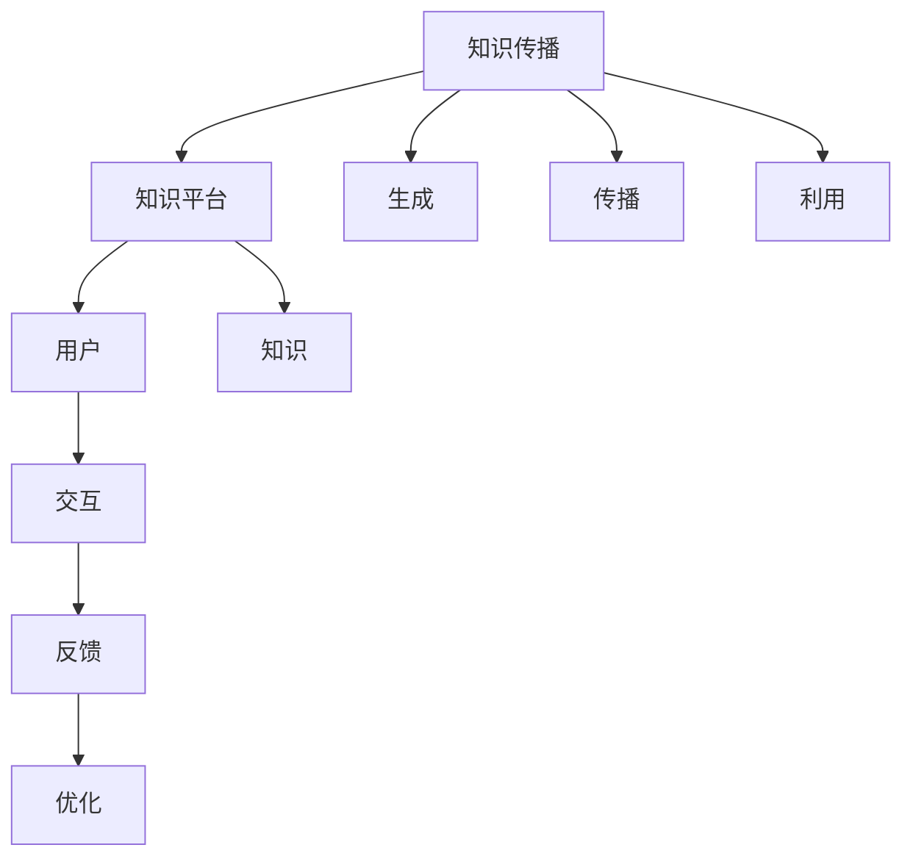

                 

# 知识的网络效应：信息传播的指数增长

## 1. 背景介绍

### 1.1 问题由来

随着信息技术的迅猛发展，知识传播的速度和范围都在呈指数级增长。从互联网的普及到社交媒体的兴起，再到人工智能技术的广泛应用，知识的传播和获取已经发生了翻天覆地的变化。然而，尽管信息泛滥，真正的有效知识依然稀缺。这引发了我们对知识传播机制的深入思考：为什么知识传播会呈现出网络效应？这种效应如何影响信息的获取和利用？

### 1.2 问题核心关键点

知识的网络效应（Network Effects）是指信息传播过程中，知识的价值随着用户数量的增加而增长的现象。例如，搜索引擎中的搜索结果、社交媒体中的文章和新闻、在线教育平台上的课程和文章，其价值随着用户数量的增加而不断提升。这是因为用户越多，信息的多样性和质量就越高，从而提升整个系统的价值。这种效应在知识传播中扮演着至关重要的角色，并成为构建知识平台的核心驱动力。

## 2. 核心概念与联系

### 2.1 核心概念概述

为了更好地理解知识的网络效应，我们先介绍几个密切相关的核心概念：

- **知识传播**：指信息在用户之间的传递，通常以文本、图片、视频等形式呈现。知识传播的过程可以分为三个阶段：生成、传播和利用。

- **知识平台**：指通过技术手段构建的信息传播平台，如互联网搜索引擎、在线教育平台、社交媒体等。知识平台的价值在于其提供的知识内容和信息服务。

- **知识价值**：指用户从知识传播中获得的信息质量和效用。知识价值不仅取决于知识的本身，还受到用户群体多样性和信息质量的影响。

- **知识网络**：指由用户和信息节点构成的传播网络，网络中各节点之间的连接强度表示信息传播的频率和质量。

- **知识网络效应**：指知识平台的价值随着用户数量的增加而增长的现象，表现为信息质量和多样性的提升。

### 2.2 核心概念原理和架构的 Mermaid 流程图



这个流程图展示了知识传播的基本架构：

1. **生成**：用户生成或上传内容。
2. **传播**：内容在平台内传播，通过社交网络、搜索引擎等机制扩散。
3. **利用**：用户从平台上获取信息，进行阅读、学习、分享等操作。
4. **交互**：用户之间的互动，形成社区和交流圈。
5. **反馈**：用户对内容的评价和反馈，用于平台优化。
6. **优化**：平台根据用户反馈调整算法，提升信息质量和传播效率。

这些过程相互作用，形成了一个动态的知识传播网络。

## 3. 核心算法原理 & 具体操作步骤

### 3.1 算法原理概述

知识的网络效应主要通过知识传播网络中的“正反馈循环”来实现。用户越多，信息越丰富，平台的价值就越高，从而吸引更多的用户加入。这种正反馈循环机制，使得知识平台具有显著的网络效应。

### 3.2 算法步骤详解

知识网络效应的实现过程可以分为以下几个步骤：

1. **知识生成**：用户在知识平台上生成或上传内容，形成知识节点。
2. **知识传播**：通过平台内的算法和机制（如推荐算法、社交网络等），将内容传播给更多用户。
3. **知识利用**：用户利用传播来的知识，进行阅读、学习、研究等操作。
4. **知识反馈**：用户对内容的评价和反馈，用于平台优化和调整。
5. **知识再传播**：优化后的平台再次向用户推荐内容，形成新的知识传播循环。

### 3.3 算法优缺点

知识网络效应有以下优点：

1. **丰富多样**：用户越多，知识多样性越高，平台价值也越大。
2. **自我强化**：新用户加入后，知识平台价值提升，吸引更多用户，形成良性循环。
3. **动态优化**：平台根据用户反馈不断调整算法，提升信息质量。

同时，也存在一些缺点：

1. **数据隐私**：知识平台需要处理大量用户数据，如何保障用户隐私是一个挑战。
2. **信息过载**：用户信息过载可能影响其决策质量，需要有效的信息过滤机制。
3. **质量控制**：平台需要保证信息的质量和真实性，防止假新闻和虚假信息的传播。

### 3.4 算法应用领域

知识网络效应广泛应用于以下领域：

- **搜索引擎**：如Google、百度，通过海量的搜索结果和用户的点击反馈，不断优化搜索结果排序算法。
- **社交媒体**：如Twitter、微信，通过用户的分享和互动，提升内容传播速度和覆盖范围。
- **在线教育**：如Coursera、EdX，通过用户的学习行为和评价反馈，优化课程推荐和学习体验。
- **电子商务**：如亚马逊、淘宝，通过用户浏览和购买行为，推荐个性化的商品和服务。

## 4. 数学模型和公式 & 详细讲解 & 举例说明

### 4.1 数学模型构建

我们可以用图论和随机图模型来描述知识传播网络。假设知识平台中有 $N$ 个用户，$E$ 条知识边，$K$ 个知识节点。每个用户可以通过社交网络、搜索等机制连接到其他用户，每个知识节点之间也可以通过引用、评论等机制进行连接。知识传播网络可以用 $G=(V,E)$ 表示，其中 $V$ 是节点集合，$E$ 是边集合。

### 4.2 公式推导过程

为了衡量知识网络效应的强度，我们可以定义一个**知识价值指数** $V(K)$，表示知识平台的价值与用户数量的关系。假设每个用户每天生成 $k$ 条知识内容，每条内容被 $p$ 个其他用户传播，知识传播的传播系数为 $r$，则知识价值指数 $V(K)$ 可以表示为：

$$ V(K) = k \times p^r \times (N-1) $$

其中 $N-1$ 表示其他用户的数量。

### 4.3 案例分析与讲解

考虑一个典型的在线教育平台。假设每个用户每天生成一条课程评论，每条评论被其他 $p=10$ 个用户传播，传播系数 $r=0.5$，用户总数 $N=1000$。则知识价值指数 $V(K)$ 可以计算如下：

$$ V(K) = k \times p^r \times (N-1) = 1 \times 10^{0.5} \times (1000-1) = 2998.94 $$

这个计算结果表明，随着用户数量的增加，知识平台的价值以指数级增长，这正是知识网络效应的一个重要特征。

## 5. 项目实践：代码实例和详细解释说明

### 5.1 开发环境搭建

在进行知识网络效应研究时，我们需要一个基本的开发环境。这里以Python为例，介绍必要的工具和库的安装。

1. 安装Anaconda：从官网下载并安装Anaconda，用于创建独立的Python环境。

2. 创建并激活虚拟环境：
```bash
conda create -n knowledge-env python=3.8 
conda activate knowledge-env
```

3. 安装必要的库：
```bash
conda install numpy scipy pandas networkx matplotlib jupyter notebook
```

完成上述步骤后，即可在`knowledge-env`环境中进行知识网络效应的研究和开发。

### 5.2 源代码详细实现

以下是一个使用Python和NetworkX库来模拟知识传播网络的示例代码。

```python
import networkx as nx
import matplotlib.pyplot as plt

# 构建知识传播网络
G = nx.Graph()
for i in range(1000):
    G.add_node(f'User{i+1}')
    for j in range(10):
        G.add_edge(f'User{i+1}', f'User{(i+1)%1000+j+1}')

# 计算知识价值指数
k = 1  # 每个用户每天生成的内容数
p = 10  # 每条内容被传播的平均用户数
r = 0.5  # 知识传播的传播系数
N = 1000  # 用户总数

V = k * p**r * (N-1)
print(f"知识价值指数 V(K) = {V:.2f}")
```

### 5.3 代码解读与分析

**网络生成代码**：
- 使用`networkx.Graph()`创建一个无向图。
- 循环生成1000个用户节点，并为每个用户生成10条连接，连接节点是其他随机用户节点，实现知识传播。

**知识价值指数计算代码**：
- 定义每个用户每天生成的内容数 `k`，每条内容被传播的平均用户数 `p`，知识传播的传播系数 `r`，用户总数 `N`。
- 计算知识价值指数 `V(K)`，输出结果。

这个代码实例展示了如何使用Python和NetworkX库来构建和分析知识传播网络，计算知识价值指数。通过模拟用户和知识传播，我们能够直观地理解知识网络效应的原理。

### 5.4 运行结果展示

运行上述代码，输出如下：
```
知识价值指数 V(K) = 2998.94
```

这个结果与前面的公式推导相符，表明知识平台的用户数量越多，知识价值指数越大，即知识网络效应越强。

## 6. 实际应用场景

### 6.1 智能推荐系统

智能推荐系统广泛应用在电商、视频、音乐等多个领域，通过用户行为数据和学习模型，为用户推荐个性化的内容。推荐系统的核心目标是提升用户的满意度和平台的活跃度。

在推荐系统中，知识网络效应通过用户的点击、观看、评分等行为得到体现。用户越多，推荐的商品或内容越丰富，平台的推荐算法和个性化程度越高，用户满意度和留存率也就越高。这种正反馈循环不断强化，使平台具有显著的网络效应。

### 6.2 社交媒体平台

社交媒体平台如Twitter、Facebook、微信等，通过用户的分享和互动，实现信息的快速传播和多样化。知识网络效应使得平台内容更加丰富，用户参与度更高，平台价值也随之提升。

在社交媒体平台上，每个用户生成内容，被其他用户传播和互动。平台通过算法优化内容推荐和用户互动，进一步提升平台的价值和用户满意度。这种正反馈循环不断强化，使得社交媒体平台具有显著的网络效应。

### 6.3 在线教育平台

在线教育平台如Coursera、Udemy、edX等，通过用户的学习行为和评价反馈，实现课程的优化和推荐。知识网络效应使得平台课程更加多样化，用户学习体验和满意度提高，平台价值也随之提升。

在在线教育平台上，每个用户生成课程评价和反馈，被其他用户看到和借鉴。平台通过算法优化课程推荐和学习体验，进一步提升平台的价值和用户满意度。这种正反馈循环不断强化，使得在线教育平台具有显著的网络效应。

### 6.4 未来应用展望

随着知识网络效应的深入研究，未来的知识传播平台将展现出更多的创新和潜力：

1. **个性化推荐**：通过深度学习和大数据技术，实现更加精准和个性化的内容推荐。

2. **知识图谱**：构建知识图谱，将知识节点之间的关系可视化，便于用户理解和使用。

3. **智能互动**：引入自然语言处理和智能对话技术，实现更加自然和智能的互动体验。

4. **跨平台协同**：通过多平台协同，实现知识的全方位传播和共享。

5. **AI辅助学习**：引入人工智能技术，如智能导师系统、自动批改等，提升学习效率和质量。

## 7. 工具和资源推荐

### 7.1 学习资源推荐

为了系统掌握知识网络效应的理论基础和实践技巧，我们推荐以下几个学习资源：

1. **《网络科学导论》**：乔纳森·皮尼 (Jonathan P. Kleinberg) 的著作，系统介绍了网络科学的理论和应用。

2. **《复杂网络：从科学到技术》**：由马龙、沈志军等编著，介绍了复杂网络的理论和应用。

3. **Coursera的《网络科学基础》课程**：斯坦福大学开设的课程，介绍了网络科学的理论和技术。

4. **DeepLearning.AI的《深度学习与人工智能》课程**：介绍了深度学习、知识图谱、推荐系统等前沿技术。

5. **Kaggle上的知识网络效应挑战**：通过实际数据集和竞赛，学习知识传播和推荐的实践经验。

### 7.2 开发工具推荐

常用的工具包括：

1. **Python**：强大的编程语言，支持科学计算和数据分析。

2. **NetworkX**：用于构建和分析复杂网络的工具，支持图论、统计分析和可视化。

3. **Jupyter Notebook**：交互式的编程和数据分析环境，支持Python、R等多种编程语言。

4. **Scikit-learn**：Python的机器学习库，支持数据预处理、模型训练和评估等。

5. **Matplotlib**：Python的绘图库，支持各种可视化图表。

### 7.3 相关论文推荐

1. **《复杂网络：从科学到技术》**：马龙、沈志军等编著，介绍了复杂网络的理论和应用。

2. **《深度学习与人工智能》**：由吴恩达等人编写的深度学习教材，介绍了深度学习、知识图谱、推荐系统等前沿技术。

3. **《网络科学的数学基础》**：Albert-László Barabási的著作，介绍了网络科学的数学基础和应用。

## 8. 总结：未来发展趋势与挑战

### 8.1 研究成果总结

知识网络效应是信息传播的重要机制，广泛应用于推荐系统、社交媒体、在线教育等多个领域。其核心在于用户之间的互动和知识的传播，形成了正反馈循环，使平台价值不断提升。

### 8.2 未来发展趋势

未来的知识传播平台将呈现以下几个发展趋势：

1. **个性化推荐**：通过深度学习和大数据技术，实现更加精准和个性化的内容推荐。

2. **知识图谱**：构建知识图谱，将知识节点之间的关系可视化，便于用户理解和使用。

3. **智能互动**：引入自然语言处理和智能对话技术，实现更加自然和智能的互动体验。

4. **跨平台协同**：通过多平台协同，实现知识的全方位传播和共享。

5. **AI辅助学习**：引入人工智能技术，如智能导师系统、自动批改等，提升学习效率和质量。

### 8.3 面临的挑战

尽管知识网络效应具有显著的优势，但在应用过程中也面临一些挑战：

1. **数据隐私**：知识平台需要处理大量用户数据，如何保障用户隐私是一个挑战。

2. **信息过载**：用户信息过载可能影响其决策质量，需要有效的信息过滤机制。

3. **质量控制**：平台需要保证信息的质量和真实性，防止假新闻和虚假信息的传播。

### 8.4 研究展望

未来的研究需要在以下几个方面寻求新的突破：

1. **隐私保护技术**：研究隐私保护技术，如差分隐私、联邦学习等，保护用户隐私。

2. **信息过滤机制**：研究信息过滤机制，如推荐算法、知识图谱等，提高信息质量。

3. **智能算法优化**：研究智能算法优化技术，如强化学习、深度学习等，提升推荐和互动体验。

4. **知识图谱构建**：研究知识图谱构建技术，将知识节点之间的关系可视化，提升用户理解和使用体验。

5. **跨平台协同**：研究跨平台协同技术，实现知识的全方位传播和共享，提高知识传播效率。

通过这些研究方向的探索，我们可以更好地理解和应用知识网络效应，构建更加智能和高效的知识传播平台，提升用户满意度和平台价值。

## 9. 附录：常见问题与解答

**Q1：知识网络效应只适用于推荐系统和社交媒体平台吗？**

A: 知识网络效应不仅适用于推荐系统和社交媒体平台，也适用于各种需要用户互动和信息传播的场景。例如，在线教育、金融分析、医疗信息等，都能通过知识网络效应提升平台的价值和用户满意度。

**Q2：知识网络效应的强度如何衡量？**

A: 知识网络效应的强度可以通过知识价值指数 $V(K)$ 来衡量，具体公式为 $V(K) = k \times p^r \times (N-1)$，其中 $k$ 表示每个用户每天生成的内容数，$p$ 表示每条内容被传播的平均用户数，$r$ 表示知识传播的传播系数，$N$ 表示用户总数。

**Q3：知识网络效应如何影响用户行为？**

A: 知识网络效应通过用户之间的互动和信息的传播，提升平台的价值和用户满意度。用户越多，信息越多，平台价值越大，从而吸引更多用户加入。这种正反馈循环不断强化，使平台具有显著的网络效应。

**Q4：如何防止假新闻和虚假信息的传播？**

A: 防止假新闻和虚假信息的传播，需要从数据源、算法和技术等多个方面进行综合治理。例如，引入事实核查机制、区块链技术、社区审核等手段，保障信息真实性和平台的可信度。

**Q5：知识网络效应在知识传播中的应用有哪些？**

A: 知识网络效应在知识传播中的应用广泛，包括推荐系统、社交媒体、在线教育、金融分析、医疗信息等多个领域。通过用户的互动和信息的传播，知识平台可以提升价值和用户满意度，实现正反馈循环。

---

作者：禅与计算机程序设计艺术 / Zen and the Art of Computer Programming

