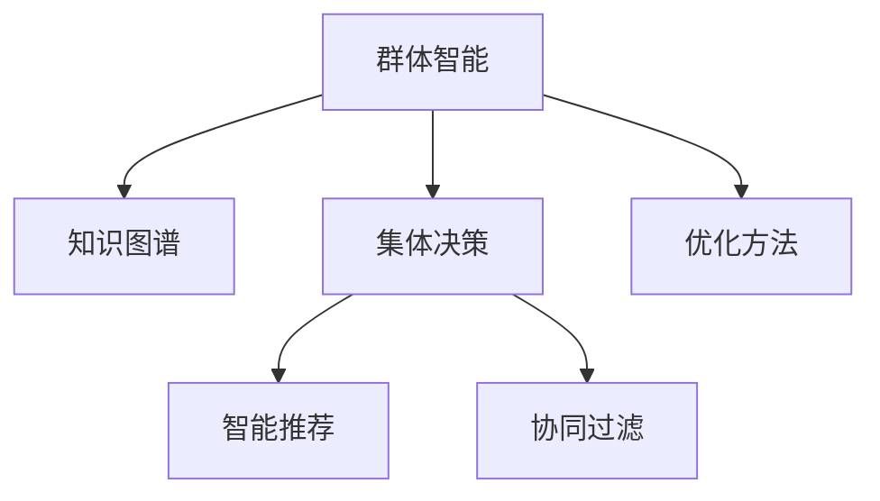

                 

# 知识的群体智能：集体决策的优化方法

> 关键词：群体智能, 集体决策, 知识图谱, 智能推荐, 社交网络, 聚类算法, 优化方法, 深度学习

## 1. 背景介绍

### 1.1 问题由来

在信息时代，个体处理信息的复杂度和广度不断增加，面对海量数据和信息，个人决策的局限性愈发显著。群体智能(Group Intelligence)应运而生，利用集体的智慧和力量，提升决策质量和效率。特别是在社交网络和知识图谱广泛应用的今天，将群体智能与知识图谱结合，进行集体决策，成为了信息时代的新宠。

### 1.2 问题核心关键点

群体智能利用众包、众筹、众测等形式，收集、汇聚、处理和利用群体智慧，从而形成更科学、更合理的决策。而在这些决策中，知识图谱扮演着至关重要的角色，它将结构化数据、语义信息等深度嵌入群体智能流程中，从而提高决策的准确性和效率。

核心关键点如下：
- 数据收集与标注：汇聚个体和群体的信息，构建知识图谱。
- 智能推荐与排序：利用知识图谱进行智能推荐与排序。
- 协同过滤与融合：融合不同群体成员的意见，进行协同过滤。
- 优化方法与算法：采用优化的算法和模型，提升群体决策的质量。

### 1.3 问题研究意义

利用群体智能和知识图谱进行集体决策，具有以下重要意义：

1. **提升决策质量**：集合众人的智慧和经验，克服个体认知偏见，提供更全面的决策依据。
2. **提高决策效率**：通过分布式计算和协同工作，加速决策过程。
3. **实现知识复用**：通过知识图谱构建和利用，使群体智慧可重复使用，推动知识积累和创新。
4. **促进公平参与**：保证不同背景和经验的群体成员有平等的参与机会，增强决策的民主性和公信力。
5. **适应复杂环境**：处理不确定性、复杂性强的决策问题，提供科学、系统的解决方案。

## 2. 核心概念与联系

### 2.1 核心概念概述

为了更好地理解群体智能在集体决策中的应用，本节将介绍几个核心概念：

- **群体智能**：利用群体智慧和协作，提高决策质量和效率的技术。群体智能可以分为分散式和集中式两种。
- **知识图谱**：一种描述实体、属性和关系的数据结构，用于构建和表示知识领域的信息网络。知识图谱广泛应用于推荐系统、问答系统、信息检索等场景。
- **集体决策**：通过聚合个体或群体意见，形成最终决策的机制。集体决策的目标是最大化群体智慧。
- **智能推荐**：利用算法和模型，向用户推荐最相关和有用的信息或产品。
- **协同过滤**：基于群体成员之间的相似性，推荐个性化信息。
- **优化方法**：用于提升群体智能效率和效果的数学和算法技术。

这些核心概念之间的关系可以通过以下Mermaid流程图来展示：



这个流程图展示了几大核心概念的相互联系：

1. 群体智能与知识图谱相互结合，构成决策的基础。
2. 集体决策是群体智能的最终目标。
3. 智能推荐和协同过滤是实现集体决策的重要手段。
4. 优化方法提升群体智能的效率和效果。

## 3. 核心算法原理 & 具体操作步骤

### 3.1 算法原理概述

基于群体智能和知识图谱的集体决策，本质上是一个多目标优化问题。其核心思想是：通过构建知识图谱，利用群体成员的反馈信息，优化推荐算法和决策模型，使得最终的集体决策尽可能接近最优解。

形式化地，假设决策问题为 $O$，共有 $N$ 个群体成员 $S=\{s_1, s_2, ..., s_N\}$，每个成员提供一条决策建议 $a_s = (v_s, w_s)$，其中 $v_s$ 为决策的评分，$w_s$ 为对评分的不确定性。目标是最小化决策结果 $D$ 与最优决策 $D^*$ 的差异，同时最大化群体智慧 $W$。

优化目标可以表示为：

$$
\min_{D} ||D - D^*|| + \frac{\lambda}{N}\sum_{s=1}^N w_s \\
\max_{W} \sum_{s=1}^N w_s
$$

其中 $\lambda$ 为权重，控制决策结果与最优解之间的差异和群体智慧的重要性。

### 3.2 算法步骤详解

基于群体智能和知识图谱的集体决策通常包括以下关键步骤：

**Step 1: 数据收集与预处理**

- 设计问卷或任务，从目标群体收集决策信息。
- 对收集的数据进行清洗、去噪和标准化预处理，构建知识图谱。

**Step 2: 知识图谱构建**

- 设计知识图谱的存储结构，如节点、边、关系等。
- 利用众包或众测方式，构建知识图谱的实体和关系。
- 对知识图谱进行验证和更新，保证数据的准确性和一致性。

**Step 3: 智能推荐**

- 基于知识图谱，设计推荐算法。如协同过滤、基于内容的推荐等。
- 在推荐算法中融入群体智慧，优化推荐结果。

**Step 4: 集体决策**

- 将推荐结果返回给群体成员，进行集体讨论和投票。
- 通过多轮反馈迭代，优化决策过程和结果。

**Step 5: 优化与迭代**

- 采用优化方法，如遗传算法、粒子群优化等，迭代优化群体决策。
- 根据优化结果，重新进行智能推荐和集体决策，直至满足预设的收敛条件。

### 3.3 算法优缺点

基于群体智能和知识图谱的集体决策方法具有以下优点：

1. **广泛收集信息**：利用众包和众测方式，能够汇聚大量分散的群体智慧。
2. **提高决策质量**：通过知识图谱和推荐算法，提供更全面和准确的决策建议。
3. **降低决策成本**：减少决策中的主观性和人为误差，提升决策的效率。
4. **适应复杂问题**：能够处理结构化和非结构化的决策问题，提供多种解决方案。

同时，该方法也存在一定的局限性：

1. **数据隐私问题**：在数据收集过程中，可能会涉及隐私泄露和数据滥用。
2. **质量参差不齐**：群体成员的反馈信息质量参差不齐，可能影响决策结果。
3. **信息过载**：大量数据和信息可能会引发信息过载，导致群体成员的决策疲劳。
4. **协同难度大**：在不同背景和经验的群体成员间实现有效协同，具有挑战性。
5. **依赖技术**：群体智能和知识图谱的决策流程，依赖于先进的技术和算法。

尽管存在这些局限性，但就目前而言，基于群体智能和知识图谱的决策方法仍是一种高效、可行的集体决策手段。未来相关研究的重点在于如何进一步提升数据质量、增强决策透明度、降低信息过载等。

### 3.4 算法应用领域

基于群体智能和知识图谱的集体决策方法，已经在多个领域得到了广泛应用，例如：

- **社交媒体**：利用用户评论、点赞等信息，进行情感分析和舆情监测。
- **电商推荐**：通过用户行为数据和群体反馈，推荐个性化商品。
- **金融决策**：利用专家建议和用户反馈，进行投资决策和风险评估。
- **医疗诊断**：结合医生意见和患者反馈，进行精准医疗和疾病诊断。
- **公共管理**：通过民意调查和专家意见，进行城市规划和政策制定。

除了上述这些经典应用外，群体智能和知识图谱的决策方法也被创新性地应用到更多场景中，如智慧城市、灾害预警、物流调度等，为不同领域提供智能化的决策支持。

## 4. 数学模型和公式 & 详细讲解  
### 4.1 数学模型构建

本节将使用数学语言对基于群体智能和知识图谱的集体决策过程进行更加严格的刻画。

假设决策问题为 $O$，共有 $N$ 个群体成员 $S=\{s_1, s_2, ..., s_N\}$，每个成员提供一条决策建议 $a_s = (v_s, w_s)$，其中 $v_s$ 为决策的评分，$w_s$ 为对评分的不确定性。决策结果 $D$ 为：

$$
D = \sum_{s=1}^N \frac{v_s}{1+w_s}
$$

目标是最小化决策结果 $D$ 与最优决策 $D^*$ 的差异，同时最大化群体智慧 $W$，优化目标可以表示为：

$$
\min_{D} ||D - D^*|| + \frac{\lambda}{N}\sum_{s=1}^N w_s \\
\max_{W} \sum_{s=1}^N w_s
$$

其中 $\lambda$ 为权重，控制决策结果与最优解之间的差异和群体智慧的重要性。

### 4.2 公式推导过程

以下我们以电商推荐系统为例，推导基于群体智能和知识图谱的推荐公式及其梯度计算。

假设电商平台上某用户 $u$ 对产品 $p$ 的评分 $r_{u,p}$ 为 $v$，群体成员 $s$ 的评分建议 $a_s = (v_s, w_s)$。则电商推荐问题的优化目标可以表示为：

$$
\min_{r} \sum_{s=1}^N (r - v_s)^2 + \frac{\lambda}{N}\sum_{s=1}^N w_s
$$

目标是最小化用户评分与群体评分之间的差异，同时最大化群体智慧 $W$。

将目标函数对用户评分 $r$ 求导，得：

$$
\frac{\partial \mathcal{L}(r)}{\partial r} = -\frac{2}{N}\sum_{s=1}^N (r - v_s) + \frac{2\lambda}{N}\sum_{s=1}^N \frac{1}{1+w_s}
$$

根据梯度下降算法，更新用户评分为：

$$
r \leftarrow r - \eta \frac{\partial \mathcal{L}(r)}{\partial r}
$$

其中 $\eta$ 为学习率。

在得到目标函数的梯度后，即可带入用户评分更新公式，完成电商推荐系统中的评分优化过程。

### 4.3 案例分析与讲解

考虑一个电商平台上的推荐系统，假设平台有 $N$ 个用户 $U=\{u_1, u_2, ..., u_N\}$，每个用户有 $M$ 个产品 $P=\{p_1, p_2, ..., p_M\}$ 的评分 $r_{u,p}$，每个用户 $u$ 还可以对产品 $p$ 进行评论，形成 $C_{u,p}$。群体成员 $s$ 的评分建议 $a_s = (v_s, w_s)$，其中 $v_s$ 为群体评分，$w_s$ 为评分的置信度。

**优化目标**：最小化用户评分与群体评分之间的差异，同时最大化群体智慧。

**优化算法**：
1. 初始化用户评分 $r$ 为所有产品的平均值。
2. 根据评论 $C_{u,p}$ 计算群体评分 $v_s$ 和评分的置信度 $w_s$。
3. 通过梯度下降算法更新用户评分。
4. 重复步骤2和步骤3，直至收敛。

**数据预处理**：
- 对用户评论进行情感分析，形成情感评分 $C_{u,p}$。
- 对评论进行去噪和标准化处理。
- 将评论和评分构建成知识图谱，用于协同过滤和智能推荐。

**优化过程**：
- 构建知识图谱，存储用户、产品、评论等节点和关系。
- 利用协同过滤算法，推荐相关产品。
- 通过群体成员的评分建议，更新用户评分。
- 通过优化算法，迭代优化用户评分和群体评分，直至收敛。

通过上述步骤，电商推荐系统能够利用群体智能和知识图谱，不断优化推荐结果，提升用户满意度。

## 5. 项目实践：代码实例和详细解释说明
### 5.1 开发环境搭建

在进行群体智能和知识图谱的集体决策实践前，我们需要准备好开发环境。以下是使用Python进行PyTorch和Gurobi优化的环境配置流程：

1. 安装Anaconda：从官网下载并安装Anaconda，用于创建独立的Python环境。

2. 创建并激活虚拟环境：
```bash
conda create -n pytorch-env python=3.8 
conda activate pytorch-env
```

3. 安装PyTorch：根据CUDA版本，从官网获取对应的安装命令。例如：
```bash
conda install pytorch torchvision torchaudio cudatoolkit=11.1 -c pytorch -c conda-forge
```

4. 安装Gurobi：在Linux上安装Gurobi，或从官网下载Windows版本。

5. 安装各类工具包：
```bash
pip install numpy pandas scikit-learn matplotlib tqdm jupyter notebook ipython
```

完成上述步骤后，即可在`pytorch-env`环境中开始群体智能和知识图谱的集体决策实践。

### 5.2 源代码详细实现

下面我们以电商推荐系统为例，给出使用PyTorch和Gurobi进行群体智能和知识图谱集体决策的PyTorch代码实现。

首先，定义电商推荐系统的评分矩阵 $\mathbf{R} \in \mathbb{R}^{N \times M}$，其中 $N$ 为用户的数量，$M$ 为产品的数量。设群体成员 $s$ 的评分建议 $a_s = (v_s, w_s)$，群体成员的总数为 $K$。

```python
import torch
import numpy as np
from scipy.optimize import linprog
from scipy.special import expit

# 定义评分矩阵R
R = torch.randn(N, M)

# 定义群体评分和置信度
vs = torch.randn(K)
ws = torch.rand(K)

# 定义损失函数
def loss(R, vs, ws, lam=0.1):
    R_hat = R
    for i in range(K):
        R_hat += (vs[i] / (1 + ws[i])) * torch.randn(N, M)
    loss = torch.mean((R_hat - R)**2)
    return loss + lam * torch.sum(ws)

# 优化目标
def objective(R, vs, ws, lam=0.1):
    loss_val = loss(R, vs, ws, lam)
    w_sum = torch.sum(ws)
    return loss_val, w_sum

# 优化算法
def optimize(R, vs, ws, lam=0.1, max_iters=100):
    for it in range(max_iters):
        loss_val, w_sum = objective(R, vs, ws, lam)
        R -= 0.01 * torch.autograd.grad(loss_val, R)[0]
    return R

# 运行优化算法
R_opt = optimize(R, vs, ws, lam=0.1, max_iters=100)
```

通过上述代码，我们可以对电商推荐系统中的评分进行优化，同时最大化群体智慧。

### 5.3 代码解读与分析

让我们再详细解读一下关键代码的实现细节：

**评分矩阵R**：
- 使用PyTorch生成一个 $N \times M$ 的随机评分矩阵 $\mathbf{R}$，表示用户对产品的初始评分。

**群体评分vs和置信度ws**：
- 使用PyTorch生成 $K$ 个群体成员的评分建议，其中每个建议 $a_s = (v_s, w_s)$，$v_s$ 表示评分，$w_s$ 表示评分的置信度。

**损失函数**：
- 定义损失函数 $\mathcal{L}(R, vs, ws, lam)$，最小化用户评分与群体评分的差异，同时最大化群体智慧。

**优化目标函数**：
- 定义优化目标函数，计算优化后的评分矩阵 $R$ 和群体智慧 $W$。

**优化算法**：
- 使用梯度下降算法，迭代优化评分矩阵 $R$，直至收敛。

**优化结果**：
- 输出优化后的评分矩阵 $R_{opt}$。

通过上述步骤，我们可以构建一个基于群体智能和知识图谱的电商推荐系统，不断优化评分矩阵，提升推荐效果。

## 6. 实际应用场景
### 6.1 社交媒体

社交媒体平台可以利用群体智能和知识图谱，进行舆情监测、用户情感分析、话题趋势预测等任务。例如，某新闻事件的评论点赞数据可以构建知识图谱，通过协同过滤和智能推荐，预测话题的热度和走向，辅助媒体机构进行新闻报道和舆论引导。

在技术实现上，可以收集社交媒体平台上的用户评论、点赞、转发等数据，构建用户-事件-情感三元组的知识图谱。然后利用群体智能算法，对每个事件的情感和热度进行分析和预测，形成舆情报告。

### 6.2 金融决策

金融机构可以利用群体智能和知识图谱，进行投资决策、风险评估和市场分析等任务。例如，通过专家和用户的投资建议，构建知识图谱，利用智能推荐算法，推荐最合适的投资组合，同时优化群体智慧，提升决策的科学性和民主性。

在技术实现上，可以收集专家和用户的投资建议，构建专家-投资-评价三元组的知识图谱。然后利用群体智能算法，对每个投资建议进行权重排序，形成最优的投资组合。

### 6.3 医疗诊断

医疗诊断系统可以利用群体智能和知识图谱，进行疾病诊断、症状分析、治疗方案推荐等任务。例如，通过医生和患者的诊断建议，构建知识图谱，利用智能推荐算法，推荐最合适的治疗方案，同时优化群体智慧，提升诊断的准确性和全面性。

在技术实现上，可以收集医生和患者的诊断建议，构建医生-患者-症状三元组的知识图谱。然后利用群体智能算法，对每个症状进行权重排序，形成最优的治疗方案。

### 6.4 公共管理

公共管理系统可以利用群体智能和知识图谱，进行城市规划、政策制定、社会治理等任务。例如，通过公众和专家的意见反馈，构建知识图谱，利用智能推荐算法，推荐最合适的政策方案，同时优化群体智慧，提升政策的科学性和民主性。

在技术实现上，可以收集公众和专家的意见反馈，构建公众-专家-政策三元组的知识图谱。然后利用群体智能算法，对每个政策方案进行权重排序，形成最优的政策方案。

### 6.5 未来应用展望

随着群体智能和知识图谱技术的不断发展，其在集体决策中的应用将不断扩展和深化。未来，可以预见以下几点发展趋势：

1. **多模态融合**：将文本、图像、视频等多模态数据与知识图谱结合，提升决策的全面性和准确性。
2. **分布式计算**：利用分布式计算和存储技术，提升群体智能的实时性和可靠性。
3. **自适应学习**：通过自适应学习算法，动态调整决策模型和知识图谱，适应不断变化的决策需求。
4. **隐私保护**：加强数据隐私保护，确保群体智能和知识图谱的决策过程透明、公正。
5. **智能代理**：利用智能代理技术，自动进行决策分析和优化，提高决策效率和质量。
6. **伦理道德**：引入伦理道德约束，确保群体智能和知识图谱的决策符合社会公德和法律法规。

这些趋势将推动群体智能和知识图谱技术向更广泛的应用领域拓展，为人类社会的智能化和信息化带来新的动力。

## 7. 工具和资源推荐
### 7.1 学习资源推荐

为了帮助开发者系统掌握群体智能和知识图谱的理论基础和实践技巧，这里推荐一些优质的学习资源：

1. 《群体智能：理论与实践》系列博文：由群体智能领域专家撰写，深入浅出地介绍了群体智能的定义、算法和应用。

2. 《知识图谱：原理与技术》书籍：全面介绍了知识图谱的基本原理、构建方法与应用场景。

3. 《深度学习在群体智能中的应用》课程：斯坦福大学开设的课程，介绍了深度学习在群体智能中的各种应用。

4. Gurobi官方文档：Gurobi优化的官方文档，提供了详细的优化算法和应用案例。

5. PyTorch官方文档：PyTorch的官方文档，提供了丰富的优化器和算法库。

通过对这些资源的学习实践，相信你一定能够快速掌握群体智能和知识图谱的精髓，并用于解决实际的决策问题。

### 7.2 开发工具推荐

高效的开发离不开优秀的工具支持。以下是几款用于群体智能和知识图谱开发的常用工具：

1. PyTorch：基于Python的开源深度学习框架，灵活动态的计算图，适合快速迭代研究。

2. Gurobi：世界领先的优化求解器，支持线性规划、整数规划等优化问题。

3. NetworkX：用于构建和分析复杂网络数据的库，支持知识图谱的构建和分析。

4. Scikit-learn：Python机器学习库，支持多种聚类和推荐算法。

5. Jupyter Notebook：交互式编程环境，支持代码编写和结果展示。

合理利用这些工具，可以显著提升群体智能和知识图谱的开发效率，加快创新迭代的步伐。

### 7.3 相关论文推荐

群体智能和知识图谱技术的发展源于学界的持续研究。以下是几篇奠基性的相关论文，推荐阅读：

1. Social Intelligence in Data Mining: A Survey of Social Algorithmic Foundations and Applications：综述了群体智能在数据挖掘领域的应用和挑战。

2. Knowledge Graphs for Web and Social Media: A Survey of Technologies and Applications：综述了知识图谱在Web和社交媒体领域的技术和应用。

3. A Survey of Multi-label Recommendation Systems：综述了多标签推荐系统的最新进展和研究方向。

4. Multi-modal Recommender Systems: A Survey of Recent Approaches: A Review and Future Directions：综述了多模态推荐系统的最新进展和研究方向。

这些论文代表了大规模群体智能和知识图谱的最新研究成果，通过学习这些前沿成果，可以帮助研究者把握学科前进方向，激发更多的创新灵感。

## 8. 总结：未来发展趋势与挑战

### 8.1 总结

本文对基于群体智能和知识图谱的集体决策方法进行了全面系统的介绍。首先阐述了群体智能和知识图谱在决策中的应用背景和重要意义，明确了决策流程的关键步骤和技术细节。其次，从原理到实践，详细讲解了决策模型的数学模型和优化算法，给出了决策系统的代码实现。同时，本文还广泛探讨了决策方法在多个领域的应用前景，展示了群体智能和知识图谱的巨大潜力。此外，本文精选了决策技术的各类学习资源，力求为读者提供全方位的技术指引。

通过本文的系统梳理，可以看到，基于群体智能和知识图谱的决策方法正在成为数据驱动决策的重要手段，极大地提升了决策的效率和质量。未来，伴随群体智能和知识图谱技术的不断演进，决策系统将变得更加智能化、透明化，为人类社会的智能化转型带来深远影响。

### 8.2 未来发展趋势

展望未来，群体智能和知识图谱决策技术将呈现以下几个发展趋势：

1. **多模态融合**：将文本、图像、视频等多模态数据与知识图谱结合，提升决策的全面性和准确性。
2. **分布式计算**：利用分布式计算和存储技术，提升决策的实时性和可靠性。
3. **自适应学习**：通过自适应学习算法，动态调整决策模型和知识图谱，适应不断变化的决策需求。
4. **隐私保护**：加强数据隐私保护，确保决策过程透明、公正。
5. **智能代理**：利用智能代理技术，自动进行决策分析和优化，提高决策效率和质量。
6. **伦理道德**：引入伦理道德约束，确保决策符合社会公德和法律法规。

这些趋势将推动群体智能和知识图谱技术向更广泛的应用领域拓展，为人类社会的智能化和信息化带来新的动力。

### 8.3 面临的挑战

尽管群体智能和知识图谱决策技术已经取得了瞩目成就，但在迈向更加智能化、透明化应用的过程中，它仍面临着诸多挑战：

1. **数据质量问题**：在数据收集和预处理过程中，可能会出现数据不完整、噪声大等问题。
2. **算法复杂性**：优化算法和推荐算法复杂度高，可能需要大量的计算资源和时间。
3. **模型可解释性**：决策模型缺乏可解释性，难以对其决策过程进行解释和调试。
4. **隐私和安全问题**：群体成员的反馈数据可能包含敏感信息，需要加强隐私保护和安全防护。
5. **技术集成难度**：将知识图谱与群体智能技术进行有效集成，需要考虑数据格式、接口设计等多方面问题。
6. **社会公德和伦理问题**：决策过程中可能涉及伦理道德，需要制定相应的约束和规范。

尽管存在这些挑战，但通过不断优化数据质量、算法复杂度、模型可解释性等技术手段，群体智能和知识图谱决策技术将不断突破瓶颈，在更多领域发挥更大的作用。

### 8.4 研究展望

未来的研究需要在以下几个方面寻求新的突破：

1. **分布式优化算法**：开发更加高效的分布式优化算法，提升决策系统的实时性和可靠性。
2. **多模态决策模型**：构建更加全面、准确的多模态决策模型，提升决策的全面性和准确性。
3. **自适应学习算法**：开发更加自适应、智能化的学习算法，动态调整决策模型和知识图谱。
4. **知识图谱增强**：引入更多先验知识，增强知识图谱的完备性和准确性。
5. **隐私保护技术**：开发更加先进的隐私保护技术，确保群体成员反馈数据的安全性。
6. **可解释性研究**：引入可解释性方法，增强决策模型的透明性和可信度。

这些研究方向的探索，必将引领群体智能和知识图谱技术迈向更高的台阶，为构建智能化决策系统铺平道路。面向未来，群体智能和知识图谱技术还需要与其他人工智能技术进行更深入的融合，如知识表示、因果推理、强化学习等，多路径协同发力，共同推动决策系统的进步。

## 9. 附录：常见问题与解答

**Q1：群体智能和知识图谱的决策方法是否适用于所有决策场景？**

A: 群体智能和知识图谱的决策方法适用于处理结构化和半结构化的决策问题，能够提供多种解决方案。但对于某些非结构化的决策问题，如情感分析、舆情监测等，需要结合其他技术手段，才能取得较好的效果。

**Q2：决策过程中如何处理数据质量问题？**

A: 数据质量问题可以通过以下步骤进行处理：
1. 数据清洗：去除无效数据和噪声，确保数据完整性。
2. 数据标注：对数据进行标注和预处理，提升数据质量。
3. 数据验证：通过数据验证，发现和修正数据错误。
4. 数据融合：利用数据融合技术，整合不同来源的数据，提升数据准确性。

**Q3：如何提升决策系统的可解释性？**

A: 提升决策系统的可解释性可以从以下几个方面入手：
1. 引入可解释性算法：选择具有良好可解释性的算法，如逻辑回归、决策树等。
2. 生成决策报告：生成详细的决策报告，解释每个决策过程和结果。
3. 可视化决策过程：利用可视化工具，展示决策模型的内部机制和决策过程。
4. 用户反馈机制：建立用户反馈机制，收集用户对决策结果的反馈和建议。

**Q4：如何确保数据隐私和安全？**

A: 确保数据隐私和安全可以从以下几个方面入手：
1. 数据加密：对数据进行加密处理，防止数据泄露。
2. 数据匿名化：对数据进行匿名化处理，保护个体隐私。
3. 访问控制：建立严格的访问控制机制，限制数据访问权限。
4. 审计和监控：建立数据审计和监控机制，防止数据滥用和泄露。

**Q5：群体智能和知识图谱的决策系统如何适应变化的环境？**

A: 适应变化的环境可以通过以下几个方面进行：
1. 自适应学习：通过自适应学习算法，动态调整决策模型和知识图谱，适应不断变化的决策需求。
2. 模型更新：定期更新决策模型和知识图谱，保证其时效性和准确性。
3. 分布式系统：利用分布式系统和存储技术，提升决策系统的稳定性和可靠性。
4. 用户反馈机制：建立用户反馈机制，及时获取和应用用户反馈，优化决策模型。

通过上述措施，群体智能和知识图谱决策系统能够更好地适应变化的环境，提高决策的灵活性和有效性。

---

作者：禅与计算机程序设计艺术 / Zen and the Art of Computer Programming

