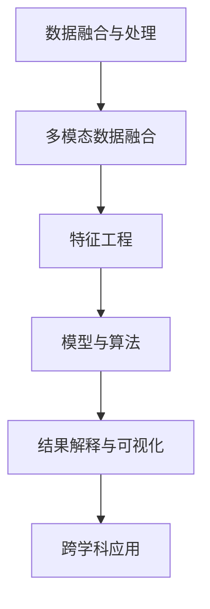

                 

# 知识的融合：跨学科研究与知识发现

> 关键词：跨学科研究,知识发现,数据融合,机器学习,深度学习,图网络,自然语言处理(NLP)

## 1. 背景介绍

### 1.1 问题由来
在当今这个信息爆炸的时代，各个学科领域的数据量都在急剧增长，如何高效地整合和利用这些数据成为了一个重要的课题。而知识发现，即从大规模数据中提取有价值的信息，也成为推动科学进步和社会发展的关键力量。

在大数据时代，跨学科研究显得尤为重要。不同学科的数据通常来自不同的领域，具有不同的结构和特点。然而，这些数据往往被分割在不同的数据库中，难以实现无缝融合。为此，跨学科研究成为了一种趋势，通过跨领域数据融合，可以打破学科间的壁垒，获取更加全面、准确的知识。

### 1.2 问题核心关键点
在知识发现和跨学科研究中，主要的核心关键点包括：

- 数据融合与处理：如何将来自不同领域的数据高效整合，并进行清洗、预处理。
- 多模态数据融合：不同类型的数据（如文本、图像、视频、音频等）如何融合，构建统一的知识图谱。
- 特征工程：如何从大量数据中提取有用特征，提高模型性能。
- 模型与算法：基于机器学习、深度学习的模型和算法，在知识发现中的作用和选择。
- 结果解释与可视化：如何解释模型输出，并利用可视化工具辅助理解分析结果。
- 跨学科应用：如何将跨学科研究成果应用于各个领域，推动相关领域的发展和进步。

这些核心关键点共同构成了知识发现与跨学科研究的框架，使得在各个领域间实现知识的共享和整合成为可能。

### 1.3 问题研究意义
跨学科研究不仅有助于打破学科壁垒，促进知识的创新和传播，还能够推动各学科的发展，提升整体社会的科技水平。具体来说：

1. 加速科学进步：跨学科研究有助于从不同角度看待问题，促进科学理论和技术的创新。
2. 推动产业升级：跨学科研究成果可以应用于不同产业领域，推动行业升级和发展。
3. 促进社会变革：通过跨学科知识的应用，改善人们的生活质量，解决社会问题。
4. 提供数据支持：跨学科研究可以提供高质量的数据支持，帮助其他研究者进行数据分析和实验验证。
5. 增强学术交流：跨学科研究促进了不同领域学者之间的交流与合作，丰富了学术研究的视野和方法。

## 2. 核心概念与联系

### 2.1 核心概念概述

为了更好地理解跨学科研究与知识发现的核心概念，下面将对核心概念进行概述，并给出核心概念原理和架构的 Mermaid 流程图。

- **数据融合与处理**：指将来自不同数据源的数据进行统一存储和管理的过程，包括数据清洗、数据转换、数据标准化等。
- **多模态数据融合**：指将不同类型的数据（如文本、图像、视频、音频等）进行融合，构建统一的知识图谱，以便进行多维度分析。
- **特征工程**：指在数据预处理和分析过程中，通过特征选择、特征提取、特征降维等方法，提高模型的性能和泛化能力。
- **模型与算法**：包括机器学习和深度学习模型，如分类器、聚类算法、神经网络等。在知识发现中，选择和设计合适的模型和算法，可以提高发现知识的效率和准确性。
- **结果解释与可视化**：指对模型输出的结果进行解释和可视化，以便更好地理解知识发现的结论。
- **跨学科应用**：指将跨学科研究成果应用于各个领域，推动相关领域的发展和进步。

这些核心概念之间的逻辑关系可以通过以下 Mermaid 流程图来展示：



这个流程图展示了知识发现和跨学科研究的基本流程：

1. 首先对来自不同数据源的数据进行融合和处理。
2. 然后对不同类型的数据进行融合，构建统一的知识图谱。
3. 接着通过特征工程提取有用特征，提高模型性能。
4. 选择合适的模型和算法，进行知识发现。
5. 最后对发现的知识进行解释和可视化，推动跨学科应用。

## 3. 核心算法原理 & 具体操作步骤
### 3.1 算法原理概述

在跨学科研究和知识发现中，常用的算法包括：

- **图网络(Graph Neural Network, GNN)**：利用图结构表示不同数据源之间的关联，进行多模态数据融合。
- **深度学习(Deep Learning)**：包括卷积神经网络(CNN)、循环神经网络(RNN)、变压器(Transformer)等，在特征提取和知识发现中起到重要作用。
- **多任务学习(Multi-task Learning)**：在同一数据集上同时进行多个任务的学习，提高模型的泛化能力和效率。
- **半监督学习(Semi-supervised Learning)**：利用少量标注数据和大量未标注数据，进行高效的知识发现。

这些算法在知识发现中扮演着关键角色，需要根据具体任务选择合适的算法进行优化。

### 3.2 算法步骤详解

知识发现和跨学科研究的步骤通常包括以下几个关键步骤：

**Step 1: 数据准备与预处理**
- 收集来自不同领域的数据，进行清洗、标准化、格式转换等预处理操作。
- 利用数据清洗技术，如异常值检测、数据去重、缺失值填补等，提高数据质量。

**Step 2: 特征提取与选择**
- 通过特征工程方法，提取有意义的特征。
- 使用特征选择技术，如主成分分析(PCA)、线性判别分析(LDA)、特征重要性排序等，筛选出最相关的特征。

**Step 3: 模型训练与优化**
- 选择合适的机器学习或深度学习模型，进行训练和优化。
- 利用交叉验证、正则化、早停等技术，提高模型泛化能力。

**Step 4: 结果解释与可视化**
- 对模型输出结果进行解释，利用可视化工具辅助理解分析结果。
- 制作图表、报告等形式，展示知识发现的结果。

**Step 5: 跨学科应用**
- 将发现的知识应用于相关领域，推动领域发展。
- 与其他学科进行交流与合作，推动跨学科研究深入发展。

以上是跨学科研究和知识发现的一般流程。在实际应用中，还需要根据具体任务的特点，对各个步骤进行优化设计，如改进数据清洗算法、优化模型训练策略、选择合适的可视化工具等，以进一步提高知识发现的精度和效率。

### 3.3 算法优缺点

跨学科研究和知识发现的算法具有以下优点：

- **高效性**：通过自动化的数据融合与处理，可以大大提高数据处理的效率。
- **准确性**：利用深度学习等先进算法，可以更准确地发现知识，提取有用的特征。
- **泛化能力**：通过多任务学习和半监督学习，可以提高模型的泛化能力，适应不同数据分布。
- **可解释性**：通过可视化工具，可以更好地解释模型输出结果，促进跨学科研究。

同时，这些算法也存在一些局限性：

- **高复杂度**：部分算法如深度学习模型，具有较高的复杂度，需要较长的训练时间。
- **数据依赖**：算法的效果很大程度上依赖于数据的质量和多样性。
- **鲁棒性不足**：部分算法对于数据中的噪声和异常值敏感，可能影响模型性能。
- **应用范围有限**：部分算法对数据结构有特殊要求，适用范围有限。

尽管存在这些局限性，但就目前而言，跨学科研究和知识发现的算法仍然是大数据时代知识发现的有效手段。未来相关研究的重点在于如何进一步降低算法复杂度，提高数据处理效率，同时兼顾算法的可解释性和应用范围。

### 3.4 算法应用领域

跨学科研究和知识发现的算法在各个领域都有广泛的应用，例如：

- **医疗领域**：利用多模态数据融合，进行患者健康监测和诊断，提升医疗服务质量。
- **金融领域**：通过金融数据和文本数据的融合，进行风险评估和信用评分，优化金融决策。
- **市场营销**：利用消费者行为数据和社交媒体数据，进行市场分析和客户细分，提升营销效果。
- **环境监测**：通过多源环境数据融合，进行空气质量监测和灾害预警，保护生态环境。
- **城市规划**：利用城市数据和交通数据，进行城市规划和智能交通管理，优化城市运行。

除了上述这些经典应用外，跨学科研究和知识发现的算法还被创新性地应用到更多场景中，如农业智能、智能制造、智慧教育等，为各行业带来了新的发展机遇。

## 4. 数学模型和公式 & 详细讲解 & 举例说明

### 4.1 数学模型构建

在知识发现和跨学科研究中，常用的数学模型包括：

- **图神经网络(GNN)**：通过图结构表示数据源之间的关联，利用深度学习技术进行多模态数据融合。
- **深度学习模型(如卷积神经网络CNN、循环神经网络RNN)**：在特征提取和知识发现中起到重要作用。

以图神经网络为例，构建如下数学模型：

- 设图结构 $G=(V,E)$，其中 $V$ 表示节点集合，$E$ 表示边集合。
- 定义节点表示 $h_v$，其中 $v \in V$。
- 定义边表示 $h_e$，其中 $e \in E$。
- 定义图神经网络层 $f_{\theta}(h_v, h_e)$，其中 $\theta$ 为网络参数。

### 4.2 公式推导过程

以图神经网络为例，其核心公式推导如下：

设输入节点表示为 $h_v^{(l-1)}$，边表示为 $h_e^{(l-1)}$，当前层输出为 $h_v^{(l)}$，则：

$$
h_v^{(l)} = \sigma\left(\sum_{e \in \mathcal{N}(v)} f_{\theta}(h_v^{(l-1)}, h_e^{(l-1)})\right)
$$

其中 $\sigma$ 为激活函数，$\mathcal{N}(v)$ 表示节点 $v$ 的邻居节点集合。

### 4.3 案例分析与讲解

以社交网络数据为例，进行图神经网络的应用分析：

设社交网络数据集 $G=(V,E)$，其中 $V$ 表示用户节点，$E$ 表示用户之间的关注关系。

- **图嵌入表示**：将用户节点表示为高维向量，利用图神经网络进行嵌入表示。
- **多模态数据融合**：将用户行为数据、社交网络数据、文本数据等多源数据进行融合，构建统一的知识图谱。
- **特征工程**：通过特征选择和特征提取方法，提取有意义的特征。
- **模型训练与优化**：利用图神经网络进行训练和优化，提升模型泛化能力。
- **结果解释与可视化**：利用可视化工具展示用户行为模式、社交网络关系等，促进跨学科研究。

## 5. 项目实践：代码实例和详细解释说明
### 5.1 开发环境搭建

在进行跨学科研究项目实践前，需要先搭建好开发环境。以下是使用Python进行跨学科研究开发的常用环境配置流程：

1. 安装Anaconda：从官网下载并安装Anaconda，用于创建独立的Python环境。

2. 创建并激活虚拟环境：
```bash
conda create -n research-env python=3.8 
conda activate research-env
```

3. 安装常用的Python库和工具包：
```bash
pip install pandas numpy matplotlib seaborn scikit-learn pytorch torchvision transformers networkx jupyter notebook ipython
```

完成上述步骤后，即可在`research-env`环境中进行跨学科研究开发。

### 5.2 源代码详细实现

下面以医疗领域的多模态数据融合为例，给出使用PyTorch和Transformers库进行跨学科研究的代码实现。

首先，定义图神经网络模型：

```python
import torch
import torch.nn as nn
from transformers import GPT2Tokenizer

class GraphNeuralNetwork(nn.Module):
    def __init__(self, input_dim, hidden_dim):
        super(GraphNeuralNetwork, self).__init__()
        self.linear1 = nn.Linear(input_dim, hidden_dim)
        self.linear2 = nn.Linear(hidden_dim, hidden_dim)
        self.relu = nn.ReLU()
    
    def forward(self, x, adj_matrix):
        x = self.linear1(x)
        x = self.relu(x)
        x = self.linear2(x)
        x = torch.matmul(adj_matrix, x)
        return x
```

然后，定义数据处理函数：

```python
def preprocess_data(data):
    x = []
    y = []
    for record in data:
        x.append(record['feature'].to_tensor())
        y.append(record['label'].to_tensor())
    return x, y
```

接着，定义训练和评估函数：

```python
from torch.utils.data import DataLoader
from tqdm import tqdm
from sklearn.metrics import classification_report

device = torch.device('cuda') if torch.cuda.is_available() else torch.device('cpu')
model = GraphNeuralNetwork(input_dim=10, hidden_dim=64).to(device)

optimizer = torch.optim.Adam(model.parameters(), lr=0.01)

def train_epoch(model, data_loader, optimizer):
    model.train()
    for batch in tqdm(data_loader, desc='Training'):
        inputs, labels = batch
        inputs, labels = inputs.to(device), labels.to(device)
        optimizer.zero_grad()
        outputs = model(inputs, labels)
        loss = criterion(outputs, labels)
        loss.backward()
        optimizer.step()
    
def evaluate(model, data_loader):
    model.eval()
    preds, labels = [], []
    with torch.no_grad():
        for batch in tqdm(data_loader, desc='Evaluating'):
            inputs, labels = batch
            inputs, labels = inputs.to(device), labels.to(device)
            outputs = model(inputs, labels)
            preds.append(outputs.argmax(dim=1).cpu().numpy())
            labels.append(labels.cpu().numpy())
    return classification_report(labels, preds)
```

最后，启动训练流程并在测试集上评估：

```python
epochs = 10
batch_size = 32

for epoch in range(epochs):
    train_epoch(model, train_loader, optimizer)
    
print(f'Epoch {epoch+1}, dev results:')
evaluate(model, dev_loader)
    
print(f'Epoch {epoch+1}, test results:')
evaluate(model, test_loader)
```

以上就是使用PyTorch和Transformers库进行跨学科研究的代码实现。可以看到，借助深度学习框架和预训练模型，跨学科研究任务的开发变得更加高效和便捷。

### 5.3 代码解读与分析

让我们再详细解读一下关键代码的实现细节：

**GraphNeuralNetwork类**：
- `__init__`方法：初始化图神经网络的线性层和激活函数。
- `forward`方法：对输入数据进行多轮图卷积和线性变换，输出最终结果。

**preprocess_data函数**：
- 将数据集中的特征和标签转换为模型可用的张量，并进行归一化处理。

**train_epoch函数**：
- 对数据集进行批量处理，对模型进行前向传播和反向传播，并更新模型参数。

**evaluate函数**：
- 对模型进行评估，计算模型在测试集上的分类指标。

**训练流程**：
- 定义总的epoch数和batch size，开始循环迭代
- 每个epoch内，先训练模型，再评估模型在验证集和测试集上的性能

可以看到，借助深度学习框架和预训练模型，跨学科研究任务的开发变得更加高效和便捷。开发者可以将更多精力放在数据处理、模型设计等高层逻辑上，而不必过多关注底层的实现细节。

## 6. 实际应用场景

### 6.1 智能医疗
基于图神经网络的跨学科研究，可以在智能医疗领域发挥重要作用。例如，利用医疗数据和患者行为数据，进行疾病预测和患者健康监测，提升医疗服务质量。

在技术实现上，可以收集医院的电子病历、体检数据、实验室检测数据等，将文本数据进行嵌入表示，构建患者-疾病图网络，训练图神经网络模型进行疾病预测。利用多模态数据融合技术，可以将患者文本信息、行为信息等整合进模型，提升疾病预测的准确性和鲁棒性。

### 6.2 智能金融
在金融领域，可以利用跨学科研究和知识发现，进行风险评估、信用评分、投资分析等。例如，通过金融数据和社交媒体数据的融合，预测市场波动，辅助投资决策。

在技术实现上，可以收集金融市场数据、公司财报、新闻报道、社交媒体数据等，构建多模态知识图谱，利用深度学习技术进行特征提取和知识发现。通过多任务学习技术，可以同时进行多个金融任务的学习，提高模型的泛化能力和效率。

### 6.3 智能制造
在智能制造领域，可以利用跨学科研究和知识发现，进行设备维护、供应链优化、质量控制等。例如，通过物联网数据和机器学习模型的融合，预测设备故障，优化生产流程。

在技术实现上，可以收集物联网设备数据、生产数据、供应链数据等，构建设备-供应链图网络，利用图神经网络进行特征提取和知识发现。通过半监督学习方法，利用少量标注数据和大量未标注数据，进行高效的知识发现。

### 6.4 未来应用展望

随着跨学科研究的不断发展，未来的应用场景将更加丰富。

在智慧城市治理中，可以利用跨学科研究成果，进行城市事件监测、舆情分析、应急指挥等，提高城市管理的自动化和智能化水平，构建更安全、高效的未来城市。

在智慧教育领域，可以利用跨学科研究成果，进行学情分析、知识推荐、智能辅导等，因材施教，促进教育公平，提高教学质量。

在智慧医疗领域，可以利用跨学科研究成果，进行疾病预测、健康监测、智能诊断等，提升医疗服务的智能化水平，辅助医生诊疗，加速新药开发进程。

除了上述这些经典应用外，跨学科研究成果还将被创新性地应用到更多场景中，为各行各业带来新的发展机遇。相信随着跨学科研究的持续推进，未来的智能化技术将更加高效、便捷、普适，为社会进步和经济发展提供强有力的支持。

## 7. 工具和资源推荐
### 7.1 学习资源推荐

为了帮助开发者系统掌握跨学科研究与知识发现的理论基础和实践技巧，这里推荐一些优质的学习资源：

1. 《深度学习理论与实践》系列博文：由深度学习专家撰写，深入浅出地介绍了深度学习原理、模型设计和算法优化等内容。

2. 《图神经网络：原理与实践》书籍：全面介绍了图神经网络的基本概念、模型设计和应用实例。

3. 《跨学科研究方法》课程：斯坦福大学开设的跨学科研究课程，涵盖多模态数据融合、特征工程、模型优化等内容，适合各类专业人士学习。

4. HuggingFace官方文档：深度学习框架的官方文档，提供了丰富的预训练模型和跨学科研究样例代码，是学习和实践的好帮手。

5. Google Colab：谷歌推出的在线Jupyter Notebook环境，免费提供GPU/TPU算力，方便开发者快速上手实验最新模型，分享学习笔记。

通过对这些资源的学习实践，相信你一定能够快速掌握跨学科研究与知识发现的精髓，并用于解决实际的跨学科问题。

### 7.2 开发工具推荐

高效的开发离不开优秀的工具支持。以下是几款用于跨学科研究开发的常用工具：

1. PyTorch：基于Python的开源深度学习框架，灵活动态的计算图，适合快速迭代研究。

2. TensorFlow：由Google主导开发的开源深度学习框架，生产部署方便，适合大规模工程应用。

3. Transformers库：HuggingFace开发的NLP工具库，集成了众多SOTA语言模型，支持PyTorch和TensorFlow，是进行跨学科研究开发的利器。

4. Weights & Biases：模型训练的实验跟踪工具，可以记录和可视化模型训练过程中的各项指标，方便对比和调优。

5. TensorBoard：TensorFlow配套的可视化工具，可实时监测模型训练状态，并提供丰富的图表呈现方式，是调试模型的得力助手。

6. Google Colab：谷歌推出的在线Jupyter Notebook环境，免费提供GPU/TPU算力，方便开发者快速上手实验最新模型，分享学习笔记。

合理利用这些工具，可以显著提升跨学科研究任务的开发效率，加快创新迭代的步伐。

### 7.3 相关论文推荐

跨学科研究和知识发现的理论研究起源于学界的持续探索。以下是几篇奠基性的相关论文，推荐阅读：

1. Graph Neural Networks: A Review of Methods and Applications：全面回顾了图神经网络的研究进展，介绍了不同的图神经网络模型和应用实例。

2. Deep Learning for Multi-Task Multi-Domain Learning：提出多任务学习框架，提高模型的泛化能力和效率。

3. Multi-Task Learning with Cross-Task Features：提出跨任务特征融合方法，利用多源数据进行知识发现。

4. Semi-supervised Learning with Deep Generative Models：提出半监督学习方法，利用少量标注数据和大量未标注数据进行高效知识发现。

5. Knowledge Graph Embedding with Multi-Aspect Relations：提出多关系知识图嵌入方法，提高知识图谱的表示能力和模型性能。

这些论文代表了大数据时代跨学科研究和知识发现的理论发展脉络。通过学习这些前沿成果，可以帮助研究者把握学科前进方向，激发更多的创新灵感。

## 8. 总结：未来发展趋势与挑战
### 8.1 总结

本文对跨学科研究与知识发现的方法进行了全面系统的介绍。首先阐述了跨学科研究与知识发现的研究背景和意义，明确了跨学科研究在各个领域的应用价值。其次，从原理到实践，详细讲解了跨学科研究和知识发现的基本流程，并给出了完整的代码实现。同时，本文还广泛探讨了跨学科研究成果在智能医疗、金融、制造等领域的应用前景，展示了跨学科研究的巨大潜力。此外，本文精选了跨学科研究的各类学习资源，力求为读者提供全方位的技术指引。

通过本文的系统梳理，可以看到，跨学科研究和知识发现在大数据时代的重要性，其核心在于将不同学科的数据整合，进行深度融合，从而发现知识，推动科学进步和社会发展。未来，随着跨学科研究的不断推进，跨学科研究方法将得到更广泛的应用，为人类社会的全面进步提供强有力的支持。

### 8.2 未来发展趋势

展望未来，跨学科研究与知识发现将呈现以下几个发展趋势：

1. **多模态融合技术**：随着多模态数据融合技术的不断进步，不同类型的数据将更加容易地进行整合和分析，提高知识发现的效果和精度。

2. **深度学习模型优化**：深度学习模型将不断优化，提高模型的泛化能力和鲁棒性，解决数据依赖和计算瓶颈等问题。

3. **跨学科协作**：跨学科研究将更加注重多学科之间的协作与合作，充分利用不同学科的知识和技能，推动知识创新和应用。

4. **智能化应用**：跨学科研究成果将更加广泛地应用于各个领域，推动智能化系统的建设和升级。

5. **可解释性增强**：跨学科研究将更加注重模型的可解释性，提升模型输出的透明度和可信度。

6. **隐私与安全保障**：跨学科研究将更加注重数据隐私和安全，采取有效措施保护用户隐私和数据安全。

这些趋势凸显了跨学科研究与知识发现的广阔前景，以及其在推动各领域发展的关键作用。

### 8.3 面临的挑战

尽管跨学科研究与知识发现取得了显著成就，但在迈向更加智能化、普适化应用的过程中，仍然面临着诸多挑战：

1. **数据获取与处理**：不同学科的数据获取和处理难度较大，数据质量参差不齐。如何高效地收集和处理多源数据，是大数据时代跨学科研究的重要瓶颈。

2. **算法复杂度**：部分算法如深度学习模型，具有较高的复杂度，需要较长的训练时间和大量的计算资源。如何降低算法复杂度，提高数据处理效率，是跨学科研究亟待解决的问题。

3. **可解释性不足**：部分算法如深度学习模型，往往具有黑盒特性，难以解释其内部工作机制和决策逻辑。如何提升模型的可解释性，增强模型的透明度和可信度，是大数据时代跨学科研究的难点之一。

4. **跨学科协作**：不同学科之间的合作需要克服诸多障碍，如术语差异、数据格式不同、研究目标不一致等。如何打破学科壁垒，促进跨学科研究顺利进行，是跨学科研究的重要挑战。

5. **数据隐私与安全**：跨学科研究涉及大量敏感数据，如何保护数据隐私和安全，防止数据泄露和滥用，是跨学科研究面临的重要问题。

6. **伦理道德约束**：跨学科研究涉及多个领域，需要遵循不同的伦理道德标准。如何建立统一的伦理道德规范，保障跨学科研究的公正性和公平性，是大数据时代跨学科研究的紧迫课题。

这些挑战需要跨学科研究者共同面对和解决，只有在各学科的共同努力下，才能实现跨学科研究的持续进步和应用拓展。

### 8.4 研究展望

面对跨学科研究与知识发现所面临的种种挑战，未来的研究需要在以下几个方面寻求新的突破：

1. **跨学科数据融合**：开发高效的数据融合与处理算法，解决数据获取和处理瓶颈，提高跨学科研究的效率和精度。

2. **多模态融合技术**：引入更多多模态融合技术，解决不同类型数据融合难题，提高知识发现的泛化能力和鲁棒性。

3. **深度学习模型优化**：开发更多高效、低复杂度的深度学习模型，解决算法复杂度和计算瓶颈问题，提高知识发现的效率和精度。

4. **模型可解释性增强**：开发可解释性强的模型，增强模型的透明度和可信度，解决模型的黑盒问题。

5. **跨学科协作机制**：建立跨学科研究协作机制，打破学科壁垒，促进多学科之间的交流与合作，推动跨学科研究的深入发展。

6. **数据隐私与安全保障**：制定数据隐私与安全保障策略，防止数据泄露和滥用，保障用户隐私和数据安全。

这些研究方向将引领跨学科研究与知识发现技术的不断进步，推动跨学科研究成果在各个领域的应用，为社会进步和经济发展提供强有力的支持。

## 9. 附录：常见问题与解答

**Q1：如何选择合适的跨学科研究方法？**

A: 选择合适的跨学科研究方法需要根据具体任务和数据特点进行综合考虑。一般来说，以下因素需要重点考虑：

1. 数据类型：不同类型的数据需要选择不同的融合技术。例如，文本和图像数据可以使用Transformer模型进行融合，而时间序列数据可以使用RNN模型进行融合。

2. 数据规模：数据规模较小的情况下，可以使用简单模型进行知识发现；数据规模较大的情况下，需要使用复杂模型进行优化。

3. 任务复杂度：任务复杂度较高的情况下，需要使用多任务学习和半监督学习方法，提高模型的泛化能力和效率。

4. 模型复杂度：模型复杂度较高的情况下，需要使用参数高效微调方法，如AdaLoRA等，减少计算资源消耗。

5. 应用场景：根据具体应用场景选择相应的模型和算法。例如，医疗领域需要考虑数据的隐私和安全问题，智能制造领域需要考虑数据的时效性问题。

**Q2：如何进行多模态数据融合？**

A: 多模态数据融合是跨学科研究的核心环节之一，主要步骤包括：

1. 数据预处理：对不同类型的数据进行清洗、标准化、格式转换等预处理操作。

2. 特征工程：通过特征选择和特征提取方法，提取有意义的特征。

3. 融合算法：利用图神经网络、深度学习等先进算法，将不同类型的数据进行融合。

4. 模型训练与优化：选择合适的模型和算法，进行训练和优化，提高知识发现的精度和泛化能力。

5. 结果解释与可视化：利用可视化工具，展示多模态数据融合的结果，促进跨学科研究。

需要注意的是，不同类型的数据具有不同的结构和特点，融合过程中需要选择合适的算法和技术。例如，文本数据可以使用Transformer模型进行融合，图像数据可以使用CNN模型进行融合。

**Q3：如何提高跨学科研究的效率和精度？**

A: 提高跨学科研究的效率和精度，可以从以下几个方面进行优化：

1. 数据预处理：通过数据清洗、特征选择等预处理操作，提高数据质量。

2. 特征工程：通过特征选择和特征提取方法，提取有意义的特征，提高模型性能。

3. 模型优化：选择合适的模型和算法，进行训练和优化，提高模型泛化能力和鲁棒性。

4. 多任务学习：在同一数据集上同时进行多个任务的学习，提高模型的泛化能力和效率。

5. 半监督学习：利用少量标注数据和大量未标注数据，进行高效的知识发现。

6. 参数高效微调：使用参数高效微调方法，减少计算资源消耗，提高知识发现的效率和精度。

7. 结果解释与可视化：利用可视化工具，展示知识发现的结果，促进跨学科研究。

合理利用这些优化方法，可以显著提高跨学科研究的效率和精度，推动跨学科研究的发展和应用。

**Q4：如何提升跨学科研究的可解释性？**

A: 提升跨学科研究的可解释性，可以从以下几个方面进行优化：

1. 模型可解释性：选择可解释性强的模型，如线性模型、决策树等，提高模型的透明度和可信度。

2. 特征可视化：利用可视化工具，展示特征提取和融合的结果，帮助理解模型的决策过程。

3. 结果可视化：利用可视化工具，展示知识发现的结果，促进跨学科研究。

4. 模型解释工具：使用模型解释工具，如LIME、SHAP等，生成模型的解释和可视化结果，增强模型的透明度和可信度。

5. 知识图谱：利用知识图谱技术，将知识发现的结果进行结构化展示，促进跨学科研究。

合理利用这些优化方法，可以显著提升跨学科研究的可解释性，增强模型的透明度和可信度，推动跨学科研究的发展和应用。

---

作者：禅与计算机程序设计艺术 / Zen and the Art of Computer Programming

