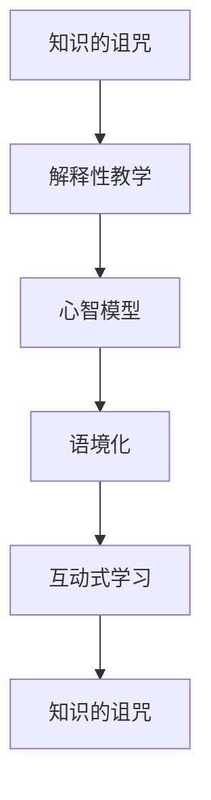

                 

# 知识的诅咒：专家为何难以简化解释

## 1. 背景介绍

### 1.1 问题由来
在技术领域，专家往往面临一个无法回避的问题：如何将复杂深奥的原理和思想简化为浅显易懂的解释，以向非专业人士（或新手）进行有效传达？这一现象被称为“知识的诅咒”，即“知道太多”反而使我们难以用简单的语言表达复杂的内容，因为我们的脑海中充满了丰富的背景知识，那些明显的细节对我们来说是不言自明的，但在其他人看来却难以理解。

### 1.2 问题核心关键点
知识的诅咒是专家和新手在沟通中的天然鸿沟，这一问题不仅在技术传播中存在，也普遍存在于各个行业领域。专家试图简化解释的难点主要包括以下几个方面：
- 概念复杂：技术概念和术语往往涉及大量的背景知识，难以用简洁的语言表述。
- 细节冗余：在专家头脑中，已知信息会被自动化处理，无意识地忽略掉对新手来说重要的细节。
- 语境缺失：专家可能认为已经预设的语境对新手来说显而易见，而对新手来说这些语境却是不存在的。
- 思维跳跃：专家可能默认新手具备同样的知识水平，从而使用跳跃式的思维逻辑，导致解释过程断层。

### 1.3 问题研究意义
解决知识的诅咒问题对于提高技术传播效率、促进知识共享、推动技术普及具有重要意义。通过简化解释，不仅能够帮助新手快速掌握技术，也能够使专家更有效地与外界沟通，形成良性互动。以下具体探讨如何克服知识的诅咒，简化复杂技术知识的解释和传递。

## 2. 核心概念与联系

### 2.1 核心概念概述
为更好地理解专家与新手之间的沟通障碍及其解决方法，本节将介绍几个关键概念：

- **知识的诅咒（Curse of Knowledge）**：专家由于拥有丰富背景知识，难以用简单语言表达复杂概念的现象。
- **解释性教学（Expository Teaching）**：通过明晰的语言和结构化的逻辑，将复杂知识传递给新手的教学方法。
- **心智模型（Mental Model）**：个人理解和内化知识的内部表征，不同背景的人具有不同的心智模型。
- **语境化（Contextualization）**：在解释过程中引入相关的背景知识和情境，使新手能够更容易理解。
- **互动式学习（Interactive Learning）**：通过问答、实验等方式，促进专家与新手之间的互动，及时纠正误解。

这些概念之间的联系可以通过以下Mermaid流程图来展示：



这个流程图展示了专家在进行解释性教学时，如何通过心智模型理解新手的认知水平，利用语境化引入必要的背景知识，并通过互动式学习，不断调整和优化解释方式，最终解决知识的诅咒问题。

## 3. 核心算法原理 & 具体操作步骤

### 3.1 算法原理概述

为了解决专家难以简化解释的问题，专家可以采用以下算法和策略：

**算法原理：**
1. **心智模型匹配**：了解新手的背景知识和认知水平，并根据其心智模型设计解释路径。
2. **语境化引入**：在解释中引入相关背景知识和情境，帮助新手建立新的心智模型。
3. **结构化组织**：通过分层次、分步骤的方式，将复杂知识组织成易于理解的模块。
4. **互动式反馈**：通过提问、实验等方式，及时收集新手的反馈，调整解释策略。

**操作步骤：**
1. **预处理新手知识**：收集新手的相关背景知识，了解其认知水平。
2. **设计解释路径**：根据新手的心智模型，设计解释的层次和顺序，避免跳跃式思维。
3. **引入语境化知识**：在每个层次的解释中，引入必要的背景知识和情境，确保新手能够跟上。
4. **结构化组织内容**：将复杂内容分解成多个小模块，每个模块聚焦一个核心概念或步骤。
5. **互动式调整**：通过问答、模拟实验等方式，收集新手的反馈，并据此调整解释策略。

### 3.2 算法步骤详解

以下详细介绍解决知识的诅咒的具体操作步骤：

**Step 1: 收集新手背景知识**
- 通过问卷调查、访谈等方式，收集新手的相关背景知识和当前认知水平。
- 根据新手的学历、专业背景和工作经验，判断其在特定技术领域的起点。

**Step 2: 设计解释路径**
- 设计从新手已知的知识点逐步引入新技术或新概念的解释路径。
- 避免直接从专家视角跳跃式解释，每个步骤应该立足于新手的知识基础。

**Step 3: 引入语境化知识**
- 在解释每个新知识点时，先引入相关的背景知识，如行业现状、历史背景、技术演变等。
- 使用具体案例、比喻或类比等方式，帮助新手理解新技术与旧知识的联系。

**Step 4: 结构化组织内容**
- 将复杂内容分解为多个小模块，每个模块聚焦一个核心概念或步骤。
- 使用图表、列表、流程等视觉工具，帮助新手更直观地理解内容结构。

**Step 5: 互动式调整**
- 通过提问、实验或模拟练习，及时收集新手的反馈，判断其理解程度。
- 根据反馈调整解释方式和内容，不断迭代优化，直至新手能够全面理解。

### 3.3 算法优缺点

**算法优点：**
1. **知识传递精准**：通过心智模型匹配和语境化引入，确保解释内容符合新手的认知水平。
2. **互动效率高**：互动式学习能够及时调整和优化解释策略，提升学习效率。
3. **结构清晰**：通过结构化组织内容，使复杂知识更易于理解和记忆。

**算法缺点：**
1. **时间成本高**：设计解释路径和调整解释策略需要较多时间，且不一定能完全覆盖新手的需求。
2. **可能存在误解**：新手的反馈可能不完全准确，解释方式调整仍可能存在偏差。

### 3.4 算法应用领域

基于心智模型匹配和语境化引入的算法，可以应用于各个领域的知识传播，尤其是技术领域：

- **软件开发**：向新手讲解新的编程语言或框架，通过匹配新手的编程基础，引入必要的背景知识。
- **数据科学**：向非技术背景的新手介绍机器学习算法，通过类比常见概念，帮助理解算法原理。
- **项目管理**：向项目团队成员讲解敏捷开发、Scrum等管理工具，通过具体案例和模拟练习，帮助理解和应用。
- **产品设计**：向产品经理或市场团队讲解用户研究方法，通过场景模拟和案例分析，帮助理解用户体验设计和用户反馈。

## 4. 数学模型和公式 & 详细讲解 & 举例说明

### 4.1 数学模型构建

知识诅咒的解决涉及认知心理学的概念，可以通过心理语言学的模型来进行描述。心理语言学研究个体如何理解和使用语言，其中心智模型和语境化是关键概念。

**心智模型**：
- 定义：个体对世界和知识的内部表征。
- 功能：帮助个体快速处理信息和做出决策。
- 建模：用心理模型或知识图谱来描述心智模型。

**语境化**：
- 定义：在解释中使用背景知识和情境。
- 功能：帮助新手理解新知识与旧知识的联系。
- 建模：用上下文表示方法（如句法-语义树）来描述语境化。

### 4.2 公式推导过程

**心智模型匹配公式**：
设新手的认知水平为 $K_{\text{new}}$，专家的认知水平为 $K_{\text{expert}}$。心智模型匹配的目标是使 $K_{\text{new}}$ 与 $K_{\text{expert}}$ 重合。
$$
K_{\text{new}} \rightarrow K_{\text{expert}} \text{ (心智模型匹配)}
$$

**语境化引入公式**：
设新知识点为 $N$，相关背景知识为 $C$。语境化引入的目标是将 $N$ 融入 $C$ 中，帮助新手理解。
$$
N \rightarrow C + N \text{ (语境化引入)}
$$

**结构化组织公式**：
设复杂内容为 $M$，结构化模块为 $M_{\text{structured}}$。结构化组织的目标是将 $M$ 分解为 $M_{\text{structured}}$。
$$
M \rightarrow M_{\text{structured}} \text{ (结构化组织)}
$$

**互动式调整公式**：
设新手反馈为 $F$，调整后的解释为 $E_{\text{adjusted}}$。互动式调整的目标是不断优化 $E_{\text{adjusted}}$。
$$
E_{\text{adjusted}} = E_{\text{adjusted}} + F \times \Delta
$$

### 4.3 案例分析与讲解

**案例背景**：向新入职的软件开发工程师讲解异步编程概念。

**心智模型匹配**：
- 新手：没有异步编程经验，但对并发编程有一定了解。
- 专家：熟悉异步编程模型和语言库，如JavaScript的Promise、Python的async/await。

**语境化引入**：
- 背景知识：并发编程、线程和锁的基本概念。
- 情境：展示异步编程在并发场景中的应用，如Web应用程序的请求处理。
- 具体示例：使用Promise实现简单的异步函数调用。

**结构化组织**：
- 模块一：异步编程基本概念
- 模块二：Promise和async/await语法
- 模块三：异步编程的优点和应用场景
- 模块四：异步编程的常见问题和解决方法

**互动式调整**：
- 通过提问，了解新手对每个模块的理解程度。
- 通过编程练习，验证新手的掌握情况。
- 根据新手的反馈，调整教学内容和方法。

## 5. 项目实践：代码实例和详细解释说明

### 5.1 开发环境搭建

在进行解释性教学的实践前，我们需要准备好开发环境。以下是使用Python进行代码编写的环境配置流程：

1. 安装Anaconda：从官网下载并安装Anaconda，用于创建独立的Python环境。

2. 创建并激活虚拟环境：
```bash
conda create -n explain-env python=3.8 
conda activate explain-env
```

3. 安装相关工具包：
```bash
pip install numpy pandas matplotlib scipy sympy jupyter notebook
```

完成上述步骤后，即可在`explain-env`环境中开始教学实践。

### 5.2 源代码详细实现

下面以编程语言教学为例，给出使用Jupyter Notebook实现解释性教学的PyTorch代码实现。

**教学脚本**：

```python
from IPython.display import display
from sympy import symbols, Function, Eq, solve
import numpy as np

# 定义符号变量
x = symbols('x')

# 定义函数
f = Function('f')

# 展示基本函数定义
display(f(x))

# 求解方程
eq = Eq(f(x), x**2)
solution = solve(eq, x)
display(solution)

# 使用Python代码展示函数图像
x_values = np.linspace(-10, 10, 1000)
y_values = [f.subs(x, val) for val in x_values]
display(np.plot(x_values, y_values))
```

**教学过程**：
1. 通过Sympy定义函数 `f(x) = x^2`。
2. 使用 `display` 函数展示函数定义和求解方程 `f(x) = x^2` 的解。
3. 使用Python代码绘制函数图像，展示函数形状。

### 5.3 代码解读与分析

让我们再详细解读一下关键代码的实现细节：

**教学脚本**：
- 使用Sympy库定义函数 `f(x) = x^2`。
- 使用 `display` 函数展示函数定义和求解方程。
- 使用Python代码绘制函数图像。

**教学过程**：
1. 通过Sympy定义函数 `f(x) = x^2`，使用 `display` 函数展示函数定义和求解方程。
2. 使用Python代码绘制函数图像，展示函数形状。

**代码解读**：
- Sympy是一个Python的符号计算库，支持符号计算、方程求解、微积分等高级功能。
- `display` 函数用于在Jupyter Notebook中展示代码结果，如函数定义和方程求解。
- 使用Python代码绘制函数图像，展示函数形状，帮助新手直观理解函数特征。

## 6. 实际应用场景

### 6.1 教育培训

在教育培训中，专家需要将复杂知识传递给学生，从而培养其理解和应用能力。基于心智模型匹配和语境化引入的解释性教学方法，可以显著提高教学效果：

- **中小学教育**：教师通过引入具体的教学案例和情境，帮助学生理解抽象概念。
- **大学教育**：教授通过结构化组织内容，使学生能够逐步掌握复杂课程。
- **职业培训**：培训师通过互动式调整，及时解决学生疑问，提高培训效果。

### 6.2 企业内部培训

在企业内部培训中，专家需要将复杂技术或流程传递给员工，从而提升工作效率和质量。基于心智模型匹配和语境化引入的解释性教学方法，可以显著提高培训效果：

- **技术培训**：技术专家通过案例分析和模拟练习，帮助员工理解新技术和新工具。
- **流程培训**：管理人员通过上下文引入和互动式调整，帮助员工理解新流程和操作指南。
- **产品培训**：产品经理通过情境模拟和实战演练，帮助员工掌握新产品的使用和推广方法。

### 6.3 在线教育

在线教育平台需要提供高效、易懂的课程内容，吸引大量非技术背景用户。基于心智模型匹配和语境化引入的解释性教学方法，可以显著提高在线课程的吸引力：

- **编程课程**：通过匹配新手编程基础，引入必要的背景知识，帮助新手理解编程语言和工具。
- **数据分析课程**：通过类比常见概念，帮助新手理解数据处理和分析方法。
- **设计课程**：通过具体案例和模拟练习，帮助新手理解设计原则和流程。

## 7. 工具和资源推荐

### 7.1 学习资源推荐

为了帮助开发者系统掌握解释性教学的理论基础和实践技巧，这里推荐一些优质的学习资源：

1. **《Explain Like I'm Five》系列文章**：作者通过实例详细介绍了如何简化复杂概念的讲解方法。
2. **《Teaching with Technologies》课程**：由教育技术专家开设的在线课程，系统讲解教育技术的应用和实践。
3. **《The Art of Understanding》书籍**：作者通过实例展示了如何简化复杂概念的讲解，使其易于理解。
4. **Coursera《Introduction to Learning Science and Design》课程**：由教育心理学家开设的课程，讲解教育心理学和教学设计原理。
5. **EdX《Teaching Methods for the Digital Age》课程**：由教育专家开设的课程，讲解现代教学方法和工具的应用。

通过对这些资源的学习实践，相信你一定能够快速掌握解释性教学的精髓，并用于解决实际的传播问题。

### 7.2 开发工具推荐

高效的开发离不开优秀的工具支持。以下是几款用于解释性教学开发的常用工具：

1. **Jupyter Notebook**：支持Python代码的在线开发和展示，适合进行互动式教学和代码演示。
2. **Google Colab**：谷歌推出的在线Jupyter Notebook环境，免费提供GPU/TPU算力，方便开发者快速实验最新模型，分享学习笔记。
3. **GitHub Classroom**：面向教育机构的在线教学平台，支持多种编程语言的教学，便于管理和分享教学内容。
4. **Kaggle**：数据科学竞赛平台，提供丰富的数据集和解决方案，适合进行案例分析和实战练习。
5. **Scratch**：图形化编程平台，适合儿童学习编程基础和逻辑思维训练。

合理利用这些工具，可以显著提升解释性教学的开发效率，加快创新迭代的步伐。

### 7.3 相关论文推荐

解释性教学的研究源于学界的持续探索。以下是几篇奠基性的相关论文，推荐阅读：

1. **"Making Things Understandable: Communication Strategies for Informing and Teaching Technical Audiences"**：作者详细探讨了如何简化技术解释，使其易于理解。
2. **"Explain Like I'm Five: Conversational Explaining for Everyday Use Cases"**：作者通过实例展示了如何简化复杂概念的讲解，使其易于理解。
3. **"How Can We Make Things Understandable?"**：作者分析了技术传播的障碍，并提出了一些改进建议。
4. **"Teaching Complex Concepts: From the Inside Out"**：作者通过实例展示了如何简化复杂概念的讲解，使其易于理解。
5. **"Learning to Teach: From the Inside Out"**：作者探讨了如何通过互动式学习提高教学效果。

这些论文代表了解释性教学的研究进展，通过学习这些前沿成果，可以帮助研究者掌握学科前进方向，激发更多的创新灵感。

## 8. 总结：未来发展趋势与挑战

### 8.1 总结

本文对专家难以简化解释的知识诅咒问题进行了全面系统的介绍。首先阐述了知识的诅咒现象及其对技术传播的影响，明确了心智模型匹配和语境化引入在克服知识诅咒中的重要作用。其次，从原理到实践，详细讲解了解释性教学的数学模型和操作步骤，给出了解释性教学任务开发的完整代码实例。同时，本文还探讨了解释性教学在教育培训、企业内部培训和在线教育等场景中的应用前景，展示了其广泛的适用性和潜力。最后，本文精选了解释性教学的学习资源、开发工具和相关论文，力求为读者提供全方位的技术指引。

通过本文的系统梳理，可以看到，解释性教学方法能够有效解决专家难以简化解释的问题，显著提升技术传播效率和效果。未来，随着技术的不断进步和应用场景的拓展，解释性教学方法必将在更广泛的领域发挥重要作用，助力知识的传播和技术的普及。

### 8.2 未来发展趋势

展望未来，解释性教学方法将呈现以下几个发展趋势：

1. **智能化辅助**：借助AI技术，自动生成简化的教学内容，提高教学效率。
2. **跨领域融合**：将教育心理学、认知科学等领域的理论和技术融入解释性教学，提升教学效果。
3. **多模态应用**：结合图像、视频等多模态信息，丰富教学形式，增强教学效果。
4. **自适应学习**：根据学生的学习情况和反馈，动态调整教学策略，提供个性化的教学内容。
5. **社会化学习**：利用社交媒体和在线社区，促进学生之间的互动和合作，共同提升学习效果。

这些趋势将推动解释性教学方法不断进步，使其更加高效、灵活和人性化。

### 8.3 面临的挑战

尽管解释性教学方法已经取得了显著成效，但在迈向更加智能化、个性化应用的过程中，仍面临以下挑战：

1. **内容生成困难**：自动化生成简化的教学内容需要高度的语义理解和内容生成能力，技术实现难度较大。
2. **个性化调整复杂**：根据学生的学习情况和反馈进行动态调整，需要复杂的算法和数据支持，成本较高。
3. **跨领域挑战**：不同学科和技术领域的需求各异，通用的解释性教学方法可能难以覆盖所有领域。
4. **数据隐私问题**：在收集和分析学生反馈时，需要确保数据的隐私和安全，避免数据滥用。
5. **教学质量保障**：如何确保自动化生成的教学内容的质量和正确性，仍是一个需要解决的问题。

### 8.4 研究展望

面对解释性教学面临的挑战，未来的研究需要在以下几个方面寻求新的突破：

1. **自动化生成技术**：开发更为先进的自然语言生成技术，自动生成简化的教学内容。
2. **个性化学习框架**：构建自适应学习系统，根据学生的学习情况和反馈，动态调整教学策略。
3. **跨领域应用模型**：建立通用的解释性教学模型，覆盖不同学科和技术领域的需求。
4. **数据隐私保护技术**：采用数据加密、匿名化等技术，确保教学数据的安全和隐私。
5. **教学质量评估方法**：建立教学质量评估指标和标准，评估自动生成教学内容的正确性和有效性。

这些研究方向将推动解释性教学方法的不断优化和进步，使技术传播更加高效、灵活和人性化。面向未来，解释性教学方法需要在技术和应用两个层面进行深入探索，共同推动知识传播和教育的进步。

## 9. 附录：常见问题与解答

**Q1: 如何确定新手的背景知识水平？**

A: 通过问卷调查、访谈或之前的学习记录，了解新手的背景知识和当前认知水平。具体方法包括：
- 问卷调查：设计针对性的问卷，了解新手的专业背景、学习经历和技术水平。
- 访谈：通过一对一面谈，深入了解新手对特定概念的理解和掌握程度。
- 学习记录：查看新手之前的学习材料和作业，评估其知识水平和学习能力。

**Q2: 如何设计合理的解释路径？**

A: 设计合理的解释路径需要考虑新手的知识基础和认知水平，具体方法包括：
- 确定新手的起点：了解新手已有的相关知识，确定其对新技术或新概念的起点。
- 分层设计解释内容：将复杂内容分为多个层次，每个层次聚焦一个核心概念或步骤。
- 避免跳跃式解释：确保每个层次都立足于新手的已有知识，避免跨层次跳跃式解释。

**Q3: 如何提高互动式调整的效率？**

A: 提高互动式调整的效率需要及时收集和分析新手的反馈，具体方法包括：
- 实时反馈：通过问答、模拟实验等方式，及时收集新手的反馈。
- 数据分析：对新手的反馈进行数据分析，发现常见问题和误解。
- 调整解释策略：根据反馈调整解释方式和内容，优化教学效果。

**Q4: 如何平衡教学内容和互动时间？**

A: 平衡教学内容和互动时间需要合理安排教学流程，具体方法包括：
- 时间控制：根据课程内容和学习目标，合理安排每个教学环节的时间和互动时间。
- 互动技巧：通过提问、讨论、练习等方式，高效利用互动时间，加深理解。
- 效果评估：通过评估测试和反馈，调整教学内容和互动时间，优化教学效果。

这些问题的解答可以帮助专家更好地设计和实施解释性教学，克服知识诅咒，提升教学效果。

---

作者：禅与计算机程序设计艺术 / Zen and the Art of Computer Programming

