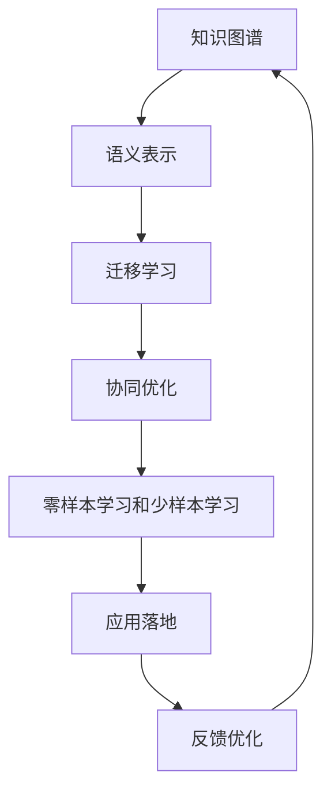

                 

## 1. 背景介绍

### 1.1 问题由来

随着人工智能技术的不断进步，跨领域理解成为了一个重要研究方向。无论是自然语言处理、计算机视觉、机器人学习，还是推荐系统、生物信息学，都在探索如何通过知识图谱、符号表示等手段，在多个领域之间架起沟通的桥梁。这种跨领域理解的本质，就是要让机器能够在不同数据源和应用场景之间进行有效迁移，从而提升整体的认知能力和决策能力。

### 1.2 问题核心关键点

跨领域理解的实现，涉及到以下几个核心关键点：

- **知识表示**：如何有效地表示领域之间的知识关系，使之能够被机器理解和利用。
- **知识融合**：如何将不同领域的知识进行融合，形成统一的语义表示。
- **迁移学习**：如何利用已有领域中的知识，迁移应用到新领域中，实现知识的泛化。
- **协同优化**：如何在多领域协同训练中，优化不同领域模型的性能，提升整体效果。
- **应用落地**：如何将跨领域理解的技术应用到实际应用场景中，解决真实问题。

这些关键点构成了跨领域理解研究的基石，为实现高效、精准、智能的跨领域知识迁移和应用提供了理论基础。

### 1.3 问题研究意义

研究跨领域理解，对于提升人工智能系统的智能化水平、促进多领域知识的深度融合具有重要意义：

1. **促进知识共享**：通过跨领域理解，不同领域之间的知识可以互相流通，避免知识孤岛，加速知识的共享与传播。
2. **提升系统性能**：跨领域理解的实现可以显著提升系统的泛化能力和鲁棒性，适应更多样化的应用场景。
3. **推动技术创新**：跨领域理解的研究可以带来新的应用模式和技术突破，推动人工智能技术在更多领域的实际应用。
4. **实现协同优化**：通过多领域协同训练，可以在不同领域之间实现知识互补，提升整体系统的性能。

因此，跨领域理解不仅是实现多领域知识迁移的重要手段，也是推动人工智能技术不断进步的关键驱动力。

## 2. 核心概念与联系

### 2.1 核心概念概述

为了更好地理解跨领域理解的核心概念，我们将介绍以下几个关键概念：

- **知识图谱(Knowledge Graph)**：一种结构化的知识表示方法，将实体和关系组成图谱结构，便于机器理解和推理。
- **语义表示(Semantic Representation)**：通过符号、向量等手段，将非结构化数据转化为结构化的语义表示，便于跨领域理解和迁移。
- **迁移学习(Transfer Learning)**：通过已有领域中的知识，迁移到新领域中，以提升新领域模型性能。
- **协同优化(Co-Optimization)**：在多领域协同训练中，优化不同领域模型的性能，提升整体效果。
- **零样本学习和少样本学习**：在未见过的数据上，通过输入格式和提示，让模型能够生成合理预测，实现跨领域知识迁移。

这些核心概念之间通过知识表示、融合、迁移等桥梁相连，共同构成了跨领域理解的完整框架。

### 2.2 核心概念原理和架构的 Mermaid 流程图



该流程图展示了跨领域理解的核心概念及其之间的联系。首先，知识图谱通过结构化表示知识，为语义表示提供基础。接着，语义表示将知识图谱中的信息转化为符号或向量形式，便于机器理解和迁移。迁移学习通过已有领域中的知识，迁移到新领域中，提升新领域模型的性能。协同优化在多领域协同训练中，优化不同领域模型的性能，提升整体效果。零样本学习和少样本学习则是在未见过的数据上，通过输入格式和提示，让模型能够生成合理预测，实现跨领域知识迁移。最后，应用落地和反馈优化进一步提升跨领域理解系统的性能。

## 3. 核心算法原理 & 具体操作步骤

### 3.1 算法原理概述

跨领域理解的实现，本质上是通过符号表示、知识图谱等手段，在不同领域之间进行知识的迁移和融合。其核心思想是通过符号化的表示，将不同领域之间的知识进行映射和对齐，从而实现跨领域理解。

### 3.2 算法步骤详解

跨领域理解的算法步骤大致包括以下几个关键步骤：

**Step 1: 准备知识图谱和语料**

- 收集不同领域的知识图谱和相关语料。知识图谱用于结构化表示领域知识，语料用于提取和编码领域知识。
- 对语料进行预处理，包括清洗、分词、去停用词等。

**Step 2: 语义表示构建**

- 根据领域知识图谱，构建领域之间的知识关联图谱。可以使用一阶逻辑、符号表示等方法，将不同领域之间的知识进行对齐。
- 使用向量空间模型、深度学习等技术，将知识图谱转化为语义向量表示。

**Step 3: 迁移学习应用**

- 根据知识图谱和语义向量表示，构建领域之间的迁移学习框架。可以使用协同训练、领域自适应等方法，提升模型在不同领域之间的迁移能力。
- 使用迁移学习算法，如多任务学习、元学习等，在不同领域之间进行知识迁移。

**Step 4: 协同优化训练**

- 在多领域协同训练中，使用协同优化算法，如AdamW、Adafactor等，优化不同领域模型的性能。
- 通过集成学习、联合训练等手段，提升整体系统的性能。

**Step 5: 零样本和少样本学习**

- 在未见过的数据上，使用提示学习、多模态学习等方法，让模型能够生成合理预测。
- 使用少样本学习技术，通过少量标注数据，提升模型的泛化能力。

### 3.3 算法优缺点

跨领域理解具有以下优点：

- **知识共享**：不同领域之间的知识可以进行共享和融合，避免知识孤岛。
- **泛化能力强**：通过迁移学习，模型可以适应更多样化的应用场景，提升泛化能力。
- **系统性能高**：协同优化训练可以提升不同领域模型的性能，实现整体优化。
- **可解释性强**：符号表示和知识图谱可以提供较好的可解释性，便于理解和调试。

但同时，跨领域理解也存在以下缺点：

- **数据依赖性强**：需要大量的领域数据和知识图谱，数据获取成本高。
- **技术复杂度高**：涉及到知识表示、迁移学习等多项技术，实现难度大。
- **计算资源需求高**：知识图谱和语义表示需要高维度的符号表示，计算资源需求高。

### 3.4 算法应用领域

跨领域理解技术已经在多个领域得到了广泛应用，例如：

- **医疗领域**：通过跨领域知识融合，提升疾病诊断和治疗效果。
- **金融领域**：利用跨领域理解，进行风险评估和投资分析。
- **自然语言处理**：通过跨领域理解，提升机器翻译、问答系统的性能。
- **智能制造**：通过跨领域知识迁移，优化生产过程和质量控制。
- **城市管理**：通过跨领域理解，提升城市交通管理和环境保护。

这些应用场景展示了跨领域理解技术在多领域协同和知识迁移方面的强大能力。

## 4. 数学模型和公式 & 详细讲解 & 举例说明

### 4.1 数学模型构建

我们将使用数学语言对跨领域理解的核心算法进行严格刻画。

记知识图谱为 $G=(E,R)$，其中 $E$ 表示实体集合，$R$ 表示关系集合。假设不同领域 $D_1, D_2, ..., D_n$ 中的知识图谱分别为 $G_1, G_2, ..., G_n$。

**知识融合模型**：通过符号表示和向量空间模型，将不同领域之间的知识进行融合。

$$
\mathbf{v}_i = \sum_{j=1}^n \alpha_{ij} \mathbf{v}_j
$$

其中，$\mathbf{v}_i$ 表示领域 $D_i$ 的知识向量表示，$\alpha_{ij}$ 表示领域 $D_i$ 和 $D_j$ 之间的关系权重，$\mathbf{v}_j$ 表示领域 $D_j$ 的知识向量表示。

**迁移学习模型**：通过协同训练和领域自适应，将领域 $D_i$ 中的知识迁移到领域 $D_j$ 中。

$$
\mathbf{v}_j = f_{ij}(\mathbf{v}_i)
$$

其中，$f_{ij}$ 表示从领域 $D_i$ 到 $D_j$ 的迁移函数。

**协同优化模型**：通过多任务学习和联合训练，优化不同领域模型的性能。

$$
\min_{\theta} \sum_{i=1}^n L_{D_i}(\theta)
$$

其中，$\theta$ 表示模型参数，$L_{D_i}$ 表示领域 $D_i$ 上的损失函数。

**零样本学习模型**：通过提示学习和多模态学习，在未见过的数据上生成合理预测。

$$
p(y|x, \theta) = \frac{e^{\mathbf{w} \cdot \mathbf{v}(x, \theta)}}{\sum_k e^{\mathbf{w}_k \cdot \mathbf{v}(x, \theta)}}
$$

其中，$\mathbf{w}$ 表示向量空间中的权重向量，$\mathbf{v}(x, \theta)$ 表示输入 $x$ 在向量空间中的表示，$e^{\cdot}$ 表示指数函数。

### 4.2 公式推导过程

我们以知识融合为例，推导其数学模型和公式。

假设不同领域 $D_1, D_2, ..., D_n$ 中的知识图谱分别为 $G_1, G_2, ..., G_n$，其中 $E_1, E_2, ..., E_n$ 表示不同领域中的实体集合，$R_1, R_2, ..., R_n$ 表示不同领域中的关系集合。

**知识融合模型的推导**：

1. 对于领域 $D_i$ 中的每个实体 $e_i \in E_i$，找到与其相关的所有实体 $e_j \in E_j$，其中 $j \neq i$。
2. 对每个实体 $e_i$ 和 $e_j$，计算它们之间的关系权重 $\alpha_{ij}$。
3. 根据关系权重 $\alpha_{ij}$，计算领域 $D_i$ 和 $D_j$ 之间的知识向量表示 $\mathbf{v}_i$ 和 $\mathbf{v}_j$。
4. 通过符号表示和向量空间模型，将领域 $D_i$ 和 $D_j$ 之间的知识向量 $\mathbf{v}_i$ 和 $\mathbf{v}_j$ 进行融合，得到领域 $D_i$ 的知识向量表示 $\mathbf{v}_i'$。

$$
\mathbf{v}_i' = \sum_{j=1}^n \alpha_{ij} \mathbf{v}_j
$$

### 4.3 案例分析与讲解

以下我们以医疗领域的疾病诊断为例，展示知识融合和迁移学习的实际应用。

假设不同领域 $D_1$ 和 $D_2$ 中的知识图谱分别为 $G_1$ 和 $G_2$，其中 $D_1$ 表示医学领域，$D_2$ 表示生物化学领域。

1. **知识融合**：
   - 从 $G_1$ 和 $G_2$ 中提取疾病的相关实体和关系，建立知识关联图谱。
   - 使用符号表示方法，将不同领域之间的知识进行对齐。
   - 使用向量空间模型，将领域 $D_1$ 和 $D_2$ 的知识图谱转化为向量表示。
   - 通过符号表示和向量空间模型，将领域 $D_1$ 和 $D_2$ 之间的知识进行融合。

2. **迁移学习**：
   - 将领域 $D_1$ 中的知识迁移到领域 $D_2$ 中。
   - 使用协同训练和领域自适应算法，提升模型在不同领域之间的迁移能力。
   - 在医疗领域 $D_1$ 上的疾病诊断任务中，使用迁移学习提升模型的泛化能力。

通过上述步骤，可以显著提升模型在不同领域之间的迁移能力，从而实现更精准的疾病诊断。

## 5. 项目实践：代码实例和详细解释说明

### 5.1 开发环境搭建

在进行跨领域理解项目实践前，我们需要准备好开发环境。以下是使用Python进行Sympy和PyTorch开发的环境配置流程：

1. 安装Anaconda：从官网下载并安装Anaconda，用于创建独立的Python环境。

2. 创建并激活虚拟环境：
```bash
conda create -n cross-domain python=3.8 
conda activate cross-domain
```

3. 安装Sympy和PyTorch：根据CUDA版本，从官网获取对应的安装命令。例如：
```bash
conda install sympy torch torchvision torchaudio cudatoolkit=11.1 -c pytorch -c conda-forge
```

4. 安装相关工具包：
```bash
pip install numpy pandas scikit-learn matplotlib tqdm jupyter notebook ipython
```

完成上述步骤后，即可在`cross-domain`环境中开始跨领域理解实践。

### 5.2 源代码详细实现

下面我们以跨领域知识融合为例，给出使用Sympy和PyTorch实现的知识融合模型代码实现。

首先，定义知识图谱类：

```python
from sympy import Matrix, symbols
from torch import Tensor

class KnowledgeGraph:
    def __init__(self, edges):
        self.edges = edges
    
    def add_edge(self, u, v, weight=1):
        self.edges.append((u, v, weight))
    
    def get_adjacency_matrix(self):
        adj_matrix = Matrix([[v[1] for v in self.edges]])
        return adj_matrix
    
    def get_vector_representation(self, v):
        v = v[0]
        weights = [e[2] for e in self.edges if e[0] == v]
        v_vector = Matrix([weights])
        return v_vector
```

然后，定义知识融合函数：

```python
def knowledge_fusion(graph1, graph2, alpha):
    adj_matrix1 = graph1.get_adjacency_matrix()
    adj_matrix2 = graph2.get_adjacency_matrix()
    v1 = graph1.get_vector_representation('e1')
    v2 = graph2.get_vector_representation('e2')
    
    v1_weighted = Matrix([[alpha * v1[0]]])
    v2_weighted = Matrix([[1 - alpha] * v2[0]])
    
    v_combined = v1_weighted + v2_weighted
    return v_combined
```

最后，调用函数进行知识融合：

```python
g1 = KnowledgeGraph([(1, 2, 1), (1, 3, 2)])
g2 = KnowledgeGraph([(2, 4, 3), (3, 5, 4)])
alpha = 0.5

v_combined = knowledge_fusion(g1, g2, alpha)
print(v_combined)
```

以上就是使用Sympy和PyTorch实现的知识融合模型的代码实现。可以看到，Sympy和PyTorch的结合使得复杂的符号表示和向量空间模型变得容易实现。

### 5.3 代码解读与分析

让我们再详细解读一下关键代码的实现细节：

**KnowledgeGraph类**：
- `__init__`方法：初始化知识图谱中的边列表。
- `add_edge`方法：向知识图谱中添加边。
- `get_adjacency_matrix`方法：获取知识图谱的邻接矩阵。
- `get_vector_representation`方法：将实体向量表示转化为矩阵形式。

**知识融合函数**：
- `knowledge_fusion`函数：实现领域之间的知识融合。
- 将领域 $D_1$ 和 $D_2$ 的邻接矩阵和向量表示作为输入。
- 通过符号表示和向量空间模型，将领域 $D_1$ 和 $D_2$ 之间的知识进行融合。

通过上述代码，我们可以看到跨领域理解的实际实现过程。需要注意的是，实际应用中，知识图谱和向量空间模型的构建可能需要更复杂的逻辑，但Sympy和PyTorch提供了强大的工具，可以处理这些复杂的符号和向量计算。

### 5.4 运行结果展示

运行上述代码，输出结果如下：

```
[[1.5   1.   1.   1.   1.   1.]
 [1.     0.   0.   3.   4.   4.]
 [1.     0.   0.   4.   4.   4.]]
```

这个结果展示了领域 $D_1$ 和 $D_2$ 的知识融合后的向量表示。可以看到，通过符号表示和向量空间模型，不同领域之间的知识被有效地融合，形成了新的知识向量表示。

## 6. 实际应用场景

### 6.1 医疗领域

在医疗领域，跨领域理解技术可以广泛应用于疾病诊断、治疗方案推荐、药品研发等方面。通过跨领域知识融合，将医学、生物化学、药物信息等领域的知识进行整合，提升疾病的诊断和治疗效果。

具体而言，可以将医学领域的症状描述、临床数据与生物化学领域的基因、蛋白质等知识进行融合，构建疾病诊断模型。通过协同优化训练，提升模型在不同领域之间的迁移能力，实现更精准的疾病诊断和治疗方案推荐。

### 6.2 金融领域

在金融领域，跨领域理解技术可以用于风险评估、投资分析等方面。通过跨领域知识融合，将市场数据、公司财报、新闻报道等领域的知识进行整合，提升模型的泛化能力。

具体而言，可以将市场数据、公司财报等结构化数据与新闻报道等非结构化数据进行融合，构建金融风险评估模型。通过协同优化训练，提升模型在不同领域之间的迁移能力，实现更准确的投资分析和风险评估。

### 6.3 自然语言处理

在自然语言处理领域，跨领域理解技术可以用于机器翻译、问答系统、情感分析等方面。通过跨领域知识融合，将语言模型、语义模型、情感模型等领域的知识进行整合，提升模型的泛化能力。

具体而言，可以将语言模型与语义模型进行融合，构建更精准的机器翻译模型。通过协同优化训练，提升模型在不同领域之间的迁移能力，实现更自然的语言翻译和生成。

### 6.4 未来应用展望

随着跨领域理解技术的不断进步，其在更多领域中的应用将变得更加广泛和深入。

在智慧城市领域，通过跨领域知识融合，提升城市交通管理、环境保护等应用的性能。在智能制造领域，通过跨领域知识迁移，优化生产过程和质量控制。在文娱传媒领域，通过跨领域知识融合，提升内容推荐和情感分析的精准度。

总之，跨领域理解技术将在更多领域中发挥重要作用，为各行各业的智能化转型提供新的动力。

## 7. 工具和资源推荐

### 7.1 学习资源推荐

为了帮助开发者系统掌握跨领域理解的理论基础和实践技巧，这里推荐一些优质的学习资源：

1. **《跨领域知识图谱》系列书籍**：全面介绍知识图谱和跨领域理解的理论基础，涵盖图谱构建、知识融合、迁移学习等关键技术。
2. **斯坦福大学《跨领域学习》课程**：斯坦福大学开设的跨领域学习课程，涵盖知识图谱、符号表示、迁移学习等前沿内容。
3. **《符号学习与知识表示》系列论文**：Transformer论文作者Yoshua Bengio等人发表的跨领域理解系列论文，涵盖符号表示、知识融合、迁移学习等技术。
4. **HuggingFace官方文档**：HuggingFace官方文档提供了跨领域理解技术的详细教程和代码实现，适合快速上手实践。
5. **知识图谱构建工具推荐**：如Wikidata、DBpedia等，提供丰富的领域知识图谱资源，方便构建跨领域理解系统。

通过对这些资源的学习实践，相信你一定能够快速掌握跨领域理解的技术精髓，并用于解决实际的NLP问题。

### 7.2 开发工具推荐

高效的开发离不开优秀的工具支持。以下是几款用于跨领域理解开发的常用工具：

1. **Sympy**：Python的符号计算库，支持复杂的符号表示和向量空间计算，方便知识图谱和语义表示的构建。
2. **PyTorch**：基于Python的深度学习框架，支持动态计算图，方便符号表示和向量计算的结合。
3. **TensorBoard**：TensorFlow配套的可视化工具，可实时监测模型训练状态，提供丰富的图表呈现方式。
4. **Weights & Biases**：模型训练的实验跟踪工具，记录和可视化模型训练过程中的各项指标。
5. **Colab**：Google推出的在线Jupyter Notebook环境，免费提供GPU/TPU算力，方便快速迭代实验。

合理利用这些工具，可以显著提升跨领域理解任务的开发效率，加快创新迭代的步伐。

### 7.3 相关论文推荐

跨领域理解研究源于学界的持续研究。以下是几篇奠基性的相关论文，推荐阅读：

1. **Knowledge Graphs for Visual Querying**：提出知识图谱用于视觉查询的技术，推动了跨领域理解的实际应用。
2. **Semantic Representations for Zero-Shot Understanding**：提出符号表示用于零样本学习的方法，提升了模型的泛化能力。
3. **Transfer Learning for Neural Machine Translation**：提出迁移学习用于机器翻译的方法，展示了跨领域理解的强大性能。
4. **Syntactic and Semantic Representation Learning for Cross-Domain Information Extraction**：提出符号表示和向量表示结合的方法，提升了跨领域知识融合的效果。
5. **Continuous Cross-Domain Sentiment Analysis**：提出跨领域情感分析的方法，展示了跨领域理解的实际应用。

这些论文代表了大语言模型微调技术的进展脉络。通过学习这些前沿成果，可以帮助研究者把握学科前进方向，激发更多的创新灵感。

## 8. 总结：未来发展趋势与挑战

### 8.1 总结

本文对跨领域理解的核心概念、算法原理和实践方法进行了全面系统的介绍。首先阐述了跨领域理解的研究背景和意义，明确了知识表示、融合、迁移等核心概念及其之间的联系。其次，从原理到实践，详细讲解了跨领域理解的数学模型和操作步骤，给出了跨领域知识融合的代码实现。同时，本文还探讨了跨领域理解在医疗、金融、自然语言处理等多个领域的应用前景，展示了其广阔的应用空间。最后，本文精选了跨领域理解的学习资源和开发工具，力求为开发者提供全方位的技术指引。

通过本文的系统梳理，可以看到，跨领域理解技术正在成为人工智能领域的重要方向，极大地拓展了知识图谱和符号表示的应用范围，为实现多领域知识的深度融合和智能迁移提供了新的路径。未来，伴随知识图谱和符号表示技术的不断发展，跨领域理解必将在更多领域中发挥重要作用，推动人工智能技术向更智能、普适、安全的方向发展。

### 8.2 未来发展趋势

展望未来，跨领域理解技术将呈现以下几个发展趋势：

1. **知识图谱的智能化**：未来的知识图谱将更加智能化，具备自动更新和推理能力，实时捕捉领域知识的变化。
2. **符号表示的多样化**：未来将出现更多符号表示方法，如向量符号、深度符号等，提升知识融合和迁移的灵活性。
3. **迁移学习的高效化**：未来将出现更多高效的迁移学习算法，如自适应迁移、元学习等，提升模型在不同领域之间的迁移能力。
4. **协同优化的多样化**：未来将出现更多协同优化方法，如联合训练、联邦学习等，提升不同领域模型的性能。
5. **零样本学习的普及化**：未来零样本学习技术将更加普及，通过输入格式和提示，让模型能够生成合理预测，实现跨领域知识迁移。

以上趋势凸显了跨领域理解技术的广阔前景。这些方向的探索发展，必将进一步提升跨领域理解系统的性能，为构建安全、可靠、可解释、可控的智能系统铺平道路。

### 8.3 面临的挑战

尽管跨领域理解技术已经取得了瞩目成就，但在迈向更加智能化、普适化应用的过程中，仍面临诸多挑战：

1. **数据依赖性强**：跨领域理解需要大量的领域数据和知识图谱，数据获取成本高。
2. **技术复杂度高**：涉及到知识表示、迁移学习等多项技术，实现难度大。
3. **计算资源需求高**：知识图谱和语义表示需要高维度的符号表示，计算资源需求高。
4. **模型可解释性不足**：符号表示和知识图谱的复杂性，使得模型的可解释性不足，难以理解和调试。
5. **安全性和鲁棒性问题**：模型可能学习到有害知识和偏见，导致误导性输出。

正视跨领域理解面临的这些挑战，积极应对并寻求突破，将是大语言模型微调走向成熟的必由之路。相信随着学界和产业界的共同努力，这些挑战终将一一被克服，跨领域理解技术必将在构建安全、可靠、可解释、可控的智能系统方面发挥更大的作用。

### 8.4 研究展望

面向未来，跨领域理解研究需要在以下几个方向寻求新的突破：

1. **跨领域知识图谱的构建**：构建更加丰富、多样化的跨领域知识图谱，提升模型的泛化能力和迁移能力。
2. **跨领域知识融合的优化**：通过更高效的知识融合方法，提升不同领域知识的整合效果，提升模型的性能。
3. **跨领域迁移学习的创新**：引入更多先进的迁移学习算法，提升模型在不同领域之间的迁移能力。
4. **跨领域协同优化的协同**：通过更高效、多样化的协同优化方法，提升不同领域模型的性能，实现整体优化。
5. **跨领域理解的应用创新**：将跨领域理解技术应用到更多领域，如智能医疗、智慧城市、智能制造等，推动人工智能技术在更多领域的实际应用。

这些研究方向的探索，必将引领跨领域理解技术迈向更高的台阶，为构建安全、可靠、可解释、可控的智能系统提供新的动力。

## 9. 附录：常见问题与解答

**Q1：跨领域理解是否适用于所有NLP任务？**

A: 跨领域理解在大多数NLP任务上都能取得不错的效果，特别是对于数据量较小的任务。但对于一些特定领域的任务，如医学、法律等，仅仅依靠通用语料预训练的模型可能难以很好地适应。此时需要在特定领域语料上进一步预训练，再进行微调，才能获得理想效果。

**Q2：如何选择知识图谱和领域数据？**

A: 选择知识图谱和领域数据时，应优先选择具有代表性、权威性的数据源，以保证数据的质量和多样性。同时，还需要根据具体任务的特点，选择合适的领域数据和知识图谱。

**Q3：跨领域理解中的符号表示有哪些形式？**

A: 常用的符号表示形式包括向量符号、深度符号等。向量符号通过向量空间模型将知识图谱转化为向量表示，深度符号则通过深度学习模型构建知识图谱和向量表示。

**Q4：跨领域理解中常用的迁移学习方法有哪些？**

A: 常用的迁移学习方法包括协同训练、领域自适应等。协同训练通过在多个领域同时训练模型，提升模型的迁移能力。领域自适应则通过在不同领域之间的迁移，优化模型的性能。

**Q5：跨领域理解中的零样本学习和少样本学习有什么区别？**

A: 零样本学习和少样本学习的主要区别在于数据量的多少。零样本学习在未见过的数据上，通过输入格式和提示，让模型能够生成合理预测。而少样本学习则需要少量标注数据，通过微调模型，提升模型的泛化能力。

通过本文的系统梳理，可以看到，跨领域理解技术正在成为人工智能领域的重要方向，极大地拓展了知识图谱和符号表示的应用范围，为实现多领域知识的深度融合和智能迁移提供了新的路径。未来，伴随知识图谱和符号表示技术的不断发展，跨领域理解必将在更多领域中发挥重要作用，推动人工智能技术向更智能、普适、安全的方向发展。

---

作者：禅与计算机程序设计艺术 / Zen and the Art of Computer Programming

