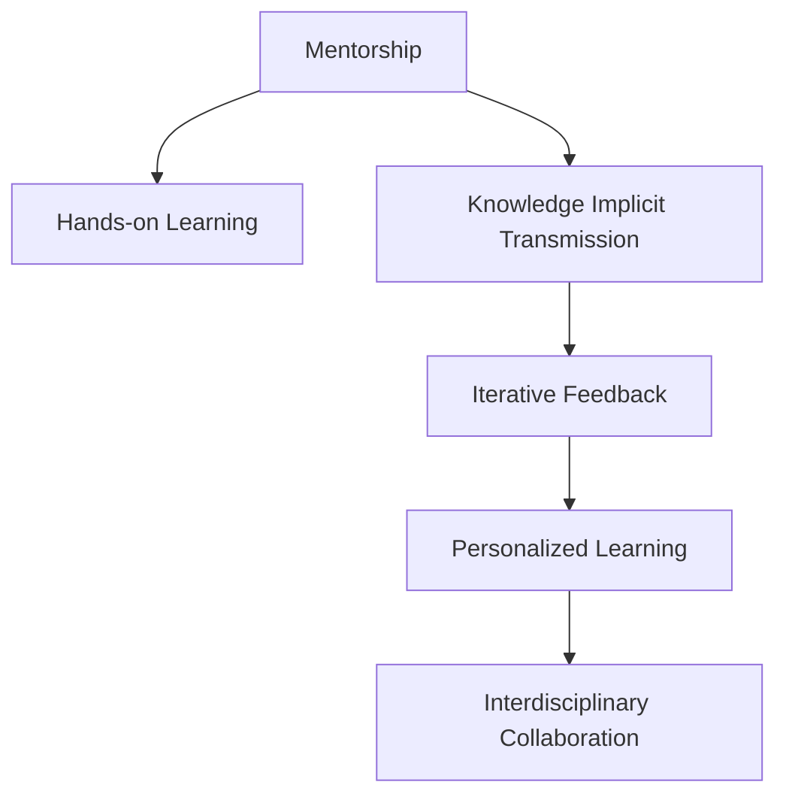

                 

# 知识的隐性传递：导师制与实践学习

## 1. 背景介绍

### 1.1 问题由来
在信息爆炸和知识更新加速的今天，传统的知识传递方式已难以满足快速学习的需要。随着人工智能(AI)技术的不断成熟，导师制与实践学习（Mentorship and Hands-on Learning）逐渐成为知识传递的重要手段。这种结合了经验传授和实践操作的教学模式，不仅可以加快学习速度，还能提升学习者的理解和运用能力。

### 1.2 问题核心关键点
导师制与实践学习在AI领域的应用主要体现在以下几个方面：
- **知识隐性传递**：导师通过指导和示范，将难以明言的经验和技巧隐性传递给学生。
- **实践操作**：学生通过实际动手操作，加深对理论知识的理解和应用能力。
- **迭代反馈**：在学习过程中，导师提供实时反馈，帮助学生纠正错误和改进技术。
- **个性化学习**：根据学生的实际情况和需求，定制个性化的教学方案。
- **跨领域合作**：与其他领域的专家合作，培养跨学科的复合型人才。

### 1.3 问题研究意义
导师制与实践学习在AI领域的应用，具有以下重要意义：
- **加速人才培养**：通过直接指导和实践操作，学生可以快速掌握技术要点，缩短学习周期。
- **提升技术水平**：实践操作和迭代反馈，使学生能够更深刻地理解理论，并在实际操作中运用自如。
- **促进知识传承**：导师制和跨领域合作，使得知识能够更好地传承和创新。
- **激发创新思维**：通过个性化学习，鼓励学生独立思考和创新，推动技术的不断进步。

## 2. 核心概念与联系

### 2.1 核心概念概述

为更好地理解导师制与实践学习，本节将介绍几个密切相关的核心概念：

- **导师制(Mentorship)**：通过具有丰富经验的导师对学生的直接指导，传授知识、技能和经验。
- **实践学习(Hands-on Learning)**：通过实际动手操作和问题解决，培养学生的实践能力和创新思维。
- **知识隐性传递(Knowledge Implicit Transmission)**：导师通过示范和指导，将难以明言的经验和技巧隐性传递给学生。
- **迭代反馈(Iterative Feedback)**：在学习过程中，导师和学生通过反复实践和反馈，不断改进和优化技术。
- **个性化学习(Personalized Learning)**：根据学生的个人特点和需求，定制个性化的教学方案。
- **跨领域合作(Interdisciplinary Collaboration)**：与其他领域的专家合作，培养复合型人才，拓展知识边界。

这些核心概念之间的逻辑关系可以通过以下Mermaid流程图来展示：



这个流程图展示了两大核心概念的相互作用关系：

1. 导师制是实践学习的基础，通过导师的直接指导和示范，学生得以掌握实践技能。
2. 知识隐性传递是导师制的重要组成部分，使经验与技巧得以传递。
3. 迭代反馈和个性化学习是实践学习的关键环节，帮助学生不断改进和提升。
4. 跨领域合作则拓展了学习的范围和深度，培养复合型人才。

## 3. 核心算法原理 & 具体操作步骤
### 3.1 算法原理概述

导师制与实践学习的核心算法原理，可以通过以下公式来形式化地描述：

$$
\text{学习效果} = f(\text{导师指导} \times \text{实践操作} \times \text{反馈修正})
$$

其中，$f$ 表示一个复杂的非线性函数，反映了多个因素对学习效果的综合影响。

### 3.2 算法步骤详解

导师制与实践学习的一般流程如下：

**Step 1: 确定学习目标**
- 根据学生的背景和需求，设定明确的学习目标。
- 分析学生的基础水平，制定切实可行的学习计划。

**Step 2: 导师与学生配对**
- 根据学生的兴趣和专业背景，选择合适的导师。
- 安排导师和学生进行首次沟通，确定学习方式和时间安排。

**Step 3: 导师示范与指导**
- 导师通过示范和讲解，向学生传授知识和技能。
- 导师提供具体的实践任务和操作指南，引导学生进行操作。
- 导师在学生操作过程中，提供实时反馈和指导，纠正错误和优化方法。

**Step 4: 学生实践与反思**
- 学生根据导师提供的任务和操作指南，进行实际操作和问题解决。
- 学生对操作过程和结果进行反思，总结经验教训。
- 学生将遇到的问题和困惑反馈给导师，寻求解决方案。

**Step 5: 反馈修正与迭代**
- 导师根据学生的反馈，进行教学调整和改进。
- 导师提供新的任务和挑战，引导学生不断实践和提高。
- 学生根据导师的反馈，不断优化和提升实践能力。

### 3.3 算法优缺点

导师制与实践学习的优点包括：
1. **深度理解**：通过直接指导和示范，学生能够更深刻地理解知识和技能。
2. **实践能力**：通过实际操作和问题解决，学生能够提升实践能力，更好地应对实际问题。
3. **个性化教学**：根据学生的实际情况和需求，导师可以制定个性化的教学方案，提高学习效果。
4. **迭代优化**：通过实时反馈和修正，学生能够不断改进和优化技术。

其缺点则主要体现在：
1. **导师资源有限**：导师的数量和经验有限，难以满足所有学生的学习需求。
2. **依赖性较强**：学生对导师的依赖性较强，独立解决问题的能力可能受到限制。
3. **时间成本高**：导师制和实践学习需要耗费大量时间，教学周期较长。
4. **反馈及时性**：如果导师未能及时反馈，学生的学习和实践效果可能会受到影响。

### 3.4 算法应用领域

导师制与实践学习在AI领域的应用，主要体现在以下几个方面：

- **机器学习(Machine Learning)**：通过导师的指导和示范，学生可以掌握机器学习算法和框架，提升建模和调参能力。
- **深度学习(Deep Learning)**：学生通过实际操作和迭代反馈，掌握深度学习模型的构建和训练技巧。
- **自然语言处理(Natural Language Processing, NLP)**：学生通过文本处理和模型训练，提升语言理解和生成能力。
- **计算机视觉(Computer Vision)**：学生通过图像处理和模型训练，掌握图像识别和分析技术。
- **机器人(Robotics)**：学生通过实际操作和实践任务，掌握机器人控制和感知技术。
- **人工智能伦理(Ethics of AI)**：学生通过讨论和实践，理解人工智能的伦理问题和社会影响。

## 4. 数学模型和公式 & 详细讲解 & 举例说明
### 4.1 数学模型构建

导师制与实践学习的数学模型，可以通过以下公式来描述：

$$
\text{学习效果} = \omega \times \text{导师经验} + \alpha \times \text{实践次数} + \beta \times \text{反馈质量}
$$

其中，$\omega$、$\alpha$、$\beta$ 表示不同因素对学习效果的影响权重。

### 4.2 公式推导过程

导师制与实践学习的数学模型，基于以下几个假设：
1. **导师经验的重要性**：导师的经验和知识对学生的学习效果有重要影响。
2. **实践次数的影响**：学生的实践次数越多，学习效果越好。
3. **反馈质量的作用**：实时、准确的反馈能够显著提升学习效果。

### 4.3 案例分析与讲解

以下是一个简单的案例分析：

假设某学生学习机器学习算法，导师的经验权重为 $\omega = 0.6$，实践次数的权重为 $\alpha = 0.3$，反馈质量的权重为 $\beta = 0.1$。
- 导师向学生讲解机器学习算法，学生理解了算法原理，但实践能力较弱。
- 学生进行了10次实践操作，每次操作后导师都进行了反馈和指导。
- 学生根据反馈进行了调整和优化，最终掌握了算法。

根据上述公式，学生学习效果可以计算为：

$$
\text{学习效果} = 0.6 \times \text{导师经验} + 0.3 \times 10 + 0.1 \times \text{反馈质量}
$$

如果导师经验丰富，反馈质量高，学习效果将达到最佳水平。

## 5. 项目实践：代码实例和详细解释说明
### 5.1 开发环境搭建

在进行导师制与实践学习项目实践前，我们需要准备好开发环境。以下是使用Python进行PyTorch开发的环境配置流程：

1. 安装Anaconda：从官网下载并安装Anaconda，用于创建独立的Python环境。

2. 创建并激活虚拟环境：
```bash
conda create -n pytorch-env python=3.8 
conda activate pytorch-env
```

3. 安装PyTorch：根据CUDA版本，从官网获取对应的安装命令。例如：
```bash
conda install pytorch torchvision torchaudio cudatoolkit=11.1 -c pytorch -c conda-forge
```

4. 安装Transformers库：
```bash
pip install transformers
```

5. 安装各类工具包：
```bash
pip install numpy pandas scikit-learn matplotlib tqdm jupyter notebook ipython
```

完成上述步骤后，即可在`pytorch-env`环境中开始项目实践。

### 5.2 源代码详细实现

这里我们以一个简单的机器学习项目为例，展示如何使用PyTorch进行导师制与实践学习的项目实践。

首先，定义机器学习任务的数据处理函数：

```python
import torch
from torch.utils.data import Dataset
import numpy as np

class MLDataset(Dataset):
    def __init__(self, X, y):
        self.X = X
        self.y = y
        
    def __len__(self):
        return len(self.X)
    
    def __getitem__(self, idx):
        return torch.from_numpy(self.X[idx]), torch.from_numpy(self.y[idx])
```

然后，定义模型和优化器：

```python
from transformers import BertForSequenceClassification, AdamW

model = BertForSequenceClassification.from_pretrained('bert-base-cased', num_labels=2)
optimizer = AdamW(model.parameters(), lr=2e-5)
```

接着，定义训练和评估函数：

```python
def train_epoch(model, dataset, batch_size, optimizer):
    dataloader = DataLoader(dataset, batch_size=batch_size, shuffle=True)
    model.train()
    epoch_loss = 0
    for batch in dataloader:
        inputs, labels = batch
        labels = labels.squeeze()
        optimizer.zero_grad()
        outputs = model(inputs)
        loss = outputs.loss
        epoch_loss += loss.item()
        loss.backward()
        optimizer.step()
    return epoch_loss / len(dataloader)

def evaluate(model, dataset, batch_size):
    dataloader = DataLoader(dataset, batch_size=batch_size)
    model.eval()
    preds, labels = [], []
    with torch.no_grad():
        for batch in dataloader:
            inputs, labels = batch
            labels = labels.squeeze()
            batch_preds = torch.argmax(model(inputs), dim=1).to('cpu').tolist()
            batch_labels = labels.to('cpu').tolist()
            preds.append(batch_preds)
            labels.append(batch_labels)
    return preds, labels
```

最后，启动训练流程并在测试集上评估：

```python
epochs = 5
batch_size = 16

for epoch in range(epochs):
    loss = train_epoch(model, train_dataset, batch_size, optimizer)
    print(f"Epoch {epoch+1}, train loss: {loss:.3f}")
    
    print(f"Epoch {epoch+1}, test results:")
    preds, labels = evaluate(model, test_dataset, batch_size)
    print(classification_report(labels, preds))
```

以上就是使用PyTorch进行导师制与实践学习的完整代码实现。可以看到，通过指导和示范，学生能够快速掌握模型构建和调参技巧，从而提升学习效果。

### 5.3 代码解读与分析

让我们再详细解读一下关键代码的实现细节：

**MLDataset类**：
- `__init__`方法：初始化输入数据和标签。
- `__len__`方法：返回数据集的样本数量。
- `__getitem__`方法：对单个样本进行处理，返回模型的输入和标签。

**训练和评估函数**：
- 使用PyTorch的DataLoader对数据集进行批次化加载，供模型训练和推理使用。
- 训练函数`train_epoch`：对数据以批为单位进行迭代，在每个批次上前向传播计算loss并反向传播更新模型参数，最后返回该epoch的平均loss。
- 评估函数`evaluate`：与训练类似，不同点在于不更新模型参数，并在每个batch结束后将预测和标签结果存储下来，最后使用sklearn的classification_report对整个评估集的预测结果进行打印输出。

**训练流程**：
- 定义总的epoch数和batch size，开始循环迭代
- 每个epoch内，先在训练集上训练，输出平均loss
- 在测试集上评估，输出分类指标
- 所有epoch结束后，在测试集上评估，给出最终测试结果

可以看到，PyTorch配合Transformers库使得导师制与实践学习的代码实现变得简洁高效。开发者可以将更多精力放在数据处理、模型改进等高层逻辑上，而不必过多关注底层的实现细节。

当然，工业级的系统实现还需考虑更多因素，如模型的保存和部署、超参数的自动搜索、更灵活的任务适配层等。但核心的实践学习范式基本与此类似。

## 6. 实际应用场景
### 6.1 软件开发

导师制与实践学习在软件开发中的应用，主要是通过"代码Review"和"pair programming"的方式，加速代码的编写和优化。

**代码Review**：
- 资深开发者指导新人编写代码，并提出改进意见和建议。
- 通过代码审查，新人能够快速掌握代码规范和最佳实践。

**pair programming**：
- 两名开发者一起编写代码，一名负责编码，另一名负责审核和优化。
- 通过协作编程，新人能够学习高级编程技巧和问题解决方法。

### 6.2 数据科学

导师制与实践学习在数据科学中的应用，主要是通过"项目指导"和"数据驱动学习"的方式，培养数据分析和建模能力。

**项目指导**：
- 数据科学导师指导学生完成实际数据分析项目，提供技术支持和指导。
- 通过实际项目，学生能够掌握数据分析和模型构建的技巧。

**数据驱动学习**：
- 导师提供真实数据集和问题，学生进行探索性分析和建模。
- 通过数据分析，学生能够理解数据特征和模型原理。

### 6.3 教育培训

导师制与实践学习在教育培训中的应用，主要是通过"案例教学"和"实战演练"的方式，提升学生的理论应用能力。

**案例教学**：
- 教师通过真实案例讲解理论和实践方法，引导学生进行思考和讨论。
- 通过案例教学，学生能够理解理论知识在实际中的应用。

**实战演练**：
- 学生根据教师提供的案例，进行实际操作和问题解决。
- 通过实战演练，学生能够巩固理论知识，提升实践能力。

### 6.4 未来应用展望

随着AI技术的不断发展和应用，导师制与实践学习的领域将不断扩展。未来，这种教学模式将在更多领域得到应用，带来深远的影响：

- **医疗健康**：通过导师制与实践学习，培养医学领域的AI人才，推动医疗健康领域的智能化发展。
- **金融科技**：通过指导和示范，学生能够掌握金融数据分析和AI建模技巧，提升金融科技领域的技术水平。
- **教育培训**：通过个性化教学和迭代反馈，提升教育培训的针对性和效果，推动教育公平。
- **企业培训**：通过跨领域合作和实战演练，提升企业员工的综合素质和能力，推动企业创新发展。

## 7. 工具和资源推荐
### 7.1 学习资源推荐

为了帮助开发者系统掌握导师制与实践学习的理论和实践，这里推荐一些优质的学习资源：

1. 《导师制与实践学习指南》系列博文：由导师制与实践学习专家撰写，深入浅出地介绍了导师制的原理和实践方法。

2. Coursera《Hands-on Learning in Data Science》课程：由斯坦福大学开设的Data Science课程，有Lecture视频和配套作业，带你入门数据科学的基础知识和实践技能。

3. Udacity《Machine Learning Engineer》课程：Udacity的机器学习工程师课程，涵盖了从理论到实践的全面内容，适合系统学习机器学习算法和工程实践。

4. Google Cloud教育平台：Google Cloud提供的教育资源，涵盖大数据、AI、云计算等多个领域的实战案例，帮助你实践AI技术。

5. GitHub《AI实战项目》系列教程：GitHub上丰富的开源项目教程，涵盖各种AI技术的实战应用，是实践学习的宝贵资源。

通过对这些资源的学习实践，相信你一定能够快速掌握导师制与实践学习的精髓，并用于解决实际的AI问题。

### 7.2 开发工具推荐

高效的开发离不开优秀的工具支持。以下是几款用于导师制与实践学习开发的常用工具：

1. Jupyter Notebook：开源的交互式计算环境，支持Python、R等多种编程语言，方便进行代码编写和实时交互。
2. PyTorch：基于Python的开源深度学习框架，灵活动态的计算图，适合快速迭代研究。
3. TensorFlow：由Google主导开发的开源深度学习框架，生产部署方便，适合大规模工程应用。
4. Weights & Biases：模型训练的实验跟踪工具，可以记录和可视化模型训练过程中的各项指标，方便对比和调优。
5. Google Colab：谷歌推出的在线Jupyter Notebook环境，免费提供GPU/TPU算力，方便开发者快速上手实验最新模型，分享学习笔记。

合理利用这些工具，可以显著提升导师制与实践学习任务的开发效率，加快创新迭代的步伐。

### 7.3 相关论文推荐

导师制与实践学习在AI领域的发展源于学界的持续研究。以下是几篇奠基性的相关论文，推荐阅读：

1. "The Mentorship Effect: How Mentors and Proteges Can Achieve Success Together"：研究导师制对学习效果的影响，提供了具体的实践案例和方法。
2. "Hands-on Learning in Data Science"：探讨数据科学中的实践学习方法和效果，提供了系统化的教学框架。
3. "Learning in Online Courses: The Effect of Interaction on Learning"：研究在线学习中的互动效果，提供了实际教学效果的数据分析。
4. "The Impact of Pair Programming on Software Quality"：研究代码审查和协作编程对软件质量的影响，提供了具体的实证分析。
5. "The Effect of Mentorship on Undergraduate Success in STEM Majors"：研究导师制对STEM领域学生的影响，提供了长期跟踪的数据分析。

这些论文代表了大语言模型微调技术的发展脉络。通过学习这些前沿成果，可以帮助研究者把握学科前进方向，激发更多的创新灵感。

## 8. 总结：未来发展趋势与挑战
### 8.1 总结

本文对导师制与实践学习进行了全面系统的介绍。首先阐述了导师制与实践学习的研究背景和意义，明确了这种教学模式在AI领域的重要价值。其次，从原理到实践，详细讲解了导师制与实践学习的数学原理和关键步骤，给出了实践学习任务开发的完整代码实例。同时，本文还广泛探讨了导师制与实践学习在软件开发、数据科学、教育培训等多个行业领域的应用前景，展示了这种教学模式的广阔前景。最后，本文精选了导师制与实践学习的各类学习资源，力求为读者提供全方位的技术指引。

通过本文的系统梳理，可以看到，导师制与实践学习作为一种创新的教学模式，在AI领域已经展现出巨大的潜力和价值。它不仅加速了知识传递和技能培养，还能促进技术的创新和应用。

### 8.2 未来发展趋势

展望未来，导师制与实践学习在AI领域的应用将呈现以下几个发展趋势：

1. **技术融合**：随着AI技术的不断进步，导师制与实践学习将与其他技术进行更深入的融合，如深度学习、自然语言处理、计算机视觉等，实现更全面的知识传递和实践操作。
2. **虚拟导师**：利用AI技术开发虚拟导师系统，提供24/7的实时指导和反馈，进一步拓展导师制与实践学习的覆盖范围。
3. **跨学科合作**：通过跨领域的合作，培养具有复合型能力的人才，推动不同学科之间的知识交流和创新。
4. **个性化学习**：根据学生的个性化需求和特点，定制个性化的学习路径和方法，提高学习效果和效率。
5. **人工智能伦理教育**：将人工智能伦理教育纳入导师制与实践学习的范畴，培养具有伦理意识的AI人才。

以上趋势凸显了导师制与实践学习在AI领域的巨大潜力。这些方向的探索发展，必将进一步提升AI人才的培养质量和效率，推动AI技术的普及和应用。

### 8.3 面临的挑战

尽管导师制与实践学习已经取得了显著成效，但在迈向更加智能化、普适化应用的过程中，它仍面临着诸多挑战：

1. **师资资源不足**：经验丰富的导师数量有限，难以满足大规模教学需求。需要更多专业导师的加入和培养。
2. **时间成本高**：导师制与实践学习需要耗费大量时间，教师和学生都需要投入大量精力。
3. **评估困难**：通过实践学习获得的知识和技能难以通过传统的考试和测评手段进行评估。
4. **技术适应性**：学生需要具备一定的技术基础和能力，才能更好地适应实践学习的节奏和要求。
5. **个性化难协调**：根据学生的个性化需求进行教学设计，需要教师具备丰富的经验和技巧。

### 8.4 研究展望

面对导师制与实践学习所面临的挑战，未来的研究需要在以下几个方面寻求新的突破：

1. **虚拟导师和AI辅助**：开发虚拟导师系统，利用AI技术提供实时指导和反馈，缓解师资资源不足的问题。
2. **在线学习平台**：建设在线学习平台，提供丰富的学习资源和工具，支持学生进行自主学习。
3. **混合教学模式**：结合线上和线下的教学模式，提供灵活多样的学习方式，适应不同学生的学习习惯。
4. **学习效果评估**：开发新的评估工具和方法，对通过实践学习获得的知识和技能进行系统评估。
5. **技术基础培训**：提供基础知识和技能培训，帮助学生具备实践学习的基础能力。

这些研究方向将进一步推动导师制与实践学习的普及和应用，使更多学生能够通过这种创新的教学模式，掌握前沿技术和实践能力。

## 9. 附录：常见问题与解答

**Q1: 什么是导师制与实践学习？**

A: 导师制与实践学习是一种通过导师直接指导和学生实践操作相结合的教学模式，旨在提升学生的知识和技能。

**Q2: 导师制与实践学习有哪些优点？**

A: 导师制与实践学习的优点包括：
1. 加速知识传递：通过导师的直接指导，学生能够快速掌握知识和技能。
2. 提升实践能力：通过实际操作和问题解决，学生能够提升实践能力和问题解决能力。
3. 个性化教学：根据学生的个人特点和需求，导师可以制定个性化的教学方案。
4. 增强学习效果：通过实时反馈和修正，学生能够不断改进和提升。

**Q3: 导师制与实践学习有哪些缺点？**

A: 导师制与实践学习的缺点包括：
1. 依赖导师资源：学生对导师的依赖性较强，独立解决问题的能力可能受到限制。
2. 时间成本高：教学周期较长，需要耗费大量时间和精力。
3. 评估困难：通过实践学习获得的知识和技能难以通过传统的考试和测评手段进行评估。
4. 技术基础要求：学生需要具备一定的技术基础和能力，才能更好地适应实践学习的节奏和要求。

**Q4: 如何进行导师制与实践学习的项目管理？**

A: 导师制与实践学习的项目管理一般包括以下步骤：
1. 确定学习目标：根据学生的背景和需求，设定明确的学习目标。
2. 导师与学生配对：选择合适的导师，安排导师和学生进行沟通和协作。
3. 导师示范与指导：导师通过示范和讲解，向学生传授知识和技能。
4. 学生实践与反思：学生根据导师提供的任务和操作指南，进行实际操作和问题解决，并反思和总结经验教训。
5. 反馈修正与迭代：导师根据学生的反馈，进行教学调整和改进，引导学生不断实践和提高。

**Q5: 导师制与实践学习在软件开发中的应用是什么？**

A: 导师制与实践学习在软件开发中的应用主要包括：
1. 代码Review：资深开发者指导新人编写代码，并提出改进意见和建议。
2. pair programming：两名开发者一起编写代码，一名负责编码，另一名负责审核和优化。

以上这些问题的解答，希望能帮助你更全面地理解导师制与实践学习的原理、优点和应用，为未来的学习和实践提供参考。

---

作者：禅与计算机程序设计艺术 / Zen and the Art of Computer Programming

