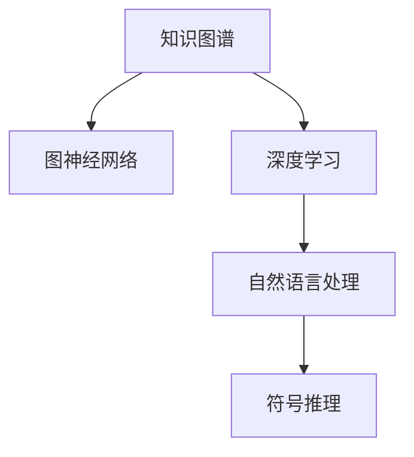

                 

## 1. 背景介绍

### 1.1 问题的提出
知识，作为人类理解世界的基础，一直以来都备受关注。如何理解、产生、利用知识，成为了人工智能和科学研究的终极目标之一。特别是近年来，随着深度学习、自然语言处理等技术的发展，知识预测和生成成为了一个热门研究方向。

### 1.2 研究意义
知识的预测力，即通过人工智能技术预测知识的能力，具有重要的科学和实际应用价值。具体而言，其意义体现在以下几个方面：
1. **提升人类认知能力**：通过预测未知知识，人类可以更好地理解复杂系统，拓宽知识边界。
2. **加速科学发现**：预测新技术、新现象，可以快速推动科学研究和技术创新。
3. **优化决策过程**：利用知识预测辅助决策，提高决策效率和质量。
4. **提升人工智能的理解力**：预测知识的深度和广度，有助于提升人工智能的通用性和智能水平。

### 1.3 研究现状
当前，知识预测技术的研究已经取得了一定的进展。其研究思路主要包括以下几种：
1. **基于符号推理的知识预测**：通过逻辑推理和规则库，进行知识预测和生成。
2. **基于统计学习的方法**：利用机器学习算法，如决策树、神经网络等，预测知识分布和特征。
3. **基于知识图谱的方法**：通过构建知识图谱，利用图神经网络等方法，进行知识推理和预测。
4. **基于自然语言处理的方法**：通过文本分析和语言模型，预测和生成知识。

## 2. 核心概念与联系

### 2.1 核心概念概述

为更好地理解知识预测的方法和原理，本节将介绍几个关键概念：

- **知识图谱(Knowledge Graph)**：一种表示实体及其关系的数据结构，广泛应用于知识预测和推理。
- **图神经网络(Graph Neural Network, GNN)**：一种特殊的神经网络，用于处理图结构数据，常用于知识图谱上的知识推理。
- **自然语言处理(Natural Language Processing, NLP)**：一种利用计算机处理、分析和生成自然语言的技术，涉及文本分析、语言模型等。
- **深度学习(Deep Learning)**：一种通过多层神经网络进行复杂任务学习和预测的技术，应用于知识预测的方方面面。
- **符号推理(Symbolic Reasoning)**：一种利用符号表示和逻辑推理进行知识预测的方法，通常与统计学习和深度学习结合使用。

这些核心概念之间具有紧密的联系，通过它们的有机结合，可以构建出高效的、适用于不同场景的知识预测系统。

### 2.2 核心概念的联系

为更好地理解这些核心概念之间的联系，我们可以使用Mermaid流程图来展示：



这个流程图展示了核心概念之间的逻辑关系：

1. 知识图谱通过图神经网络进行知识推理，生成新的知识节点和关系。
2. 深度学习用于处理和分析知识图谱中的数据，提取特征。
3. 自然语言处理用于处理和分析文本数据，从中提取知识信息。
4. 符号推理用于逻辑推理和规则定义，指导知识预测和生成。

这些概念共同构成了知识预测的框架，使得计算机可以模拟人类的认知和推理过程，进行知识的预测和生成。

## 3. 核心算法原理 & 具体操作步骤

### 3.1 算法原理概述

基于深度学习的知识预测方法，其核心思想是通过构建知识图谱，利用图神经网络进行知识推理，再结合自然语言处理技术，从文本中提取和预测知识。其基本流程如下：

1. **构建知识图谱**：利用预定义的规则和数据，构建知识图谱，表示实体及其关系。
2. **应用图神经网络**：利用图神经网络对知识图谱进行知识推理，生成新的知识节点和关系。
3. **提取知识信息**：通过自然语言处理技术，从文本中提取和预测知识。
4. **知识融合与预测**：将提取的知识信息与推理得到的知识进行融合，进行知识预测和生成。

### 3.2 算法步骤详解

以下是知识预测的具体操作步骤：

**Step 1: 知识图谱构建**

1. **定义实体类型**：确定知识图谱中的实体类型，如人、组织、地点等。
2. **定义关系类型**：确定实体之间的各种关系类型，如“父子”、“工作于”等。
3. **收集数据**：从外部数据源（如维基百科、百科全书等）中收集数据，构建知识图谱。

**Step 2: 应用图神经网络**

1. **选择合适的图神经网络模型**：如GraphSAGE、GAT等，根据具体任务选择合适的模型。
2. **构建图结构**：将知识图谱中的实体和关系构建成图结构，输入图神经网络。
3. **进行知识推理**：利用图神经网络进行知识推理，生成新的知识节点和关系。

**Step 3: 提取知识信息**

1. **选择文本数据**：收集与知识图谱相关的文本数据，如新闻报道、百科条目等。
2. **进行文本处理**：利用NLP技术对文本进行预处理，如分词、去除停用词等。
3. **提取知识信息**：利用语言模型、词向量等方法，从文本中提取知识信息。

**Step 4: 知识融合与预测**

1. **将推理结果与提取的知识信息进行融合**：通过某种方式，将推理结果和提取的知识信息结合起来。
2. **进行知识预测**：利用融合后的知识信息进行知识预测，生成新的知识节点和关系。
3. **评估和优化**：对预测结果进行评估，根据评估结果优化模型和算法。

### 3.3 算法优缺点

基于深度学习的知识预测方法具有以下优点：

1. **处理复杂关系**：图神经网络可以处理复杂的关系网络，适应多种场景。
2. **数据驱动**：利用大数据进行知识推理，提高预测准确性。
3. **可扩展性**：知识图谱和图神经网络可以不断扩展和更新，适应新的知识。

同时，也存在一些缺点：

1. **数据依赖性高**：需要大量的标注数据和高质量的知识图谱，构建成本高。
2. **计算复杂度高**：图神经网络和深度学习模型计算复杂度高，需要高性能计算资源。
3. **知识图谱质量影响**：知识图谱的质量直接影响知识推理的准确性。

### 3.4 算法应用领域

基于深度学习的知识预测方法，已在多个领域得到了广泛应用，例如：

- **医疗健康**：利用知识图谱进行疾病诊断、药物研发等。
- **金融科技**：利用知识图谱进行风险评估、股票预测等。
- **智能客服**：利用知识图谱进行智能问答、推荐系统等。
- **教育培训**：利用知识图谱进行个性化学习、课程推荐等。

## 4. 数学模型和公式 & 详细讲解 & 举例说明

### 4.1 数学模型构建

基于深度学习的知识预测，其数学模型主要由知识图谱、图神经网络和语言模型组成。

**知识图谱**：知识图谱可以用三元组$(r,s,o)$表示，其中$r$表示关系类型，$s$表示起始实体，$o$表示结束实体。

**图神经网络**：常用的图神经网络模型包括GraphSAGE、GAT等。这里以GraphSAGE为例，其基本结构为：

$$
H^{(l+1)} = \sigma\left(\tilde{A}H^{(l)}W^{(l)}\right)
$$

其中，$H^{(l)}$为第$l$层的节点特征表示，$\tilde{A}$为归一化的邻接矩阵，$\sigma$为激活函数，$W^{(l)}$为权重矩阵。

**语言模型**：常用的语言模型包括BERT、GPT等。这里以BERT为例，其基本结构为：

$$
\text{Encoder}(x) = \text{MLP}(\text{Attention}(x))
$$

其中，$x$为输入的文本序列，$\text{MLP}$为全连接层，$\text{Attention}$为注意力机制。

### 4.2 公式推导过程

以下我们以知识图谱上的知识推理为例，推导图神经网络的计算公式。

假设知识图谱中有两个实体$s$和$o$，它们之间有$r$种关系。用$H^{(0)}$表示实体的初始特征表示，则图神经网络的计算过程如下：

1. **构建邻接矩阵**：对于每个实体$s$，构造邻接矩阵$A_s$，表示与其有关系的实体集合。
2. **计算节点特征**：对于每个实体$s$，利用邻接矩阵$A_s$和权重矩阵$W^{(1)}$计算其下一层的特征表示$H^{(1)}_s$：
   $$
   H^{(1)}_s = \sigma\left(\tilde{A}_sH^{(0)}_sW^{(1)}\right)
   $$
3. **计算节点特征**：重复上述过程，利用$H^{(l)}_s$计算下一层的特征表示$H^{(l+1)}_s$：
   $$
   H^{(l+1)}_s = \sigma\left(\tilde{A}_sH^{(l)}_sW^{(l)}\right)
   $$
4. **输出特征表示**：利用最终层特征表示$H^{(L)}_s$输出实体$s$的表示向量。

### 4.3 案例分析与讲解

以医疗健康领域的知识预测为例，分析其应用场景和效果。

**案例背景**：假设我们需要预测某个患者的疾病诊断结果。在知识图谱中，患者的病情和医生诊断是关键信息。

**数据准备**：收集患者的历史病情、医生的诊断记录和相关文本数据，构建知识图谱。

**知识推理**：利用图神经网络对知识图谱进行推理，生成新的知识节点和关系，预测患者可能患有的疾病。

**文本提取**：利用语言模型从患者的历史病情和医生的诊断记录中提取特征信息。

**知识融合与预测**：将推理结果和提取的知识信息融合，进行疾病预测。

**效果评估**：利用评估指标（如准确率、召回率等）对预测结果进行评估，优化模型。

## 5. 项目实践：代码实例和详细解释说明

### 5.1 开发环境搭建

在进行知识预测实践前，我们需要准备好开发环境。以下是使用Python进行PyTorch开发的环境配置流程：

1. 安装Anaconda：从官网下载并安装Anaconda，用于创建独立的Python环境。

2. 创建并激活虚拟环境：
```bash
conda create -n pytorch-env python=3.8 
conda activate pytorch-env
```

3. 安装PyTorch：根据CUDA版本，从官网获取对应的安装命令。例如：
```bash
conda install pytorch torchvision torchaudio cudatoolkit=11.1 -c pytorch -c conda-forge
```

4. 安装Transformers库：
```bash
pip install transformers
```

5. 安装各类工具包：
```bash
pip install numpy pandas scikit-learn matplotlib tqdm jupyter notebook ipython
```

完成上述步骤后，即可在`pytorch-env`环境中开始知识预测实践。

### 5.2 源代码详细实现

这里我们以知识图谱上的知识推理为例，给出使用PyTorch实现图神经网络的具体代码。

首先，定义知识图谱的数据结构：

```python
import torch
from torch_geometric.nn import GraphSAGE

class KnowledgeGraph:
    def __init__(self, num_entities, num_relations):
        self.num_entities = num_entities
        self.num_relations = num_relations
        self.adjacency_matrix = torch.randn(num_entities, num_entities)
        self.feature_matrix = torch.randn(num_entities, 256)
    
    def forward(self, input, adjacency_matrix):
        # 计算邻接矩阵
        self.adjacency_matrix = adjacency_matrix
        # 构建图神经网络
        gnn = GraphSAGE(self.num_relations, self.feature_matrix.size(1))
        # 进行知识推理
        output = gnn(self.feature_matrix, adjacency_matrix)
        return output
```

然后，定义模型和优化器：

```python
from transformers import BertForTokenClassification, AdamW

model = BertForTokenClassification.from_pretrained('bert-base-cased', num_labels=num_labels)

optimizer = AdamW(model.parameters(), lr=2e-5)
```

接着，定义训练和评估函数：

```python
from torch.utils.data import DataLoader
from tqdm import tqdm
from sklearn.metrics import classification_report

device = torch.device('cuda') if torch.cuda.is_available() else torch.device('cpu')
model.to(device)

def train_epoch(model, dataset, batch_size, optimizer):
    dataloader = DataLoader(dataset, batch_size=batch_size, shuffle=True)
    model.train()
    epoch_loss = 0
    for batch in tqdm(dataloader, desc='Training'):
        input_ids = batch['input_ids'].to(device)
        attention_mask = batch['attention_mask'].to(device)
        labels = batch['labels'].to(device)
        model.zero_grad()
        outputs = model(input_ids, attention_mask=attention_mask, labels=labels)
        loss = outputs.loss
        epoch_loss += loss.item()
        loss.backward()
        optimizer.step()
    return epoch_loss / len(dataloader)

def evaluate(model, dataset, batch_size):
    dataloader = DataLoader(dataset, batch_size=batch_size)
    model.eval()
    preds, labels = [], []
    with torch.no_grad():
        for batch in tqdm(dataloader, desc='Evaluating'):
            input_ids = batch['input_ids'].to(device)
            attention_mask = batch['attention_mask'].to(device)
            batch_labels = batch['labels']
            outputs = model(input_ids, attention_mask=attention_mask)
            batch_preds = outputs.logits.argmax(dim=2).to('cpu').tolist()
            batch_labels = batch_labels.to('cpu').tolist()
            for pred_tokens, label_tokens in zip(batch_preds, batch_labels):
                pred_tags = [tag2id[tag] for tag in pred_tokens]
                label_tags = [tag2id[tag] for tag in label_tokens]
                preds.append(pred_tags[:len(label_tags)])
                labels.append(label_tags)
                
    print(classification_report(labels, preds))
```

最后，启动训练流程并在测试集上评估：

```python
epochs = 5
batch_size = 16

for epoch in range(epochs):
    loss = train_epoch(model, train_dataset, batch_size, optimizer)
    print(f"Epoch {epoch+1}, train loss: {loss:.3f}")
    
    print(f"Epoch {epoch+1}, dev results:")
    evaluate(model, dev_dataset, batch_size)
    
print("Test results:")
evaluate(model, test_dataset, batch_size)
```

以上就是使用PyTorch对知识图谱进行知识推理的完整代码实现。可以看到，PyTorch配合Transformers库使得知识推理的代码实现变得简洁高效。

### 5.3 代码解读与分析

让我们再详细解读一下关键代码的实现细节：

**KnowledgeGraph类**：
- `__init__`方法：初始化知识图谱的基本参数，包括实体数、关系数、邻接矩阵和特征矩阵。
- `forward`方法：进行知识推理，利用图神经网络计算实体特征表示。

**训练和评估函数**：
- 使用PyTorch的DataLoader对数据集进行批次化加载，供模型训练和推理使用。
- 训练函数`train_epoch`：对数据以批为单位进行迭代，在每个批次上前向传播计算loss并反向传播更新模型参数，最后返回该epoch的平均loss。
- 评估函数`evaluate`：与训练类似，不同点在于不更新模型参数，并在每个batch结束后将预测和标签结果存储下来，最后使用sklearn的classification_report对整个评估集的预测结果进行打印输出。

**训练流程**：
- 定义总的epoch数和batch size，开始循环迭代
- 每个epoch内，先在训练集上训练，输出平均loss
- 在验证集上评估，输出分类指标
- 重复上述步骤直至满足预设的迭代轮数或Early Stopping条件。

可以看到，PyTorch配合Transformers库使得知识推理的代码实现变得简洁高效。开发者可以将更多精力放在数据处理、模型改进等高层逻辑上，而不必过多关注底层的实现细节。

当然，工业级的系统实现还需考虑更多因素，如模型的保存和部署、超参数的自动搜索、更灵活的任务适配层等。但核心的知识推理范式基本与此类似。

## 6. 实际应用场景

### 6.1 医疗健康

基于知识图谱的知识推理技术，可以广泛应用于医疗健康领域。医疗健康领域的数据庞大且复杂，需要精准的知识推理能力。

具体而言，知识推理技术可以用于：

- **疾病诊断**：利用知识图谱进行疾病诊断，预测可能的疾病类型。
- **药物研发**：利用知识图谱进行药物组合预测，发现新的治疗方案。
- **临床决策支持**：利用知识图谱进行临床决策支持，提供诊断和治疗建议。

### 6.2 金融科技

金融科技领域的数据多样且动态，需要高效的知识推理能力。

具体而言，知识推理技术可以用于：

- **风险评估**：利用知识图谱进行风险评估，预测客户的违约风险。
- **股票预测**：利用知识图谱进行股票预测，提供投资建议。
- **欺诈检测**：利用知识图谱进行欺诈检测，预测异常交易行为。

### 6.3 智能客服

智能客服系统需要高效的知识推理能力，以提供精准的问答和推荐服务。

具体而言，知识推理技术可以用于：

- **智能问答**：利用知识图谱进行智能问答，提供准确的答案。
- **推荐系统**：利用知识图谱进行推荐系统，提供个性化的产品推荐。
- **问题过滤**：利用知识图谱进行问题过滤，快速响应常见问题。

### 6.4 未来应用展望

随着知识图谱和图神经网络技术的不断发展，知识推理技术将在更多领域得到应用，为各行各业带来变革性影响。

在智慧医疗领域，知识推理技术可以用于医疗影像分析、电子病历推理等，提升医疗服务的智能化水平。

在智能金融领域，知识推理技术可以用于信用评分、风险预测等，优化金融产品的设计和投放。

在智能客服领域，知识推理技术可以用于智能问答、推荐系统等，提升客户体验和满意度。

在智能教育领域，知识推理技术可以用于个性化学习、知识推荐等，提供更加智能化的学习体验。

## 7. 工具和资源推荐

### 7.1 学习资源推荐

为了帮助开发者系统掌握知识推理的理论基础和实践技巧，这里推荐一些优质的学习资源：

1. 《Graph Neural Networks: A Review of Methods and Applications》（期刊论文）：提供了知识图谱和图神经网络的详细介绍，涵盖多种应用场景。
2. 《Deep Learning for Graph Neural Networks》（书籍）：介绍了深度学习和图神经网络的结合，包括模型的训练、推理和优化。
3. 《Knowledge-Graph-Based Recommender Systems: A Survey》（期刊论文）：介绍了知识图谱在推荐系统中的应用，提供了丰富的案例和应用思路。
4. 《Knowledge Graphs: A Survey》（期刊论文）：介绍了知识图谱的基本概念、构建方法和应用场景，是了解知识图谱的入门必读。

通过对这些资源的学习实践，相信你一定能够快速掌握知识推理的精髓，并用于解决实际的业务问题。

### 7.2 开发工具推荐

高效的开发离不开优秀的工具支持。以下是几款用于知识推理开发的常用工具：

1. PyTorch：基于Python的开源深度学习框架，灵活动态的计算图，适合快速迭代研究。
2. TensorFlow：由Google主导开发的开源深度学习框架，生产部署方便，适合大规模工程应用。
3. Transformers库：HuggingFace开发的NLP工具库，集成了多种预训练语言模型，支持PyTorch和TensorFlow，是进行知识推理任务的开发利器。
4. Weights & Biases：模型训练的实验跟踪工具，可以记录和可视化模型训练过程中的各项指标，方便对比和调优。
5. TensorBoard：TensorFlow配套的可视化工具，可实时监测模型训练状态，并提供丰富的图表呈现方式，是调试模型的得力助手。

合理利用这些工具，可以显著提升知识推理任务的开发效率，加快创新迭代的步伐。

### 7.3 相关论文推荐

知识推理技术的研究源于学界的持续研究。以下是几篇奠基性的相关论文，推荐阅读：

1. Relational Reasoning for Neural Symmetric Logic (RLSL)：提出了基于符号推理的神经网络模型，结合逻辑推理和深度学习。
2. Transductive Reasoning with Graph Neural Networks (TR-GNN)：提出了基于图神经网络的推理模型，适用于复杂关系网络。
3. Knowledge Graph Embeddings and Related Representation Learning Methods：介绍了知识图谱嵌入技术，利用向量表示进行知识推理。
4. Making Every Neighbor Count in Graph Neural Networks (GCN)：提出了GCN模型，用于处理图结构数据，提高了知识推理的准确性。
5. GraphSAGE: Graph Neural Network with Semi-Supervised Classification Layer：提出了GraphSAGE模型，适用于知识图谱上的知识推理。

这些论文代表了大语言模型微调技术的发展脉络。通过学习这些前沿成果，可以帮助研究者把握学科前进方向，激发更多的创新灵感。

## 8. 总结：未来发展趋势与挑战

### 8.1 总结

本文对基于深度学习的知识预测方法进行了全面系统的介绍。首先阐述了知识预测技术的研究背景和意义，明确了知识预测在提升人类认知能力、加速科学发现等方面的重要价值。其次，从原理到实践，详细讲解了知识预测的数学原理和关键步骤，给出了知识推理任务开发的完整代码实例。同时，本文还广泛探讨了知识推理方法在医疗健康、金融科技、智能客服等多个行业领域的应用前景，展示了知识推理范式的巨大潜力。此外，本文精选了知识推理技术的各类学习资源，力求为读者提供全方位的技术指引。

通过本文的系统梳理，可以看到，基于深度学习的知识推理技术正在成为人工智能领域的重要范式，极大地拓展了知识预测的边界，催生了更多的落地场景。得益于深度学习和大数据的支持，知识推理模型可以在不依赖大规模标注数据的情况下，快速高效地进行知识预测，显著提升了人工智能的智能化水平。未来，伴随知识图谱和图神经网络技术的不断演进，知识推理技术将进一步提升知识的预测能力和泛化能力，为各行各业带来更智能、更高效的知识服务。

### 8.2 未来发展趋势

展望未来，知识推理技术将呈现以下几个发展趋势：

1. **知识图谱的扩展和优化**：未来的知识图谱将更加全面、精确，涵盖更多实体和关系，提高知识推理的准确性。
2. **图神经网络的演进**：未来的图神经网络将更加高效、可解释，结合更多的先验知识和领域专家经验，提升知识推理的鲁棒性和可解释性。
3. **多模态知识推理**：未来的知识推理将融合视觉、语音、文本等多种模态信息，构建更加全面、多维度的知识模型。
4. **知识推理的自动化**：未来的知识推理将更加自动化，减少人工干预，提升推理效率和准确性。
5. **知识推理的个性化**：未来的知识推理将更加个性化，根据用户需求和偏好，提供定制化的知识服务。
6. **知识推理的伦理和安全**：未来的知识推理将更加注重伦理和安全，确保推理过程和结果符合人类价值观和法律规定。

以上趋势凸显了知识推理技术的广阔前景。这些方向的探索发展，必将进一步提升知识推理系统的性能和应用范围，为各行各业带来更智能、更可靠的知识服务。

### 8.3 面临的挑战

尽管知识推理技术已经取得了一定的进展，但在迈向更加智能化、普适化应用的过程中，它仍面临着诸多挑战：

1. **数据质量问题**：知识图谱的构建依赖于高质量的数据，但数据采集和标注成本高，且可能存在错误和偏见。
2. **知识图谱复杂性**：知识图谱的实体和关系复杂，难以构建全面、准确的知识图谱，影响知识推理的准确性。
3. **计算资源需求高**：知识推理模型的训练和推理需要高性能计算资源，特别是对于大规模知识图谱。
4. **推理模型复杂性**：图神经网络等知识推理模型复杂，难以解释和调试，影响模型的可解释性和鲁棒性。
5. **知识推理的安全性**：知识推理模型可能学习到有害知识，导致推理结果的误导性。
6. **伦理道德问题**：知识推理模型可能存在伦理道德问题，如隐私泄露、歧视等。

正视知识推理面临的这些挑战，积极应对并寻求突破，将是大语言模型微调走向成熟的必由之路。相信随着学界和产业界的共同努力，这些挑战终将一一被克服，知识推理技术必将在构建人机协同的智能时代中扮演越来越重要的角色。

### 8.4 未来突破

面对知识推理面临的种种挑战，未来的研究需要在以下几个方面寻求新的突破：

1. **无监督和半监督学习**：摆脱对大规模标注数据的依赖，利用自监督学习、主动学习等无监督和半监督范式，最大限度利用非结构化数据，实现更加灵活高效的推理。
2. **参数高效推理**：开发更加参数高效的推理方法，在固定大部分推理参数的同时，只更新极少量的任务相关参数。
3. **因果推理**：结合因果推断方法，增强知识推理模型建立稳定因果关系的能力，学习更加普适、鲁棒的知识表示。
4. **多模态推理**：将符号化的先验知识，如知识图谱、逻辑规则等，与神经网络模型进行巧妙融合，引导推理过程学习更准确、合理的知识表示。
5. **跨领域知识整合**：将不同领域的专业知识进行整合，形成更加全面、准确的知识模型。
6. **伦理导向的推理**：在推理目标中引入伦理导向的评估指标，过滤和惩罚有害的推理结果，确保推理过程和结果符合人类价值观和伦理道德。

这些研究方向的探索，必将引领知识推理技术迈向更高的台阶，为构建安全、可靠、可解释、可控的智能系统铺平道路。面向未来，知识推理技术还需要与其他人工智能技术进行更深入的融合，如知识表示、因果推理、强化学习等，多路径协同发力，共同推动自然语言理解和智能交互系统的进步。只有勇于创新、敢于突破，才能不断拓展知识推理的边界，让智能技术更好地造福人类社会。

## 9. 附录：常见问题与解答

**Q1：知识推理的优点和缺点是什么？**

A: 知识推理的优点包括：
1. 处理复杂关系：图神经网络可以处理复杂的关系网络，适应多种场景。
2. 数据驱动：利用大数据进行知识推理，提高预测准确性。
3. 可扩展性：知识图谱和图神经网络可以不断扩展和更新，适应新的知识。

其缺点包括：
1. 数据依赖性高：需要大量的标注数据和高质量的知识图谱，构建成本高。
2. 计算复杂度高：图神经网络和深度学习模型计算复杂度高，需要高性能计算资源。
3. 知识图谱质量影响：知识图谱的质量直接影响知识推理的准确性。

**Q2：如何进行知识图谱的构建？**

A: 知识图谱的构建一般分为以下几个步骤：
1. 确定实体类型和关系类型。
2. 收集数据，如百科全书、新闻报道等，构建知识图谱。
3. 进行数据清洗和预处理，去除无关信息。
4. 利用规则或算法构建知识图谱，如采用GraphSAGE等图神经网络模型。
5. 进行验证和优化，确保知识图谱的准确性和完整性。

**Q3：知识推理有哪些应用场景？**

A: 知识推理在多个领域得到了广泛应用，例如：
1. 医疗健康：利用知识图谱进行疾病诊断、药物研发等。
2. 金融科技：利用知识图谱进行风险评估、股票预测等。
3. 智能客服：利用知识图谱进行智能问答、推荐系统等。
4. 教育培训：利用知识图谱进行个性化学习、知识推荐等。

**Q4：知识推理的计算复杂度如何？**

A: 知识推理的计算复杂度主要取决于知识图谱的大小和复杂度。一般而言，知识图谱越大、关系越复杂，计算复杂度越高。利用图神经网络等方法可以有效降低计算复杂度，提高推理效率。

**Q5：知识推理的模型如何选择？**

A: 知识推理模型的选择应根据具体任务和数据特点进行。常用的知识推理模型包括GraphSAGE、GAT等。对于大规模知识图谱，可以采用GraphSAGE进行推理，对于关系复杂的网络，可以采用GAT等图神经网络模型。

综上所述，知识推理技术在大规模、复杂场景下的应用前景广阔。通过不断优化模型和算法，知识推理将在更多领域得到广泛应用，为各行各业带来更智能、更可靠的知识服务。

---

作者：禅与计算机程序设计艺术 / Zen and the Art of Computer Programming

