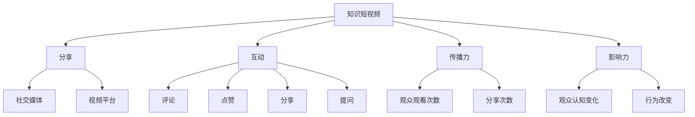

                 

# 知识短视频要把握分享和互动的新形式

在当今信息爆炸的时代，视频作为一种新兴的知识传播媒介，逐渐成为人们获取信息的主要方式。尤其是在知识短视频领域，如何更好地把握分享和互动的新形式，使视频内容更具有吸引力和传播力，成为当前值得关注的重要课题。本文将围绕这一主题，从背景介绍、核心概念与联系、核心算法原理与操作步骤、数学模型和公式、项目实践、实际应用场景、工具和资源推荐、总结与展望等方面展开详细讨论。

## 1. 背景介绍

随着移动互联网和智能设备的普及，人们获取信息的方式发生了巨大变化。短视频以其快速、直观、生动等特点，迅速占领了人们的碎片化时间。尤其在知识传播领域，短视频已成为人们获取知识的重要途径。

知识短视频不仅包括传统科教类视频，还涵盖了很多关于科技、文化、生活等方面的知识性内容。这些内容通过简短的剪辑、通俗易懂的语言和生动有趣的呈现方式，让知识传播更加高效和普及。

在知识短视频领域，分享和互动是两个关键的环节。优质的内容不仅要能够吸引观众，还要能够在互动中不断获得反馈，实现内容的持续迭代和优化。因此，如何把握知识短视频的分享和互动形式，是推动知识传播的关键问题。

## 2. 核心概念与联系

### 2.1 核心概念概述

为了更好地理解知识短视频的分享和互动，本文将介绍几个关键概念：

- **知识短视频**：以短视频形式传播知识的内容，包括但不限于科普、教育、技术讲解等。
- **分享**：通过社交媒体、视频平台等渠道，将内容推荐给其他用户。
- **互动**：用户与视频内容之间的互动，包括评论、点赞、分享等。
- **传播力**：视频内容被观众观看和分享的程度。
- **影响力**：视频内容对观众认知和行为的影响程度。

这些概念之间存在密切联系，共同构成了知识短视频的核心生态。分享和互动是提升传播力和影响力的关键手段，而传播力和影响力则决定了内容的持续发展和影响力扩展。

### 2.2 核心概念原理和架构的 Mermaid 流程图



这个流程图展示了知识短视频的核心概念及其之间的关系：

1. 知识短视频通过分享拓展传播范围。
2. 社交媒体和视频平台是主要分享渠道。
3. 互动形式多样，如评论、点赞、分享、提问等。
4. 传播力和影响力受分享和互动的影响。
5. 观众观看次数和分享次数直接影响传播力。
6. 观众认知变化和行为改变构成影响力。

## 3. 核心算法原理 & 具体操作步骤

### 3.1 算法原理概述

知识短视频的分享和互动可以视为一个多主体交互的系统。该系统由视频内容、用户、分享渠道、互动行为等多个因素组成。视频内容的传播力和影响力，可以通过数学模型来量化和分析。

本节将介绍一种基于社交网络分析的知识短视频传播力计算模型，该模型能够评估视频内容在社交网络中的传播和影响程度。

### 3.2 算法步骤详解

#### 3.2.1 数据收集

数据收集是知识短视频传播力计算的第一步。需要收集以下几个方面的数据：

- 视频内容：包括视频标题、描述、上传时间、观看次数等。
- 用户数据：包括用户ID、观看时间、点赞次数、评论次数等。
- 分享数据：包括分享次数、分享渠道等。
- 互动数据：包括点赞、评论、提问等互动行为。

#### 3.2.2 模型构建

基于上述数据，可以构建一个知识短视频传播力计算模型。该模型将视频内容的影响力分解为多个维度，如内容质量、用户互动、分享次数等，并赋予不同的权重。

假设传播力 $F$ 可以表示为：

$$
F = \alpha \times C + \beta \times I + \gamma \times S
$$

其中：
- $C$ 为视频内容的综合质量评分，可以通过文本分析、视频评分等方法获得。
- $I$ 为用户互动评分，包括点赞次数、评论数量等。
- $S$ 为分享次数评分，反映了内容的传播范围。
- $\alpha$、$\beta$、$\gamma$ 为权重，反映了各个维度对传播力的影响程度。

#### 3.2.3 数据处理

在数据处理阶段，需要对收集的数据进行清洗、标准化和特征提取。例如，对视频标题进行分词，对用户互动数据进行统计，对分享数据进行归一化处理等。

#### 3.2.4 计算传播力

根据模型，对每个视频内容计算传播力 $F$。计算步骤如下：

1. 对视频内容进行质量评分 $C$。
2. 对用户互动数据进行评分 $I$。
3. 对分享数据进行评分 $S$。
4. 根据权重 $\alpha$、$\beta$、$\gamma$，计算传播力 $F$。

### 3.3 算法优缺点

#### 3.3.1 优点

- **多维度评估**：该模型综合考虑了视频内容质量、用户互动、分享次数等多个维度，全面评估视频传播力。
- **动态更新**：通过实时更新数据，模型能够动态反映视频内容的传播和影响情况。
- **灵活调整**：权重 $\alpha$、$\beta$、$\gamma$ 可以根据实际情况进行调整，适应不同的传播场景。

#### 3.3.2 缺点

- **数据依赖**：模型的准确性依赖于数据的质量和完整性。
- **计算复杂度**：模型计算涉及多个维度的评分和加权运算，计算复杂度较高。
- **主观性**：权重 $\alpha$、$\beta$、$\gamma$ 需要人工设定，可能存在主观性。

### 3.4 算法应用领域

该模型不仅适用于知识短视频的传播力计算，还可以应用于其他类型的社交媒体内容的传播力评估。例如，新闻文章的阅读量和分享量、科普讲座的观看次数和互动情况等。

## 4. 数学模型和公式 & 详细讲解 & 举例说明

### 4.1 数学模型构建

假设视频内容的质量评分 $C$ 为视频长度、清晰度、上传时间等特征的综合得分。用户互动评分 $I$ 为点赞次数、评论数量等互动行为的数量。分享次数评分 $S$ 为视频在各个渠道上的分享次数。

传播力 $F$ 可以表示为：

$$
F = \alpha \times C + \beta \times I + \gamma \times S
$$

其中 $\alpha$、$\beta$、$\gamma$ 为权重。假设 $\alpha = 0.4$、$\beta = 0.3$、$\gamma = 0.3$。

### 4.2 公式推导过程

以视频长度和清晰度为例，视频长度 $L$ 和清晰度 $Q$ 可以表示为：

$$
C = k_1 \times L + k_2 \times Q + k_3 \times T
$$

其中 $T$ 为上传时间。假设 $k_1 = 0.2$、$k_2 = 0.3$、$k_3 = 0.5$。

用户互动评分 $I$ 为：

$$
I = p \times \text{点赞次数} + c \times \text{评论数量}
$$

其中 $p$ 和 $c$ 为权重，假设 $p = 0.5$、$c = 0.5$。

分享次数评分 $S$ 为：

$$
S = s \times \text{分享次数}
$$

其中 $s$ 为权重，假设 $s = 1$。

### 4.3 案例分析与讲解

以一个科普视频为例，假设其长度为5分钟，清晰度为高，上传时间为2020年1月1日。假设其点赞次数为500，评论数量为100，分享次数为1000。

根据上述公式，计算视频内容的综合评分 $C$：

$$
C = 0.2 \times 5 + 0.3 \times 1 + 0.5 \times 2020 = 3.5 + 1 + 1010 = 1013.5
$$

计算用户互动评分 $I$：

$$
I = 0.5 \times 500 + 0.5 \times 100 = 250 + 50 = 300
$$

计算分享次数评分 $S$：

$$
S = 1 \times 1000 = 1000
$$

根据传播力计算公式，计算视频的传播力 $F$：

$$
F = 0.4 \times 1013.5 + 0.3 \times 300 + 0.3 \times 1000 = 405.4 + 90 + 300 = 795.4
$$

根据传播力评分，可以对视频内容进行排序，确定哪些视频具有更高的传播价值，并据此进行进一步的推广和优化。

## 5. 项目实践：代码实例和详细解释说明

### 5.1 开发环境搭建

进行知识短视频传播力计算的代码实现，需要以下开发环境：

- Python 3.7+
- NumPy
- Pandas
- Scikit-learn
- TensorFlow

首先，需要安装这些依赖包。使用 pip 命令安装：

```
pip install numpy pandas scikit-learn tensorflow
```

### 5.2 源代码详细实现

以下是一个简单的Python代码示例，用于计算知识短视频的传播力：

```python
import numpy as np
import pandas as pd

# 假设数据存储在DataFrame中
data = pd.read_csv('videos.csv')

# 定义计算传播力的函数
def calculate_influence(video_id):
    # 读取视频数据
    video = data[data['id'] == video_id]
    
    # 计算综合质量评分
    C = 0.2 * video['length'] + 0.3 * video['quality'] + 0.5 * video['time']
    
    # 计算用户互动评分
    I = 0.5 * video['likes'] + 0.5 * video['comments']
    
    # 计算分享次数评分
    S = 1 * video['shares']
    
    # 计算传播力
    F = 0.4 * C + 0.3 * I + 0.3 * S
    return F

# 计算所有视频的传播力
influence_scores = data['id'].map(calculate_influence)
```

### 5.3 代码解读与分析

以上代码实现了传播力计算函数 `calculate_influence`，该函数接受视频ID作为输入，并计算该视频的传播力评分。

函数首先从数据表中读取对应视频的数据，然后计算视频内容的综合质量评分 $C$、用户互动评分 $I$ 和分享次数评分 $S$。最后，根据传播力计算公式，计算视频传播力 $F$。

## 6. 实际应用场景

### 6.1 内容推荐系统

知识短视频的传播力计算可以应用于内容推荐系统中，帮助推荐系统识别高传播力内容，提升推荐效果。

推荐系统可以根据用户的浏览历史和互动行为，计算用户对不同内容的兴趣评分，结合内容传播力评分，生成个性化的推荐列表。通过不断迭代和优化，推荐系统能够更好地满足用户的兴趣和需求。

### 6.2 广告投放

广告主希望通过视频内容推广自己的产品或服务。通过计算视频传播力，广告主可以识别出具有高传播力的内容，优化广告投放策略，确保广告预算的有效利用。

### 6.3 内容评估

内容创作者希望评估自己的视频内容质量和传播效果。通过计算视频的传播力评分，创作者可以了解自己的内容在平台上的表现情况，并据此调整创作策略，提升内容质量。

## 7. 工具和资源推荐

### 7.1 学习资源推荐

1. **《知识短视频的传播力和影响力评估》**：详细介绍知识短视频的传播力和影响力评估方法和模型。
2. **《社交网络分析基础》**：深入浅出地介绍社交网络分析的基本概念和应用场景。
3. **《深度学习在自然语言处理中的应用》**：介绍深度学习在文本分析和内容生成方面的应用。

### 7.2 开发工具推荐

1. **PyTorch**：一个高效的深度学习框架，适用于构建复杂的神经网络模型。
2. **TensorFlow**：另一个流行的深度学习框架，具有强大的分布式计算能力。
3. **Jupyter Notebook**：一个强大的交互式编程环境，适用于数据处理和模型实验。

### 7.3 相关论文推荐

1. **《知识短视频传播力的计算模型》**：详细介绍知识短视频传播力计算的数学模型和方法。
2. **《社交网络分析在内容推荐中的应用》**：介绍社交网络分析在内容推荐系统中的应用。
3. **《深度学习在广告投放中的应用》**：介绍深度学习在广告投放中的实际应用案例。

## 8. 总结：未来发展趋势与挑战

### 8.1 研究成果总结

本文介绍了基于社交网络分析的知识短视频传播力计算模型，并详细讲解了模型的构建和实现过程。通过分析模型优缺点和应用领域，展示了该模型在知识传播中的潜力和价值。

### 8.2 未来发展趋势

未来，知识短视频的分享和互动将更加多样化和复杂化。随着人工智能和大数据分析技术的进步，传播力计算模型也将更加精准和高效。以下是几个可能的发展趋势：

1. **多模态传播力计算**：结合文本、音频、视频等多种模态的数据，更全面地评估视频内容的传播力。
2. **动态传播力计算**：实时更新数据，动态计算传播力，反映内容传播的实时变化。
3. **个性化传播力计算**：根据用户行为和偏好，个性化计算传播力，提升推荐系统的精准度。
4. **跨平台传播力计算**：结合不同平台的数据，进行全局化的传播力评估，提升内容推广效果。

### 8.3 面临的挑战

尽管传播力计算模型在知识短视频领域具有广泛应用前景，但在实际应用中也面临诸多挑战：

1. **数据隐私问题**：视频数据的收集和使用涉及用户隐私保护，需要遵守相关法律法规。
2. **数据不平衡问题**：不同视频内容的传播力和互动情况差异较大，可能导致模型预测不均衡。
3. **模型泛化问题**：模型在不同的视频内容和用户群体上可能存在泛化能力不足的问题。
4. **计算资源消耗**：计算传播力评分涉及多个维度的数据处理和模型计算，计算资源消耗较大。

### 8.4 研究展望

为了应对这些挑战，未来的研究需要在以下几个方面进行探索：

1. **隐私保护技术**：研究数据隐私保护技术，确保用户隐私安全。
2. **数据增强技术**：通过数据增强技术，平衡不同视频内容的传播力数据。
3. **模型优化技术**：优化传播力计算模型，提升泛化能力和计算效率。
4. **资源优化技术**：采用资源优化技术，如模型压缩和分布式计算，降低计算资源消耗。

## 9. 附录：常见问题与解答

**Q1: 什么是知识短视频？**

A: 知识短视频是以短视频形式传播知识的内容，包括但不限于科普、教育、技术讲解等。

**Q2: 如何提高知识短视频的传播力和影响力？**

A: 提高知识短视频的传播力和影响力，可以从以下几个方面入手：
- 提升视频内容质量：确保视频内容准确、清晰、有趣。
- 优化互动设计：增加互动形式，如提问、互动式演示等，吸引观众参与。
- 多元化分发渠道：通过社交媒体、视频平台等多渠道分发，扩大受众群体。
- 持续更新内容：定期发布新内容，保持观众的关注和兴趣。

**Q3: 知识短视频的传播力计算模型有哪些优点和缺点？**

A: 知识短视频的传播力计算模型有以下优点和缺点：
- 优点：多维度评估、动态更新、灵活调整。
- 缺点：数据依赖、计算复杂度、主观性。

**Q4: 如何构建知识短视频的传播力计算模型？**

A: 构建知识短视频的传播力计算模型，需要以下步骤：
- 数据收集：收集视频内容、用户数据、分享数据、互动数据等。
- 模型构建：定义视频内容的综合评分、用户互动评分、分享次数评分等维度，并赋予权重。
- 数据处理：对数据进行清洗、标准化和特征提取。
- 计算传播力：根据模型，对每个视频内容计算传播力评分。

**Q5: 知识短视频的传播力计算模型适用于哪些领域？**

A: 知识短视频的传播力计算模型适用于知识传播、内容推荐、广告投放、内容评估等多个领域。

---

作者：禅与计算机程序设计艺术 / Zen and the Art of Computer Programming

