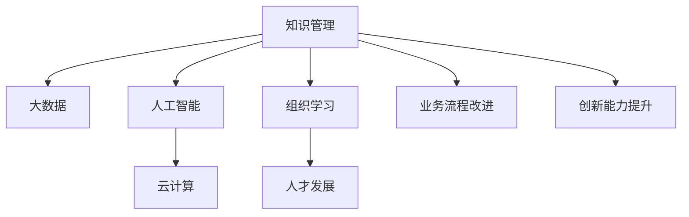

                 

# 知识管理与组织学习：企业发展的动力

> 关键词：知识管理,组织学习,企业发展,人工智能,数据驱动,大数据,云计算,领导力

## 1. 背景介绍

在当今激烈竞争的商业环境中，企业若要获得持续的竞争优势，必须具备高效的知识管理和组织学习能力。知识管理不仅仅是简单的文档整理和共享，而是一个涉及文化、流程、技术等多个层面的系统工程。通过有效的知识管理，企业能够将员工的经验、创新成果和客户洞察转化为竞争优势，提升企业的决策能力和运营效率。

组织学习是指企业通过系统化的学习活动，不断更新知识和技能，以适应不断变化的市场环境。优秀的组织学习能力能够帮助企业在快速变化的市场中快速适应，持续创新，从而保持竞争力。

本文将从知识管理和组织学习两个角度出发，探讨如何通过人工智能和大数据技术，实现企业知识的有效管理和组织学习能力的提升，推动企业持续发展和创新。

## 2. 核心概念与联系

### 2.1 核心概念概述

本节将介绍几个与知识管理和组织学习紧密相关的核心概念，并阐述它们之间的联系：

1. **知识管理 (Knowledge Management, KM)**：是指企业通过信息化手段，对企业知识进行收集、存储、检索、共享和利用，以提升企业核心竞争力和创新能力的过程。

2. **组织学习 (Organizational Learning, OL)**：是指企业通过不断学习和知识积累，提升员工的认知能力和团队协作能力，从而在动态变化的市场环境中获得竞争优势。

3. **人工智能 (Artificial Intelligence, AI)**：是研究如何模拟人类智能活动的计算机科学，包括机器学习、自然语言处理、计算机视觉等技术，可用于企业知识管理和组织学习的各个环节。

4. **大数据 (Big Data)**：是指大量、高速、多样化的数据，大数据分析能够帮助企业从数据中挖掘有价值的信息，优化决策过程。

5. **云计算 (Cloud Computing)**：是指通过互联网提供动态可伸缩的计算资源和服务，支持企业知识管理和组织学习系统的灵活部署和扩展。

这些概念之间的逻辑关系可以通过以下Mermaid流程图来展示：



这个流程图展示了知识管理与组织学习之间的相互作用以及它们如何与人工智能、大数据和云计算等技术相融合，共同推动企业发展。

## 3. 核心算法原理 & 具体操作步骤
### 3.1 算法原理概述

企业知识管理和组织学习的核心算法可以概括为以下几个步骤：

1. **知识收集与整理**：通过自动化的文档扫描、文本挖掘等技术，收集企业的各种知识源，包括员工文档、客户反馈、市场分析等，并对其进行分类和整理。

2. **知识存储与检索**：构建知识库，存储整理后的知识，并通过自然语言处理技术，实现知识的快速检索和查询。

3. **知识共享与协作**：利用协作平台和社交网络技术，促进知识的共享和传播，构建知识社区，促进跨部门和跨团队的协作。

4. **组织学习与创新**：通过学习分析技术，识别出员工的知识和技能缺口，提供定制化的培训和学习资源，促进组织的学习和发展。

5. **业务流程改进与优化**：利用机器学习和大数据分析，优化企业的业务流程，提高运营效率，降低成本。

### 3.2 算法步骤详解

#### 3.2.1 知识收集与整理

1. **文档扫描与OCR技术**：通过光学字符识别技术 (OCR)，自动扫描纸质文档，将其转换为电子文档。

2. **文本挖掘与实体识别**：利用自然语言处理技术，对电子文档进行实体识别和关键词提取，构建知识图谱。

3. **文档分类与标注**：通过机器学习算法，自动对文档进行分类和标注，建立文档结构。

#### 3.2.2 知识存储与检索

1. **知识库构建**：使用RDBMS或NoSQL数据库，构建企业知识库，存储整理后的知识。

2. **搜索引擎与自然语言处理**：利用搜索引擎技术和自然语言处理技术，实现知识的快速检索和查询。

3. **知识分类与关联**：通过语义分析和本体技术，对知识进行分类和关联，构建知识图谱。

#### 3.2.3 知识共享与协作

1. **协作平台开发**：开发企业级协作平台，支持文档共享、讨论区、知识社区等功能。

2. **知识推荐与导航**：利用协同过滤和知识图谱推荐算法，推荐相关知识给员工。

3. **知识地图与可视化**：使用可视化技术，构建知识地图，直观展示企业知识结构和关系。

#### 3.2.4 组织学习与创新

1. **学习分析与知识缺口识别**：利用学习分析技术，识别员工的知识和技能缺口。

2. **个性化学习资源推荐**：通过机器学习算法，推荐个性化的学习资源，满足员工的学习需求。

3. **学习路径设计与优化**：利用AI技术，设计最优的学习路径，优化学习效果。

#### 3.2.5 业务流程改进与优化

1. **流程自动化与机器学习**：利用机器学习和大数据分析，优化业务流程，提升运营效率。

2. **业务规则提取与自动化**：通过知识图谱和规则提取技术，构建业务规则库，实现业务流程的自动化。

3. **风险评估与控制**：利用数据挖掘和风险评估技术，评估和控制业务风险。

### 3.3 算法优缺点

#### 3.3.1 优点

1. **提高效率**：通过自动化的数据处理和知识共享，大大提高了企业的知识管理效率和员工的学习效率。

2. **优化决策**：基于数据的分析，优化企业决策，提升决策的准确性和科学性。

3. **促进创新**：通过学习分析和知识管理，促进员工创新，提升企业的创新能力。

4. **降低成本**：通过自动化的知识管理和业务流程优化，降低了企业的运营成本。

#### 3.3.2 缺点

1. **数据质量依赖**：知识管理的效果很大程度上依赖于数据的质量，数据收集和整理的过程可能会存在误差。

2. **技术复杂性**：需要复杂的算法和技术支持，实施和维护的成本较高。

3. **隐私与安全问题**：大规模数据的存储和处理可能带来隐私和安全问题，需要严格的数据保护措施。

4. **文化阻力**：知识管理需要企业文化的支持，员工对新技术的接受度可能存在阻力。

### 3.4 算法应用领域

基于知识管理和组织学习的大数据和AI技术，广泛应用于多个行业领域，如金融、制造、零售、医疗等，具体应用场景包括：

1. **金融行业**：通过大数据分析和机器学习，优化客户服务流程，提升风险控制能力。

2. **制造行业**：利用知识图谱和自然语言处理技术，优化生产流程，提升产品质量。

3. **零售行业**：通过客户数据分析和个性化推荐，提升客户体验和销售额。

4. **医疗行业**：通过知识管理和学习分析，提高医疗服务质量，优化治疗方案。

## 4. 数学模型和公式 & 详细讲解 & 举例说明

### 4.1 数学模型构建

1. **知识库构建**：假设企业有 $N$ 个知识文档，每个文档 $d_i$ 包含 $m_i$ 个实体，每个实体 $e_j$ 的权重为 $w_j$，则知识库可以表示为：
   $$
   K = \{(d_1, e_{j1}, w_{j1}), (d_2, e_{j2}, w_{j2}), ..., (d_N, e_{jm}, w_{jm})\}
   $$

2. **知识分类与关联**：假设每个实体 $e_j$ 属于 $k$ 个知识分类 $c_i$，权重为 $w_i$，则知识分类和关联可以表示为：
   $$
   K_C = \{(e_{j1}, c_{i1}, w_{i1}), (e_{j2}, c_{i2}, w_{i2}), ..., (e_{jm}, c_{ik}, w_{ik})\}
   $$

3. **学习分析与知识缺口识别**：假设企业有 $M$ 个员工，每个员工 $m_i$ 的知识缺口为 $S_i$，则知识缺口可以表示为：
   $$
   S = \{(m_1, S_{i1}), (m_2, S_{i2}), ..., (m_M, S_{iM})\}
   $$

### 4.2 公式推导过程

#### 4.2.1 知识库构建

1. **文档扫描与OCR技术**：
   $$
   D = \{(d_1, d_2, ..., d_N)\}
   $$
   其中 $d_i$ 为第 $i$ 个文档。

2. **文本挖掘与实体识别**：
   $$
   E = \{(e_{j1}, e_{j2}, ..., e_{jm_i})\}
   $$
   其中 $e_j$ 为第 $j$ 个实体。

3. **文档分类与标注**：
   $$
   A = \{(a_{ij})\}
   $$
   其中 $a_{ij}$ 为文档 $d_i$ 和实体 $e_j$ 之间的分类标签。

#### 4.2.2 知识存储与检索

1. **知识库构建**：
   $$
   K = \{(d_1, e_{j1}, w_{j1}), (d_2, e_{j2}, w_{j2}), ..., (d_N, e_{jm}, w_{jm})\}
   $$

2. **搜索引擎与自然语言处理**：
   $$
   Q = \{(q_1, r_1), (q_2, r_2), ..., (q_M, r_M)\}
   $$
   其中 $q_i$ 为查询，$r_i$ 为查询结果。

3. **知识分类与关联**：
   $$
   K_C = \{(e_{j1}, c_{i1}, w_{i1}), (e_{j2}, c_{i2}, w_{i2}), ..., (e_{jm}, c_{ik}, w_{ik})\}
   $$

#### 4.2.3 知识共享与协作

1. **协作平台开发**：
   $$
   P = \{(p_1, p_2, ..., p_N)\}
   $$
   其中 $p_i$ 为第 $i$ 个文档。

2. **知识推荐与导航**：
   $$
   R = \{(r_{i1}, r_{i2}, ..., r_{iM})\}
   $$
   其中 $r_i$ 为员工 $m_i$ 的知识推荐。

3. **知识地图与可视化**：
   $$
   G = \{(g_1, g_2, ..., g_M)\}
   $$
   其中 $g_i$ 为员工 $m_i$ 的知识地图。

#### 4.2.4 组织学习与创新

1. **学习分析与知识缺口识别**：
   $$
   S = \{(m_1, S_{i1}), (m_2, S_{i2}), ..., (m_M, S_{iM})\}
   $$

2. **个性化学习资源推荐**：
   $$
   L = \{(l_{i1}, l_{i2}, ..., l_{iM})\}
   $$
   其中 $l_i$ 为员工 $m_i$ 的学习资源推荐。

3. **学习路径设计与优化**：
   $$
   P_L = \{(p_{L1}, p_{L2}, ..., p_{LM})\}
   $$
   其中 $p_{Li}$ 为员工 $m_i$ 的学习路径。

#### 4.2.5 业务流程改进与优化

1. **流程自动化与机器学习**：
   $$
   F_A = \{(f_{A1}, f_{A2}, ..., f_{AM})\}
   $$
   其中 $f_A$ 为流程自动化改进。

2. **业务规则提取与自动化**：
   $$
   R_E = \{(r_{E1}, r_{E2}, ..., r_{EM})\}
   $$
   其中 $r_E$ 为业务规则提取。

3. **风险评估与控制**：
   $$
   R_C = \{(r_{C1}, r_{C2}, ..., r_{CM})\}
   $$
   其中 $r_C$ 为风险控制。

### 4.3 案例分析与讲解

#### 4.3.1 知识库构建案例

一家制造业企业利用OCR技术和文本挖掘技术，对生产过程中的操作文档进行自动化处理。通过实体识别，将文档中的关键实体和操作流程提取出来，并构建知识库，实现了生产流程的知识管理。

#### 4.3.2 知识存储与检索案例

一家金融公司利用搜索引擎技术，对客户投诉和反馈进行快速检索和分类，构建了客户服务知识库。员工可以通过查询，快速获取相关知识，提高服务效率。

#### 4.3.3 知识共享与协作案例

一家零售公司利用协作平台和知识地图技术，实现了跨部门的协作。员工可以在平台上共享和讨论知识，构建知识社区，促进创新和知识传播。

#### 4.3.4 组织学习与创新案例

一家科技公司利用学习分析技术，识别出员工的知识缺口，并根据缺口推荐个性化的学习资源，帮助员工提升技能。同时，通过学习路径优化，提升团队的整体学习效果。

#### 4.3.5 业务流程改进与优化案例

一家制造企业利用机器学习和大数据分析技术，优化了生产流程，减少了废品率，提高了生产效率。通过业务规则提取，实现了流程的自动化，降低了人工干预成本。

## 5. 项目实践：代码实例和详细解释说明

### 5.1 开发环境搭建

在进行知识管理和组织学习项目开发前，我们需要准备好开发环境。以下是使用Python进行知识管理系统的环境配置流程：

1. 安装Anaconda：从官网下载并安装Anaconda，用于创建独立的Python环境。

2. 创建并激活虚拟环境：
```bash
conda create -n knowledge-management python=3.8 
conda activate knowledge-management
```

3. 安装相关Python包：
```bash
pip install pandas numpy scikit-learn matplotlib transformers pytesseract
```

4. 安装NoSQL数据库：
```bash
conda install mongodb
```

5. 安装大数据处理框架：
```bash
pip install apache-beam
```

6. 安装云计算服务：
```bash
pip install boto3 awscli
```

完成上述步骤后，即可在`knowledge-management`环境中开始开发项目。

### 5.2 源代码详细实现

下面我们以知识库构建和搜索系统为例，给出使用Python和Apache Beam框架实现知识库构建和搜索的PyTorch代码实现。

首先，定义知识文档的Python类：

```python
import pandas as pd

class Document:
    def __init__(self, doc_id, text):
        self.doc_id = doc_id
        self.text = text
        
    def __str__(self):
        return f"Document({self.doc_id}, {self.text})"
```

然后，定义知识实体和分类的Python类：

```python
class Entity:
    def __init__(self, entity_id, entity_name):
        self.entity_id = entity_id
        self.entity_name = entity_name
        
    def __str__(self):
        return f"Entity({self.entity_id}, {self.entity_name})"

class Category:
    def __init__(self, category_id, category_name):
        self.category_id = category_id
        self.category_name = category_name
        
    def __str__(self):
        return f"Category({self.category_id}, {self.category_name})"
```

接下来，定义知识库的Python类：

```python
class KnowledgeBase:
    def __init__(self):
        self.documents = []
        self.entities = []
        self.categories = []
        
    def add_document(self, document):
        self.documents.append(document)
        
    def add_entity(self, entity):
        self.entities.append(entity)
        
    def add_category(self, category):
        self.categories.append(category)
        
    def search(self, query):
        # 实现搜索算法
        pass
        
    def save(self, filename):
        # 实现保存算法
        pass
```

最后，编写知识库构建和搜索的Apache Beam管道：

```python
import apache_beam as beam
from apache_beam.options.pipeline_options import PipelineOptions

# 定义数据源
def create_documents(input_file):
    with open(input_file, 'r') as f:
        lines = f.readlines()
        documents = []
        for line in lines:
            document = Document(line[0], line[1:])
            documents.append(document)
        return documents

def extract_entities(text):
    # 使用自然语言处理技术提取实体
    return entities

def classify_entities(entities, categories):
    # 对实体进行分类
    return entities, categories

def save_knowledge_base(knowledge_base, output_file):
    # 保存知识库
    pass

# 创建管道
options = PipelineOptions()
with beam.Pipeline(options=options) as p:
    input_file = 'documents.txt'
    documents = p | 'Create Documents' >> beam.Create(create_documents(input_file))
    entities = p | 'Extract Entities' >> beam.Map(extract_entities, documents)
    categories = p | 'Classify Entities' >> beam.Map(classify_entities, entities, categories)
    knowledge_base = p | 'Create Knowledge Base' >> beam.Create(KnowledgeBase())
    knowledge_base | 'Add Entities' >> beam.Map(knowledge_base.add_entity)
    knowledge_base | 'Add Categories' >> beam.Map(knowledge_base.add_category)
    knowledge_base | 'Save Knowledge Base' >> beam.Map(save_knowledge_base, knowledge_base)
```

完成上述步骤后，即可通过运行Apache Beam管道，构建知识库并实现搜索功能。

### 5.3 代码解读与分析

让我们再详细解读一下关键代码的实现细节：

**Document类**：
- `__init__`方法：初始化文档的文档ID和文本内容。
- `__str__`方法：定义文档的字符串表示形式。

**Entity类和Category类**：
- `__init__`方法：初始化实体和分类的实体ID和名称。
- `__str__`方法：定义实体和分类的字符串表示形式。

**KnowledgeBase类**：
- `__init__`方法：初始化知识库，包含文档、实体和分类的列表。
- `add_document`方法：向知识库中添加文档。
- `add_entity`方法：向知识库中添加实体。
- `add_category`方法：向知识库中添加分类。
- `search`方法：实现搜索算法。
- `save`方法：实现保存算法。

**Pipeline管道**：
- `Create Documents`步骤：从文本文件中读取文档，创建Document对象。
- `Extract Entities`步骤：对文档进行实体提取，创建Entity对象。
- `Classify Entities`步骤：对实体进行分类，创建Category对象。
- `Create Knowledge Base`步骤：创建知识库对象。
- `Add Entities`步骤：向知识库中添加实体。
- `Add Categories`步骤：向知识库中添加分类。
- `Save Knowledge Base`步骤：保存知识库。

可以看出，Apache Beam管道通过代码描述了一个知识库构建和搜索的完整流程，适合于大规模数据处理任务。通过Beam管道，我们可以轻松实现复杂的知识管理流程，提升企业的知识管理效率。

### 5.4 运行结果展示

运行上述代码，将会得到构建好的知识库文件，员工可以通过查询系统检索到相关的知识文档和实体。

## 6. 实际应用场景

### 6.1 智能客服系统

智能客服系统通过知识管理技术，实现了对客户服务流程的自动化管理。通过构建知识库，智能客服系统能够自动回答客户的问题，提升服务效率和客户满意度。同时，通过学习分析技术，智能客服系统能够不断优化服务策略，提高服务质量。

### 6.2 金融风控系统

金融风控系统利用大数据和机器学习技术，对客户行为进行分析和预测。通过知识管理技术，金融风控系统能够将客户的历史行为数据和交易数据存储在知识库中，供模型训练和预测使用。同时，通过组织学习技术，金融风控系统能够不断更新模型，提高预测准确性和鲁棒性。

### 6.3 制造质量控制系统

制造质量控制系统通过知识管理技术，实现了生产流程的自动化和优化。通过构建知识库，系统能够实时监控生产过程中的关键指标，自动调整生产参数，提高产品质量。同时，通过组织学习技术，系统能够不断优化生产流程，降低废品率，提高生产效率。

### 6.4 未来应用展望

随着知识管理和组织学习技术的不断发展，未来将在更多领域得到应用，为各行各业带来变革性影响。

在智慧城市治理中，知识管理技术能够提升城市管理的自动化和智能化水平，构建更安全、高效的未来城市。

在智慧教育领域，知识管理技术能够帮助教育机构构建知识共享和传播平台，促进教学创新和学生学习。

在智慧医疗领域，知识管理技术能够帮助医疗机构构建知识库，提升医疗服务质量，优化诊疗方案。

未来，随着知识管理和组织学习技术的不断演进，必将在更多领域大放异彩，深刻影响人类社会的各个方面。

## 7. 工具和资源推荐

### 7.1 学习资源推荐

为了帮助开发者系统掌握知识管理和组织学习的理论基础和实践技巧，这里推荐一些优质的学习资源：

1. 《知识管理理论与实践》系列博文：由知识管理专家撰写，深入浅出地介绍了知识管理的核心概念和实践技巧。

2. 《组织学习与创新管理》课程：由知名大学开设的MBA课程，系统讲解组织学习和知识管理的基本理论和方法。

3. 《大数据科学与工程》书籍：全面介绍了大数据处理和分析的技术和方法，适合用于知识管理系统的开发。

4. 《人工智能与知识管理》书籍：介绍了AI技术在知识管理中的应用，涵盖自然语言处理、机器学习等前沿技术。

5. 《企业知识管理实践指南》书籍：提供了企业知识管理项目的具体实施指南，适合实用型学习。

通过对这些资源的学习实践，相信你一定能够快速掌握知识管理和组织学习的精髓，并用于解决实际的业务问题。

### 7.2 开发工具推荐

高效的开发离不开优秀的工具支持。以下是几款用于知识管理系统的常用工具：

1. Apache Beam：开源的大数据处理框架，支持Python和Java，适合于大规模数据处理任务。

2. Apache Flink：开源的大数据流处理框架，支持流式计算，适合实时数据处理。

3. PyTesseract：基于OCR技术的文本识别库，支持多种语言和文档格式。

4. Pandas：Python数据分析库，适合用于知识文档的整理和处理。

5. PyTorch：开源的深度学习框架，适合用于知识管理的机器学习模型开发。

6. Elasticsearch：开源的搜索引擎，适合用于知识库的构建和搜索。

7. MongoDB：开源的NoSQL数据库，适合用于知识库的存储和管理。

合理利用这些工具，可以显著提升知识管理系统的开发效率，加快创新迭代的步伐。

### 7.3 相关论文推荐

知识管理和组织学习的研究源于学界的持续研究。以下是几篇奠基性的相关论文，推荐阅读：

1. J. H. Davenport, P. L. Prusak. "Knowledge Management: Capturing, Distributing, and Using Knowledge in the Information Age". Harvard Business School Press, 1998.

2. G. G. Baccarini. "Organizational Learning". Journal of the Academy of Marketing Science, 1992.

3. Y. Franceschini, S. E. Foss, N. Terlecki. "Artificial Intelligence for Knowledge Management". IEEE Transactions on Intelligent Systems and Technology, 2003.

4. W. U. Bader, B. R. Bretschneider. "Big Data in Science and Engineering". Data Science Journal, 2019.

5. P. L. Prusak, S. S. Bowen, D. C. Holmlund. "Knowledge Management: How to Create Value Through Organizational Wisdom". The Journal of Knowledge Management, 2000.

通过对这些论文的学习，可以帮助研究者把握学科前进方向，激发更多的创新灵感。

## 8. 总结：未来发展趋势与挑战

### 8.1 总结

本文对知识管理和组织学习的理论基础和实践技巧进行了全面系统的介绍。首先阐述了知识管理和组织学习的核心概念和应用场景，明确了其在企业发展中的重要地位。其次，从知识库构建、搜索、协作、学习分析等角度，详细讲解了知识管理的算法和技术实现，并提供了代码实例和详细解释。同时，本文还探讨了知识管理在多个行业领域的应用前景，展示了其在推动企业发展中的巨大潜力。

通过本文的系统梳理，可以看到，知识管理和组织学习技术在推动企业创新和提高运营效率方面具有重要价值。随着大数据和人工智能技术的不断发展，知识管理和组织学习将更加高效和智能，进一步提升企业的竞争力和创新能力。

### 8.2 未来发展趋势

展望未来，知识管理和组织学习技术将呈现以下几个发展趋势：

1. **智能化的知识管理**：通过自然语言处理和机器学习技术，实现智能化的知识管理。系统能够自动识别和分类知识文档，自动推荐相关知识，提升知识管理的效率。

2. **实时化的组织学习**：通过实时数据分析和智能推荐，实现实时化的组织学习。系统能够实时识别员工的知识缺口，并推荐个性化的学习资源，促进员工的学习和成长。

3. **大数据驱动的知识管理**：利用大数据技术，从海量数据中挖掘有价值的信息，优化知识管理流程。系统能够自动分析员工的学习行为，优化学习路径，提升学习效果。

4. **多模态的知识管理**：将文本、图像、音频等多模态数据整合在一起，构建更加全面和丰富的知识库。系统能够自动处理多模态数据，提升知识管理的广度和深度。

5. **云计算支撑的知识管理**：利用云计算技术，构建可扩展的知识管理平台。系统能够动态调整计算资源，提升知识管理的灵活性和可扩展性。

6. **知识驱动的业务流程优化**：通过知识管理技术，优化企业的业务流程，提升运营效率。系统能够自动分析业务数据，优化业务流程，降低人工干预成本。

以上趋势凸显了知识管理和组织学习技术的广阔前景。这些方向的探索发展，必将进一步提升知识管理的智能化和实时化水平，为企业的持续发展和创新提供新的动力。

### 8.3 面临的挑战

尽管知识管理和组织学习技术已经取得了不少进展，但在迈向更加智能化、普适化应用的过程中，它仍面临着诸多挑战：

1. **数据质量问题**：知识管理的核心是数据，数据的质量直接影响到知识管理的成效。如何提高数据的质量和准确性，是一个需要长期解决的问题。

2. **技术复杂性**：知识管理和组织学习需要复杂的技术支持，包括自然语言处理、机器学习、大数据处理等，实施和维护的成本较高。

3. **隐私和安全问题**：知识管理涉及大量的敏感数据，如何保障数据的安全和隐私，是一个需要严格解决的问题。

4. **文化阻力**：知识管理需要企业文化的支持，员工对新技术的接受度可能存在阻力。如何改变企业文化，推动知识管理的普及，是一个需要长期解决的问题。

5. **知识更新速度**：知识管理需要不断更新和维护，如何保持知识的及时性和有效性，是一个需要持续解决的问题。

6. **技术融合问题**：知识管理和组织学习需要与其他技术进行融合，如AI、大数据、云计算等，如何实现技术的有效整合，是一个需要解决的问题。

正视知识管理和组织学习面临的这些挑战，积极应对并寻求突破，将是大数据和人工智能技术在企业应用中的重要课题。相信随着技术的不断进步，知识管理和组织学习技术必将进一步完善和发展，为企业的持续发展和创新提供强大的技术支撑。

### 8.4 研究展望

面对知识管理和组织学习所面临的挑战，未来的研究需要在以下几个方面寻求新的突破：

1. **智能知识推理与决策支持**：利用自然语言推理和决策支持系统，提升知识管理的智能化水平。系统能够自动推理知识间的逻辑关系，提供决策支持。

2. **多源数据融合与知识抽取**：利用多源数据融合和知识抽取技术，提升知识管理的广度和深度。系统能够自动从多个数据源中提取知识，整合到知识库中。

3. **知识可视化与智能报告**：利用知识可视化技术，提升知识管理的直观性和易用性。系统能够自动生成智能报告，提供知识分析结果。

4. **情感分析与用户行为预测**：利用情感分析和用户行为预测技术，提升知识管理的针对性和效果。系统能够自动分析用户情感和行为，优化知识管理策略。

5. **知识图谱与语义网络**：利用知识图谱和语义网络技术，提升知识管理的结构化和系统化水平。系统能够自动构建知识图谱，实现知识间的语义关系映射。

6. **人机协作与协同学习**：利用人机协作和协同学习技术，提升知识管理的参与度和效果。系统能够自动推荐学习任务，促进员工的协同学习。

以上研究方向将进一步提升知识管理和组织学习技术的智能化和系统化水平，为企业的持续发展和创新提供更强大的技术支撑。面向未来，知识管理和组织学习技术需要在理论和技术上不断突破，才能更好地适应企业发展的需求。

## 9. 附录：常见问题与解答

**Q1：知识管理系统的核心功能有哪些？**

A: 知识管理系统的核心功能包括：

1. 知识收集与整理：自动扫描和整理文档，提取实体和关键词，构建知识图谱。

2. 知识存储与检索：构建知识库，存储整理后的知识，提供快速检索和查询功能。

3. 知识共享与协作：开发协作平台，支持知识共享和讨论，构建知识社区。

4. 组织学习与创新：识别员工的知识缺口，推荐个性化的学习资源，设计最优的学习路径。

5. 业务流程改进与优化：利用机器学习和大数据分析，优化业务流程，提高运营效率。

**Q2：如何选择合适的知识管理平台？**

A: 选择合适的知识管理平台，需要考虑以下几个因素：

1. 功能和特性：平台是否支持文档扫描、文本挖掘、分类、标注、搜索、推荐等核心功能。

2. 易用性和可扩展性：平台是否易于使用，是否支持插件和扩展，是否可以与其他系统集成。

3. 数据安全与隐私保护：平台是否具备强大的数据安全和隐私保护措施，是否可以处理敏感数据。

4. 技术支持与维护：平台是否提供技术支持和售后服务，是否可以满足企业的技术需求。

5. 成本与效益：平台是否具有合理的定价模式，是否可以提供定制化解决方案，是否具有良好的性价比。

**Q3：如何进行知识管理的风险评估？**

A: 进行知识管理的风险评估，需要考虑以下几个方面：

1. 数据质量和完整性：评估数据的准确性和完整性，确保知识管理的可靠性。

2. 数据安全和隐私：评估数据的安全性和隐私保护措施，确保数据不被泄露或滥用。

3. 系统稳定性和可扩展性：评估系统的稳定性和可扩展性，确保系统能够应对突发情况和未来发展需求。

4. 员工接受度与文化阻力：评估员工对知识管理的接受度和文化阻力，确保知识管理策略能够顺利实施。

5. 知识更新速度与及时性：评估知识更新的速度和及时性，确保知识库能够及时反映最新的知识变化。

**Q4：如何优化知识管理系统的性能？**

A: 优化知识管理系统的性能，需要考虑以下几个方面：

1. 算法优化：优化算法和数据结构，提升系统的处理效率和响应速度。

2. 硬件升级：升级硬件设备，增加计算资源和存储容量，提升系统的处理能力和存储能力。

3. 缓存技术：引入缓存技术，减少数据的重复计算，提升系统的处理效率。

4. 负载均衡：引入负载均衡技术，提升系统的并发处理能力，确保系统在高并发情况下稳定运行。

5. 分布式架构：采用分布式架构，提升系统的扩展性和容错能力，确保系统能够应对大规模数据处理需求。

**Q5：如何衡量知识管理系统的效果？**

A: 衡量知识管理系统的效果，可以采用以下几个指标：

1. 知识收集与整理效率：评估知识收集和整理的效率，包括文档扫描速度、实体提取准确度等。

2. 知识存储与检索准确度：评估知识存储和检索的准确度，包括检索速度、结果匹配度等。

3. 知识共享与协作效果：评估知识共享和协作的效果，包括知识共享率、参与度等。

4. 组织学习与创新效果：评估组织学习和创新的效果，包括员工学习满意度、创新成果等。

5. 业务流程改进与优化效果：评估业务流程改进和优化的效果，包括流程优化度、效率提升度等。

通过以上指标的衡量，可以全面评估知识管理系统的实际效果，不断优化和改进系统。

---

作者：禅与计算机程序设计艺术 / Zen and the Art of Computer Programming

