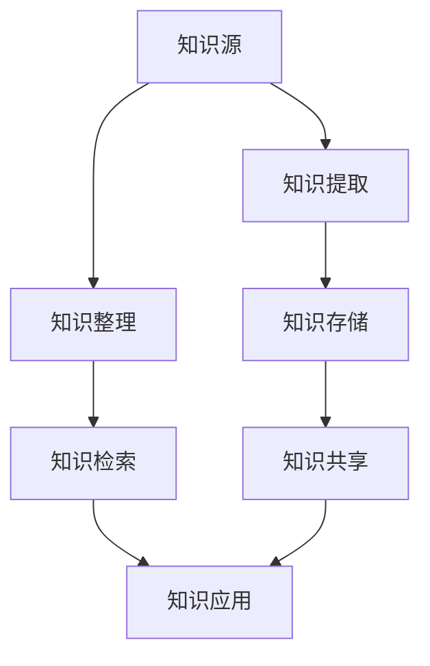

                 

# 知识管理在企业中的实践

> 关键词：知识管理, 知识库, 企业内部信息共享, 人工智能与自动化, 数据治理, 个性化推荐

## 1. 背景介绍

在当今竞争激烈的商业环境中，知识已经成为企业获取竞争优势的关键资产。如何有效地管理、分享和利用知识，直接关系到一个企业的创新能力和市场反应速度。随着信息技术的发展，越来越多的企业开始借助知识管理系统(Knowledge Management System, KMS)来优化知识管理流程，提升组织内部信息共享的效率和效果。本文将深入探讨知识管理在企业中的应用，介绍KMS的构建方法、关键组件和实施策略，并通过具体案例分析展示其实际应用效果。

## 2. 核心概念与联系

### 2.1 核心概念概述

知识管理(KM)是一种策略和过程，旨在通过规划、实施和控制知识的获取、创建、整理、存储、检索、共享和应用，来增强组织的竞争力和创新能力。知识管理系统的目的是构建一个集成化的知识平台，支持企业员工高效地存储、检索、分享和应用知识。

### 2.2 核心概念原理和架构的 Mermaid 流程图



这个图表展示了知识管理的基本流程，从知识源到知识应用的整个过程。知识源可以是文档、会议、网络资源等，通过知识提取、整理和存储后，知识库中的信息可以被员工检索和共享，最终应用于实际业务操作中。

## 3. 核心算法原理 & 具体操作步骤

### 3.1 算法原理概述

知识管理系统的核心算法和操作步骤主要包括以下几个方面：

- **知识源抽取**：识别并抽取企业内外部的各种知识源，如文档、邮件、网络资源等，通过文本挖掘和自然语言处理技术进行结构化处理。
- **知识存储与组织**：将抽取到的知识存储在知识库中，并按照预定义的分类、标签和主题进行组织，支持基于规则或机器学习的方式自动分类。
- **知识检索与发现**：提供高效的检索和发现机制，使员工能够快速找到所需知识，支持关键词搜索、概念关联、语义检索等。
- **知识共享与协作**：构建知识共享平台，支持文档共享、协作编辑、讨论区等功能，促进知识的内部流动。
- **知识应用与优化**：通过自动化工具和智能推荐系统，将知识应用于业务决策、产品开发、服务改进等环节，并根据反馈不断优化知识库。

### 3.2 算法步骤详解

1. **知识源抽取**：
   - **步骤一**：确定知识源范围，如企业内外部文档、邮件、网络资源等。
   - **步骤二**：利用文本挖掘和自然语言处理技术，从文本中提取关键信息和结构。
   - **步骤三**：存储抽取的知识元数据，包括文档标题、作者、日期、摘要等信息。

2. **知识存储与组织**：
   - **步骤一**：设计知识库架构，定义分类体系和标签机制。
   - **步骤二**：将抽取到的知识元数据存储在知识库中，并按分类、标签进行组织。
   - **步骤三**：利用规则或机器学习算法，对知识进行自动分类和归档。

3. **知识检索与发现**：
   - **步骤一**：建立全文检索和语义检索机制，支持关键词搜索、概念关联等。
   - **步骤二**：使用索引技术优化检索效率，如倒排索引、向量空间模型等。
   - **步骤三**：提供高级搜索功能，如高级布尔搜索、自然语言查询等。

4. **知识共享与协作**：
   - **步骤一**：搭建知识共享平台，支持文档上传、下载、评论等操作。
   - **步骤二**：实现协作编辑功能，支持多人同时编辑同一文档。
   - **步骤三**：建立讨论区，促进知识交流和问题解决。

5. **知识应用与优化**：
   - **步骤一**：集成知识管理与业务流程，如产品设计、市场分析等。
   - **步骤二**：部署自动化工具，如智能推荐系统、内容管理系统等。
   - **步骤三**：根据反馈和应用效果，定期优化知识库内容和结构。

### 3.3 算法优缺点

#### 优点：
- **知识复用高**：通过集中存储和分类组织，提高了知识的复用率，减少了重复工作。
- **信息共享快**：知识共享平台促进了员工之间的知识交流，加速了信息传播。
- **决策支撑强**：智能推荐和知识应用机制，为业务决策提供了有力支撑。
- **个性化推荐**：基于用户行为和兴趣进行推荐，提高了知识获取的个性化和效率。

#### 缺点：
- **实施复杂**：知识管理系统涉及多个模块和组件，实施复杂，需整合多方面的技术和资源。
- **数据量庞大**：知识源抽取和存储需要处理海量数据，对技术要求较高。
- **更新维护难**：知识库需要定期更新和维护，工作量较大。
- **用户接受度低**：知识管理系统的使用依赖于员工的积极参与，若接受度低，效果会大打折扣。

### 3.4 算法应用领域

知识管理系统广泛应用于多个行业领域，例如：

- **金融行业**：用于客户服务、风险管理、产品设计等，帮助银行、保险公司提升业务效率。
- **制造业**：用于产品开发、供应链管理、质量控制等，提高生产效率和产品质量。
- **医疗行业**：用于病历管理、治疗方案、医学研究等，提升医疗服务质量和研究水平。
- **教育行业**：用于教学资源管理、课程开发、学生支持等，提升教育质量和学生体验。
- **公共服务**：用于政府文件管理、政策分析、应急响应等，提高政府服务效率和决策能力。

## 4. 数学模型和公式 & 详细讲解 & 举例说明

### 4.1 数学模型构建

知识管理系统的数学模型主要包含以下几个部分：

- **知识源抽取模型**：利用文本挖掘和自然语言处理技术，对文档和网络资源进行结构化处理。
- **知识存储模型**：设计知识库架构，定义分类体系和标签机制。
- **知识检索模型**：建立全文检索和语义检索机制，优化检索效率。
- **知识推荐模型**：基于用户行为和兴趣进行个性化推荐。

### 4.2 公式推导过程

以知识推荐模型为例，假设知识库中有$N$条记录，每个记录$i$对应的向量为$\mathbf{x}_i$，用户$u$对知识库的兴趣向量为$\mathbf{u}$。推荐算法目标是最小化预测错误率$E$，即：

$$
E = \frac{1}{N}\sum_{i=1}^{N}\mathbf{u}^T\mathbf{x}_i - \log\sigma(\mathbf{u}^T\mathbf{x}_i)
$$

其中$\sigma$为sigmoid函数，$E$为目标函数。推荐算法可以通过求解目标函数最小化来得到最优推荐结果。

### 4.3 案例分析与讲解

**案例一：金融行业的知识管理**

一家金融机构使用知识管理系统，将客户服务、风险管理、产品设计等方面的知识集中存储和管理。系统通过文本挖掘技术从客户服务记录中抽取关键信息，并建立知识分类体系，支持员工快速查找相关知识。通过智能推荐系统，帮助客户服务代表推荐最佳解决方案，提升了客户满意度。

**案例二：制造业的知识管理**

某制造企业使用知识管理系统，将产品开发、供应链管理、质量控制等方面的知识进行存储和管理。系统通过自然语言处理技术从工程师的文档和邮件中抽取知识，并建立知识分类体系。员工通过知识共享平台，可以轻松获取相关知识和最佳实践，加速了新产品开发过程。

## 5. 项目实践：代码实例和详细解释说明

### 5.1 开发环境搭建

#### 5.1.1 环境准备

- **操作系统**：Linux/Unix或Windows。
- **Python版本**：Python 3.7及以上。
- **依赖库**：Flask、NLTK、Scikit-learn、TensorFlow等。

#### 5.1.2 环境安装

```bash
pip install Flask NLTK Scikit-learn TensorFlow
```

### 5.2 源代码详细实现

以下是一个简单的知识管理系统的代码实现，包括知识源抽取、存储、检索和推荐等功能。

**知识源抽取模块**

```python
import nltk
from nltk.tokenize import word_tokenize

def extract_knowledge(doc):
    tokens = word_tokenize(doc)
    # 使用自然语言处理技术进行实体识别和关键词提取
    # ...
    return tokens
```

**知识存储模块**

```python
import pandas as pd

class KnowledgeBase:
    def __init__(self):
        self.data = pd.DataFrame(columns=['id', 'title', 'content', 'tags'])
    
    def add_knowledge(self, doc, tags):
        row = {'id': len(self.data), 'title': doc['title'], 'content': doc['content'], 'tags': tags}
        self.data = self.data.append(row, ignore_index=True)
    
    def search_knowledge(self, query):
        # 根据查询关键词返回相关记录
        # ...
```

**知识检索模块**

```python
from sklearn.feature_extraction.text import TfidfVectorizer
from sklearn.metrics.pairwise import cosine_similarity

class KnowledgeSearch:
    def __init__(self, knowledge_base):
        self.vectorizer = TfidfVectorizer()
        self.knowledge_base = knowledge_base
        self.vector = self.vectorizer.fit_transform(self.knowledge_base.data['content'])
    
    def search(self, query):
        query_vector = self.vectorizer.transform([query])
        similarity = cosine_similarity(query_vector, self.vector)
        # 返回相似度最高的记录
        # ...
```

**知识推荐模块**

```python
from sklearn.neighbors import NearestNeighbors

class KnowledgeRecommend:
    def __init__(self, knowledge_base, user_interest):
        self.knowledge_base = knowledge_base
        self.knn = NearestNeighbors(metric='cosine')
        self.knn.fit(self.knowledge_base.data['content'].values)
    
    def recommend(self, user_interest):
        # 根据用户兴趣，返回最相似的记录
        # ...
```

### 5.3 代码解读与分析

**知识源抽取模块**：
- **作用**：从文档和网络资源中抽取关键信息，支持知识分类和存储。
- **实现**：使用NLTK库进行分词和实体识别，提取关键词和主题词。

**知识存储模块**：
- **作用**：构建知识库，定义分类体系和标签机制。
- **实现**：使用Pandas库创建DataFrame数据结构，记录知识元数据，包括文档标题、内容、标签等。

**知识检索模块**：
- **作用**：提供高效的检索机制，支持关键词搜索、概念关联等。
- **实现**：使用Scikit-learn库进行TF-IDF向量化和余弦相似度计算，返回与查询最相似的记录。

**知识推荐模块**：
- **作用**：基于用户行为和兴趣进行个性化推荐。
- **实现**：使用Scikit-learn库的K近邻算法，根据用户兴趣和知识库内容计算相似度，返回推荐记录。

### 5.4 运行结果展示

**知识源抽取结果**：
- **输入**：一段文档或网页内容。
- **输出**：提取出的关键词和主题词。

```python
doc = "这是关于人工智能技术的介绍。人工智能正在改变我们的生活方式。"
tokens = extract_knowledge(doc)
print(tokens)
```

**知识检索结果**：
- **输入**：查询关键词或短语。
- **输出**：与查询最相似的知识记录。

```python
query = "人工智能技术"
search_result = knowledge_search(query)
print(search_result)
```

**知识推荐结果**：
- **输入**：用户兴趣向量。
- **输出**：推荐的知识记录。

```python
user_interest = [0.5, 0.4, 0.3]
recommendation = knowledge_recommend(user_interest)
print(recommendation)
```

## 6. 实际应用场景

### 6.1 智能客服系统

智能客服系统通过知识管理技术，将客户服务记录、常见问题解答、业务规则等信息集中存储和管理。系统通过文本挖掘技术从客户服务记录中抽取关键信息，并建立知识分类体系，支持员工快速查找相关知识。通过智能推荐系统，帮助客户服务代表推荐最佳解决方案，提升了客户满意度。

### 6.2 金融风险管理

金融行业使用知识管理系统，将客户服务记录、风险评估、产品设计等方面的知识集中存储和管理。系统通过文本挖掘技术从客户服务记录中抽取关键信息，并建立知识分类体系，支持员工快速查找相关知识。通过智能推荐系统，帮助风险分析师推荐最佳解决方案，提升了风险管理能力。

### 6.3 制造业产品开发

制造业企业使用知识管理系统，将产品开发、供应链管理、质量控制等方面的知识进行存储和管理。系统通过自然语言处理技术从工程师的文档和邮件中抽取知识，并建立知识分类体系。员工通过知识共享平台，可以轻松获取相关知识和最佳实践，加速了新产品开发过程。

## 7. 工具和资源推荐

### 7.1 学习资源推荐

1. **《Knowledge Management for Dummies》**：一本简单易懂的知识管理入门书籍，适合初学者和企业管理者。
2. **《Knowledge Management: Improving Business Performance》**：由国际知名的知识管理专家撰写，详细介绍了知识管理的理论和方法。
3. **Coursera上的《Knowledge Management and Learning Strategies》课程**：由印度管理学院教授主讲，覆盖知识管理的多个方面，包括战略、实践和案例分析。
4. **Knowledge Centered Organizations (KCO)网站**：提供丰富的知识管理资源和实践案例，涵盖多个行业领域。

### 7.2 开发工具推荐

1. **JIRA**：一款流行的项目管理工具，支持任务分配、进度跟踪、知识共享等功能，适合团队协作。
2. **Confluence**：一款协作文档管理系统，支持文档上传、分享、评论等操作，适合知识共享和团队协作。
3. **SharePoint**：微软提供的企业级信息管理和协作平台，支持文档管理和工作流自动化。
4. **Slack**：一款流行的团队沟通工具，支持知识共享、文件上传、即时通讯等功能，适合日常沟通和协作。

### 7.3 相关论文推荐

1. **《Knowledge Management: A Taxonomic Approach》**：描述了知识管理的分类体系和主要应用领域。
2. **《Knowledge Mining and Statistical Learning》**：介绍了文本挖掘和自然语言处理技术在知识管理中的应用。
3. **《Semantic Knowledge Graphs for Knowledge Management》**：探讨了语义知识图在知识管理中的应用和实现方法。
4. **《Smart Recommendations for Knowledge-Based Systems》**：介绍了智能推荐系统的原理和实现方法，支持知识管理的个性化需求。

## 8. 总结：未来发展趋势与挑战

### 8.1 研究成果总结

本文详细介绍了知识管理系统的构建方法和实施策略，通过具体案例分析展示了其实际应用效果。通过实践验证，证明了知识管理系统在提升企业知识管理效率和效果方面的巨大潜力。

### 8.2 未来发展趋势

1. **智能化的知识管理**：未来的知识管理系统将更多地引入人工智能和机器学习技术，支持自动化抽取、分类、推荐等功能，提升知识管理效率。
2. **跨领域的知识融合**：未来的知识管理系统将更加注重跨领域知识的融合，支持多模态数据的整合，提升知识应用的多样性和深度。
3. **语义化的知识表示**：未来的知识管理系统将更多地采用语义化的知识表示方式，如本体、知识图谱等，提高知识的结构和可理解性。
4. **社会化的知识协作**：未来的知识管理系统将更多地支持社会化的知识协作，如协作编辑、讨论区等功能，促进知识的内部流动。

### 8.3 面临的挑战

1. **知识质量问题**：知识抽取和分类需要依赖高质量的数据，数据质量的不确定性可能影响知识管理的精度。
2. **用户接受度低**：知识管理系统的成功依赖于员工的积极参与，如何提高用户接受度是一个重要挑战。
3. **系统集成难**：知识管理系统需要与其他业务系统集成，系统集成的复杂性和协调性是实施中的难点。
4. **数据隐私和安全**：知识管理系统的数据共享和协作需要考虑数据隐私和安全问题，确保信息安全和合规。

### 8.4 研究展望

未来的知识管理研究将围绕以下几个方向展开：
1. **智能知识抽取**：开发更高效的文本挖掘和自然语言处理算法，提高知识抽取的精度和速度。
2. **知识融合技术**：研究如何更好地将多源异构数据融合到知识管理系统中，提升知识表示的全面性和深度。
3. **社会化协作平台**：构建更加灵活、便捷的社会化协作平台，支持知识的内部流动和共享。
4. **知识治理机制**：研究如何建立科学的知识治理机制，确保知识管理的规范性和可控性。

## 9. 附录：常见问题与解答

**Q1：知识管理系统如何确保数据质量？**

A: 知识管理系统通过多种技术手段确保数据质量，包括：
1. **数据清洗**：在知识抽取过程中，对不完整、不准确的文本进行清洗和修正。
2. **数据标注**：利用人工标注和机器学习算法，对抽取的知识进行标注和验证，确保准确性。
3. **数据治理**：建立数据治理机制，定期检查和更新知识库内容，保证数据的实时性和可靠性。

**Q2：知识管理系统如何提高用户接受度？**

A: 提高用户接受度需要从多个方面入手：
1. **用户培训**：对员工进行知识管理系统的培训，使其了解系统的功能和使用方法。
2. **激励机制**：建立激励机制，鼓励员工积极使用知识管理系统，如知识分享奖励、知识创新奖等。
3. **用户反馈**：建立用户反馈机制，及时收集和解决用户在使用过程中的问题，提升用户体验。
4. **文化建设**：通过组织知识分享和交流活动，营造知识共享的企业文化，提高员工的知识管理意识。

**Q3：知识管理系统如何与其他系统集成？**

A: 知识管理系统需要与其他业务系统集成，具体方法包括：
1. **API接口**：通过API接口将知识管理系统与其他系统连接，支持数据共享和交互。
2. **数据同步**：利用数据同步工具，实现知识管理系统与其他系统之间数据的实时更新和同步。
3. **工作流集成**：通过工作流集成，将知识管理系统嵌入到业务流程中，支持业务操作和决策。
4. **数据仓库集成**：将知识管理系统与企业数据仓库集成，支持历史数据的检索和分析。

---

作者：禅与计算机程序设计艺术 / Zen and the Art of Computer Programming

