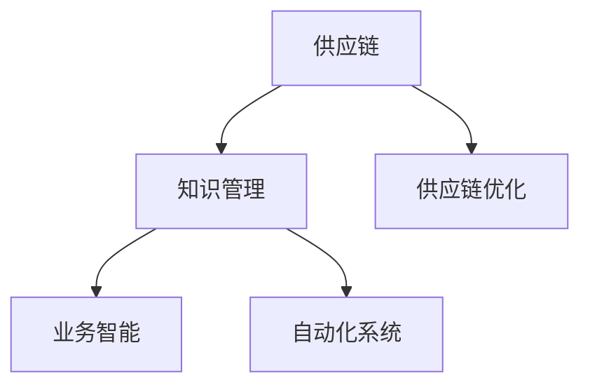

                 

# 知识管理在供应链优化中的角色

## 1. 背景介绍

### 1.1 问题由来

在全球化供应链管理中，企业面临着复杂的市场环境、日益增长的客户需求和严峻的竞争压力。传统供应链管理方式存在信息孤岛、反应迟缓、缺乏灵活性等固有缺陷，难以满足现代商业需求。知识管理作为数字化转型中的关键技术，能够有效整合、共享和管理供应链中的各类信息与知识，从而大幅提升供应链的响应速度和运营效率。

### 1.2 问题核心关键点

知识管理在供应链优化中的核心在于：通过构建知识共享平台，汇聚各方智慧，优化供应链流程，实现业务智能化、自动化。具体来说，可以包括：

- **知识获取**：从内外部的业务活动、市场环境、合作伙伴等渠道收集信息，进行整合与加工。
- **知识共享**：通过知识库、协作平台等工具，实现知识在供应链各环节的传递与交流。
- **知识应用**：利用知识管理技术，指导供应链决策，优化库存、生产、物流等业务流程。

### 1.3 问题研究意义

通过知识管理优化供应链，有助于实现以下目标：

- **提高决策效率**：数据驱动的决策支持，能够缩短决策时间，提升决策准确性。
- **降低运营成本**：优化流程、减少库存、提高物流效率，降低供应链成本。
- **增强竞争力**：快速响应市场变化，提供个性化服务，提升客户满意度。
- **促进创新**：汇聚各方知识，激发创新灵感，加速新产品开发和迭代。

## 2. 核心概念与联系

### 2.1 核心概念概述

为更好地理解知识管理在供应链优化中的应用，本节将介绍几个关键概念：

- **供应链**：指企业间的物料流、信息流、资金流等，包括采购、生产、库存、物流等环节。
- **知识管理**：指对知识资源进行获取、组织、共享、应用的系统化管理过程，目的是实现知识的持续增值。
- **供应链优化**：通过管理流程、技术手段等手段，对供应链各环节进行持续改进和优化，提升整体运营效率。
- **业务智能(BI)**：利用数据分析、机器学习等技术，为业务决策提供支持。
- **自动化系统**：利用机器人、自动驾驶等技术，实现物流、仓储等环节的自动化。

这些概念之间的关系通过以下Mermaid流程图来展示：



这个流程图展示了供应链、知识管理、供应链优化、业务智能和自动化系统之间的逻辑关系：

1. 供应链作为知识管理的对象，包含各环节的信息和知识。
2. 知识管理通过整合供应链中的各类知识，支持供应链优化。
3. 供应链优化通过改进业务流程，提升供应链效率。
4. 业务智能通过数据分析，为供应链优化提供决策支持。
5. 自动化系统通过技术手段，实现供应链环节的自动化。

这些概念共同构成了供应链优化和知识管理的框架，为其应用提供了基础。

## 3. 核心算法原理 & 具体操作步骤
### 3.1 算法原理概述

基于知识管理的供应链优化，本质上是一种跨领域、跨环节的协同优化过程。其核心思想是：通过构建知识共享平台，将供应链各环节的知识进行汇聚、整合和应用，从而实现供应链流程的优化和运营效率的提升。

形式化地，假设供应链系统的初始状态为 $S_0$，通过知识管理优化后，期望达到最优状态 $S^*$。则优化目标可以表示为：

$$
\min_{K} \mathcal{L}(S_0, S^*)
$$

其中，$K$ 表示知识管理过程中所获取、整合和应用的知识资源，$\mathcal{L}$ 为供应链优化损失函数，衡量优化前后的状态差异。

### 3.2 算法步骤详解

基于知识管理的供应链优化一般包括以下几个关键步骤：

**Step 1: 数据集成与知识获取**
- 集成供应链各环节的数据，包括销售订单、库存状态、生产进度、物流信息等。
- 通过数据挖掘、自然语言处理等技术，从海量数据中提取有用信息，并转化为知识形式。

**Step 2: 知识整合与共享**
- 构建知识库，将获取的知识资源进行分类、编码、存储。
- 开发知识共享平台，支持供应链各方进行知识查询、交流、协作。

**Step 3: 知识应用与供应链优化**
- 利用知识库中的信息指导供应链决策，如库存管理、生产调度、物流规划等。
- 通过业务智能(BI)工具，进行数据分析、模型训练，为决策提供支持。

**Step 4: 反馈循环与持续优化**
- 在知识应用过程中，持续收集反馈信息，进行知识更新和修正。
- 利用机器学习算法，对供应链流程进行持续改进和优化。

### 3.3 算法优缺点

基于知识管理的供应链优化方法具有以下优点：

1. **信息集成化**：通过知识管理技术，将供应链各环节的信息和知识进行统一整合，解决了传统供应链中的信息孤岛问题。
2. **决策科学化**：利用业务智能和数据分析，为供应链优化提供数据驱动的决策支持。
3. **流程自动化**：引入自动化技术，提高供应链环节的自动化水平，减少人为干预和错误。
4. **适应性强**：能够快速响应市场变化和客户需求，提升供应链的灵活性和响应速度。

同时，该方法也存在一定的局限性：

1. **技术复杂性**：知识管理涉及数据挖掘、自然语言处理、机器学习等技术，技术门槛较高。
2. **数据质量要求**：供应链优化依赖于数据的高质量和准确性，一旦数据存在问题，优化效果将大打折扣。
3. **人员参与度**：知识管理需要供应链各环节人员的积极参与和配合，否则难以发挥应有的效果。
4. **投资成本高**：知识管理系统和自动化设备的初期投入较大，中小型企业难以承担。

尽管存在这些局限性，但知识管理在供应链优化中的价值已经得到广泛认可，其应用前景广阔。

### 3.4 算法应用领域

知识管理在供应链优化中的应用广泛，包括但不限于以下领域：

- **库存管理**：通过知识库中的历史销售数据和市场需求信息，优化库存水平，减少库存成本。
- **生产调度**：利用知识管理技术，指导生产计划和物料需求，提高生产效率。
- **物流优化**：通过共享物流信息，优化物流路径和运输方式，降低物流成本。
- **客户服务**：利用知识管理平台，提供个性化服务，提升客户满意度。
- **供应链风险管理**：通过分析供应链风险信息，制定应急预案，降低风险损失。

## 4. 数学模型和公式 & 详细讲解  
### 4.1 数学模型构建

在供应链优化问题中，可以通过构建数学模型来描述优化目标和约束条件。以下是一个简单的供应链优化数学模型：

假设供应链包括 $n$ 个环节，每个环节的库存成本、生产成本、运输成本等可用如下公式表示：

$$
\begin{aligned}
\text{库存成本} &= c_{inv} x_i \\
\text{生产成本} &= c_{pro} p_i \\
\text{运输成本} &= c_{trn} q_i \\
\end{aligned}
$$

其中，$x_i$ 表示第 $i$ 个环节的库存水平，$p_i$ 表示第 $i$ 个环节的生产量，$q_i$ 表示第 $i$ 个环节的运输量。

优化目标为最小化总成本：

$$
\min_{x_i, p_i, q_i} \sum_{i=1}^n (c_{inv} x_i + c_{pro} p_i + c_{trn} q_i)
$$

约束条件包括：

- 库存水平约束：$x_i \geq 0$，$x_i \leq S_i$，其中 $S_i$ 为第 $i$ 个环节的最大库存水平。
- 生产量约束：$p_i \geq 0$，$p_i \leq C_i$，其中 $C_i$ 为第 $i$ 个环节的最大生产能力。
- 运输量约束：$q_i \geq 0$，$q_i \leq L_i$，其中 $L_i$ 为第 $i$ 个环节的最大运输量。
- 需求满足约束：$\sum_{i=1}^n p_i = D$，其中 $D$ 为市场需求量。

通过构建上述数学模型，可以清晰地描述供应链优化问题，并通过求解模型，得到最优的供应链决策。

### 4.2 公式推导过程

假设需求 $D$ 已知，需求满足约束可以转化为：

$$
\sum_{i=1}^n p_i = D
$$

该方程可以视为线性方程，直接求解即可。优化目标函数为：

$$
\min_{x_i, p_i, q_i} \sum_{i=1}^n (c_{inv} x_i + c_{pro} p_i + c_{trn} q_i)
$$

约束条件可以表示为线性不等式组：

$$
\begin{aligned}
x_i &\geq 0 \\
x_i &\leq S_i \\
p_i &\geq 0 \\
p_i &\leq C_i \\
q_i &\geq 0 \\
q_i &\leq L_i \\
\end{aligned}
$$

利用线性规划求解器，如CPLEX、Gurobi等，可以求解上述优化问题，得到最优的供应链决策。

### 4.3 案例分析与讲解

以一家制造企业为例，假设其供应链包括采购、生产、库存和销售四个环节。企业希望通过优化供应链，降低成本，提高效率。

**Step 1: 数据集成与知识获取**
- 集成采购订单、库存状态、生产进度、销售订单等数据。
- 通过数据挖掘，提取供应商信息、产品特性、市场需求等知识。

**Step 2: 知识整合与共享**
- 构建知识库，对供应商信息、产品特性、市场需求等进行编码和存储。
- 开发知识共享平台，支持采购、生产、库存和销售各环节人员进行知识查询和交流。

**Step 3: 知识应用与供应链优化**
- 利用知识库中的供应商信息，优化采购策略，降低采购成本。
- 利用产品特性和市场需求信息，优化生产计划，提高生产效率。
- 利用库存信息，优化库存水平，减少库存成本。
- 利用物流信息，优化运输路径和运输方式，降低物流成本。

**Step 4: 反馈循环与持续优化**
- 在供应链优化过程中，持续收集反馈信息，进行知识更新和修正。
- 利用机器学习算法，对供应链流程进行持续改进和优化。

通过上述步骤，企业可以显著提升供应链的运营效率，降低成本，提升竞争力。

## 5. 项目实践：代码实例和详细解释说明
### 5.1 开发环境搭建

在进行供应链优化项目开发前，需要准备好开发环境。以下是使用Python进行PuLP开发的环境配置流程：

1. 安装Anaconda：从官网下载并安装Anaconda，用于创建独立的Python环境。

2. 创建并激活虚拟环境：
```bash
conda create -n supply-chain python=3.8 
conda activate supply-chain
```

3. 安装PuLP：
```bash
pip install pulp
```

4. 安装各类工具包：
```bash
pip install numpy pandas scikit-learn matplotlib tqdm jupyter notebook ipython
```

完成上述步骤后，即可在`supply-chain`环境中开始项目实践。

### 5.2 源代码详细实现

下面我们以库存管理为例，给出使用PuLP进行供应链优化的PyTorch代码实现。

首先，定义优化问题的目标函数和约束条件：

```python
from pulp import LpProblem, LpVariable, LpMinimize, lpSum, Value

# 定义变量
x = LpVariable('x', lowBound=0, upperBound=S_i, cat='Continuous')
p = LpVariable('p', lowBound=0, upperBound=C_i, cat='Continuous')
q = LpVariable('q', lowBound=0, upperBound=L_i, cat='Continuous')

# 定义成本函数
cost_function = LpMinimize(cost_sum, x, p, q)

# 定义库存约束
inventory_constraint = x >= 0
inventory_constraint += x <= S_i

# 定义生产约束
production_constraint = p >= 0
production_constraint += p <= C_i

# 定义运输约束
transportation_constraint = q >= 0
transportation_constraint += q <= L_i

# 定义需求约束
demand_constraint = p == D

# 创建优化问题
problem = LpProblem('Supply Chain Optimization', sense=LpMinimize)
problem += cost_function
problem += inventory_constraint
problem += production_constraint
problem += transportation_constraint
problem += demand_constraint

# 解决优化问题
problem.solve()

# 输出最优解
print('Total Cost:', Value(cost_function))
print('Inventory:', Value(x))
print('Production:', Value(p))
print('Transportation:', Value(q))
```

然后，根据求解结果进行供应链优化：

```python
# 根据求解结果优化库存水平、生产量和运输量
inventory_opt = inventory_constraint.primal
production_opt = production_constraint.primal
transportation_opt = transportation_constraint.primal

# 更新库存水平、生产量和运输量
for i in range(n):
    if inventory_opt[i] == 1:
        x[i] = S_i
    else:
        x[i] = 0

    if production_opt[i] == 1:
        p[i] = C_i
    else:
        p[i] = 0

    if transportation_opt[i] == 1:
        q[i] = L_i
    else:
        q[i] = 0

# 重新计算总成本
cost_function = LpMinimize(cost_sum, x, p, q)
problem += cost_function
problem.solve()

# 输出最终最优解
print('Total Cost:', Value(cost_function))
print('Inventory:', Value(x))
print('Production:', Value(p))
print('Transportation:', Value(q))
```

以上就是使用PuLP进行供应链优化的完整代码实现。可以看到，PuLP提供了丰富的API接口，可以轻松构建和解决线性优化问题。

### 5.3 代码解读与分析

让我们再详细解读一下关键代码的实现细节：

**LpProblem类**：
- 用于创建和求解优化问题，支持添加目标函数和约束条件。

**LpVariable类**：
- 表示优化问题中的变量，支持设置上下界、类型等属性。

**LpMinimize类**：
- 表示优化问题的目标函数，可以是线性或二次函数。

**LpSum类**：
- 用于表示目标函数的线性组合，支持添加变量和系数。

**Constraint类**：
- 表示优化问题中的约束条件，支持设置变量、上下界等属性。

**Problem.solve()方法**：
- 用于求解优化问题，返回求解状态和最优解。

通过上述步骤，我们可以轻松构建和求解线性优化问题，实现供应链的优化。

## 6. 实际应用场景
### 6.1 智能仓储管理

智能仓储管理是知识管理在供应链优化中的典型应用场景。通过构建知识共享平台，汇聚仓储信息、物流信息、供应商信息等，实现仓储和物流的智能化管理。

具体而言，可以构建知识库，将供应商信息、产品特性、仓储状态等知识进行编码和存储。通过知识共享平台，仓储人员可以实时查询库存、物流等信息，优化仓储和物流流程。同时，利用机器学习算法，根据历史数据和实时信息，预测库存需求、优化仓库布局，实现库存和物流的智能调度。

### 6.2 供应链风险管理

供应链风险管理是知识管理在供应链优化中的另一重要应用。通过构建知识共享平台，汇聚供应链各环节的风险信息，进行风险评估和预警。

具体而言，可以构建知识库，将供应链各环节的风险信息进行编码和存储。通过知识共享平台，风险管理部门可以实时查询风险信息，评估风险水平，制定应急预案。同时，利用机器学习算法，分析风险因素，预测风险趋势，提高供应链的鲁棒性和抗风险能力。

### 6.3 供应链决策支持

供应链决策支持是知识管理在供应链优化中的核心应用。通过构建知识共享平台，汇聚供应链各环节的信息和知识，实现数据驱动的决策支持。

具体而言，可以构建知识库，将供应链各环节的数据和知识进行编码和存储。通过知识共享平台，供应链各环节的人员可以实时查询数据和知识，支持决策。同时，利用业务智能(BI)工具，进行数据分析、模型训练，为决策提供支持。

## 7. 工具和资源推荐
### 7.1 学习资源推荐

为了帮助开发者系统掌握供应链优化和知识管理的理论基础和实践技巧，这里推荐一些优质的学习资源：

1. 《供应链管理：理论与实践》系列书籍：由供应链管理领域的权威专家撰写，涵盖供应链优化、风险管理、决策支持等核心内容。

2. 《知识管理与组织创新》课程：斯坦福大学开设的知识管理课程，详细讲解知识管理的原理、工具和实践。

3. 《供应链优化与决策支持》书籍：全面介绍供应链优化和决策支持的理论和技术，涵盖线性规划、业务智能等核心内容。

4. Weights & Biases：模型训练的实验跟踪工具，可以记录和可视化模型训练过程中的各项指标，方便对比和调优。

5. Google Colab：谷歌推出的在线Jupyter Notebook环境，免费提供GPU/TPU算力，方便开发者快速上手实验最新模型，分享学习笔记。

通过对这些资源的学习实践，相信你一定能够快速掌握供应链优化和知识管理的精髓，并用于解决实际的供应链问题。

### 7.2 开发工具推荐

高效的开发离不开优秀的工具支持。以下是几款用于供应链优化和知识管理的常用工具：

1. PuLP：Python库，支持线性规划、整数规划等优化算法，适用于构建和求解优化问题。

2. CPLEX：IBM开发的优化求解器，支持线性规划、整数规划、混合整数规划等优化算法。

3. Gurobi：Simion Software开发的优化求解器，支持线性规划、整数规划、混合整数规划等优化算法。

4. Tableau：商业智能工具，支持数据可视化、报表生成等功能，便于供应链决策支持。

5. Power BI：微软开发的商业智能工具，支持数据可视化、报表生成等功能，便于供应链决策支持。

6. Jupyter Notebook：开源的交互式编程环境，支持Python、R等多种编程语言，方便供应链优化项目开发。

合理利用这些工具，可以显著提升供应链优化和知识管理的开发效率，加快创新迭代的步伐。

### 7.3 相关论文推荐

供应链优化和知识管理的发展源于学界的持续研究。以下是几篇奠基性的相关论文，推荐阅读：

1. "A Survey of Supply Chain Management: From the Past to the Future"：综述供应链管理的核心概念和前沿研究方向。

2. "Knowledge Management and Organizational Innovation"：介绍知识管理的基本原理和实践方法。

3. "Supply Chain Optimization with Data Mining"：探讨数据挖掘在供应链优化中的应用。

4. "Decision Support Systems in Supply Chain Management"：讨论业务智能在供应链管理中的应用。

5. "A Survey on Data Integration and Its Challenges"：综述数据整合的现状和挑战。

这些论文代表了大语言模型微调技术的发展脉络。通过学习这些前沿成果，可以帮助研究者把握学科前进方向，激发更多的创新灵感。

## 8. 总结：未来发展趋势与挑战

### 8.1 总结

本文对基于知识管理的供应链优化方法进行了全面系统的介绍。首先阐述了知识管理在供应链优化中的研究背景和意义，明确了知识管理在供应链各环节中发挥的关键作用。其次，从原理到实践，详细讲解了知识管理的数学模型和算法步骤，给出了知识管理任务开发的完整代码实例。同时，本文还广泛探讨了知识管理在智能仓储、供应链风险管理、供应链决策支持等多个领域的应用前景，展示了知识管理范式的巨大潜力。此外，本文精选了知识管理的各类学习资源，力求为读者提供全方位的技术指引。

通过本文的系统梳理，可以看到，知识管理在供应链优化中具有广泛的应用价值，能够显著提升供应链的运营效率和决策支持水平。未来，随着知识管理技术的不断进步，其应用场景将进一步拓展，为供应链优化带来更多创新突破。

### 8.2 未来发展趋势

展望未来，知识管理在供应链优化中的应用将呈现以下几个发展趋势：

1. **技术智能化**：引入更多人工智能技术，如自然语言处理、机器学习等，实现供应链信息的智能化处理和分析。

2. **数据实时化**：构建实时数据收集和处理系统，实现供应链信息的实时更新和动态优化。

3. **系统集成化**：将知识管理与其他供应链管理系统（如ERP、CRM等）集成，形成完整的供应链信息平台。

4. **决策智能化**：利用数据挖掘和业务智能技术，为供应链决策提供更加科学和准确的依据。

5. **协同优化**：利用区块链、物联网等技术，实现供应链各环节的协同优化，提升整体运营效率。

6. **供应链可视化**：通过可视化工具，展示供应链各环节的运行状态和关键指标，帮助管理层进行决策。

这些趋势将推动知识管理在供应链优化中实现更深层次的智能化和自动化，带来更高的运营效率和决策质量。

### 8.3 面临的挑战

尽管知识管理在供应链优化中的价值已经得到广泛认可，但在实现过程中，仍面临诸多挑战：

1. **技术复杂性**：知识管理涉及数据挖掘、自然语言处理、机器学习等技术，技术门槛较高，需要跨学科的专家团队合作。

2. **数据质量问题**：供应链数据存在不完整、不准确、不一致等问题，需要建立严格的数据治理机制。

3. **组织变革**：知识管理需要供应链各环节的积极配合，需要推动组织变革，打破部门壁垒，实现信息共享。

4. **成本投入**：知识管理系统的建设和维护需要较高的成本投入，尤其是中小型企业难以承担。

5. **隐私保护**：供应链数据涉及敏感信息，需要建立数据隐私保护机制，确保数据安全。

6. **技术迭代**：供应链环境不断变化，知识管理系统需要不断更新迭代，以适应新的技术趋势和业务需求。

这些挑战需要企业和研究者共同面对，通过不断创新和优化，克服技术难题，推动知识管理在供应链优化中的深入应用。

### 8.4 研究展望

面对知识管理在供应链优化中的挑战，未来的研究需要在以下几个方面寻求新的突破：

1. **数据治理**：建立数据质量管理体系，提高数据完整性和一致性，确保数据治理的有效性。

2. **知识融合**：将知识管理与其他人工智能技术进行融合，提高知识管理系统的智能化水平。

3. **系统集成**：构建完整的供应链信息平台，实现供应链各环节的集成和协同。

4. **隐私保护**：建立数据隐私保护机制，确保供应链数据的安全和合规。

5. **技术迭代**：持续关注供应链环境的变化，推动知识管理系统的更新迭代。

通过这些研究方向的探索，相信知识管理在供应链优化中将发挥更大的作用，推动供应链管理向更高效、更智能的方向发展。

## 9. 附录：常见问题与解答

**Q1：知识管理在供应链优化中主要解决哪些问题？**

A: 知识管理在供应链优化中主要解决以下问题：

- **信息孤岛**：通过知识共享平台，解决供应链各环节的信息孤岛问题，实现信息集成化。
- **决策效率低**：通过业务智能和数据分析，支持供应链决策，提高决策效率和准确性。
- **流程复杂**：通过优化供应链流程，减少人为干预和错误，提升运营效率。
- **资源浪费**：通过知识共享和协同优化，减少资源浪费，降低成本。

**Q2：如何构建供应链知识共享平台？**

A: 构建供应链知识共享平台，需要以下几个步骤：

- **需求分析**：明确供应链各环节的知识需求，如库存信息、供应商信息、产品特性等。
- **系统设计**：设计知识共享平台的功能模块，如知识库、查询、协作等。
- **数据整合**：将供应链各环节的数据进行整合，形成统一的知识资源库。
- **系统实现**：使用开发工具（如Python、Java等）实现知识共享平台的各项功能。
- **测试部署**：进行系统测试，确保平台稳定性和可用性，并进行部署。

**Q3：如何利用知识管理技术进行供应链优化？**

A: 利用知识管理技术进行供应链优化，主要包括以下步骤：

- **数据集成与知识获取**：集成供应链各环节的数据，通过数据挖掘和自然语言处理，获取有用信息，转化为知识形式。
- **知识整合与共享**：构建知识库，对知识进行编码和存储，开发知识共享平台，支持各环节人员进行知识查询和交流。
- **知识应用与供应链优化**：利用知识库中的信息，指导供应链决策，优化库存、生产、物流等业务流程。
- **反馈循环与持续优化**：持续收集反馈信息，进行知识更新和修正，利用机器学习算法，对供应链流程进行持续改进和优化。

通过这些步骤，可以显著提升供应链的运营效率，降低成本，提高竞争力。

**Q4：如何处理供应链数据质量问题？**

A: 处理供应链数据质量问题，需要以下几个步骤：

- **数据清洗**：对数据进行清洗和预处理，去除重复、错误、缺失等数据。
- **数据标准化**：制定数据标准，规范供应链各环节的数据格式和内容。
- **数据治理**：建立数据治理机制，确保数据完整性、一致性和安全性。
- **数据监控**：持续监控数据质量，及时发现和纠正数据问题。

通过这些措施，可以有效提升供应链数据的可靠性和可用性，为知识管理提供坚实的数据基础。

---

作者：禅与计算机程序设计艺术 / Zen and the Art of Computer Programming

