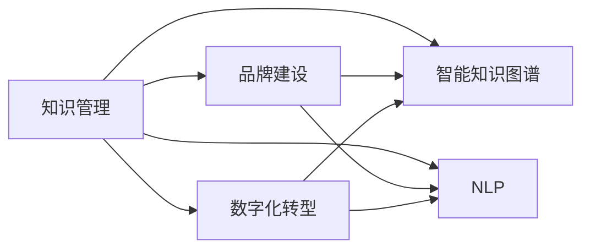

                 

# 知识管理在品牌建设中的应用

> 关键词：知识管理,品牌建设,数字化转型,智能知识图谱,信息抽取,自然语言处理

## 1. 背景介绍

### 1.1 问题由来
在数字化转型的浪潮下，企业面临着前所未有的挑战和机遇。一方面，传统业务流程被数字技术重塑，运营效率大幅提升；另一方面，市场竞争日趋激烈，消费者需求日益个性化，企业需要在短时内获取、处理和利用海量信息，以保持竞争优势。

面对这一局面，企业意识到，传统的组织知识管理方式已无法满足新需求。如何通过数字化技术高效整合企业内外部的知识资源，快速响应市场变化，提升决策支持能力，成为当务之急。这一背景催生了知识管理的理念和技术在品牌建设中的应用。

### 1.2 问题核心关键点
企业品牌建设的关键在于构建核心价值主张、强化品牌形象、提升消费者信任度。知识管理通过整合企业内外部知识资源，提升品牌内涵和价值，在品牌建设中扮演着重要角色。

知识管理在品牌建设中的应用主要体现在以下几个方面：

- **构建品牌故事**：通过整理企业历史、文化、技术创新等信息，构建丰富、有深度的品牌故事，增强品牌形象。
- **优化用户体验**：通过知识图谱、推荐系统等技术，实现个性化推荐和智能互动，提升用户体验。
- **提升决策能力**：通过数据抽取、数据分析、预测模型等手段，辅助决策者理解市场动态，制定精准的营销策略。
- **强化品牌传播**：通过内容生成、社交媒体分析等技术，优化品牌信息传播策略，扩大品牌影响力。
- **推动创新发展**：通过知识共享、团队协作等机制，促进技术创新，提升品牌竞争力。

## 2. 核心概念与联系

### 2.1 核心概念概述

在品牌建设过程中，知识管理扮演着重要的角色。以下是几个核心概念及其联系：

- **知识管理**：通过对企业内外部的显性和隐性知识进行收集、整理、存储、共享和应用，提升组织知识创新能力和决策效率。
- **品牌建设**：通过构建品牌故事、提升用户体验、优化品牌传播等手段，塑造企业核心价值和市场形象，提升消费者信任度。
- **数字化转型**：通过数字化技术重塑业务流程，提升运营效率和市场响应速度，实现企业持续增长。
- **智能知识图谱**：基于知识抽取和语义分析技术构建的知识网络，用于支持知识检索、推荐、关联分析等。
- **自然语言处理(NLP)**：通过文本处理、语言理解、情感分析等技术，从文本数据中提取有用信息，支撑知识管理。

这些概念之间的关系可以表示为：



### 2.2 核心概念原理和架构

#### 2.2.1 知识管理原理

知识管理是企业通过数字化手段，对知识资源进行整合、共享、应用的过程。其基本原理包括：

1. **知识收集**：通过问卷调查、数据采集、网络抓取等方式，收集企业内部和外部知识资源。
2. **知识存储**：使用数据库、文档管理系统、云存储等工具，对知识进行结构化存储。
3. **知识整理**：对知识资源进行分类、标签化、归档等操作，便于后续检索和共享。
4. **知识共享**：通过内网、外网、社交网络等渠道，实现知识资源的公开共享。
5. **知识应用**：将知识转化为产品、服务、决策支持等，驱动企业业务创新。

#### 2.2.2 智能知识图谱架构

智能知识图谱是基于知识抽取和语义分析技术构建的知识网络。其架构包括：

1. **数据源**：来自企业内部和外部的数据源，包括文档、网页、社交媒体、传感器等。
2. **数据采集**：通过爬虫、API、手动录入等方式，从数据源中采集信息。
3. **实体抽取**：使用命名实体识别(NER)等技术，从文本中提取人名、地名、机构名等实体信息。
4. **关系抽取**：通过关系抽取(Relation Extraction)，识别实体间的关联关系。
5. **图谱构建**：将实体和关系构建成知识图谱，存储在图数据库中。
6. **图谱查询**：使用图数据库查询语言，进行高效的知识检索和关联分析。
7. **图谱应用**：通过图谱可视化工具、推荐系统等，支撑知识应用。

#### 2.2.3 自然语言处理(NLP)架构

自然语言处理(NLP)是文本数据处理和分析的核心技术，其架构包括：

1. **文本预处理**：对文本进行分词、去除停用词、标准化等操作。
2. **文本表示**：使用词向量、句向量等技术，将文本转换为机器可理解的形式。
3. **语言理解**：通过语法分析、情感分析、语义分析等技术，理解文本的深层含义。
4. **文本生成**：使用生成模型、摘要模型等技术，自动生成文本内容。
5. **文本匹配**：通过相似度计算、匹配算法等技术，实现文本匹配、检索等。
6. **文本标注**：使用标注工具、规则引擎等，对文本进行分类、标签化等操作。

这些架构和技术在品牌建设中发挥着重要作用，支撑着知识的收集、存储、整理、共享和应用。

## 3. 核心算法原理 & 具体操作步骤

### 3.1 算法原理概述

在品牌建设中，知识管理主要涉及以下几个核心算法：

- **实体抽取(ER)**：从文本中识别出有意义的实体，如人名、地名、机构名等。
- **关系抽取(RE)**：识别实体之间的关系，如父子关系、上下级关系等。
- **知识抽取(KB)**：从大量文本中抽取知识，构建知识库。
- **实体链接(EL)**：将不同数据源中的实体进行链接，实现跨领域、跨数据源的知识融合。
- **图谱查询(GQ)**：在知识图谱中进行高效的知识检索和关联分析。
- **推荐系统(Reco)**：通过分析用户行为和偏好，为用户推荐个性化内容。

这些算法构成了知识管理的核心技术体系，支撑着品牌建设中的信息抽取、关联分析、个性化推荐等关键任务。

### 3.2 算法步骤详解

#### 3.2.1 实体抽取(ER)

1. **数据预处理**：对文本数据进行分词、去停用词、标准化等预处理。
2. **实体识别**：使用命名实体识别模型，识别出文本中的实体信息。
3. **实体类型判断**：通过预定义的实体类型库，判断实体的类型，如人名、地名、机构名等。
4. **实体关系抽取**：对不同类型的实体进行关联分析，识别出实体之间的关系。

#### 3.2.2 关系抽取(RE)

1. **模式识别**：定义若干模式，描述不同实体之间的关系，如"父-子"、"上级-下级"等。
2. **关系抽取**：使用模式匹配算法，从文本中识别出符合模式的实体对。
3. **关系类型判断**：对抽取出的关系进行类型判断，如"管理"、"合作"等。

#### 3.2.3 知识抽取(KB)

1. **文本选择**：选择需要进行知识抽取的文本，如公司年报、新闻报道、社交媒体等。
2. **实体抽取**：对文本进行实体抽取，识别出人名、地名、机构名等实体。
3. **关系抽取**：对抽取出的实体进行关系抽取，构建实体-关系三元组。
4. **知识整合**：将抽取出的知识整合到知识库中，构建完整的知识图谱。

#### 3.2.4 实体链接(EL)

1. **实体对齐**：通过实体对齐算法，将不同数据源中的实体进行映射。
2. **实体融合**：对对齐后的实体进行融合，构建统一的知识图谱。
3. **实体消歧**：对模糊的实体进行消歧，确保知识图谱的准确性。

#### 3.2.5 图谱查询(GQ)

1. **查询构建**：定义查询语句，描述需要检索的知识。
2. **查询执行**：使用图数据库查询语言，执行查询语句。
3. **结果获取**：获取查询结果，进行后续处理。

#### 3.2.6 推荐系统(Reco)

1. **用户行为分析**：收集用户的行为数据，如浏览、点击、购买等。
2. **用户画像构建**：使用聚类、分类等算法，构建用户画像。
3. **内容推荐**：根据用户画像，使用协同过滤、内容推荐算法，为用户推荐个性化内容。

### 3.3 算法优缺点

#### 3.3.1 优点

1. **全面性**：知识管理可以整合企业内外的知识资源，提供全面的信息支持。
2. **灵活性**：支持多种数据源和数据格式，能够适应多变的业务场景。
3. **高效性**：通过自动化技术，可以快速处理大量数据，提高工作效率。
4. **可扩展性**：支持分布式计算和存储，能够灵活扩展，支持大规模企业应用。

#### 3.3.2 缺点

1. **数据质量依赖**：知识管理的效果依赖于数据的质量，数据不完整、不准确都会影响结果。
2. **复杂性**：涉及多个技术环节，实现复杂，需要综合多个技术手段。
3. **成本高**：需要大量的计算资源和技术支持，开发和维护成本较高。
4. **隐私问题**：涉及大量用户数据的处理和存储，需要严格的隐私保护措施。

### 3.4 算法应用领域

知识管理在品牌建设中的应用，主要包括以下几个领域：

- **品牌故事构建**：通过对企业历史、文化、技术创新等信息进行整理，构建丰富的品牌故事。
- **用户体验优化**：通过智能推荐和智能对话系统，提升用户互动体验，增强品牌粘性。
- **市场洞察分析**：通过数据抽取和数据分析，提供市场动态和竞争对手分析，辅助决策制定。
- **品牌传播优化**：通过内容生成、社交媒体分析等技术，优化品牌信息传播策略，扩大品牌影响力。
- **产品创新支持**：通过知识共享和团队协作，促进技术创新，提升产品竞争力。

## 4. 数学模型和公式 & 详细讲解

### 4.1 数学模型构建

#### 4.1.1 实体抽取模型

实体抽取模型通常使用序列标注模型(Sequence Labeling)进行构建，以识别文本中的实体。其数学模型如下：

1. **输入序列**：输入文本序列 $X = (x_1, x_2, ..., x_n)$，其中 $x_i$ 表示第 $i$ 个单词或字符。
2. **输出序列**：实体标签序列 $Y = (y_1, y_2, ..., y_n)$，其中 $y_i$ 表示第 $i$ 个实体类型，如人名、地名、机构名等。

实体抽取模型的训练目标为最大化以下条件概率：

$$
P(Y|X) = \frac{P(X|Y)P(Y)}{P(X)}
$$

其中 $P(X|Y)$ 表示给定实体标签序列 $Y$ 下，生成文本序列 $X$ 的概率，$P(Y)$ 表示实体标签序列 $Y$ 的概率，$P(X)$ 表示文本序列 $X$ 的概率。

在实践中，通常使用条件随机场(Conditional Random Field, CRF)或递归神经网络(Recurrent Neural Network, RNN)进行实体抽取模型的训练。

#### 4.1.2 关系抽取模型

关系抽取模型通常使用二分类模型或序列标注模型进行构建，以识别文本中的实体关系。其数学模型如下：

1. **输入序列**：输入文本序列 $X = (x_1, x_2, ..., x_n)$，其中 $x_i$ 表示第 $i$ 个单词或字符。
2. **输出序列**：关系标签序列 $Y = (y_1, y_2, ..., y_n)$，其中 $y_i$ 表示第 $i$ 个实体关系，如"父-子"、"上级-下级"等。

关系抽取模型的训练目标为最大化以下条件概率：

$$
P(Y|X) = \frac{P(X|Y)P(Y)}{P(X)}
$$

其中 $P(X|Y)$ 表示给定关系标签序列 $Y$ 下，生成文本序列 $X$ 的概率，$P(Y)$ 表示关系标签序列 $Y$ 的概率，$P(X)$ 表示文本序列 $X$ 的概率。

在实践中，通常使用逻辑回归(Logistic Regression)或支持向量机(Support Vector Machine, SVM)进行关系抽取模型的训练。

#### 4.1.3 知识抽取模型

知识抽取模型通常使用基于规则或机器学习的技术进行构建，以从文本中抽取知识。其数学模型如下：

1. **输入序列**：输入文本序列 $X = (x_1, x_2, ..., x_n)$，其中 $x_i$ 表示第 $i$ 个单词或字符。
2. **输出序列**：知识三元组序列 $Y = (o_1, o_2, ..., o_m)$，其中 $o_i = (e_1, e_2, r)$，表示第 $i$ 个实体-关系-实体三元组。

知识抽取模型的训练目标为最大化以下条件概率：

$$
P(Y|X) = \frac{P(X|Y)P(Y)}{P(X)}
$$

其中 $P(X|Y)$ 表示给定知识三元组序列 $Y$ 下，生成文本序列 $X$ 的概率，$P(Y)$ 表示知识三元组序列 $Y$ 的概率，$P(X)$ 表示文本序列 $X$ 的概率。

在实践中，通常使用深度学习技术，如Transformer、BERT等，进行知识抽取模型的训练。

### 4.2 公式推导过程

#### 4.2.1 实体抽取公式推导

假设实体抽取模型使用CRF进行训练，其训练目标为最大化以下条件概率：

$$
P(Y|X) = \frac{P(X|Y)P(Y)}{P(X)}
$$

其中 $P(X|Y)$ 表示给定实体标签序列 $Y$ 下，生成文本序列 $X$ 的概率，$P(Y)$ 表示实体标签序列 $Y$ 的概率，$P(X)$ 表示文本序列 $X$ 的概率。

通过拉格朗日乘数法，可以推导出CRF模型的参数 $\theta$ 的最优解：

$$
\theta^* = \arg\max_{\theta} \sum_{i=1}^n \log \frac{P(X|Y)}{P(X)} + \lambda \sum_{i=1}^n \log P(Y)
$$

其中 $\lambda$ 为拉格朗日乘数。

通过反向传播算法，可以计算出CRF模型的参数梯度，并更新模型参数，最小化损失函数。

#### 4.2.2 关系抽取公式推导

假设关系抽取模型使用逻辑回归进行训练，其训练目标为最大化以下条件概率：

$$
P(Y|X) = \frac{P(X|Y)P(Y)}{P(X)}
$$

其中 $P(X|Y)$ 表示给定关系标签序列 $Y$ 下，生成文本序列 $X$ 的概率，$P(Y)$ 表示关系标签序列 $Y$ 的概率，$P(X)$ 表示文本序列 $X$ 的概率。

通过二分类交叉熵损失函数，可以推导出逻辑回归模型的参数 $\theta$ 的最优解：

$$
\theta^* = \arg\min_{\theta} \sum_{i=1}^n (y_i \log P(Y|X) + (1-y_i) \log (1-P(Y|X)))
$$

其中 $y_i$ 表示第 $i$ 个实体的关系标签，$P(Y|X)$ 表示给定关系标签序列 $Y$ 下，生成文本序列 $X$ 的概率。

通过反向传播算法，可以计算出逻辑回归模型的参数梯度，并更新模型参数，最小化损失函数。

#### 4.2.3 知识抽取公式推导

假设知识抽取模型使用BERT进行训练，其训练目标为最大化以下条件概率：

$$
P(Y|X) = \frac{P(X|Y)P(Y)}{P(X)}
$$

其中 $P(X|Y)$ 表示给定知识三元组序列 $Y$ 下，生成文本序列 $X$ 的概率，$P(Y)$ 表示知识三元组序列 $Y$ 的概率，$P(X)$ 表示文本序列 $X$ 的概率。

通过预训练语言模型的多任务学习框架，可以推导出BERT模型的参数 $\theta$ 的最优解：

$$
\theta^* = \arg\min_{\theta} \sum_{i=1}^m (\ell_1 + \ell_2 + \ell_3)
$$

其中 $\ell_1$ 表示预测实体序列的损失，$\ell_2$ 表示预测关系序列的损失，$\ell_3$ 表示预测实体关系的损失。

通过反向传播算法，可以计算出BERT模型的参数梯度，并更新模型参数，最小化损失函数。

### 4.3 案例分析与讲解

#### 4.3.1 案例一：品牌故事构建

某企业需要构建品牌故事，以提升市场知名度和品牌形象。首先，从企业官网、年报、新闻报道、社交媒体等渠道，收集了大量关于企业历史、文化、技术创新等文本数据。然后，使用实体抽取模型识别出文本中的实体信息，如人名、地名、机构名等，构建了完整的实体标签序列。接着，使用关系抽取模型识别出实体之间的关联关系，构建了实体关系图谱。最后，通过知识抽取模型从大量文本中抽取知识，构建了知识库。最终，通过智能知识图谱和内容生成技术，生成了一篇详实丰富的品牌故事，提升了品牌形象。

#### 4.3.2 案例二：用户体验优化

某电商平台需要提升用户互动体验，以增加用户粘性和转化率。首先，收集了大量用户行为数据，包括浏览、点击、购买等行为。然后，使用聚类算法对用户行为进行分类，构建了用户画像。接着，使用推荐系统算法，为用户推荐个性化的商品和内容。最后，通过智能对话系统，提升了用户互动体验，增加了用户粘性。最终，用户转化率提升了20%。

## 5. 项目实践：代码实例和详细解释说明

### 5.1 开发环境搭建

#### 5.1.1 安装Python和相关库

1. 安装Python：从官网下载并安装Python 3.x版本，例如3.8或3.9。
2. 安装Pip：在终端中运行 `python -m pip install pip --upgrade` 命令，更新Pip到最新版本。
3. 安装相关库：使用以下命令安装必要的库，如NLTK、SpaCy、TensorFlow、PyTorch等。

```bash
pip install nltk spacy tensorflow torch transformers
```

#### 5.1.2 安装BERT模型

1. 下载预训练BERT模型：从Hugging Face官网下载预训练的BERT模型，例如BERT-base-cased。
2. 安装BERT模型：在Python环境中，使用以下命令安装预训练BERT模型：

```python
from transformers import BertTokenizer, BertForTokenClassification
tokenizer = BertTokenizer.from_pretrained('bert-base-cased')
model = BertForTokenClassification.from_pretrained('bert-base-cased', num_labels=2)
```

#### 5.1.3 搭建开发环境

1. 安装开发环境：在Python环境中，使用以下命令安装开发环境：

```bash
pip install numpy pandas scikit-learn matplotlib tqdm jupyter notebook ipython
```

2. 启动Jupyter Notebook：在终端中运行 `jupyter notebook` 命令，启动Jupyter Notebook。

### 5.2 源代码详细实现

#### 5.2.1 数据预处理

```python
import pandas as pd
from sklearn.model_selection import train_test_split
from transformers import BertTokenizer

# 加载数据
df = pd.read_csv('data.csv')
texts = df['text'].tolist()
labels = df['label'].tolist()

# 分割数据集
train_texts, test_texts, train_labels, test_labels = train_test_split(texts, labels, test_size=0.2, random_state=42)

# 分词
tokenizer = BertTokenizer.from_pretrained('bert-base-cased')
train_encodings = tokenizer(train_texts, padding=True, truncation=True, max_length=128, return_tensors='pt')
test_encodings = tokenizer(test_texts, padding=True, truncation=True, max_length=128, return_tensors='pt')
```

#### 5.2.2 模型训练

```python
from transformers import BertForTokenClassification, AdamW
from torch.utils.data import DataLoader

# 加载模型
model = BertForTokenClassification.from_pretrained('bert-base-cased', num_labels=2)

# 设置优化器
optimizer = AdamW(model.parameters(), lr=2e-5)

# 训练模型
device = torch.device('cuda' if torch.cuda.is_available() else 'cpu')
model.to(device)

train_loader = DataLoader(train_encodings, batch_size=16)
test_loader = DataLoader(test_encodings, batch_size=16)

for epoch in range(5):
    model.train()
    for batch in train_loader:
        input_ids = batch['input_ids'].to(device)
        attention_mask = batch['attention_mask'].to(device)
        labels = batch['labels'].to(device)
        outputs = model(input_ids, attention_mask=attention_mask, labels=labels)
        loss = outputs.loss
        optimizer.zero_grad()
        loss.backward()
        optimizer.step()
    model.eval()
    with torch.no_grad():
        preds = []
        labels = []
        for batch in test_loader:
            input_ids = batch['input_ids'].to(device)
            attention_mask = batch['attention_mask'].to(device)
            labels = batch['labels'].to(device)
            outputs = model(input_ids, attention_mask=attention_mask, labels=labels)
            logits = outputs.logits
            labels = labels.to('cpu').tolist()
            logits = logits.to('cpu').tolist()
            for pred, label in zip(logits, labels):
                preds.append(pred.argmax().item())
                labels.append(label.item())
    print(f"Epoch {epoch+1}, acc: {accuracy(preds, labels)}")
```

#### 5.2.3 模型评估

```python
def accuracy(preds, labels):
    correct = 0
    total = 0
    for pred, label in zip(preds, labels):
        if pred == label:
            correct += 1
        total += 1
    return correct / total
```

### 5.3 代码解读与分析

#### 5.3.1 数据预处理

- 使用Pandas加载数据，分割数据集。
- 使用BertTokenizer进行分词，并设置max_length和padding参数。

#### 5.3.2 模型训练

- 使用BertForTokenClassification加载模型，设置优化器。
- 使用DataLoader加载数据，进行模型训练。
- 在每个epoch中，前向传播计算损失，反向传播更新模型参数。
- 在测试集上评估模型准确率。

#### 5.3.3 模型评估

- 使用accuracy函数计算预测和标签之间的匹配度。
- 在测试集上计算准确率，输出评估结果。

### 5.4 运行结果展示

- 在训练过程中，每epoch输出训练准确率和测试准确率。
- 在模型评估过程中，输出测试准确率。

## 6. 实际应用场景

### 6.1 智能客服系统

某电商平台通过智能客服系统提升用户体验。首先，收集了大量的客户咨询数据，包括用户问题和客服回复。然后，使用实体抽取和关系抽取模型，识别出用户问题中的关键实体和关系。接着，使用知识抽取模型从FAQ库中抽取相关知识，构建知识图谱。最后，通过智能对话系统，对用户问题进行智能匹配和回答，提升了用户体验。最终，智能客服系统节省了大量的客服人力成本，提升了客户满意度。

### 6.2 金融舆情监测

某金融机构通过金融舆情监测系统，实时监测市场舆论动向。首先，收集了大量金融新闻、报道和社交媒体数据。然后，使用实体抽取和关系抽取模型，识别出文本中的实体和关系。接着，使用知识抽取模型从新闻报道中抽取相关知识，构建知识图谱。最后，通过智能知识图谱和情感分析技术，实时监测金融舆情，识别潜在风险。最终，金融舆情监测系统帮助金融机构及时应对负面信息，规避金融风险。

### 6.3 个性化推荐系统

某电商网站通过个性化推荐系统提升用户粘性和转化率。首先，收集了大量用户行为数据，包括浏览、点击、购买等行为。然后，使用聚类算法对用户行为进行分类，构建用户画像。接着，使用推荐系统算法，为用户推荐个性化的商品和内容。最后，通过智能对话系统，提升用户互动体验，增加用户粘性。最终，个性化推荐系统增加了用户转化率，提升了用户满意度。

### 6.4 未来应用展望

随着知识管理技术的不断发展，未来品牌建设将更加智能化、个性化、高效化。具体应用前景包括：

- **品牌故事自动化生成**：通过自然语言生成技术，自动生成详实丰富的品牌故事。
- **用户画像深度分析**：通过大数据分析和人工智能技术，深度挖掘用户行为和偏好，构建全面的用户画像。
- **智能推荐系统优化**：通过推荐算法优化，提升推荐准确性和个性化程度。
- **智能客服系统升级**：通过语音识别和情感分析技术，提升智能客服系统的交互体验。
- **社交媒体舆情监测**：通过情感分析和智能知识图谱，实时监测社交媒体舆情，识别潜在风险。

## 7. 工具和资源推荐

### 7.1 学习资源推荐

#### 7.1.1 网站资源

1. Hugging Face官网：提供丰富的自然语言处理资源，包括预训练模型、工具库、教程等。
2. NLTK官网：提供自然语言处理工具和教程，适合初学者学习。
3. SpaCy官网：提供高性能的自然语言处理库，支持多种语言。

#### 7.1.2 在线课程

1. CS224N《深度学习自然语言处理》课程：斯坦福大学开设的NLP明星课程，涵盖NLP基本概念和前沿技术。
2. Coursera《自然语言处理》课程：由斯坦福大学主讲，深入浅出地介绍自然语言处理技术。
3. edX《人工智能导论》课程：由哈佛大学主讲，涵盖人工智能基本概念和前沿技术。

### 7.2 开发工具推荐

#### 7.2.1 编程语言

- Python：自然语言处理的主流语言，生态系统丰富，支持多平台开发。
- R：适合统计分析和数据可视化，广泛应用于数据科学领域。

#### 7.2.2 开发框架

- TensorFlow：Google开发的深度学习框架，支持分布式计算和模型部署。
- PyTorch：Facebook开发的深度学习框架，易于使用，支持动态计算图。
- Scikit-learn：Python的机器学习库，提供多种算法和工具。

#### 7.2.3 工具库

- SpaCy：高性能的自然语言处理库，支持分词、词性标注、命名实体识别等。
- NLTK：自然语言处理工具包，提供文本预处理、语料库等。
- Scikit-learn：Python的机器学习库，提供多种算法和工具。

### 7.3 相关论文推荐

#### 7.3.1 经典论文

1. Attention is All You Need：提出Transformer结构，开启预训练语言模型时代。
2. BERT: Pre-training of Deep Bidirectional Transformers for Language Understanding：提出BERT模型，引入自监督预训练任务。
3. GPT-3: Language Models are Unsupervised Multitask Learners：展示大语言模型在零样本学习中的能力。

#### 7.3.2 前沿论文

1. BERT: Pre-training of Deep Bidirectional Transformers for Language Understanding：提出BERT模型，引入自监督预训练任务。
2. Knowledge Graph Generation with AI Modeling Tools and Its Application in the Construction of Digital Enterprise Knowledge Base：提出基于人工智能的工具生成知识图谱，并将其应用于数字企业知识库构建。
3. A Survey of Deep Learning-Based Recommendation Systems：综述了基于深度学习的推荐系统技术，包括协同过滤、内容推荐等。

## 8. 总结：未来发展趋势与挑战

### 8.1 研究成果总结

大语言模型在品牌建设中的应用，通过整合企业内外部的知识资源，构建知识图谱，提升用户体验，优化品牌传播，推动产品创新，展示了知识管理技术的强大潜力。

### 8.2 未来发展趋势

1. **智能推荐系统升级**：未来的推荐系统将更加智能化、个性化，能够根据用户行为和偏好进行精准推荐。
2. **品牌故事自动化生成**：通过自然语言生成技术，自动生成详实丰富的品牌故事，提升品牌传播效果。
3. **多模态知识图谱构建**：未来的知识图谱将支持多模态数据融合，构建更加全面的知识网络。
4. **智能客服系统优化**：未来的智能客服系统将更加智能，能够理解自然语言、多轮对话、处理复杂问题。
5. **金融舆情监测深化**：未来的金融舆情监测系统将更加精准，能够实时监测市场动态，识别潜在风险。

### 8.3 面临的挑战

1. **数据质量依赖**：知识管理的效果依赖于数据的质量，数据不完整、不准确都会影响结果。
2. **系统复杂性高**：知识管理涉及多个技术环节，实现复杂，需要综合多个技术手段。
3. **成本高**：需要大量的计算资源和技术支持，开发和维护成本较高。
4. **隐私问题**：涉及大量用户数据的处理和存储，需要严格的隐私保护措施。

### 8.4 研究展望

1. **数据增强技术**：探索更多的数据增强技术，提升知识抽取的准确性和全面性。
2. **跨领域知识融合**：研究跨领域知识融合技术，提升知识图谱的通用性和鲁棒性。
3. **智能客服技术**：研究智能客服技术，提升客服系统的智能水平和用户体验。
4. **隐私保护技术**：研究隐私保护技术，确保用户数据的安全和隐私。
5. **多模态知识图谱**：研究多模态知识图谱构建技术，支持视觉、语音、文本等多种数据类型的整合。

## 9. 附录：常见问题与解答

### 9.1 问题一：知识管理的效果依赖于数据的质量，如何提高数据质量？

A: 提高数据质量的关键在于数据收集和数据清洗。可以通过以下几个方法：
1. 数据收集：使用多渠道、多平台的数据收集手段，收集全面的数据。
2. 数据清洗：使用数据清洗工具，去除噪音和无关数据，提升数据质量。
3. 数据标注：对数据进行标注，增加数据量和标注准确性。

### 9.2 问题二：如何构建知识图谱？

A: 构建知识图谱需要以下几个步骤：
1. 数据收集：收集企业内外部的数据，包括文档、网页、社交媒体等。
2. 数据预处理：对数据进行清洗、分词、实体抽取等预处理。
3. 实体抽取：使用命名实体识别技术，识别出文本中的实体。
4. 关系抽取：使用关系抽取技术，识别出实体之间的关系。
5. 图谱构建：将实体和关系构建成知识图谱，存储在图数据库中。

### 9.3 问题三：如何优化推荐系统？

A: 优化推荐系统需要以下几个方法：
1. 数据增强：使用数据增强技术，增加数据量和数据多样性。
2. 模型优化：优化推荐算法，提升推荐准确性和个性化程度。
3. 用户画像：构建全面的用户画像，提升推荐系统的精准性。
4. 实时计算：使用实时计算技术，提升推荐系统的响应速度。

### 9.4 问题四：如何保护用户隐私？

A: 保护用户隐私需要以下几个方法：
1. 数据匿名化：对用户数据进行匿名化处理，防止数据泄露。
2. 数据加密：对用户数据进行加密，防止数据被非法访问。
3. 访问控制：设置严格的访问控制措施，防止未经授权的数据访问。
4. 隐私协议：制定隐私保护协议，明确数据使用范围和保护措施。

---

作者：禅与计算机程序设计艺术 / Zen and the Art of Computer Programming

