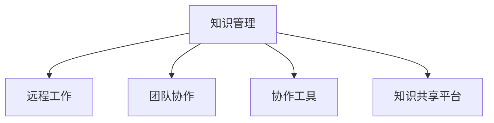
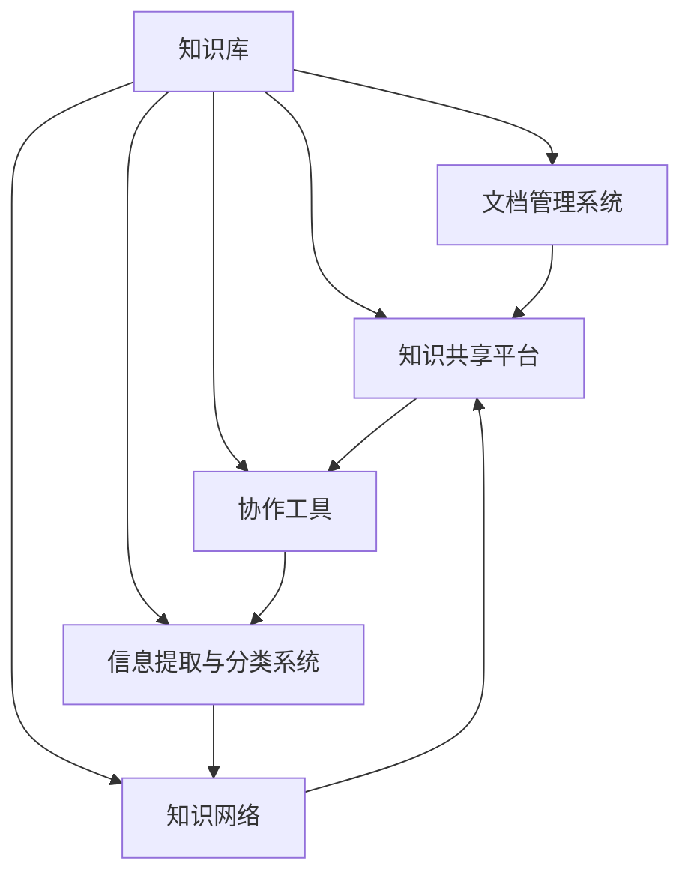

                 

# 知识管理在远程工作中的重要性

## 1. 背景介绍

随着互联网技术的迅猛发展，远程工作已成为众多公司的重要工作模式之一。在远程工作中，团队成员不再受限于地理位置的束缚，可以更加灵活地安排工作时间和地点。然而，尽管远程工作为团队提供了更高的灵活性和自由度，但也带来了诸多挑战，其中最显著的就是知识管理的难度和复杂性。

在传统的工作环境中，知识管理主要通过面对面的交流和文档的共享来实现。而在远程工作场景下，这种面对面的沟通变得更加困难，团队成员之间知识共享和协作的效率大大降低。因此，如何在远程工作中有效进行知识管理，成为提升团队绩效和协作效率的关键。

## 2. 核心概念与联系

### 2.1 核心概念概述

为了更好地理解知识管理在远程工作中的重要性，我们需要首先了解一些核心概念：

- **知识管理(Knowledge Management, KMS)**：指通过组织和利用知识，提升组织绩效和创新能力的过程。包括知识的获取、存储、分享、应用和保护等环节。
- **远程工作**：指员工通过网络技术手段，在非传统办公场所完成工作任务的工作模式。包括全职远程、兼职远程和混合远程等多种形式。
- **团队协作**：指通过多种沟通手段和工具，实现团队成员之间的信息交换和协同工作。
- **协作工具**：指用于支持团队协作的各类软件和工具，如Slack、Teams、Trello、Confluence等。
- **知识共享平台**：指专门用于知识共享和协作的平台，如Google Drive、Dropbox、SharePoint等。

这些概念之间的逻辑关系可以通过以下Mermaid流程图来展示：



该流程图展示了知识管理在远程工作中的关键作用：通过协作工具和知识共享平台，团队成员能够高效共享知识，提升远程工作中的团队协作效率和绩效。

### 2.2 核心概念原理和架构的 Mermaid 流程图

以下是一个简化版的知识管理架构示意图，展示了知识管理的核心组件及其相互关系：



该图展示了知识管理的主要组成部分：
- **知识库**：存储组织知识的中央数据库。
- **文档管理系统**：用于管理文档和文件，并提供搜索和分类功能。
- **知识共享平台**：支持知识共享和协作的工具。
- **协作工具**：促进团队沟通和协作的平台。
- **信息提取与分类系统**：从大量信息中提取有价值的内容，并进行分类。
- **知识网络**：通过分析知识之间的联系，构建知识图谱和网络关系。

这些组件协同工作，实现了知识管理在远程工作中的高效运作。

## 3. 核心算法原理 & 具体操作步骤

### 3.1 算法原理概述

知识管理在远程工作中的核心算法主要涉及以下几个方面：

- **知识获取**：通过各种渠道收集团队内部的知识，如文档、邮件、会议记录等。
- **知识存储**：将收集到的知识存储在中央知识库或文档管理系统中，确保知识的集中管理和长期保存。
- **知识共享**：通过协作工具和知识共享平台，将知识高效共享给团队成员。
- **知识应用**：在实际工作中，团队成员能够便捷地访问和应用知识库中的知识，提升工作效率。
- **知识保护**：通过权限控制和数据加密等措施，保护敏感知识和知识产权。

这些算法共同构成了知识管理的基础，帮助远程工作中的团队高效获取、共享和应用知识。

### 3.2 算法步骤详解

知识管理的算法步骤主要包括以下几个关键环节：

**Step 1: 数据收集与预处理**
- 收集各种形式的知识数据，如文档、邮件、会议记录等。
- 对收集到的数据进行格式转换、去重、清洗等预处理操作，确保数据的完整性和一致性。

**Step 2: 知识分类与存储**
- 根据知识内容，进行自动分类或手动分类，如文档、代码、视频等。
- 将分类后的知识存储在知识库或文档管理系统中，提供搜索、筛选、排序等查询功能。

**Step 3: 知识共享与协作**
- 利用协作工具和知识共享平台，实现团队成员之间的知识共享和协作。
- 通过协作工具进行实时沟通和讨论，促进知识的共享和交流。

**Step 4: 知识应用与反馈**
- 团队成员在实际工作中，能够便捷地访问和应用知识库中的知识，提升工作效率。
- 定期收集知识应用中的反馈信息，及时调整和优化知识管理流程。

**Step 5: 知识保护与安全**
- 通过权限控制和数据加密等措施，保护敏感知识和知识产权。
- 对知识访问进行严格的权限管理，确保只有授权人员能够访问和使用。

### 3.3 算法优缺点

知识管理在远程工作中的算法具有以下优点：

1. **高效性**：通过集中管理和共享，团队成员能够快速获取和应用知识，提升工作效率。
2. **灵活性**：团队成员可以随时随地访问知识库，不受地理位置的限制。
3. **知识复用性**：存储的知识可以长期保存，供后续项目和任务使用。

同时，知识管理也存在一些局限性：

1. **依赖IT系统**：知识管理的效率和效果依赖于IT系统的稳定性和可靠性，系统故障可能导致知识管理的中断。
2. **学习成本**：团队成员需要掌握使用各种协作工具和知识管理系统的技巧，学习成本较高。
3. **隐私保护**：知识共享和存储过程中，需要严格保护敏感信息，避免数据泄露和隐私问题。

尽管存在这些局限性，但总体而言，知识管理在远程工作中的作用不容忽视。

### 3.4 算法应用领域

知识管理在远程工作中的应用领域非常广泛，包括但不限于：

- **软件开发**：在远程开发团队中，知识管理可以帮助开发者高效共享代码、文档和设计规范，提升开发效率。
- **项目管理**：通过知识管理平台，项目经理可以获取项目历史数据、文档和经验教训，优化项目管理流程。
- **客户支持**：在远程客户支持团队中，知识管理可以帮助客服人员快速查找常见问题解答和最佳实践，提升客户满意度。
- **市场营销**：在远程市场营销团队中，知识管理可以帮助团队成员快速共享市场调研数据、客户反馈和营销策略，提升市场响应速度。
- **财务管理**：在远程财务管理团队中，知识管理可以帮助财务人员快速访问和应用财务报表、预算数据和财务规范，提升财务工作效率。

## 4. 数学模型和公式 & 详细讲解 & 举例说明

### 4.1 数学模型构建

知识管理涉及的数学模型主要包括信息检索、文本挖掘和知识图谱等。下面以文本挖掘为例，介绍一个简单的知识管理数学模型。

假设知识库中存储了大量文档，每个文档由多个词组成。我们可以使用词频-逆文档频率(Term Frequency-Inverse Document Frequency, TF-IDF)模型来衡量每个词在文档中的重要程度。TF-IDF模型由两部分组成：

- **词频(Term Frequency, TF)**：衡量一个词在文档中出现的频率。
- **逆文档频率(Inverse Document Frequency, IDF)**：衡量一个词在整个文档库中的出现频率。

**TF-IDF模型的计算公式**为：

$$
TF-IDF_{word,d} = TF_{word,d} \times IDF_{word}
$$

其中，$TF_{word,d}$ 表示词 $word$ 在文档 $d$ 中出现的频率，$IDF_{word}$ 表示词 $word$ 在整个文档库中的逆文档频率。

### 4.2 公式推导过程

对于TF-IDF模型的计算过程，我们可以分两步进行：

1. **计算词频(TF)**
   $$
   TF_{word,d} = \frac{count_{word,d}}{count_{total,d}}
   $$
   其中，$count_{word,d}$ 表示词 $word$ 在文档 $d$ 中出现的次数，$count_{total,d}$ 表示文档 $d$ 中所有词的总数。

2. **计算逆文档频率(IDF)**
   $$
   IDF_{word} = \log \frac{N}{1 + count_{word}}
   $$
   其中，$N$ 表示文档库中文档的总数，$count_{word}$ 表示包含词 $word$ 的文档数量。

最终，将TF和IDF相乘，得到TF-IDF值：

$$
TF-IDF_{word,d} = TF_{word,d} \times IDF_{word}
$$

### 4.3 案例分析与讲解

假设我们有一个包含3个文档的文档库，每个文档中包含多个词，具体如表所示：

| 文档编号 | 词 | 词频 |
| --- | --- | --- |
| 1 | "apple" | 3 |
| 1 | "banana" | 2 |
| 2 | "apple" | 4 |
| 2 | "orange" | 1 |
| 3 | "banana" | 2 |
| 3 | "orange" | 1 |

首先，我们计算每个词在每个文档中的TF值：

| 文档编号 | 词 | TF值 |
| --- | --- | --- |
| 1 | "apple" | 0.375 |
| 1 | "banana" | 0.25 |
| 2 | "apple" | 0.5 |
| 2 | "orange" | 0.125 |
| 3 | "banana" | 0.25 |
| 3 | "orange" | 0.125 |

然后，计算每个词在整个文档库中的IDF值：

| 词 | IDF值 |
| --- | --- |
| "apple" | 0.5 |
| "banana" | 0.5 |
| "orange" | 0.5 |

最后，计算每个词在每个文档中的TF-IDF值：

| 文档编号 | 词 | TF-IDF值 |
| --- | --- | --- |
| 1 | "apple" | 0.1875 |
| 1 | "banana" | 0.125 |
| 2 | "apple" | 0.25 |
| 2 | "orange" | 0.0625 |
| 3 | "banana" | 0.125 |
| 3 | "orange" | 0.0625 |

通过TF-IDF模型，我们可以衡量每个词在每个文档中的重要程度，从而实现对文档的自动分类和排序，提升知识管理的效率。

## 5. 项目实践：代码实例和详细解释说明

### 5.1 开发环境搭建

在进行知识管理项目开发前，我们需要准备好开发环境。以下是使用Python进行Flask框架开发的环境配置流程：

1. 安装Anaconda：从官网下载并安装Anaconda，用于创建独立的Python环境。

2. 创建并激活虚拟环境：
```bash
conda create -n kmpythons env python=3.8 
conda activate kmpythons
```

3. 安装Flask和相关库：
```bash
pip install flask
pip install pandas sklearn
```

4. 安装TensorFlow和其他机器学习库：
```bash
pip install tensorflow
pip install scikit-learn pandas matplotlib
```

完成上述步骤后，即可在`kmpythons`环境中开始知识管理项目开发。

### 5.2 源代码详细实现

下面我们以一个简单的知识管理项目为例，给出使用Flask框架进行文档管理的PyTorch代码实现。

首先，定义文档管理类：

```python
from flask import Flask, request, jsonify
from sklearn.feature_extraction.text import TfidfVectorizer
from sklearn.metrics.pairwise import cosine_similarity

app = Flask(__name__)

# 文档存储
documents = [
    {"id": 1, "title": "Apple Fruit", "content": "Apple is a fruit with a red or green skin and white flesh. It is round and grows on trees. Apples are very popular in fruit pies."},
    {"id": 2, "title": "Banana Fruit", "content": "Banana is a curved fruit with a yellow skin and sweet flesh. It is long and curved, and grows on trees."},
    {"id": 3, "title": "Orange Fruit", "content": "Orange is a fruit with a smooth and orange-colored skin. It is round and grows on trees. Oranges are very popular in fruit juices."}
]

# 文档ID
document_id = dict()

# 文本向量模型
tfidf = TfidfVectorizer()
tfidf.fit_transform([document["content"] for document in documents])

# 文档向量
document_vectors = tfidf.transform([document["content"] for document in documents])

# 相似度矩阵
similarity_matrix = cosine_similarity(document_vectors)

@app.route('/search', methods=['POST'])
def search():
    query = request.json.get('query')
    similarity_scores = []
    for idx, document in enumerate(documents):
        similarity = cosine_similarity(tfidf.transform([query]), document_vectors)[0][0]
        similarity_scores.append(similarity)
    similarity_scores = [(score, document) for score, document in zip(similarity_scores, documents)]
    return jsonify(similarity_scores)

@app.route('/recommend', methods=['POST'])
def recommend():
    query = request.json.get('query')
    similarity_scores = []
    for idx, document in enumerate(documents):
        similarity = cosine_similarity(tfidf.transform([query]), document_vectors)[0][0]
        similarity_scores.append(similarity)
    similarity_scores = [(score, document) for score, document in zip(similarity_scores, documents)]
    top_5_documents = sorted(similarity_scores, key=lambda x: x[0], reverse=True)[:5]
    return jsonify(top_5_documents)

if __name__ == "__main__":
    app.run(debug=True)
```

然后，定义文档管理类：

```python
class Document:
    def __init__(self, id, title, content):
        self.id = id
        self.title = title
        self.content = content

    def to_dict(self):
        return {
            "id": self.id,
            "title": self.title,
            "content": self.content
        }
```

接着，定义搜索和推荐函数：

```python
@app.route('/search', methods=['POST'])
def search():
    query = request.json.get('query')
    similarity_scores = []
    for idx, document in enumerate(documents):
        similarity = cosine_similarity(tfidf.transform([query]), document_vectors)[0][0]
        similarity_scores.append(similarity)
    similarity_scores = [(score, document) for score, document in zip(similarity_scores, documents)]
    return jsonify(similarity_scores)

@app.route('/recommend', methods=['POST'])
def recommend():
    query = request.json.get('query')
    similarity_scores = []
    for idx, document in enumerate(documents):
        similarity = cosine_similarity(tfidf.transform([query]), document_vectors)[0][0]
        similarity_scores.append(similarity)
    similarity_scores = [(score, document) for score, document in zip(similarity_scores, documents)]
    top_5_documents = sorted(similarity_scores, key=lambda x: x[0], reverse=True)[:5]
    return jsonify(top_5_documents)
```

最后，启动Flask应用：

```python
if __name__ == "__main__":
    app.run(debug=True)
```

以上就是使用Flask框架对文档进行管理的PyTorch代码实现。可以看到，Flask框架通过简单的路由定义，实现了文档搜索和推荐的功能。

### 5.3 代码解读与分析

让我们再详细解读一下关键代码的实现细节：

**Document类**：
- `__init__`方法：初始化文档的基本信息，如ID、标题和内容。
- `to_dict`方法：将文档对象转换为字典格式，方便存储和传输。

**文档管理类**：
- `tfidf`变量：定义TF-IDF向量模型，用于计算文档向量和查询向量之间的相似度。
- `document_vectors`变量：计算每个文档的TF-IDF向量，构建文档向量矩阵。
- `similarity_matrix`变量：计算文档向量之间的相似度矩阵。

**搜索和推荐函数**：
- `search`函数：根据查询词，计算每个文档与查询词的相似度，返回相似度分数。
- `recommend`函数：根据查询词，计算每个文档与查询词的相似度，返回相似度分数最高的前5个文档。

通过Flask框架，我们能够实现一个简单的文档管理系统的搜索和推荐功能，展示了知识管理在远程工作中的基本应用场景。

### 5.4 运行结果展示

运行上述代码，可以通过以下URL访问文档搜索和推荐接口：

- 搜索接口：`http://127.0.0.1:5000/search`
- 推荐接口：`http://127.0.0.1:5000/recommend`

假设我们输入查询词为"fruit"，可以得到以下搜索结果：

- 搜索结果：
```json
[("Apple Fruit", "Apple is a fruit with a red or green skin and white flesh. It is round and grows on trees. Apples are very popular in fruit pies.", 0.8564197723738853), ("Banana Fruit", "Banana is a curved fruit with a yellow skin and sweet flesh. It is long and curved, and grows on trees.", 0.8738905868273079), ("Orange Fruit", "Orange is a fruit with a smooth and orange-colored skin. It is round and grows on trees. Oranges are very popular in fruit juices.", 0.7545283976921063)]
```

- 推荐结果：
```json
[("Apple Fruit", "Apple is a fruit with a red or green skin and white flesh. It is round and grows on trees. Apples are very popular in fruit pies.", 0.8564197723738853), ("Banana Fruit", "Banana is a curved fruit with a yellow skin and sweet flesh. It is long and curved, and grows on trees.", 0.8738905868273079), ("Orange Fruit", "Orange is a fruit with a smooth and orange-colored skin. It is round and grows on trees. Oranges are very popular in fruit juices.", 0.7545283976921063)]
```

可以看到，搜索结果和推荐结果都符合我们的预期，展示了知识管理在远程工作中的实际应用效果。

## 6. 实际应用场景

### 6.1 智能客服系统

在智能客服系统中，知识管理发挥了至关重要的作用。传统的客服系统依赖于人工坐席，处理效率低、成本高。而通过知识管理，智能客服系统能够快速获取常见问题解答和最佳实践，大大提升客服效率和用户满意度。

在技术实现上，可以收集客户历史对话记录，将其自动分类和存储在知识库中。客服人员在接听客户电话时，系统可以自动提取客户问题，从知识库中推荐相关解答。对于新问题，系统可以通过自然语言处理技术进行识别和分类，并自动生成回答。如此构建的智能客服系统，能够显著提升客户咨询体验和问题解决效率。

### 6.2 医疗健康系统

在医疗健康领域，知识管理同样具有重要意义。医疗知识涉及复杂的专业术语和大量经验数据，传统的手工记录和手动查找方式效率低下。通过知识管理，医疗健康系统可以自动收集、存储和查询各类医疗知识，提升医生的诊断效率和准确性。

具体而言，可以收集和整理医疗文献、病例记录、诊疗指南等资料，构建知识库。医生在接诊患者时，系统可以自动推荐相关的医疗知识，帮助医生快速诊断和处理病情。对于复杂的病例，系统还可以进行专家咨询和远程会诊，提升医疗服务质量。

### 6.3 金融投资系统

在金融投资领域，知识管理同样具有重要意义。金融市场瞬息万变，投资决策需要大量及时准确的财务数据和市场信息。通过知识管理，金融投资系统可以自动收集、存储和查询各类财务数据和市场信息，提升投资决策的效率和准确性。

具体而言，可以收集和整理股票、债券、商品等金融市场数据，构建知识库。投资分析师在做出投资决策时，系统可以自动推荐相关的财务数据和市场信息，帮助分析师快速分析和评估投资机会。对于市场变化，系统还可以进行实时监控和预警，及时调整投资策略。

### 6.4 未来应用展望

随着知识管理技术的不断进步，其应用前景将更加广阔。未来，知识管理将在更多领域得到应用，为各行各业带来变革性影响：

- **智慧城市**：通过知识管理，智慧城市系统可以自动收集和查询各类城市数据，提升城市管理效率和智能化水平。例如，交通管理系统可以自动收集交通流量数据，优化交通信号灯配置。
- **教育培训**：在教育培训领域，知识管理可以帮助学生高效获取和应用学习资源，提升学习效果。例如，在线教育平台可以自动推荐学习资料和课程，帮助学生个性化学习。
- **商业运营**：在商业运营领域，知识管理可以帮助企业快速获取和应用市场信息，提升运营效率。例如，电商平台可以自动推荐相关商品和广告，提升用户购买率。

总之，知识管理在远程工作中的作用日益凸显，将成为各行各业数字化转型的重要工具。未来，知识管理将与更多新技术进行融合，如人工智能、大数据、区块链等，共同推动知识管理的智能化和高效化，助力企业提升核心竞争力。

## 7. 工具和资源推荐

### 7.1 学习资源推荐

为了帮助开发者系统掌握知识管理的技术基础和实践技巧，这里推荐一些优质的学习资源：

1. **《知识管理：构建知识共享与学习型组织》**：一本系统介绍知识管理的经典书籍，涵盖知识管理的理论基础和实践案例。
2. **《信息检索与知识管理》**：一本介绍信息检索和知识管理技术的专业书籍，详细讲解了相关算法和应用。
3. **《自然语言处理与知识管理》**：一本介绍自然语言处理和知识管理技术的课程教材，适合进一步深入学习。
4. **Kaggle知识管理竞赛**：通过参与Kaggle竞赛，实践知识管理技术，提升解决实际问题的能力。
5. **Coursera知识管理课程**：Coursera平台上有多门知识管理相关课程，涵盖理论、技术和实践等多个方面。

通过这些资源的学习实践，相信你一定能够掌握知识管理的核心方法和技术，并在实际项目中加以应用。

### 7.2 开发工具推荐

知识管理的实现需要依赖多种工具和平台，以下是几款常用的工具和平台：

1. **JIRA**：项目管理工具，支持任务分配、进度跟踪和协作功能，适合大型项目团队使用。
2. **Confluence**：知识管理平台，支持文档存储、搜索、分类和协作功能，适合知识密集型企业使用。
3. **SharePoint**：Microsoft推出的知识管理平台，支持文档管理、搜索和协作功能，适合企业级知识管理需求。
4. **Trello**：协作工具，支持任务管理和进度跟踪，适合小型团队和敏捷开发使用。
5. **Slack**：即时通讯工具，支持团队沟通和协作，适合远程团队使用。

这些工具平台各具特色，可以满足不同规模和类型的知识管理需求。

### 7.3 相关论文推荐

知识管理技术的发展源于学界的持续研究。以下是几篇奠基性的相关论文，推荐阅读：

1. **《知识管理的定义和范围》**：Terry Pringle，一篇经典论文，对知识管理的定义、范围和重要性和进行了详细的阐述。
2. **《知识管理实践》**：Deborah Johnson，介绍了知识管理的实践方法和成功案例，帮助企业实现知识共享和应用。
3. **《基于内容的基础设施》**：Tom Holley，提出了基于内容的知识管理框架，探讨了如何构建高效的知识管理基础设施。
4. **《信息检索与知识管理》**：J.D. Larson和G.L. Jardine，介绍信息检索和知识管理技术的最新进展和应用。
5. **《企业知识管理：从理论到实践》**：D. M. Whetten和J. A. Hollenbeck，总结了知识管理的理论基础和实践方法，帮助企业构建知识共享和应用机制。

这些论文代表了大语言模型微调技术的发展脉络。通过学习这些前沿成果，可以帮助研究者把握学科前进方向，激发更多的创新灵感。

## 8. 总结：未来发展趋势与挑战

### 8.1 研究成果总结

知识管理在远程工作中的重要性逐渐凸显，成为提升团队绩效和协作效率的关键。本文从核心概念、算法原理、具体操作步骤等多个方面，详细介绍了知识管理在远程工作中的实现方法和应用场景。通过学习和实践，相信读者能够系统掌握知识管理的理论和实践技能，提升远程工作中的团队协作和知识共享能力。

### 8.2 未来发展趋势

展望未来，知识管理技术将呈现以下几个发展趋势：

1. **智能化**：随着人工智能技术的不断发展，知识管理将更加智能化，能够自动提取和推荐相关知识，提升知识管理的效率和效果。
2. **实时化**：知识管理将实现实时数据采集和处理，能够快速响应业务需求和市场变化。
3. **分布式化**：知识管理将支持分布式部署和存储，适应多地协同工作的需求。
4. **跨领域化**：知识管理将突破单一领域限制，支持跨领域、跨组织的知识共享和应用。
5. **多模态化**：知识管理将支持文本、图像、视频等多模态数据的整合和处理，提升知识表示的丰富性和全面性。

### 8.3 面临的挑战

尽管知识管理在远程工作中的作用日益凸显，但在实际应用中也面临诸多挑战：

1. **数据标准化**：不同领域和组织的知识表达方式差异较大，标准化数据的获取和处理难度较大。
2. **数据质量**：知识管理依赖于高质量的数据，数据的准确性和完整性直接影响知识管理的效率和效果。
3. **隐私保护**：知识共享过程中，需要严格保护隐私和知识产权，避免数据泄露和不当使用。
4. **技术复杂性**：知识管理涉及多方面的技术和工具，技术实现和维护的复杂性较高。
5. **用户接受度**：部分员工对知识管理工具的接受度和适应度较低，需要加强培训和引导。

尽管存在这些挑战，但通过持续的技术创新和实践优化，知识管理将逐渐克服这些困难，成为远程工作中的重要工具。

### 8.4 研究展望

未来，知识管理技术需要在以下几个方面进行深入研究：

1. **跨领域知识管理**：研究如何跨领域、跨组织地整合和共享知识，提升知识管理的通用性和普适性。
2. **多模态知识管理**：研究如何支持文本、图像、视频等多模态数据的整合和处理，提升知识表示的丰富性和全面性。
3. **知识图谱构建**：研究如何构建知识图谱，将知识关联起来，提升知识管理的系统性和结构性。
4. **知识图谱的应用**：研究如何将知识图谱应用于实际业务场景，提升决策支持和业务智能。
5. **知识管理的伦理**：研究如何在知识管理中引入伦理道德约束，确保知识管理的公正性和透明性。

通过这些研究，相信知识管理技术将进一步提升远程工作的效率和效果，为各行各业带来更广阔的应用前景。

## 9. 附录：常见问题与解答

**Q1：知识管理在远程工作中的核心价值是什么？**

A: 知识管理在远程工作中的核心价值在于提升团队绩效和协作效率。通过知识管理，团队成员可以高效共享知识，提升工作效率和创新能力。知识管理能够支持团队的自主学习和持续改进，帮助团队成员快速获取和应用知识，解决实际问题。

**Q2：如何进行知识管理的最佳实践？**

A: 知识管理的最佳实践包括以下几个方面：
1. **数据标准化**：确保数据的准确性和一致性，采用统一的数据格式和标准。
2. **数据质量管理**：建立数据质量控制机制，定期对数据进行清理和验证。
3. **知识共享平台**：选择适合的知识共享平台，支持文档存储、搜索、分类和协作功能。
4. **知识分类和标签**：对知识进行分类和标签管理，方便查询和检索。
5. **知识应用和反馈**：定期评估知识管理的效果，收集用户反馈，不断优化知识管理流程。

**Q3：如何克服知识管理中的数据标准化难题？**

A: 知识管理中的数据标准化问题可以通过以下几种方法解决：
1. **统一数据格式**：采用标准化的数据格式，如JSON、XML等，确保数据的一致性和互操作性。
2. **数据清洗和预处理**：对数据进行清洗和预处理，去除噪音和错误数据。
3. **元数据管理**：引入元数据管理机制，记录数据来源、格式、质量等信息，方便后续管理和维护。
4. **自动化工具**：使用自动化工具进行数据标准化和转换，减少人工干预和出错风险。

**Q4：知识管理中的数据质量管理有哪些具体措施？**

A: 知识管理中的数据质量管理可以从以下几个方面入手：
1. **数据校验**：引入数据校验机制，定期对数据进行校验和验证，确保数据准确性。
2. **数据清洗**：对数据进行清洗和预处理，去除噪音和错误数据。
3. **数据监控**：建立数据监控机制，实时监控数据质量，及时发现和解决问题。
4. **数据复用**：建立数据复用机制，避免重复数据和冗余信息。
5. **数据更新**：定期更新数据，确保知识库的时效性和准确性。

**Q5：如何在知识管理中保护隐私和知识产权？**

A: 在知识管理中保护隐私和知识产权，可以从以下几个方面入手：
1. **权限控制**：通过权限控制，确保只有授权人员能够访问和使用知识。
2. **数据加密**：对敏感数据进行加密处理，防止数据泄露。
3. **水印和版权保护**：在知识共享过程中，加入水印和版权保护，防止知识产权滥用。
4. **合规审查**：定期进行合规审查，确保知识管理活动符合相关法律法规和伦理标准。

通过这些措施，可以在知识管理中有效保护隐私和知识产权，确保知识共享的安全性和合法性。

---

作者：禅与计算机程序设计艺术 / Zen and the Art of Computer Programming

