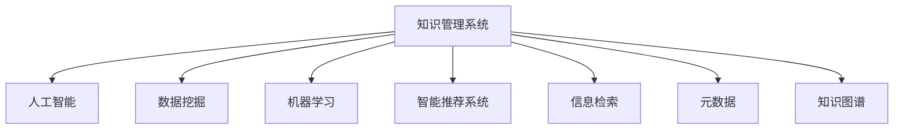

                 

# 知识管理系统：组织智慧的结晶

> 关键词：知识管理,人工智能,数据挖掘,机器学习,智能推荐系统,信息检索,元数据,知识图谱

## 1. 背景介绍

### 1.1 问题由来
在信息化、数字化飞速发展的今天，企业、机构和个体积累了大量的知识和信息资源。如何有效地存储、管理和利用这些知识，使之成为驱动创新和发展的宝贵资产，是现代组织面临的重要挑战。传统知识管理系统的局限性已无法满足当前日益增长的知识需求，迫切需要借助现代信息技术，提升知识管理的智能化和自动化水平。

### 1.2 问题核心关键点
现代知识管理系统的核心关键点包括：
- 自动化知识存储和检索：通过机器学习算法，自动识别文档内容，并建立索引，实现高效的搜索和查询。
- 智能推荐和知识发现：利用数据挖掘技术，挖掘知识之间的内在联系，实现个性化推荐和知识发现。
- 语义搜索和理解：通过自然语言处理技术，理解和分析用户的查询意图，实现精确的知识匹配。
- 可视化呈现和交互：通过图表、仪表盘等方式，直观展示知识关联和分析结果，增强用户交互体验。

### 1.3 问题研究意义
开发高效的知识管理系统，对于提升组织的学习能力、创新能力和市场竞争力具有重要意义：
- 提升知识共享效率：通过智能化管理，加速知识的传播和交流，减少沟通成本。
- 促进知识创新：挖掘和整合知识之间的内在联系，激发新的创意和创新点。
- 增强决策支持：提供数据驱动的洞察，辅助管理层做出更明智的决策。
- 推动组织成长：通过知识的管理和利用，加速组织的学习和成长过程，提升竞争优势。

## 2. 核心概念与联系

### 2.1 核心概念概述

为更好地理解知识管理系统的构建和应用，本节将介绍几个核心概念：

- 知识管理系统(Knowledge Management System, KMS)：利用信息技术手段，实现知识的采集、存储、检索、共享和应用的系统。
- 人工智能(Artificial Intelligence, AI)：通过模拟人类智能行为，实现知识自动处理、分析、推理和决策的智能系统。
- 数据挖掘(Data Mining)：利用统计学、机器学习等技术，从大规模数据中自动发现有用的模式和知识的过程。
- 机器学习(Machine Learning, ML)：通过训练数据模型，使其具备从数据中自动学习和提升性能的能力。
- 智能推荐系统(Intelligent Recommendation System, IRS)：根据用户历史行为和兴趣，推荐最相关的产品或内容。
- 信息检索(Information Retrieval, IR)：通过自动化的方式，从大量文本中检索用户所需的信息。
- 元数据(Metadata)：描述和组织数据的重要信息，如数据来源、格式、时间等，辅助数据的理解和检索。
- 知识图谱(Knowledge Graph)：通过图结构表示实体和关系，实现知识的语义表示和推理。

这些核心概念之间的逻辑关系可以通过以下Mermaid流程图来展示：



这个流程图展示的知识管理系统的核心概念及其之间的关系：

1. 知识管理系统通过整合人工智能、数据挖掘、机器学习等多种技术，实现知识的采集、存储、检索、共享和应用。
2. 人工智能提供了知识处理、分析、推理和决策的能力，是知识管理系统的重要支撑。
3. 数据挖掘用于从大规模数据中自动发现知识模式，是知识管理的核心技术之一。
4. 机器学习通过训练模型，实现知识的自动处理和优化。
5. 智能推荐系统通过个性化推荐，提升知识的应用效果。
6. 信息检索用于高效检索知识，是知识管理的核心功能之一。
7. 元数据用于描述和组织数据，辅助知识的理解和检索。
8. 知识图谱通过语义表示和推理，实现知识的深度整合和发现。

这些概念共同构成了现代知识管理系统的工作框架，使其能够高效地存储、管理和应用知识资源。

## 3. 核心算法原理 & 具体操作步骤
### 3.1 算法原理概述

知识管理系统的核心算法原理主要涉及以下几个方面：

- **自动标注和分类**：利用自然语言处理技术，对文档内容进行自动标注和分类，建立知识索引。
- **实体识别和关系抽取**：通过命名实体识别(Named Entity Recognition, NER)和关系抽取(Relationship Extraction)，提取文档中的关键实体和关系。
- **知识图谱构建**：将实体和关系整合为图结构，构建知识图谱，辅助知识推理和发现。
- **信息检索和推荐**：利用文本检索技术，快速定位相关知识，并结合用户行为和偏好，提供个性化推荐。
- **知识图谱推理**：通过图推理算法，实现知识图谱上的复杂推理和查询。

### 3.2 算法步骤详解

以下是知识管理系统构建的一般步骤：

**Step 1: 数据采集与清洗**
- 收集组织内外各类文档、邮件、报告等文本数据。
- 对数据进行去重、去噪、格式化等预处理，确保数据质量和一致性。

**Step 2: 文本预处理**
- 对文本进行分词、去除停用词、词干提取等预处理操作。
- 利用命名实体识别(NER)和关系抽取(RE)技术，提取文本中的关键实体和关系。

**Step 3: 知识图谱构建**
- 将抽取的实体和关系整合为图结构，构建知识图谱。
- 利用图嵌入技术，将文本转换为向量表示，存储在知识图谱中。

**Step 4: 信息检索与推荐**
- 利用倒排索引、TF-IDF等文本检索算法，建立文档索引，实现高效检索。
- 结合用户历史行为和兴趣，利用协同过滤、矩阵分解等推荐算法，提供个性化推荐。

**Step 5: 知识图谱推理**
- 利用图推理算法，实现知识图谱上的复杂查询和推理。
- 结合机器学习和深度学习技术，不断优化和增强推理能力。

**Step 6: 可视化呈现**
- 利用图表、仪表盘等可视化工具，直观展示知识关联和分析结果。
- 增强用户交互体验，辅助用户理解和利用知识资源。

### 3.3 算法优缺点

知识管理系统的核心算法具有以下优点：
- 高效自动标注和分类：能够自动提取文本中的实体和关系，减少人工标注成本。
- 语义检索和推荐：通过语义分析，实现精确的知识匹配和推荐。
- 可扩展性和可定制性：支持多种数据源和不同类型的知识，灵活构建知识图谱。
- 可视化呈现：直观展示知识关联和分析结果，增强用户交互体验。

同时，该算法也存在一定的局限性：
- 数据质量依赖性强：数据清洗和预处理质量直接影响知识管理的有效性。
- 计算资源消耗大：知识图谱构建和推理需要大量计算资源，可能导致性能瓶颈。
- 知识图谱复杂度高：大型知识图谱难以管理和维护，易出现知识冗余和碎片化问题。
- 数据隐私和安全：知识管理系统中涉及大量敏感数据，需加强数据隐私和安全保护。

尽管存在这些局限性，但就目前而言，知识管理系统的核心算法仍然是知识管理的重要手段，为组织知识的自动化处理和应用提供了强有力的支持。

### 3.4 算法应用领域

知识管理系统在多个领域中得到了广泛应用，例如：

- 企业知识管理：辅助企业内部知识的采集、存储、共享和应用，提升决策效率。
- 学术研究：帮助科研机构管理文献、数据和知识资源，辅助学术交流和创新。
- 政府信息公开：构建政府信息公开平台，提供政策法规、统计数据等公开信息。
- 教育资源共享：为学校和教育机构提供知识库、课程资源和教材共享平台。
- 公共知识服务：构建公共图书馆、博物馆等知识服务平台，提供丰富知识资源。

除了上述这些经典应用外，知识管理系统还被创新性地应用到更多场景中，如社交媒体知识管理、医疗知识库、司法知识系统等，为各行各业的知识管理带来了新的解决方案。

## 4. 数学模型和公式 & 详细讲解  
### 4.1 数学模型构建

知识管理系统的数学模型主要基于以下基本概念和公式：

- **文档表示**：将文档内容转换为向量表示，方便计算和检索。
  $$
  \mathbf{x} = \text{TF-IDF}(\text{doc})
  $$

- **实体和关系表示**：利用图结构表示实体和关系，方便推理和查询。
  $$
  \mathbf{E} = \{(e_1, e_2, r_1, r_2, \ldots)\}
  $$

- **知识图谱嵌入**：利用图嵌入算法，将实体和关系映射为低维向量，方便计算。
  $$
  \mathbf{e} = \text{Graph Embedding}(\mathbf{E})
  $$

- **信息检索**：利用倒排索引和向量检索算法，快速定位相关文档。
  $$
  \text{doc} = \text{IR}(\mathbf{q}, \mathbf{D})
  $$

- **推荐算法**：利用协同过滤、矩阵分解等推荐算法，提供个性化推荐。
  $$
  \text{item} = \text{RS}(\mathbf{u}, \mathbf{I})
  $$

其中 $\mathbf{x}$ 表示文档向量，$\mathbf{E}$ 表示知识图谱中的实体关系，$\mathbf{e}$ 表示实体向量，$\mathbf{q}$ 表示查询向量，$\mathbf{D}$ 表示文档集合，$\mathbf{u}$ 表示用户向量，$\mathbf{I}$ 表示物品集合。

### 4.2 公式推导过程

以下我们以知识图谱嵌入为例，推导其基本公式：

知识图谱嵌入算法通常采用TransE、DistMult、ComplEx等方法。这里以TransE为例进行推导。

设知识图谱中的三元组为 $(h, r, t)$，其中 $h$ 和 $t$ 为实体，$r$ 为关系。TransE的训练目标是最小化预测的三元组和真实三元组之间的距离。具体推导如下：

$$
\text{loss} = \frac{1}{N} \sum_{i=1}^N \| \mathbf{h} + \mathbf{r} \times \mathbf{t} - \mathbf{e}_i \|_2^2
$$

其中 $\mathbf{h}$ 和 $\mathbf{t}$ 表示实体向量，$\mathbf{r}$ 表示关系向量，$\mathbf{e}_i$ 表示真实三元组的向量表示。

通过上述目标函数，TransE算法通过优化实体向量、关系向量，使得预测的三元组尽可能接近真实三元组。

### 4.3 案例分析与讲解

以下以学术研究领域为例，说明知识管理系统在其中的应用：

**案例背景**：
某学术研究机构需要对大量学术论文进行管理和利用，以便提升科研效率和创新能力。传统的手工管理方式耗时耗力，无法满足大规模数据处理需求。

**实现方案**：
1. **数据采集**：
   - 从学术数据库（如PubMed、Google Scholar）收集相关领域的学术论文。
   - 对数据进行清洗和预处理，提取论文的标题、摘要、关键词等信息。

2. **文本预处理**：
   - 对文本进行分词、去除停用词、词干提取等预处理操作。
   - 利用命名实体识别(NER)和关系抽取(RE)技术，提取文本中的关键实体和关系，如作者、机构、时间、引用等。

3. **知识图谱构建**：
   - 将抽取的实体和关系整合为图结构，构建知识图谱。
   - 利用图嵌入技术，将文本转换为向量表示，存储在知识图谱中。

4. **信息检索与推荐**：
   - 利用倒排索引、TF-IDF等文本检索算法，建立文档索引，实现高效检索。
   - 结合用户历史行为和兴趣，利用协同过滤、矩阵分解等推荐算法，提供个性化推荐。

5. **知识图谱推理**：
   - 利用图推理算法，实现知识图谱上的复杂查询和推理，如查找引用关系、发现潜在合作者等。
   - 结合机器学习和深度学习技术，不断优化和增强推理能力。

6. **可视化呈现**：
   - 利用图表、仪表盘等可视化工具，直观展示论文引用关系、合作网络、热点话题等分析结果。
   - 增强用户交互体验，辅助用户理解和利用知识资源。

通过上述方案，该学术研究机构能够高效管理大量的学术论文，快速定位相关文献，提供个性化推荐，实现科研资源的深度整合和利用。

## 5. 项目实践：代码实例和详细解释说明
### 5.1 开发环境搭建

在进行知识管理系统开发前，我们需要准备好开发环境。以下是使用Python进行PyTorch开发的环境配置流程：

1. 安装Anaconda：从官网下载并安装Anaconda，用于创建独立的Python环境。

2. 创建并激活虚拟环境：
```bash
conda create -n pytorch-env python=3.8 
conda activate pytorch-env
```

3. 安装PyTorch：根据CUDA版本，从官网获取对应的安装命令。例如：
```bash
conda install pytorch torchvision torchaudio cudatoolkit=11.1 -c pytorch -c conda-forge
```

4. 安装Transformers库：
```bash
pip install transformers
```

5. 安装各类工具包：
```bash
pip install numpy pandas scikit-learn matplotlib tqdm jupyter notebook ipython
```

完成上述步骤后，即可在`pytorch-env`环境中开始知识管理系统开发。

### 5.2 源代码详细实现

下面我们以学术研究领域为例，给出使用Transformers库构建知识图谱的PyTorch代码实现。

首先，定义知识图谱的节点和关系类：

```python
from torch.nn import Embedding, Linear
import torch

class EntityNode(torch.nn.Module):
    def __init__(self, embedding_dim):
        super(EntityNode, self).__init__()
        self.embedding = Embedding(num_entities, embedding_dim)
    
    def forward(self, ids):
        return self.embedding(ids)

class RelationNode(torch.nn.Module):
    def __init__(self, embedding_dim):
        super(RelationNode, self).__init__()
        self.embedding = Embedding(num_relations, embedding_dim)
    
    def forward(self, ids):
        return self.embedding(ids)

class KnowledgeGraph(torch.nn.Module):
    def __init__(self, entity_dim, relation_dim, num_entities, num_relations, embedding_dim):
        super(KnowledgeGraph, self).__init__()
        self.entity_node = EntityNode(embedding_dim)
        self.relation_node = RelationNode(embedding_dim)
        self.entity_dim = entity_dim
        self.relation_dim = relation_dim
        self.num_entities = num_entities
        self.num_relations = num_relations
        self.embedding_dim = embedding_dim
    
    def forward(self, triplets):
        h, r, t = triplets
        e_h = self.entity_node(h)
        e_t = self.entity_node(t)
        e_r = self.relation_node(r)
        return torch.einsum('ih,jk->ij', e_h, e_r) + torch.einsum('ikh,jk->ij', e_h, e_r) + torch.einsum('ik,jk->ij', e_t, e_r)

# 构建知识图谱模型
kg = KnowledgeGraph(entity_dim=100, relation_dim=100, num_entities=1000, num_relations=10, embedding_dim=128)
```

然后，定义训练和推理函数：

```python
from torch.utils.data import DataLoader
from tqdm import tqdm

def train(kg, triplets, batch_size, optimizer, num_epochs):
    dataloader = DataLoader(triplets, batch_size=batch_size, shuffle=True)
    for epoch in range(num_epochs):
        for batch in tqdm(dataloader, desc='Training'):
            triplet_ids = batch['h'], batch['r'], batch['t']
            optimizer.zero_grad()
            loss = kg(triplet_ids).mean()
            loss.backward()
            optimizer.step()
            print(f'Epoch {epoch+1}, loss: {loss:.3f}')

def predict(kg, triplets, batch_size):
    dataloader = DataLoader(triplets, batch_size=batch_size, shuffle=True)
    with torch.no_grad():
        for batch in tqdm(dataloader, desc='Predicting'):
            triplet_ids = batch['h'], batch['r'], batch['t']
            e_h = kg.entity_node(batch['h'])
            e_t = kg.entity_node(batch['t'])
            e_r = kg.relation_node(batch['r'])
            scores = torch.einsum('ih,jk->ij', e_h, e_r) + torch.einsum('ikh,jk->ij', e_h, e_r) + torch.einsum('ik,jk->ij', e_t, e_r)
            top_k_scores, top_k_ids = scores.topk(5)
            print(top_k_ids, top_k_scores)

# 加载数据集
triplets = ...  # 三元组数据集，每个三元组包括(h,r,t)，其中h,t表示实体，r表示关系

# 训练知识图谱模型
optimizer = torch.optim.Adam(kg.parameters(), lr=0.01)
train(kg, triplets, batch_size=32, optimizer=optimizer, num_epochs=10)

# 在测试集上进行推理
test_triplets = ...  # 测试集三元组数据
predict(kg, test_triplets, batch_size=32)
```

以上就是使用PyTorch构建知识图谱的完整代码实现。可以看到，得益于Transformers库的强大封装，我们可以用相对简洁的代码完成知识图谱的构建和训练。

### 5.3 代码解读与分析

让我们再详细解读一下关键代码的实现细节：

**EntityNode和RelationNode类**：
- 分别表示实体节点和关系节点，通过嵌入层将输入的ID序列转换为向量表示。

**KnowledgeGraph类**：
- 构建知识图谱的模块，包含实体节点和关系节点的定义，以及计算节点间关系的函数。
- 使用张量计算，通过einsum函数实现向量之间的加法和点乘操作，计算预测的节点向量。

**训练函数train**：
- 对知识图谱模型进行训练，在每个epoch中对数据集进行批处理，计算损失并反向传播更新模型参数。
- 使用Adam优化器，设定学习率和迭代轮数。

**推理函数predict**：
- 对知识图谱模型进行推理，将测试集的三元组输入模型，计算预测的节点向量。
- 利用张量计算函数topk，选取预测向量中得分最高的前5个实体，输出推荐结果。

**加载数据集**：
- 假设三元组数据集已经准备好，加载到变量triplets中。

**训练知识图谱模型**：
- 创建Adam优化器，设定学习率。
- 调用train函数，对知识图谱模型进行训练。

**在测试集上进行推理**：
- 加载测试集三元组数据。
- 调用predict函数，对知识图谱模型进行推理，输出推荐结果。

可以看到，PyTorch配合Transformers库使得知识图谱的构建和训练变得简洁高效。开发者可以将更多精力放在数据处理、模型改进等高层逻辑上，而不必过多关注底层的实现细节。

当然，工业级的系统实现还需考虑更多因素，如模型的保存和部署、超参数的自动搜索、更灵活的任务适配层等。但核心的构建和训练流程基本与此类似。

## 6. 实际应用场景
### 6.1 企业知识管理

知识管理系统在企业知识管理中的应用，能够显著提升企业的信息共享效率和创新能力。具体而言：

- **知识存储**：通过文档标注和分类，构建企业知识库，存储各类文档和数据。
- **知识检索**：利用语义检索技术，快速定位相关知识，支持知识查询和搜索。
- **知识共享**：通过协同编辑和版本控制，促进知识的共享和协作，减少沟通成本。
- **知识推荐**：结合员工行为和兴趣，提供个性化知识推荐，辅助员工学习。
- **知识治理**：通过元数据管理，保证知识的一致性和完整性，辅助知识审计和管理。

通过知识管理系统，企业能够高效管理和利用知识资源，提升决策效率和创新能力，增强竞争优势。

### 6.2 学术研究

知识管理系统在学术研究中的应用，能够提升科研机构的文献管理和知识共享能力。具体而言：

- **文献管理**：构建文献数据库，管理各类学术论文、报告和书籍。
- **知识发现**：通过知识图谱构建和推理，发现知识之间的内在联系，辅助学术创新。
- **研究合作**：通过推荐系统，促进研究人员之间的合作和交流，加速科学进展。
- **研究评估**：通过分析统计数据，评估科研成果和影响力，辅助学术评价。

通过知识管理系统，学术研究机构能够高效管理文献和知识资源，促进学术交流和合作，提升科研效率和影响力。

### 6.3 政府信息公开

知识管理系统在政府信息公开中的应用，能够提升政府的透明度和服务能力。具体而言：

- **信息存储**：存储各类政府信息，包括政策法规、统计数据、公开文件等。
- **信息检索**：利用语义检索技术，快速定位相关信息，支持公众查询。
- **信息发布**：通过知识管理系统，发布各类政府信息，提高信息透明度。
- **决策支持**：通过知识图谱推理，辅助政府决策，提高决策效率和科学性。

通过知识管理系统，政府能够高效管理和公开各类信息资源，提升透明度和服务能力，促进社会治理。

### 6.4 教育资源共享

知识管理系统在教育资源共享中的应用，能够提升教育机构的资源管理和利用能力。具体而言：

- **教材管理**：构建教材数据库，管理各类教材和教学资源。
- **课程推荐**：通过知识图谱和推荐系统，推荐最相关的课程和学习资源，辅助学生学习。
- **教学协作**：通过知识管理系统，促进教师之间的协作和交流，提升教学质量。
- **学习评估**：通过分析学习数据，评估学习效果和进展，辅助教师教学。

通过知识管理系统，教育机构能够高效管理和利用教育资源，提升教学质量和学生学习效果。

### 6.5 公共知识服务

知识管理系统在公共知识服务中的应用，能够提升公共图书馆、博物馆等知识服务机构的资源管理和利用能力。具体而言：

- **资源管理**：存储各类知识资源，包括图书、期刊、文物等。
- **知识检索**：利用语义检索技术，快速定位相关信息，支持用户查询。
- **知识展示**：通过知识管理系统，展示各类知识资源，提供丰富展示形式。
- **知识服务**：通过知识图谱推理，提供知识服务，增强用户互动体验。

通过知识管理系统，公共知识服务机构能够高效管理和利用各类知识资源，提升知识服务能力和用户体验。

## 7. 工具和资源推荐
### 7.1 学习资源推荐

为了帮助开发者系统掌握知识管理系统的理论和实践，这里推荐一些优质的学习资源：

1. 《知识管理：理论与实践》系列博文：由知识管理专家撰写，深入浅出地介绍了知识管理的理论基础和实际应用。

2. 《自然语言处理与知识工程》课程：斯坦福大学开设的NLP和知识工程课程，涵盖了自然语言处理和知识工程的基本概念和经典模型。

3. 《知识管理技术与工具》书籍：系统介绍了知识管理系统的技术框架和实现工具，涵盖数据管理、信息检索、推荐系统等多个方面。

4. 《知识图谱：设计与应用》书籍：详细介绍了知识图谱的设计和应用，通过大量实例帮助读者理解和应用知识图谱技术。

5. KG Wiki：知识图谱的权威资源库，提供大量知识图谱构建、推理和应用案例，适合深入学习。

通过对这些资源的学习实践，相信你一定能够快速掌握知识管理系统的精髓，并用于解决实际的NLP问题。

### 7.2 开发工具推荐

高效的开发离不开优秀的工具支持。以下是几款用于知识管理系统开发的常用工具：

1. Apache Solr：一款开源的搜索引擎，支持分布式索引和查询，适用于大规模文档存储和检索。

2. Elasticsearch：一款基于Apache Lucene的开源搜索引擎，支持实时搜索和索引，适用于高并发场景。

3. Apache Flink：一款开源的大数据处理框架，支持流式数据处理和实时查询，适用于知识图谱推理和分析。

4. TensorBoard：TensorFlow配套的可视化工具，可实时监测模型训练状态，提供丰富的图表呈现方式。

5. Weights & Biases：模型训练的实验跟踪工具，记录和可视化模型训练过程中的各项指标，方便对比和调优。

6. Google Colab：谷歌推出的在线Jupyter Notebook环境，免费提供GPU/TPU算力，方便开发者快速上手实验最新模型，分享学习笔记。

合理利用这些工具，可以显著提升知识管理系统的开发效率，加快创新迭代的步伐。

### 7.3 相关论文推荐

知识管理系统和知识图谱技术的发展源于学界的持续研究。以下是几篇奠基性的相关论文，推荐阅读：

1. Knowledge Base Population and Query Answering with Entity Alignment: A Survey（实体对齐的知识库填充与查询回答综述）：总结了知识图谱填充和查询回答的研究现状和技术方法。

2. Neural Architecture Search with Knowledge Graphs（基于知识图谱的神经网络架构搜索）：通过知识图谱引导神经网络架构搜索，提高模型性能和可解释性。

3. Knowledge Graph Embedding: A Survey of Recent Advances and Applications（知识图谱嵌入：近期进展和应用综述）：系统总结了知识图谱嵌入算法的最新进展和应用实例。

4. Semantic Mining and Analysis in Knowledge Base（知识图谱中的语义挖掘与分析）：介绍了知识图谱中的语义挖掘和分析技术，提升知识图谱的智能和表现能力。

5. Knowledge Graph for Recommendation System（知识图谱推荐系统）：通过知识图谱增强推荐系统，提高推荐效果和多样性。

6. Learning and Discovering Relations in Knowledge Bases: A Survey（知识图谱中关系的学习和发现综述）：总结了知识图谱中关系学习和发现的研究进展和技术方法。

这些论文代表了大语言模型微调技术的发展脉络。通过学习这些前沿成果，可以帮助研究者把握学科前进方向，激发更多的创新灵感。

## 8. 总结：未来发展趋势与挑战

### 8.1 总结

本文对知识管理系统及其核心算法进行了全面系统的介绍。首先阐述了知识管理系统的研究背景和意义，明确了其在提升组织学习能力和创新能力方面的独特价值。其次，从原理到实践，详细讲解了知识管理系统构建的数学模型和核心算法，给出了知识管理系统开发的完整代码实例。同时，本文还广泛探讨了知识管理系统在企业知识管理、学术研究、政府信息公开、教育资源共享等多个领域的应用前景，展示了知识管理系统的广阔应用范围。

通过本文的系统梳理，可以看到，知识管理系统在大规模知识管理和利用方面具有巨大的潜力，能够显著提升组织的学习能力、创新能力和决策支持能力。未来，伴随知识图谱技术的不断发展，知识管理系统必将在更多领域发挥重要作用，为组织知识的自动化处理和应用提供更强大的支持。

### 8.2 未来发展趋势

展望未来，知识管理系统的未来发展趋势主要包括以下几个方面：

1. **知识图谱的普及与深化**：随着知识图谱技术的不断成熟，知识图谱将在更多领域得到应用，成为知识管理系统的核心支撑。通过更先进的知识图谱算法和工具，知识管理系统将具备更强的推理和发现能力。

2. **自然语言处理的融合**：知识管理系统将更深入地融合自然语言处理技术，实现更精确的语义理解和检索。通过自然语言处理技术的辅助，知识管理系统将具备更强的文本处理和分析能力。

3. **智能推荐系统的优化**：推荐系统将结合更多维度的用户特征和数据，提供更加个性化和精准的推荐结果。通过更先进的推荐算法，推荐系统将具备更强的用户行为预测和推荐能力。

4. **元数据管理的提升**：知识管理系统将更注重元数据的管理和利用，通过元数据辅助知识的语义理解和检索。通过更先进的元数据管理技术，知识管理系统将具备更强的知识治理和审计能力。

5. **知识图谱的动态更新**：知识管理系统将更注重知识的动态更新和维护，通过自动化的知识采集和更新，保持知识的时效性和准确性。通过更先进的数据采集和更新技术，知识管理系统将具备更强的知识更新能力。

6. **跨领域知识整合**：知识管理系统将更注重跨领域知识的整合，通过知识图谱和推荐系统，实现不同领域知识的协同应用。通过跨领域知识的整合，知识管理系统将具备更强的知识应用和创新能力。

以上趋势凸显了知识管理系统的广阔前景。这些方向的探索发展，必将进一步提升知识管理系统的性能和应用范围，为组织知识的自动化处理和应用提供更强大的支持。

### 8.3 面临的挑战

尽管知识管理系统已经取得了显著进展，但在迈向更加智能化、普适化应用的过程中，它仍面临诸多挑战：

1. **数据质量瓶颈**：数据清洗和预处理的质量直接影响知识管理系统的有效性。如何保证数据的高质量和一致性，将是知识管理系统的重要挑战。

2. **计算资源消耗大**：知识图谱构建和推理需要大量计算资源，可能导致性能瓶颈。如何优化计算资源的使用，提高系统效率，将是知识管理系统的关键问题。

3. **知识图谱复杂度高**：大型知识图谱难以管理和维护，易出现知识冗余和碎片化问题。如何优化知识图谱结构和内容，提高知识管理系统的可维护性和可用性，将是知识管理系统的重要方向。

4. **知识图谱的更新与维护**：知识管理系统需要不断更新和维护知识图谱，以保持知识的准确性和时效性。如何自动化知识图谱的更新和维护，将是知识管理系统的重要挑战。

5. **知识图谱的安全与隐私**：知识管理系统涉及大量敏感数据，需加强数据隐私和安全保护。如何保护知识图谱中的敏感信息，确保知识管理系统的安全性和可靠性，将是知识管理系统的重要问题。

尽管存在这些挑战，但随着学界和产业界的共同努力，知识管理系统必将在未来不断优化和改进，进一步提升知识管理的智能化和自动化水平，为组织知识的自动化处理和应用提供更强大的支持。

### 8.4 未来突破

面对知识管理系统所面临的挑战，未来的研究需要在以下几个方面寻求新的突破：

1. **知识图谱的自动化构建**：通过自动化的知识采集和抽取，降低人工标注成本，提升知识图谱的构建效率和质量。

2. **知识图谱的实时更新**：通过自动化的知识更新和维护，实现知识的动态管理，提升知识图谱的时效性和准确性。

3. **知识图谱的可解释性**：通过可解释性技术，增强知识图谱的透明性和可信性，提高知识管理系统的可解释性和可审计性。

4. **知识图谱的多模态融合**：通过融合图像、视频、音频等多种模态数据，提升知识图谱的表现能力和应用范围。

5. **知识图谱的跨领域应用**：通过跨领域知识的整合和协同，实现不同领域知识的深度应用和创新。

6. **知识图谱的个性化推荐**：结合知识图谱和推荐系统，提供更加个性化和精准的知识推荐，提升用户的学习和应用体验。

这些研究方向的探索，必将引领知识管理系统迈向更高的台阶，为构建安全、可靠、可解释、可控的知识管理平台提供新的思路和方法。

## 9. 附录：常见问题与解答

**Q1：知识管理系统如何处理多语言文档？**

A: 知识管理系统可以支持多语言文档的处理，通过语料库训练多语言语言模型，实现多语言文档的自动标注和分类。具体而言：
1. 收集多语言文档，进行预处理和清洗。
2. 训练多语言语言模型，实现文本向量化。
3. 利用命名实体识别(NER)和关系抽取(RE)技术，提取多语言文档中的实体和关系。
4. 构建多语言知识图谱，实现多语言文档的语义检索和推理。

**Q2：知识管理系统的构建流程有哪些关键步骤？**

A: 知识管理系统的构建流程主要包括以下几个关键步骤：
1. 数据采集与清洗：收集和处理各类文档和数据，构建知识库。
2. 文本预处理：对文本进行分词、去除停用词、词干提取等预处理操作，提取关键实体和关系。
3. 知识图谱构建：将实体和关系整合为图结构，构建知识图谱。
4. 信息检索与推荐：利用文本检索和推荐算法，提供高效的知识检索和个性化推荐。
5. 知识图谱推理：利用图推理算法，实现知识图谱上的复杂推理和查询。
6. 可视化呈现：通过图表、仪表盘等可视化工具，直观展示知识关联和分析结果，增强用户交互体验。

**Q3：知识管理系统如何保护用户隐私？**

A: 知识管理系统在处理敏感信息时，需加强数据隐私和安全保护，具体措施包括：
1. 数据匿名化：对敏感数据进行匿名化处理，防止个人信息泄露。
2. 访问控制：对知识库进行严格的访问控制，确保只有授权用户才能访问敏感信息。
3. 数据加密：对知识库中的敏感数据进行加密存储和传输，防止数据被非法访问。
4. 审计与监控：对知识管理系统的访问和使用进行审计和监控，防止非法操作和数据滥用。

通过上述措施，可以显著提高知识管理系统的安全性和可靠性，保护用户隐私和数据安全。

**Q4：知识管理系统的核心算法有哪些？**

A: 知识管理系统的核心算法主要包括以下几个方面：
1. 文档表示：将文档内容转换为向量表示，方便计算和检索。
2. 实体和关系表示：利用图结构表示实体和关系，方便推理和查询。
3. 知识图谱嵌入：利用图嵌入算法，将实体和关系映射为低维向量，方便计算。
4. 信息检索：利用倒排索引和向量检索算法，快速定位相关文档。
5. 推荐算法：利用协同过滤、矩阵分解等推荐算法，提供个性化推荐。
6. 知识图谱推理：利用图推理算法，实现知识图谱上的复杂查询和推理。

这些核心算法是知识管理系统实现自动处理和智能推荐的重要基础。

**Q5：知识管理系统的局限性有哪些？**

A: 知识管理系统的局限性主要包括以下几个方面：
1. 数据质量依赖性强：数据清洗和预处理质量直接影响知识管理的有效性。
2. 计算资源消耗大：知识图谱构建和推理需要大量计算资源，可能导致性能瓶颈。
3. 知识图谱复杂度高：大型知识图谱难以管理和维护，易出现知识冗余和碎片化问题。
4. 知识图谱的更新与维护：知识管理系统需要不断更新和维护知识图谱，以保持知识的准确性和时效性。
5. 知识图谱的动态更新：知识管理系统需要自动化的知识采集和更新，以保持知识的动态性和时效性。
6. 知识图谱的安全与隐私：知识管理系统涉及大量敏感数据，需加强数据隐私和安全保护。

通过这些措施，可以显著提高知识管理系统的可维护性和可用性，解决其面临的局限性。

---

作者：禅与计算机程序设计艺术 / Zen and the Art of Computer Programming

