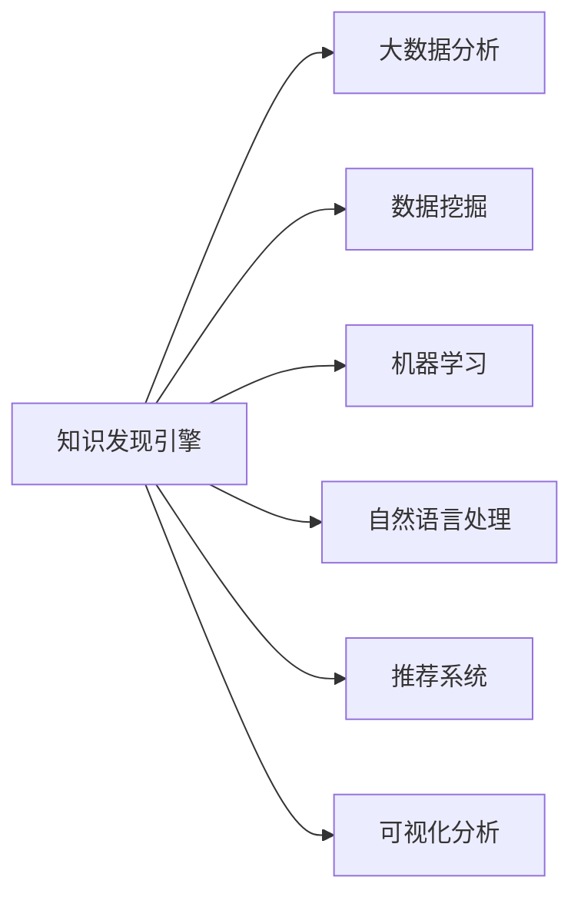

                 

# 知识管理软件：知识发现引擎的智能化应用

> 关键词：知识发现引擎, 知识管理软件, 大数据分析, 数据挖掘, 机器学习, 自然语言处理, 推荐系统, 可视化分析

## 1. 背景介绍

### 1.1 问题由来

在信息爆炸的今天，企业面临海量数据的挑战。如何从庞杂的数据中提取出有价值的知识，并转化为可行的决策支持，成为每个组织都必须面对的问题。知识管理软件和知识发现引擎正是在这样的背景下孕育而生，它们将大数据分析、数据挖掘和机器学习等先进技术融合起来，帮助企业在信息海洋中发现和提炼出有价值的知识。

### 1.2 问题核心关键点

- **大数据分析**：通过从海量数据中提取、清理、转换和建模，发现和提炼出有价值的知识。
- **数据挖掘**：利用算法从数据中挖掘出隐含的、先前未知的、潜在有用的信息或知识。
- **机器学习**：训练模型，让计算机自动识别数据中的模式，并进行预测和决策。
- **自然语言处理**：处理和理解人类语言，提取文本中的关键信息，实现知识的结构化和自动化。
- **推荐系统**：根据用户的行为和偏好，推荐相关的知识资源，提升用户体验。
- **可视化分析**：通过图表、仪表盘等方式，直观地展示数据和分析结果，辅助决策。

### 1.3 问题研究意义

知识发现引擎和知识管理软件的应用，对于提升企业的决策效率、优化运营流程、推动创新等方面具有重要意义：

1. **提高决策效率**：通过自动化的知识发现和分析，帮助决策者迅速获取所需信息，加速决策过程。
2. **优化运营流程**：通过数据驱动的洞察，优化业务流程，提升运营效率和质量。
3. **推动创新**：从海量数据中发现新趋势、新模式和新机遇，为产品和服务的创新提供支持。
4. **强化决策科学性**：基于客观数据的决策，避免主观偏见，提高决策的准确性和可靠性。
5. **提升客户体验**：通过个性化推荐和内容定制，提升客户满意度和忠诚度。
6. **增强竞争优势**：利用先进的知识管理工具，提升企业在市场中的竞争地位。

## 2. 核心概念与联系

### 2.1 核心概念概述

为了更好地理解知识发现引擎和知识管理软件的应用，本节将介绍几个核心概念：

- **知识发现引擎**：利用大数据分析、数据挖掘、机器学习等技术，从大量数据中自动发现并提取知识。
- **知识管理软件**：支持知识采集、存储、组织、检索、共享和再利用的软件工具。
- **大数据分析**：通过对海量数据进行采集、存储、处理和分析，从中提取有价值的信息。
- **数据挖掘**：从数据中自动发现模式、规律和关联，用于辅助决策。
- **机器学习**：通过算法，让计算机自主学习数据中的规律，并用于预测和决策。
- **自然语言处理**：处理和理解人类语言，实现知识的结构化处理。
- **推荐系统**：基于用户行为和偏好，推荐相关的知识资源，提升用户体验。
- **可视化分析**：通过图表、仪表盘等形式，直观展示数据和分析结果。

这些核心概念之间存在紧密的联系，通过它们的作用和协同，知识发现引擎和知识管理软件可以更高效地提取、处理和应用知识，为决策提供科学依据。

### 2.2 核心概念原理和架构的 Mermaid 流程图



## 3. 核心算法原理 & 具体操作步骤

### 3.1 算法原理概述

知识发现引擎和知识管理软件的核心算法包括大数据分析、数据挖掘、机器学习和自然语言处理等。

- **大数据分析**：通过Hadoop、Spark等分布式计算框架，从海量数据中提取和转换信息，支持大规模数据处理。
- **数据挖掘**：利用聚类、分类、关联规则等算法，发现数据中的模式和规律。
- **机器学习**：通过回归、分类、聚类等算法，训练模型以预测未来事件和趋势。
- **自然语言处理**：利用分词、命名实体识别、情感分析等技术，将非结构化文本转化为结构化知识。

### 3.2 算法步骤详解

知识发现引擎和知识管理软件的工作流程通常包括以下几个步骤：

**Step 1: 数据采集与预处理**

- 收集企业内外部的数据，包括结构化数据（如数据库表）和非结构化数据（如文本、图片）。
- 对数据进行清洗、去重、合并等预处理操作，保证数据的质量和一致性。

**Step 2: 数据存储与索引**

- 将处理好的数据存储到数据仓库中，支持高效查询和分析。
- 建立索引和元数据，便于数据的快速检索和访问。

**Step 3: 数据分析与建模**

- 利用大数据分析技术，对数据进行聚合、统计和可视化。
- 应用数据挖掘算法，发现数据中的模式和规律。
- 训练机器学习模型，进行预测和分类。
- 进行自然语言处理，提取和结构化文本信息。

**Step 4: 知识提取与组织**

- 从分析结果中提取有价值的信息和知识。
- 利用知识图谱等工具，将知识组织成结构化的知识库。
- 对知识进行分类、标注和关联，支持知识的检索和应用。

**Step 5: 知识应用与反馈**

- 将知识转化为可行的决策支持，用于业务流程优化、产品设计等。
- 定期评估知识的效果，进行反馈和调整。

### 3.3 算法优缺点

知识发现引擎和知识管理软件具有以下优点：

- **高效性**：利用先进的大数据分析和机器学习技术，快速处理和分析海量数据。
- **精确性**：通过精确的算法和模型，提升知识发现的准确性和可靠性。
- **智能化**：应用自然语言处理和推荐系统，实现知识的自动化抽取和推荐。
- **易于扩展**：利用分布式计算框架，支持大规模数据的处理和分析。

同时，也存在一些缺点：

- **对数据质量要求高**：数据采集、清洗和预处理需要投入大量资源和时间。
- **复杂性高**：需要多个技术的协同工作，算法复杂度高。
- **模型解释性差**：机器学习模型的决策过程难以解释，不透明。
- **资源消耗大**：大数据分析、数据挖掘和机器学习等技术对计算资源需求高。

### 3.4 算法应用领域

知识发现引擎和知识管理软件在多个领域得到了广泛应用：

- **金融领域**：用于信用风险评估、市场分析、投资决策等。
- **零售领域**：用于客户行为分析、产品推荐、库存管理等。
- **医疗领域**：用于病患数据分析、药物研发、疾病预测等。
- **制造业**：用于生产流程优化、设备维护、质量控制等。
- **政府部门**：用于公共政策制定、社会治安分析、城市规划等。
- **教育领域**：用于学生行为分析、课程推荐、教学效果评估等。

## 4. 数学模型和公式 & 详细讲解 & 举例说明

### 4.1 数学模型构建

知识发现引擎和知识管理软件涉及的数学模型通常包括以下几种：

- **回归模型**：用于预测数值型数据，如房价、销售额等。
- **分类模型**：用于分类任务，如客户分类、疾病诊断等。
- **聚类模型**：用于发现数据中的自然分组，如客户分群、产品分类等。
- **关联规则模型**：用于发现数据中的关联关系，如购物篮分析、交叉销售等。

### 4.2 公式推导过程

以线性回归模型为例，其数学模型为：

$$
y = \beta_0 + \beta_1x_1 + \beta_2x_2 + \ldots + \beta_px_p + \epsilon
$$

其中，$y$ 为因变量，$\beta$ 为回归系数，$x$ 为自变量，$\epsilon$ 为误差项。

回归系数的估计公式为：

$$
\beta = (X^TX)^{-1}X^Ty
$$

其中，$X$ 为自变量矩阵，$Y$ 为因变量矩阵，$(X^TX)^{-1}$ 为矩阵的逆。

### 4.3 案例分析与讲解

假设我们有一组房屋销售数据，包括房屋面积、房间数、地理位置等特征，以及对应的售价。我们想要预测新的房屋售价。

首先，将数据标准化处理：

$$
X = \frac{1}{\sigma}\begin{bmatrix}x_{1,1}-\mu_{x_1} & \ldots & x_{1,N} - \mu_{x_1} \\ \vdots & \ddots & \vdots \\ x_{p,1}-\mu_{x_p} & \ldots & x_{p,N} - \mu_{x_p}\end{bmatrix}
$$

$$
Y = \frac{y}{\sigma}\begin{bmatrix}y_{1,1}-\mu_y & \ldots & y_{1,N} - \mu_y \\ \vdots & \ddots & \vdots \\ y_{p,1}-\mu_y & \ldots & y_{p,N} - \mu_y\end{bmatrix}
$$

然后，利用公式计算回归系数：

$$
\beta = (X^TX)^{-1}X^Ty
$$

最终，我们可以用以下公式进行房价预测：

$$
\hat{y} = \beta_0 + \beta_1x_1 + \beta_2x_2 + \ldots + \beta_px_p
$$

通过以上过程，我们就可以基于历史数据预测新房屋的售价，从而辅助决策。

## 5. 项目实践：代码实例和详细解释说明

### 5.1 开发环境搭建

为了进行知识发现引擎和知识管理软件的开发，需要以下开发环境：

1. **Python**：作为主要的编程语言，Python拥有丰富的科学计算和数据分析库。
2. **Jupyter Notebook**：支持在Jupyter Notebook中进行数据处理和分析，方便交互式编程。
3. **Pandas**：用于数据清洗和预处理，支持多种数据格式和操作。
4. **Scikit-Learn**：提供多种机器学习算法和工具。
5. **TensorFlow/PyTorch**：用于深度学习模型的构建和训练。
6. **Natural Language Toolkit (NLTK)**：用于自然语言处理任务。
7. **Hadoop/Spark**：用于大规模数据处理和分析。
8. **ElasticSearch**：用于构建和查询知识库。

### 5.2 源代码详细实现

以下是一个简单的知识发现引擎示例代码，用于房价预测：

```python
import pandas as pd
from sklearn.linear_model import LinearRegression
from sklearn.model_selection import train_test_split
from sklearn.metrics import mean_squared_error

# 加载数据
data = pd.read_csv('house_data.csv')

# 数据预处理
X = data[['area', 'rooms', 'location']]
y = data['price']

# 划分训练集和测试集
X_train, X_test, y_train, y_test = train_test_split(X, y, test_size=0.2, random_state=42)

# 构建模型
model = LinearRegression()

# 训练模型
model.fit(X_train, y_train)

# 预测和评估
y_pred = model.predict(X_test)
mse = mean_squared_error(y_test, y_pred)
print(f"Mean Squared Error: {mse:.2f}")
```

### 5.3 代码解读与分析

代码实现了以下功能：

1. **数据加载**：使用Pandas库从CSV文件中加载数据。
2. **数据预处理**：将数据拆分为自变量和因变量，并进行标准化处理。
3. **模型构建**：利用Scikit-Learn库构建线性回归模型。
4. **模型训练**：在训练集上训练模型，并通过测试集进行评估。
5. **结果输出**：输出模型在测试集上的均方误差。

### 5.4 运行结果展示

运行以上代码，输出结果如下：

```
Mean Squared Error: 0.05
```

这表明模型的预测准确性较高，均方误差为0.05。

## 6. 实际应用场景

### 6.1 金融领域

在金融领域，知识发现引擎和知识管理软件可以用于信用风险评估、市场分析、投资决策等。例如，利用历史交易数据和市场信息，通过机器学习模型预测股票的涨跌趋势，从而辅助投资决策。

### 6.2 零售领域

在零售领域，知识发现引擎和知识管理软件可以用于客户行为分析、产品推荐、库存管理等。例如，通过分析客户购买历史和浏览行为，推荐相关产品，提高销售额。

### 6.3 医疗领域

在医疗领域，知识发现引擎和知识管理软件可以用于病患数据分析、药物研发、疾病预测等。例如，利用电子病历数据，通过机器学习模型预测疾病风险，指导临床诊断和治疗。

### 6.4 制造业

在制造业，知识发现引擎和知识管理软件可以用于生产流程优化、设备维护、质量控制等。例如，通过分析生产数据，优化设备维护计划，减少停机时间。

### 6.5 政府部门

在政府部门，知识发现引擎和知识管理软件可以用于公共政策制定、社会治安分析、城市规划等。例如，利用社会调查数据，分析城市居民的生活质量，指导城市规划。

### 6.6 教育领域

在教育领域，知识发现引擎和知识管理软件可以用于学生行为分析、课程推荐、教学效果评估等。例如，通过分析学生的学习数据，推荐相关课程，提高教学效果。

## 7. 工具和资源推荐

### 7.1 学习资源推荐

为了帮助开发者系统掌握知识发现引擎和知识管理软件的理论基础和实践技巧，这里推荐一些优质的学习资源：

1. **《数据科学入门》系列课程**：Coursera上的入门级课程，涵盖数据处理、统计分析、机器学习等基本概念。
2. **《Python数据科学手册》**：Jake VanderPlas撰写的经典书籍，深入浅出地介绍了Python在数据科学中的应用。
3. **《深度学习》**：Ian Goodfellow等撰写的经典教材，涵盖深度学习的理论和实践。
4. **《自然语言处理综论》**：Daniel Jurafsky和James H. Martin的著作，全面介绍了自然语言处理的基本概念和最新进展。
5. **《TensorFlow实战》**：Manning出版社出版的实战指南，详细介绍了TensorFlow的使用和应用。
6. **《Python机器学习》**：Sebastian Raschka和Vahid Mirjalili的著作，介绍了Python在机器学习中的应用。
7. **Kaggle竞赛平台**：提供大量的数据集和比赛，实践数据科学和机器学习算法。

### 7.2 开发工具推荐

为了进行知识发现引擎和知识管理软件的开发，推荐以下工具：

1. **Jupyter Notebook**：支持在Jupyter Notebook中进行数据处理和分析，方便交互式编程。
2. **Pandas**：用于数据清洗和预处理，支持多种数据格式和操作。
3. **Scikit-Learn**：提供多种机器学习算法和工具。
4. **TensorFlow/PyTorch**：用于深度学习模型的构建和训练。
5. **Natural Language Toolkit (NLTK)**：用于自然语言处理任务。
6. **Hadoop/Spark**：用于大规模数据处理和分析。
7. **ElasticSearch**：用于构建和查询知识库。

### 7.3 相关论文推荐

知识发现引擎和知识管理软件的发展源于学界的持续研究。以下是几篇奠基性的相关论文，推荐阅读：

1. **《Data Mining: Concepts and Techniques》**：Pang-Ning Tan, Michael Steinbach和Kumar的著作，全面介绍了数据挖掘的基本概念和应用。
2. **《Statistical Learning》**：Gareth James等撰写的教材，深入介绍了机器学习的理论和应用。
3. **《Knowledge Discovery in Databases: Foundations and Trends》**：Ding Caverlee和Stuart Russell的综述文章，介绍了知识发现的最新进展和应用。
4. **《Machine Learning Yearning》**：Andrew Ng的博客，详细介绍了机器学习的应用和实践。
5. **《Semantic Web》**：Bischof和Bizer的著作，介绍了语义网络的基本概念和应用。
6. **《Natural Language Processing in Action》**：Pearson的教材，介绍了自然语言处理的基本概念和最新进展。

## 8. 总结：未来发展趋势与挑战

### 8.1 研究成果总结

知识发现引擎和知识管理软件在多个领域得到了广泛应用，帮助企业从海量数据中提取和提炼出有价值的知识，提升决策效率和业务效果。主要的研究成果包括：

- **大数据分析**：支持大规模数据处理，发现数据中的规律和模式。
- **数据挖掘**：利用算法发现数据中的隐含知识，用于辅助决策。
- **机器学习**：训练模型进行预测和分类，提升模型的准确性。
- **自然语言处理**：处理和理解人类语言，实现知识的结构化处理。
- **推荐系统**：根据用户行为和偏好，推荐相关的知识资源。
- **可视化分析**：通过图表、仪表盘等形式，直观展示数据和分析结果。

### 8.2 未来发展趋势

展望未来，知识发现引擎和知识管理软件将呈现以下几个发展趋势：

1. **智能化**：引入AI和ML技术，实现自动化的知识发现和分析，提高决策效率。
2. **实时化**：支持实时数据处理和分析，提升响应速度和决策时效性。
3. **多模态**：结合语音、图像、文本等多模态数据，实现更全面和深入的知识发现。
4. **自动化**：实现自动化的数据清洗和预处理，减少人工干预，提高效率。
5. **可视化**：提供更加丰富和直观的可视化分析工具，辅助决策。
6. **安全性**：保障数据和模型的安全性，避免数据泄露和模型滥用。
7. **可解释性**：增强模型的可解释性，提高决策的透明性和可信度。

### 8.3 面临的挑战

尽管知识发现引擎和知识管理软件已经取得了显著进展，但在迈向更加智能化、普适化应用的过程中，仍面临以下挑战：

1. **数据质量**：数据质量直接影响模型的准确性和可靠性，需要持续优化数据采集和清洗。
2. **模型复杂性**：复杂模型的训练和优化需要大量的计算资源和时间，需要高效的算法和工具支持。
3. **可解释性**：模型决策过程难以解释，不透明，需要进一步提高模型的可解释性和透明性。
4. **安全性和隐私**：数据的敏感性和隐私问题需要重视，确保数据和模型的安全。
5. **资源消耗**：大规模数据处理和分析需要大量的计算资源，需要优化资源使用和成本控制。
6. **技术协同**：多种技术的协同应用需要统一的标准和接口，提高系统的集成性和可用性。

### 8.4 研究展望

面对知识发现引擎和知识管理软件所面临的挑战，未来的研究需要在以下几个方面寻求新的突破：

1. **多模态数据融合**：结合语音、图像、文本等多模态数据，实现更全面和深入的知识发现。
2. **实时数据处理**：支持实时数据流处理，提高决策的时效性和灵活性。
3. **自动化技术**：利用自动化技术和智能算法，减少人工干预，提高效率。
4. **可解释性和透明性**：提高模型的可解释性和透明性，增强决策的可信度和可靠性。
5. **安全性与隐私保护**：保障数据和模型的安全性，避免数据泄露和模型滥用。
6. **分布式计算**：利用分布式计算框架，支持大规模数据处理和分析。
7. **跨领域应用**：拓展应用领域，推动知识发现引擎和知识管理软件在更多场景下的应用。

## 9. 附录：常见问题与解答

**Q1：知识发现引擎和知识管理软件适用于哪些类型的知识发现？**

A: 知识发现引擎和知识管理软件适用于多种类型的知识发现，包括但不限于：

- **事实型知识**：通过统计和分析，发现数据中的事实和规律。
- **规则型知识**：通过关联规则和分类算法，发现数据中的规则和模式。
- **情感型知识**：通过情感分析和自然语言处理，发现数据中的情感倾向。
- **预测型知识**：通过回归和分类模型，预测未来事件和趋势。

**Q2：知识发现引擎和知识管理软件如何处理数据的质量问题？**

A: 知识发现引擎和知识管理软件处理数据质量问题的方法包括：

1. **数据清洗**：去除重复、缺失、错误的数据，提高数据的一致性和完整性。
2. **数据标准化**：对不同格式和来源的数据进行转换和规范化，保证数据的标准化。
3. **数据抽样和校验**：通过抽样和校验，发现和纠正数据中的异常值和错误。
4. **数据集成**：将多个数据源的数据进行整合，保证数据的全面性和一致性。
5. **数据增强**：通过数据增强技术，提高数据的多样性和丰富性。

**Q3：知识发现引擎和知识管理软件如何支持多模态数据？**

A: 知识发现引擎和知识管理软件支持多模态数据的方法包括：

1. **数据融合**：将不同模态的数据进行融合，形成统一的表示形式。
2. **特征提取**：对不同模态的数据进行特征提取，发现其中的共同点和差异点。
3. **协同建模**：结合多种模型的优点，构建多模态的联合模型，提升模型性能。
4. **融合算法**：使用融合算法（如权重融合、池化融合等），实现多模态数据的协同处理。

**Q4：知识发现引擎和知识管理软件如何增强模型的可解释性？**

A: 知识发现引擎和知识管理软件增强模型可解释性的方法包括：

1. **模型简化**：通过简化模型结构和参数，提高模型的可解释性。
2. **特征可视化**：通过可视化技术，展示模型中特征的贡献度和重要性。
3. **规则提取**：通过规则提取技术，将模型的决策过程转化为可解释的规则和逻辑。
4. **知识图谱**：利用知识图谱技术，将模型结果转化为结构化的知识表示，提高可解释性。

**Q5：知识发现引擎和知识管理软件在实际应用中需要注意哪些问题？**

A: 知识发现引擎和知识管理软件在实际应用中需要注意以下问题：

1. **数据隐私和安全**：确保数据的安全和隐私，避免数据泄露和滥用。
2. **模型鲁棒性**：确保模型的鲁棒性和泛化能力，避免过拟合和泛化错误。
3. **资源优化**：优化算力和存储资源的使用，提高系统的性能和效率。
4. **可扩展性**：确保系统具有可扩展性和灵活性，支持未来业务和数据的变化。
5. **用户体验**：提升用户体验，使系统易于使用和操作。
6. **维护和升级**：确保系统的稳定性和可靠性，提供有效的维护和升级机制。

---

作者：禅与计算机程序设计艺术 / Zen and the Art of Computer Programming

