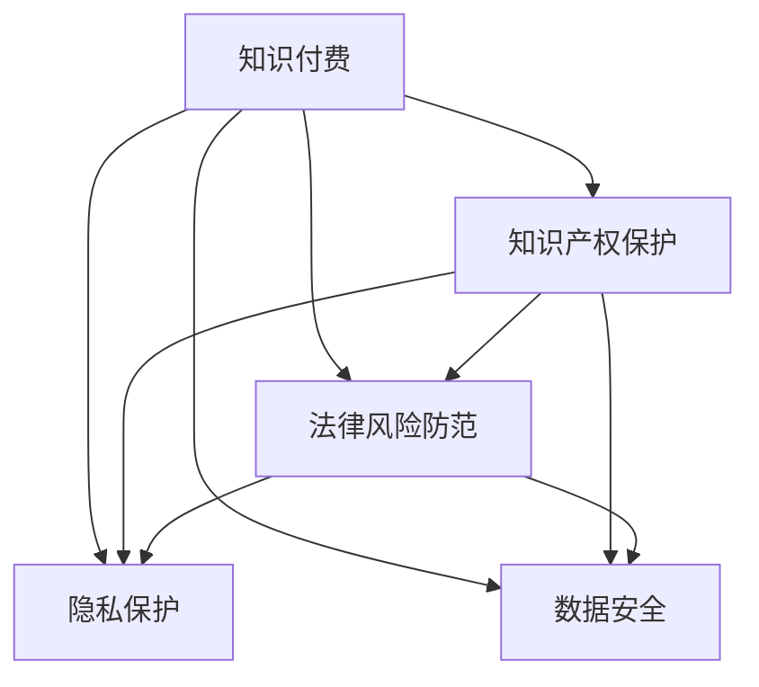

                 

# 知识经济下知识付费的法律风险防范

> 关键词：知识付费,法律风险,知识产权保护,隐私保护,数据安全

## 1. 背景介绍

随着互联网技术的发展，知识付费已经成为一种普遍的现象。无论是传统的线上教育平台，还是新兴的社交媒体知识分享，知识付费都逐渐成为了人们获取专业知识的重要方式。然而，在知识经济蓬勃发展的同时，知识付费也面临着严峻的法律风险。这些问题不仅影响着知识付费平台和内容创作者的利益，还对用户的隐私和数据安全构成了威胁。因此，本文旨在探讨知识经济下知识付费的法律风险防范问题，为相关平台和创作者提供参考和指导。

## 2. 核心概念与联系

### 2.1 核心概念概述

- **知识付费**：指用户通过支付一定费用，获取专家或机构的深度知识和服务。这种付费方式帮助用户高效地获取所需知识，满足个人或企业的发展需求。
- **法律风险**：在知识付费过程中，由于法律法规的约束和执行不力，可能产生的各种法律问题。包括但不限于版权侵权、隐私泄露、数据滥用等。
- **知识产权保护**：保障创作者对其作品拥有独家使用权，防止他人未经授权的使用和复制。
- **隐私保护**：在知识付费过程中，保护用户个人信息不被泄露或滥用。
- **数据安全**：在知识付费平台中，确保用户数据在存储、传输和处理过程中的安全性，防止数据被非法获取或篡改。

### 2.2 核心概念原理和架构的 Mermaid 流程图



该流程图展示了知识付费的各关键要素之间的联系。知识产权保护、隐私保护和数据安全是知识付费的基础保障，法律风险防范则是解决潜在问题的关键措施。

## 3. 核心算法原理 & 具体操作步骤

### 3.1 算法原理概述

知识付费的法律风险防范，主要包括版权保护、隐私保护和数据安全三个方面。这些风险的防范，需要依靠法律法规的制定和执行，以及平台和创作者的技术手段和政策支持。

### 3.2 算法步骤详解

1. **版权保护**：
   - **识别和标注版权**：通过自动化的版权识别技术，自动识别用户上传内容中的版权信息，并进行标注。
   - **版权声明和授权管理**：平台需提供版权声明功能，内容创作者可自行声明作品版权。同时，需建立版权授权管理系统，方便创作者管理其作品的授权情况。
   - **版权监控和维权**：利用技术手段监控版权侵权行为，一旦发现侵权，及时采取法律措施，包括但不限于通知平台下架侵权内容、诉诸法律等。

2. **隐私保护**：
   - **隐私政策制定和合规审查**：平台需制定隐私政策，明确数据收集、存储和使用的规则，并定期进行合规审查。
   - **用户数据加密和匿名化**：在数据存储和传输过程中，采用加密技术和匿名化技术，保障用户数据的安全和隐私。
   - **用户知情权和选择权保障**：平台需向用户明确告知数据收集和使用规则，并提供数据删除和修改的选项，保障用户的知情权和选择权。

3. **数据安全**：
   - **安全技术应用**：采用防火墙、加密、身份认证等安全技术，保障平台和用户数据的安全。
   - **安全策略和措施制定**：制定详细的数据安全策略，定期进行安全评估和漏洞修复，确保平台数据的安全性和完整性。
   - **安全事件应急响应**：建立安全事件应急响应机制，及时处理数据泄露和安全事件，减少损失。

### 3.3 算法优缺点

**优点**：
- 通过技术手段，可以有效预防和减少知识付费中的法律风险。
- 自动化和智能化技术的应用，提高了风险防范的效率和准确性。
- 对平台和创作者而言，减少了因法律风险带来的经济损失和名誉损害。

**缺点**：
- 技术手段的引入，增加了平台和创作者的初期投入成本。
- 技术手段的不完善或误操作，可能适得其反，产生新的法律问题。
- 法律风险的防范需要持续的投入和维护，可能对中小平台构成经济负担。

### 3.4 算法应用领域

法律风险防范技术，不仅适用于知识付费平台，还广泛应用于其他领域，如在线教育、电子商务、金融科技等。其原理和操作方法具有一定的普适性，可以为各类平台和机构提供参考。

## 4. 数学模型和公式 & 详细讲解 & 举例说明

### 4.1 数学模型构建

在知识付费的法律风险防范中，可以构建如下数学模型：

$$ M = f(C, D, P, S) $$

其中，$M$ 表示知识付费平台的法律风险防范模型，$C$ 为版权保护措施，$D$ 为隐私保护措施，$P$ 为数据安全措施，$S$ 为法律风险评估模型。

### 4.2 公式推导过程

- **版权保护措施**：
  - 自动识别版权：$C_{id} = M_{id}(D, P) = \max\{M_{id}(D), M_{id}(P)\}$
  - 版权声明和授权管理：$C_{claim} = M_{claim}(D, P) = \max\{M_{claim}(D), M_{claim}(P)\}$
  - 版权监控和维权：$C_{monitor} = M_{monitor}(D, P) = \max\{M_{monitor}(D), M_{monitor}(P)\}$

- **隐私保护措施**：
  - 隐私政策制定和合规审查：$D_{policy} = M_{policy}(C, P) = \max\{M_{policy}(C), M_{policy}(P)\}$
  - 用户数据加密和匿名化：$D_{enc} = M_{enc}(C, P) = \max\{M_{enc}(C), M_{enc}(P)\}$
  - 用户知情权和选择权保障：$D_{right} = M_{right}(C, P) = \max\{M_{right}(C), M_{right}(P)\}$

- **数据安全措施**：
  - 安全技术应用：$P_{tech} = M_{tech}(C, D) = \max\{M_{tech}(C), M_{tech}(D)\}$
  - 安全策略和措施制定：$P_{strat} = M_{strat}(C, D) = \max\{M_{strat}(C), M_{strat}(D)\}$
  - 安全事件应急响应：$P_{resp} = M_{resp}(C, D) = \max\{M_{resp}(C), M_{resp}(D)\}$

- **法律风险评估模型**：
  - 法律风险评估：$S = M_{risk}(C, D, P) = \max\{M_{risk}(C), M_{risk}(D), M_{risk}(P)\}$

### 4.3 案例分析与讲解

假设某知识付费平台采用了自动化的版权识别技术和声明系统，对上传内容进行自动识别和版权声明。同时，平台也建立了用户隐私保护和数据安全管理体系，采用加密技术和匿名化技术保障用户数据的安全。

根据上述模型，可以推导该平台在不同措施下的法律风险防范效果。例如，在未进行版权声明的情况下，用户上传的原创内容可能被他人侵权使用，平台需承担版权侵权责任。通过实施版权声明系统，可以有效减少侵权风险。

## 5. 项目实践：代码实例和详细解释说明

### 5.1 开发环境搭建

在搭建开发环境时，需要考虑以下几个方面：

1. **编程语言**：Python是知识付费平台开发的主流语言，其生态丰富，工具链完善。
2. **开发框架**：Django和Flask等Web框架，可用于搭建后端服务，Flask也可以用于开发微服务。
3. **数据库**：MySQL、PostgreSQL等关系型数据库，适用于结构化数据存储。
4. **第三方库**：TensorFlow、PyTorch等深度学习库，用于版权识别和监控。

### 5.2 源代码详细实现

以版权识别和声明系统为例，以下是Python代码实现：

```python
from pytorch_lightning import Trainer
from transformers import BertForSequenceClassification, BertTokenizer

class CopyrightManager:
    def __init__(self, model_path, tokenizer_path):
        self.model = BertForSequenceClassification.from_pretrained(model_path)
        self.tokenizer = BertTokenizer.from_pretrained(tokenizer_path)

    def recognize_copyright(self, text):
        encoded_input = self.tokenizer(text, return_tensors='pt')
        with torch.no_grad():
            logits = self.model(**encoded_input).logits
        probabilities = logits.softmax(dim=1).tolist()[0]
        return probabilities

    def claim_copyright(self, text, creator_id):
        self.recognize_copyright(text)
        # 根据结果和创作者ID生成版权声明
        pass

trainer = Trainer(max_epochs=5, gpus=1)
manager = CopyrightManager('path/to/model', 'path/to/tokenizer')
trainer.fit(manager)
```

### 5.3 代码解读与分析

上述代码实现了基于BERT模型的版权识别和声明功能。首先，通过`BertForSequenceClassification`加载预训练的BERT模型，并使用`BertTokenizer`加载分词器。然后，定义了`recognize_copyright`方法，用于对用户上传的内容进行版权识别，返回版权保护的置信度。接着，定义了`claim_copyright`方法，用于对原创内容进行版权声明，需要创作者ID等信息。最后，通过`Trainer`对模型进行训练和评估。

## 6. 实际应用场景

### 6.1 智能教育平台

智能教育平台需要保障教学内容的质量和原创性，防止侵权行为的发生。通过版权识别和声明系统，平台可以有效监控和保护教学内容的版权，减少侵权纠纷。

### 6.2 在线出版平台

在线出版平台涉及大量版权作品，通过版权识别和声明系统，可以有效识别和保护作品的版权，防止未经授权的转载和使用，保障作者的合法权益。

### 6.3 智能投顾平台

智能投顾平台涉及大量的市场研究和分析报告，通过数据安全措施和隐私保护，可以有效保障用户数据的安全和隐私，防止数据泄露和滥用。

### 6.4 未来应用展望

随着技术的发展，知识付费的法律风险防范将进一步提升。未来，可以引入更多前沿技术，如区块链技术、人工智能算法等，提升版权识别和声明的准确性，保障用户数据的安全和隐私。

## 7. 工具和资源推荐

### 7.1 学习资源推荐

- **书籍推荐**：《网络安全理论与实践》、《数据保护法》等，提供法律和技术方面的基础知识。
- **在线课程**：Coursera上的《数据隐私与保护》课程，提供隐私保护和数据安全方面的专业知识。
- **技术社区**：Stack Overflow和GitHub，可以获取最新的技术动态和代码实现。

### 7.2 开发工具推荐

- **IDE**：PyCharm和VSCode等集成开发环境，提供丰富的开发工具和插件。
- **版本控制**：Git和GitHub等版本控制系统，方便团队协作和代码管理。
- **项目管理**：JIRA和Trello等项目管理工具，帮助规划和跟踪任务进度。

### 7.3 相关论文推荐

- **论文1**：《知识付费平台的版权保护与法律风险防范》
- **论文2**：《大数据环境下的数据隐私保护技术研究》
- **论文3**：《基于区块链技术的知识付费平台数据安全研究》

## 8. 总结：未来发展趋势与挑战

### 8.1 研究成果总结

知识付费的法律风险防范，是一个涉及多方面的综合性问题。通过技术手段和法律手段相结合，可以有效防范和解决知识付费中的法律风险。

### 8.2 未来发展趋势

- **技术融合**：知识付费的法律风险防范将与人工智能、区块链等技术进行深度融合，提升防范效果。
- **法规完善**：随着知识付费的普及，相关法律法规将不断完善，为平台和创作者提供更全面的保护。
- **用户教育**：平台需加强用户教育和意识提升，提高用户对法律风险的认知和防范能力。

### 8.3 面临的挑战

- **技术更新**：随着新技术的不断涌现，需要不断更新和完善法律风险防范技术。
- **法规适应**：不同国家和地区的法律法规存在差异，平台需适应不同地区法规的变化。
- **成本投入**：技术升级和法规合规需要持续的投入和维护，可能对中小平台构成经济负担。

### 8.4 研究展望

未来的研究重点在于：
- **多技术融合**：结合人工智能、区块链、大数据等技术，提升版权识别和声明的准确性和效率。
- **法规合规**：研究不同国家和地区的法律法规，制定适应性强的防范策略。
- **用户教育**：开发智能化的法律风险提示和教育工具，提升用户防范能力。

## 9. 附录：常见问题与解答

**Q1：知识付费平台如何确保用户数据的安全和隐私？**

A：知识付费平台需制定详细的隐私政策，明确数据收集、存储和使用的规则。采用数据加密和匿名化技术，保障用户数据的安全和隐私。同时，平台需提供数据删除和修改的选项，保障用户的知情权和选择权。

**Q2：版权识别和声明系统在实际应用中可能面临哪些挑战？**

A：版权识别和声明系统可能面临识别准确性、识别速度、系统稳定性的挑战。平台需不断优化算法，提升识别准确性和速度。同时，需进行系统测试和监控，确保系统的稳定性和可靠性。

**Q3：如何在知识付费平台中实现数据安全技术的应用？**

A：在知识付费平台中，需采用防火墙、加密、身份认证等安全技术，保障平台和用户数据的安全。制定详细的数据安全策略，定期进行安全评估和漏洞修复，确保平台数据的安全性和完整性。建立安全事件应急响应机制，及时处理数据泄露和安全事件。

**Q4：知识付费平台在面对法律风险时，应该如何应对？**

A：知识付费平台在面对法律风险时，需采取多种应对措施。包括但不限于：监控和预警侵权行为，及时采取法律措施；与知识产权代理机构合作，提供法律咨询和维权支持；建立风险评估和预警系统，预测和防范潜在风险。

**Q5：如何评估和改进知识付费平台的数据安全措施？**

A：知识付费平台可以通过定期的安全评估和漏洞扫描，发现和修复安全漏洞。同时，建立安全事件应急响应机制，及时处理数据泄露和安全事件。不断优化和改进数据安全措施，保障平台和用户数据的安全。

---

作者：禅与计算机程序设计艺术 / Zen and the Art of Computer Programming

