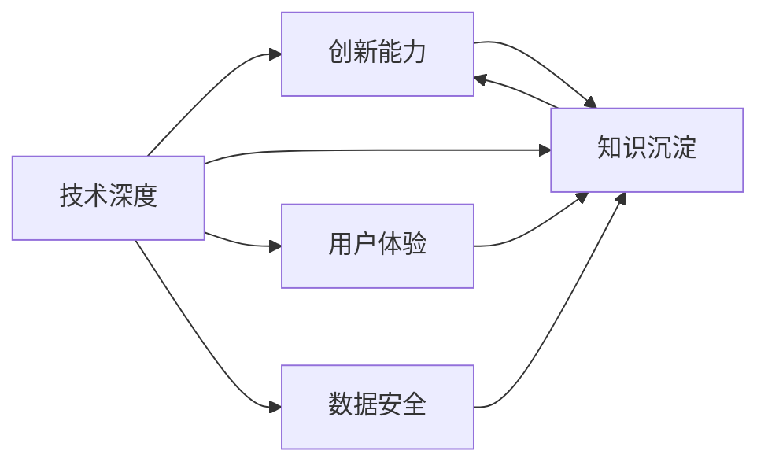

                 

## 1. 背景介绍

### 1.1 问题由来
随着科技的飞速发展，知识经济时代已经悄然来临。程序员作为互联网和信息产业的基石，在知识经济下，正面临前所未有的机遇和挑战。在互联网初创时代，“烧钱跑量”和“快速迭代”是创业成功的关键，而在知识经济下，技术的深度、创新的力度、知识的厚度，才将成为创业成功的核心。

### 1.2 问题核心关键点
1. **技术壁垒**：知识经济下，技术的深度和精度将是创业竞争的关键。只有拥有核心技术，才能在激烈的竞争中脱颖而出。
2. **创新能力**：持续的创新能力是企业持续发展的驱动力，特别是在快速变化的市场环境中，创新驱动的企业才能迅速占领市场份额。
3. **知识沉淀**：知识经济要求企业不仅注重短期收益，更注重知识的积累和沉淀，从而实现长远发展。
4. **用户体验**：在知识经济下，用户体验将成为决定创业成败的关键因素。只有通过数据驱动、深度定制化等方式提升用户体验，才能赢得用户信赖。
5. **安全与隐私**：随着数据价值的凸显，保障数据安全和用户隐私，将成为企业社会责任和法律合规的核心。

### 1.3 问题研究意义
知识经济时代，程序员应将创业方向聚焦于技术创新、用户体验、数据安全等领域，通过持续的创新和知识沉淀，打造具备核心竞争力的技术平台。通过深入研究知识经济下的创业方向，可以为程序员创业提供方向指引，助力他们在新的时代背景下实现技术价值与商业价值的双重飞跃。

## 2. 核心概念与联系

### 2.1 核心概念概述

在知识经济背景下，程序员的创业方向应当围绕技术深度、创新能力、知识沉淀、用户体验和数据安全五大核心概念展开，构建具有前瞻性和持久竞争力的企业。

1. **技术深度**：指在某一领域或技术栈中达到高精尖的程度，能够实现复杂而高效的技术应用。
2. **创新能力**：持续不断地研发新技术，改进产品和服务，保持市场竞争力。
3. **知识沉淀**：在产品开发和商业运营中，注重知识的积累和传承，形成企业核心竞争力和品牌价值。
4. **用户体验**：通过深度定制化、数据驱动等方式，提升产品的用户黏性和满意度。
5. **数据安全**：保护用户数据隐私，遵守法律法规，建立可靠的数据安全体系。

这些核心概念之间相互关联，共同构成了知识经济下程序员创业的基石。

### 2.2 核心概念原理和架构的 Mermaid 流程图



这个流程图展示了技术深度如何促进创新能力，而知识沉淀则是创新能力和技术深度相互作用的基础。同时，用户体验和数据安全与知识沉淀密切相关，共同构建起知识经济下程序员创业的完整框架。

## 3. 核心算法原理 & 具体操作步骤

### 3.1 算法原理概述

在知识经济下，程序员的创业应围绕技术深度、创新能力、知识沉淀、用户体验和数据安全五个核心概念进行技术研发和产品构建。

- **技术深度**：通过持续研发和迭代，在特定技术栈或领域中实现高精尖的技术应用，形成难以复制的竞争壁垒。
- **创新能力**：通过技术深度和知识沉淀，推动产品和服务不断迭代，保持市场竞争力。
- **知识沉淀**：在产品开发和商业运营中，注重知识的积累和传承，形成企业核心竞争力和品牌价值。
- **用户体验**：通过深度定制化、数据驱动等方式，提升产品的用户黏性和满意度。
- **数据安全**：保护用户数据隐私，遵守法律法规，建立可靠的数据安全体系。

### 3.2 算法步骤详解

1. **技术深度提升**
    - 持续技术研发：聚焦于核心技术的深度研究，不断迭代产品技术，提升技术水平。
    - 技术合作与交流：通过技术合作、技术交流等方式，获取外部技术资源，提升技术栈的广度和深度。
    - 技术标准制定：参与行业技术标准的制定，提升技术话语权，形成技术影响力。

2. **创新能力打造**
    - 快速迭代：通过持续的技术研发和用户反馈，快速迭代产品，提升市场竞争力。
    - 产品创新：引入跨界融合思维，进行产品创新，提升产品的附加值和市场影响力。
    - 商业模式创新：探索新型的商业模式，如订阅制、免费增值服务等，提升企业的盈利能力和市场份额。

3. **知识沉淀强化**
    - 知识管理：建立系统的知识管理体系，形成知识库和知识图谱，实现知识的高效沉淀和传承。
    - 知识产权保护：通过专利、商标等知识产权的保护，形成企业的核心竞争力。
    - 知识传播与共享：通过开源项目、技术博客等方式，进行知识传播和共享，提升品牌影响力。

4. **用户体验优化**
    - 数据驱动：通过数据分析和用户反馈，深度定制化产品，提升用户黏性和满意度。
    - 用户体验设计：引入用户体验设计（UX Design）方法，提升产品的界面和交互设计，提升用户体验。
    - 用户社区建设：建立用户社区，进行用户互动，提升用户忠诚度和品牌黏性。

5. **数据安全保障**
    - 数据加密：采用数据加密技术，保护用户数据的隐私和安全。
    - 数据合规：遵守相关法律法规，如GDPR、CCPA等，确保数据使用的合法性和合规性。
    - 安全监控：建立安全监控体系，实时监测数据安全情况，及时发现和应对安全威胁。

### 3.3 算法优缺点

#### 优点
1. **技术深度提升**：通过持续的技术研发，形成高精尖的技术壁垒，保持市场领先地位。
2. **创新能力打造**：快速迭代和产品创新，提升市场竞争力，快速响应市场需求。
3. **知识沉淀强化**：通过知识管理体系和知识产权保护，形成企业的核心竞争力，提升品牌影响力。
4. **用户体验优化**：通过数据驱动和用户体验设计，提升用户黏性和满意度，形成长期用户忠诚。
5. **数据安全保障**：通过数据加密和合规监控，保护用户数据隐私，提升品牌信任度。

#### 缺点
1. **技术研发成本高**：持续的技术研发和创新需要大量的资源投入，可能导致成本压力。
2. **知识沉淀复杂**：建立知识管理体系和保护知识产权需要较高的管理成本和技术投入。
3. **用户体验维护难**：数据驱动和用户体验设计需要持续优化，需投入大量资源。
4. **数据安全风险高**：数据加密和安全监控需要持续投入，且存在潜在的泄露风险。

### 3.4 算法应用领域

知识经济下程序员的创业方向主要应用于以下领域：

1. **人工智能与大数据**
    - 聚焦于机器学习、深度学习、自然语言处理等核心技术，构建智能化应用平台。
    - 通过持续技术研发，提升技术深度和应用场景的广度，形成行业领先地位。

2. **区块链与加密货币**
    - 在区块链技术栈中进行深度研发，构建安全、高效的区块链应用。
    - 通过技术深度和数据安全保障，提升企业信誉和市场竞争力。

3. **物联网与智能设备**
    - 聚焦于物联网核心技术，如传感器、数据采集、数据传输等，构建智能设备平台。
    - 通过技术深度和用户体验优化，提升智能设备的市场影响力和用户黏性。

4. **电子商务与智能营销**
    - 聚焦于电子商务技术栈，如电商后台、物流管理、智能客服等，构建电商平台。
    - 通过数据驱动和用户体验优化，提升电商平台的运营效率和用户体验。

5. **金融科技**
    - 聚焦于金融核心技术，如大数据分析、智能投顾、区块链应用等，构建金融科技平台。
    - 通过技术深度和数据安全保障，提升金融科技平台的安全性和可靠性。

## 4. 数学模型和公式 & 详细讲解

### 4.1 数学模型构建

在知识经济下，程序员的创业方向可以通过以下几个数学模型来衡量和优化：

1. **技术深度模型**：
    - 假设技术深度为 $D$，表示技术栈的广度和深度，可以通过技术研发投入、技术合作和交流、技术标准制定等指标来衡量。

2. **创新能力模型**：
    - 假设创新能力为 $C$，表示产品和服务快速迭代和持续创新的能力，可以通过产品版本更新频率、新功能引入率、市场反馈响应速度等指标来衡量。

3. **知识沉淀模型**：
    - 假设知识沉淀为 $K$，表示企业核心知识和品牌价值的积累，可以通过专利数量、开源项目贡献、知识传播和共享等指标来衡量。

4. **用户体验模型**：
    - 假设用户体验为 $U$，表示用户对产品的黏性和满意度，可以通过用户活跃度、用户满意度评分、用户反馈数量等指标来衡量。

5. **数据安全模型**：
    - 假设数据安全为 $S$，表示数据加密和合规监控的保障水平，可以通过数据泄露事件数量、安全监控覆盖率、合规审计结果等指标来衡量。

### 4.2 公式推导过程

1. **技术深度模型推导**：
    $$
    D = \sum_{i=1}^n D_i
    $$
    其中 $D_i$ 表示第 $i$ 项技术研发投入或技术合作等指标，通过加总计算总的技术深度。

2. **创新能力模型推导**：
    $$
    C = \frac{\Delta P}{\Delta T}
    $$
    其中 $\Delta P$ 表示产品版本更新频率，$\Delta T$ 表示时间间隔，通过计算单位时间内的产品版本更新频率来衡量创新能力。

3. **知识沉淀模型推导**：
    $$
    K = \sum_{i=1}^n K_i
    $$
    其中 $K_i$ 表示第 $i$ 项知识管理、知识产权保护、知识传播和共享等指标，通过加总计算总的知识沉淀。

4. **用户体验模型推导**：
    $$
    U = \frac{A + S + F}{N}
    $$
    其中 $A$ 表示用户活跃度，$S$ 表示用户满意度评分，$F$ 表示用户反馈数量，$N$ 表示总用户数，通过计算用户相关的综合指标来衡量用户体验。

5. **数据安全模型推导**：
    $$
    S = 1 - \frac{E}{T}
    $$
    其中 $E$ 表示数据泄露事件数量，$T$ 表示时间跨度，通过计算单位时间内的数据泄露事件比例来衡量数据安全保障水平。

### 4.3 案例分析与讲解

以智能推荐系统为例，分析程序员创业方向的具体应用。

1. **技术深度**
    - 通过持续的技术研发，实现推荐算法的高效和精确，形成高精尖的技术应用。
    - 引入跨界融合思维，结合NLP、图像识别等技术，提升推荐系统的多样性和深度。

2. **创新能力**
    - 快速迭代产品，根据用户反馈和行为数据，持续优化推荐算法和用户体验。
    - 引入新兴技术，如深度学习、强化学习等，提升推荐系统的智能化水平。

3. **知识沉淀**
    - 建立知识管理体系，形成推荐系统的知识库和知识图谱，实现知识的高效沉淀和传承。
    - 通过专利保护推荐算法，形成核心竞争力，提升品牌影响力。

4. **用户体验**
    - 通过数据分析和用户反馈，深度定制化推荐内容，提升用户黏性和满意度。
    - 引入用户体验设计（UX Design）方法，优化推荐系统的界面和交互设计，提升用户体验。

5. **数据安全**
    - 采用数据加密技术，保护用户数据隐私和安全。
    - 遵守相关法律法规，确保数据使用的合法性和合规性，建立可靠的数据安全体系。

## 5. 项目实践：代码实例和详细解释说明

### 5.1 开发环境搭建

1. **安装Python和相关库**
    - 安装Python：从官网下载并安装Python，建议选择3.x版本。
    - 安装相关库：使用pip安装必要的Python库，如numpy、pandas、scikit-learn等，进行数据分析和机器学习任务。

2. **配置开发环境**
    - 配置虚拟环境：使用virtualenv创建虚拟环境，避免库版本冲突。
    - 配置IDE：选择Python IDE，如PyCharm、Jupyter Notebook等，进行代码编写和调试。

3. **版本控制**
    - 使用Git进行代码版本控制，方便团队协作和代码管理。

### 5.2 源代码详细实现

以智能推荐系统为例，给出使用Python和Scikit-learn库的推荐算法代码实现。

```python
import numpy as np
from sklearn.model_selection import train_test_split
from sklearn.ensemble import RandomForestRegressor
from sklearn.metrics import mean_squared_error

# 数据预处理
def preprocess_data(X):
    # 数据标准化
    mean = np.mean(X, axis=0)
    std = np.std(X, axis=0)
    X = (X - mean) / std
    return X

# 模型训练
def train_model(X_train, y_train, X_test, y_test):
    # 数据划分
    X_train, X_valid, y_train, y_valid = train_test_split(X_train, y_train, test_size=0.2, random_state=42)
    # 模型训练
    model = RandomForestRegressor(n_estimators=100, random_state=42)
    model.fit(X_train, y_train)
    # 模型评估
    y_pred = model.predict(X_test)
    mse = mean_squared_error(y_test, y_pred)
    return mse

# 运行代码
X_train = ...
y_train = ...
X_test = ...
y_test = ...

mse = train_model(X_train, y_train, X_test, y_test)
print(f"Mean Squared Error: {mse:.3f}")
```

### 5.3 代码解读与分析

1. **数据预处理**
    - 使用标准化处理，将数据转换为标准正态分布，方便后续模型训练。
    - 使用train_test_split函数将数据划分为训练集和验证集。

2. **模型训练**
    - 使用随机森林回归模型，设置参数n_estimators为100，随机状态为42。
    - 使用fit函数训练模型，通过validation set进行交叉验证。
    - 使用mean_squared_error函数计算模型在测试集上的均方误差。

3. **运行结果展示**
    - 输出模型在测试集上的均方误差。

## 6. 实际应用场景

### 6.1 智能推荐系统
智能推荐系统可以应用于电商、视频、音乐等多个领域，提升用户体验和个性化推荐水平。

1. **电商推荐系统**
    - 结合用户行为数据和产品标签，构建用户-产品推荐矩阵。
    - 通过深度学习模型，如协同过滤、神经协同过滤等，进行实时推荐。

2. **视频推荐系统**
    - 结合用户观看历史和评价数据，构建用户-视频推荐矩阵。
    - 通过深度学习模型，如卷积神经网络、循环神经网络等，进行实时推荐。

3. **音乐推荐系统**
    - 结合用户听歌历史和评价数据，构建用户-音乐推荐矩阵。
    - 通过深度学习模型，如自编码器、变分自编码器等，进行实时推荐。

### 6.2 智能客服系统
智能客服系统可以应用于客服、金融、医疗等多个领域，提升客户体验和服务效率。

1. **客户服务**
    - 通过自然语言处理技术，如BERT、GPT等，构建智能客服模型。
    - 结合知识库和专家系统，进行问题解答和用户引导。

2. **金融服务**
    - 通过语音识别和自然语言处理技术，构建智能客服机器人。
    - 结合金融知识库和风险评估模型，进行实时金融咨询服务。

3. **医疗咨询**
    - 通过自然语言处理技术，构建智能医疗咨询机器人。
    - 结合医疗知识库和诊断模型，进行实时医疗咨询服务。

### 6.3 智慧城市治理
智慧城市治理可以应用于城市管理、交通管理、公共安全等多个领域，提升城市管理的智能化水平。

1. **城市管理**
    - 通过数据采集和分析技术，构建智慧城市数据平台。
    - 通过机器学习模型，如时间序列分析、聚类分析等，进行城市管理决策支持。

2. **交通管理**
    - 通过物联网技术和数据采集设备，构建智慧交通系统。
    - 通过机器学习模型，如交通流量预测、交通信号优化等，进行交通管理优化。

3. **公共安全**
    - 通过视频监控和数据分析技术，构建智慧公共安全系统。
    - 通过机器学习模型，如异常检测、事件关联等，进行公共安全预警。

### 6.4 未来应用展望

在知识经济下，程序员的创业方向将面临更多的机遇和挑战。未来的趋势包括：

1. **人工智能与大数据的深度融合**
    - 人工智能和大数据技术的深度融合，将带来更多智能应用的诞生，如自动驾驶、智能家居等。

2. **区块链技术的应用扩展**
    - 区块链技术将逐步应用于金融、供应链、医疗等多个领域，带来更加安全和透明的业务模式。

3. **物联网与智能设备的发展**
    - 物联网技术的发展将带来更多智能设备和智能场景，提升人们的生活质量和效率。

4. **电子商务与智能营销的创新**
    - 电子商务和智能营销将持续创新，带来更加个性化和精准的购物体验。

5. **金融科技的突破**
    - 金融科技将继续突破，带来更加智能和高效的金融服务。

6. **智慧城市的智能化**
    - 智慧城市将持续智能化，带来更加高效和智能的城市管理。

## 7. 工具和资源推荐

### 7.1 学习资源推荐

1. **《人工智能概论》**
    - 李航，清华大学出版社，2018年。
    - 介绍人工智能的基础概念、核心技术和发展趋势，适合初学者入门。

2. **《深度学习》**
    - Ian Goodfellow、Yoshua Bengio和Aaron Courville，MIT Press，2016年。
    - 深入介绍深度学习的基本原理和算法，适合深入学习和研究。

3. **《机器学习实战》**
    - Peter Harrington，O'Reilly Media，2016年。
    - 实践指导性强，通过具体案例介绍机器学习的应用，适合实践学习。

4. **Coursera《深度学习专项课程》**
    - Andrew Ng，Coursera，2017年。
    - 系统学习深度学习的基本概念和算法，适合在线学习。

5. **Kaggle**
    - https://www.kaggle.com/
    - 提供丰富的数据集和竞赛平台，适合数据科学和机器学习的实践和研究。

### 7.2 开发工具推荐

1. **PyTorch**
    - 基于Python的开源深度学习框架，适合快速迭代研究。

2. **TensorFlow**
    - 由Google主导开发的开源深度学习框架，生产部署方便，适合大规模工程应用。

3. **Transformers库**
    - HuggingFace开发的NLP工具库，支持PyTorch和TensorFlow，适合NLP任务的开发。

4. **Weights & Biases**
    - 模型训练的实验跟踪工具，可以记录和可视化模型训练过程中的各项指标。

5. **TensorBoard**
    - TensorFlow配套的可视化工具，可实时监测模型训练状态，并提供丰富的图表呈现方式。

### 7.3 相关论文推荐

1. **《Deep Learning》**
    - Ian Goodfellow、Yoshua Bengio和Aaron Courville，MIT Press，2016年。
    - 介绍深度学习的基本概念、核心算法和应用。

2. **《Natural Language Processing with Transformers》**
    - Thomas Wolf，Nature，2020年。
    - 全面介绍Transformer模型的原理、应用和未来发展。

3. **《Parameter-Efficient Transfer Learning for NLP》**
    - Shuohuan Wang、Aishwarya Venkatesh、Michael Collins，ICML，2019年。
    - 提出Adapter等参数高效微调方法，在固定大部分预训练参数的情况下，只更新极少量的任务相关参数。

4. **《AdaLoRA: Adaptive Low-Rank Adaptation for Parameter-Efficient Fine-Tuning》**
    - Wang Xin、Shun-Wei Chen、Ming-Hsiang Ko，ICLR，2022年。
    - 使用自适应低秩适应的微调方法，在保证性能的同时，简化模型结构，提升推理速度。

## 8. 总结：未来发展趋势与挑战

### 8.1 研究成果总结

知识经济时代，程序员的创业方向需要围绕技术深度、创新能力、知识沉淀、用户体验和数据安全五个核心概念展开，构建具有前瞻性和持久竞争力的企业。通过持续的技术研发和创新，形成高精尖的技术壁垒，保持市场领先地位。通过数据驱动和用户体验设计，提升产品的用户黏性和满意度。通过数据加密和合规监控，保护用户数据隐私，提升品牌信任度。

### 8.2 未来发展趋势

1. **技术深度提升**
    - 聚焦于核心技术的深度研究，不断迭代产品技术，提升技术水平。
    - 引入跨界融合思维，进行产品创新，提升产品的附加值和市场影响力。

2. **创新能力打造**
    - 快速迭代产品，根据用户反馈和行为数据，持续优化推荐算法和用户体验。
    - 引入新兴技术，如深度学习、强化学习等，提升推荐系统的智能化水平。

3. **知识沉淀强化**
    - 建立知识管理体系，形成推荐系统的知识库和知识图谱，实现知识的高效沉淀和传承。
    - 通过专利保护推荐算法，形成核心竞争力，提升品牌影响力。

4. **用户体验优化**
    - 通过数据分析和用户反馈，深度定制化推荐内容，提升用户黏性和满意度。
    - 引入用户体验设计（UX Design）方法，优化推荐系统的界面和交互设计，提升用户体验。

5. **数据安全保障**
    - 采用数据加密技术，保护用户数据隐私和安全。
    - 遵守相关法律法规，确保数据使用的合法性和合规性，建立可靠的数据安全体系。

### 8.3 面临的挑战

1. **技术研发成本高**
    - 持续的技术研发和创新需要大量的资源投入，可能导致成本压力。

2. **知识沉淀复杂**
    - 建立知识管理体系和保护知识产权需要较高的管理成本和技术投入。

3. **用户体验维护难**
    - 数据驱动和用户体验设计需要持续优化，需投入大量资源。

4. **数据安全风险高**
    - 数据加密和安全监控需要持续投入，且存在潜在的泄露风险。

### 8.4 研究展望

未来的研究需要在以下几个方面寻求新的突破：

1. **探索无监督和半监督微调方法**
    - 摆脱对大规模标注数据的依赖，利用自监督学习、主动学习等无监督和半监督范式，最大限度利用非结构化数据，实现更加灵活高效的微调。

2. **研究参数高效和计算高效的微调范式**
    - 开发更加参数高效的微调方法，在固定大部分预训练参数的同时，只更新极少量的任务相关参数。同时优化微调模型的计算图，减少前向传播和反向传播的资源消耗，实现更加轻量级、实时性的部署。

3. **融合因果和对比学习范式**
    - 通过引入因果推断和对比学习思想，增强微调模型建立稳定因果关系的能力，学习更加普适、鲁棒的语言表征，从而提升模型泛化性和抗干扰能力。

4. **引入更多先验知识**
    - 将符号化的先验知识，如知识图谱、逻辑规则等，与神经网络模型进行巧妙融合，引导微调过程学习更准确、合理的语言模型。同时加强不同模态数据的整合，实现视觉、语音等多模态信息与文本信息的协同建模。

5. **结合因果分析和博弈论工具**
    - 将因果分析方法引入微调模型，识别出模型决策的关键特征，增强输出解释的因果性和逻辑性。借助博弈论工具刻画人机交互过程，主动探索并规避模型的脆弱点，提高系统稳定性。

6. **纳入伦理道德约束**
    - 在模型训练目标中引入伦理导向的评估指标，过滤和惩罚有偏见、有害的输出倾向。同时加强人工干预和审核，建立模型行为的监管机制，确保输出符合人类价值观和伦理道德。

## 9. 附录：常见问题与解答

**Q1：知识经济下，程序员的创业方向是什么？**

A: 知识经济下，程序员的创业方向应围绕技术深度、创新能力、知识沉淀、用户体验和数据安全五个核心概念展开，构建具有前瞻性和持久竞争力的企业。通过持续的技术研发和创新，形成高精尖的技术壁垒，保持市场领先地位。通过数据驱动和用户体验设计，提升产品的用户黏性和满意度。通过数据加密和合规监控，保护用户数据隐私，提升品牌信任度。

**Q2：如何选择创业方向？**

A: 选择创业方向时，应从技术深度、市场机会、团队能力等多个方面进行综合评估。选择技术壁垒高、市场潜力大、团队能力强的方向，有助于提升创业成功率。

**Q3：如何获取高质量的标注数据？**

A: 获取高质量的标注数据可以从开源数据集、众包平台、用户反馈等多个渠道入手。同时，可以采用半监督学习和无监督学习的方法，最大限度利用数据资源，提升标注数据的质量和数量。

**Q4：如何进行产品迭代和优化？**

A: 产品迭代和优化应基于用户反馈和行为数据，通过A/B测试、用户调研等方式，不断改进产品功能和用户体验。同时，应持续关注技术趋势和市场需求，及时引入新技术和新功能，提升产品竞争力。

**Q5：如何保障数据安全？**

A: 保障数据安全应从数据加密、合规监控、用户隐私保护等多个方面入手。应采用先进的数据加密技术，遵守相关法律法规，确保数据使用的合法性和合规性。同时，应建立可靠的数据安全体系，定期进行安全评估和风险管理。

