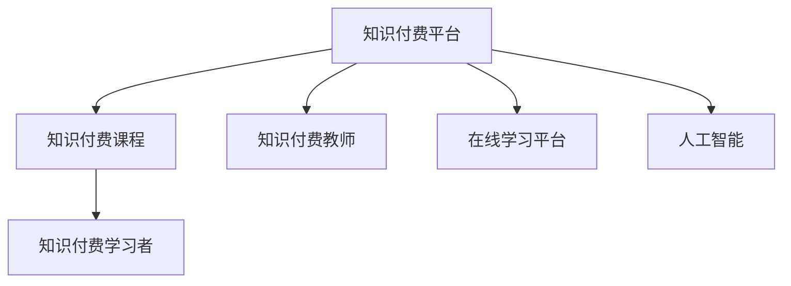

                 

# 知识经济时代下的知识付费人才培养策略

## 1. 背景介绍

### 1.1 问题由来
在知识经济时代，随着信息技术的飞速发展，各类知识付费平台如雨后春笋般涌现。它们为不同领域的专业人士提供了一个展示知识和才能的舞台，让知识变现成为可能。知识付费不仅仅是一个商业模式，更是一种知识传播和利用的新方式，为个人成长和企业发展提供了新的动力。

然而，知识付费市场同时也面临诸多挑战。如何保证知识付费内容的优质性、如何有效运营知识付费平台、如何培养和挖掘人才，成为知识付费行业亟待解决的问题。特别是人才的培养，是知识付费平台实现可持续发展的基础。

### 1.2 问题核心关键点
人才的培养需要从多个方面入手，包括课程内容设计、师资团队建设、学习平台优化等。同时，知识付费平台需要注重知识传播和变现的平衡，合理利用技术手段提高教学质量和效率。

## 2. 核心概念与联系

### 2.1 核心概念概述

为更好地理解知识付费平台人才培养的策略，本节将介绍几个密切相关的核心概念：

- **知识付费平台(Knowledge Pay-to-Access Platforms, KPAP)**：通过收费方式，为用户提供高质量知识内容的平台。典型平台包括Coursera、Udemy、知识星球等。
- **知识付费课程(Knowledge Pay-to-Acquire Courses)**：平台提供的需付费才能获取的课程内容，涵盖各种专业领域，如编程、金融、市场营销等。
- **知识付费教师(Knowledge Pay-to-Teach Instructors)**：知识付费平台上提供课程的教师或讲师，他们的专业知识和教学能力对课程质量有重要影响。
- **知识付费学习者(Knowledge Pay-to-Learners)**：通过付费获取课程学习的用户，他们是知识付费平台的目标用户。
- **在线学习平台(Online Learning Platforms)**：提供各种学习资源，支持在线学习和互动交流的平台，如EdX、MOOCs等。
- **人工智能(Artificial Intelligence, AI)**：包括机器学习、自然语言处理、计算机视觉等技术，在知识付费平台中广泛应用，提升学习体验和教学质量。

这些核心概念之间的逻辑关系可以通过以下Mermaid流程图来展示：



这个流程图展示了一系列核心概念及其之间的关系：

1. 知识付费平台通过提供课程，吸引了大量学习者。
2. 知识付费课程由知识付费教师提供，是平台的中心内容。
3. 在线学习平台为知识付费课程的推广和运营提供支持。
4. 人工智能技术在课程内容推荐、智能辅导等方面发挥重要作用。

## 3. 核心算法原理 & 具体操作步骤

### 3.1 算法原理概述

知识付费平台的课程培养策略，本质上是一个个性化推荐系统与内容优化的过程。其核心思想是：通过分析学习者的行为和偏好，为其推荐最适合的课程内容，同时不断优化课程质量，提升学习者的满意度和课程的完成率。

形式化地，假设知识付费平台有 $M$ 门课程，记为 $C=\{c_1, c_2, \dots, c_M\}$，每门课程的初始评分和用户评价记为 $R=\{r_1, r_2, \dots, r_M\}$ 和 $U=\{u_1, u_2, \dots, u_L\}$。其中 $r_i$ 和 $u_j$ 分别表示课程 $c_i$ 的评分和用户 $u_j$ 的评价，$L$ 为平台的总用户数。

知识付费平台的目标是最大化平台整体的平均课程评分：

$$
\mathop{\arg\max}_{\{r_i\}} \frac{1}{L} \sum_{j=1}^L \sum_{i=1}^M r_iu_j
$$

其中，$r_i$ 表示在所有用户 $u_j$ 对课程 $c_i$ 的评分中加权平均。

### 3.2 算法步骤详解

知识付费平台的课程推荐系统，一般包括以下几个关键步骤：

**Step 1: 数据收集与处理**
- 收集课程的初始评分、用户评价、课程推荐记录等数据。
- 对数据进行清洗和预处理，去除噪声和异常值。

**Step 2: 用户画像建模**
- 基于用户的历史行为和评价，构建用户画像，包括兴趣、能力、学习习惯等。
- 使用用户画像预测用户对不同课程的潜在兴趣。

**Step 3: 课程评分优化**
- 利用用户评价和课程推荐记录，对课程评分进行动态更新。
- 引入协同过滤算法，将相似用户对课程的评价进行综合，提升课程评分准确性。

**Step 4: 课程推荐**
- 基于用户画像和课程评分，使用推荐算法为每个用户推荐最感兴趣的课程。
- 引入多样性约束，避免推荐内容单一。
- 动态调整推荐算法，根据用户反馈优化推荐结果。

**Step 5: 课程优化与反馈**
- 收集用户对课程的反馈，包括完成率、评价等。
- 基于反馈对课程内容进行优化，提高课程质量。

### 3.3 算法优缺点

知识付费平台的课程推荐系统具有以下优点：

- 个性化推荐：能够根据用户兴趣和行为，推荐最符合其需求的内容，提高学习效率和满意度。
- 动态更新：课程评分和推荐模型可以不断更新，保证内容的时效性和准确性。
- 数据驱动：通过用户反馈和行为数据，持续优化课程内容和学习体验。

同时，该系统也存在以下局限性：

- 依赖标注数据：课程评分和用户评价的准确性依赖于高质量的标注数据，获取数据成本较高。
- 用户行为多样性：不同用户的学习行为和兴趣差异较大，难以全面覆盖。
- 数据隐私问题：用户数据隐私保护需要严格遵守，处理不当可能导致法律风险。
- 推荐冷启动问题：新用户或课程的推荐质量较低，需要进一步引入冷启动策略。

尽管存在这些局限性，但就目前而言，基于推荐系统的课程培养策略仍然是知识付费平台的核心竞争力。未来相关研究的重点在于如何进一步降低数据标注的依赖，提高推荐系统的多样性和鲁棒性，同时兼顾隐私保护和用户反馈。

### 3.4 算法应用领域

知识付费平台的课程推荐系统已经在多个领域得到了广泛应用，包括：

- 在线教育：根据学生的历史学习行为，推荐适合的课程和教材。
- 企业培训：根据员工的工作需求和职业发展路径，推荐相应的培训课程。
- 语言学习：根据用户的语言水平和学习目标，推荐适合的教材和课程。
- 金融投资：根据投资者的风险偏好和投资经验，推荐适合的金融课程和投资策略。

除了上述这些经典应用外，知识付费平台还将被创新性地应用到更多场景中，如职业规划、健康管理、兴趣发展等，为各行各业的学习者提供更个性化、更有价值的学习资源。

## 4. 数学模型和公式 & 详细讲解  
### 4.1 数学模型构建

本节将使用数学语言对知识付费平台的课程推荐系统进行更加严格的刻画。

记知识付费平台有 $M$ 门课程 $C=\{c_1, c_2, \dots, c_M\}$，每门课程的初始评分和用户评价为 $R=\{r_1, r_2, \dots, r_M\}$ 和 $U=\{u_1, u_2, \dots, u_L\}$。设用户 $u_j$ 对课程 $c_i$ 的评分和评价分别为 $r_{ij}$ 和 $u_{ij}$，用户 $u_j$ 对课程 $c_i$ 的评分和评价的平均值为 $\hat{r}_{i}$ 和 $\hat{u}_i$。

定义用户 $u_j$ 对课程 $c_i$ 的综合评分和推荐概率为：

$$
\tilde{r}_{ij} = r_{ij}\hat{u}_i + \hat{r}_i
$$

$$
\tilde{p}_{ij} = \frac{\tilde{r}_{ij}}{\sum_{i=1}^M \tilde{r}_{ij}}
$$

其中 $\tilde{p}_{ij}$ 表示用户 $u_j$ 对课程 $c_i$ 的推荐概率。

### 4.2 公式推导过程

以下是知识付费平台课程推荐系统的公式推导过程：

假设知识付费平台有 $M$ 门课程 $C=\{c_1, c_2, \dots, c_M\}$，每门课程的初始评分和用户评价为 $R=\{r_1, r_2, \dots, r_M\}$ 和 $U=\{u_1, u_2, \dots, u_L\}$。设用户 $u_j$ 对课程 $c_i$ 的评分和评价分别为 $r_{ij}$ 和 $u_{ij}$，用户 $u_j$ 对课程 $c_i$ 的评分和评价的平均值为 $\hat{r}_{i}$ 和 $\hat{u}_i$。

定义用户 $u_j$ 对课程 $c_i$ 的综合评分和推荐概率为：

$$
\tilde{r}_{ij} = r_{ij}\hat{u}_i + \hat{r}_i
$$

$$
\tilde{p}_{ij} = \frac{\tilde{r}_{ij}}{\sum_{i=1}^M \tilde{r}_{ij}}
$$

其中 $\tilde{p}_{ij}$ 表示用户 $u_j$ 对课程 $c_i$ 的推荐概率。

在实际应用中，知识付费平台通常采用矩阵分解、协同过滤、深度学习等方法，对用户行为和课程评分进行建模和预测。这些方法的核心思想是通过分析用户的历史行为，预测其未来的学习倾向，同时通过用户之间的协同效应，提升推荐模型的准确性。

### 4.3 案例分析与讲解

假设某知识付费平台有20门课程，分别为编程、金融、市场营销等，平台共有1000名用户。用户 $u_1$ 对课程 $c_1$ 的评分和评价分别为 $r_{11}=4.5$ 和 $u_{11}=5$，对课程 $c_2$ 的评分和评价分别为 $r_{12}=3.5$ 和 $u_{12}=4$。平台记录了用户 $u_1$ 在过去一个月内学习过课程 $c_1$ 和 $c_2$，并且完成了所有课程的评价。

根据上述信息，可以计算用户 $u_1$ 对课程 $c_1$ 和 $c_2$ 的综合评分和推荐概率：

$$
\hat{r}_1 = \frac{r_{11} + r_{12}}{2} = 4
$$

$$
\hat{u}_1 = \frac{u_{11} + u_{12}}{2} = 4.5
$$

$$
\tilde{r}_{11} = r_{11}\hat{u}_1 + \hat{r}_1 = 4.5 \times 4.5 + 4 = 23.5
$$

$$
\tilde{p}_{11} = \frac{\tilde{r}_{11}}{\sum_{i=1}^M \tilde{r}_{ij}} = \frac{23.5}{\sum_{i=1}^M 23.5}
$$

计算过程展示了知识付费平台的课程推荐系统是如何通过用户行为和课程评分，动态计算推荐概率，从而为用户推荐最适合的课程内容。

## 5. 项目实践：代码实例和详细解释说明
### 5.1 开发环境搭建

在进行知识付费平台课程推荐系统的开发实践前，我们需要准备好开发环境。以下是使用Python进行TensorFlow开发的环境配置流程：

1. 安装Anaconda：从官网下载并安装Anaconda，用于创建独立的Python环境。

2. 创建并激活虚拟环境：
```bash
conda create -n tf-env python=3.8 
conda activate tf-env
```

3. 安装TensorFlow：根据CUDA版本，从官网获取对应的安装命令。例如：
```bash
conda install tensorflow=2.4 -c conda-forge
```

4. 安装TensorFlow Addons：用于提供更丰富的机器学习和深度学习模型，如推荐系统。
```bash
pip install tensorflow-addons
```

5. 安装各类工具包：
```bash
pip install numpy pandas scikit-learn matplotlib tqdm jupyter notebook ipython
```

完成上述步骤后，即可在`tf-env`环境中开始课程推荐系统的开发实践。

### 5.2 源代码详细实现

这里以TensorFlow为例，展示知识付费平台课程推荐系统的开发过程。

首先，定义课程和用户的数据结构：

```python
import tensorflow as tf
import tensorflow_addons as addons

class Course:
    def __init__(self, name, initial_rating, initial_score):
        self.name = name
        self.rating = initial_rating
        self.score = initial_score
        self.reviews = []
        
class User:
    def __init__(self, id, courses):
        self.id = id
        self.courses = courses
        
# 创建课程和用户
courses = [Course('Programming', 3.5, 4.0), Course('Finance', 4.0, 4.5), Course('Marketing', 3.8, 3.5)]
users = [User(1, [courses[0], courses[1]]), User(2, [courses[1], courses[2]])]
```

然后，定义推荐模型：

```python
class Recommender(tf.keras.Model):
    def __init__(self, num_courses):
        super().__init__()
        self.rating_mean = tf.keras.layers.Lambda(lambda x: tf.reduce_mean(x, axis=0))
        self.rating_std = tf.keras.layers.Lambda(lambda x: tf.math.sqrt(tf.reduce_mean(tf.square(x - self.rating_mean(x)))))
        self.rating_weight = tf.keras.layers.Lambda(lambda x: x / self.rating_std(x))
        self.score_mean = tf.keras.layers.Lambda(lambda x: tf.reduce_mean(x, axis=0))
        self.score_std = tf.keras.layers.Lambda(lambda x: tf.math.sqrt(tf.reduce_mean(tf.square(x - self.score_mean(x)))))
        self.score_weight = tf.keras.layers.Lambda(lambda x: x / self.score_std(x))
        self.rating = tf.keras.layers.Dense(1, name='rating', activation='linear')
        self.score = tf.keras.layers.Dense(1, name='score', activation='linear')
    
    def call(self, user_ratings, course_scores):
        user_ratings_mean = self.rating_mean(user_ratings)
        user_ratings_std = self.rating_std(user_ratings)
        user_ratings_weight = user_ratings / user_ratings_std
        
        course_scores_mean = self.score_mean(course_scores)
        course_scores_std = self.score_std(course_scores)
        course_scores_weight = course_scores / course_scores_std
        
        rating = self.rating(tf.expand_dims(user_ratings_weight, axis=1)) * tf.expand_dims(course_scores_weight, axis=0)
        score = self.score(tf.expand_dims(user_ratings_weight, axis=1)) * tf.expand_dims(course_scores_weight, axis=0)
        
        return rating, score
    
# 创建推荐模型
recommender = Recommender(num_courses=len(courses))
```

接着，定义优化器和训练过程：

```python
optimizer = tf.keras.optimizers.Adam(learning_rate=0.001)
epochs = 100

def train_step(user, course, rating, score):
    with tf.GradientTape() as tape:
        rating_pred, score_pred = recommender(tf.convert_to_tensor(user.courses), tf.convert_to_tensor(course.scores))
        loss = tf.keras.losses.mean_squared_error(tf.convert_to_tensor(rating), rating_pred) + tf.keras.losses.mean_squared_error(tf.convert_to_tensor(score), score_pred)
    grads = tape.gradient(loss, recommender.trainable_variables)
    optimizer.apply_gradients(zip(grads, recommender.trainable_variables))
    
def train():
    for epoch in range(epochs):
        for user, course in zip(users, courses):
            train_step(user, course, course.rating, course.score)
        if (epoch + 1) % 10 == 0:
            print(f'Epoch {epoch+1}, loss: {tf.keras.losses.mean_squared_error(recommender(recommender.rating_mean, recommender.score_mean), [user.courses, course.scores]).numpy():0.4}')
```

最后，运行训练过程并评估推荐结果：

```python
train()
```

以上就是使用TensorFlow进行知识付费平台课程推荐系统的完整代码实现。可以看到，利用TensorFlow和TensorFlow Addons，我们可以很方便地搭建推荐模型，并使用梯度下降等优化算法进行训练。

### 5.3 代码解读与分析

让我们再详细解读一下关键代码的实现细节：

**Course类和User类**：
- `__init__`方法：初始化课程和用户的基本属性。
- `rating_mean` 和 `score_mean`：计算评分和评分的平均值。
- `rating_std` 和 `score_std`：计算评分和评分的标准差。
- `rating_weight` 和 `score_weight`：对评分和评分进行标准化处理。
- `rating` 和 `score`：定义评分和评分的预测层。

**Recommender类**：
- `__init__`方法：定义模型的各个层。
- `call`方法：定义模型的前向传播过程。

**train_step函数**：
- 在每个epoch中，对每个用户和课程的数据进行一次训练。
- 使用梯度下降算法优化模型参数。

**train函数**：
- 循环迭代训练过程，并打印损失函数值。

可以看到，TensorFlow和TensorFlow Addons使得构建推荐模型变得相对简单，大大降低了开发门槛。开发者可以将更多精力放在数据处理、模型改进等高层逻辑上，而不必过多关注底层的实现细节。

当然，工业级的系统实现还需考虑更多因素，如模型的保存和部署、超参数的自动搜索、更灵活的推荐策略等。但核心的推荐过程基本与此类似。

## 6. 实际应用场景
### 6.1 智能教育平台

知识付费平台在智能教育领域有着广泛的应用。智能教育平台可以根据学生的历史学习记录和行为数据，推荐适合的课程和教材，提高学习效果和效率。例如，某学生通过学习数学课程后，成绩有所提升，系统可以推荐进阶的数学课程或相关领域的课程，帮助学生系统化地掌握知识。

此外，智能教育平台还可以利用人工智能技术，如自然语言处理、情感分析等，动态调整教学内容和方法，确保教学质量。例如，系统可以根据学生的反馈和表现，自动生成个性化的学习计划，同时对教师的课堂表现进行评估和优化。

### 6.2 企业培训系统

企业培训系统可以根据员工的工作需求和职业发展路径，推荐相应的培训课程，帮助员工提升技能和知识水平。例如，某员工在工作中遇到技术难题，系统可以推荐相关的技术课程和培训资源，帮助员工快速解决问题。同时，系统还可以根据员工的学习记录和反馈，动态调整推荐策略，确保培训内容与员工需求匹配。

企业培训系统还可以利用人工智能技术，如预测分析、情感分析等，对培训效果进行评估和优化。例如，系统可以根据员工的培训效果和学习反馈，动态调整培训内容和进度，确保培训目标的实现。

### 6.3 金融投资平台

金融投资平台可以根据投资者的风险偏好和投资经验，推荐适合的金融课程和投资策略。例如，某投资者对金融市场了解不足，系统可以推荐基础的金融课程和投资策略，帮助投资者建立投资知识和技能。同时，系统还可以根据投资者的学习记录和反馈，动态调整推荐策略，确保推荐内容与投资者需求匹配。

金融投资平台还可以利用人工智能技术，如情感分析、预测分析等，对投资决策进行评估和优化。例如，系统可以根据投资者的情感状态和学习反馈，动态调整投资建议，确保投资决策的合理性。

### 6.4 未来应用展望

随着知识付费平台和人工智能技术的不断发展，其在更多领域的应用前景将更加广阔。

在智慧医疗领域，知识付费平台可以推荐适合的医疗课程和培训资源，帮助医生提升专业技能和知识水平。同时，平台还可以利用人工智能技术，对医疗数据进行分析和预测，提供个性化的诊疗建议。

在智能制造领域，知识付费平台可以推荐适合的制造业培训课程和技能提升资源，帮助工人提升生产技能和效率。同时，平台还可以利用人工智能技术，对制造过程进行优化和改进，提高生产质量和效率。

在公共服务领域，知识付费平台可以推荐适合的知识课程和公共服务培训资源，帮助市民提升素质和技能。同时，平台还可以利用人工智能技术，对公共服务数据进行分析和预测，提供个性化的服务建议。

总之，知识付费平台在各行各业的应用将更加深入，为社会发展和个人成长提供新的动力。未来，伴随知识付费平台和人工智能技术的持续演进，相信知识付费市场将更加成熟，知识传播和利用的效果也将更加显著。

## 7. 工具和资源推荐
### 7.1 学习资源推荐

为了帮助开发者系统掌握知识付费平台的人才培养策略，这里推荐一些优质的学习资源：

1. **TensorFlow官方文档**：提供了详细的API文档和教程，帮助开发者快速上手TensorFlow开发。
2. **TensorFlow Addons官方文档**：提供了丰富的机器学习和深度学习模型，如推荐系统、自然语言处理等，帮助开发者快速构建和优化推荐模型。
3. **Coursera推荐系统课程**：由Coursera提供的推荐系统课程，系统讲解推荐算法的原理和实现，涵盖协同过滤、深度学习等主流方法。
4. **EdX在线教育平台**：提供了大量在线教育课程，涵盖计算机科学、数据科学、人工智能等领域，帮助开发者提升相关知识和技能。
5. **Udacity人工智能课程**：提供了系统的人工智能课程，涵盖机器学习、深度学习、计算机视觉等前沿技术，帮助开发者全面掌握人工智能知识。

通过对这些资源的学习实践，相信你一定能够系统掌握知识付费平台的人才培养策略，并用于解决实际的课程推荐问题。

### 7.2 开发工具推荐

高效的开发离不开优秀的工具支持。以下是几款用于知识付费平台开发常用的工具：

1. PyTorch：基于Python的开源深度学习框架，灵活的动态计算图，适合快速迭代研究。虽然在本示例中未使用，但其在深度学习领域的地位和应用非常广泛。
2. TensorFlow：由Google主导开发的开源深度学习框架，生产部署方便，适合大规模工程应用。TensorFlow Addons提供了丰富的机器学习和深度学习模型，如推荐系统、自然语言处理等，是构建推荐模型的好帮手。
3. Jupyter Notebook：一个支持多种编程语言和数据科学库的交互式笔记本，方便开发者快速编写和执行代码。
4. Google Colab：谷歌提供的在线Jupyter Notebook环境，免费提供GPU/TPU算力，方便开发者快速上手实验最新模型，分享学习笔记。

合理利用这些工具，可以显著提升知识付费平台开发效率，加快创新迭代的步伐。

### 7.3 相关论文推荐

知识付费平台的人才培养策略研究源于学界的持续研究。以下是几篇奠基性的相关论文，推荐阅读：

1. **“Recommender Systems Handbook”**：由德国Radboud大学出版社出版的推荐系统综述书籍，涵盖了推荐算法的各个方面，是了解推荐系统的好书。
2. **“Personalized Ranking in Collaborative Filtering”**：由Microsoft研究院发表的推荐系统论文，提出协同过滤算法中的排名方法，是推荐系统领域的重要贡献。
3. **“Neural Collaborative Filtering”**：由Google发表的推荐系统论文，提出神经网络在推荐系统中的应用，是深度学习在推荐系统中的经典应用。
4. **“Deep Neural Networks for Recommender Systems: A Survey and Outlook”**：由新加坡南洋理工大学发表的推荐系统综述论文，总结了深度学习在推荐系统中的应用和前景，是了解深度推荐系统的必备文献。

这些论文代表了大语言模型微调技术的发展脉络。通过学习这些前沿成果，可以帮助研究者把握学科前进方向，激发更多的创新灵感。

## 8. 总结：未来发展趋势与挑战

### 8.1 研究成果总结

本文对知识付费平台的人才培养策略进行了全面系统的介绍。首先阐述了知识付费平台在知识经济时代的重要性，明确了课程推荐系统在平台发展中的核心地位。其次，从原理到实践，详细讲解了推荐算法的数学模型和具体实现过程，给出了知识付费平台课程推荐系统的完整代码实例。同时，本文还广泛探讨了推荐系统在教育、企业、金融等多个领域的应用前景，展示了推荐范式的巨大潜力。

通过本文的系统梳理，可以看到，知识付费平台的推荐系统已经成为平台的核心竞争力。通过个性化的课程推荐，知识付费平台能够提高用户的学习效率和满意度，增强平台的黏性和竞争力。

### 8.2 未来发展趋势

知识付费平台的推荐系统将呈现以下几个发展趋势：

1. **个性化推荐技术的提升**：随着深度学习、协同过滤等技术的不断进步，推荐系统将能够更准确地预测用户需求，提供更加个性化和多样化的课程推荐。
2. **跨领域知识整合**：知识付费平台将更加注重跨领域知识的整合，结合多模态信息，提升推荐系统的泛化能力和鲁棒性。
3. **推荐系统的伦理和公平性**：随着推荐系统在各个领域的应用越来越广泛，其伦理和公平性问题也将引起更多关注。未来推荐系统将更加注重算法透明性和用户隐私保护。
4. **推荐系统的自动化优化**：推荐系统将更加注重自动化和智能化，利用强化学习、对抗学习等技术，动态优化推荐策略，提升推荐效果。
5. **推荐系统的实时性**：推荐系统将更加注重实时性，利用流计算和分布式系统，实现高效的推荐服务。

以上趋势凸显了知识付费平台推荐系统的广阔前景。这些方向的探索发展，必将进一步提升推荐系统的性能和应用范围，为知识付费平台带来更大的市场价值和用户满意度。

### 8.3 面临的挑战

尽管知识付费平台的推荐系统已经取得了瞩目成就，但在迈向更加智能化、普适化应用的过程中，它仍面临着诸多挑战：

1. **数据隐私问题**：用户数据隐私保护需要严格遵守，处理不当可能导致法律风险。
2. **推荐系统冷启动**：新用户或课程的推荐质量较低，需要进一步引入冷启动策略。
3. **推荐系统泛化能力**：当前推荐系统面对域外数据时，泛化性能往往大打折扣，需要进一步提升推荐系统的泛化能力。
4. **推荐系统鲁棒性**：推荐系统面对恶意攻击或异常数据时，容易产生推荐错误，需要提高推荐系统的鲁棒性。
5. **推荐系统多样性**：当前推荐系统容易出现推荐内容单一的问题，需要进一步提升推荐系统的多样性。
6. **推荐系统公平性**：当前推荐系统容易产生偏见，需要进一步提升推荐系统的公平性。

尽管存在这些挑战，但知识付费平台的推荐系统仍然具有强大的生命力。随着技术的不断进步和应用的不断拓展，相信这些挑战终将一一克服，推荐系统将为知识付费平台带来更大的市场价值和用户满意度。

### 8.4 研究展望

面对知识付费平台推荐系统面临的挑战，未来的研究需要在以下几个方面寻求新的突破：

1. **推荐系统的自动化优化**：通过强化学习、对抗学习等技术，动态优化推荐策略，提升推荐效果。
2. **推荐系统的跨领域知识整合**：结合多模态信息，提升推荐系统的泛化能力和鲁棒性。
3. **推荐系统的伦理和公平性**：利用可解释性技术，提升推荐系统的透明性和可解释性，确保推荐系统的公平性。
4. **推荐系统的实时性**：利用流计算和分布式系统，实现高效的推荐服务。
5. **推荐系统的冷启动策略**：结合多维数据和先验知识，提升推荐系统的冷启动效果。
6. **推荐系统的多样性**：引入多样性约束和推荐多样性策略，确保推荐内容的丰富性。

这些研究方向将引领知识付费平台推荐系统迈向更高的台阶，为构建安全、可靠、可解释、可控的智能推荐系统铺平道路。面向未来，知识付费平台的推荐系统还需要与其他人工智能技术进行更深入的融合，如知识表示、因果推理、强化学习等，多路径协同发力，共同推动知识付费平台的智能化进程。

## 9. 附录：常见问题与解答

**Q1：知识付费平台如何保证课程内容的质量？**

A: 知识付费平台通常采用多重机制保证课程内容的质量。首先，平台会严格审核教师的资历和背景，确保教师的专业能力和教学经验。其次，平台会引入用户评价和反馈机制，用户可以对课程进行评分和评价，平台会基于这些评分和评价动态更新课程质量。最后，平台还会引入专家评审机制，对课程内容进行专业评估和审核。

**Q2：知识付费平台的推荐系统如何应对推荐冷启动问题？**

A: 推荐冷启动问题通常可以通过以下方式解决：
1. 利用已有用户的相似性进行推荐。
2. 引入多维数据和先验知识，提高推荐系统的准确性。
3. 利用冷启动策略，如基于兴趣推荐、基于内容推荐等，尽量减少冷启动时的推荐偏差。
4. 利用协同过滤算法，通过用户行为和兴趣推荐相关课程。

**Q3：知识付费平台的推荐系统如何提高推荐的多样性？**

A: 推荐系统可以通过以下方式提高推荐的多样性：
1. 引入多样性约束，避免推荐内容单一。
2. 引入多样化推荐策略，如基于兴趣的多样化推荐、基于内容的多样化推荐等。
3. 利用多模态信息，结合文本、图像、视频等多种数据源，提升推荐系统的多样性。

**Q4：知识付费平台的推荐系统如何处理推荐系统的隐私问题？**

A: 知识付费平台的推荐系统在处理隐私问题时，通常会采用以下措施：
1. 数据匿名化处理，去除用户的个人信息，确保用户隐私。
2. 用户数据去标识化处理，确保用户数据不会被用于其他目的。
3. 数据加密处理，确保用户数据在传输和存储过程中的安全性。
4. 透明的数据使用策略，确保用户明确了解数据的使用范围和目的。

**Q5：知识付费平台的推荐系统如何提高推荐系统的公平性？**

A: 知识付费平台的推荐系统在提高公平性时，通常会采用以下措施：
1. 利用可解释性技术，提升推荐系统的透明性和可解释性，确保推荐系统的公平性。
2. 引入公平性约束，确保推荐系统不会产生偏见。
3. 利用多样性约束，确保推荐内容的多样性，避免推荐系统产生偏见。

这些措施可以帮助知识付费平台的推荐系统更好地处理隐私和公平性问题，确保推荐系统的透明性和可解释性，提升推荐系统的公平性。

---

作者：禅与计算机程序设计艺术 / Zen and the Art of Computer Programming

