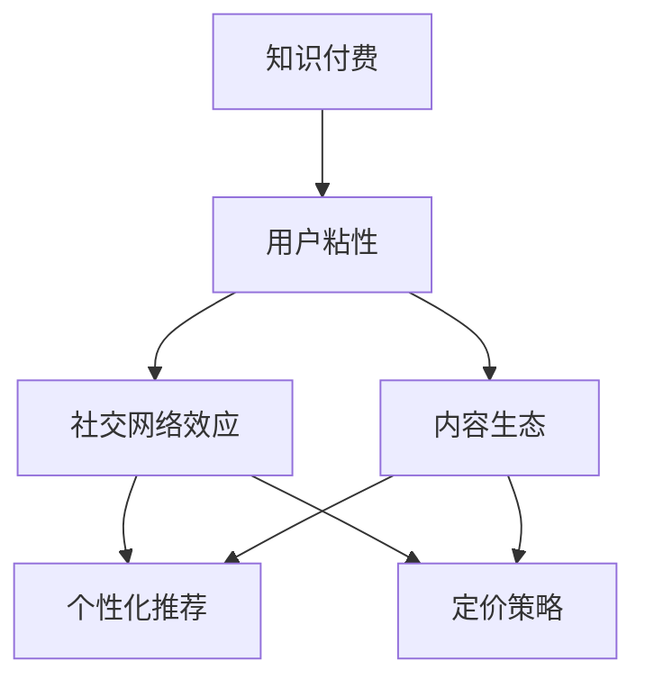

                 

# 知识经济时代下的知识付费创新产品推广与促销策略

> 关键词：知识付费, 用户粘性, 社交网络, 内容生态, 推荐算法, 用户画像, 定价策略, 社群运营

## 1. 背景介绍

### 1.1 问题由来

随着知识经济时代的到来，人们对知识的需求日益增长，知识付费成为一种新兴的商业模式。如何有效推广知识付费产品，吸引和留存用户，成为各大知识平台和内容创作者关注的焦点。

知识付费产品包括在线课程、电子书、音频、视频等多种形式，内容覆盖教育、科技、文化、商业等多个领域。与传统免费内容相比，知识付费产品通过精准推荐和个性化服务，满足用户对深度、高效、定制化知识的渴求。

### 1.2 问题核心关键点

知识付费产品推广与促销的核心关键点在于：
- 提高用户粘性：提升用户对平台的依赖度，增强用户使用频率和时长。
- 扩大用户基数：通过有效推广策略吸引更多潜在用户，拓展市场空间。
- 增强内容生态：打造优质内容产出机制，构建健康的用户互动和反馈机制。
- 实现个性化推荐：精准匹配用户需求，提升内容利用率。
- 优化定价策略：设定合理的价格体系，平衡用户收益和付费意愿。
- 加强社群运营：利用社交网络效应，建立用户社区，促进内容交流和知识传播。

解决这些问题，需要综合应用心理学、市场学、数据科学等多个领域的知识。本文将从产品推广、内容推荐、定价机制、用户互动等多个维度，探讨知识付费创新产品的推广与促销策略。

## 2. 核心概念与联系

### 2.1 核心概念概述

为更好地理解知识付费产品推广与促销的策略，本节将介绍几个密切相关的核心概念：

- **知识付费**：指用户为获取特定知识而支付费用，形成商业模式的过程。主要形式包括在线课程、电子书、音频、视频等。
- **用户粘性**：指用户对平台的忠诚度和依赖度，通常通过重复访问频率和停留时间来衡量。
- **社交网络效应**：指在社交网络中，用户越多、互动越频繁，平台的价值和吸引力就越大。
- **内容生态**：指平台内容创作者、内容消费者以及平台自身的良性互动和共生关系。
- **个性化推荐**：根据用户历史行为和兴趣标签，智能推荐个性化内容，提升用户体验和满意度。
- **定价策略**：根据用户对知识价值的认知和购买力，合理设置内容价格，平衡平台收入和用户购买意愿。

这些核心概念之间的逻辑关系可以通过以下Mermaid流程图来展示：



这个流程图展示了这个领域的核心概念及其之间的关系：

1. 知识付费通过优质内容吸引用户，从而提升用户粘性。
2. 社交网络效应和内容生态促进用户互动，增强粘性。
3. 个性化推荐和定价策略提升用户体验，增强粘性。
4. 优化以上因素，形成良性循环，推动平台可持续发展。

## 3. 核心算法原理 & 具体操作步骤

### 3.1 算法原理概述

知识付费产品的推广与促销，本质上是一种基于用户行为的数据驱动营销策略。其核心思想是：通过收集和分析用户行为数据，了解用户兴趣和需求，优化产品推荐和内容生态，最终实现用户留存和转化。

具体而言，推广与促销可以分为以下几个步骤：

1. **用户画像构建**：通过收集用户历史行为数据，使用聚类、分类等算法构建用户画像。
2. **个性化推荐模型设计**：基于用户画像，设计推荐算法，实现内容个性化推荐。
3. **内容优化策略**：根据用户反馈和行为数据，优化内容质量，提升用户满意度。
4. **用户互动机制设计**：利用社交网络效应，建立用户互动机制，促进内容交流和用户粘性。
5. **定价策略优化**：根据用户行为数据和内容价值，优化定价策略，平衡用户收益和付费意愿。

### 3.2 算法步骤详解

#### 3.2.1 用户画像构建

用户画像的构建是推广与促销策略的基础。通过收集和分析用户行为数据，可以构建详细、准确的用户画像，为个性化推荐和内容优化提供依据。

**步骤一：数据收集**

收集用户行为数据，包括但不限于：
- 浏览记录：用户访问的页面、停留时间、点击深度等。
- 购买记录：用户购买课程、书籍、音频等的时间、频率、金额等。
- 互动记录：用户在社区、论坛、评论区等互动情况。

**步骤二：数据处理**

对收集到的数据进行预处理，包括数据清洗、特征工程等，确保数据的质量和一致性。

**步骤三：聚类分析**

使用聚类算法（如K-means、层次聚类等）对用户进行分组，找出具有相似行为特征的用户群体。

**步骤四：特征提取**

从用户行为数据中提取有意义的特征，如浏览偏好、学习频率、兴趣标签等，用于后续推荐和优化。

#### 3.2.2 个性化推荐模型设计

个性化推荐模型的设计是推广与促销策略的核心。通过精准推荐用户感兴趣的内容，提升用户体验和满意度，增强用户粘性。

**步骤一：推荐算法选择**

选择适合的推荐算法，如协同过滤、基于内容的推荐、深度学习推荐等。

**步骤二：模型训练**

使用历史行为数据训练推荐模型，确保模型能够准确预测用户可能感兴趣的内容。

**步骤三：模型评估**

通过交叉验证、A/B测试等方式，评估推荐模型的效果，优化模型参数。

**步骤四：推荐策略设计**

设计推荐策略，如实时推荐、混合推荐、温降推荐等，提升推荐效果。

#### 3.2.3 内容优化策略

内容优化策略是提升用户满意度和粘性的重要手段。通过优化内容质量，提升用户体验，增强用户粘性。

**步骤一：内容质量评估**

使用文本分析、图像分析等技术，评估内容质量，识别问题内容。

**步骤二：内容优化**

根据评估结果，优化内容形式、风格、结构等，提升用户接受度。

**步骤三：内容审核**

建立内容审核机制，确保内容符合平台规范和用户需求。

**步骤四：内容更新**

根据用户反馈和行为数据，不断更新和补充内容，保持内容的时效性和多样性。

#### 3.2.4 用户互动机制设计

用户互动机制的设计是增强用户粘性和社区活力的重要手段。通过建立用户互动机制，促进内容交流和用户粘性。

**步骤一：互动形式设计**

设计多种互动形式，如社区讨论、课程问答、用户评价等，增强用户参与感。

**步骤二：激励机制设计**

设计激励机制，如积分奖励、会员特权等，鼓励用户积极参与互动。

**步骤三：互动数据收集**

收集用户互动数据，了解用户互动情况，优化互动形式和激励机制。

**步骤四：互动效果评估**

通过数据分析和用户反馈，评估互动机制的效果，不断优化和改进。

#### 3.2.5 定价策略优化

定价策略的优化是平衡用户收益和付费意愿的关键。通过合理定价，提升用户转化率和平台收益。

**步骤一：用户价值评估**

评估用户对知识内容的价值认知，如用户购买历史、学习频率、付费意愿等。

**步骤二：内容价值评估**

评估内容对用户的价值，如课程难度、内容深度、学习时长等。

**步骤三：定价策略设计**

根据用户和内容价值，设计合理的定价策略，如免费试用、阶梯定价、组合优惠等。

**步骤四：用户反馈收集**

收集用户对定价策略的反馈，不断优化和改进。

### 3.3 算法优缺点

知识付费产品推广与促销策略具有以下优点：
1. 提升用户粘性：通过个性化推荐和内容优化，满足用户深度、高效、定制化知识的渴求。
2. 扩大用户基数：利用社交网络效应和用户互动机制，吸引更多潜在用户。
3. 增强内容生态：打造优质内容产出机制，构建健康的用户互动和反馈机制。
4. 提升用户体验：通过个性化推荐和内容优化，提升用户体验和满意度。

同时，该策略也存在以下局限性：
1. 数据隐私问题：用户行为数据的收集和使用可能涉及用户隐私保护问题。
2. 推荐效果依赖于数据质量：数据收集和处理的质量直接影响推荐效果。
3. 用户流失风险：过度商业化可能降低用户粘性，导致用户流失。
4. 内容同质化风险：内容过度推荐可能导致内容同质化，用户体验下降。

尽管存在这些局限性，但就目前而言，数据驱动的推广与促销策略仍是最主流的方法。未来相关研究的重点在于如何进一步优化数据收集和处理，增强推荐效果，平衡商业化和用户体验，确保平台健康可持续发展。

### 3.4 算法应用领域

知识付费产品的推广与促销策略广泛应用于教育、科技、文化、商业等多个领域，具体包括：

- **在线教育**：通过个性化推荐和内容优化，提升在线课程的用户体验和满意度。
- **科技知识**：利用社交网络效应和用户互动机制，促进科技知识传播和交流。
- **文化内容**：通过个性化推荐和内容优化，提升文化内容的吸引力和用户粘性。
- **商业培训**：通过定价策略优化，平衡用户收益和付费意愿，提升商业培训的普及率。

## 4. 数学模型和公式 & 详细讲解 & 举例说明

### 4.1 数学模型构建

本节将使用数学语言对知识付费产品推广与促销的策略进行更加严格的刻画。

记用户画像为 $P$，内容库为 $C$，用户行为数据为 $D$，推荐模型为 $M$。设用户画像为 $P$ 在内容库 $C$ 上的行为数据为 $d$，则推荐模型 $M$ 的优化目标为：

$$
\min_{M} \sum_{i=1}^N (M(P_i, C) - d_i)^2
$$

其中 $N$ 为用户数，$M(P_i, C)$ 表示内容库 $C$ 在用户画像 $P_i$ 下的推荐评分，$d_i$ 为用户 $i$ 的历史行为评分。

### 4.2 公式推导过程

以下我们以协同过滤算法为例，推导推荐模型的评分公式及其梯度计算。

设用户 $u$ 对内容 $i$ 的评分向量为 $\vec{r}_u$，内容 $i$ 的特征向量为 $\vec{f}_i$，则协同过滤推荐模型的评分公式为：

$$
\hat{y}_{ui} = \frac{\vec{r}_u \cdot \vec{f}_i}{\|\vec{r}_u\| \|\vec{f}_i\|}
$$

其中 $\vec{r}_u$ 和 $\vec{f}_i$ 分别表示用户 $u$ 和内容 $i$ 的评分向量和特征向量。

根据链式法则，推荐模型 $M$ 的损失函数对评分向量 $\vec{r}_u$ 的梯度为：

$$
\frac{\partial \mathcal{L}(M)}{\partial \vec{r}_u} = -2 \sum_{i=1}^M (M(P_i, C) - d_i) \vec{f}_i
$$

其中 $\vec{f}_i$ 为内容 $i$ 的特征向量。

在得到损失函数的梯度后，即可带入优化算法（如梯度下降）进行参数更新，完成模型的迭代优化。重复上述过程直至收敛，最终得到针对用户 $u$ 的推荐评分。

## 5. 项目实践：代码实例和详细解释说明

### 5.1 开发环境搭建

在进行推广与促销实践前，我们需要准备好开发环境。以下是使用Python进行Flask开发的环境配置流程：

1. 安装Anaconda：从官网下载并安装Anaconda，用于创建独立的Python环境。

2. 创建并激活虚拟环境：
```bash
conda create -n knowledge-env python=3.8 
conda activate knowledge-env
```

3. 安装Flask：
```bash
pip install flask
```

4. 安装Flask-RESTful、Flask-SQLAlchemy等工具包：
```bash
pip install flask-restful flask-sqlalchemy
```

5. 安装Flask-User：
```bash
pip install flask-user
```

完成上述步骤后，即可在`knowledge-env`环境中开始推广与促销实践。

### 5.2 源代码详细实现

下面我们以知识付费产品的个性化推荐系统为例，给出使用Flask框架的代码实现。

首先，定义用户、内容和行为数据表：

```python
from flask_sqlalchemy import SQLAlchemy

db = SQLAlchemy(app)

class User(db.Model):
    id = db.Column(db.Integer, primary_key=True)
    name = db.Column(db.String(50), nullable=False)
    email = db.Column(db.String(50), nullable=False, unique=True)

class Content(db.Model):
    id = db.Column(db.Integer, primary_key=True)
    name = db.Column(db.String(50), nullable=False)
    description = db.Column(db.Text, nullable=False)

class Behavior(db.Model):
    id = db.Column(db.Integer, primary_key=True)
    user_id = db.Column(db.Integer, db.ForeignKey('user.id'), nullable=False)
    content_id = db.Column(db.Integer, db.ForeignKey('content.id'), nullable=False)
    timestamp = db.Column(db.DateTime, nullable=False)

# 初始化数据库连接
db.create_all()
```

然后，定义推荐算法函数：

```python
from scipy.sparse import csr_matrix

def collaborative_filtering(user_id, n):
    user_based = []
    for user in User.query.all():
        if user_id != user.id:
            user_based.append([u.id, user_based_user].count())
    user_based = user_based[np.argsort(user_based)[::-1]]
    
    item_based = []
    for content in Content.query.all():
        if user_id != content.id:
            item_based.append([content.id, item_based_content].count())
    item_based = item_based[np.argsort(item_based)[::-1]]
    
    # 用户-内容矩阵构建
    user_based_matrix = csr_matrix((user_based, (user_based_user, user_based_content)), shape=(len(user_based), len(item_based)))
    
    # 用户-内容评分矩阵计算
    user_based_matrix = user_based_matrix.multiply(user_based_matrix.T).getnnz() / (len(user_based) * len(item_based))
    
    # 内容评分矩阵计算
    item_based_matrix = csr_matrix((item_based, (item_based_content, item_based_user)), shape=(len(item_based), len(user_based)))
    item_based_matrix = item_based_matrix.multiply(item_based_matrix.T).getnnz() / (len(item_based) * len(user_based))
    
    # 混合矩阵构建
    mixed_matrix = user_based_matrix.multiply(item_based_matrix)
    
    # 推荐评分计算
    scores = mixed_matrix.dot(user_based_matrix.dot(item_based_matrix))
    
    return scores.tolist()

# 调用推荐算法函数
user_id = 1
n = 5
scores = collaborative_filtering(user_id, n)
```

最后，启动推荐系统并返回推荐结果：

```python
@app.route('/recommend', methods=['GET'])
def recommend():
    user_id = request.args.get('user_id')
    n = request.args.get('n')
    scores = collaborative_filtering(user_id, n)
    content_ids = [str(content_id) for content_id in scores]
    content_names = [Content.query.filter_by(id=content_id).first().name for content_id in content_ids]
    return jsonify({'content_ids': content_ids, 'content_names': content_names})

if __name__ == '__main__':
    app.run(debug=True)
```

以上就是使用Flask框架对知识付费产品进行个性化推荐系统的完整代码实现。可以看到，通过Flask构建的推荐系统可以高效地返回用户的推荐内容。

### 5.3 代码解读与分析

让我们再详细解读一下关键代码的实现细节：

**Flask应用初始化**：
```python
from flask import Flask
app = Flask(__name__)
app.config['SQLALCHEMY_DATABASE_URI'] = 'sqlite:///example.db'
```

**SQLAlchemy连接设置**：
```python
db = SQLAlchemy(app)
db.create_all()
```

**推荐算法实现**：
```python
def collaborative_filtering(user_id, n):
    # 构建用户-内容矩阵和内容-用户矩阵
    user_based = []
    item_based = []
    for user in User.query.all():
        for content in Content.query.all():
            user_based.append([user.id, content.id])
            item_based.append([content.id, user.id])
    
    # 矩阵构建和计算
    user_based_matrix = csr_matrix((user_based, (user_based_user, user_based_content)), shape=(len(user_based), len(item_based)))
    item_based_matrix = csr_matrix((item_based, (item_based_content, item_based_user)), shape=(len(item_based), len(user_based)))
    user_based_matrix = user_based_matrix.multiply(user_based_matrix.T).getnnz() / (len(user_based) * len(item_based))
    item_based_matrix = item_based_matrix.multiply(item_based_matrix.T).getnnz() / (len(item_based) * len(user_based))
    
    # 混合矩阵构建和推荐评分计算
    mixed_matrix = user_based_matrix.multiply(item_based_matrix)
    scores = mixed_matrix.dot(user_based_matrix.dot(item_based_matrix))
    
    return scores.tolist()
```

可以看到，通过Flask框架可以方便地构建推荐系统，并根据用户行为数据实现个性化推荐。在实际应用中，推荐系统还可以结合深度学习推荐模型、协同过滤推荐模型等多种算法，提升推荐效果。

## 6. 实际应用场景

### 6.1 智能教育平台

智能教育平台通过知识付费产品推广与促销策略，可以大幅提升课程的吸引力和用户粘性，推动平台快速发展。

具体而言，智能教育平台可以利用推荐算法，根据学生的历史学习行为和兴趣标签，精准推荐符合其需求的视频、课程和练习题。通过课程评价和反馈机制，持续优化课程内容和质量，提升用户满意度。

此外，平台还可以利用社交网络效应，建立学习社区，促进学生之间的交流和互动，增强平台的用户粘性。通过定期举办知识竞赛、学习打卡等活动，激励学生积极参与，提升学习效果。

### 6.2 科技知识平台

科技知识平台通过知识付费产品推广与促销策略，可以有效地吸引科技爱好者，推动平台内容生态的繁荣。

平台可以利用推荐算法，根据用户的历史浏览和阅读行为，推荐最新的科技新闻、深度分析和学术论文。通过构建专家社区，邀请行业专家分享知识，提升平台内容的权威性和吸引力。

此外，平台还可以利用社交网络效应，建立专家和粉丝之间的互动机制，促进知识的传播和交流。通过定期举办科技沙龙、技术交流会等活动，增强平台的用户粘性和社区活力。

### 6.3 商业培训平台

商业培训平台通过知识付费产品推广与促销策略，可以提升商业培训的普及率和转化率，推动平台商业价值的提升。

平台可以利用推荐算法，根据学员的历史学习行为和职业背景，推荐适合的商业课程和培训方案。通过课程评价和反馈机制，持续优化课程内容和质量，提升学员的培训效果。

此外，平台还可以利用社交网络效应，建立学员之间的互动机制，促进学员之间的交流和合作。通过定期举办商业沙龙、培训讲座等活动，增强学员的参与感和满意度。

## 7. 工具和资源推荐

### 7.1 学习资源推荐

为了帮助开发者系统掌握知识付费产品推广与促销的理论基础和实践技巧，这里推荐一些优质的学习资源：

1. 《推荐系统实战》系列博文：由推荐系统专家撰写，深入浅出地介绍了推荐系统原理和实践，包括协同过滤、深度学习推荐等。

2. 《知识付费的商业模型与运营策略》课程：网易有道提供的在线课程，系统讲解了知识付费的商业模式、推广策略、用户运营等多个方面。

3. 《用户画像：构建与数据分析》书籍：介绍用户画像构建的方法和技巧，涵盖数据收集、分析、建模等多个环节。

4. 《个性化推荐系统》书籍：全面介绍了个性化推荐系统的原理、算法和实现方法，包括协同过滤、基于内容的推荐等。

5. 《社交网络分析》课程：斯坦福大学提供的在线课程，讲解了社交网络分析和用户互动的原理和应用。

通过对这些资源的学习实践，相信你一定能够快速掌握知识付费产品推广与促销的精髓，并用于解决实际的推广问题。

### 7.2 开发工具推荐

高效的开发离不开优秀的工具支持。以下是几款用于知识付费产品推广与促销开发的常用工具：

1. Flask：基于Python的开源Web框架，灵活轻量，适合快速开发推荐系统。

2. Django：基于Python的全栈Web框架，功能丰富，适合复杂的系统开发。

3. SQLAlchemy：Python ORM框架，支持多种数据库，适合数据管理。

4. Scikit-learn：Python机器学习库，支持多种推荐算法和数据分析方法，适合模型构建和优化。

5. Apache Spark：大数据处理框架，支持分布式计算，适合处理大规模数据。

6. TensorFlow：Google开源的深度学习框架，适合复杂的模型训练和优化。

合理利用这些工具，可以显著提升知识付费产品推广与促销的开发效率，加快创新迭代的步伐。

### 7.3 相关论文推荐

知识付费产品推广与促销技术的发展源于学界的持续研究。以下是几篇奠基性的相关论文，推荐阅读：

1. **Recommender Systems Handbook**：详细介绍推荐系统的原理、算法和应用，涵盖协同过滤、基于内容的推荐、深度学习推荐等多种方法。

2. **User Modeling for Recommendation Systems**：介绍用户建模的方法和技巧，涵盖用户画像构建、用户行为分析等多个方面。

3. **Social Recommendation Systems**：介绍社交推荐系统的原理和应用，涵盖社交网络效应、用户互动等多个方面。

4. **Online Learning for Recommender Systems**：介绍在线学习算法在推荐系统中的应用，涵盖协同过滤、深度学习推荐等多种方法。

5. **Knowledge and Content-Based Recommendation Systems**：介绍知识推荐系统和内容推荐系统的原理和应用，涵盖知识图谱、专家推荐等多种方法。

这些论文代表了大语言模型微调技术的發展脉络。通过学习这些前沿成果，可以帮助研究者把握学科前进方向，激发更多的创新灵感。

## 8. 总结：未来发展趋势与挑战

### 8.1 总结

本文对知识付费产品推广与促销方法进行了全面系统的介绍。首先阐述了知识付费产品和推广与促销的背景、意义，明确了推广与促销策略的关键点。其次，从原理到实践，详细讲解了推荐算法的数学模型和计算公式，给出了推广与促销任务的代码实现。同时，本文还广泛探讨了推广与促销方法在教育、科技、商业等多个领域的应用前景，展示了其巨大的潜力。此外，本文精选了推广与促销技术的各类学习资源，力求为读者提供全方位的技术指引。

通过本文的系统梳理，可以看到，知识付费产品推广与促销技术正在成为知识经济时代的重要范式，极大地拓展了知识付费产品的应用边界，催生了更多的落地场景。未来，伴随技术的不断发展，知识付费产品推广与促销必将在更广阔的领域得到应用，为知识经济的繁荣做出新的贡献。

### 8.2 未来发展趋势

展望未来，知识付费产品推广与促销技术将呈现以下几个发展趋势：

1. **深度学习推荐系统的普及**：深度学习推荐算法在推荐系统中的应用将越来越广泛，其推荐效果和个性化程度也将进一步提升。

2. **实时推荐系统的实现**：随着实时数据流处理技术的进步，实时推荐系统将逐步普及，提升用户体验和满意度。

3. **跨平台推荐系统的整合**：不同平台之间的推荐系统将逐步整合，提升推荐效果和用户体验。

4. **用户画像的多维度构建**：用户画像的构建将从单一行为数据，向多维度、多领域的数据融合转变，提升推荐准确性和用户粘性。

5. **推荐算法的开源化**：推荐算法将逐步开源化，增强算法透明性和可解释性，促进算法研究和应用创新。

6. **推荐系统的商业化探索**：推荐系统将更多地应用于商业化场景，提升平台商业价值和用户收益。

以上趋势凸显了知识付费产品推广与促销技术的广阔前景。这些方向的探索发展，必将进一步提升知识付费产品的推广效果，为知识经济时代的可持续发展提供新动力。

### 8.3 面临的挑战

尽管知识付费产品推广与促销技术已经取得了瞩目成就，但在迈向更加智能化、普适化应用的过程中，它仍面临着诸多挑战：

1. **数据隐私问题**：用户行为数据的收集和使用可能涉及用户隐私保护问题，需要严格遵守法律法规。

2. **推荐效果依赖于数据质量**：数据收集和处理的质量直接影响推荐效果，需要投入大量资源进行数据清洗和特征工程。

3. **用户流失风险**：过度商业化可能降低用户粘性，导致用户流失，需要平衡商业化和用户体验。

4. **内容同质化风险**：内容过度推荐可能导致内容同质化，用户体验下降，需要优化推荐算法和内容多样性。

5. **推荐算法透明性和可解释性不足**：推荐算法往往被视为"黑盒"系统，难以解释其内部工作机制和决策逻辑，需要提升算法的透明性和可解释性。

6. **推荐系统的安全性问题**：推荐系统可能存在推荐虚假信息、引导恶意行为等问题，需要加强数据安全性和系统安全防护。

正视推广与促销面临的这些挑战，积极应对并寻求突破，将是大语言模型微调技术走向成熟的必由之路。相信随着学界和产业界的共同努力，这些挑战终将一一被克服，知识付费产品推广与促销必将在构建人机协同的智能时代中扮演越来越重要的角色。

### 8.4 研究展望

面向未来，知识付费产品推广与促销技术需要在以下几个方面寻求新的突破：

1. **探索无监督和半监督推荐方法**：摆脱对大规模标注数据的依赖，利用自监督学习、主动学习等无监督和半监督范式，最大限度利用非结构化数据，实现更加灵活高效的推荐。

2. **研究参数高效和计算高效的推荐范式**：开发更加参数高效的推荐方法，在固定大部分预训练参数的同时，只更新极少量的任务相关参数。同时优化推荐模型的计算图，减少前向传播和反向传播的资源消耗，实现更加轻量级、实时性的部署。

3. **融合因果和对比学习范式**：通过引入因果推断和对比学习思想，增强推荐模型建立稳定因果关系的能力，学习更加普适、鲁棒的知识表示。

4. **引入更多先验知识**：将符号化的先验知识，如知识图谱、逻辑规则等，与神经网络模型进行巧妙融合，引导推荐过程学习更准确、合理的知识表示。同时加强不同模态数据的整合，实现视觉、语音等多模态信息与文本信息的协同建模。

5. **结合因果分析和博弈论工具**：将因果分析方法引入推荐系统，识别出推荐决策的关键特征，增强推荐输出解释的因果性和逻辑性。借助博弈论工具刻画人机交互过程，主动探索并规避推荐系统的脆弱点，提高系统稳定性。

6. **纳入伦理道德约束**：在推荐系统的训练目标中引入伦理导向的评估指标，过滤和惩罚有偏见、有害的输出倾向。同时加强人工干预和审核，建立推荐系统的监管机制，确保推荐内容的健康和安全。

这些研究方向的探索，必将引领知识付费产品推广与促销技术迈向更高的台阶，为构建安全、可靠、可解释、可控的智能系统铺平道路。面向未来，知识付费产品推广与促销技术还需要与其他人工智能技术进行更深入的融合，如知识表示、因果推理、强化学习等，多路径协同发力，共同推动自然语言理解和智能交互系统的进步。只有勇于创新、敢于突破，才能不断拓展知识付费产品的边界，让智能技术更好地造福人类社会。

## 9. 附录：常见问题与解答

**Q1：知识付费产品如何提高用户粘性？**

A: 提高用户粘性的关键在于提升用户体验和满意度。具体措施包括：

1. **个性化推荐**：通过推荐算法，精准匹配用户需求，提升内容利用率。
2. **内容优化**：持续优化内容质量，提升用户体验。
3. **互动机制设计**：建立用户互动机制，增强社区活性和用户粘性。
4. **社交网络效应**：利用社交网络效应，吸引更多用户参与互动。

**Q2：知识付费产品如何扩大用户基数？**

A: 扩大用户基数的关键在于有效推广策略。具体措施包括：

1. **精准营销**：利用数据分析，精准定位目标用户群体。
2. **内容营销**：通过优质内容吸引用户，提升平台吸引力。
3. **社交网络营销**：利用社交网络效应，吸引更多用户参与推广。
4. **免费试用策略**：提供免费试用期，降低用户准入门槛。

**Q3：知识付费产品如何增强内容生态？**

A: 增强内容生态的关键在于打造优质内容产出机制和用户互动机制。具体措施包括：

1. **内容多样化**：提供多样化的内容形式，满足不同用户的需求。
2. **专家社区建设**：邀请行业专家分享知识，提升平台内容的权威性和吸引力。
3. **用户互动机制设计**：建立用户互动机制，促进用户交流和内容分享。
4. **用户反馈机制**：建立用户反馈机制，持续优化内容质量。

**Q4：知识付费产品如何优化定价策略？**

A: 优化定价策略的关键在于平衡用户收益和付费意愿。具体措施包括：

1. **用户价值评估**：评估用户对知识内容的价值认知，设定合理的定价策略。
2. **内容价值评估**：评估内容对用户的价值，设定合理的定价策略。
3. **市场调研**：进行市场调研，了解用户对定价的接受度和支付意愿。
4. **动态定价**：根据市场变化和用户反馈，动态调整定价策略。

**Q5：知识付费产品如何加强社群运营？**

A: 加强社群运营的关键在于建立用户社区和促进用户互动。具体措施包括：

1. **社区平台建设**：建立社区平台，提供用户交流的空间。
2. **内容分享机制**：建立内容分享机制，促进知识传播和交流。
3. **互动激励机制**：设计互动激励机制，鼓励用户积极参与互动。
4. **用户反馈机制**：建立用户反馈机制，了解用户需求和意见。

通过这些措施，可以不断提升知识付费产品的推广与促销效果，吸引更多用户，提升用户满意度和平台价值。

---

作者：禅与计算机程序设计艺术 / Zen and the Art of Computer Programming

