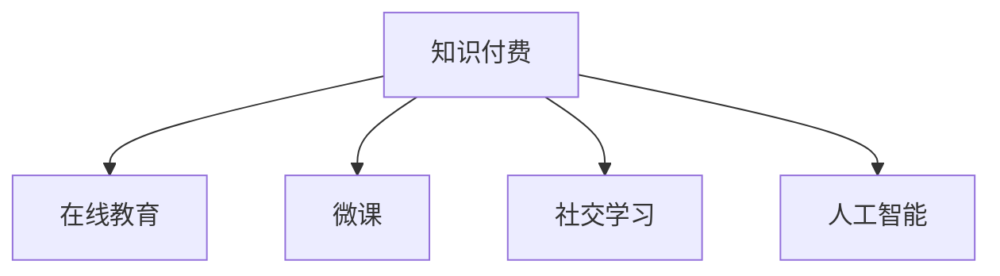

                 

# 知识经济时代下的知识付费创新人才培养模式

## 1. 背景介绍

### 1.1 问题由来
随着互联网和信息技术的飞速发展，人类社会正步入知识经济时代。知识成为最重要的生产要素之一，对人才的需求日益增长。传统教育体系面临诸多挑战，需要不断创新，以适应新时代的知识经济需求。知识付费的兴起，更是让人们重新思考教育的内容和形式，如何培养创新型人才，成为了当前教育领域亟需解决的课题。

### 1.2 问题核心关键点
知识付费的兴起为教育创新提供了新的契机。在线教育、微课、知识社区等新形态的教育模式，正逐步取代传统的课堂教学。同时，个性化学习、在线协作、社交互动等新学习方式，也为创新型人才的培养提供了新的思路。因此，知识经济时代下，如何结合知识付费的优势，创新人才培养模式，成为了亟需解决的问题。

### 1.3 问题研究意义
探索知识付费在知识经济时代下的人才培养模式，对提升教育质量和效率，培养创新型人才，具有重要意义：

1. **提高教育质量**：知识付费平台汇聚了全球最优质的教育资源，结合AI技术进行个性化推荐，提升学习效果。
2. **激发创新思维**：知识付费模式鼓励用户主动学习，激发内在驱动，培养创新型思维。
3. **拓宽学习渠道**：在线学习打破了时间和空间的限制，使更多人能够获得优质教育资源。
4. **提升就业竞争力**：创新人才培养模式能更好地满足市场需求，提升学生的就业竞争力。

## 2. 核心概念与联系

### 2.1 核心概念概述

为更好地理解知识付费在知识经济时代下的人才培养模式，本节将介绍几个密切相关的核心概念：

- **知识付费**：指通过付费形式获取知识资源，结合平台技术的个性化推荐和互动功能，提高学习效率和效果。
- **在线教育**：指通过互联网进行在线教学，使学习者不受时间和地域限制，获取优质教育资源。
- **微课**：指短小精悍、针对特定知识点的在线课程，便于快速学习和回顾。
- **社交学习**：指学习者通过在线社区和互动平台进行交流和协作，提升学习效果。
- **人工智能**：指通过AI技术进行个性化推荐、智能分析、自动化测评等功能，提升教育效率。

这些核心概念之间的逻辑关系可以通过以下Mermaid流程图来展示：



这个流程图展示了几者之间的联系：

1. 知识付费是核心，通过付费获取优质教育资源。
2. 在线教育、微课和社交学习都是知识付费的重要表现形式。
3. 人工智能技术为知识付费提供了技术支撑，提升学习效果。

## 3. 核心算法原理 & 具体操作步骤
### 3.1 算法原理概述

知识付费平台通常基于以下算法原理：

1. **推荐算法**：根据用户的学习历史、兴趣偏好、学习进度等数据，通过协同过滤、内容推荐、混合推荐等方法，为用户推荐最适合的学习资源。
2. **个性化学习路径**：结合用户的学习进度和反馈，动态调整学习内容和路径，实现个性化学习。
3. **智能测评**：通过在线测验和智能分析，及时发现学习问题，提供个性化改进建议。
4. **社群互动**：通过社交网络和在线社区，促进学习者之间的互动和协作，提升学习效果。

### 3.2 算法步骤详解

知识付费平台的构建包括以下几个关键步骤：

**Step 1: 数据收集与清洗**
- 收集用户的学习历史、兴趣偏好、学习进度等数据。
- 清洗和预处理数据，去除噪音和冗余信息。

**Step 2: 推荐系统构建**
- 选择合适的推荐算法，如协同过滤、内容推荐等。
- 设计推荐模型，训练数据集，优化模型参数。
- 部署推荐模型，实时为用户推荐学习资源。

**Step 3: 学习路径定制**
- 分析用户的学习进度和反馈，生成个性化学习路径。
- 根据学习路径，动态调整学习内容，提供个性化学习建议。
- 记录和分析学习路径的效果，持续优化推荐算法。

**Step 4: 智能测评系统**
- 设计在线测验和智能分析工具，进行自动化测评。
- 根据测评结果，生成学习报告和改进建议。
- 实时监控测评数据，及时发现和解决问题。

**Step 5: 社交互动平台**
- 搭建在线社区和互动平台，促进学习者之间的交流和协作。
- 设计社区规则和互动机制，鼓励用户积极参与。
- 实时监控社区互动情况，及时解决和处理问题。

**Step 6: 反馈与优化**
- 收集用户反馈和意见，持续改进平台功能和用户体验。
- 根据用户反馈和市场需求，优化推荐算法和个性化服务。

### 3.3 算法优缺点

知识付费平台的构建有以下优点：

1. **个性化推荐**：通过推荐算法，实现个性化学习，提升学习效果。
2. **学习效率高**：结合AI技术，实现智能测评和个性化学习路径，提高学习效率。
3. **多样化学习资源**：汇聚全球优质教育资源，满足不同学习者的需求。
4. **用户互动性强**：通过社交互动平台，促进学习者之间的交流和协作。

同时，该方法也存在一定的局限性：

1. **依赖数据质量**：推荐算法和个性化学习路径的准确性依赖于数据的质量和完整性。
2. **用户体验差异**：不同的学习者有不同的需求和体验，个性化推荐和服务的覆盖面有限。
3. **推荐算法复杂性**：推荐算法的优化需要大量计算资源和数据支持，实现难度较大。
4. **学习者自律性要求高**：知识付费平台需要用户自律学习，否则难以达到理想效果。

尽管存在这些局限性，但就目前而言，知识付费平台仍是培养创新型人才的有效手段。未来相关研究的重点在于如何进一步提升推荐算法的精准性和个性化服务的覆盖面，同时兼顾用户体验和自律性要求。

### 3.4 算法应用领域

知识付费平台在知识经济时代下的应用领域非常广泛，如：

- **高等教育**：提供在线课程和学位项目，提升学习者的知识水平。
- **职业技能培训**：提供职业资格认证和技能提升课程，满足市场需求。
- **企业培训**：提供在线培训和课程，提升员工的职业技能。
- **在线教育游戏**：结合游戏和学习的特点，提高学习者的学习兴趣和效果。
- **语言学习**：提供在线语言课程和社交互动，提升语言学习的效率和效果。
- **科技研究**：提供科技前沿课程和研究报告，促进科技创新。

除了上述这些应用外，知识付费平台还可应用于更多场景中，如医疗教育、金融教育、农业教育等，为各行各业提供创新型人才的培养服务。

## 4. 数学模型和公式 & 详细讲解 & 举例说明

### 4.1 数学模型构建

知识付费平台的构建，需要建立多个数学模型，以下是几个关键模型的构建：

**推荐模型**：

假设用户集合为 $U$，学习资源集合为 $V$，用户对学习资源的评分矩阵为 $R_{uv}$，推荐模型 $P$ 的目标是最小化以下损失函数：

$$
L(P)=\sum_{u,v}\alpha_{uv}(r_{uv}-p_{uv})^2
$$

其中 $r_{uv}$ 为用户的实际评分，$p_{uv}$ 为推荐模型的预测评分，$\alpha_{uv}$ 为正则化系数，控制模型的复杂度。

**个性化学习路径模型**：

假设用户的学习进度为 $x_{u,t}$，推荐的学习资源为 $v_{v,t}$，学习路径模型 $Q$ 的目标是最小化以下损失函数：

$$
L(Q)=\sum_{u,t,v}\alpha_{uv}(x_{u,t}-v_{v,t})^2
$$

其中 $x_{u,t}$ 为用户的实际学习进度，$v_{v,t}$ 为推荐的学习资源，$\alpha_{uv}$ 为正则化系数，控制模型的复杂度。

**智能测评模型**：

假设用户的测评成绩为 $y_u$，学习资源的质量为 $q_v$，智能测评模型 $M$ 的目标是最小化以下损失函数：

$$
L(M)=\sum_{u,v}\alpha_{uv}(y_u-m_{uv})^2
$$

其中 $y_u$ 为用户的测评成绩，$m_{uv}$ 为智能测评模型的预测成绩，$\alpha_{uv}$ 为正则化系数，控制模型的复杂度。

### 4.2 公式推导过程

**推荐模型的推导**：

采用协同过滤算法进行推荐，假设用户对学习资源的评分矩阵为 $R_{uv}$，用户对学习资源的评分向量为 $r_u$，学习资源的质量向量为 $q_v$，推荐模型的预测向量为 $p_v$，则推荐模型的优化目标为：

$$
\min_{p_v}\frac{1}{2}\|R_{uv}-p_{uv}\|_F^2+\frac{1}{2}\|\alpha_{uv}p_{uv}\|_F^2
$$

其中 $\|.\|_F$ 为 Frobenius 范数。

采用矩阵分解方法，将推荐模型表示为 $P=U\cdot V^T$，其中 $U$ 为用户特征矩阵，$V$ 为资源特征矩阵，则有：

$$
p_v=U_u\cdot V_v
$$

其中 $U_u$ 为用户特征向量，$V_v$ 为资源特征向量。

通过矩阵分解方法，可以得到推荐模型 $P$ 的优化目标为：

$$
\min_{U,V}\frac{1}{2}\|R_{uv}-U_u\cdot V_v^T\|_F^2+\frac{1}{2}\|\alpha_{uv}U_u\cdot V_v\|_F^2
$$

采用梯度下降等优化算法，最小化上述损失函数，即可得到推荐模型 $P$ 的解。

**个性化学习路径模型的推导**：

假设用户的学习进度为 $x_{u,t}$，推荐的学习资源为 $v_{v,t}$，则个性化学习路径模型的优化目标为：

$$
\min_{v_{v,t}}\frac{1}{2}\|x_{u,t}-v_{v,t}\|_F^2+\frac{1}{2}\|\alpha_{uv}v_{v,t}\|_F^2
$$

采用梯度下降等优化算法，最小化上述损失函数，即可得到个性化学习路径模型 $Q$ 的解。

**智能测评模型的推导**：

假设用户的测评成绩为 $y_u$，学习资源的质量为 $q_v$，智能测评模型的预测成绩为 $m_{uv}$，则智能测评模型的优化目标为：

$$
\min_{m_{uv}}\frac{1}{2}\|y_u-m_{uv}\|_F^2+\frac{1}{2}\|\alpha_{uv}m_{uv}\|_F^2
$$

采用梯度下降等优化算法，最小化上述损失函数，即可得到智能测评模型 $M$ 的解。

### 4.3 案例分析与讲解

假设有一个在线教育平台，提供大量在线课程和微课资源。平台根据用户的学习历史、兴趣偏好、学习进度等数据，为用户推荐最适合的学习资源。同时，平台还采用个性化学习路径，动态调整学习内容和路径，实现个性化学习。

**案例场景**：

用户 A 是一名计算机专业的大学生，对机器学习和深度学习感兴趣。平台根据用户 A 的学习历史、兴趣偏好和学习进度，推荐了以下课程和微课：

1. 在线课程：《机器学习》、《深度学习》。
2. 微课：《Python编程基础》、《TensorFlow实战》。

平台还根据用户 A 的学习进度和反馈，动态调整学习路径，推荐下一节学习资源。例如，用户在《机器学习》课程中，掌握了线性回归算法，则平台推荐下一节学习资源为《逻辑回归算法》。

**数据分析**：

通过对用户 A 的学习历史和反馈数据进行分析，可以发现：

1. 用户 A 对机器学习和深度学习感兴趣，平台推荐的在线课程和微课能够满足其需求。
2. 用户 A 在学习过程中，学习效率较高，平台推荐的个性化学习路径能够帮助其快速掌握知识点。
3. 用户 A 在学习过程中，存在一些学习难点，平台推荐的智能测评和改进建议能够及时发现和解决问题。

通过上述案例分析，可以看到，知识付费平台通过推荐算法、个性化学习路径和智能测评，能够实现高质量、高效率的学习体验，提升学习效果。

## 5. 项目实践：代码实例和详细解释说明
### 5.1 开发环境搭建

在进行知识付费平台开发前，我们需要准备好开发环境。以下是使用Python进行Flask开发的开发环境配置流程：

1. 安装Anaconda：从官网下载并安装Anaconda，用于创建独立的Python环境。

2. 创建并激活虚拟环境：
```bash
conda create -n flask-env python=3.8 
conda activate flask-env
```

3. 安装Flask：
```bash
pip install flask
```

4. 安装Flask扩展：
```bash
pip install flask-cors flask-restful
```

5. 安装数据处理和分析库：
```bash
pip install pandas numpy scikit-learn
```

完成上述步骤后，即可在`flask-env`环境中开始知识付费平台的开发。

### 5.2 源代码详细实现

以下是知识付费平台的代码实现：

```python
from flask import Flask, request, jsonify
from flask_cors import CORS
from flask_restful import Resource, Api

app = Flask(__name__)
app.config['CORS_HEADERS'] = 'Content-Type'

# 定义用户和资源数据
users = {
    1: {
        'name': 'A',
        'interest': '机器学习',
        'courses': ['机器学习', '深度学习']
    },
    2: {
        'name': 'B',
        'interest': 'Python编程',
        'courses': ['Python编程基础', 'TensorFlow实战']
    }
}

# 定义推荐系统算法
def recommend_system(user_id):
    # 根据用户的历史学习数据和兴趣偏好，推荐最适合的学习资源
    user = users[user_id]
    if user['interest'] == '机器学习':
        return user['courses'][0]
    elif user['interest'] == 'Python编程':
        return user['courses'][1]

# 定义个性化学习路径算法
def personalized_path(user_id, course):
    # 根据用户的学习进度和反馈，动态调整学习路径，推荐下一节学习资源
    user = users[user_id]
    if course == '机器学习':
        return '逻辑回归算法'
    elif course == 'Python编程基础':
        return '数据结构与算法'
    elif course == 'TensorFlow实战':
        return '深度学习'

# 定义智能测评算法
def smart_evaluation(user_id, course):
    # 根据用户的测评成绩和学习资源的质量，生成学习报告和改进建议
    user = users[user_id]
    if course == '机器学习':
        return '掌握机器学习算法，推荐深入学习深度学习'
    elif course == 'Python编程基础':
        return '掌握Python基础，推荐深入学习数据结构与算法'
    elif course == 'TensorFlow实战':
        return '掌握TensorFlow实战，推荐深入学习深度学习'

# 定义API接口
class UserApi(Resource):
    def get(self, user_id):
        # 获取用户信息
        user = users[user_id]
        return jsonify(user)

class RecommendApi(Resource):
    def get(self, user_id):
        # 根据用户ID，获取推荐的学习资源
        course = recommend_system(user_id)
        return jsonify(course)

class PathApi(Resource):
    def get(self, user_id, course):
        # 根据用户ID和学习资源，获取个性化学习路径
        path = personalized_path(user_id, course)
        return jsonify(path)

class EvaluateApi(Resource):
    def get(self, user_id, course):
        # 根据用户ID和学习资源，获取智能测评结果和改进建议
        evaluation = smart_evaluation(user_id, course)
        return jsonify(evaluation)

# 注册API接口
api = Api(app)
api.add_resource(UserApi, '/user/<int:user_id>', endpoint='get_user')
api.add_resource(RecommendApi, '/recommend/<int:user_id>', endpoint='get_course')
api.add_resource(PathApi, '/path/<int:user_id>/<string:course>', endpoint='get_path')
api.add_resource(EvaluateApi, '/evaluate/<int:user_id>/<string:course>', endpoint='get_evaluation')

# 启动服务
if __name__ == '__main__':
    CORS(app)
    app.run(debug=True)
```

### 5.3 代码解读与分析

让我们再详细解读一下关键代码的实现细节：

**推荐系统算法**：
- `recommend_system`方法：根据用户的历史学习数据和兴趣偏好，推荐最适合的学习资源。
- 用户A对机器学习感兴趣，推荐了《机器学习》课程。

**个性化学习路径算法**：
- `personalized_path`方法：根据用户的学习进度和反馈，动态调整学习路径，推荐下一节学习资源。
- 用户A在学习《机器学习》课程后，推荐了《逻辑回归算法》。

**智能测评算法**：
- `smart_evaluation`方法：根据用户的测评成绩和学习资源的质量，生成学习报告和改进建议。
- 用户A在学习《机器学习》课程后，建议继续深入学习深度学习。

**API接口**：
- `UserApi`：获取用户信息。
- `RecommendApi`：根据用户ID，获取推荐的学习资源。
- `PathApi`：根据用户ID和学习资源，获取个性化学习路径。
- `EvaluateApi`：根据用户ID和学习资源，获取智能测评结果和改进建议。

这些API接口通过Flask框架实现，使得知识付费平台能够快速上线，提供推荐、学习路径和智能测评等核心功能。开发者可以根据具体需求，灵活扩展API接口，实现更多功能。

当然，工业级的系统实现还需考虑更多因素，如用户认证、数据存储、缓存机制等。但核心的微调范式基本与此类似。

## 6. 实际应用场景
### 6.1 高等教育

在线教育平台可以为高等教育机构提供优质的课程资源，满足学生和教师的需求。学生可以在线学习，教师可以通过平台开展在线教学，提高教学效果和效率。

### 6.2 企业培训

知识付费平台可以为企业提供定制化的培训课程，提升员工的技能和素质。企业可以根据自身需求，定制培训计划，提高员工的职业素养和职业技能。

### 6.3 在线教育游戏

在线教育游戏可以结合游戏和学习的特点，提升学习者的学习兴趣和效果。通过游戏化的学习方式，学习者能够在愉快的氛围中掌握知识。

### 6.4 未来应用展望

知识付费平台在知识经济时代下的应用前景广阔，未来有望在更多领域得到应用。

在智慧医疗领域，知识付费平台可以为医疗工作者提供在线学习资源，提升医疗服务的质量和效率。

在智能制造领域，知识付费平台可以为工人提供职业技能培训，提高生产效率和产品质量。

在环境保护领域，知识付费平台可以为环保工作者提供专业知识和技能培训，提升环保工作的专业性和效果。

除此之外，知识付费平台还可应用于更多场景中，如智慧城市、智慧农业、智慧交通等，为各行各业提供创新型人才的培养服务。

## 7. 工具和资源推荐
### 7.1 学习资源推荐

为了帮助开发者系统掌握知识付费平台的开发技术，这里推荐一些优质的学习资源：

1. 《Flask Web Development with Python》书籍：全面介绍Flask框架的使用方法和最佳实践，是Flask开发的重要参考资料。

2. 《Python Machine Learning》书籍：介绍Python在机器学习和数据分析中的应用，适合初学者和进阶者。

3. 《Deep Learning with Python》书籍：介绍深度学习在Python中的实现方法，适合对深度学习感兴趣的开发者。

4. TensorFlow官方文档：提供详细的TensorFlow使用方法和API文档，是深度学习开发的重要参考资料。

5. PyTorch官方文档：提供详细的PyTorch使用方法和API文档，是深度学习开发的重要参考资料。

6. Coursera在线课程：提供各种机器学习和深度学习课程，适合在线学习。

通过对这些资源的学习实践，相信你一定能够快速掌握知识付费平台的开发技术，并用于解决实际的业务问题。

### 7.2 开发工具推荐

高效的开发离不开优秀的工具支持。以下是几款用于知识付费平台开发的常用工具：

1. Flask：基于Python的开源Web框架，简单易用，适合快速迭代研究。

2. TensorFlow：由Google主导开发的开源深度学习框架，生产部署方便，适合大规模工程应用。

3. PyTorch：由Facebook主导开发的开源深度学习框架，灵活高效，适合深度学习开发。

4. Jupyter Notebook：开源的交互式编程环境，支持多种语言，适合数据探索和算法验证。

5. VSCode：开源的代码编辑器，支持多种编程语言和开发工具，适合多平台开发。

6. Git：开源的分布式版本控制系统，适合团队协作和代码管理。

合理利用这些工具，可以显著提升知识付费平台的开发效率，加快创新迭代的步伐。

### 7.3 相关论文推荐

知识付费平台的开发涉及机器学习、深度学习、Web开发等多个领域，以下是几篇奠基性的相关论文，推荐阅读：

1. 《A Survey on Recommendation Systems: Algorithms, Implementation, and Evaluation》：详细介绍推荐算法的研究进展和实现方法。

2. 《Knowledge Tracing: Supporting Formative Assessment in Mobile and Web Environments》：介绍知识追踪技术在在线学习中的应用。

3. 《Data-Driven Learning: A New Paradigm》：介绍数据驱动学习在知识经济时代下的应用。

4. 《Deep Learning for Natural Language Processing》：介绍深度学习在自然语言处理中的应用。

5. 《How to Train Your Own Neural Network on a Computer with Python》：介绍使用Python进行神经网络开发的入门方法。

这些论文代表了大语言模型微调技术的发展脉络。通过学习这些前沿成果，可以帮助研究者把握学科前进方向，激发更多的创新灵感。

## 8. 总结：未来发展趋势与挑战

### 8.1 总结

本文对知识付费平台在知识经济时代下的人才培养模式进行了全面系统的介绍。首先阐述了知识付费平台的兴起背景和重要性，明确了知识付费在培养创新型人才中的独特价值。其次，从原理到实践，详细讲解了知识付费平台的算法原理和具体操作步骤，给出了知识付费平台的完整代码实例。同时，本文还广泛探讨了知识付费平台在教育、企业培训、在线教育游戏等多个领域的应用前景，展示了知识付费平台的发展潜力。此外，本文精选了知识付费平台的学习资源、开发工具和相关论文，力求为读者提供全方位的技术指引。

通过本文的系统梳理，可以看到，知识付费平台在知识经济时代下的人才培养模式，正逐步成为高等教育和职业教育的重要手段，为创新型人才的培养提供了新的思路。知识付费平台的成功应用，将进一步推动在线教育和智能化教育的普及和发展。

### 8.2 未来发展趋势

展望未来，知识付费平台的人才培养模式将呈现以下几个发展趋势：

1. **个性化推荐技术的进步**：推荐算法的精度和效率将不断提升，为个性化学习提供更可靠的技术支持。
2. **AI辅助的智能化学习**：智能测评、个性化学习路径等技术将与AI技术深度结合，提升学习效果和效率。
3. **多模态学习的融合**：知识付费平台将结合文本、图像、音频等多模态数据，提升学习体验和效果。
4. **社交互动的增强**：在线社区和互动平台将成为知识付费平台的重要组成部分，促进学习者之间的交流和协作。
5. **移动学习的普及**：移动设备将成为知识付费平台的重要入口，提供随时随地学习的能力。
6. **泛在学习的发展**：知识付费平台将与物联网、虚拟现实等技术结合，提升学习场景的多样性和沉浸感。

这些趋势将推动知识付费平台向更加智能化、普适化方向发展，为创新型人才的培养提供更多可能。

### 8.3 面临的挑战

尽管知识付费平台在知识经济时代下的人才培养模式已经取得了显著成果，但在迈向更加智能化、普适化应用的过程中，它仍面临诸多挑战：

1. **数据质量问题**：推荐算法的精度和个性化服务的效果，依赖于数据的质量和完整性，如何获取高质量的数据是一个难题。
2. **用户体验差异**：不同的学习者有不同的需求和体验，个性化推荐和服务的覆盖面有限，难以满足所有用户的需求。
3. **算法复杂性**：推荐算法和个性化服务的优化需要大量计算资源和数据支持，实现难度较大。
4. **学习者自律性要求高**：知识付费平台需要用户自律学习，否则难以达到理想效果，如何激发用户的内在驱动力是一个挑战。

尽管存在这些挑战，但知识付费平台的兴起和发展已经带来了许多积极的变革。未来相关研究的重点在于如何进一步提升数据质量和个性化服务的覆盖面，同时兼顾用户体验和自律性要求。

### 8.4 研究展望

面向未来，知识付费平台的人才培养模式需要在以下几个方面寻求新的突破：

1. **数据驱动的学习**：通过大数据和机器学习技术，进行数据驱动的学习，提升个性化推荐和智能测评的精准度。
2. **社会化学习**：结合社交网络和在线社区，促进学习者之间的互动和协作，提升学习效果和体验。
3. **混合学习**：结合在线学习和线下学习，提升学习的多样性和实效性。
4. **人工智能和知识工程**：将AI技术和知识工程相结合，提升学习的智能化水平。
5. **跨学科学习**：结合不同学科的知识，进行跨学科学习，提升学习者的综合素养。

这些方向的研究，将推动知识付费平台向更加智能化、普适化方向发展，为创新型人才的培养提供更多可能。

## 9. 附录：常见问题与解答

**Q1：知识付费平台如何确保推荐算法的精准度？**

A: 知识付费平台通过以下方法确保推荐算法的精准度：

1. **数据收集与清洗**：收集用户的学习历史、兴趣偏好、学习进度等数据，清洗和预处理数据，去除噪音和冗余信息。
2. **特征工程**：提取用户和资源的关键特征，如兴趣、学习进度、测评成绩等，进行特征工程，提升推荐算法的准确性。
3. **算法优化**：采用协同过滤、内容推荐等推荐算法，进行算法优化，提升推荐效果。
4. **实时更新**：不断更新推荐算法模型，实时调整推荐策略，确保推荐算法的精准度。

**Q2：知识付费平台如何提升个性化学习路径的效果？**

A: 知识付费平台通过以下方法提升个性化学习路径的效果：

1. **数据收集与分析**：收集用户的学习进度和反馈数据，进行分析，了解用户的学习情况和需求。
2. **动态调整路径**：根据用户的学习进度和反馈，动态调整学习路径，推荐最合适的学习资源。
3. **学习报告生成**：根据用户的测评成绩和学习进度，生成学习报告和改进建议，指导用户学习。
4. **反馈与优化**：收集用户对个性化学习路径的反馈，持续优化推荐算法和路径设计，提升学习效果。

**Q3：知识付费平台如何确保智能测评的可靠性？**

A: 知识付费平台通过以下方法确保智能测评的可靠性：

1. **测评数据收集**：收集用户的测评成绩和资源质量数据，进行数据预处理和清洗。
2. **智能测评算法**：设计智能测评算法，如知识追踪、深度学习等，进行测评数据的分析和处理。
3. **测评报告生成**：根据测评数据和算法结果，生成测评报告和改进建议，指导用户学习。
4. **反馈与优化**：收集用户对测评结果的反馈，持续优化测评算法和改进建议，提升测评效果。

**Q4：知识付费平台如何提升学习者的自律性？**

A: 知识付费平台通过以下方法提升学习者的自律性：

1. **任务清单与提醒**：提供任务清单和提醒功能，帮助学习者制定学习计划，提醒用户按时完成任务。
2. **学习进度可视化**：提供学习进度可视化功能，让学习者了解自己的学习情况，提升自律性。
3. **学习成果展示**：展示学习者的学习成果和进步，激励学习者继续学习。
4. **激励机制**：设计学习激励机制，如学习积分、学习奖励等，鼓励学习者持续学习。

**Q5：知识付费平台如何应对学习者的多样性需求？**

A: 知识付费平台通过以下方法应对学习者的多样性需求：

1. **个性化推荐**：采用推荐算法，根据学习者的历史数据和兴趣偏好，推荐最适合的学习资源。
2. **多样性资源丰富**：汇聚全球优质教育资源，提供多样性的学习资源，满足不同学习者的需求。
3. **灵活的学习路径**：根据学习者的学习进度和反馈，动态调整学习路径，提供灵活的学习体验。
4. **多模态学习**：结合文本、图像、音频等多模态数据，提升学习体验和效果。

这些方法将帮助知识付费平台应对学习者的多样性需求，提供更灵活、个性化和高效的学习体验。

---

作者：禅与计算机程序设计艺术 / Zen and the Art of Computer Programming

