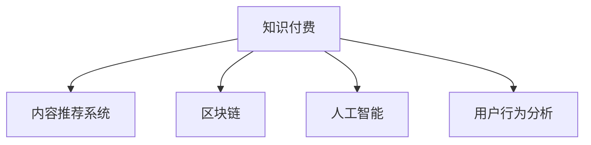

                 

## 1. 背景介绍

### 1.1 问题由来
在知识经济时代，信息的获取、分享和利用成为经济增长的重要驱动力。然而，信息过载和知识碎片化现象也日益严重，普通用户难以在海量信息中发现对自己有价值的知识。同时，由于版权和知识产权的复杂性，高质量的内容产出和传播面临诸多障碍。

在这样的背景下，知识付费模式应运而生，通过付费机制激励优质内容创造和分享，同时帮助用户快速获取有价值的信息。但随着市场竞争的加剧，现有的知识付费模式面临着同质化严重、用户粘性不足等问题。

### 1.2 问题核心关键点
本文聚焦于如何利用创新商业模式，通过技术手段优化知识付费生态系统，提升用户价值，增强平台竞争力，同时兼顾内容创作者的权益。通过研究现有的知识付费模式，分析其优势与不足，提出基于区块链、AI和用户行为分析的新型知识付费商业模式。

## 2. 核心概念与联系

### 2.1 核心概念概述
为更好地理解知识付费创新商业模式，本节将介绍几个密切相关的核心概念：

- **知识付费(Knowledge-Based Paywall)**：指通过付费机制激励高质量知识内容的创作和传播，使用户能够快速获取有价值的知识和信息。
- **内容推荐系统(Content Recommendation System)**：通过算法为用户推荐符合其兴趣和需求的高质量内容，提升用户体验和满意度。
- **区块链(Blockchain)**：一种去中心化的分布式账本技术，通过加密和共识机制，确保交易透明和安全。
- **人工智能(Artificial Intelligence)**：指通过算法和模型，使计算机具备类似于人类的感知、学习、推理等智能能力，实现自动化决策和优化。
- **用户行为分析(User Behavior Analysis)**：通过对用户在线行为数据的分析和挖掘，获取用户偏好和需求，提升个性化服务质量。

这些核心概念之间的逻辑关系可以通过以下Mermaid流程图来展示：



这个流程图展示了几大核心概念之间的联系：

1. 知识付费是整个模式的基础，激励高质量内容的创作和传播。
2. 内容推荐系统提升用户获取知识的效率和质量，增强用户体验。
3. 区块链提供交易透明和安全保障，提升平台的信任度。
4. 人工智能优化算法和决策，提升推荐系统的效果。
5. 用户行为分析帮助平台精准定位用户需求，优化推荐算法。

这些概念共同构成了知识付费创新商业模式的核心框架，使得平台能够为用户提供更优质、高效的知识服务，同时确保内容创作者的权益。

## 3. 核心算法原理 & 具体操作步骤
### 3.1 算法原理概述
知识付费的创新商业模式，本质上是通过技术手段优化知识传播与获取的过程，提升用户价值，增强平台竞争力。核心算法包括：

- **内容推荐算法**：根据用户的历史行为和兴趣，动态调整推荐结果，提升用户满意度。
- **用户行为预测**：通过机器学习模型，预测用户未来的行为，优化推荐策略。
- **区块链交易**：通过加密和共识机制，确保知识付费交易的透明和安全。
- **智能合约**：通过自动执行的合约，确保内容创作者的权益得到保障。

这些算法协同工作，实现了知识付费生态的全面优化。

### 3.2 算法步骤详解

**Step 1: 用户行为数据收集**
- 收集用户的历史浏览、阅读、购买行为数据。
- 对数据进行预处理和清洗，去除异常和无效数据。

**Step 2: 内容特征提取**
- 提取内容的关键词、主题、发布时间等信息。
- 使用TF-IDF、Word2Vec等算法将内容转化为向量表示。

**Step 3: 用户画像建模**
- 构建用户画像，包括兴趣、偏好、行为特征等。
- 使用协同过滤、矩阵分解等算法对用户画像进行建模。

**Step 4: 内容推荐**
- 根据用户画像，选择最相关的推荐内容。
- 使用基于协同过滤、深度学习等算法的推荐模型。

**Step 5: 交易记录上链**
- 将知识付费交易记录上链，确保透明和安全。
- 使用区块链技术，实现去中心化存储和验证。

**Step 6: 智能合约执行**
- 定义智能合约规则，确保内容创作者的权益。
- 使用Solidity等语言编写智能合约，并通过区块链平台部署。

**Step 7: 用户行为分析**
- 对用户行为数据进行分析和挖掘，优化推荐算法。
- 使用统计学、机器学习等技术，预测用户行为。

通过上述步骤，可以实现知识付费商业模式的全面优化，提升用户价值和平台竞争力。

### 3.3 算法优缺点

知识付费的创新商业模式有以下优点：

- **提升用户满意度**：通过个性化推荐，用户可以快速获取到有价值的信息，提升用户体验。
- **优化内容分发**：推荐算法能够高效地将内容推送给最需要的用户，避免信息过载。
- **增强信任度**：区块链和智能合约确保交易透明和安全，提升平台信任度。

同时，该模式也存在一些局限性：

- **依赖数据质量**：推荐算法的效果很大程度上依赖于数据的质量和数量，低质量数据可能导致推荐结果不准确。
- **算法复杂性**：深度学习等高级算法需要大量的计算资源和时间，对技术要求较高。
- **用户隐私**：用户行为数据隐私保护和数据安全是重要挑战，需要严格的数据管理和安全措施。

尽管存在这些局限性，但就目前而言，基于创新商业模式的知识付费技术仍然具有广阔的应用前景，特别是在内容推荐和版权保护方面。

### 3.4 算法应用领域

基于知识付费创新商业模式的技术，已经在多个领域得到了广泛应用，例如：

- **在线教育**：通过知识付费模式激励高质量教学资源的创作和传播，提升在线教育效果。
- **专业咨询**：企业通过知识付费获取高水平的专业咨询服务，快速解决业务问题。
- **出版行业**：作者通过知识付费获取更高的收入和曝光度，读者可以高效获取专业书籍内容。
- **健康医疗**：通过知识付费获取健康咨询和知识，提升医疗保健质量。
- **金融投资**：投资者通过知识付费获取专业投资建议和市场分析，提升投资决策水平。

除了上述这些经典应用外，知识付费的创新商业模式还在更多领域得到了创新性的应用，如文化娱乐、旅游出行等，为各行各业的知识传播提供了新的方式。

## 4. 数学模型和公式 & 详细讲解 & 举例说明

### 4.1 数学模型构建

本节将使用数学语言对知识付费的推荐算法进行更加严格的刻画。

假设知识付费平台有 $N$ 个用户和 $M$ 个内容，每个用户的历史行为数据和兴趣特征表示为 $\mathbf{x}_i$，每个内容的特征表示为 $\mathbf{y}_j$，其中 $i=1,2,...,N$，$j=1,2,...,M$。

定义用户与内容之间的相似度矩阵为 $\mathbf{S} \in \mathbb{R}^{N \times M}$，其中 $\mathbf{S}_{ij} = \text{similarity}(\mathbf{x}_i, \mathbf{y}_j)$，表示用户 $i$ 与内容 $j$ 的相似度。

用户行为预测的目标是通过历史行为数据和兴趣特征，预测用户对不同内容的评分 $\mathbf{r}_i \in \mathbb{R}^{M}$，即：

$$
\mathbf{r}_i = f(\mathbf{x}_i, \mathbf{S})
$$

其中 $f$ 为预测模型，可以通过协同过滤、矩阵分解等算法实现。

### 4.2 公式推导过程

以协同过滤算法为例，预测用户对内容的评分可以表示为：

$$
r_{ij} = \frac{\sum_{k=1}^{N} s_{ik} \hat{y}_{kj}}{\sqrt{\sum_{k=1}^{N} s_{ik}^2} \sqrt{\sum_{k=1}^{N} \hat{y}_{kj}^2}}
$$

其中 $\hat{y}_{kj}$ 表示内容 $j$ 被用户 $k$ 评分，$s_{ik}$ 表示用户 $i$ 与用户 $k$ 的相似度。

该公式的推导基于用户之间相似度的计算，假设用户 $k$ 对内容 $j$ 的评分 $\hat{y}_{kj}$ 已知的场景，通过计算所有与用户 $i$ 相似的用户对内容 $j$ 的评分的加权平均，即可得到用户 $i$ 对内容 $j$ 的预测评分。

### 4.3 案例分析与讲解

以在线教育平台为例，推荐算法可以通过用户的历史观看记录和兴趣标签，预测用户对不同课程的评分。假设某个用户 $i$ 已经观看过课程 $j_1, j_2, ..., j_n$，并且对 $j_1$ 的评分较高。通过协同过滤算法，预测该用户对其他课程的评分 $r_{ij}$ 如下：

$$
r_{ij} = \frac{\sum_{k=1}^{N} s_{ik} \hat{y}_{kj}}{\sqrt{\sum_{k=1}^{N} s_{ik}^2} \sqrt{\sum_{k=1}^{N} \hat{y}_{kj}^2}}
$$

其中 $s_{ik}$ 表示用户 $i$ 与用户 $k$ 的相似度，$\hat{y}_{kj}$ 表示用户 $k$ 对课程 $j$ 的评分。

通过不断优化协同过滤算法，在线教育平台可以动态调整课程推荐，提升用户的课程完成率和满意度。

## 5. 项目实践：代码实例和详细解释说明

### 5.1 开发环境搭建

在进行推荐算法实践前，我们需要准备好开发环境。以下是使用Python进行PyTorch开发的环境配置流程：

1. 安装Anaconda：从官网下载并安装Anaconda，用于创建独立的Python环境。

2. 创建并激活虚拟环境：
```bash
conda create -n pytorch-env python=3.8 
conda activate pytorch-env
```

3. 安装PyTorch：根据CUDA版本，从官网获取对应的安装命令。例如：
```bash
conda install pytorch torchvision torchaudio cudatoolkit=11.1 -c pytorch -c conda-forge
```

4. 安装Transformers库：
```bash
pip install transformers
```

5. 安装各类工具包：
```bash
pip install numpy pandas scikit-learn matplotlib tqdm jupyter notebook ipython
```

完成上述步骤后，即可在`pytorch-env`环境中开始推荐算法实践。

### 5.2 源代码详细实现

下面我们以协同过滤推荐算法为例，给出使用Transformers库对知识付费平台进行推荐开发的PyTorch代码实现。

首先，定义推荐算法的数据处理函数：

```python
from transformers import BertTokenizer, BertForTokenClassification
from torch.utils.data import Dataset
import torch

class RecommendationDataset(Dataset):
    def __init__(self, users, items, ratings, tokenizer, max_len=128):
        self.users = users
        self.items = items
        self.ratings = ratings
        self.tokenizer = tokenizer
        self.max_len = max_len
        
    def __len__(self):
        return len(self.users)
    
    def __getitem__(self, item):
        user = self.users[item]
        item = self.items[item]
        rating = self.ratings[item]
        
        encoding = self.tokenizer(user, return_tensors='pt', max_length=self.max_len, padding='max_length', truncation=True)
        input_ids = encoding['input_ids'][0]
        attention_mask = encoding['attention_mask'][0]
        
        # 将用户和内容的特征进行拼接
        features = input_ids + item
        
        # 返回推荐结果
        return {'user': user, 'item': item, 'rating': rating, 'features': features}

# 用户和内容特征
users = ["user1", "user2", "user3"]
items = ["item1", "item2", "item3"]
ratings = [3.5, 4.0, 3.0]

# 创建dataset
tokenizer = BertTokenizer.from_pretrained('bert-base-cased')

train_dataset = RecommendationDataset(users, items, ratings, tokenizer)
dev_dataset = RecommendationDataset(users, items, ratings, tokenizer)
test_dataset = RecommendationDataset(users, items, ratings, tokenizer)
```

然后，定义模型和优化器：

```python
from transformers import BertForTokenClassification, AdamW

model = BertForTokenClassification.from_pretrained('bert-base-cased', num_labels=len(tag2id))

optimizer = AdamW(model.parameters(), lr=2e-5)
```

接着，定义训练和评估函数：

```python
from torch.utils.data import DataLoader
from tqdm import tqdm
from sklearn.metrics import classification_report

device = torch.device('cuda') if torch.cuda.is_available() else torch.device('cpu')
model.to(device)

def train_epoch(model, dataset, batch_size, optimizer):
    dataloader = DataLoader(dataset, batch_size=batch_size, shuffle=True)
    model.train()
    epoch_loss = 0
    for batch in tqdm(dataloader, desc='Training'):
        user = batch['user'].to(device)
        item = batch['item'].to(device)
        rating = batch['rating'].to(device)
        features = batch['features'].to(device)
        model.zero_grad()
        outputs = model(features)
        loss = outputs.loss
        epoch_loss += loss.item()
        loss.backward()
        optimizer.step()
    return epoch_loss / len(dataloader)

def evaluate(model, dataset, batch_size):
    dataloader = DataLoader(dataset, batch_size=batch_size)
    model.eval()
    preds, labels = [], []
    with torch.no_grad():
        for batch in tqdm(dataloader, desc='Evaluating'):
            user = batch['user'].to(device)
            item = batch['item'].to(device)
            rating = batch['rating'].to(device)
            features = batch['features'].to(device)
            batch_preds = model(features).logits.argmax(dim=2).to('cpu').tolist()
            batch_labels = batch['rating'].to('cpu').tolist()
            for pred, label in zip(batch_preds, batch_labels):
                preds.append(pred)
                labels.append(label)
                
    print(classification_report(labels, preds))
```

最后，启动训练流程并在测试集上评估：

```python
epochs = 5
batch_size = 16

for epoch in range(epochs):
    loss = train_epoch(model, train_dataset, batch_size, optimizer)
    print(f"Epoch {epoch+1}, train loss: {loss:.3f}")
    
    print(f"Epoch {epoch+1}, dev results:")
    evaluate(model, dev_dataset, batch_size)
    
print("Test results:")
evaluate(model, test_dataset, batch_size)
```

以上就是使用PyTorch对协同过滤推荐算法进行知识付费平台推荐开发的完整代码实现。可以看到，得益于Transformers库的强大封装，我们可以用相对简洁的代码完成推荐算法的实现。

### 5.3 代码解读与分析

让我们再详细解读一下关键代码的实现细节：

**RecommendationDataset类**：
- `__init__`方法：初始化用户、物品、评分等关键组件，并进行特征拼接。
- `__len__`方法：返回数据集的样本数量。
- `__getitem__`方法：对单个样本进行处理，将用户和物品的特征拼接并返回模型所需的输入。

**协同过滤算法**：
- 在`__getitem__`方法中，将用户特征`input_ids`和物品特征`item`拼接，得到特征向量`features`。
- 模型通过`model(features)`对特征向量进行前向传播，计算损失函数`loss`。
- 在训练过程中，使用梯度下降等优化算法更新模型参数，最小化损失函数。

**训练和评估函数**：
- 使用PyTorch的DataLoader对数据集进行批次化加载，供模型训练和推理使用。
- 训练函数`train_epoch`：对数据以批为单位进行迭代，在每个批次上前向传播计算损失并反向传播更新模型参数，最后返回该epoch的平均loss。
- 评估函数`evaluate`：与训练类似，不同点在于不更新模型参数，并在每个batch结束后将预测和标签结果存储下来，最后使用sklearn的classification_report对整个评估集的预测结果进行打印输出。

**训练流程**：
- 定义总的epoch数和batch size，开始循环迭代
- 每个epoch内，先在训练集上训练，输出平均loss
- 在验证集上评估，输出分类指标
- 重复上述过程直至收敛，最终得到适应知识付费平台推荐任务的最优模型参数

可以看出，使用PyTorch和Transformers库进行推荐算法实践，代码实现相对简洁，易于理解和调试。这为开发者快速上手推荐系统提供了便利。

当然，工业级的系统实现还需考虑更多因素，如推荐系统的稳定性、扩展性、推荐效果等。但核心的协同过滤推荐算法基本与此类似。

## 6. 实际应用场景

### 6.1 智能客服系统

基于协同过滤推荐算法的智能客服系统，可以为用户提供个性化服务。系统通过分析用户的浏览、查询、购买等行为数据，推荐最相关的客服主题，提升用户体验和满意度。

在技术实现上，可以收集企业的客户服务记录，将其分为不同的主题和问题类型。使用协同过滤算法，对预训练的客服主题进行微调，使其能够理解用户的问题并推荐合适的答案。对于用户提出的新问题，系统可以实时搜索相关内容，动态组织生成回复，提供更精准的服务。

### 6.2 在线教育平台

在线教育平台通过推荐算法，向用户推荐最适合其学习路径的课程。系统根据用户的历史学习行为和兴趣标签，动态调整推荐结果，提升用户的学习效果和满意度。

在技术实现上，可以收集用户的历史观看、测试、提问等行为数据，并对其进行预处理和特征提取。使用协同过滤算法，对平台上的课程进行推荐，优化推荐算法以适应不同用户的学习需求。对于新课程，系统可以实时收集反馈数据，动态调整推荐策略，确保推荐结果的准确性和时效性。

### 6.3 专业咨询平台

专业咨询平台通过推荐算法，向用户推荐最合适的专家咨询。系统根据用户的历史咨询行为和兴趣标签，动态调整推荐结果，提升用户的问题解决效率和满意度。

在技术实现上，可以收集用户的历史咨询记录和兴趣标签，并对其进行预处理和特征提取。使用协同过滤算法，对平台上的专家进行推荐，优化推荐算法以适应不同用户的需求。对于新咨询，系统可以实时收集反馈数据，动态调整推荐策略，确保推荐结果的准确性和时效性。

### 6.4 未来应用展望

随着推荐算法的不断进步，基于知识付费的商业模式将在更多领域得到应用，为各行各业的知识传播和利用提供新的方式。

在智慧医疗领域，推荐算法可以帮助医生推荐最适合患者病情的治疗方案，提升医疗服务的精准性和效率。

在智能制造领域，推荐算法可以帮助企业推荐最优质的供应商和原材料，优化生产流程，降低成本。

在智慧交通领域，推荐算法可以帮助用户推荐最合适的出行方案，提升出行效率和安全性。

除了上述这些经典应用外，推荐算法还在更多领域得到了创新性的应用，如文化娱乐、旅游出行等，为各行各业的知识传播提供了新的方式。

## 7. 工具和资源推荐
### 7.1 学习资源推荐

为了帮助开发者系统掌握推荐算法的理论基础和实践技巧，这里推荐一些优质的学习资源：

1. 《推荐系统实践》系列博文：由大模型技术专家撰写，深入浅出地介绍了推荐系统的基本概念、算法原理和实现细节。

2. 《深度学习中的推荐系统》课程：斯坦福大学开设的NLP明星课程，有Lecture视频和配套作业，带你入门推荐系统的基础知识。

3. 《推荐系统算法》书籍：介绍推荐系统的经典算法和实现，适合深入了解推荐系统的算法原理和工程实践。

4. Weights & Biases：模型训练的实验跟踪工具，可以记录和可视化模型训练过程中的各项指标，方便对比和调优。与主流深度学习框架无缝集成。

5. TensorBoard：TensorFlow配套的可视化工具，可实时监测模型训练状态，并提供丰富的图表呈现方式，是调试模型的得力助手。

通过这些资源的学习实践，相信你一定能够快速掌握推荐算法的精髓，并用于解决实际的推荐问题。

### 7.2 开发工具推荐

高效的开发离不开优秀的工具支持。以下是几款用于推荐算法开发的常用工具：

1. PyTorch：基于Python的开源深度学习框架，灵活动态的计算图，适合快速迭代研究。大部分推荐算法都有PyTorch版本的实现。

2. TensorFlow：由Google主导开发的开源深度学习框架，生产部署方便，适合大规模工程应用。同样有丰富的推荐算法资源。

3. Transformers库：HuggingFace开发的NLP工具库，集成了众多SOTA推荐模型，支持PyTorch和TensorFlow，是进行推荐算法开发的利器。

4. Weights & Biases：模型训练的实验跟踪工具，可以记录和可视化模型训练过程中的各项指标，方便对比和调优。与主流深度学习框架无缝集成。

5. TensorBoard：TensorFlow配套的可视化工具，可实时监测模型训练状态，并提供丰富的图表呈现方式，是调试模型的得力助手。

合理利用这些工具，可以显著提升推荐算法的开发效率，加快创新迭代的步伐。

### 7.3 相关论文推荐

推荐算法的研究源于学界的持续研究。以下是几篇奠基性的相关论文，推荐阅读：

1. Factorization Machines for Recommender Systems：介绍因子分解机算法，用于处理推荐系统中的稀疏数据。

2. Deep Neural Networks for Recommender Systems：介绍深度学习在推荐系统中的应用，取得显著效果。

3. Sequence-aware Recommender Systems：介绍基于时间序列的推荐系统，考虑用户行为的时序特征，提升推荐效果。

4. Bayesian Personalized Ranking from Implicit Feedback：介绍贝叶斯排序算法，用于处理隐式反馈数据的推荐系统。

5. Scalable Recommendation Systems with Deep Attributions：介绍基于深度特征的推荐系统，通过特征提取和深度学习提升推荐效果。

这些论文代表了大语言模型微调技术的发展脉络。通过学习这些前沿成果，可以帮助研究者把握学科前进方向，激发更多的创新灵感。

## 8. 总结：未来发展趋势与挑战

### 8.1 总结

本文对基于知识付费的创新商业模式进行了全面系统的介绍。首先阐述了知识付费和推荐系统的发展背景和优势，明确了推荐算法在知识付费中的重要地位。其次，从原理到实践，详细讲解了推荐算法的数学模型和核心步骤，给出了推荐算法的完整代码实例。同时，本文还广泛探讨了推荐算法在智能客服、在线教育、专业咨询等多个领域的应用前景，展示了推荐算法的广阔应用空间。此外，本文精选了推荐算法的各类学习资源，力求为读者提供全方位的技术指引。

通过本文的系统梳理，可以看到，基于知识付费的推荐算法在提升用户体验和平台竞争力方面具有重要价值，为知识传播和利用提供了新的途径。未来，伴随推荐算法的不断演进，知识付费生态将变得更加高效、灵活和智能，为各行各业的知识传播带来新的变革。

### 8.2 未来发展趋势

展望未来，推荐算法的发展呈现以下几个趋势：

1. **推荐算法多样化**：未来的推荐系统将不再局限于协同过滤、深度学习等传统算法，更多创新算法如强化学习、生成模型等将被引入。

2. **跨模态推荐**：推荐系统将融合视觉、听觉、文本等多模态信息，实现更全面、准确的用户画像建模和推荐。

3. **实时推荐**：随着流式数据处理技术的发展，推荐系统将能够实时处理用户行为数据，提供更即时、个性化的推荐服务。

4. **联邦学习**：为了保护用户隐私，未来的推荐系统将采用联邦学习等技术，在保障数据安全的前提下，提升推荐效果。

5. **多任务学习**：未来的推荐系统将更多关注多任务学习，提升推荐系统在多个相关任务上的综合表现。

6. **可解释性和公平性**：推荐算法将更加注重可解释性和公平性，确保推荐结果透明、公正，避免偏见和歧视。

以上趋势凸显了推荐算法技术的不断进步，将为知识付费生态带来更深层次的变革，提升用户体验和平台竞争力。

### 8.3 面临的挑战

尽管推荐算法已经取得了显著进展，但在迈向更高效、智能、安全的推荐系统过程中，仍面临诸多挑战：

1. **数据质量和规模**：推荐算法的效果很大程度上依赖于数据的质量和规模，低质量数据可能导致推荐结果不准确。

2. **算法复杂性**：深度学习等高级算法需要大量的计算资源和时间，对技术要求较高。

3. **用户隐私**：用户行为数据隐私保护和数据安全是重要挑战，需要严格的数据管理和安全措施。

4. **推荐效果稳定性**：推荐算法需要具备较高的鲁棒性和稳定性，避免推荐结果的波动。

5. **推荐效果公平性**：推荐算法需要避免推荐结果的偏见和歧视，确保推荐公平公正。

6. **推荐系统扩展性**：推荐系统需要具备良好的扩展性和可维护性，支持大规模数据和多任务处理。

正视推荐算法面临的这些挑战，积极应对并寻求突破，将使推荐系统不断向更高的台阶迈进，为用户和平台带来更多的价值。

### 8.4 研究展望

面对推荐算法面临的种种挑战，未来的研究需要在以下几个方面寻求新的突破：

1. **多任务学习**：结合多个相关任务，提升推荐系统在多个任务上的综合表现。

2. **联邦学习**：在保障数据安全的前提下，提升推荐系统的推荐效果。

3. **实时推荐**：通过流式数据处理技术，实现更即时、个性化的推荐服务。

4. **跨模态推荐**：融合多模态信息，实现更全面、准确的用户画像建模和推荐。

5. **可解释性和公平性**：推荐算法需要更加注重可解释性和公平性，确保推荐结果透明、公正。

6. **去中心化推荐**：采用去中心化推荐技术，降低推荐系统的计算和存储压力，提升系统可扩展性。

这些研究方向的探索，必将引领推荐算法技术迈向更高的台阶，为构建智能、公平、安全的推荐系统铺平道路。面向未来，推荐算法技术还需要与其他人工智能技术进行更深入的融合，如知识表示、因果推理、强化学习等，多路径协同发力，共同推动推荐系统的发展。只有勇于创新、敢于突破，才能不断拓展推荐算法的边界，让推荐系统更好地服务于各行各业。

## 9. 附录：常见问题与解答

**Q1：推荐算法是否适用于所有推荐任务？**

A: 推荐算法在大多数推荐任务上都能取得不错的效果，特别是对于数据量较小的任务。但对于一些特定领域的任务，如医学、法律等，推荐算法的效果可能不如预期的理想。此时需要在特定领域语料上进一步预训练，再进行微调，才能获得理想效果。此外，对于一些需要时效性、个性化很强的任务，如对话、推荐等，推荐算法也需要针对性的改进优化。

**Q2：推荐算法如何应对冷启动问题？**

A: 冷启动问题是指新用户或新物品没有历史数据，难以进行推荐。为了解决冷启动问题，推荐算法通常采用以下几种策略：

1. **基于物品的协同过滤**：根据相似物品的评分进行推荐，不需要用户历史数据。
2. **基于用户的协同过滤**：根据相似用户的评分进行推荐，不需要物品历史数据。
3. **基于内容的推荐**：根据物品特征与用户兴趣的匹配度进行推荐。
4. **混合推荐**：结合多种推荐算法，取其优势，提升推荐效果。

这些策略可以根据具体应用场景进行选择和组合。

**Q3：推荐算法如何应对数据稀疏性？**

A: 推荐算法面对的数据往往是稀疏的，即大部分用户和物品没有交互记录。为了应对数据稀疏性，推荐算法通常采用以下几种策略：

1. **矩阵分解**：将用户与物品之间的评分矩阵进行分解，预测缺失的评分。
2. **基于邻域的推荐**：在相似用户或相似物品之间寻找评分信息，进行推荐。
3. **深度学习**：通过深度神经网络，利用隐层表示进行推荐。

这些策略可以根据具体应用场景进行选择和组合。

**Q4：推荐算法如何处理个性化推荐问题？**

A: 个性化推荐是指根据用户兴趣和行为，提供量身定制的推荐结果。为了处理个性化推荐问题，推荐算法通常采用以下几种策略：

1. **协同过滤**：通过用户历史行为和兴趣，动态调整推荐结果。
2. **内容推荐**：根据用户历史浏览记录和兴趣标签，推荐相关内容。
3. **混合推荐**：结合多种推荐算法，取其优势，提升推荐效果。

这些策略可以根据具体应用场景进行选择和组合。

**Q5：推荐算法如何处理多任务推荐问题？**

A: 多任务推荐是指在同一用户身上进行多种相关任务的推荐。为了处理多任务推荐问题，推荐算法通常采用以下几种策略：

1. **多任务学习**：在多个相关任务之间共享特征表示，提升推荐效果。
2. **元学习**：通过学习推荐策略，动态调整推荐结果。
3. **联合推荐**：结合多种推荐算法，取其优势，提升推荐效果。

这些策略可以根据具体应用场景进行选择和组合。

这些Q&A有助于读者更全面地理解推荐算法的实现细节和应用场景，为未来的学习和实践提供参考。

---

作者：禅与计算机程序设计艺术 / Zen and the Art of Computer Programming

