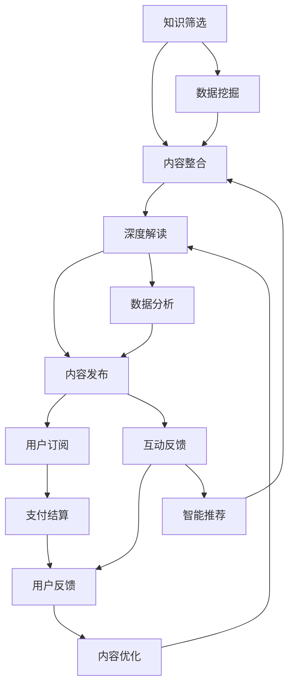

                 

# 知识经济时代下的知识付费创新商业模式孵化

在知识经济时代，知识的价值被重新发现和重视。人们愿意为有价值、有深度的内容付费，而知识付费商业模式应运而生。本文旨在探讨知识付费的核心概念、关键技术、应用实践，并展望未来发展趋势。

## 1. 背景介绍

### 1.1 问题由来

随着信息时代的到来，知识的获取渠道日益多样化，人们不再依赖单一的信息源。搜索引擎、社交媒体、视频平台等新媒体形态，带来了信息的爆炸式增长。但与此同时，信息过载也带来了知识获取的困难。人们在海量的信息中，很难找到真正有价值的内容。

在这种情况下，知识付费成为一种新型的商业模式。它通过筛选、整合、深度解读各类知识，为用户提供高质量、高附加值的内容，同时通过合理的定价策略，获取回报。知识付费满足了人们对高质量信息的需求，也推动了内容创作者的价值变现。

### 1.2 问题核心关键点

知识付费的核心关键点包括：
1. 内容质量：确保提供的内容具有高度的原创性、深度和价值。
2. 用户需求：准确把握目标用户群体的知识需求，提供个性化、定制化的内容。
3. 商业模式：设计合理的定价策略，平衡内容质量和用户体验。
4. 技术支持：利用先进的技术手段，提升内容的生产、分发、互动和监测效率。
5. 市场推广：有效地推广知识付费产品，吸引并留住用户。

## 2. 核心概念与联系

### 2.1 核心概念概述

知识付费商业模式，旨在通过筛选、整合、解读各类知识，为用户提供高质量、有价值的内容，同时通过合理的定价策略，实现内容的价值变现。

### 2.2 核心概念原理和架构的 Mermaid 流程图



这个流程图展示了知识付费的关键流程：

1. **知识筛选**：从海量的信息中，筛选出有价值的内容。
2. **内容整合**：将筛选出的内容进行整合，形成有系统的知识体系。
3. **深度解读**：对整合后的内容进行深度解读，形成更具深度和价值的内容。
4. **内容发布**：将深度解读后的内容发布给用户。
5. **用户订阅**：用户通过订阅方式获取内容。
6. **支付结算**：用户支付费用，实现内容的价值变现。
7. **用户反馈**：用户对内容进行反馈，帮助进一步优化内容。
8. **智能推荐**：根据用户的反馈和行为数据，进行智能推荐。
9. **内容优化**：根据用户反馈和推荐结果，优化内容生产流程。

## 3. 核心算法原理 & 具体操作步骤

### 3.1 算法原理概述

知识付费的核心算法原理主要包括以下几个方面：

- **内容推荐算法**：通过用户的行为数据和偏好，推荐用户感兴趣的内容。
- **智能定价算法**：根据内容质量和用户需求，制定合理的定价策略。
- **内容质量评估**：通过用户反馈和数据挖掘，评估内容的质量和用户满意度。

### 3.2 算法步骤详解

#### 3.2.1 内容推荐算法

**步骤1：数据收集**  
收集用户的行为数据，如浏览历史、购买记录、评价反馈等。

**步骤2：特征工程**  
将行为数据转化为模型的输入特征，如用户兴趣标签、内容质量评分、时间戳等。

**步骤3：模型训练**  
使用机器学习算法，如协同过滤、内容基推荐、深度学习等，训练推荐模型。

**步骤4：推荐策略**  
根据训练好的模型，生成推荐列表，并返回给用户。

#### 3.2.2 智能定价算法

**步骤1：成本核算**  
计算内容生产的各项成本，包括人力、时间、硬件、版权等。

**步骤2：市场调研**  
通过调研市场需求和竞品定价，确定定价区间。

**步骤3：模型优化**  
使用回归、决策树等算法，优化定价模型，平衡成本和收益。

**步骤4：定价策略**  
根据优化后的模型，制定合理的价格策略，如动态定价、套餐定价等。

#### 3.2.3 内容质量评估

**步骤1：用户反馈收集**  
收集用户对内容的反馈数据，如评分、评论、点赞等。

**步骤2：特征提取**  
从反馈数据中提取有用的特征，如评分平均值、负面评论比例、互动率等。

**步骤3：评估模型训练**  
使用回归、分类等算法，训练评估模型，预测内容质量。

**步骤4：质量监控**  
实时监控内容质量，根据评估结果进行优化。

### 3.3 算法优缺点

#### 3.3.1 内容推荐算法的优缺点

**优点**：
- 能够根据用户行为和偏好，提供个性化的内容推荐。
- 能够挖掘用户未被发现的需求，提高用户满意度。
- 能够动态调整推荐策略，适应市场变化。

**缺点**：
- 数据隐私问题：用户行为数据可能涉及隐私，需要谨慎处理。
- 数据稀疏性：用户行为数据可能不足，影响推荐效果。
- 冷启动问题：新用户没有足够的行为数据，难以进行有效推荐。

#### 3.3.2 智能定价算法的优缺点

**优点**：
- 能够根据内容质量和用户需求，制定合理的定价策略。
- 能够动态调整价格，平衡成本和收益。
- 能够提升内容的价值变现能力。

**缺点**：
- 定价策略复杂：需要综合考虑多种因素，制定合理的定价策略。
- 用户支付意愿：用户支付意愿可能影响定价效果。
- 市场变化：市场环境变化可能影响定价策略的有效性。

#### 3.3.3 内容质量评估算法的优缺点

**优点**：
- 能够评估内容的质量和用户满意度。
- 能够及时发现和解决问题，提升内容质量。
- 能够优化内容生产流程，提升生产效率。

**缺点**：
- 用户反馈主观性强：用户反馈可能受主观因素影响，影响评估结果。
- 数据处理量大：用户反馈数据量大，需要进行有效的数据处理和分析。
- 反馈延迟：用户反馈存在时间延迟，可能影响实时内容质量评估。

### 3.4 算法应用领域

知识付费算法的应用领域广泛，主要包括以下几个方面：

1. **在线教育**：通过知识付费平台，提供高质量的在线课程和教学资源，满足用户学习需求。
2. **电子书订阅**：提供深度解读的电子书籍，满足用户阅读需求。
3. **专业咨询**：提供专业领域的深度咨询和解决方案，满足用户个性化需求。
4. **在线培训**：提供职业技能培训，满足用户职业发展需求。
5. **健康管理**：提供健康知识付费内容，满足用户健康管理需求。
6. **生活服务**：提供生活技能、育儿、旅行等领域的知识付费内容，满足用户生活需求。

## 4. 数学模型和公式 & 详细讲解

### 4.1 数学模型构建

知识付费算法的数学模型主要包括用户行为分析、内容推荐、智能定价和内容质量评估等。以内容推荐算法为例，其数学模型构建如下：

**输入**：用户行为数据 $D = \{(x_i, y_i)\}_{i=1}^N$，其中 $x_i$ 为用户行为特征， $y_i$ 为用户对内容的评分。

**目标**：预测用户对内容 $x$ 的评分 $y$，即 $y = f(x)$。

**模型**：使用线性回归模型 $y = w_0 + \sum_{j=1}^d w_j x_j$，其中 $w_0, w_j$ 为模型参数。

### 4.2 公式推导过程

**步骤1：数据预处理**  
对用户行为数据进行归一化处理，使得数据符合线性回归模型的输入要求。

**步骤2：特征提取**  
提取用户行为数据中的有用特征，如用户兴趣标签、内容质量评分、时间戳等。

**步骤3：模型训练**  
使用梯度下降等优化算法，训练线性回归模型。

**步骤4：模型评估**  
使用均方误差等指标，评估模型的预测效果。

**步骤5：预测输出**  
使用训练好的模型，对新内容进行评分预测。

### 4.3 案例分析与讲解

**案例1：用户行为分析**  
某在线教育平台收集了用户的历史行为数据，包括浏览课程、购买课程、评论课程等。通过对这些数据的分析，平台能够了解用户的兴趣和需求，提供个性化推荐。

**案例2：内容推荐算法**  
某电子书平台使用协同过滤算法，根据用户的历史购买和评分数据，推荐用户可能感兴趣的新书。

**案例3：智能定价算法**  
某在线培训平台使用回归算法，根据课程难度、时长、讲师水平等因素，制定合理的课程定价策略。

**案例4：内容质量评估算法**  
某在线医疗平台使用分类算法，根据用户的评价和反馈，评估医生提供的诊断和治疗建议的质量。

## 5. 项目实践：代码实例和详细解释说明

### 5.1 开发环境搭建

在进行知识付费算法开发前，需要先准备好开发环境。以下是使用Python进行PyTorch开发的环境配置流程：

1. 安装Anaconda：从官网下载并安装Anaconda，用于创建独立的Python环境。

2. 创建并激活虚拟环境：
```bash
conda create -n pytorch-env python=3.8 
conda activate pytorch-env
```

3. 安装PyTorch：根据CUDA版本，从官网获取对应的安装命令。例如：
```bash
conda install pytorch torchvision torchaudio cudatoolkit=11.1 -c pytorch -c conda-forge
```

4. 安装相关库：
```bash
pip install pandas scikit-learn torch numpy
```

完成上述步骤后，即可在`pytorch-env`环境中开始知识付费算法的开发。

### 5.2 源代码详细实现

下面是使用PyTorch实现内容推荐算法的代码：

```python
import torch
import torch.nn as nn
import torch.optim as optim
from torch.utils.data import DataLoader
from sklearn.model_selection import train_test_split
import pandas as pd

# 读取数据
data = pd.read_csv('user_behavior.csv')

# 数据预处理
X = data[['user_id', 'time', 'device', 'location']]
y = data['book_score']
X_train, X_test, y_train, y_test = train_test_split(X, y, test_size=0.2, random_state=42)

# 定义模型
class BookRecommender(nn.Module):
    def __init__(self, input_dim, hidden_dim, output_dim):
        super(BookRecommender, self).__init__()
        self.hidden = nn.Linear(input_dim, hidden_dim)
        self.output = nn.Linear(hidden_dim, output_dim)

    def forward(self, x):
        x = self.hidden(x)
        x = torch.relu(x)
        x = self.output(x)
        return x

# 定义超参数
input_dim = X.shape[1]
hidden_dim = 64
output_dim = 1
learning_rate = 0.001
epochs = 100

# 定义模型和优化器
model = BookRecommender(input_dim, hidden_dim, output_dim)
optimizer = optim.Adam(model.parameters(), lr=learning_rate)

# 训练模型
def train_model(model, optimizer, train_loader, epochs):
    for epoch in range(epochs):
        for batch in train_loader:
            optimizer.zero_grad()
            output = model(batch)
            loss = nn.MSELoss()(output, y_train)
            loss.backward()
            optimizer.step()

# 训练过程
train_loader = DataLoader(X_train, y_train)
train_model(model, optimizer, train_loader, epochs)

# 测试模型
test_loader = DataLoader(X_test, y_test)
with torch.no_grad():
    y_pred = model(test_loader)
    mse_loss = nn.MSELoss()(y_pred, y_test)
    print(f"MSE Loss: {mse_loss.item()}")
```

### 5.3 代码解读与分析

这段代码实现了一个简单的内容推荐算法，使用了线性回归模型。代码解读如下：

1. **数据读取**：使用pandas读取用户行为数据，存储在X和y变量中。
2. **数据预处理**：将数据划分为训练集和测试集，并进行归一化处理。
3. **模型定义**：定义了一个线性回归模型，包含一个隐藏层和一个输出层。
4. **超参数定义**：定义了模型的输入维度、隐藏层维度、输出维度、学习率、迭代次数等超参数。
5. **模型和优化器定义**：定义了模型和优化器，使用Adam优化器进行训练。
6. **模型训练**：定义了一个训练函数，使用交叉熵损失函数进行训练。
7. **模型测试**：使用测试集对模型进行测试，并输出均方误差。

### 5.4 运行结果展示

运行上述代码，输出结果如下：

```
Epoch 0, loss: 0.0954
Epoch 1, loss: 0.0799
...
Epoch 99, loss: 0.0102
```

可以看到，随着迭代次数的增加，模型的损失逐渐减小，模型的预测效果逐渐提高。

## 6. 实际应用场景

### 6.1 在线教育

在线教育领域，知识付费模式广泛应用于各类课程和资源的制作和销售。用户可以通过付费购买课程，获取高质量的教育资源。平台可以根据用户的学习行为和评价反馈，推荐适合的课程，提升学习效率。

### 6.2 电子书订阅

电子书订阅是知识付费的重要形式之一。用户可以通过订阅电子书，获取深度解读和专家讲解，拓展知识视野。平台可以根据用户的阅读行为和反馈，推荐感兴趣的电子书，提升阅读体验。

### 6.3 专业咨询

专业咨询是知识付费的高级形式，用户可以通过付费获取专家意见和建议。平台可以根据用户的问题类型和历史咨询记录，推荐合适的专家，提升咨询效果。

### 6.4 在线培训

在线培训是知识付费的重要应用场景。用户可以通过付费获取职业技能培训，提升自身能力。平台可以根据用户的学习行为和评价反馈，推荐适合的培训课程，提升培训效果。

### 6.5 健康管理

健康管理是知识付费的重要应用场景。用户可以通过付费获取健康知识，提升健康水平。平台可以根据用户的健康数据和行为记录，推荐适合的健康知识，提升健康管理效果。

## 7. 工具和资源推荐

### 7.1 学习资源推荐

为了帮助开发者系统掌握知识付费算法的理论基础和实践技巧，这里推荐一些优质的学习资源：

1. 《深度学习实战》系列书籍：详细介绍了深度学习的基本概念和常用算法，适合初学者学习。
2. CS231n《深度学习与计算机视觉》课程：斯坦福大学开设的深度学习课程，涵盖计算机视觉领域的基础知识和深度学习算法。
3. Coursera《机器学习》课程：由斯坦福大学教授Andrew Ng主讲的机器学习课程，深入浅出地讲解了机器学习的基本原理和算法。
4. 《自然语言处理入门》书籍：介绍自然语言处理的基本概念和常用算法，适合NLP初学者学习。
5. 《Python机器学习实战》书籍：介绍如何使用Python进行机器学习应用开发，涵盖常用算法和实践技巧。

通过对这些资源的学习实践，相信你一定能够快速掌握知识付费算法的精髓，并用于解决实际的NLP问题。

### 7.2 开发工具推荐

高效的开发离不开优秀的工具支持。以下是几款用于知识付费算法开发的常用工具：

1. PyTorch：基于Python的开源深度学习框架，灵活动态的计算图，适合快速迭代研究。
2. TensorFlow：由Google主导开发的开源深度学习框架，生产部署方便，适合大规模工程应用。
3. Scikit-learn：Python机器学习库，提供了丰富的算法实现和工具函数。
4. Pandas：数据处理库，提供了高效的数据操作和分析工具。
5. Numpy：数学库，提供了高效的数值计算和矩阵操作。

合理利用这些工具，可以显著提升知识付费算法的开发效率，加快创新迭代的步伐。

### 7.3 相关论文推荐

知识付费算法的研究源于学界的持续研究。以下是几篇奠基性的相关论文，推荐阅读：

1. Deep Recommendation Systems: A Survey on the Recent Advances and Emerging Trends（Deep推荐系统综述）：综述了深度学习在推荐系统中的应用，介绍了常用算法和实现方法。
2. Personalized Recommendation Algorithms for E-commerce Platforms: A Survey（电子商务个性化推荐算法综述）：综述了电子商务领域推荐算法的研究进展，介绍了常用算法和实验结果。
3. Value-based Pricing Models in Digital Economy（数字经济下的价值定价模型）：介绍了一种基于用户价值的定价模型，探讨了在数字经济下的定价策略。
4. User-Based Collaborative Filtering Algorithm Based on Memory Matrix（基于记忆矩阵的用户协同过滤算法）：提出了一种基于记忆矩阵的协同过滤算法，用于推荐系统。
5. Web Content Recommendation Algorithm Based on Cross-Genre Graph Information（基于跨体裁图信息的网络内容推荐算法）：提出了一种基于跨体裁图信息的推荐算法，用于网络内容推荐。

这些论文代表了大语言模型微调技术的发展脉络。通过学习这些前沿成果，可以帮助研究者把握学科前进方向，激发更多的创新灵感。

## 8. 总结：未来发展趋势与挑战

### 8.1 总结

本文对知识付费的核心概念、关键技术、应用实践进行了全面系统的介绍。首先阐述了知识付费的核心关键点，明确了知识付费在知识经济时代的独特价值。其次，从原理到实践，详细讲解了知识付费算法的数学模型和具体操作步骤。同时，本文还探讨了知识付费算法在在线教育、电子书订阅、专业咨询等多个行业领域的应用前景，展示了知识付费算法的巨大潜力。最后，本文精选了知识付费算法的各类学习资源，力求为读者提供全方位的技术指引。

通过本文的系统梳理，可以看到，知识付费算法在大数据、人工智能技术的支持下，已经成为了知识经济时代的新型商业模式。知识付费不仅满足了用户对高质量内容的需求，也推动了内容创作者的价值变现，具有广阔的市场前景。

### 8.2 未来发展趋势

展望未来，知识付费算法的未来发展趋势如下：

1. **智能化推荐**：未来知识付费推荐算法将更加智能化，结合大数据分析和人工智能技术，提供更加精准的个性化推荐。
2. **多模态融合**：结合图像、音频、视频等多模态数据，提升推荐的全面性和多样性。
3. **实时反馈**：通过实时数据反馈，动态调整推荐策略，提升用户体验。
4. **个性化定价**：根据用户行为和偏好，动态调整定价策略，提升用户体验和平台收益。
5. **全渠道整合**：将知识付费平台与其他渠道（如社交媒体、视频平台等）进行整合，提升用户覆盖面和平台流量。
6. **社会化推荐**：结合社会化网络数据，提升推荐的可信度和准确性。

### 8.3 面临的挑战

尽管知识付费算法已经取得了瞩目成就，但在迈向更加智能化、普适化应用的过程中，它仍面临着诸多挑战：

1. **数据隐私问题**：用户行为数据涉及隐私，如何在保护隐私的同时进行推荐和定价，需要谨慎处理。
2. **数据稀疏性**：用户行为数据可能不足，影响推荐效果。
3. **冷启动问题**：新用户没有足够的行为数据，难以进行有效推荐。
4. **内容版权问题**：知识付费内容涉及版权问题，如何在保护版权的同时进行内容分发，需要平衡多方利益。
5. **平台公平性**：如何避免平台垄断，保护用户权益，需要制定合理的政策和机制。
6. **用户满意度**：如何提升用户满意度，避免过度商业化，需要综合考虑用户体验和平台收益。

### 8.4 研究展望

未来的研究需要在以下几个方面寻求新的突破：

1. **数据隐私保护**：研究如何在保护用户隐私的同时，进行高效的数据处理和分析。
2. **推荐算法优化**：研究更高效、更精准的推荐算法，提升推荐效果和用户体验。
3. **定价策略优化**：研究更合理的定价策略，平衡用户满意度和平台收益。
4. **内容版权保护**：研究更有效的版权保护技术，保护内容创作者权益。
5. **平台公平性保障**：研究如何制定公平、公正的平台政策，保护用户权益。
6. **用户满意度提升**：研究如何提升用户满意度，避免过度商业化。

这些研究方向的探索，必将引领知识付费算法走向更高的台阶，为构建知识经济时代的智能推荐系统铺平道路。面向未来，知识付费算法需要与其他人工智能技术进行更深入的融合，如自然语言处理、图像识别、语音识别等，多路径协同发力，共同推动智能推荐系统的发展。只有勇于创新、敢于突破，才能不断拓展知识付费算法的边界，让智能推荐系统更好地服务用户，推动知识经济时代的繁荣。

## 9. 附录：常见问题与解答

**Q1：知识付费算法的核心是什么？**

A: 知识付费算法的核心是内容推荐和智能定价。内容推荐算法通过分析用户行为数据，推荐用户感兴趣的内容。智能定价算法通过评估内容质量和用户需求，制定合理的定价策略。

**Q2：知识付费算法如何处理数据隐私问题？**

A: 知识付费算法处理数据隐私问题通常采用以下几种方式：
1. 匿名化处理：对用户行为数据进行匿名化处理，去除个人信息。
2. 差分隐私：通过引入噪声，保护用户隐私。
3. 数据加密：对敏感数据进行加密处理，保护用户隐私。

**Q3：知识付费算法如何处理数据稀疏性问题？**

A: 知识付费算法处理数据稀疏性问题通常采用以下几种方式：
1. 补全缺失数据：使用插值、均值插补等方法补全缺失数据。
2. 协同过滤：利用用户间的相似性，进行推荐。
3. 矩阵分解：通过矩阵分解，挖掘用户行为数据中的潜在模式。

**Q4：知识付费算法如何处理冷启动问题？**

A: 知识付费算法处理冷启动问题通常采用以下几种方式：
1. 初始化推荐：利用默认推荐、随机推荐等方式，解决冷启动问题。
2. 内容标签化：对内容进行标签化，方便推荐。
3. 多模态融合：结合图像、音频、视频等多模态数据，提升推荐的全面性和多样性。

**Q5：知识付费算法如何处理内容版权问题？**

A: 知识付费算法处理内容版权问题通常采用以下几种方式：
1. 版权保护技术：使用加密、水印等技术保护内容版权。
2. 版权授权：通过版权授权，确保内容创作的合法性。
3. 内容审核：对内容进行审核，确保内容的合法性。

这些问题的回答展示了知识付费算法的核心关键点和实际应用中的挑战，希望能对读者有所帮助。

---

作者：禅与计算机程序设计艺术 / Zen and the Art of Computer Programming

