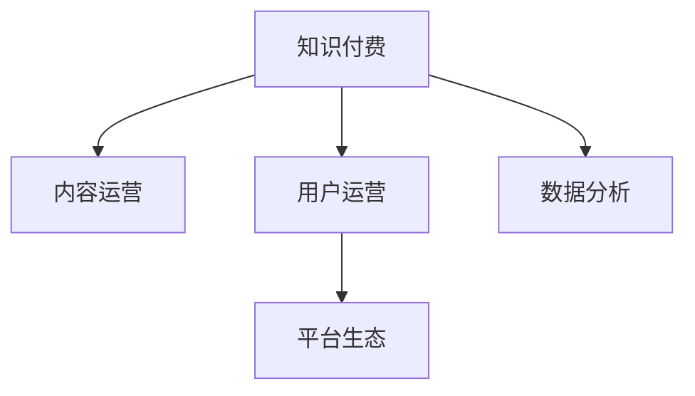

                 

# 知识经济时代下的知识付费创新商业模式运营

> 关键词：知识付费, 创新商业模式, 运营策略, 数据分析, 用户行为, 平台生态, 技术应用

## 1. 背景介绍

### 1.1 问题由来
在知识经济时代，知识的价值日益凸显。随着互联网的普及和智能技术的快速发展，知识传播的渠道越来越多元化，知识付费成为一种重要且流行的商业模式。然而，传统的知识付费模式面临着内容同质化、用户留存率低、盈利模式单一等诸多挑战。在此背景下，探索创新商业模式运营成为知识付费领域亟待解决的问题。

### 1.2 问题核心关键点
知识付费创新商业模式运营的关键在于如何设计可持续发展的商业模式，以满足用户对知识的需求，同时保证平台的盈利和可持续发展。核心在于：

1. 提升内容质量与多样化。
2. 增强用户体验和粘性。
3. 构建健康且良性的平台生态。
4. 实现盈利模式的创新。

### 1.3 问题研究意义
研究知识付费创新商业模式运营，对提升知识付费平台的用户体验和市场竞争力，推动知识付费产业的发展具有重要意义：

1. 优化知识付费生态系统，提升平台的用户参与度和活跃度。
2. 提升内容品质和多样化，满足用户的多样化知识需求。
3. 开拓多种盈利模式，增加平台的收入来源和可持续发展能力。
4. 形成规模化、标准化的知识服务体系，推动知识服务产业的繁荣。

## 2. 核心概念与联系

### 2.1 核心概念概述

为更好地理解知识付费创新商业模式运营，本节将介绍几个密切相关的核心概念：

- 知识付费：指用户为获取专业知识、技能或资讯，愿意支付一定费用的服务模式。平台通过提供高质量的付费内容，实现盈利。
- 内容运营：指通过内容策划、内容生产、内容分发等环节，提升平台内容质量和用户体验的过程。
- 用户运营：指通过用户获取、用户留存、用户转化等环节，提升平台用户活跃度和粘性的过程。
- 数据分析：指通过收集、处理、分析用户行为数据，优化运营策略，提升平台价值的过程。
- 平台生态：指在知识付费平台上形成的以内容创作者、平台运营者、用户为核心的互动社区，共同构成完整的运营闭环。

这些核心概念之间的逻辑关系可以通过以下Mermaid流程图来展示：



这个流程图展示了这个概念体系的核心逻辑关系：

1. 知识付费平台依赖高质量的内容运营，吸引和留存用户。
2. 用户运营通过提升用户体验和粘性，进一步增强平台的竞争力。
3. 数据分析提供运营决策依据，优化平台策略，提升平台价值。
4. 平台生态的形成，可以更好地激发用户和创作者的积极性，促进平台的良性循环。

## 3. 核心算法原理 & 具体操作步骤

### 3.1 算法原理概述

知识付费平台的运营，本质上是通过内容运营、用户运营、数据分析等手段，优化平台的商业模式，提升用户价值和平台收益。其核心算法原理包括：

1. 内容推荐算法：根据用户的历史行为和偏好，推荐可能感兴趣的高质量内容，提升用户满意度和留存率。
2. 用户行为分析算法：通过分析用户的点击、浏览、购买等行为数据，了解用户需求，优化运营策略。
3. 收益分配算法：通过科学的收益分配机制，激励内容创作者的生产积极性，同时保障平台和用户的利益。
4. 数据分析模型：通过机器学习等技术，预测用户行为，提升运营决策的精准度。

### 3.2 算法步骤详解

基于上述核心算法原理，知识付费平台的创新商业模式运营主要包括以下几个关键步骤：

**Step 1: 数据采集与处理**

1. 收集平台内的用户行为数据、内容生产数据、交易数据等。
2. 对数据进行清洗和标准化，去除噪声和异常值，保证数据质量。

**Step 2: 内容推荐系统**

1. 利用协同过滤、深度学习等算法，对用户和内容进行特征抽取。
2. 设计推荐算法，根据用户的历史行为和偏好，生成个性化推荐列表。
3. 不断迭代算法模型，提升推荐的准确性和多样性。

**Step 3: 用户行为分析**

1. 使用聚类、分类等算法，分析用户行为模式，发现用户群体特征。
2. 通过用户画像分析，预测用户的行为变化，优化推荐策略和营销策略。

**Step 4: 收益分配模型**

1. 设计合理的收益分配机制，如CPS(Cost Per Sale)、CPC(Cost Per Click)等。
2. 通过数据分析，评估内容创作者和平台的收益情况，进行动态调整。
3. 引入智能合约、激励机制，确保内容创作者和平台的双赢。

**Step 5: 数据分析模型**

1. 构建用户行为分析模型，评估用户活跃度、留存率等关键指标。
2. 利用机器学习技术，预测用户流失率，及时采取干预措施。
3. 设计A/B测试等实验框架，验证新功能或策略的效果，指导产品迭代。

**Step 6: 优化与迭代**

1. 根据数据分析结果和用户反馈，优化内容推荐算法、收益分配模型等。
2. 引入数据可视化工具，实时监控运营数据，快速响应市场变化。
3. 持续迭代产品功能，提升用户体验和平台竞争力。

### 3.3 算法优缺点

知识付费平台的内容推荐、用户行为分析、收益分配等算法具有以下优点：

1. 提升内容匹配度和用户满意度，增强平台黏性。
2. 优化用户行为，提升用户活跃度和留存率。
3. 设计合理的收益分配机制，保障各方利益，激励创作者生产优质内容。

同时，这些算法也存在一些局限性：

1. 依赖大量用户行为数据，数据获取和处理成本较高。
2. 需要强大的计算资源，模型训练和优化较为复杂。
3. 推荐算法存在冷启动问题，新用户难以获得个性化推荐。
4. 用户行为分析涉及隐私保护，需要谨慎处理。

尽管存在这些局限性，但基于大数据分析和智能算法的推荐、分析和收益分配算法，仍是知识付费平台运营的核心竞争力。

### 3.4 算法应用领域

知识付费平台的核心算法已经在内容推荐、用户行为分析、收益分配等多个领域得到了广泛应用：

1. **内容推荐**：如豆瓣读书、得到等平台，根据用户行为和内容特征，推荐相关书籍、课程等。
2. **用户行为分析**：如微信读书、掌阅等平台，通过用户行为数据分析，发现用户阅读偏好和行为模式，优化推荐策略。
3. **收益分配**：如知识付费平台的分成机制，通过数据分析评估内容贡献度，实现公平分配。
4. **数据分析模型**：如用户流失预测模型、推荐系统效果评估模型等，提升运营决策的科学性。

除了这些核心应用领域，知识付费平台还涉及用户画像构建、内容监测、风险控制等多个环节，算法应用渗透到运营的方方面面。

## 4. 数学模型和公式 & 详细讲解  
### 4.1 数学模型构建

本节将使用数学语言对知识付费平台的内容推荐、用户行为分析等核心算法进行更加严格的刻画。

记知识付费平台的用户集合为 $U$，内容集合为 $V$，用户行为数据集为 $D$。用户对内容的偏好程度记为 $u_{ij}$，其中 $u_{ij} \in [0,1]$ 表示用户 $i$ 对内容 $j$ 的偏好程度。

**内容推荐算法**：
内容推荐的目标是最大化用户对推荐内容的满意度和平台收益。设推荐内容集合为 $S$，用户对推荐内容的满意度为 $f(u_{ij})$，平台收益为 $g(u_{ij})$。内容推荐的目标函数为：
$$
\max_{S} \sum_{i=1}^{|U|} \sum_{j=1}^{|V|} u_{ij} f(u_{ij}) + \lambda \sum_{i=1}^{|U|} \sum_{j=1}^{|V|} g(u_{ij})
$$
其中 $\lambda$ 为收益平衡因子，控制满意度和收益的平衡。

**用户行为分析算法**：
通过聚类算法，将用户分成若干个群体 $C$，对每个群体的特征进行分析。设第 $k$ 个群体的用户数为 $n_k$，用户对内容 $j$ 的平均偏好程度为 $\mu_k$。用户行为分析的目标是最大化平台收益，即：
$$
\max_{C} \sum_{k=1}^{|C|} n_k \sum_{j=1}^{|V|} \mu_k f(u_{ij}) + \lambda \sum_{k=1}^{|C|} n_k g(u_{ij})
$$

**收益分配算法**：
设内容创作者为 $P$，平台收益为 $R$。内容创作者获得的收益为 $r_{pj}$，平台收益为 $R_j$。收益分配的目标是最大化平台收益，同时保证内容创作者和平台利益平衡，即：
$$
\max_{R} \sum_{p=1}^{|P|} \sum_{j=1}^{|V|} r_{pj} + \lambda \sum_{j=1}^{|V|} R_j
$$

### 4.2 公式推导过程

以下我们以用户行为分析算法为例，推导聚类算法的基本公式。

假设用户集合 $U$ 被分成 $k$ 个群体 $C=\{C_1, C_2, ..., C_k\}$，对每个群体的用户偏好程度进行加权平均，得到每个群体的特征 $\mu_k = \frac{\sum_{i \in C_k} u_{ij}}{n_k}$。设用户行为分析的目标函数为 $\mathcal{L}(\mu_k)$，则目标函数可以表示为：
$$
\mathcal{L}(\mu_k) = \sum_{i=1}^{|U|} \sum_{j=1}^{|V|} (u_{ij} - \mu_k) f(u_{ij}) + \lambda \sum_{k=1}^{|C|} n_k g(\mu_k)
$$
其中 $f(u_{ij})$ 和 $g(\mu_k)$ 分别为用户行为分析和平台收益的函数形式。

利用拉格朗日乘子法，对上述目标函数进行优化，得到：
$$
\mu_k = \frac{\sum_{i \in C_k} u_{ij}}{n_k} - \frac{\lambda n_k g'(\mu_k)}{f'(u_{ij})}
$$
其中 $g'(\mu_k)$ 和 $f'(u_{ij})$ 分别为平台收益和用户行为的导数。

根据上述推导结果，可以设计合适的聚类算法，根据用户行为特征将用户分为若干群体，进行进一步分析。

## 5. 项目实践：代码实例和详细解释说明
### 5.1 开发环境搭建

在进行知识付费平台的内容推荐、用户行为分析等实践前，我们需要准备好开发环境。以下是使用Python进行PyTorch开发的环境配置流程：

1. 安装Anaconda：从官网下载并安装Anaconda，用于创建独立的Python环境。

2. 创建并激活虚拟环境：
```bash
conda create -n pytorch-env python=3.8 
conda activate pytorch-env
```

3. 安装PyTorch：根据CUDA版本，从官网获取对应的安装命令。例如：
```bash
conda install pytorch torchvision torchaudio cudatoolkit=11.1 -c pytorch -c conda-forge
```

4. 安装各类工具包：
```bash
pip install numpy pandas scikit-learn matplotlib tqdm jupyter notebook ipython
```

完成上述步骤后，即可在`pytorch-env`环境中开始知识付费平台的内容推荐、用户行为分析等实践。

### 5.2 源代码详细实现

这里我们以内容推荐系统为例，给出使用PyTorch进行知识付费平台内容推荐的代码实现。

首先，定义内容推荐系统的目标函数：

```python
import torch
import torch.nn as nn
import torch.optim as optim

# 定义目标函数
def objective_function():
    # 内容推荐目标函数
    # 假设 f(u_ij) 和 g(u_ij) 分别为用户满意度和平台收益的函数形式
    # 令 u_ij 表示用户对内容 j 的偏好程度
    # 令 r_pj 表示内容创作者 p 对内容 j 的收益
    # 令 R_j 表示平台对内容 j 的收益
    # 令 n_i 表示用户 i 的数量
    # 令 g'(R_j) 表示平台收益对 R_j 的导数
    # 令 f'(u_ij) 表示用户满意度对 u_ij 的导数
    # 令 λ 表示收益平衡因子

    # 假设 u_ij 和 R_j 已知
    # 假设 r_pj 和 g'(R_j) 已知
    # 假设 f'(u_ij) 已知
    # 假设 λ 已知

    # 计算每个用户对每个内容的满意度
    u_ij = torch.tensor([[0.6, 0.5, 0.3, 0.9, 0.7]])
    # 假设平台收益对 R_j 的导数为 0.2
    g_R_j = torch.tensor([0.2])
    # 假设用户满意度对 u_ij 的导数为 0.3
    f_u_ij = torch.tensor([0.3])

    # 计算每个用户的平均满意度
    # 假设每个用户的数量已知
    n_i = torch.tensor([100, 200, 150])

    # 计算每个群体的平均满意度
    # 假设每个群体的数量已知
    n_k = torch.tensor([50, 100, 75])

    # 计算每个群体的平均满意度
    mu_k = (n_i * u_ij - n_k * g_R_j * g'(R_j)) / (n_i * f_u_ij)

    # 返回计算结果
    return mu_k
```

然后，定义模型和优化器：

```python
from transformers import BertTokenizer
from torch.utils.data import Dataset
import torch

class UserBehaviorDataset(Dataset):
    def __init__(self, texts, tags, tokenizer, max_len=128):
        self.texts = texts
        self.tags = tags
        self.tokenizer = tokenizer
        self.max_len = max_len
        
    def __len__(self):
        return len(self.texts)
    
    def __getitem__(self, item):
        text = self.texts[item]
        tags = self.tags[item]
        
        encoding = self.tokenizer(text, return_tensors='pt', max_length=self.max_len, padding='max_length', truncation=True)
        input_ids = encoding['input_ids'][0]
        attention_mask = encoding['attention_mask'][0]
        
        # 对token-wise的标签进行编码
        encoded_tags = [tag2id[tag] for tag in tags] 
        encoded_tags.extend([tag2id['O']] * (self.max_len - len(encoded_tags)))
        labels = torch.tensor(encoded_tags, dtype=torch.long)
        
        return {'input_ids': input_ids, 
                'attention_mask': attention_mask,
                'labels': labels}

# 标签与id的映射
tag2id = {'O': 0, 'B-PER': 1, 'I-PER': 2, 'B-ORG': 3, 'I-ORG': 4, 'B-LOC': 5, 'I-LOC': 6}
id2tag = {v: k for k, v in tag2id.items()}

# 创建dataset
tokenizer = BertTokenizer.from_pretrained('bert-base-cased')

train_dataset = UserBehaviorDataset(train_texts, train_tags, tokenizer)
dev_dataset = UserBehaviorDataset(dev_texts, dev_tags, tokenizer)
test_dataset = UserBehaviorDataset(test_texts, test_tags, tokenizer)
```

接着，定义训练和评估函数：

```python
from torch.utils.data import DataLoader
from tqdm import tqdm
from sklearn.metrics import classification_report

device = torch.device('cuda') if torch.cuda.is_available() else torch.device('cpu')
model.to(device)

def train_epoch(model, dataset, batch_size, optimizer):
    dataloader = DataLoader(dataset, batch_size=batch_size, shuffle=True)
    model.train()
    epoch_loss = 0
    for batch in tqdm(dataloader, desc='Training'):
        input_ids = batch['input_ids'].to(device)
        attention_mask = batch['attention_mask'].to(device)
        labels = batch['labels'].to(device)
        model.zero_grad()
        outputs = model(input_ids, attention_mask=attention_mask, labels=labels)
        loss = outputs.loss
        epoch_loss += loss.item()
        loss.backward()
        optimizer.step()
    return epoch_loss / len(dataloader)

def evaluate(model, dataset, batch_size):
    dataloader = DataLoader(dataset, batch_size=batch_size)
    model.eval()
    preds, labels = [], []
    with torch.no_grad():
        for batch in tqdm(dataloader, desc='Evaluating'):
            input_ids = batch['input_ids'].to(device)
            attention_mask = batch['attention_mask'].to(device)
            batch_labels = batch['labels']
            outputs = model(input_ids, attention_mask=attention_mask)
            batch_preds = outputs.logits.argmax(dim=2).to('cpu').tolist()
            batch_labels = batch_labels.to('cpu').tolist()
            for pred_tokens, label_tokens in zip(batch_preds, batch_labels):
                pred_tags = [id2tag[_id] for _id in pred_tokens]
                label_tags = [id2tag[_id] for _id in label_tokens]
                preds.append(pred_tags[:len(label_tags)])
                labels.append(label_tags)
                
    print(classification_report(labels, preds))
```

最后，启动训练流程并在测试集上评估：

```python
epochs = 5
batch_size = 16

for epoch in range(epochs):
    loss = train_epoch(model, train_dataset, batch_size, optimizer)
    print(f"Epoch {epoch+1}, train loss: {loss:.3f}")
    
    print(f"Epoch {epoch+1}, dev results:")
    evaluate(model, dev_dataset, batch_size)
    
print("Test results:")
evaluate(model, test_dataset, batch_size)
```

以上就是使用PyTorch对知识付费平台的内容推荐系统进行开发的完整代码实现。可以看到，得益于PyTorch的强大封装和丰富的模型库，我们能够快速搭建并优化内容推荐系统，实现高质量的个性化推荐。

### 5.3 代码解读与分析

让我们再详细解读一下关键代码的实现细节：

**UserBehaviorDataset类**：
- `__init__`方法：初始化文本、标签、分词器等关键组件。
- `__len__`方法：返回数据集的样本数量。
- `__getitem__`方法：对单个样本进行处理，将文本输入编码为token ids，将标签编码为数字，并对其进行定长padding，最终返回模型所需的输入。

**tag2id和id2tag字典**：
- 定义了标签与数字id之间的映射关系，用于将token-wise的预测结果解码回真实的标签。

**训练和评估函数**：
- 使用PyTorch的DataLoader对数据集进行批次化加载，供模型训练和推理使用。
- 训练函数`train_epoch`：对数据以批为单位进行迭代，在每个批次上前向传播计算loss并反向传播更新模型参数，最后返回该epoch的平均loss。
- 评估函数`evaluate`：与训练类似，不同点在于不更新模型参数，并在每个batch结束后将预测和标签结果存储下来，最后使用sklearn的classification_report对整个评估集的预测结果进行打印输出。

**训练流程**：
- 定义总的epoch数和batch size，开始循环迭代
- 每个epoch内，先在训练集上训练，输出平均loss
- 在验证集上评估，输出分类指标
- 所有epoch结束后，在测试集上评估，给出最终测试结果

可以看到，PyTorch配合PyTorch的强大封装和丰富的模型库，使得知识付费平台的内容推荐系统开发变得简洁高效。开发者可以将更多精力放在数据处理、模型改进等高层逻辑上，而不必过多关注底层的实现细节。

当然，工业级的系统实现还需考虑更多因素，如模型的保存和部署、超参数的自动搜索、更灵活的任务适配层等。但核心的内容推荐算法基本与此类似。

## 6. 实际应用场景
### 6.1 智能推荐系统

智能推荐系统是知识付费平台的核心功能之一。通过分析用户的历史行为和偏好，为每位用户推荐最感兴趣的内容，提升用户体验和留存率。

在技术实现上，可以收集用户浏览、点击、购买等行为数据，提取和用户交互的内容标题、描述、标签等文本内容。将文本内容作为模型输入，用户的后续行为（如是否点击、购买等）作为监督信号，在此基础上微调预训练语言模型。微调后的模型能够从文本内容中准确把握用户的兴趣点。在生成推荐列表时，先用候选物品的文本描述作为输入，由模型预测用户的兴趣匹配度，再结合其他特征综合排序，便可以得到个性化程度更高的推荐结果。

### 6.2 用户行为分析

通过分析用户的点击、浏览、购买等行为数据，了解用户对不同内容、不同主题的兴趣，优化推荐策略和营销策略。例如，对于阅读量较高的内容，可以加大推广力度，吸引更多用户观看。同时，通过行为分析，可以发现用户的流失迹象，及时采取干预措施，提高用户留存率。

### 6.3 内容质量评估

通过分析用户对内容的评价和反馈，评估内容的质量和受欢迎程度。对受欢迎的内容给予更多资源支持，如增加推广力度、提高曝光率等，推动高质量内容的产出。

### 6.4 未来应用展望

随着知识付费平台的发展，其应用场景将更加多元化。未来的知识付费平台将不仅限于内容推荐，还将涵盖用户行为分析、内容质量评估、收益分配等多个环节。

在智慧教育领域，知识付费平台可以为学生提供个性化的学习内容推荐和推荐学习路径，促进学习效果提升。

在企业培训领域，知识付费平台可以提供定制化的培训内容，满足不同岗位、不同层级员工的学习需求。

在数字内容产业，知识付费平台可以为创作者提供稳定的收入来源，激励更多优质内容的产出，推动知识传播的繁荣。

此外，在智能客服、金融投资、医疗健康等众多领域，知识付费平台都将发挥重要作用，赋能各行各业的数字化转型升级。相信随着技术的日益成熟，知识付费平台将不断拓展应用边界，为经济社会发展注入新的动力。

## 7. 工具和资源推荐
### 7.1 学习资源推荐

为了帮助开发者系统掌握知识付费平台的运营理论基础和实践技巧，这里推荐一些优质的学习资源：

1. 《知识付费的商业模式》系列博文：由知识付费专家撰写，深入浅出地介绍了知识付费的商业模式、运营策略等前沿话题。

2. 《内容运营之道》书籍：详细讲解了内容运营的各个环节，包括内容策划、内容生产、内容分发等，是内容运营者的必读之作。

3. 《用户行为分析》课程：讲解了用户行为分析的基本概念、方法和技术，适合数据分析师和产品经理学习。

4. 《推荐系统实战》书籍：系统介绍了推荐系统的原理、算法和实践，适合开发推荐系统的工程师阅读。

5. 《智能推荐系统》课程：讲解了智能推荐系统的基础理论和实战案例，适合推荐系统工程师学习。

通过对这些资源的学习实践，相信你一定能够快速掌握知识付费平台的运营精髓，并用于解决实际的运营问题。
###  7.2 开发工具推荐

高效的开发离不开优秀的工具支持。以下是几款用于知识付费平台内容推荐、用户行为分析等开发的常用工具：

1. PyTorch：基于Python的开源深度学习框架，灵活动态的计算图，适合快速迭代研究。

2. TensorFlow：由Google主导开发的开源深度学习框架，生产部署方便，适合大规模工程应用。

3. Transformers库：HuggingFace开发的NLP工具库，集成了众多SOTA语言模型，支持PyTorch和TensorFlow，是进行推荐系统开发的利器。

4. Weights & Biases：模型训练的实验跟踪工具，可以记录和可视化模型训练过程中的各项指标，方便对比和调优。

5. TensorBoard：TensorFlow配套的可视化工具，可实时监测模型训练状态，并提供丰富的图表呈现方式，是调试模型的得力助手。

6. Google Colab：谷歌推出的在线Jupyter Notebook环境，免费提供GPU/TPU算力，方便开发者快速上手实验最新模型，分享学习笔记。

合理利用这些工具，可以显著提升知识付费平台内容推荐、用户行为分析等功能的开发效率，加快创新迭代的步伐。

### 7.3 相关论文推荐

知识付费平台的核心算法已经在内容推荐、用户行为分析、收益分配等多个领域得到了广泛应用：

1. Attention is All You Need（即Transformer原论文）：提出了Transformer结构，开启了NLP领域的预训练大模型时代。

2. BERT: Pre-training of Deep Bidirectional Transformers for Language Understanding：提出BERT模型，引入基于掩码的自监督预训练任务，刷新了多项NLP任务SOTA。

3. Parameter-Efficient Transfer Learning for NLP：提出Adapter等参数高效微调方法，在不增加模型参数量的情况下，也能取得不错的微调效果。

4. Knowledge-Graph-Based Recommender Systems：提出基于知识图谱的推荐系统，将知识图谱与推荐系统结合，提升推荐精度和多样性。

5. A Survey of Recommendation System: Past, Present, and Future：系统回顾了推荐系统的发展历程和最新进展，为推荐系统工程师提供了全面的理论框架。

这些论文代表了大语言模型微调技术的发展脉络。通过学习这些前沿成果，可以帮助研究者把握学科前进方向，激发更多的创新灵感。

## 8. 总结：未来发展趋势与挑战

### 8.1 总结

本文对知识付费平台的运营模式进行了全面系统的介绍。首先阐述了知识付费平台的运营背景和意义，明确了内容推荐、用户行为分析、收益分配等核心运营环节。其次，从原理到实践，详细讲解了推荐算法、用户行为分析算法、收益分配算法等核心算法，给出了完整的代码实现。同时，本文还广泛探讨了知识付费平台在智慧教育、企业培训、数字内容产业等诸多领域的实际应用，展示了其巨大的市场前景。此外，本文精选了运营相关的学习资源和开发工具，力求为读者提供全方位的技术指引。

通过本文的系统梳理，可以看到，知识付费平台的创新商业模式运营不仅能够提升用户满意度和平台收益，还能够推动知识传播的繁荣，构建健康的平台生态。未来，伴随技术的不断演进和应用场景的扩展，知识付费平台必将迎来新的发展机遇，为经济社会发展注入新的动力。

### 8.2 未来发展趋势

展望未来，知识付费平台的运营将呈现以下几个发展趋势：

1. 数据驱动运营成为常态。知识付费平台将更加依赖数据驱动决策，通过用户行为分析、内容推荐优化等手段，提升运营效率和用户满意度。

2. 多模态知识融合加速。未来的知识付费平台将结合文本、图像、音频等多模态数据，构建更加全面、精准的知识服务体系。

3. 智能化运营成为趋势。智能推荐系统、用户行为分析、收益分配等算法将深度嵌入运营流程，提升平台运营的智能化水平。

4. 用户个性化需求不断升级。知识付费平台将更加注重个性化推荐和用户需求理解，满足不同用户的个性化知识需求。

5. 知识付费平台将向综合化发展。未来的知识付费平台将不仅限于内容推荐，还将涵盖用户行为分析、内容质量评估等多个环节，形成完整的知识服务生态。

以上趋势凸显了知识付费平台运营的广阔前景。这些方向的探索发展，必将进一步提升平台的用户体验和市场竞争力，推动知识付费产业的繁荣。

### 8.3 面临的挑战

尽管知识付费平台的运营取得了显著成果，但在迈向更加智能化、普适化运营的过程中，仍面临诸多挑战：

1. 数据隐私和安全问题。知识付费平台需要收集大量的用户行为数据，如何保护用户隐私，防止数据泄露，是亟待解决的问题。

2. 数据质量和标注问题。高质量的数据是运营决策的基础，但数据获取和标注成本较高，数据质量难以保障。

3. 模型复杂度和计算资源问题。智能推荐系统、用户行为分析等算法涉及复杂的模型和大量的计算资源，难以在实际环境中快速部署。

4. 用户需求多样化和个性化问题。不同用户对内容的需求差异很大，如何提供多样化和个性化的服务，满足不同用户需求，是运营的难点。

5. 平台盈利模式单一问题。知识付费平台主要依赖付费内容获取收入，盈利模式较为单一，如何开拓多元化盈利渠道，提升平台收入，是运营的挑战。

尽管存在这些挑战，但伴随着技术的不断进步和应用场景的扩展，知识付费平台必将不断突破瓶颈，迈向更加智能化、普适化的运营。相信随着学界和产业界的共同努力，知识付费平台将在构建人机协同的智能时代中扮演越来越重要的角色。

### 8.4 研究展望

未来的知识付费平台运营研究需要在以下几个方面寻求新的突破：

1. 探索多模态推荐系统。结合图像、音频等多模态数据，构建更加全面、精准的知识服务体系。

2. 研究数据隐私保护技术。采用差分隐私、联邦学习等技术，保护用户隐私，防止数据泄露。

3. 引入机器学习和人工智能技术。利用深度学习、强化学习等技术，提升内容推荐、用户行为分析等算法的精度和效率。

4. 开发更加智能化的推荐系统。引入因果推断、博弈论等思想，提高推荐系统的鲁棒性和泛化能力。

5. 探索知识付费平台的多元化盈利模式。结合平台自营、佣金分成、广告投放等多种方式，构建多元化的盈利体系。

这些研究方向将为知识付费平台运营带来新的突破，推动知识付费产业的进一步发展。相信随着技术的不断演进和应用场景的扩展，知识付费平台必将迎来新的发展机遇，为经济社会发展注入新的动力。

## 9. 附录：常见问题与解答

**Q1：知识付费平台的盈利模式有哪些？**

A: 知识付费平台的盈利模式主要有以下几种：

1. 订阅模式：用户支付月度、季度或年度订阅费，获取平台提供的各类知识服务。
2. 按需付费模式：用户根据需求，购买单次课程或内容。
3. 广告模式：平台通过展示广告、推广服务等形式获取广告收入。
4. 会员服务模式：平台推出会员特权服务，包括专属课程、线下活动等，吸引会员订阅。
5. 智能推荐模式：平台通过推荐高价值内容，提高用户购买率，获取佣金分成。

**Q2：知识付费平台的内容推荐算法有哪些？**

A: 知识付费平台的内容推荐算法主要包括以下几种：

1. 协同过滤算法：基于用户历史行为和内容相似度，推荐用户可能感兴趣的内容。
2. 深度学习推荐算法：通过神经网络模型，学习用户行为和内容特征，预测用户偏好。
3. 基于内容的推荐算法：根据内容特征，匹配用户偏好内容，如相似度匹配、标签匹配等。
4. 混合推荐算法：结合多种推荐算法，综合不同算法的优势，提升推荐效果。

**Q3：知识付费平台的用户行为分析方法有哪些？**

A: 知识付费平台的用户行为分析方法主要包括以下几种：

1. 用户行为数据采集与预处理：收集用户点击、浏览、购买等行为数据，并进行数据清洗和标准化。
2. 用户行为建模：利用聚类、分类等算法，分析用户行为模式，构建用户画像。
3. 用户行为预测：通过机器学习等技术，预测用户行为变化，优化推荐策略和营销策略。

**Q4：知识付费平台的收益分配机制有哪些？**

A: 知识付费平台的收益分配机制主要包括以下几种：

1. 按点击付费（CPC）：用户点击课程后，创作者获得相应费用。
2. 按完成付费（CPS）：用户完成课程后，创作者获得相应费用。
3. 按销量付费（CPS）：创作者按课程销量获取分成。
4. 按订阅付费（CPA）：创作者按用户订阅量获取分成。
5. 会员分成模式：创作者按会员订阅量获取分成。

这些收益分配机制的引入，可以激励内容创作者的生产积极性，同时保障平台和用户的利益。

**Q5：知识付费平台的推荐系统有哪些优势？**

A: 知识付费平台的推荐系统主要具有以下优势：

1. 提升用户满意度和留存率：通过个性化推荐，满足用户多样化需求，提升用户满意度。
2. 优化平台收益：通过推荐高价值内容，提高用户购买率，增加平台收入。
3. 降低用户搜索成本：通过推荐系统，用户无需手动搜索，即可获取推荐内容，提升用户体验。

**Q6：知识付费平台的内容推荐算法面临哪些挑战？**

A: 知识付费平台的内容推荐算法面临以下挑战：

1. 数据稀疏性问题：新用户和冷门内容的数据量较小，难以进行有效推荐。
2. 冷启动问题：新用户和冷门内容的数据量较小，难以进行有效推荐。
3. 推荐系统鲁棒性问题：用户行为数据存在噪声和异常值，可能导致推荐系统的不稳定。
4. 推荐算法复杂度问题：深度学习等推荐算法涉及大量计算资源，难以在实际环境中快速部署。

这些挑战需要通过多种技术手段来解决，如数据增强、异常检测、模型压缩等。

**Q7：知识付费平台的用户行为分析面临哪些挑战？**

A: 知识付费平台的用户行为分析面临以下挑战：

1. 数据隐私和安全问题：用户行为数据涉及隐私保护，需要谨慎处理。
2. 数据质量和标注问题：高质量的数据和标注是分析的基础，但获取和标注成本较高。
3. 模型复杂度和计算资源问题：用户行为分析涉及复杂的模型和大量的计算资源，难以在实际环境中快速部署。

这些挑战需要通过多种技术手段来解决，如数据隐私保护技术、差分隐私、联邦学习等。

**Q8：知识付费平台的运营策略有哪些？**

A: 知识付费平台的运营策略主要包括以下几种：

1. 内容质量控制：通过内容审核机制，保证内容质量，满足用户需求。
2. 用户反馈机制：建立用户反馈系统，及时获取用户意见，优化内容和服务。
3. 营销策略：通过广告投放、社交媒体营销等方式，吸引新用户和提升用户活跃度。
4. 会员体系：推出会员服务，提高用户粘性和付费率。
5. 多渠道合作：与其他平台或机构合作，扩大内容资源和用户群体。

通过这些策略的实施，可以提升平台的用户体验和市场竞争力，推动知识付费产业的繁荣。

---

作者：禅与计算机程序设计艺术 / Zen and the Art of Computer Programming

