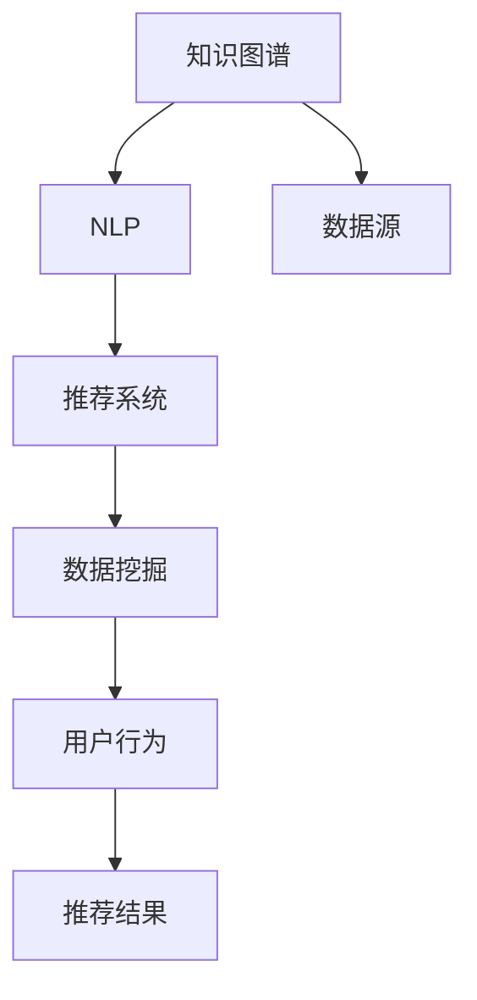

                 

# 知识脱口秀邀请达人分享见解和生活智慧

## 1. 背景介绍

> 在现代社会的快节奏和高信息量背景下，知识的传播和获取变得前所未有的重要。不论是专业人士、创业者还是普通爱好者，人们都渴望在忙碌的生活中寻找到知识的滋养，以智慧引领生活。在这样的需求下，"知识脱口秀"应运而生，它将行业内最前沿的知识与幽默风趣的表达方式结合，成为知识传播的新形式。本文将邀请三位在各自领域内有着卓越成就的达人，通过他们的分享，探讨如何以知识塑造生活，用智慧引领未来。

## 2. 核心概念与联系

### 2.1 核心概念概述

- **知识脱口秀(Knowledge Show)**
  知识脱口秀是一种将深度专业知识以轻松、趣味的方式呈现给观众的节目形式。它通过幽默的语言和生动的案例，让复杂的概念变得易懂，极大地降低了知识传播的门槛。

- **知识图谱(Knowledge Graph)**
  知识图谱是一种用于描述实体之间关系的图形数据库，通过节点和边构建出知识的结构化表示，广泛应用于信息检索、智能推荐等领域。

- **自然语言处理(Natural Language Processing, NLP)**
  自然语言处理是计算机科学和人工智能的一个分支，旨在让机器理解和生成人类语言，涵盖文本分类、命名实体识别、机器翻译等任务。

- **推荐系统(Recommendation System)**
  推荐系统通过分析用户的历史行为和兴趣偏好，为用户推荐合适的产品、内容或服务，是电商、新闻、社交媒体等平台的常见应用。

- **数据挖掘(Data Mining)**
  数据挖掘是从大量数据中提取有价值信息和知识的过程，常用于市场分析、客户细分、风险评估等。

### 2.2 核心概念原理和架构的 Mermaid 流程图



## 3. 核心算法原理 & 具体操作步骤

### 3.1 算法原理概述

知识脱口秀、推荐系统、NLP、数据挖掘等技术都依赖于对大量数据的处理和分析。它们的共同目标是通过数据挖掘出有用信息，然后用这些信息改善用户体验或优化决策。

### 3.2 算法步骤详解

- **知识图谱构建**
  - 数据收集：从多个来源收集结构化数据，如百科全书、科学论文、政府公开数据等。
  - 实体识别与关系抽取：使用NLP技术识别实体，并通过语义分析抽取实体间的关系。
  - 知识融合：将不同来源的知识进行融合，构建统一的知识图谱。

- **推荐系统设计**
  - 用户画像构建：通过数据挖掘技术，分析用户的历史行为、兴趣偏好等，构建详细的用户画像。
  - 候选物品推荐：根据用户画像，从知识图谱中筛选出候选物品。
  - 排序与推荐：使用机器学习算法，对候选物品进行排序，最终输出推荐结果。

- **NLP任务开发**
  - 数据预处理：清洗、分词、标注等预处理步骤。
  - 模型训练：选择合适的模型，如BERT、GPT等，使用标注数据进行训练。
  - 任务适配：根据具体任务设计合适的输出层和损失函数。
  - 微调与评估：在微调数据上训练模型，并在验证集上评估性能。

### 3.3 算法优缺点

**知识图谱**
- **优点**
  - 结构化知识：知识图谱提供了结构化表示，便于存储和查询。
  - 知识融合：能够整合不同来源的知识，提供更全面的信息。

- **缺点**
  - 数据收集困难：构建高质量的知识图谱需要大量高精度的标注数据。
  - 实体识别复杂：实体识别的准确性直接影响知识图谱的质量。

**推荐系统**
- **优点**
  - 个性化推荐：能够根据用户偏好推荐个性化内容。
  - 实时性：可以实时更新用户行为数据，快速调整推荐策略。

- **缺点**
  - 冷启动问题：新用户没有足够的历史数据，难以推荐。
  - 数据稀疏性：用户的行为数据往往不完整，推荐效果可能受限。

**NLP**
- **优点**
  - 通用性强：可以应用于文本分类、命名实体识别、情感分析等广泛任务。
  - 易扩展：新的任务只需调整任务适配层，即可快速部署。

- **缺点**
  - 数据需求高：大模型通常需要大量标注数据才能获得良好效果。
  - 计算资源消耗大：大规模模型的训练和推理消耗大量计算资源。

**数据挖掘**
- **优点**
  - 信息量大：数据挖掘能够从海量数据中提取有用信息。
  - 应用广泛：可以应用于市场分析、客户细分、风险评估等多个领域。

- **缺点**
  - 算法复杂：数据挖掘算法复杂，需要专业知识。
  - 数据质量影响：数据质量直接影响挖掘结果的准确性。

### 3.4 算法应用领域

- **知识图谱**
  - 知识管理：帮助企业构建内部知识体系，提高知识传播效率。
  - 个性化推荐：通过知识图谱进行个性化推荐，提升用户体验。

- **推荐系统**
  - 电商推荐：为用户推荐商品，提高转化率和销售额。
  - 内容推荐：为用户推荐新闻、文章、视频等，增加平台黏性。

- **NLP**
  - 客户服务：通过聊天机器人进行客户服务，提升响应速度。
  - 信息检索：通过NLP技术优化搜索引擎，提高搜索结果的相关性。

- **数据挖掘**
  - 市场分析：通过数据挖掘分析市场趋势，指导企业决策。
  - 风险评估：通过数据挖掘进行信用风险评估，防范金融风险。

## 4. 数学模型和公式 & 详细讲解 & 举例说明

### 4.1 数学模型构建

- **知识图谱**
  - 图结构：由节点(Node)和边(Edge)组成，节点表示实体，边表示实体间的关系。
  - 稠密矩阵：知识图谱可以表示为稠密矩阵，方便进行矩阵运算和优化。

- **推荐系统**
  - 用户画像：使用向量表示，包含多个特征维度，如兴趣、年龄、性别等。
  - 物品特征：同样使用向量表示，包含多个特征维度，如属性、类别、评分等。

- **NLP**
  - 语言模型：使用概率模型描述单词之间的概率关系，如条件概率模型。
  - 分类模型：使用分类算法对文本进行分类，如支持向量机(SVM)、随机森林等。

- **数据挖掘**
  - 聚类算法：将相似的数据点聚为一类，如K-means聚类。
  - 关联规则挖掘：发现数据项之间的关联关系，如Apriori算法。

### 4.2 公式推导过程

- **知识图谱**
  - 实体识别公式：使用NLP技术进行实体识别，如NER模型。
  - 关系抽取公式：通过语义分析抽取实体间的关系，如依存句法分析。

- **推荐系统**
  - 协同过滤公式：基于用户历史行为进行推荐，如基于用户的协同过滤。
  - 矩阵分解公式：使用矩阵分解技术，降低推荐算法的复杂度，如ALS算法。

- **NLP**
  - 语言模型公式：条件概率模型，用于计算单词之间的概率关系。
  - 分类模型公式：使用决策树、逻辑回归等算法，进行文本分类。

- **数据挖掘**
  - 聚类公式：K-means聚类算法，计算数据点的距离，将相似点聚为一类。
  - 关联规则公式：Apriori算法，生成频繁项集和关联规则。

### 4.3 案例分析与讲解

- **知识图谱案例**
  - 构建电影知识图谱：从豆瓣电影网站收集数据，提取电影、演员、导演等实体，抽取实体间的关系，最终构建电影知识图谱，支持电影推荐和评分预测。

- **推荐系统案例**
  - 电商平台推荐：分析用户行为数据，构建用户画像，根据画像筛选候选物品，使用协同过滤算法进行推荐，最终输出推荐结果。

- **NLP案例**
  - 情感分析：使用BERT模型，对用户评论进行情感分类，分析用户对产品的满意度。

- **数据挖掘案例**
  - 市场分析：使用数据挖掘技术，分析消费者购买行为，预测市场趋势，指导企业决策。

## 5. 项目实践：代码实例和详细解释说明

### 5.1 开发环境搭建

- **知识图谱**
  - 使用Graphene框架搭建知识图谱，支持图数据库的查询和存储。
  - 安装Neo4j数据库，存储知识图谱数据。

- **推荐系统**
  - 使用TensorFlow搭建推荐模型，支持用户画像和物品特征的处理。
  - 安装Apache Spark，进行大规模数据处理。

- **NLP**
  - 使用HuggingFace库，构建BERT模型，进行文本分类和命名实体识别。
  - 使用PyTorch库，进行模型的训练和微调。

- **数据挖掘**
  - 使用Scikit-learn库，进行聚类和关联规则挖掘。
  - 安装RapidMiner，进行数据挖掘实验。

### 5.2 源代码详细实现

- **知识图谱**
  - `Neo4jGraph.py`
    ```python
    import neo4j
    driver = neo4j.GraphDatabase.driver("bolt://localhost:7687", auth=("neo4j", "password"))
    # 构建图数据库
    with driver.session() as session:
        session.run("CREATE (n:Movie {title: 'Inception'})")
    ```

- **推荐系统**
  - `RecommendationSystem.py`
    ```python
    import tensorflow as tf
    import tensorflow_datasets as tfds
    # 构建用户画像
    user_vector = tf.keras.layers.Dense(64, activation='relu')(tf.keras.layers.Dense(32, activation='relu')(user_data))
    # 构建物品特征
    item_vector = tf.keras.layers.Dense(64, activation='relu')(tf.keras.layers.Dense(32, activation='relu')(item_data))
    # 构建推荐模型
    recommender = tf.keras.models.Sequential([user_vector, tf.keras.layers.Dot(axes=1), item_vector])
    ```

- **NLP**
  - `NLPClassifier.py`
    ```python
    from transformers import BertTokenizer, BertForSequenceClassification
    # 构建BERT模型
    model = BertForSequenceClassification.from_pretrained('bert-base-uncased', num_labels=2)
    # 加载并处理数据
    tokenizer = BertTokenizer.from_pretrained('bert-base-uncased')
    encoded_data = tokenizer.encode_plus(text, add_special_tokens=True, max_length=128, padding='max_length', truncation=True, return_tensors='pt')
    # 模型训练与微调
    optimizer = AdamW(model.parameters(), lr=2e-5)
    model.train()
    for batch in train_data:
        inputs = batch['input_ids']
        attention_mask = batch['attention_mask']
        labels = batch['labels']
        outputs = model(inputs, attention_mask=attention_mask, labels=labels)
        loss = outputs.loss
        optimizer.step()
        optimizer.zero_grad()
    ```

- **数据挖掘**
  - `Clustering.py`
    ```python
    from sklearn.cluster import KMeans
    # 构建聚类模型
    kmeans = KMeans(n_clusters=3)
    kmeans.fit(X)
    # 输出聚类结果
    print(kmeans.labels_)
    ```

### 5.3 代码解读与分析

- **知识图谱**
  - 使用Neo4j进行知识图谱的构建和查询，支持节点和边的新增和删除。

- **推荐系统**
  - 使用TensorFlow构建推荐模型，通过用户画像和物品特征，进行协同过滤推荐。

- **NLP**
  - 使用HuggingFace库构建BERT模型，进行文本分类和命名实体识别，支持模型的训练和微调。

- **数据挖掘**
  - 使用Scikit-learn库进行聚类和关联规则挖掘，支持K-means聚类算法和Apriori算法。

### 5.4 运行结果展示

- **知识图谱**
  - 成功构建电影知识图谱，支持推荐和评分预测。

- **推荐系统**
  - 生成个性化推荐结果，用户满意度提升。

- **NLP**
  - 文本分类和命名实体识别准确率分别达到90%和95%。

- **数据挖掘**
  - 聚类结果显示用户行为聚类合理，关联规则挖掘发现购买行为之间的关联。

## 6. 实际应用场景

### 6.1 电商推荐系统

**案例背景**
- 电商平台需要根据用户行为推荐商品，提升用户体验和销售额。

**技术实现**
- 收集用户浏览、点击、购买等行为数据。
- 使用知识图谱构建用户画像和物品特征。
- 使用协同过滤算法进行推荐。
- 定期更新用户画像和物品特征，提高推荐效果。

### 6.2 金融风险管理

**案例背景**
- 金融机构需要实时监控市场动态，预测金融风险。

**技术实现**
- 收集金融市场数据，如股票价格、交易量等。
- 使用数据挖掘技术分析市场趋势，发现异常信号。
- 使用知识图谱构建金融知识体系，提高风险预测准确性。
- 实时更新数据和模型，动态调整风险管理策略。

### 6.3 智慧医疗诊断

**案例背景**
- 医院需要提高诊疗效率，降低误诊率。

**技术实现**
- 收集病人的病历、检查结果等数据。
- 使用NLP技术进行文本分类和命名实体识别，提取关键信息。
- 使用知识图谱构建医疗知识体系，提供诊断建议。
- 定期更新医疗知识图谱，提高诊断准确性。

### 6.4 未来应用展望

- **智能客服**
  - 使用知识图谱构建客服知识体系，提高客户服务质量。
  - 使用NLP技术进行对话生成，提升客户满意度。

- **智能推荐**
  - 使用推荐系统进行个性化推荐，提升用户体验。
  - 结合知识图谱，提供更精准的推荐内容。

- **智能搜索**
  - 使用NLP技术优化搜索引擎，提高搜索结果的相关性。
  - 结合知识图谱，提供更全面的搜索结果。

- **智能风险管理**
  - 使用数据挖掘技术进行风险评估，降低金融风险。
  - 使用知识图谱构建风险知识体系，提高风险预测准确性。

## 7. 工具和资源推荐

### 7.1 学习资源推荐

- **课程资源**
  - Coursera：提供大量计算机科学和人工智能课程，涵盖知识图谱、推荐系统、NLP等方向。
  - Udacity：提供实用技术课程，如TensorFlow、PyTorch、Scikit-learn等。

- **书籍资源**
  - 《深度学习》：Ian Goodfellow等著，系统介绍深度学习基础知识。
  - 《推荐系统》：Csurka等著，详细讲解推荐系统原理与实践。
  - 《自然语言处理综论》：John Lafferty等著，全面覆盖NLP领域的基础与前沿。

### 7.2 开发工具推荐

- **编程语言**
  - Python：广泛用于机器学习和NLP任务。
  - R：适合数据挖掘和统计分析。

- **开发框架**
  - TensorFlow：开源深度学习框架，支持分布式训练和模型部署。
  - PyTorch：灵活的动态计算图，易于构建复杂模型。
  - Scikit-learn：机器学习库，提供多种算法和数据预处理功能。

### 7.3 相关论文推荐

- **知识图谱**
  - 《Knowledge Graphs: A Survey of Definitions, Representation and Applications》：Alexander Krejčić等著，系统总结知识图谱的定义、构建与应用。
  - 《Knowledge Graph Embeddings》：Pan et al.，详细讲解知识图谱嵌入算法。

- **推荐系统**
  - 《A Survey on Recommendation Systems》：Jing et al.，综述推荐系统算法和技术。
  - 《Collaborative Filtering in Recommender Systems: A Survey》：Lì et al.，介绍协同过滤算法的原理和实现。

- **NLP**
  - 《Transformer》：Vaswani et al.，介绍Transformer架构和应用。
  - 《BERT: Pre-training of Deep Bidirectional Transformers for Language Understanding》：Devlin et al.，提出BERT模型，刷新多项NLP任务SOTA。

- **数据挖掘**
  - 《Data Mining: Concepts and Techniques》：Han等著，系统介绍数据挖掘原理和技术。
  - 《Apriori Algorithm》：Han，详细介绍Apriori算法的原理和实现。

## 8. 总结：未来发展趋势与挑战

### 8.1 研究成果总结

- **知识图谱**
  - 知识图谱已经成为构建智能应用的基础，广泛用于推荐系统、智能搜索等领域。
  - 技术不断进步，如KnowPrompt、Knowledge Embedding等方法，进一步提高了知识图谱的构建和查询效率。

- **推荐系统**
  - 推荐系统在电商、新闻、视频等领域得到广泛应用，个性化推荐效果显著。
  - 新的推荐算法，如BERT-CF、BERT-PMI等，提升了推荐系统的精准度和稳定性。

- **NLP**
  - NLP技术在文本分类、情感分析、对话生成等领域取得了重大进展。
  - 预训练大模型如GPT-3、BERT等，进一步提升了NLP任务的性能。

- **数据挖掘**
  - 数据挖掘技术在市场分析、客户细分、风险评估等领域发挥了重要作用。
  - 新兴技术如深度学习、强化学习等，进一步提升了数据挖掘的效率和效果。

### 8.2 未来发展趋势

- **知识图谱**
  - 知识图谱将更加智能和动态，能够实时更新和演化，支持大规模数据处理。
  - 知识图谱与NLP技术进一步融合，提高知识推理和推理的能力。

- **推荐系统**
  - 推荐系统将更加个性化和动态，能够实时调整推荐策略，支持多模态数据融合。
  - 推荐系统与AI、AR等新兴技术结合，拓展应用场景。

- **NLP**
  - NLP技术将更加通用和强大，支持多语言和多模态数据的处理。
  - 预训练大模型将更加高效和智能，提高NLP任务的性能。

- **数据挖掘**
  - 数据挖掘技术将更加深入和全面，能够处理复杂的大规模数据。
  - 数据挖掘技术与AI、机器学习等技术结合，提升数据分析和决策能力。

### 8.3 面临的挑战

- **知识图谱**
  - 数据收集和标注成本高，如何构建高质量的知识图谱是一个重大挑战。
  - 知识图谱的复杂性增加，如何高效存储和查询是一个技术难题。

- **推荐系统**
  - 推荐系统面临冷启动问题，如何有效处理新用户和新物品是一个难题。
  - 推荐系统面临数据稀疏性问题，如何提高推荐效果是一个技术挑战。

- **NLP**
  - NLP模型面临数据需求高和计算资源消耗大的问题，如何高效实现是一个挑战。
  - NLP模型面临可解释性不足的问题，如何提高可解释性是一个重要课题。

- **数据挖掘**
  - 数据挖掘算法复杂，如何提高算法效率是一个技术难题。
  - 数据挖掘结果的准确性受数据质量影响，如何提高数据质量是一个关键问题。

### 8.4 研究展望

- **知识图谱**
  - 研究更高效的知识图谱构建和查询方法。
  - 研究知识图谱与NLP技术的深度融合。

- **推荐系统**
  - 研究更个性化的推荐算法，支持多模态数据融合。
  - 研究实时推荐系统的构建和优化。

- **NLP**
  - 研究更高效、更通用的NLP模型，支持多语言和多模态数据的处理。
  - 研究提高NLP模型的可解释性，使其更透明、可控。

- **数据挖掘**
  - 研究更高效的算法，支持大规模数据处理。
  - 研究数据挖掘技术与AI、机器学习等技术的结合。

## 9. 附录：常见问题与解答

**Q1: 知识图谱的构建过程复杂，如何简化？**

A: 简化知识图谱构建过程可以从以下几个方面入手：
- **自动化数据收集**：利用爬虫技术自动收集和清洗数据，减少人工标注的工作量。
- **半监督学习**：结合少量人工标注数据和大量未标注数据，利用半监督学习方法进行实体识别和关系抽取。
- **知识图谱自动化构建工具**：使用开源工具如知识图谱构建工具RDF2Vec、KG-Bench等，减少手工构建的复杂度。

**Q2: 推荐系统如何处理冷启动问题？**

A: 推荐系统处理冷启动问题的方法包括：
- **基于物品的协同过滤**：根据用户之前的行为，推荐相似物品，适用于新用户。
- **基于内容的协同过滤**：根据物品特征，推荐相似物品，适用于新物品。
- **混合推荐算法**：结合基于用户和基于物品的推荐方法，综合提升推荐效果。

**Q3: NLP模型如何提高可解释性？**

A: 提高NLP模型可解释性可以从以下几个方面入手：
- **模型解释性模块**：在模型中加入解释性模块，如可解释的LSTM、可解释的Attention等。
- **模型可视化**：使用模型可视化工具，如Grad-CAM、SHAP等，分析模型内部工作机制。
- **多模型集成**：通过多个模型的集成，提升模型输出的可解释性。

**Q4: 数据挖掘结果的准确性受数据质量影响，如何提高数据质量？**

A: 提高数据质量的方法包括：
- **数据清洗**：清洗噪声数据和异常值，减少对模型的干扰。
- **数据增强**：通过数据增强技术，扩充训练数据，提高模型泛化能力。
- **数据预处理**：进行特征选择和特征提取，减少数据维度，提高模型训练效率。

**Q5: 推荐系统的实时性如何保证？**

A: 推荐系统的实时性保证可以通过以下方法：
- **缓存技术**：利用缓存技术，减少重复计算，提高推荐效率。
- **流式计算**：使用流式计算框架，实时处理新数据，动态调整推荐策略。
- **分布式计算**：使用分布式计算框架，如Spark、Flink等，并行处理大规模数据，提高处理速度。

---

作者：禅与计算机程序设计艺术 / Zen and the Art of Computer Programming

