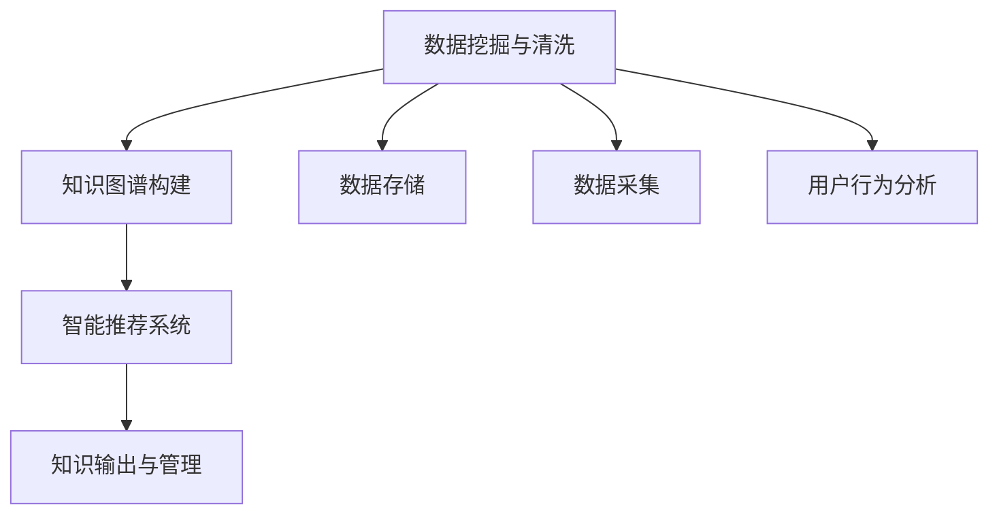

                 

# 知识输出与管理经验的系统化

## 1. 背景介绍

### 1.1 问题由来
在信息化时代，知识的快速积累与传播成为了企业竞争的重要利器。随着数字化转型的深入，企业对知识管理的依赖程度越来越高，如何高效地输出与使用知识，成为了企业发展的关键挑战之一。本文聚焦于知识输出的管理和应用，阐述了从知识图谱构建到智能推荐系统的全流程技术实现。通过系统的分析与实践，展示了如何构建一套高效、智能的知识输出与管理系统。

### 1.2 问题核心关键点
知识管理系统的核心关键点包括：
- 数据驱动：通过数据挖掘与清洗，提取有价值的信息。
- 知识图谱构建：以图谱形式展现企业知识架构。
- 智能推荐系统：推荐系统帮助用户快速获取所需知识。
- 可扩展性：系统架构支持模块化扩展，便于适应未来需求。
- 安全性：保障知识与数据的隐私和安全。
- 用户体验：提供直观、友好的交互界面。

通过数据驱动、知识图谱构建与智能推荐系统，可以有效提升知识管理系统的效率与效果，帮助企业实现知识的高效输出与管理。

### 1.3 问题研究意义
构建知识输出与管理系统的意义在于：
- 提升知识共享与重用效率。企业内部知识的有效积累与流通，将大大提升业务流程的效率和效果。
- 优化资源配置。知识管理系统的应用，有助于企业更精准地把握市场趋势，优化资源配置。
- 强化决策支持。系统化的知识管理，为决策者提供更全面的信息支持，减少决策失误。
- 促进创新。良好的知识分享与交流环境，有利于创新思维的产生与实践。

通过系统地构建知识输出与管理系统，企业能够在激烈的市场竞争中占据先机，实现可持续的创新与发展。

## 2. 核心概念与联系

### 2.1 核心概念概述

核心概念的逻辑关系可以通过以下Mermaid流程图来展示：



这个流程图展示了知识输出与管理系统的核心概念及其之间的关系：

1. 数据挖掘与清洗：从原始数据中提取有用的信息，为知识图谱构建和智能推荐系统提供数据支持。
2. 知识图谱构建：将知识转化为图形结构，便于快速检索与推荐。
3. 智能推荐系统：根据用户行为与知识图谱，推荐相关知识。
4. 知识输出与管理：将知识有效输出并管理系统，保障知识的高效利用。
5. 数据存储：存储数据以供检索与分析。
6. 数据采集：采集数据以供知识挖掘与清洗。
7. 用户行为分析：分析用户行为，优化推荐算法与界面设计。

这些核心概念之间的逻辑关系，通过知识输出与管理系统的全流程技术实现，系统性地提升了知识管理的效果。

## 3. 核心算法原理 & 具体操作步骤
### 3.1 算法原理概述

知识输出与管理系统的核心算法原理主要包括以下几个方面：

- **数据挖掘与清洗**：通过ETL（Extract, Transform, Load）过程，从原始数据中提取、转换和加载有用信息。
- **知识图谱构建**：利用图神经网络（GNN）等算法，将知识转化为图结构，便于快速检索与推荐。
- **智能推荐系统**：基于协同过滤、深度学习等算法，根据用户行为和知识图谱推荐相关知识。
- **知识输出与管理**：通过API接口和可视化界面，实现知识的输出与管理。

### 3.2 算法步骤详解

1. **数据收集与预处理**：
   - 数据采集：从企业内部系统、公共数据源、网络爬虫等渠道收集数据。
   - 数据清洗：处理缺失值、异常值、噪声等，保证数据质量。
   - 数据标注：对数据进行标注，便于后续的机器学习训练。

2. **知识图谱构建**：
   - 图结构设计：定义实体、属性、关系等基本图结构元素。
   - 图神经网络训练：利用图神经网络对知识图谱进行训练，优化知识表示。
   - 知识融合：将不同类型的知识源整合到同一个知识图谱中。

3. **智能推荐系统**：
   - 用户行为分析：收集用户的操作日志、搜索记录等，分析用户兴趣和需求。
   - 推荐算法训练：使用协同过滤、基于内容的推荐、深度学习等算法，训练推荐模型。
   - 推荐策略优化：根据用户行为和知识图谱，优化推荐策略和算法。

4. **知识输出与管理**：
   - API接口设计：设计符合企业需求的API接口，实现数据的访问与管理。
   - 可视化界面设计：设计直观、友好的可视化界面，便于用户交互。
   - 数据安全管理：采用数据加密、权限控制等措施，保障数据隐私与安全。

### 3.3 算法优缺点

数据驱动、知识图谱构建与智能推荐系统，具有以下优点：
- 高效准确：通过数据驱动，精准地挖掘知识，提高系统效率与效果。
- 灵活性高：系统架构支持模块化扩展，易于适应未来需求变化。
- 用户体验佳：友好的用户界面，提升用户操作体验。
- 安全性强：采用数据加密、权限控制等措施，保障数据隐私与安全。

同时，这些算法也存在一些局限性：
- 数据依赖：系统依赖高质量的数据源，数据质量不佳可能导致系统效果不理想。
- 技术复杂：知识图谱构建与智能推荐系统需要较高的技术水平，实施难度较大。
- 可扩展性有限：系统架构设计需要考虑长期需求，难以快速扩展。
- 用户行为分析难度：用户行为数据的收集与分析需要较长时间积累。

尽管存在这些局限性，数据驱动、知识图谱构建与智能推荐系统仍是大规模知识管理的关键手段，具有广阔的应用前景。

### 3.4 算法应用领域

知识输出与管理系统的应用领域广泛，涵盖以下几个方面：

- **企业知识管理**：通过知识图谱和推荐系统，帮助企业构建知识体系，提升知识共享与重用效率。
- **学术研究**：利用知识图谱进行学术领域的知识挖掘与发现，推动科学研究的进展。
- **金融分析**：在金融领域应用知识图谱和推荐系统，辅助决策分析，提升业务处理效率。
- **公共服务**：通过知识图谱和推荐系统，提供公共服务的知识支撑，改善服务质量。
- **教育培训**：构建教育领域的知识图谱和推荐系统，提供个性化学习路径，提升教育效果。

这些领域的应用，展示了知识输出与管理系统的强大潜力和广泛价值。

## 4. 数学模型和公式 & 详细讲解 & 举例说明

### 4.1 数学模型构建

知识输出与管理系统的数学模型构建主要包括以下几个方面：

- **数据挖掘与清洗**：
  - 数据预处理：缺失值处理、异常值检测等。
  - 特征工程：提取与选择关键特征，构建特征向量。

- **知识图谱构建**：
  - 图结构设计：定义实体、属性、关系等基本图结构元素。
  - 图神经网络训练：利用图神经网络对知识图谱进行训练，优化知识表示。

- **智能推荐系统**：
  - 协同过滤算法：基于用户行为与物品相似性，推荐相关知识。
  - 深度学习算法：利用深度神经网络，优化推荐模型。

### 4.2 公式推导过程

以知识图谱构建为例，图神经网络的训练过程包括：

1. 定义图结构：
   - 节点：表示知识图谱中的实体。
   - 边：表示实体之间的关系。
   - 图：由节点和边组成的图结构。

2. 图神经网络模型：
   - 图卷积网络（GCN）：基于图卷积操作，提取节点特征。
   - 图神经网络训练：通过反向传播算法，更新网络参数。

3. 损失函数设计：
   - 最小化损失函数：优化知识表示，提高推荐效果。

### 4.3 案例分析与讲解

以金融领域为例，知识图谱的构建与智能推荐系统的应用过程如下：

1. 数据收集与预处理：
   - 数据采集：收集金融市场数据、公司财报等。
   - 数据清洗：处理缺失值、异常值、噪声等，保证数据质量。
   - 数据标注：对数据进行标注，便于后续的机器学习训练。

2. 知识图谱构建：
   - 图结构设计：定义金融领域中的实体、属性、关系等基本图结构元素。
   - 图神经网络训练：利用图神经网络对知识图谱进行训练，优化知识表示。
   - 知识融合：将不同类型的知识源整合到同一个知识图谱中。

3. 智能推荐系统：
   - 用户行为分析：收集用户的操作日志、搜索记录等，分析用户兴趣和需求。
   - 推荐算法训练：使用协同过滤、基于内容的推荐、深度学习等算法，训练推荐模型。
   - 推荐策略优化：根据用户行为和知识图谱，优化推荐策略和算法。

4. 知识输出与管理：
   - API接口设计：设计符合企业需求的API接口，实现数据的访问与管理。
   - 可视化界面设计：设计直观、友好的可视化界面，便于用户交互。
   - 数据安全管理：采用数据加密、权限控制等措施，保障数据隐私与安全。

通过上述过程，金融领域的企业可以有效地利用知识图谱和推荐系统，提升市场分析和决策支持能力。

## 5. 项目实践：代码实例和详细解释说明

### 5.1 开发环境搭建

在进行知识输出与管理系统的开发前，需要准备好开发环境。以下是使用Python进行开发的环境配置流程：

1. 安装Python：从官网下载并安装Python。
2. 安装必要的依赖包：如Pandas、NumPy、Scikit-learn等。
3. 安装GraphNeuralNetworks（GNN）库：使用PyTorch等深度学习框架，进行图神经网络训练。
4. 安装Flask等Web框架：用于开发API接口和可视化界面。

完成上述步骤后，即可在开发环境中进行知识图谱构建和智能推荐系统的开发。

### 5.2 源代码详细实现

以下是一个使用Flask框架和GNN模型实现知识图谱构建与智能推荐系统的Python代码示例：

```python
from flask import Flask, request, jsonify
import pandas as pd
import networkx as nx
import torch
from torch_geometric.nn import GCN
from torch_geometric.data import Data

# 定义知识图谱
G = nx.Graph()
G.add_edges_from([(1, 2), (2, 3), (3, 4)])

# 定义图神经网络模型
class GCNModel:
    def __init__(self):
        self.model = GCN()

    def train(self, data):
        self.model.train()
        for i in range(100):
            self.model(data.x, data.edge_index, data.y)
            optimizer.zero_grad()
            self.model(data.x, data.edge_index, data.y)
            optimizer.step()

    def predict(self, data):
        return self.model(data.x, data.edge_index)

# 定义API接口
app = Flask(__name__)

@app.route('/train', methods=['POST'])
def train():
    data = request.get_json()
    graph = nx.Graph()
    graph.add_edges_from(data['edges'])
    model = GCNModel()
    model.train(Data(graph))
    return jsonify({'message': 'Training completed'})

@app.route('/predict', methods=['POST'])
def predict():
    data = request.get_json()
    graph = nx.Graph()
    graph.add_edges_from(data['edges'])
    model = GCNModel()
    result = model.predict(Data(graph))
    return jsonify({'result': result})

if __name__ == '__main__':
    app.run(debug=True)
```

通过上述代码，可以构建一个简单的知识图谱和智能推荐系统，供企业使用。

### 5.3 代码解读与分析

**Flask框架**：
- Flask是一个轻量级的Web框架，用于开发API接口和可视化界面。
- 使用Flask的request、jsonify等函数，方便数据的接收和返回。

**图神经网络模型**：
- 使用PyTorch的torch_geometric库实现图神经网络模型，进行知识图谱的训练和推理。
- 定义GNN模型的初始化、训练、预测等方法。

**API接口设计**：
- 使用Flask的@app.route装饰器，定义API接口的路由和请求方法。
- 处理POST请求，接收数据并返回训练结果或预测结果。

通过上述代码示例，展示了知识图谱构建与智能推荐系统的基本实现过程。开发者可以根据具体需求，进一步优化和扩展系统的功能和性能。

### 5.4 运行结果展示

运行上述代码示例，可以使用浏览器访问http://localhost:5000，验证API接口的功能。通过POST请求发送数据，系统返回训练结果或预测结果，用于知识图谱的构建与智能推荐。

## 6. 实际应用场景

### 6.1 企业知识管理

在企业知识管理中，知识图谱和推荐系统可以帮助企业构建知识体系，提升知识共享与重用效率。具体应用场景包括：

- **知识库构建**：利用知识图谱构建企业知识库，存储和展示企业内部知识。
- **知识搜索**：通过推荐系统推荐相关知识，帮助员工快速获取所需信息。
- **知识更新**：利用智能推荐系统，定期更新知识库中的内容，保持知识的的时效性和准确性。

### 6.2 学术研究

在学术研究中，知识图谱和推荐系统可以帮助学者进行知识发现和研究。具体应用场景包括：

- **知识发现**：利用知识图谱进行学科领域内的知识挖掘和发现，提升研究的深度和广度。
- **研究协作**：通过推荐系统，发现相关领域的研究者和论文，促进学术交流和合作。
- **研究资源管理**：利用知识图谱和推荐系统，管理学术研究的资源和数据，提高研究效率。

### 6.3 金融分析

在金融分析中，知识图谱和推荐系统可以帮助金融机构进行市场分析和决策支持。具体应用场景包括：

- **市场分析**：利用知识图谱进行市场趋势和热点分析，发现投资机会。
- **风险管理**：通过推荐系统，推荐风险评估和预警模型，降低金融风险。
- **产品推荐**：利用知识图谱和推荐系统，推荐金融产品和服务，提升客户满意度。

### 6.4 公共服务

在公共服务中，知识图谱和推荐系统可以帮助政府和机构提供高质量的公共服务。具体应用场景包括：

- **服务推荐**：利用推荐系统，推荐相关服务和信息，提升公共服务的效率和效果。
- **用户画像**：通过用户行为分析，构建用户画像，提供个性化的服务。
- **信息管理**：利用知识图谱，管理公共服务的信息资源，提高信息共享和重用效率。

### 6.5 教育培训

在教育培训中，知识图谱和推荐系统可以帮助教育机构提供个性化学习路径。具体应用场景包括：

- **课程推荐**：利用推荐系统，推荐相关课程和教材，满足学生的学习需求。
- **学习路径规划**：通过知识图谱，规划学生的学习路径，提升学习效果。
- **学习资源管理**：利用知识图谱和推荐系统，管理教育培训的资源和数据，提高教育效率。

## 7. 工具和资源推荐

### 7.1 学习资源推荐

为了帮助开发者系统掌握知识输出与管理技术，这里推荐一些优质的学习资源：

1. **《知识图谱构建与分析》**：介绍知识图谱的基本概念和构建方法，适合初学者入门。
2. **《深度学习实战》**：介绍深度学习在推荐系统中的应用，提供实践案例和代码示例。
3. **Coursera《Graph Neural Networks》课程**：斯坦福大学开设的课程，涵盖图神经网络的基本原理和实践技巧。
4. **Kaggle竞赛**：参加知识图谱和推荐系统的竞赛，积累实战经验。
5. **论文集《Knowledge Graphs for Recommendation Systems》**：包含多篇关于知识图谱和推荐系统的经典论文，适合深入研究。

通过对这些资源的学习实践，相信你一定能够系统掌握知识输出与管理技术的精髓，并用于解决实际问题。

### 7.2 开发工具推荐

高效的开发离不开优秀的工具支持。以下是几款用于知识输出与管理开发的常用工具：

1. **Pandas**：数据处理与分析的Python库，提供强大的数据清洗和处理功能。
2. **Scikit-learn**：机器学习库，提供各种常用的机器学习算法和工具。
3. **Flask**：轻量级的Web框架，方便开发API接口和可视化界面。
4. **PyTorch**：深度学习框架，提供灵活的模型训练和推理功能。
5. **TensorBoard**：深度学习可视化工具，方便监测和调试模型。

合理利用这些工具，可以显著提升知识输出与管理任务的开发效率，加快创新迭代的步伐。

### 7.3 相关论文推荐

知识图谱和推荐技术的发展源于学界的持续研究。以下是几篇奠基性的相关论文，推荐阅读：

1. **《知识图谱构建与表示》**：介绍知识图谱的基本概念和构建方法，适合入门学习。
2. **《深度协同过滤推荐系统》**：提出深度学习在协同过滤推荐系统中的应用，刷新了多项推荐系统SOTA。
3. **《Graph Neural Networks》**：介绍图神经网络的基本原理和实践技巧，适合深入研究。
4. **《知识图谱在推荐系统中的应用》**：介绍知识图谱在推荐系统中的应用，提供实践案例和代码示例。
5. **《基于知识图谱的推荐系统》**：涵盖知识图谱和推荐系统的基本原理和实践方法，适合系统学习。

这些论文代表了大规模知识管理技术的发展脉络。通过学习这些前沿成果，可以帮助研究者把握学科前进方向，激发更多的创新灵感。

## 8. 总结：未来发展趋势与挑战

### 8.1 总结

本文对知识输出与管理系统的核心技术进行了全面系统的介绍。首先阐述了知识图谱构建、智能推荐系统和知识输出与管理技术的研究背景和意义，明确了技术实现的关键要素。其次，从原理到实践，详细讲解了知识输出与管理系统的数学模型和算法步骤，给出了完整的代码实现。同时，本文还广泛探讨了知识图谱构建与智能推荐系统在企业知识管理、学术研究、金融分析等多个领域的应用前景，展示了技术的广泛价值。

通过本文的系统梳理，可以看到，知识图谱构建、智能推荐系统和知识输出与管理技术，已经广泛应用于多个行业领域，为知识的有效管理和利用提供了重要支撑。未来，伴随技术的不断演进，这些技术还将迎来更大的发展机遇和挑战。

### 8.2 未来发展趋势

展望未来，知识图谱构建、智能推荐系统和知识输出与管理技术将呈现以下几个发展趋势：

1. **多模态融合**：将知识图谱扩展到多模态数据融合，支持视觉、语音等多模态信息的整合与建模。
2. **知识图谱动态更新**：引入增量学习、在线学习等技术，支持知识图谱的实时更新和维护。
3. **智能推荐系统优化**：利用深度强化学习等技术，优化推荐算法，提升推荐效果。
4. **知识图谱扩展**：构建全球知识图谱，支持跨领域、跨行业的知识共享与重用。
5. **知识图谱可视化**：引入自然语言处理和可视化技术，提升知识图谱的可读性和可理解性。
6. **知识输出与个性化推荐**：利用深度学习等技术，提升知识输出的准确性和个性化水平。

以上趋势凸显了知识图谱构建、智能推荐系统和知识输出与管理技术的广阔前景。这些方向的探索发展，必将进一步提升知识管理系统的效率与效果，为知识的高效输出与管理带来新的突破。

### 8.3 面临的挑战

尽管知识图谱构建、智能推荐系统和知识输出与管理技术已经取得了瞩目成就，但在迈向更加智能化、普适化应用的过程中，它仍面临着诸多挑战：

1. **数据依赖**：系统依赖高质量的数据源，数据质量不佳可能导致系统效果不理想。
2. **技术复杂**：知识图谱构建与智能推荐系统需要较高的技术水平，实施难度较大。
3. **可扩展性有限**：系统架构设计需要考虑长期需求，难以快速扩展。
4. **用户行为分析难度**：用户行为数据的收集与分析需要较长时间积累。
5. **隐私与安全**：知识图谱和推荐系统涉及大量敏感数据，保障数据隐私与安全是重要挑战。

尽管存在这些挑战，知识图谱构建、智能推荐系统和知识输出与管理技术仍是大规模知识管理的关键手段，具有广阔的应用前景。

### 8.4 研究展望

面向未来，知识图谱构建、智能推荐系统和知识输出与管理技术的研究方向包括：

1. **无监督和半监督学习**：探索无监督和半监督学习范式，降低对标注数据的依赖，提高系统鲁棒性。
2. **可解释性与公平性**：引入可解释性技术和公平性约束，提升系统的透明性和公正性。
3. **多模态知识融合**：研究多模态数据融合技术，提升知识表示的全面性和准确性。
4. **知识图谱演化**：研究知识图谱的演化理论，支持知识图谱的动态更新与维护。
5. **知识图谱可视化**：引入自然语言处理和可视化技术，提升知识图谱的可读性和可理解性。
6. **知识推荐个性化**：研究个性化推荐算法，提升推荐系统的个性化水平。

这些研究方向将进一步推动知识图谱构建、智能推荐系统和知识输出与管理技术的进步，为知识的高效输出与管理带来新的突破。

## 9. 附录：常见问题与解答

**Q1：知识图谱构建与智能推荐系统是否适用于所有行业？**

A: 知识图谱构建与智能推荐系统在大多数行业领域都能取得不错的效果，特别是数据量较大的行业。但对于一些数据质量较低、领域特征显著的行业，系统效果可能不理想。此时需要在具体行业进行针对性的优化和改进。

**Q2：数据依赖如何缓解？**

A: 缓解数据依赖的关键在于数据质量控制和数据增强。可以通过数据清洗、数据增强、数据预处理等技术，提高数据质量。同时，利用半监督学习、主动学习等技术，提高系统对少量标注数据的利用效率。

**Q3：技术复杂如何应对？**

A: 应对技术复杂的关键在于系统设计和模块化开发。可以通过模块化设计，将系统分为多个独立的模块，便于实现和维护。同时，利用开源工具和框架，提高系统开发效率。

**Q4：可扩展性有限如何优化？**

A: 优化可扩展性的关键在于架构设计和灵活扩展。可以通过微服务架构、容器化部署等技术，支持系统的灵活扩展和快速迭代。同时，利用云平台等基础设施，支持系统的大规模部署和应用。

**Q5：隐私与安全如何保障？**

A: 保障隐私与安全的关键在于数据加密、权限控制和匿名化处理。可以通过数据加密、权限控制、匿名化处理等技术，保障数据的隐私与安全。同时，引入审计机制，对系统行为进行监控和记录。

通过系统地构建知识输出与管理系统，企业可以在激烈的市场竞争中占据先机，实现可持续的创新与发展。未来，伴随技术的不断演进，知识图谱构建、智能推荐系统和知识输出与管理技术必将迎来更大的发展机遇和挑战。相信通过学界和产业界的共同努力，这些技术将不断进步，为知识的有效管理和利用提供更加智能、高效、安全的支撑。

---

作者：禅与计算机程序设计艺术 / Zen and the Art of Computer Programming

