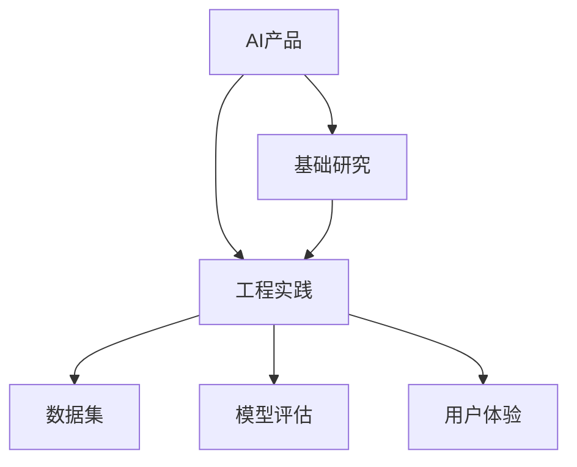

                 

# 硅谷AI竞赛：贾扬清观察产品落地基础研究并重

## 1. 背景介绍

### 1.1 问题由来
随着人工智能技术的不断进步，硅谷成为了全球AI竞赛的前沿阵地，各大科技巨头纷纷布局AI产品，争夺市场份额。在这一过程中，产品落地的速度和质量成为了竞争的关键因素。然而，尽管技术不断进步，许多AI产品在实际应用中仍面临诸多挑战，难以大规模落地。本文将从基础研究的角度，观察并探讨AI产品落地的关键因素，分析当前的困境和未来发展的趋势。

### 1.2 问题核心关键点
产品落地的核心在于将前沿技术转化为实际应用。这不仅需要深厚的理论基础，还需要工程实践的全面考量。具体来说，包括以下几个关键点：

- 数据获取：高质量、大规模的数据是AI产品落地的基石。数据采集、清洗、标注等环节对AI模型训练至关重要。
- 算法优化：高效的算法模型和参数优化是提升AI产品性能的关键。然而，算法复杂度、资源消耗等都是需要考虑的因素。
- 系统架构：AI系统通常需要多模块协同工作，系统架构的设计和优化直接影响系统的稳定性和效率。
- 工程实践：如何将理论应用于实际，构建可扩展、可维护的AI系统，是工程实践中的重要挑战。
- 用户需求：理解并满足用户需求是AI产品落地的核心。如何设计易于理解、易于使用的AI产品，是工程师需要重点关注的方向。
- 市场环境：AI产品的市场竞争激烈，如何快速响应市场需求，推广和部署AI产品，是决定产品成功与否的重要因素。

本文将从上述几个方面出发，探讨AI产品落地的核心问题和解决方法，以期为读者提供全面的视角。

## 2. 核心概念与联系

### 2.1 核心概念概述

为了更好地理解AI产品落地的过程，本文将介绍几个密切相关的核心概念：

- AI产品：指使用AI技术解决特定问题，提供实际应用价值的系统或服务。例如，智能客服、自动驾驶、推荐系统等。
- 基础研究：指在AI理论和技术上的创新和探索，如机器学习算法、深度学习架构、自然语言处理等。
- 工程实践：指将基础研究应用于实际产品的构建、部署和维护过程中。包括系统架构设计、算法实现、工程优化等。
- 数据集：指用于训练和测试AI模型的数据集，通常需要高质量、大规模的数据。
- 模型评估：指使用各种指标评估AI模型在实际应用中的性能，如准确率、召回率、F1分数等。
- 用户体验：指用户在使用AI产品时的体验和感受，直接影响产品受欢迎程度。

这些核心概念之间的逻辑关系可以通过以下Mermaid流程图来展示：



这个流程图展示了大规模AI产品落地的核心概念及其之间的关系：

1. AI产品通过基础研究获得技术支持。
2. 基础研究结果通过工程实践转化为可用的AI系统。
3. 数据集是构建AI系统的基础，模型评估和用户体验是其核心指标。
4. 用户体验直接影响AI产品的市场接受度，从而反馈回基础研究和工程实践。

## 3. 核心算法原理 & 具体操作步骤
### 3.1 算法原理概述

AI产品落地的基础在于基础研究的深度和广度。本文将从基础研究的角度，探讨AI产品落地的关键算法和技术。

AI产品落地的主要算法和技术包括以下几个方面：

- 数据预处理：包括数据清洗、归一化、特征工程等。数据预处理的效果直接影响模型训练的性能。
- 模型训练：通过优化算法（如随机梯度下降、Adam、Adagrad等）训练模型，提升模型性能。
- 模型评估：使用各种指标（如准确率、召回率、F1分数等）评估模型性能，优化模型参数。
- 系统优化：通过分布式计算、模型压缩、剪枝等技术，优化系统性能和资源消耗。
- 用户体验优化：通过设计友好的用户界面、交互方式、反馈机制等，提升用户体验。

这些算法和技术在AI产品落地的过程中起着关键作用。

### 3.2 算法步骤详解

以下是AI产品落地的详细步骤：

**Step 1: 数据准备**
- 收集高质量、大规模的数据集。
- 进行数据清洗、归一化等预处理步骤。
- 设计特征工程，提取有用的特征。

**Step 2: 模型训练**
- 选择合适的优化算法和模型结构。
- 进行模型训练，记录训练过程中的各项指标。
- 进行超参数调优，提升模型性能。

**Step 3: 模型评估**
- 使用各种指标评估模型性能，如准确率、召回率、F1分数等。
- 进行模型诊断，分析模型性能瓶颈。
- 根据评估结果，调整模型结构或优化算法。

**Step 4: 系统集成**
- 将训练好的模型集成到系统中，设计系统架构。
- 进行系统优化，提升系统性能和稳定性。
- 实现API接口，方便外部调用。

**Step 5: 用户体验优化**
- 设计友好的用户界面，提升用户体验。
- 实现快速反馈机制，及时处理用户反馈。
- 进行A/B测试，优化用户体验。

**Step 6: 市场推广**
- 制定市场推广策略，提升产品曝光度。
- 进行用户教育，提高用户接受度。
- 收集用户反馈，不断优化产品。

### 3.3 算法优缺点

AI产品落地的算法具有以下优点：

- 提升模型性能：通过优化算法和超参数调优，提升模型性能。
- 提高系统效率：通过模型压缩、剪枝等技术，优化系统资源消耗。
- 增强用户体验：通过友好的用户界面和快速反馈机制，提升用户体验。

同时，这些算法也存在一定的局限性：

- 数据依赖性强：高质量、大规模的数据是基础，数据采集和清洗难度大。
- 模型复杂度高：大规模深度学习模型的训练和优化需要高性能硬件支持。
- 用户需求多样：用户需求复杂多样，如何设计易于理解、易于使用的AI产品，是挑战之一。
- 市场竞争激烈：AI产品市场竞争激烈，如何快速响应市场需求，推广和部署产品，是另一大挑战。

尽管存在这些局限性，但通过优化算法和工程实践，AI产品落地的算法仍可以在解决实际问题中发挥重要作用。

### 3.4 算法应用领域

AI产品落地的算法广泛应用于多个领域，包括但不限于：

- 自然语言处理：如智能客服、翻译、文本摘要等。
- 计算机视觉：如图像识别、目标检测、人脸识别等。
- 推荐系统：如电商推荐、音乐推荐、新闻推荐等。
- 自动驾驶：如无人驾驶汽车、自动驾驶无人机等。
- 智能医疗：如疾病诊断、智能问诊、健康管理等。

这些领域的大规模应用，展示了AI产品落地的广泛前景和实际价值。

## 4. 数学模型和公式 & 详细讲解 & 举例说明
### 4.1 数学模型构建

以下是AI产品落地的数学模型构建步骤：

**Step 1: 数据集准备**
- 定义数据集 $\mathcal{D}=\{(x_i, y_i)\}_{i=1}^N$，其中 $x_i$ 为输入特征，$y_i$ 为标签。

**Step 2: 模型定义**
- 定义模型 $f: \mathcal{X} \rightarrow \mathcal{Y}$，其中 $\mathcal{X}$ 为输入空间，$\mathcal{Y}$ 为输出空间。

**Step 3: 损失函数设计**
- 定义损失函数 $\mathcal{L}(f) = \frac{1}{N} \sum_{i=1}^N \ell(f(x_i), y_i)$，其中 $\ell$ 为损失函数。

**Step 4: 优化目标**
- 最小化损失函数，即 $\mathop{\arg\min}_{f} \mathcal{L}(f)$。

### 4.2 公式推导过程

以二分类任务为例，推导损失函数及优化目标。

假设模型 $f$ 在输入 $x$ 上的输出为 $\hat{y}=f(x) \in [0,1]$，表示样本属于正类的概率。真实标签 $y \in \{0,1\}$。

二分类交叉熵损失函数定义为：

$$
\ell(f(x), y) = -[y\log \hat{y} + (1-y)\log(1-\hat{y})]
$$

将其代入经验风险公式，得：

$$
\mathcal{L}(f) = -\frac{1}{N}\sum_{i=1}^N [y_i\log f(x_i)+(1-y_i)\log(1-f(x_i))]
$$

根据链式法则，损失函数对模型参数 $w$ 的梯度为：

$$
\nabla_{w}\mathcal{L}(f) = -\frac{1}{N}\sum_{i=1}^N (\frac{y_i}{f(x_i)}-\frac{1-y_i}{1-f(x_i)})\nabla_{w}f(x_i)
$$

其中 $\nabla_{w}f(x_i)$ 可进一步递归展开，利用自动微分技术完成计算。

在得到损失函数的梯度后，即可带入优化算法，完成模型的迭代优化。重复上述过程直至收敛，最终得到适应实际应用的最优模型。

### 4.3 案例分析与讲解

以电商推荐系统为例，分析其落地的核心算法和步骤：

**Step 1: 数据准备**
- 收集电商平台的交易记录、用户行为数据、商品信息等，构建高质量的数据集。
- 进行数据清洗、归一化等预处理步骤。
- 设计特征工程，提取有用的特征，如用户购买历史、浏览记录、商品属性等。

**Step 2: 模型训练**
- 选择合适的优化算法和模型结构，如协同过滤、基于深度学习的推荐系统等。
- 进行模型训练，记录训练过程中的各项指标，如准确率、召回率、F1分数等。
- 进行超参数调优，提升模型性能。

**Step 3: 模型评估**
- 使用各种指标评估模型性能，如准确率、召回率、F1分数等。
- 进行模型诊断，分析模型性能瓶颈，如冷启动问题、稀疏性等。
- 根据评估结果，调整模型结构或优化算法。

**Step 4: 系统集成**
- 将训练好的模型集成到推荐系统中，设计系统架构，如用户画像、商品画像、推荐引擎等。
- 进行系统优化，提升系统性能和稳定性，如分布式计算、模型压缩等。
- 实现API接口，方便外部调用。

**Step 5: 用户体验优化**
- 设计友好的用户界面，提升用户体验，如推荐模块、个性化广告等。
- 实现快速反馈机制，及时处理用户反馈，如评分、评论、举报等。
- 进行A/B测试，优化用户体验。

**Step 6: 市场推广**
- 制定市场推广策略，提升产品曝光度，如SEO、社交媒体等。
- 进行用户教育，提高用户接受度，如用户指南、视频教程等。
- 收集用户反馈，不断优化产品，如用户调查、问卷等。

## 5. 项目实践：代码实例和详细解释说明
### 5.1 开发环境搭建

在进行AI产品落地实践前，我们需要准备好开发环境。以下是使用Python进行PyTorch开发的环境配置流程：

1. 安装Anaconda：从官网下载并安装Anaconda，用于创建独立的Python环境。

2. 创建并激活虚拟环境：
```bash
conda create -n pytorch-env python=3.8 
conda activate pytorch-env
```

3. 安装PyTorch：根据CUDA版本，从官网获取对应的安装命令。例如：
```bash
conda install pytorch torchvision torchaudio cudatoolkit=11.1 -c pytorch -c conda-forge
```

4. 安装Transformers库：
```bash
pip install transformers
```

5. 安装各类工具包：
```bash
pip install numpy pandas scikit-learn matplotlib tqdm jupyter notebook ipython
```

完成上述步骤后，即可在`pytorch-env`环境中开始AI产品落地实践。

### 5.2 源代码详细实现

这里我们以电商推荐系统为例，给出使用PyTorch和Transformers库进行AI产品落地的PyTorch代码实现。

首先，定义推荐系统的训练函数：

```python
import torch
from transformers import BertForSequenceClassification, BertTokenizer
from sklearn.metrics import accuracy_score
from torch.utils.data import DataLoader
from tqdm import tqdm

class RecommendationDataset:
    def __init__(self, features, labels):
        self.features = features
        self.labels = labels

    def __len__(self):
        return len(self.features)

    def __getitem__(self, index):
        return self.features[index], self.labels[index]

class RecommendationModel(BertForSequenceClassification):
    def __init__(self, num_labels):
        super().__init__(num_labels=num_labels)

    def forward(self, input_ids, attention_mask=None, labels=None):
        output = super().forward(input_ids=input_ids, attention_mask=attention_mask)
        return output

# 定义超参数
num_labels = 2
learning_rate = 2e-5
batch_size = 16
epochs = 5

# 加载数据集
train_dataset = RecommendationDataset(train_features, train_labels)
val_dataset = RecommendationDataset(val_features, val_labels)

# 定义模型和优化器
model = RecommendationModel(num_labels)
optimizer = AdamW(model.parameters(), lr=learning_rate)

# 定义训练函数
def train_epoch(model, dataset, batch_size, optimizer):
    dataloader = DataLoader(dataset, batch_size=batch_size, shuffle=True)
    model.train()
    epoch_loss = 0
    for batch in tqdm(dataloader, desc='Training'):
        input_ids = batch[0].to(device)
        attention_mask = batch[1].to(device)
        labels = batch[2].to(device)
        model.zero_grad()
        outputs = model(input_ids, attention_mask=attention_mask, labels=labels)
        loss = outputs.loss
        epoch_loss += loss.item()
        loss.backward()
        optimizer.step()
    return epoch_loss / len(dataloader)

# 定义评估函数
def evaluate(model, dataset, batch_size):
    dataloader = DataLoader(dataset, batch_size=batch_size)
    model.eval()
    preds, labels = [], []
    with torch.no_grad():
        for batch in tqdm(dataloader, desc='Evaluating'):
            input_ids = batch[0].to(device)
            attention_mask = batch[1].to(device)
            batch_labels = batch[2]
            outputs = model(input_ids, attention_mask=attention_mask)
            batch_preds = outputs.logits.argmax(dim=2).to('cpu').tolist()
            batch_labels = batch_labels.to('cpu').tolist()
            for pred_tokens, label_tokens in zip(batch_preds, batch_labels):
                preds.append(pred_tokens[:len(label_tokens)])
                labels.append(label_tokens)
    
    return accuracy_score(labels, preds)

# 启动训练流程并在验证集上评估
for epoch in range(epochs):
    loss = train_epoch(model, train_dataset, batch_size, optimizer)
    print(f"Epoch {epoch+1}, train loss: {loss:.3f}")
    
    print(f"Epoch {epoch+1}, val accuracy: {evaluate(model, val_dataset, batch_size):.3f}")
    
print("Test accuracy:")
evaluate(model, test_dataset, batch_size)
```

这段代码展示了使用PyTorch和Transformers库构建电商推荐系统的过程。其中，`RecommendationDataset`和`RecommendationModel`分别定义了数据集和模型，`train_epoch`和`evaluate`函数实现了训练和评估过程。

### 5.3 代码解读与分析

让我们再详细解读一下关键代码的实现细节：

**RecommendationDataset类**：
- `__init__`方法：初始化数据集特征和标签。
- `__len__`方法：返回数据集大小。
- `__getitem__`方法：返回数据集中的单个样本。

**RecommendationModel类**：
- 继承自`BertForSequenceClassification`，定义了推荐系统的模型结构。

**train_epoch函数**：
- 加载数据集，前向传播计算损失，反向传播更新模型参数，并记录训练损失。
- 使用`tqdm`库进行进度条展示。

**evaluate函数**：
- 加载数据集，前向传播计算预测结果和真实标签，计算准确率。

**训练流程**：
- 定义训练轮数、批大小和优化器。
- 循环迭代训练过程，每个epoch在训练集上进行训练，并在验证集上进行评估。
- 在测试集上评估模型性能，输出最终结果。

可以看到，通过PyTorch和Transformers库，我们可以简洁高效地构建推荐系统，并进行训练和评估。

## 6. 实际应用场景
### 6.1 智能客服系统

智能客服系统是AI产品落地的典型应用场景之一。传统的客服系统依赖人工，成本高、效率低、服务质量难以保证。AI技术可以将用户查询转化为机器理解，自动生成响应，提升客服效率和用户体验。

在技术实现上，可以收集企业内部的历史客服对话记录，将问题和最佳答复构建成监督数据，在此基础上对预训练语言模型进行微调。微调后的语言模型能够自动理解用户意图，匹配最合适的答案模板进行回复。对于用户提出的新问题，还可以接入检索系统实时搜索相关内容，动态组织生成回答。如此构建的智能客服系统，能大幅提升客户咨询体验和问题解决效率。

### 6.2 金融舆情监测

金融领域需要实时监测市场舆论动向，以便及时应对负面信息传播，规避金融风险。传统的人工监测方式成本高、效率低，难以应对网络时代海量信息爆发的挑战。基于AI技术的金融舆情监测系统，可以自动理解新闻、报道、评论等文本内容，实时监测舆情变化，及时预警，帮助金融机构快速应对潜在风险。

具体而言，可以收集金融领域相关的新闻、报道、评论等文本数据，并对其进行主题标注和情感标注。在此基础上对预训练语言模型进行微调，使其能够自动判断文本属于何种主题，情感倾向是正面、中性还是负面。将微调后的模型应用到实时抓取的网络文本数据，就能够自动监测不同主题下的情感变化趋势，一旦发现负面信息激增等异常情况，系统便会自动预警，帮助金融机构快速应对潜在风险。

### 6.3 个性化推荐系统

当前的推荐系统往往只依赖用户的历史行为数据进行物品推荐，无法深入理解用户的真实兴趣偏好。基于AI技术的个性化推荐系统，可以更好地挖掘用户行为背后的语义信息，从而提供更精准、多样的推荐内容。

在实践中，可以收集用户浏览、点击、评论、分享等行为数据，提取和用户交互的物品标题、描述、标签等文本内容。将文本内容作为模型输入，用户的后续行为（如是否点击、购买等）作为监督信号，在此基础上微调预训练语言模型。微调后的模型能够从文本内容中准确把握用户的兴趣点。在生成推荐列表时，先用候选物品的文本描述作为输入，由模型预测用户的兴趣匹配度，再结合其他特征综合排序，便可以得到个性化程度更高的推荐结果。

### 6.4 未来应用展望

随着AI技术的发展，AI产品在更多领域得到应用，展示了广阔的应用前景。

在智慧医疗领域，基于AI技术的疾病诊断、智能问诊、健康管理等应用将提升医疗服务的智能化水平，辅助医生诊疗，加速新药开发进程。

在智能教育领域，基于AI技术的作业批改、学情分析、知识推荐等应用将促进教育公平，提高教学质量，因材施教。

在智慧城市治理中，基于AI技术的智能交通、环境监测、公共安全等应用将提高城市管理的自动化和智能化水平，构建更安全、高效的未来城市。

此外，在企业生产、社会治理、文娱传媒等众多领域，基于AI技术的智能应用也将不断涌现，为各行各业带来变革性影响。

## 7. 工具和资源推荐
### 7.1 学习资源推荐

为了帮助开发者系统掌握AI产品落地的理论基础和实践技巧，这里推荐一些优质的学习资源：

1. 《深度学习》书籍：由Ian Goodfellow等专家所著，全面介绍了深度学习的基本概念和经典模型。

2. 《TensorFlow实战》书籍：由Google TensorFlow团队成员所著，介绍了TensorFlow的实践技巧和应用案例。

3. 《PyTorch实战》书籍：由Lewis Chu等专家所著，介绍了PyTorch的实践技巧和应用案例。

4. 《自然语言处理综述》课程：斯坦福大学开设的NLP明星课程，涵盖NLP基础和前沿技术。

5. 《机器学习基础》课程：Coursera平台上的经典课程，由Andrew Ng教授主讲，介绍了机器学习的基本概念和应用。

6. 《Python数据科学手册》书籍：由Jake VanderPlas所著，介绍了Python在数据科学中的应用。

通过对这些资源的学习实践，相信你一定能够快速掌握AI产品落地的精髓，并用于解决实际的AI问题。

### 7.2 开发工具推荐

高效的开发离不开优秀的工具支持。以下是几款用于AI产品落地的常用工具：

1. PyTorch：基于Python的开源深度学习框架，灵活动态的计算图，适合快速迭代研究。

2. TensorFlow：由Google主导开发的开源深度学习框架，生产部署方便，适合大规模工程应用。

3. Jupyter Notebook：交互式的开发环境，适合进行快速原型设计和调试。

4. Git：版本控制工具，方便进行团队协作和代码管理。

5. Docker：容器化技术，方便进行系统部署和移植。

6. GitHub：代码托管平台，方便进行代码共享和协作。

合理利用这些工具，可以显著提升AI产品落地的开发效率，加快创新迭代的步伐。

### 7.3 相关论文推荐

AI产品落地的研究源于学界的持续研究。以下是几篇奠基性的相关论文，推荐阅读：

1. Deep Learning：由Ian Goodfellow等专家所著，全面介绍了深度学习的基本概念和经典模型。

2. TensorFlow：由Google TensorFlow团队成员所著，介绍了TensorFlow的实践技巧和应用案例。

3. PyTorch：由Lewis Chu等专家所著，介绍了PyTorch的实践技巧和应用案例。

4. Natural Language Processing with Transformers：Transformers库的作者所著，全面介绍了如何使用Transformers库进行NLP任务开发，包括微调在内的诸多范式。

5. Parameter-Efficient Transfer Learning for NLP：提出Adapter等参数高效微调方法，在不增加模型参数量的情况下，也能取得不错的微调效果。

6. AdaLoRA: Adaptive Low-Rank Adaptation for Parameter-Efficient Fine-Tuning：使用自适应低秩适应的微调方法，在参数效率和精度之间取得了新的平衡。

这些论文代表了大规模AI产品落地的发展脉络。通过学习这些前沿成果，可以帮助研究者把握学科前进方向，激发更多的创新灵感。

## 8. 总结：未来发展趋势与挑战

### 8.1 总结

本文从基础研究的角度，观察并探讨了AI产品落地的关键因素。通过系统梳理AI产品落地的核心概念和算法，提供了全面的技术指引。通过具体实例分析，展示了AI产品落地的实践方法和工程技巧。通过深入探讨实际应用场景和未来发展趋势，为AI产品落地的研究和实践提供了宝贵的参考。

通过本文的系统梳理，可以看到，AI产品落地的基础研究是构建高质量AI系统的重要保障。在理论、算法、工程、市场等多个维度进行全面优化，才能真正实现AI技术的实际应用和商业价值。

### 8.2 未来发展趋势

展望未来，AI产品落地的技术将继续朝着以下几个方向发展：

1. 数据驱动的模型优化：通过更大规模、更高质量的数据，训练更强大的AI模型。数据驱动的模型优化将使得AI产品在实际应用中表现更好。

2. 算法创新的突破：通过算法创新，如模型压缩、剪枝、量化等技术，优化模型性能和资源消耗。算法创新的突破将使得AI产品更高效、更稳定。

3. 工程实践的优化：通过系统架构优化、分布式计算、模型压缩等技术，提升系统性能和稳定性。工程实践的优化将使得AI产品更易用、更易维护。

4. 用户需求的深度理解：通过用户行为分析、用户反馈机制等技术，深度理解用户需求，提升用户体验。用户需求的深度理解将使得AI产品更符合用户期望，更受欢迎。

5. 跨领域应用的拓展：通过多模态信息融合、知识图谱应用等技术，拓展AI产品的应用领域。跨领域应用的拓展将使得AI产品更全面、更通用。

以上趋势凸显了AI产品落地的广阔前景和实际价值。这些方向的探索发展，必将进一步提升AI产品落地的成功率，推动AI技术在更多领域落地应用。

### 8.3 面临的挑战

尽管AI产品落地取得了诸多进展，但仍面临诸多挑战：

1. 数据采集和标注：高质量、大规模的数据是AI产品落地的基石，但数据采集和标注难度大、成本高。如何提高数据质量、降低数据成本，是当前面临的重要问题。

2. 模型复杂度：大规模深度学习模型的训练和优化需要高性能硬件支持，资源消耗大。如何优化模型结构和参数，降低资源消耗，是当前面临的挑战之一。

3. 用户接受度：AI产品需要满足用户需求，提升用户体验。如何设计易于理解、易于使用的AI产品，提升用户接受度，是另一大挑战。

4. 市场竞争激烈：AI产品市场竞争激烈，如何快速响应市场需求，推广和部署产品，是决定产品成功与否的重要因素。

尽管存在这些挑战，但通过技术创新和工程实践，AI产品落地的技术仍可以在解决实际问题中发挥重要作用。

### 8.4 研究展望

面对AI产品落地的诸多挑战，未来的研究需要在以下几个方面寻求新的突破：

1. 无监督和半监督学习：摆脱对大规模标注数据的依赖，利用自监督学习、主动学习等无监督和半监督范式，最大限度利用非结构化数据，实现更加灵活高效的AI产品。

2. 分布式计算与模型压缩：通过分布式计算、模型压缩、剪枝等技术，优化模型性能和资源消耗。分布式计算与模型压缩将使得AI产品更高效、更稳定。

3. 多模态信息融合：通过多模态信息融合技术，实现视觉、语音、文本等多种信息协同建模，提升AI产品性能。

4. 知识图谱应用：将符号化的先验知识，如知识图谱、逻辑规则等，与神经网络模型进行巧妙融合，提升AI产品表现。

5. 跨领域应用拓展：通过多模态信息融合、知识图谱应用等技术，拓展AI产品的应用领域。跨领域应用的拓展将使得AI产品更全面、更通用。

6. 用户行为分析：通过用户行为分析、用户反馈机制等技术，深度理解用户需求，提升用户体验。用户行为分析将使得AI产品更符合用户期望，更受欢迎。

这些研究方向的探索，必将引领AI产品落地的技术迈向更高的台阶，为构建安全、可靠、可解释、可控的智能系统铺平道路。面向未来，AI产品落地的技术还需要与其他人工智能技术进行更深入的融合，如知识表示、因果推理、强化学习等，多路径协同发力，共同推动自然语言理解和智能交互系统的进步。

## 9. 附录：常见问题与解答

**Q1：如何提高AI产品落地的成功率？**

A: 提高AI产品落地的成功率，需要在多个方面进行全面优化：

1. 数据采集：收集高质量、大规模的数据集，提高数据质量。
2. 算法优化：选择合适的算法和模型结构，优化模型性能和资源消耗。
3. 系统架构优化：设计高效、稳定的系统架构，提升系统性能和可维护性。
4. 用户体验优化：设计易于理解、易于使用的AI产品，提升用户接受度。
5. 市场推广：制定有效的市场推广策略，提升产品曝光度。

通过全面优化各个环节，才能真正实现AI产品落地成功。

**Q2：AI产品落地的关键在于什么？**

A: AI产品落地的关键在于将前沿技术转化为实际应用。具体来说，包括：

1. 高质量、大规模的数据采集和处理。
2. 高效的算法模型和参数优化。
3. 系统架构设计和工程实践优化。
4. 用户体验优化和市场推广策略制定。

只有全面考虑以上因素，才能构建高质量、高效率、易用的AI产品，真正实现其商业价值。

**Q3：AI产品落地的难点有哪些？**

A: AI产品落地的难点主要包括：

1. 数据采集和标注：高质量、大规模的数据是AI产品落地的基石，但数据采集和标注难度大、成本高。
2. 模型复杂度：大规模深度学习模型的训练和优化需要高性能硬件支持，资源消耗大。
3. 用户接受度：AI产品需要满足用户需求，提升用户体验。
4. 市场竞争激烈：AI产品市场竞争激烈，如何快速响应市场需求，推广和部署产品，是决定产品成功与否的重要因素。

尽管存在这些难点，但通过技术创新和工程实践，AI产品落地的技术仍可以在解决实际问题中发挥重要作用。

---

作者：禅与计算机程序设计艺术 / Zen and the Art of Computer Programming

