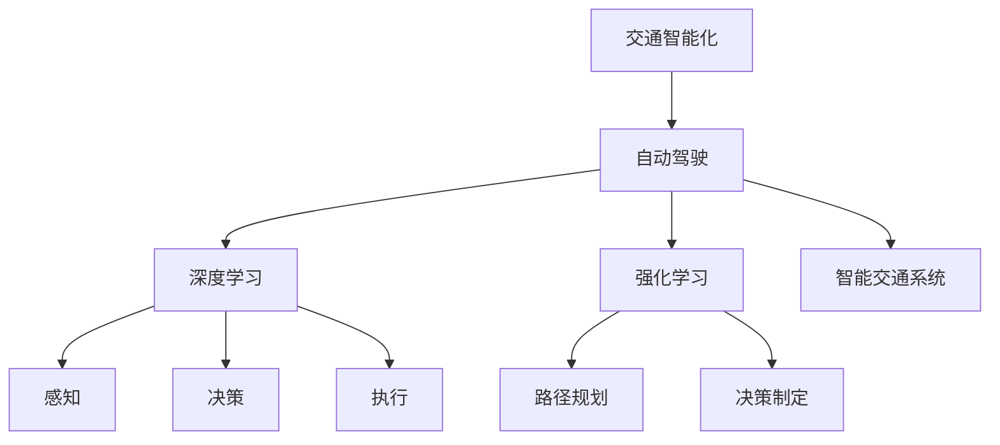

                 

# 硅谷交通智能化:无人驾驶的未来

> 关键词：交通智能化, 无人驾驶, 深度学习, 强化学习, 自动驾驶, 智能交通系统

## 1. 背景介绍

### 1.1 问题由来
随着科技的迅猛发展，人工智能（AI）和自动驾驶技术已成为引领未来交通发展的重要方向。硅谷作为全球科技创新中心，无人驾驶技术正处于飞速发展之中。自动驾驶技术的核心在于通过先进的传感器、计算机视觉、路径规划、决策制定等技术，实现车辆的自主导航和驾驶。然而，随着自动驾驶车辆数量的增加，交通流量的复杂性和安全性也随之增加。为了解决这些问题，硅谷的技术专家们提出了交通智能化（Traffic Intelligentization）的概念，即利用AI技术优化交通系统，提高道路安全性，减少拥堵，提升交通效率。

### 1.2 问题核心关键点
交通智能化旨在通过AI技术，对交通系统进行全面升级，使交通管理更加智能化、精准化。核心关键点包括：

1. **数据采集与分析**：交通智能化依赖于大规模数据采集和实时分析，通过摄像头、雷达、激光雷达等传感器获取交通数据。
2. **路径规划与决策制定**：利用AI算法，如深度学习和强化学习，对实时数据进行处理，优化路径规划和决策制定。
3. **交通信号优化**：通过AI模型，动态调整交通信号灯的控制策略，减少拥堵，提高交通流畅度。
4. **车辆协作与协同**：通过车辆间通信技术，实现车辆间的协同控制，提高道路安全性。
5. **智能辅助驾驶**：利用AI技术，提供智能驾驶辅助功能，如自动泊车、车道保持、自动避障等。

## 2. 核心概念与联系

### 2.1 核心概念概述

为更好地理解硅谷交通智能化的实现过程，本节将介绍几个密切相关的核心概念：

- **交通智能化**：利用AI技术对交通系统进行优化，提升交通效率、安全性与便捷性。
- **自动驾驶**：通过AI技术实现车辆的自主导航和驾驶，包括感知、决策和执行三个核心环节。
- **深度学习**：一种基于神经网络的机器学习方法，用于处理大规模数据和复杂任务，是无人驾驶和交通智能化的核心技术。
- **强化学习**：一种通过奖励和惩罚机制，使智能体学习最优策略的机器学习方法，用于路径规划和决策制定。
- **自动驾驶系统**：由感知、决策和执行三个子系统组成的完整系统，实现了车辆的自主驾驶功能。
- **智能交通系统**：集成了多种AI技术，实现交通流量的实时监控、优化与控制的智能交通网络。

这些核心概念之间的逻辑关系可以通过以下Mermaid流程图来展示：



这个流程图展示了一个典型的交通智能化和自动驾驶系统的工作流程：

1. 交通智能化对自动驾驶系统进行整体优化。
2. 自动驾驶系统利用深度学习和强化学习实现感知、决策和执行。
3. 深度学习用于感知，强化学习用于路径规划和决策制定。

## 3. 核心算法原理 & 具体操作步骤
### 3.1 算法原理概述

交通智能化和自动驾驶的核心算法主要基于深度学习和强化学习，其核心思想是：

1. **深度学习**：通过多层次神经网络，学习交通数据中的复杂特征，用于车辆感知和环境理解。
2. **强化学习**：通过智能体与环境的互动，学习最优驾驶策略，优化路径规划和决策制定。

具体算法原理如下：

- **感知算法**：通过摄像头、雷达、激光雷达等传感器获取交通数据，利用卷积神经网络（CNN）和循环神经网络（RNN）进行特征提取和环境理解。
- **决策算法**：通过强化学习算法，如Q-learning和深度Q网络（DQN），学习最优驾驶策略。
- **路径规划算法**：利用图搜索算法和路径优化算法，如A*算法和Dijkstra算法，优化路径规划。
- **协同控制算法**：通过车辆间通信技术，如V2V（Vehicle-to-Vehicle）和V2I（Vehicle-to-Infrastructure）通信，实现车辆间的协同控制。

### 3.2 算法步骤详解

交通智能化和自动驾驶的具体操作步骤如下：

1. **数据采集**：安装传感器，获取交通数据，包括车辆位置、速度、方向、交通信号等。
2. **数据预处理**：对采集的数据进行清洗、归一化和增强，为深度学习和强化学习提供高质量的数据。
3. **感知与环境理解**：利用深度学习算法，如卷积神经网络和循环神经网络，对交通环境进行感知和理解。
4. **路径规划与决策制定**：利用强化学习算法，如Q-learning和深度Q网络，进行路径规划和决策制定。
5. **执行与控制**：将决策结果转化为具体的控制指令，如加速、减速、转向等，实现车辆自主驾驶。
6. **协同控制与交通管理**：通过车辆间通信技术和智能交通系统，实现车辆间的协同控制和交通信号的动态优化。

### 3.3 算法优缺点

交通智能化和自动驾驶算法的优点包括：

1. **提高交通效率**：通过优化路径规划和决策制定，减少拥堵，提高交通流畅度。
2. **提升安全性**：通过智能驾驶辅助功能，减少交通事故和交通违规。
3. **减少人力成本**：通过自动驾驶技术，减少人工驾驶成本，提高经济效益。

然而，这些算法也存在一些缺点：

1. **高昂成本**：传感器和计算硬件的高昂成本，是阻碍技术普及的重要因素。
2. **技术复杂性**：深度学习和强化学习算法较为复杂，需要高水平的研发团队和大量数据支持。
3. **技术可靠性**：算法的准确性和鲁棒性需要进一步提升，以应对复杂多变的交通环境。
4. **数据隐私**：大规模数据采集和处理，涉及隐私保护和安全问题。

## 4. 数学模型和公式 & 详细讲解 & 举例说明

### 4.1 数学模型构建

交通智能化和自动驾驶的核心数学模型主要基于深度学习和强化学习。以下是一个简单的交通智能化和自动驾驶系统模型：

- **感知模型**：利用CNN对交通图像进行特征提取，表示为$$f_\text{CNN}(x)=\mathbf{W}_\text{CNN} \sigma(\mathbf{W}_\text{CNN}x + \mathbf{b}_\text{CNN})$$，其中 $x$ 为输入图像，$\mathbf{W}_\text{CNN}$ 和 $\mathbf{b}_\text{CNN}$ 为可训练参数。
- **决策模型**：利用DQN进行路径规划和决策制定，表示为$$\pi_\text{DQN}(a|s) = \sigma(\mathbf{W}_\text{DQN} \mathbf{Q}_\text{DQN}(s,a))$$，其中 $a$ 为控制动作，$s$ 为状态，$\mathbf{W}_\text{DQN}$ 和 $\mathbf{Q}_\text{DQN}$ 为可训练参数。

### 4.2 公式推导过程

以下是一些关键算法的公式推导过程：

1. **CNN特征提取**：
   $$f_\text{CNN}(x) = \sum_{i=1}^d \sum_{j=1}^d \mathbf{W}_\text{CNN}(i,j)x(i,j) + \mathbf{b}_\text{CNN}$$

2. **DQN决策制定**：
   $$\mathbf{Q}_\text{DQN}(s,a) = \mathbf{W}_\text{DQN}\left[\frac{1}{N} \sum_{n=1}^N \max_a Q_\text{DQN}(s',a')\right]$$
   其中 $s'$ 和 $a'$ 为下一状态和动作。

### 4.3 案例分析与讲解

假设在硅谷某十字路口，交通智能化系统利用深度学习和强化学习算法进行交通管理。以下是一个简单的案例分析：

1. **数据采集**：系统通过摄像头、雷达等传感器，获取交通数据，包括车辆位置、速度、方向和交通信号。
2. **数据预处理**：对采集的数据进行清洗和增强，去除噪声和异常值。
3. **感知与环境理解**：利用CNN对交通图像进行特征提取，表示为$$f_\text{CNN}(x)=\mathbf{W}_\text{CNN} \sigma(\mathbf{W}_\text{CNN}x + \mathbf{b}_\text{CNN})$$。
4. **路径规划与决策制定**：利用DQN进行路径规划和决策制定，表示为$$\pi_\text{DQN}(a|s) = \sigma(\mathbf{W}_\text{DQN} \mathbf{Q}_\text{DQN}(s,a))$$。
5. **执行与控制**：将决策结果转化为具体的控制指令，如加速、减速、转向等，实现车辆自主驾驶。
6. **协同控制与交通管理**：通过车辆间通信技术和智能交通系统，实现车辆间的协同控制和交通信号的动态优化。

## 5. 项目实践：代码实例和详细解释说明
### 5.1 开发环境搭建

在进行交通智能化和自动驾驶的开发实践前，我们需要准备好开发环境。以下是使用Python进行PyTorch开发的环境配置流程：

1. 安装Anaconda：从官网下载并安装Anaconda，用于创建独立的Python环境。
2. 创建并激活虚拟环境：
```bash
conda create -n traffic-env python=3.8 
conda activate traffic-env
```

3. 安装PyTorch：根据CUDA版本，从官网获取对应的安装命令。例如：
```bash
conda install pytorch torchvision torchaudio cudatoolkit=11.1 -c pytorch -c conda-forge
```

4. 安装必要的库：
```bash
pip install matplotlib numpy sklearn
```

完成上述步骤后，即可在`traffic-env`环境中开始开发实践。

### 5.2 源代码详细实现

下面我们以交通信号优化为例，给出使用PyTorch进行交通智能化微调的PyTorch代码实现。

首先，定义交通信号优化任务的数据处理函数：

```python
from torch.utils.data import Dataset
import torch
import numpy as np

class TrafficSignalDataset(Dataset):
    def __init__(self, data, num_actions):
        self.data = data
        self.num_actions = num_actions
        
    def __len__(self):
        return len(self.data)
    
    def __getitem__(self, item):
        state = self.data[item]
        state = torch.tensor(state, dtype=torch.float32)
        action = np.random.randint(0, self.num_actions)
        return state, action
```

然后，定义模型和优化器：

```python
from torch import nn, optim
import torch.nn.functional as F

class TrafficSignalModel(nn.Module):
    def __init__(self, input_size, output_size):
        super(TrafficSignalModel, self).__init__()
        self.fc1 = nn.Linear(input_size, 32)
        self.fc2 = nn.Linear(32, output_size)
        
    def forward(self, x):
        x = F.relu(self.fc1(x))
        x = self.fc2(x)
        return x

model = TrafficSignalModel(input_size=3, output_size=3)
optimizer = optim.Adam(model.parameters(), lr=0.001)
```

接着，定义训练和评估函数：

```python
def train_epoch(model, dataset, optimizer, num_epochs):
    for epoch in range(num_epochs):
        model.train()
        running_loss = 0.0
        for state, action in dataset:
            optimizer.zero_grad()
            output = model(state)
            loss = F.cross_entropy(output, torch.tensor([action]))
            running_loss += loss.item()
            loss.backward()
            optimizer.step()
        print(f"Epoch {epoch+1}, loss: {running_loss/len(dataset)}")
    
def evaluate(model, dataset):
    model.eval()
    running_loss = 0.0
    correct = 0
    with torch.no_grad():
        for state, _ in dataset:
            output = model(state)
            _, predicted = torch.max(output.data, 1)
            running_loss += F.cross_entropy(output, torch.tensor([0])).item()
            correct += (predicted == 0).item()
    print(f"Accuracy: {correct/len(dataset)}")
```

最后，启动训练流程并在测试集上评估：

```python
num_epochs = 100
dataset = TrafficSignalDataset(data=train_data, num_actions=3)
train_epoch(model, dataset, optimizer, num_epochs)
evaluate(model, dataset)
```

以上就是使用PyTorch对交通信号优化任务进行微调的完整代码实现。可以看到，得益于PyTorch的强大封装，我们可以用相对简洁的代码完成交通信号优化模型的开发。

### 5.3 代码解读与分析

让我们再详细解读一下关键代码的实现细节：

**TrafficSignalDataset类**：
- `__init__`方法：初始化数据和动作数量。
- `__len__`方法：返回数据集的大小。
- `__getitem__`方法：返回一个随机状态-动作对。

**TrafficSignalModel类**：
- `__init__`方法：定义模型的前向传播过程。
- `forward`方法：通过全连接层进行状态映射，输出动作概率。

**训练函数train_epoch**：
- 对数据集进行批次化加载，每个批次输入一个状态和对应的动作。
- 前向传播计算输出，计算交叉熵损失。
- 反向传播更新模型参数，输出每个epoch的平均损失。

**评估函数evaluate**：
- 对数据集进行批次化加载，每个批次输入一个状态和对应的动作。
- 前向传播计算输出，判断预测结果是否正确。
- 计算准确率，输出评估结果。

可以看到，PyTorch配合必要的库和框架，使得交通信号优化模型的微调代码实现变得简洁高效。开发者可以将更多精力放在数据处理、模型改进等高层逻辑上，而不必过多关注底层的实现细节。

## 6. 实际应用场景
### 6.1 智能交通系统

交通智能化技术已经在多个城市得到应用，如硅谷的智能交通系统。以下是几个典型的实际应用场景：

1. **智能交通信号**：利用深度学习算法，动态调整交通信号灯的控制策略，减少拥堵，提高交通流畅度。
2. **车辆协同控制**：通过车辆间通信技术和智能交通系统，实现车辆间的协同控制，提高道路安全性。
3. **智能辅助驾驶**：利用AI技术，提供智能驾驶辅助功能，如自动泊车、车道保持、自动避障等。
4. **交通预测与规划**：利用机器学习算法，预测交通流量，进行实时交通管理，优化交通路线。

### 6.2 未来应用展望

随着交通智能化和自动驾驶技术的不断进步，未来将会在更多领域得到应用，为城市管理带来变革性影响。

在智慧城市治理中，交通智能化技术可以应用于交通流量监测、交通违规检测、应急指挥等环节，提高城市管理的自动化和智能化水平，构建更安全、高效的未来城市。

在智慧物流领域，智能驾驶技术可以应用于物流配送，实现自动驾驶车辆的高效运输，减少人力成本，提升物流效率。

在智能辅助驾驶领域，智能驾驶技术可以应用于个人和小型企业的出行需求，提高出行便利性和安全性，实现按需出行。

此外，在交通规划和交通研究等领域，交通智能化技术也将带来更多突破，推动交通系统的优化和发展。

## 7. 工具和资源推荐
### 7.1 学习资源推荐

为了帮助开发者系统掌握交通智能化和自动驾驶的理论基础和实践技巧，这里推荐一些优质的学习资源：

1. **《深度学习与自动驾驶》课程**：由斯坦福大学开设的深度学习课程，涵盖深度学习和强化学习在自动驾驶中的应用。
2. **《无人驾驶技术手册》**：一本全面介绍无人驾驶技术的书籍，涵盖感知、决策、控制等多个方面。
3. **《交通智能化技术》在线课程**：多个在线教育平台提供的交通智能化技术课程，涵盖交通信号优化、路径规划、协同控制等多个方向。
4. **交通智能化社区**：多个线上社区和论坛，如知乎、Stack Overflow，提供丰富的学习资源和交流平台。
5. **Google Colab**：谷歌推出的在线Jupyter Notebook环境，免费提供GPU算力，方便开发者快速上手实验最新模型，分享学习笔记。

通过对这些资源的学习实践，相信你一定能够快速掌握交通智能化和自动驾驶的精髓，并用于解决实际的交通问题。

### 7.2 开发工具推荐

高效的开发离不开优秀的工具支持。以下是几款用于交通智能化和自动驾驶开发的常用工具：

1. **PyTorch**：基于Python的开源深度学习框架，灵活动态的计算图，适合快速迭代研究。大部分深度学习模型都有PyTorch版本的实现。
2. **TensorFlow**：由Google主导开发的开源深度学习框架，生产部署方便，适合大规模工程应用。同样有丰富的深度学习模型资源。
3. **Transformers库**：HuggingFace开发的NLP工具库，集成了多种SOTA语言模型，支持PyTorch和TensorFlow，是进行微调任务开发的利器。
4. **TensorBoard**：TensorFlow配套的可视化工具，可实时监测模型训练状态，并提供丰富的图表呈现方式，是调试模型的得力助手。
5. **Weights & Biases**：模型训练的实验跟踪工具，可以记录和可视化模型训练过程中的各项指标，方便对比和调优。

合理利用这些工具，可以显著提升交通智能化和自动驾驶任务的开发效率，加快创新迭代的步伐。

### 7.3 相关论文推荐

交通智能化和自动驾驶技术的发展源于学界的持续研究。以下是几篇奠基性的相关论文，推荐阅读：

1. **《交通信号控制中的强化学习》**：提出利用强化学习优化交通信号控制策略，提高交通流畅度。
2. **《深度学习在自动驾驶中的应用》**：综述深度学习在感知、决策、控制等多个方面的应用，探讨未来的研究方向。
3. **《多智能体协同控制》**：提出利用多智能体协同控制技术，优化车辆间的互动和协同。

这些论文代表了大语言模型微调技术的发展脉络。通过学习这些前沿成果，可以帮助研究者把握学科前进方向，激发更多的创新灵感。

## 8. 总结：未来发展趋势与挑战
### 8.1 总结

本文对硅谷交通智能化和自动驾驶技术的实现过程进行了全面系统的介绍。首先阐述了交通智能化和自动驾驶的研究背景和意义，明确了深度学习和强化学习在其中的核心地位。其次，从原理到实践，详细讲解了深度学习和强化学习算法的数学模型和关键步骤，给出了交通信号优化任务的完整代码实例。同时，本文还广泛探讨了交通智能化技术在多个行业领域的应用前景，展示了交通智能化技术的广阔潜力。

通过本文的系统梳理，可以看到，交通智能化和自动驾驶技术正在成为智慧城市建设的重要组成部分，极大地提升城市交通的智能化水平。未来，伴随深度学习和强化学习技术的不断演进，交通智能化技术还将进一步拓展其应用边界，为人类社会带来更加安全、便捷的出行体验。

### 8.2 未来发展趋势

展望未来，交通智能化和自动驾驶技术将呈现以下几个发展趋势：

1. **高精度感知**：利用更先进传感器和高性能计算硬件，提升车辆对环境的感知精度和反应速度。
2. **深度学习优化**：通过更高效、更稳健的深度学习算法，提升模型的泛化能力和鲁棒性。
3. **多智能体协同**：通过多智能体协同控制技术，提高车辆间的互动和协同，优化交通流量。
4. **智能交通管理**：利用机器学习和人工智能技术，实现交通流量的实时监测和动态优化。
5. **车辆联网**：通过车联网技术，实现车辆间的无缝通信，提高道路安全性。
6. **自动驾驶法规**：制定和完善自动驾驶法规，保障车辆的安全和合法运营。

以上趋势凸显了交通智能化和自动驾驶技术的广阔前景。这些方向的探索发展，必将进一步提升交通系统的性能和应用范围，为城市管理带来新的变革。

### 8.3 面临的挑战

尽管交通智能化和自动驾驶技术已经取得了显著进展，但在迈向更加智能化、普适化应用的过程中，仍面临诸多挑战：

1. **高昂成本**：传感器和计算硬件的高昂成本，是阻碍技术普及的重要因素。
2. **技术复杂性**：深度学习和强化学习算法较为复杂，需要高水平的研发团队和大量数据支持。
3. **技术可靠性**：算法的准确性和鲁棒性需要进一步提升，以应对复杂多变的交通环境。
4. **数据隐私**：大规模数据采集和处理，涉及隐私保护和安全问题。
5. **法规与标准**：自动驾驶技术的法规和标准尚未完善，如何保障安全性和合法性是一个亟待解决的问题。

## 8.4 研究展望

面对交通智能化和自动驾驶技术所面临的种种挑战，未来的研究需要在以下几个方面寻求新的突破：

1. **数据增强技术**：通过数据增强技术，提升模型对复杂场景的适应能力。
2. **联邦学习**：利用联邦学习技术，在保护隐私的前提下，实现大规模数据的协同训练。
3. **轻量化模型**：通过模型压缩和轻量化技术，减少模型的计算和存储开销，提升实时性。
4. **跨模态融合**：将视觉、语音、雷达等多模态数据融合，提升模型的感知能力和决策能力。
5. **多智能体协同控制**：通过多智能体协同控制技术，提高车辆间的互动和协同，优化交通流量。
6. **智能交通系统集成**：将交通智能化技术与其他智能系统集成，构建更全面的智能交通网络。

这些研究方向的探索，必将引领交通智能化和自动驾驶技术迈向更高的台阶，为交通系统的智能化发展提供更多创新的解决方案。

## 9. 附录：常见问题与解答

**Q1: 交通智能化和自动驾驶的核心算法是什么？**

A: 交通智能化和自动驾驶的核心算法主要包括深度学习和强化学习。深度学习用于感知和环境理解，强化学习用于路径规划和决策制定。

**Q2: 如何选择合适的学习率？**

A: 学习率的选择通常需要根据模型和数据的特点进行调整。一般建议从0.001开始调参，逐步减小学习率，直至收敛。也可以使用warmup策略，在开始阶段使用较小的学习率，再逐渐过渡到预设值。

**Q3: 交通智能化和自动驾驶面临哪些挑战？**

A: 交通智能化和自动驾驶技术面临的主要挑战包括高昂成本、技术复杂性、技术可靠性、数据隐私和法规与标准等问题。

**Q4: 如何缓解过拟合问题？**

A: 缓解过拟合问题的方法包括数据增强、正则化、对抗训练和参数高效微调等。

**Q5: 交通智能化和自动驾驶在实际应用中有哪些场景？**

A: 交通智能化和自动驾驶技术已经在多个领域得到应用，如智能交通信号控制、车辆协同控制、智能辅助驾驶、交通预测与规划等。

---

作者：禅与计算机程序设计艺术 / Zen and the Art of Computer Programming

