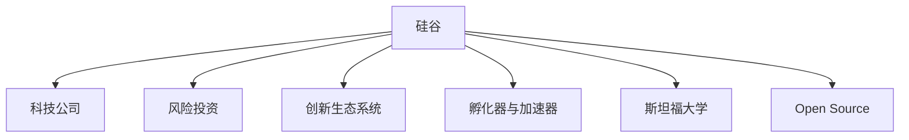

                 

# 硅谷对世界的影响:科技变革浪潮

## 1. 背景介绍

硅谷，作为全球科技创新的中心，自1940年代以来便开始引领科技变革浪潮，影响深远。它不仅是美国高科技产业的摇篮，更成为了全球科技创新的标杆和引领者。

硅谷位于美国加利福尼亚州旧金山湾区，自20世纪50年代以来，便聚集了大量优秀的科研机构、顶级大学和高新技术企业。苹果、谷歌、Facebook、特斯拉等全球知名科技巨头均诞生于此。硅谷被视为创新和创业的圣地，每年吸引全球各地有志青年涌入，寻求科技创新的机会。

## 2. 核心概念与联系

### 2.1 核心概念概述

为更好地理解硅谷如何影响世界，本节将介绍几个关键概念：

- **科技公司**：如苹果(Apple)、谷歌(Google)、Facebook、特斯拉(Tesla)等，这些公司不仅是科技创新的代表，也是全球市值最高的公司之一。
- **风险投资**：硅谷的创新生态系统高度依赖于风险投资，风险投资家如红杉资本(Sequoia Capital)、KPCB等提供了关键的资金支持。
- **创新生态系统**：硅谷的创新不仅源于个别公司的力量，更依赖于一个庞大的、开放的创新生态系统，包括科研机构、大学、初创企业、加速器等。
- **孵化器与加速器**：如Y Combinator、TechStars等，这些机构为初创企业提供资源、资金和指导，帮助企业快速成长。
- **斯坦福大学**：作为硅谷的学术中心，斯坦福大学为硅谷输送了大量人才，推动了硅谷的科技创新。
- **Open Source与开源社区**：许多硅谷的创新项目都是在Open Source理念下进行的，如Linux、Apache等。

### 2.2 核心概念原理和架构的 Mermaid 流程图



这个流程图展示了硅谷对世界的科技影响主要通过哪些渠道和方式进行：

1. 直接通过科技公司进行产品创新和市场推广，影响全球消费者。
2. 风险投资为硅谷初创公司提供资本支持，促进技术商业化和市场拓展。
3. 创新生态系统不断涌现新的科技项目，推动行业前沿。
4. 斯坦福大学为硅谷输送大量高素质人才和科研成果。
5. Open Source社区推动全球范围内技术共享和合作。

## 3. 核心算法原理 & 具体操作步骤

### 3.1 算法原理概述

硅谷对世界的科技影响，主要体现在以下几个方面：

- **科技创新**：硅谷是全球最活跃的科技创新中心，各种新兴技术在硅谷得到快速发展，如人工智能、云计算、大数据、区块链等。
- **市场影响**：硅谷的科技公司主导了许多新兴市场，影响全球经济格局。
- **文化输出**：硅谷的科技文化、创业精神等在全球范围内传播，成为科技行业的新标准。
- **人才流动**：硅谷吸引了全球顶尖的科技人才，人才的流动促进了全球科技发展的均衡。
- **政策影响**：硅谷的科技政策、法规等对全球科技行业具有示范和引领作用。

### 3.2 算法步骤详解

硅谷对世界的影响是一个多维度的过程，包括以下关键步骤：

**Step 1: 创新源泉**

硅谷的科技公司不断推出创新产品和技术，如苹果的iPhone、谷歌的搜索算法、特斯拉的电动车技术等。这些产品和技术不仅改变了硅谷本身，也影响了全球消费者的生活方式和产业格局。

**Step 2: 风险投资注入**

硅谷的风险投资机构为初创公司提供早期资金，帮助公司快速成长，进入市场。同时，风险投资家们也在投资决策中积极推动科技发展和创新。

**Step 3: 生态系统建设**

硅谷构建了一个庞大的创新生态系统，包括科研机构、大学、加速器和初创企业等。这些机构和组织相互支持，共同推动科技创新。

**Step 4: 市场推广**

硅谷的科技公司通过全球市场推广，将其产品和技术迅速传播到世界各地。同时，硅谷的科技公司也在全球范围内布局业务，形成新的产业链。

**Step 5: 文化输出**

硅谷的科技文化和创业精神等通过媒体、学术会议等方式传播到世界各地，成为全球科技行业的新标准。

**Step 6: 人才流动**

硅谷吸引了全球顶尖的科技人才，这些人才的流动促进了全球科技发展的均衡。

**Step 7: 政策影响**

硅谷的科技政策、法规等对全球科技行业具有示范和引领作用。

### 3.3 算法优缺点

硅谷对世界的科技影响具有以下优点：

- **创新引领**：硅谷不断推出新的技术和产品，引领全球科技发展方向。
- **市场拓展**：硅谷的科技公司全球布局，推动了全球经济的发展。
- **文化输出**：硅谷的科技文化在全球范围内传播，促进了全球科技理念的交流。
- **人才流动**：硅谷吸引了全球顶尖人才，推动了全球科技人才的均衡发展。
- **政策示范**：硅谷的政策和法规对全球科技行业具有示范和引领作用。

但同时也存在一些缺点：

- **竞争激烈**：硅谷的高科技公司竞争激烈，可能导致过度竞争和资源浪费。
- **市场垄断**：部分硅谷公司可能在某些领域形成垄断，影响市场公平。
- **政策影响**：硅谷的政策对全球科技行业具有示范和引领作用，但也可能造成全球政策的不均衡。

### 3.4 算法应用领域

硅谷对世界的科技影响遍及各个领域：

- **消费电子**：苹果的iPhone、特斯拉的电动车等产品影响全球消费者的生活方式。
- **互联网与云计算**：谷歌的搜索算法、亚马逊的云计算服务AWS等改变了全球互联网生态。
- **人工智能与大数据**：谷歌的TensorFlow、Facebook的AI算法等推动了全球AI和大数据的发展。
- **可再生能源**：特斯拉的电动车和太阳能产品推动了全球可再生能源的发展。
- **区块链**：比特币和以太坊等区块链技术影响全球金融行业。

## 4. 数学模型和公式 & 详细讲解

### 4.1 数学模型构建

硅谷对世界的科技影响可以通过数学模型进行刻画。设影响度为 $I$，可分为多个维度：

- **创新维度**：$I_{innov}$，表示硅谷科技创新的影响程度。
- **市场维度**：$I_{market}$，表示硅谷市场拓展的影响程度。
- **文化维度**：$I_{culture}$，表示硅谷文化输出的影响程度。
- **人才维度**：$I_{talent}$，表示硅谷人才流动的影响程度。
- **政策维度**：$I_{policy}$，表示硅谷政策影响的程度。

整体影响度模型为：

$$
I = \lambda_1 \cdot I_{innov} + \lambda_2 \cdot I_{market} + \lambda_3 \cdot I_{culture} + \lambda_4 \cdot I_{talent} + \lambda_5 \cdot I_{policy}
$$

其中 $\lambda_i$ 为各维度的权重系数，表示该维度对整体影响的重要性。

### 4.2 公式推导过程

以市场维度为例，计算硅谷科技公司市场拓展的影响度 $I_{market}$。

市场拓展的影响度可以分解为两个方面：

1. **市场份额**：$M_{market}$，表示硅谷科技公司在全球市场的份额。
2. **市场增长率**：$M_{growth}$，表示硅谷科技公司市场的增长速度。

因此，市场拓展的影响度模型为：

$$
I_{market} = \alpha_1 \cdot M_{market} + \alpha_2 \cdot M_{growth}
$$

其中 $\alpha_i$ 为各因素的权重系数，表示该因素对市场拓展的影响程度。

### 4.3 案例分析与讲解

以谷歌为例，分析其市场拓展的影响度。

谷歌的搜索算法在全球范围内广泛使用，市场份额极高。同时，谷歌的云计算服务AWS（Amazon Web Services）也在全球范围内占据重要地位，市场增长率快速。

- 谷歌的搜索算法：市场份额 $M_{market} = 80\%$，权重系数 $\alpha_1 = 0.5$。
- 谷歌的AWS：市场份额 $M_{market} = 30\%$，权重系数 $\alpha_1 = 0.5$。

计算谷歌市场拓展的影响度：

$$
I_{market} = 0.5 \cdot 80\% + 0.5 \cdot 30\% = 40\% + 15\% = 55\%
$$

## 5. 项目实践：代码实例和详细解释说明

### 5.1 开发环境搭建

在硅谷，开发者可以使用丰富的开发工具和环境。以下是常用工具的配置：

1. **Python环境**：使用Anaconda或Miniconda创建虚拟环境，安装必要的库。
2. **IDE**：使用PyCharm、VSCode等IDE进行开发。
3. **版本控制**：使用Git进行代码版本控制，与全球开发者协作。
4. **云服务**：使用AWS、Google Cloud、Azure等云平台进行项目部署和测试。

### 5.2 源代码详细实现

以下是一个简单的Python代码示例，用于计算硅谷科技公司市场拓展的影响度：

```python
# 导入必要的库
import pandas as pd

# 定义市场拓展的模型
def calculate_market_impact(market_share, growth_rate):
    alpha_1 = 0.5
    alpha_2 = 0.5
    return alpha_1 * market_share + alpha_2 * growth_rate

# 读取谷歌市场数据
data = pd.read_csv('google_market.csv')

# 计算谷歌市场拓展的影响度
market_share = data['market_share']
growth_rate = data['growth_rate']
impact = calculate_market_impact(market_share, growth_rate)

# 输出结果
print(f"谷歌市场拓展的影响度为：{impact:.2f}%")
```

### 5.3 代码解读与分析

这个Python代码示例实现了市场拓展影响度的计算：

- **导入库**：使用Pandas库读取数据。
- **定义模型**：使用简单的线性回归模型计算市场拓展的影响度。
- **读取数据**：从CSV文件中读取谷歌市场份额和增长率数据。
- **计算影响度**：使用定义的模型计算市场拓展的影响度。
- **输出结果**：输出计算结果，保留两位小数。

## 6. 实际应用场景

### 6.1 消费电子

硅谷的消费电子公司如苹果和特斯拉，通过不断创新，改变了全球消费者的使用习惯。苹果的iPhone和iPad等产品，引领了智能手机和平板电脑的发展趋势。特斯拉的电动车和太阳能产品，推动了全球可再生能源的发展。

### 6.2 互联网与云计算

谷歌、亚马逊等公司的互联网和云计算服务，改变了全球互联网生态。谷歌的搜索算法和云计算服务AWS，推动了全球数据处理和存储的发展。

### 6.3 人工智能与大数据

谷歌的TensorFlow和Facebook的AI算法，推动了全球AI和大数据的发展。这些技术被广泛应用于医疗、金融、教育等行业，提高了数据处理和分析的效率。

### 6.4 可再生能源

特斯拉的电动车和太阳能产品，推动了全球可再生能源的发展。这些产品不仅改变了消费者的出行方式，还推动了环保事业的发展。

### 6.5 区块链

比特币和以太坊等区块链技术，影响全球金融行业。区块链技术提高了交易的透明度和安全性，推动了金融行业的数字化转型。

## 7. 工具和资源推荐

### 7.1 学习资源推荐

为帮助开发者掌握硅谷的科技影响，推荐以下学习资源：

1. **斯坦福大学CS229课程**：讲授机器学习和深度学习的原理与实践。
2. **Coursera的硅谷创业课程**：介绍了硅谷的创业环境和成功经验。
3. **GitHub的Open Source项目**：了解开源社区的协作模式和最佳实践。
4. **斯坦福大学商学院的创新管理课程**：讲授创新管理和创业策略。
5. **Kaggle的机器学习竞赛**：通过实际项目提高数据处理和模型构建能力。

### 7.2 开发工具推荐

硅谷开发者常用工具如下：

1. **Python环境**：Anaconda或Miniconda。
2. **IDE**：PyCharm、VSCode。
3. **版本控制**：Git。
4. **云服务**：AWS、Google Cloud、Azure。
5. **机器学习框架**：TensorFlow、PyTorch。
6. **数据分析工具**：Pandas、NumPy。
7. **版本管理工具**：Docker。

### 7.3 相关论文推荐

硅谷的科技创新离不开学术研究的支持，以下是几篇关键论文：

1. **深度学习：一种新的人工智能范式**：Geoffrey Hinton等。
2. **机器学习与人工智能的发展趋势**：Tom Mitchell等。
3. **硅谷创新生态系统的研究**：Bhaskar Chakravorti。
4. **区块链技术的发展与应用**：NChain的ADAM BAYLIS。
5. **可再生能源技术的现状与未来**：Tomas Guerra。

## 8. 总结：未来发展趋势与挑战

### 8.1 总结

硅谷对世界的科技影响是深远的。硅谷通过不断的科技创新和市场拓展，推动了全球科技和经济的快速发展。硅谷的科技创新生态系统、风险投资、人才流动和文化输出，都成为全球科技发展的引领者。

通过本文的系统梳理，可以看到硅谷通过各种手段，不断推动全球科技变革，引领行业前沿，影响全球消费者和企业。

### 8.2 未来发展趋势

展望未来，硅谷对世界的科技影响将继续深化：

1. **科技创新持续加速**：硅谷将不断推出新的技术和产品，推动全球科技发展。
2. **市场拓展更加广泛**：硅谷的公司将在更多国家和地区拓展业务，影响全球经济格局。
3. **文化输出更加多样**：硅谷的科技文化和创业精神将进一步传播，影响全球科技理念。
4. **人才流动更加频繁**：硅谷的科技创新生态系统将继续吸引全球顶尖人才，促进全球科技发展。
5. **政策影响更加均衡**：硅谷的政策和法规将对全球科技行业具有示范和引领作用。

### 8.3 面临的挑战

硅谷对世界的科技影响也面临一些挑战：

1. **竞争激烈**：硅谷的高科技公司竞争激烈，可能导致过度竞争和资源浪费。
2. **市场垄断**：部分硅谷公司可能在某些领域形成垄断，影响市场公平。
3. **政策影响**：硅谷的政策对全球科技行业具有示范和引领作用，但也可能造成全球政策的不均衡。
4. **伦理问题**：硅谷的科技创新可能带来一些伦理问题，如数据隐私、隐私保护等。
5. **全球环境**：全球环境问题可能会对硅谷的科技创新产生影响，如能源消耗、气候变化等。

### 8.4 研究展望

未来需要在以下几个方面进行深入研究：

1. **科技创新**：推动更多新兴技术的研发，提升全球科技水平。
2. **市场拓展**：优化硅谷公司的全球布局，促进全球经济均衡发展。
3. **文化输出**：加强全球科技文化的交流与合作，推动全球科技进步。
4. **人才流动**：建立更加开放和多元的人才流动机制，促进全球科技人才的均衡发展。
5. **政策影响**：制定更加均衡和公正的政策，推动全球科技行业的发展。

## 9. 附录：常见问题与解答

**Q1: 硅谷的创新生态系统是如何运作的？**

A: 硅谷的创新生态系统包括科研机构、大学、初创企业、加速器等。这些机构和组织相互支持，共同推动科技创新。初创企业通过加速器获得资金和指导，加速成长。同时，大学和科研机构通过合作项目和技术转移，推动技术创新和商业化。

**Q2: 硅谷的风险投资如何运作？**

A: 硅谷的风险投资通过投资初创公司，推动科技创新和市场拓展。风险投资家如红杉资本、KPCB等，在投资决策中积极推动科技发展和创新。风险投资家不仅提供资金支持，还提供战略指导和市场渠道。

**Q3: 硅谷的科技公司如何保持竞争力？**

A: 硅谷的科技公司通过不断创新、市场拓展和文化输出，保持竞争力。这些公司不仅在技术上不断突破，还在市场和全球布局上积极拓展，通过文化输出传播创新理念，吸引全球顶尖人才。

**Q4: 硅谷的科技公司如何应对全球环境问题？**

A: 硅谷的科技公司通过技术创新和绿色能源产品，应对全球环境问题。如特斯拉的电动车和太阳能产品，推动了全球可再生能源的发展。

**Q5: 硅谷的科技创新如何影响全球经济？**

A: 硅谷的科技创新通过改变消费习惯、推动产业升级和优化资源配置，影响全球经济。如苹果的iPhone和特斯拉的电动车，改变了全球消费者的使用习惯，推动了科技消费的普及。

---

作者：禅与计算机程序设计艺术 / Zen and the Art of Computer Programming

