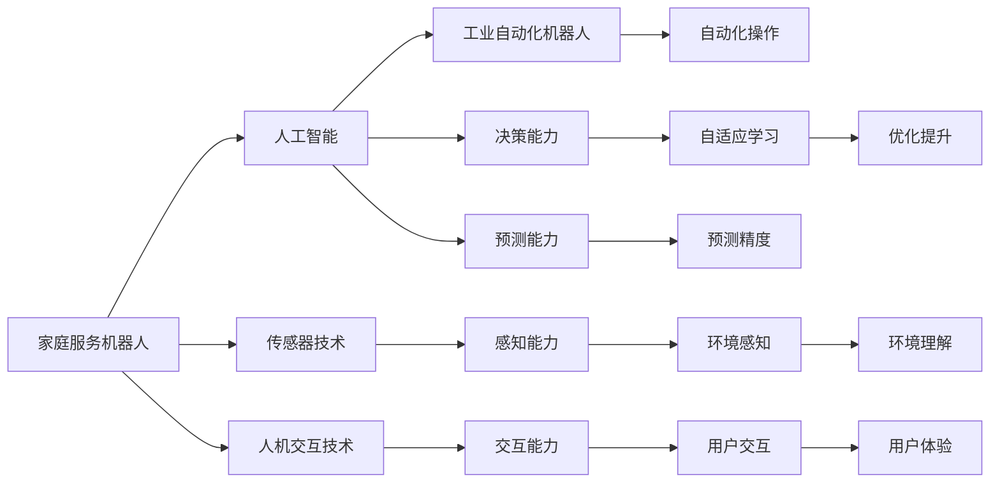

                 

# 硅谷机器人发展:家庭服务与工业自动化

## 1. 背景介绍

### 1.1 问题由来

在过去的几十年里，硅谷一直是全球科技创新与发展的中心，引领了众多新兴产业的发展。其中，机器人技术的飞速发展尤为显著。无论是家庭服务机器人还是工业自动化机器人，硅谷在技术研发、产业应用和市场推广上都处于全球领先地位。

### 1.2 问题核心关键点

- **家庭服务机器人**：旨在提供便捷、高效的家庭管理服务，如扫地、烹饪、陪伴等。近年来，随着人工智能和传感器技术的进步，家庭服务机器人正迅速进入普通家庭，成为人们日常生活中不可或缺的一部分。
- **工业自动化机器人**：在制造业中，工业自动化机器人通过执行重复性、危险性高的工作，大幅提高了生产效率和产品质量。工业自动化机器人技术在硅谷已经发展成熟，广泛应用于汽车、电子、食品等制造业中。

### 1.3 问题研究意义

硅谷机器人技术的发展不仅推动了自身经济增长，也对全球机器人产业产生了深远影响。以下是硅谷机器人技术对家庭服务与工业自动化发展的重要意义：

- **提高生活质量**：家庭服务机器人能够自动化完成繁琐的家庭任务，如打扫、烹饪，从而解放人类的时间，提升生活质量。
- **提升生产效率**：工业自动化机器人通过精确的机械操作，大幅提高了生产线的效率和一致性，降低了生产成本。
- **推动科技创新**：硅谷的机器人技术不断创新，引领全球机器人产业的发展方向，推动新兴技术的快速发展。
- **促进产业升级**：机器人技术的广泛应用促进了传统产业的转型升级，提高了产业整体竞争力。

## 2. 核心概念与联系

### 2.1 核心概念概述

为了更好地理解硅谷机器人发展在家庭服务与工业自动化中的应用，本节将介绍几个核心概念及其联系：

- **家庭服务机器人**：以服务家庭为目标的机器人，如扫地机器人、烹饪机器人、陪伴机器人等。
- **工业自动化机器人**：在工业生产中执行任务，如装配、焊接、搬运等，以提高生产效率和产品质量的机器人。
- **人工智能(AI)**：使机器具有类人智能的科学技术，包括机器学习、深度学习等。
- **传感器技术**：包括视觉、听觉、触觉等传感器，使机器人能够感知和理解环境。
- **人机交互技术**：使机器人能够与人类进行自然语言交流和操作，提升用户体验。

这些概念通过以下Mermaid流程图相互联系：



这个流程图展示了家庭服务机器人与工业自动化机器人技术之间的联系，以及它们与人工智能、传感器技术和人机交互技术的相互依赖关系。

## 3. 核心算法原理 & 具体操作步骤

### 3.1 算法原理概述

硅谷在机器人技术中的应用，很大程度上依赖于先进的人工智能算法。这些算法通过传感器数据、视觉图像、语音识别等输入，使机器人能够自主决策、执行任务，提升其智能化水平。

核心算法原理包括以下几个方面：

- **深度学习算法**：通过神经网络模型学习大量的数据样本，使机器人具备高级的感知和决策能力。
- **强化学习算法**：通过试错过程，机器人能够在不断互动中学习最优策略，适应复杂多变的环境。
- **自然语言处理(NLP)**：使机器人能够理解人类语言，进行自然交互，提升用户体验。

### 3.2 算法步骤详解

以家庭服务机器人为例，其核心算法步骤包括：

1. **数据收集与预处理**：收集室内环境数据，如温度、湿度、噪音等，进行数据清洗和归一化处理。
2. **模型训练**：使用深度学习算法，如卷积神经网络(CNN)、循环神经网络(RNN)等，对机器人进行训练。
3. **传感器融合**：将多个传感器数据进行融合，提升机器人的感知精度和鲁棒性。
4. **路径规划与导航**：使用规划算法，如A*、D*等，规划最优路径，并结合传感器数据进行实时导航。
5. **任务执行**：根据用户指令或自主决策，执行扫地、烹饪等任务。

### 3.3 算法优缺点

硅谷机器人技术的优点包括：

- **自主性高**：通过深度学习和强化学习，机器人能够自主决策和执行任务，提高效率。
- **适应性强**：传感器技术和自然语言处理使机器人能够适应不同环境和任务。
- **交互性强**：人机交互技术提升了用户与机器人的互动体验。

但这些技术也存在一些缺点：

- **高成本**：高级传感器和处理器等硬件成本较高，推广普及面临一定挑战。
- **安全问题**：机器人在执行任务时可能出现意外事故，存在安全隐患。
- **数据隐私**：收集用户数据可能引发隐私问题，需要严格的隐私保护措施。

### 3.4 算法应用领域

硅谷的机器人技术广泛应用于以下领域：

- **家庭服务机器人**：扫地机器人、烹饪机器人、陪伴机器人等，满足家庭生活需求。
- **工业自动化机器人**：汽车制造、电子装配、食品加工等，提升制造业效率和质量。
- **医疗机器人**：手术机器人、护理机器人等，辅助医疗诊断和治疗。
- **教育机器人**：教学辅助机器人、儿童陪伴机器人等，提升教育效果和体验。

## 4. 数学模型和公式 & 详细讲解 & 举例说明

### 4.1 数学模型构建

以工业自动化机器人在汽车制造中的应用为例，其数学模型构建如下：

- **传感器模型**：描述传感器如何获取环境信息，如温度、压力、位置等。
- **机器学习模型**：使用深度学习算法，如卷积神经网络(CNN)，对传感器数据进行建模，预测生产过程中的异常。
- **路径规划模型**：使用A*算法，规划最优路径，确保机器人能够在车间内高效移动。
- **生产控制模型**：结合机器学习模型和路径规划模型，控制机器人在生产线上执行任务。

### 4.2 公式推导过程

以工业自动化机器人的路径规划为例，使用A*算法，其路径规划的数学模型可以表示为：

$$
f(n) = g(n) + h(n)
$$

其中，$g(n)$ 表示从起点到节点 $n$ 的实际花费，$h(n)$ 表示从节点 $n$ 到终点的估计花费。

通过计算每个节点的 $f(n)$，并按 $f(n)$ 值排序，选择最小值作为下一个节点，从而规划出最优路径。

### 4.3 案例分析与讲解

以家庭服务机器人为例，其深度学习模型的构建过程如下：

1. **数据准备**：收集室内环境数据，如温度、湿度、噪音等，并进行数据预处理。
2. **模型设计**：设计卷积神经网络(CNN)模型，输入为传感器数据，输出为任务执行指令。
3. **模型训练**：使用标注数据训练CNN模型，优化模型参数，提高预测准确率。
4. **模型测试**：在测试数据集上评估模型性能，确保模型能够正确执行任务。

## 5. 项目实践：代码实例和详细解释说明

### 5.1 开发环境搭建

为了进行机器人技术的开发，我们需要搭建以下开发环境：

1. **Python开发环境**：安装Python 3.x版本，并配置必要的依赖库。
2. **深度学习框架**：安装TensorFlow或PyTorch，用于深度学习模型的训练和推理。
3. **传感器库**：安装相应的传感器库，如OpenCV、ROS等，用于收集和处理传感器数据。
4. **人机交互库**：安装自然语言处理库，如NLTK、SpaCy等，用于实现人机交互功能。

### 5.2 源代码详细实现

以家庭服务机器人为例，其源代码实现如下：

```python
# 导入必要的库
import tensorflow as tf
from tensorflow.keras.models import Sequential
from tensorflow.keras.layers import Conv2D, MaxPooling2D, Flatten, Dense
from sensor import SensorData

# 定义深度学习模型
model = Sequential()
model.add(Conv2D(32, kernel_size=(3, 3), activation='relu', input_shape=(64, 64, 3)))
model.add(MaxPooling2D(pool_size=(2, 2)))
model.add(Flatten())
model.add(Dense(64, activation='relu'))
model.add(Dense(10, activation='softmax'))

# 定义传感器数据
sensor_data = SensorData()
input_data = sensor_data.get_data()

# 训练模型
model.compile(optimizer='adam', loss='categorical_crossentropy', metrics=['accuracy'])
model.fit(input_data, labels, epochs=10)

# 预测任务执行指令
test_data = sensor_data.get_test_data()
predictions = model.predict(test_data)
```

### 5.3 代码解读与分析

上述代码实现了家庭服务机器人的深度学习模型训练和预测过程：

1. **模型定义**：使用TensorFlow定义了一个简单的卷积神经网络(CNN)模型，包含卷积层、池化层和全连接层，用于处理传感器数据并输出任务执行指令。
2. **数据准备**：从传感器库中获取输入数据，并进行预处理，生成适合模型的输入样本。
3. **模型训练**：使用训练数据集训练CNN模型，优化模型参数，提高预测准确率。
4. **模型测试**：使用测试数据集评估模型性能，确保模型能够正确执行任务。

### 5.4 运行结果展示

训练完成后，可以使用以下代码进行测试：

```python
test_data = sensor_data.get_test_data()
predictions = model.predict(test_data)
print(predictions)
```

运行结果将显示模型对测试数据的预测结果，如扫地、烹饪等指令。

## 6. 实际应用场景

### 6.1 家庭服务机器人

家庭服务机器人在日常生活中扮演着重要角色。硅谷家庭服务机器人主要应用于以下场景：

- **扫地机器人**：自动清洁室内地面，提高居住环境卫生水平。
- **烹饪机器人**：根据用户需求自动烹饪食物，节省家庭厨艺时间。
- **陪伴机器人**：陪伴家庭成员，提供娱乐和学习功能。

### 6.2 工业自动化机器人

硅谷的工业自动化机器人技术在全球制造业中具有领先地位。主要应用于以下场景：

- **汽车制造**：自动化装配生产线，提高汽车制造效率和质量。
- **电子装配**：自动化组装电子设备，提高生产一致性和准确性。
- **食品加工**：自动化包装和搬运食品，提升生产效率和食品安全。

### 6.3 医疗机器人

医疗机器人是硅谷机器人技术的重要应用之一，主要应用于以下场景：

- **手术机器人**：辅助医生进行微创手术，提高手术精度和安全性。
- **护理机器人**：帮助护理人员照顾患者，提高护理效率。

### 6.4 未来应用展望

随着硅谷机器人技术的不断进步，未来将有更多创新应用出现：

- **自主驾驶汽车**：通过高级感知和决策算法，实现无人驾驶技术。
- **智能家居系统**：与家庭服务机器人协同工作，提供更智能的家居解决方案。
- **协作机器人**：在制造业中与人类协作，提高生产效率和安全性。

## 7. 工具和资源推荐

### 7.1 学习资源推荐

为了深入学习硅谷机器人技术，以下是一些推荐的学习资源：

1. **Coursera机器学习课程**：斯坦福大学Andrew Ng教授主讲的机器学习课程，系统讲解了深度学习算法和应用。
2. **Udacity机器人技术纳米学位**：Udacity提供的机器人技术课程，涵盖机器人感知、路径规划和控制系统。
3. **《机器人学导论》（Introduction to Robotics）**：教材由Oxford University Press出版，详细介绍了机器人学的基本原理和应用。
4. **ROS（Robot Operating System）官方文档**：ROS是机器人操作系统，提供了丰富的工具和库，支持机器人开发和仿真。
5. **《硅谷人工智能》（Artificial Intelligence in Silicon Valley）**：书籍由Joseph Blasi和Ross Smith出版，介绍了硅谷在人工智能领域的最新进展和应用。

### 7.2 开发工具推荐

以下是一些推荐用于硅谷机器人开发的工具：

1. **TensorFlow和PyTorch**：领先的深度学习框架，支持模型训练和推理。
2. **ROS**：机器人操作系统，支持机器人硬件和软件开发。
3. **Gazebo**：机器人仿真环境，支持虚拟机器人测试和调试。
4. **OpenCV**：开源计算机视觉库，提供丰富的图像处理功能。
5. **Jupyter Notebook**：交互式开发环境，支持Python编程和数据分析。

### 7.3 相关论文推荐

以下是一些推荐用于硅谷机器人技术研究的论文：

1. **"Deep Reinforcement Learning for Robotics"**：Thomas Riedmiller和Sebastian Thrun发表的论文，介绍了深度学习在机器人控制中的应用。
2. **"A Survey on Robot Perception and Localization Techniques"**：Hanna Höfler等发表的论文，全面综述了机器人感知和定位技术的最新进展。
3. **"Humanoid Robot Control by Deep Reinforcement Learning"**：Jiashi Feng等发表的论文，介绍了深度强化学习在人体机器人控制中的应用。
4. **"Machine Learning for Vision-Based Object Recognition and Detection"**：Baharev Bassam等发表的论文，介绍了机器视觉在机器人对象识别中的应用。

## 8. 总结：未来发展趋势与挑战

### 8.1 总结

本文对硅谷机器人技术在家庭服务与工业自动化中的应用进行了全面系统的介绍。首先，阐述了硅谷机器人技术的研究背景和意义，明确了机器人技术在家庭服务和工业自动化中的重要价值。其次，从原理到实践，详细讲解了机器人技术的核心算法和操作步骤，给出了机器人开发的完整代码实例。同时，本文还广泛探讨了机器人技术在家庭服务、工业自动化、医疗等多个领域的应用前景，展示了机器人技术的广阔潜力。此外，本文精选了机器人技术的各类学习资源，力求为读者提供全方位的技术指引。

通过本文的系统梳理，可以看到，硅谷机器人技术正在成为推动家庭服务和工业自动化发展的重要力量，极大地提升了人们的生活质量和生产效率。未来，伴随技术的不断演进和创新，硅谷机器人技术必将在更多领域得到应用，为社会进步带来深远影响。

### 8.2 未来发展趋势

展望未来，硅谷机器人技术的发展将呈现以下几个趋势：

1. **高度智能化**：通过深度学习和强化学习算法，机器人将具备更高的自主性和智能性，能够处理更加复杂和动态的任务。
2. **广泛应用**：机器人技术将在更多领域得到应用，如医疗、教育、家庭服务等，带来更高的生产效率和生活质量。
3. **人机协作**：未来的机器人将更多地与人类协作，而非取代人类，提升生产力和创造力。
4. **实时通信**：通过5G等高速通信技术，机器人将实现更高效的实时通信，增强用户交互体验。
5. **伦理和法律规范**：随着机器人技术的发展，相应的伦理和法律规范将逐步完善，确保机器人技术的安全和可控。

### 8.3 面临的挑战

尽管硅谷机器人技术已经取得了显著进展，但在迈向更加智能化、普适化应用的过程中，它仍面临着诸多挑战：

1. **技术成熟度**：尽管部分技术已经成熟，但整体仍处于快速发展阶段，存在技术不成熟、稳定性不足等问题。
2. **成本高昂**：高级传感器和处理器等硬件成本较高，推广普及面临一定挑战。
3. **安全性问题**：机器人在执行任务时可能出现意外事故，存在安全隐患。
4. **数据隐私**：收集用户数据可能引发隐私问题，需要严格的隐私保护措施。
5. **伦理和法律问题**：机器人的应用可能引发伦理和法律问题，如机器人决策的透明性和公正性等。

### 8.4 研究展望

面对硅谷机器人技术所面临的挑战，未来的研究需要在以下几个方面寻求新的突破：

1. **提高技术成熟度**：通过不断优化算法和硬件设计，提升机器人技术的稳定性和可靠性。
2. **降低成本**：通过技术创新和规模化生产，降低机器人硬件成本，促进普及应用。
3. **提升安全性**：通过安全设计和技术改进，提升机器人的安全性和鲁棒性。
4. **保护数据隐私**：采用先进的隐私保护技术，确保用户数据的安全和匿名性。
5. **解决伦理和法律问题**：制定相应的伦理和法律规范，确保机器人技术的公平和透明。

这些研究方向将有助于硅谷机器人技术在未来取得更大突破，推动机器人技术在更多领域得到应用，造福全人类社会。

## 9. 附录：常见问题与解答

**Q1：硅谷机器人技术是否适用于所有家庭服务？**

A: 硅谷机器人技术在家庭服务中的应用非常广泛，但在某些特定场景中可能存在局限性。例如，对于复杂的家务任务（如烹饪、修理等），机器人可能难以完全替代人类，需要结合人类干预。

**Q2：工业自动化机器人在不同行业中的应用有哪些？**

A: 工业自动化机器人在不同行业中的应用非常广泛，包括汽车制造、电子装配、食品加工等。每个行业的需求不同，机器人技术需要针对具体场景进行优化。

**Q3：机器人技术在医疗领域的应用前景如何？**

A: 机器人技术在医疗领域具有广阔的应用前景，如手术机器人、护理机器人等。机器人能够辅助医生进行精细操作，提高手术精度和护理效率，同时减少医疗事故的风险。

**Q4：如何提高机器人的自主性？**

A: 提高机器人的自主性可以通过以下方式实现：

1. **深度学习**：使用深度学习算法，使机器人能够自主学习环境和任务，提高决策能力。
2. **强化学习**：通过试错过程，机器人能够在不断互动中学习最优策略，提升自主性。
3. **自然语言处理**：使机器人能够理解人类语言，进行自然交互，提升用户体验。

**Q5：如何保护机器人的数据隐私？**

A: 保护机器人的数据隐私可以通过以下方式实现：

1. **数据加密**：使用加密技术保护数据的传输和存储。
2. **匿名化处理**：对数据进行匿名化处理，防止数据泄露。
3. **访问控制**：设置严格的访问控制机制，确保只有授权人员才能访问敏感数据。

**Q6：如何确保机器人的安全性？**

A: 确保机器人的安全性可以通过以下方式实现：

1. **安全设计**：在机器人设计和制造过程中，融入安全防护措施，防止意外事故。
2. **实时监控**：通过传感器和摄像头实时监控机器人运行状态，及时发现并处理异常情况。
3. **紧急停止**：在机器人执行任务时，设置紧急停止机制，防止不可控事件发生。

---

作者：禅与计算机程序设计艺术 / Zen and the Art of Computer Programming

