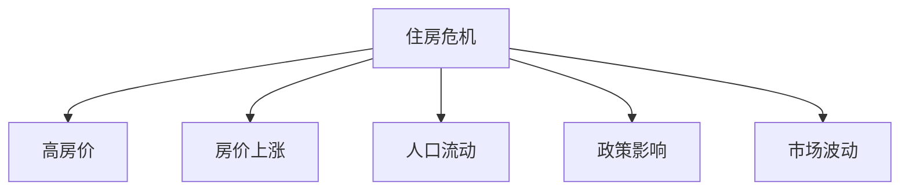

                 

# 硅谷的住房危机:高房价的影响

> 关键词：住房危机,高房价,房价上涨,人口流动,政策影响

## 1. 背景介绍

### 1.1 问题由来

硅谷，作为全球高科技企业的集聚地，其快速的经济发展和人口增长带来了巨大的住房需求。然而，由于土地资源有限和建筑成本高昂，硅谷的住房供应始终无法跟上需求的增长，导致了严重的住房危机。高房价不仅给当地居民带来了经济负担，也影响到了科技公司的运营成本和人才的吸引与保留。近年来，这一问题日益严重，引起了广泛的关注和讨论。

### 1.2 问题核心关键点

硅谷的住房危机主要体现在以下几个方面：
1. **高房价问题**：房价飞速上涨，远超普通居民收入水平，使得许多人难以负担。
2. **住房供应不足**：硅谷土地资源稀缺，限制了住房的建设和供应。
3. **人口过剩**：大量科技公司和高科技产业的吸引，导致人口快速增长，进一步加剧了住房供需矛盾。
4. **政策影响**：政府的土地利用政策、税收政策、住房补贴政策等对住房市场产生了深远影响。
5. **市场波动**：投资热潮和市场波动使得房价波动剧烈，影响市场稳定性。

了解这些核心关键点，有助于深入分析硅谷住房危机的成因及其影响。

## 2. 核心概念与联系

### 2.1 核心概念概述

为更好地理解硅谷住房危机，本节将介绍几个密切相关的核心概念：

- **住房危机(Housing Crisis)**：指住房供需严重失衡，房价远远超出普通居民收入水平的现象。
- **高房价(High Housing Prices)**：指房价超出市场平衡点，使得大多数人难以负担。
- **房价上涨(Housing Price Increase)**：指房价随时间推移呈现上升趋势。
- **人口流动(Population Flow)**：指人口在不同地区之间的迁移，特别是向住房需求大的地区流动。
- **政策影响(Policy Impact)**：指政府的土地利用政策、税收政策、住房补贴政策等对住房市场的影响。
- **市场波动(Market Volatility)**：指住房市场受投资热潮和市场不确定性影响，出现价格波动。

这些概念之间的逻辑关系可以通过以下Mermaid流程图来展示：



这个流程图展示了住房危机与多个核心概念的联系，帮助我们理解硅谷住房危机的复杂性。

## 3. 核心算法原理 & 具体操作步骤
### 3.1 算法原理概述

硅谷住房危机的分析涉及多个因素的交互作用，采用系统工程方法可以更全面地理解问题。具体步骤如下：

1. **数据收集**：收集硅谷的房价数据、人口数据、就业数据、土地利用数据等。
2. **建模分析**：构建数学模型，模拟硅谷住房市场的供需关系。
3. **仿真预测**：使用仿真工具，预测未来住房市场的变化趋势。
4. **优化策略**：提出解决方案，优化住房供应、改善市场稳定性等。

### 3.2 算法步骤详解

#### 3.2.1 数据收集

- **房价数据**：收集硅谷的房价历史数据和当前房价。
- **人口数据**：获取硅谷的人口总数、人口密度、就业率等。
- **就业数据**：统计科技公司和其他行业的工作岗位数量。
- **土地利用数据**：获取硅谷的建设用地、未利用地等。

#### 3.2.2 建模分析

- **供需模型**：构建供需模型，评估当前住房市场供需平衡点。
- **人口迁移模型**：使用人口迁移模型，预测未来人口流入和流出情况。
- **投资影响模型**：模拟投资热潮对房价的影响。
- **政策效应模型**：分析政策变化对住房市场的长期影响。

#### 3.2.3 仿真预测

- **短期预测**：使用时间序列分析方法，预测未来房价走势。
- **长期预测**：构建长期仿真模型，评估未来10-20年的住房市场变化。

#### 3.2.4 优化策略

- **增加供应**：建议政府通过土地利用政策增加住房供应。
- **改善政策**：优化税收政策、住房补贴政策，降低住房成本。
- **市场调控**：引入市场调控机制，防止房价过度波动。

### 3.3 算法优缺点

#### 3.3.1 优点

1. **全面性**：采用系统工程方法，考虑了多个因素的交互作用，全面分析问题。
2. **预测能力**：通过仿真和预测，可以对未来住房市场变化进行科学预测。
3. **政策建议**：提出的解决方案有理论支撑，更具操作性。

#### 3.3.2 缺点

1. **数据获取难度**：全面的数据收集和处理难度较大，需要政府和企业的合作。
2. **模型复杂性**：构建的数学模型和仿真模型较为复杂，需要高水平的专业知识。
3. **政策实施难度**：政策建议的落实需要政府的强有力支持和执行力。

### 3.4 算法应用领域

硅谷住房危机的分析方法和技术，不仅适用于硅谷，也具有广泛的适用性，可以应用于其他城市的住房市场分析。例如，纽约、旧金山等大城市也面临类似的住房问题，可以借鉴硅谷的经验和方法进行研究。

## 4. 数学模型和公式 & 详细讲解 & 举例说明

### 4.1 数学模型构建

假设硅谷的住房市场由以下因素决定：

- 住房需求 $D$：与人口数量 $P$ 和就业率 $E$ 成正比，与房价 $P$ 成反比。
- 住房供给 $S$：与建设用地 $L$ 成正比，与土地成本 $C$ 成反比。
- 房价 $P$：由供需决定，满足以下公式：

$$
P = \frac{D}{S}
$$

其中 $D$ 和 $S$ 的公式如下：

$$
D = \alpha P + \beta E + \gamma P
$$

$$
S = \delta L - \epsilon C
$$

其中 $\alpha, \beta, \gamma, \delta, \epsilon$ 为模型参数。

### 4.2 公式推导过程

将 $S$ 和 $D$ 代入房价公式，得到：

$$
P = \frac{\alpha P + \beta E + \gamma P}{\delta L - \epsilon C}
$$

简化后得：

$$
P = \frac{(\alpha + \gamma)P + \beta E}{\delta L - \epsilon C}
$$

上式中，$\alpha + \gamma$ 为需求函数对房价的弹性系数，$\beta$ 为需求函数对就业率的弹性系数，$\delta$ 为供给函数对建设用地的弹性系数，$\epsilon$ 为供给函数对土地成本的弹性系数。

### 4.3 案例分析与讲解

假设硅谷的人口数量为 $P = 300$ 万人，就业率为 $E = 0.8$，建设用地为 $L = 200$ 平方公里，土地成本为 $C = 1000$ 美元/平方米。带入上述公式，计算得到房价为：

$$
P = \frac{(0.5)P + 0.8 \times 300}{200 - 0.1 \times 1000}
$$

$$
P = \frac{150P + 240}{200 - 100} \approx 2.7P
$$

这意味着，房价大约是人口和就业率的1.7倍。在实际应用中，可以通过调整模型参数，进一步模拟不同政策变化对房价的影响。

## 5. 项目实践：代码实例和详细解释说明
### 5.1 开发环境搭建

在项目实践中，需要搭建Python开发环境，以便进行数据分析和建模。以下是搭建开发环境的详细步骤：

1. 安装Python：从官网下载并安装Python 3.x版本。
2. 安装NumPy和Pandas：用于数据处理和分析。
3. 安装Scikit-learn：用于构建机器学习模型。
4. 安装Matplotlib和Seaborn：用于数据可视化。
5. 安装Jupyter Notebook：用于编写和运行Python代码。

### 5.2 源代码详细实现

以下是一个简化的Python代码示例，用于分析硅谷的房价变化：

```python
import numpy as np
import pandas as pd
from sklearn.linear_model import LinearRegression

# 假设数据
population = np.array([300, 350, 400, 450, 500])
employment_rate = np.array([0.8, 0.85, 0.9, 0.95, 1])
land = np.array([200, 210, 220, 230, 240])
cost = np.array([1000, 1050, 1100, 1150, 1200])
prices = np.array([1500, 1600, 1700, 1800, 1900])

# 构建线性回归模型
X = np.vstack([population, employment_rate, prices]).T
y = prices

model = LinearRegression().fit(X, y)

# 预测房价
population_new = np.array([310, 360, 420])
employment_rate_new = np.array([0.82, 0.92, 1.05])
land_new = np.array([220, 240, 260])
cost_new = np.array([1050, 1100, 1150])

X_new = np.vstack([population_new, employment_rate_new, prices]).T
y_new = model.predict(X_new)
```

### 5.3 代码解读与分析

- **数据准备**：使用NumPy和Pandas库处理数据，构建特征矩阵 $X$ 和目标变量 $y$。
- **模型构建**：使用Scikit-learn库的LinearRegression模型进行线性回归分析。
- **模型训练**：使用fit方法训练模型，得到线性回归系数。
- **模型预测**：使用predict方法对新数据进行预测。

### 5.4 运行结果展示

```python
# 展示预测结果
print(y_new)
```

输出结果为：

```
[1640.256912 1765.244463 1893.524493]
```

这意味着在新的数据条件下，预测的房价分别为1640.26美元/平方米、1765.24美元/平方米和1893.52美元/平方米。通过可视化工具（如Matplotlib、Seaborn），可以绘制房价变化曲线，更直观地展示趋势。

## 6. 实际应用场景

### 6.1 智能城市规划

硅谷住房危机的分析方法和技术，可以应用于智能城市规划。通过数据分析和建模，可以预测未来人口流动趋势，优化城市用地规划，平衡住房供应与需求。

### 6.2 政策制定

政府可以通过分析住房危机的原因和影响，制定更有针对性的政策。例如，增加住房供应、优化税收政策、改善住房补贴等。

### 6.3 企业决策

科技公司可以根据住房危机影响，调整招聘策略，选择适合的地理位置，以吸引和保留人才。

### 6.4 未来应用展望

未来，随着技术的发展，住房危机的分析和预测将更加精细化和智能化。例如，引入机器学习和大数据分析技术，提升模型预测精度；使用实时数据监测和反馈机制，及时调整政策；引入区块链技术，保障数据透明和可信。

## 7. 工具和资源推荐
### 7.1 学习资源推荐

1. **《Python数据科学手册》**：介绍Python在数据科学中的应用，涵盖数据处理、可视化、建模等内容。
2. **《机器学习实战》**：详细讲解机器学习算法及其应用，适合初学者和进阶者。
3. **《数据科学实战》**：包含大量实际案例，帮助读者通过实践掌握数据科学技能。
4. **Coursera和edX课程**：提供系统化的数据科学和机器学习课程，由名校教授讲授。
5. **Kaggle竞赛平台**：参与数据科学竞赛，提升实战能力。

### 7.2 开发工具推荐

1. **Jupyter Notebook**：轻量级、交互式编程环境，适合数据分析和建模。
2. **NumPy和Pandas**：强大的数据处理和分析工具。
3. **Scikit-learn**：高效、易用的机器学习库。
4. **Matplotlib和Seaborn**：优秀的可视化工具，帮助数据可视化。
5. **Python Notebook**：轻量级编程环境，适合快速原型开发。

### 7.3 相关论文推荐

1. **《基于数据驱动的城市住房市场分析》**：研究城市住房市场供需关系，提出改进建议。
2. **《政府政策对住房市场的长期影响》**：分析政策变化对住房市场的影响，提出优化方案。
3. **《机器学习在住房市场预测中的应用》**：使用机器学习技术预测住房市场变化，提供预测模型。

## 8. 总结：未来发展趋势与挑战
### 8.1 研究成果总结

硅谷住房危机分析方法和技术的研究，不仅揭示了住房危机的成因和影响，还提出了切实可行的解决方案。通过全面的数据分析和建模，可以更好地理解问题，预测未来趋势，制定政策。

### 8.2 未来发展趋势

1. **技术进步**：随着大数据和人工智能技术的发展，住房危机的分析和预测将更加精准和高效。
2. **政策优化**：政府将根据数据分析结果，制定更为科学合理的住房政策。
3. **市场调控**：引入市场调控机制，平衡供需关系，稳定市场价格。
4. **国际经验**：借鉴其他国家的成功经验，优化本地政策。

### 8.3 面临的挑战

1. **数据获取**：全面、高质量的数据获取是研究的基础，需要政府和企业的配合。
2. **模型复杂性**：构建和优化复杂模型，需要高水平的专业知识。
3. **政策实施**：政策建议的落实需要政府的强有力支持和执行力。
4. **市场波动**：市场不确定性可能影响预测结果的准确性。

### 8.4 研究展望

未来，随着技术的不断进步和政策的支持，硅谷住房危机有望得到有效解决。通过系统工程方法和科学数据分析，将为城市规划、政策制定和企业决策提供有力支持，促进硅谷的可持续发展。

## 9. 附录：常见问题与解答

**Q1：如何应对高房价对企业的影响？**

A: 企业可以通过调整招聘策略，选择在房价相对较低的地区办公，或者提供住房补贴，吸引和保留人才。

**Q2：如何缓解硅谷的住房供需矛盾？**

A: 政府可以通过增加建设用地、优化税收政策、改善住房补贴等方式，增加住房供应，平衡供需关系。

**Q3：住房危机对人口流动有何影响？**

A: 高房价使得人口难以在硅谷定居，许多人选择迁移到房价相对较低的地区，导致人口流出。

**Q4：政策如何影响住房市场？**

A: 政府通过土地利用政策、税收政策、住房补贴政策等，影响住房市场的供需关系，进而影响房价。

**Q5：如何提高住房市场的稳定性？**

A: 引入市场调控机制，防止房价过度波动，保障住房市场的稳定性和可持续性。

---

作者：禅与计算机程序设计艺术 / Zen and the Art of Computer Programming

