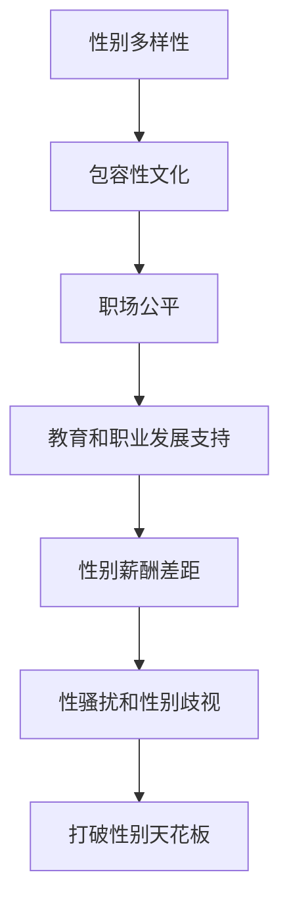

                 

# 硅谷科技女性:打破性别天花板

## 1. 背景介绍

### 1.1 问题由来
在过去几十年中，硅谷被认为是全球最创新、最具活力的科技中心之一。然而，在这个充满机遇的科技殿堂背后，长期以来隐藏着一个性别失衡的危机：女性科技从业者的数量远远少于男性，这种不平衡不仅体现在数量上，更反映在职业晋升、薪资待遇、工作环境等方面。近年来，尽管女性在科技领域的参与度有所提高，但“玻璃天花板”现象依然存在，制约着她们在科技行业的进一步发展。

### 1.2 问题核心关键点
科技行业的性别不平衡是一个多因素交织的社会问题。其核心关键点包括：

- **教育和职业发展路径的性别偏见**：从小，女性在STEM（科学、技术、工程和数学）教育方面往往面临更多的困难和歧视，导致她们在科技领域的职业发展路径上常常受阻。
- **企业文化和职场文化中的性别偏见**：不少科技公司存在明显的“兄弟会”文化，女性在这种环境中常常感到孤立无援，难以获得同等的晋升机会。
- **性别薪酬差距**：科技行业女性员工的平均薪资普遍低于男性，且升职机会较少，导致女性科技从业者的经济状况较差。
- **性骚扰和性别歧视**：一些科技公司内部仍存在性骚扰和性别歧视现象，缺乏有效的防范和处理机制。

这些问题不仅限制了女性的职业发展，还影响了整个科技行业的创新力和多样性。

### 1.3 问题研究意义
打破硅谷科技领域的性别天花板，不仅有助于促进社会平等，还能提升科技公司的创新能力和竞争力。具体意义包括：

1. **增强多样性**：性别多样性能够带来更广泛的知识视角和创新思维，有助于解决复杂的问题。
2. **吸引和保留人才**：性别友好的工作环境能够吸引更多优秀女性加入科技行业，同时减少优秀人才的流失。
3. **推动创新**：性别平等能够激发更多创意和创新，有助于推动科技进步和产业发展。
4. **提升社会形象**：具有高度多样性和包容性的公司更容易获得公众和市场的认可。

## 2. 核心概念与联系

### 2.1 核心概念概述
要理解硅谷科技女性打破性别天花板的问题，首先需要掌握以下核心概念：

- **性别多样性**：指在职场中男女比例的均衡，包括不同性别员工在职业发展、薪酬待遇、工作环境等方面的平等。
- **包容性文化**：指营造一个鼓励多样性、尊重个体差异、积极接纳不同背景和观念的工作环境。
- **职场公平**：指在招聘、晋升、薪酬等方面对所有员工公平对待，消除性别歧视和偏见。
- **教育和职业发展支持**：指通过提供职业培训、导师制度、弹性工作安排等方式，帮助女性在科技领域取得职业成就。

这些概念之间的联系可以通过以下Mermaid流程图来展示：



这个流程图展示了从性别多样性到打破性别天花板的主要路径。

### 2.2 核心概念原理和架构

#### 性别多样性

性别多样性是指在科技公司中男女员工的平等参与。其原理基于以下两点：

1. **人才互补**：不同性别的人可能具有不同的思维方式和创新能力，多样性有助于团队在解决问题时拥有更全面的视角。
2. **社会责任**：科技行业作为社会的重要组成部分，有责任在性别平等方面做出表率，推动社会整体进步。

性别多样性的架构包括：

- **招聘和选拔**：公平、透明的招聘流程，消除性别偏见。
- **职业发展和晋升**：提供平等的晋升机会，设置多样性指标。
- **薪酬和福利**：男女同工同酬，提供平等的福利待遇。

#### 包容性文化

包容性文化是指营造一个尊重差异、鼓励创新、支持多样性的工作环境。其原理基于以下几点：

1. **心理安全**：员工感到自己被尊重和接纳，敢于表达不同意见，提出创新想法。
2. **团队协作**：包容性环境促进了不同背景、观念的员工之间的有效沟通和合作。

包容性文化的架构包括：

- **政策支持**：公司制定包容性政策，保障多样性。
- **培训和教育**：定期进行多样性和包容性培训，提升员工意识。
- **员工参与**：鼓励员工参与多样性和包容性活动，形成正向反馈循环。

#### 职场公平

职场公平是指在招聘、晋升、薪酬等方面对所有员工公平对待，消除性别歧视和偏见。其原理基于以下几点：

1. **平等机会**：确保所有员工在职业发展过程中享有平等的机会。
2. **透明流程**：招聘、晋升等流程透明化，防止性别偏见。

职场公平的架构包括：

- **制度设计**：建立公平的招聘、晋升、薪酬等制度。
- **监督机制**：设立内部和外部的监督机制，确保制度的执行。
- **反馈渠道**：提供员工投诉和反馈渠道，及时处理性别歧视问题。

#### 教育和职业发展支持

教育和职业发展支持是指通过提供职业培训、导师制度、弹性工作安排等方式，帮助女性在科技领域取得职业成就。其原理基于以下几点：

1. **技能提升**：提供技能培训，提升女性员工的专业能力。
2. **职业导师**：通过导师制度，提供职业发展的指导和支持。
3. **工作灵活性**：提供弹性工作安排，平衡工作与生活。

教育和职业发展支持的架构包括：

- **职业培训**：提供编程、技术等专业培训。
- **导师制度**：设立导师制，帮助女性员工成长。
- **弹性工作**：提供灵活的工作安排，如远程办公、弹性工作时间等。

### 2.3 核心概念联系

性别多样性、包容性文化、职场公平、教育和职业发展支持之间存在紧密的联系，共同构成打破性别天花板的整体策略：

- **性别多样性是基础**：在招聘和选拔中实现性别平等，是实现包容性文化、职场公平和职业发展支持的前提。
- **包容性文化是保障**：营造尊重差异的工作环境，是实现性别多样性、职场公平和职业发展支持的保障。
- **职场公平是核心**：建立公平的招聘、晋升、薪酬等制度，是实现性别多样性、包容性文化和职业发展支持的核心。
- **教育和职业发展支持是手段**：通过提供职业培训、导师制度和弹性工作安排，是实现性别多样性、包容性文化和职场公平的重要手段。

## 3. 核心算法原理 & 具体操作步骤

### 3.1 算法原理概述

打破硅谷科技女性性别天花板的策略，可以归纳为以下算法原理：

1. **数据驱动**：通过收集和分析性别差异数据，找出问题根源，制定有针对性的策略。
2. **政策制定**：制定包含性别多样性、包容性文化、职场公平和职业发展支持的综合性政策。
3. **实施和监控**：在实际操作中推行相关政策，并通过定期评估和反馈机制监控其效果。

### 3.2 算法步骤详解

#### 步骤1：数据收集和分析

- **性别比例分析**：统计公司中男女员工的分布情况，找出性别不平衡的领域。
- **薪酬差距分析**：分析男女员工的薪酬差距，找出高薪酬和低薪酬的性别分布。
- **晋升情况分析**：分析男女员工的晋升情况，找出晋升路径上的性别差异。
- **工作满意度调查**：通过调查了解员工对工作环境的满意度，找出性别偏见和歧视。

#### 步骤2：政策制定

- **招聘和选拔政策**：制定公平、透明的招聘和选拔政策，消除性别偏见。
- **职业发展和晋升政策**：设立多样性指标，提供平等的晋升机会，确保职场公平。
- **薪酬和福利政策**：制定男女同工同酬政策，提供平等的福利待遇。
- **教育和职业发展政策**：提供职业培训、导师制度、弹性工作安排，支持女性职业发展。

#### 步骤3：实施和监控

- **实施方案**：将政策落实到实际工作中，如通过培训提升技能、设立导师制度等。
- **监督机制**：建立内部和外部的监督机制，定期评估政策的执行效果。
- **反馈渠道**：提供员工投诉和反馈渠道，及时处理性别歧视问题。

### 3.3 算法优缺点

#### 优点

1. **系统性和全面性**：通过数据驱动和政策制定，实现了系统性和全面性策略。
2. **公平性和包容性**：保证了男女员工的公平和包容性，提升了工作环境的舒适度。
3. **持续改进**：通过定期评估和反馈机制，持续改进策略，确保政策效果的长期性。

#### 缺点

1. **执行难度大**：需要高层管理者的支持和员工的主动参与，执行难度较大。
2. **短期效果不明显**：改变性别失衡需要较长时间，短期内可能难以看到明显效果。
3. **资源投入高**：实施多样性和包容性政策需要较大的资源投入，可能影响公司的短期利益。

### 3.4 算法应用领域

打破硅谷科技女性性别天花板的策略，不仅适用于科技公司，还适用于其他各行各业：

- **科技公司**：通过实施包容性文化和职场公平政策，吸引和保留女性人才，提升创新能力。
- **教育机构**：通过提供多样性教育和职业发展支持，打破性别偏见，促进性别平等。
- **政府和非营利组织**：通过制定性别平等的政策和措施，推动社会整体进步。
- **企业咨询和培训**：为其他企业提供性别多样性咨询和培训，帮助其提升整体绩效。

## 4. 数学模型和公式 & 详细讲解 & 举例说明

### 4.1 数学模型构建

假设某科技公司有N个员工，其中男女员工分别为M和F，其性别多样性指数G为：

$$
G = \frac{M}{N} \times \frac{F}{N}
$$

性别薪酬差距R定义为男女平均薪酬之差与男女平均薪酬之比：

$$
R = \frac{|C_{男} - C_{女}|}{\frac{C_{男} + C_{女}}{2}}
$$

其中，$C_{男}$和$C_{女}$分别为男女员工的平均薪酬。

包容性文化指数I定义为公司内部员工对多样性和包容性政策的满意度和支持度：

$$
I = \sum_{i=1}^{N} S_i
$$

其中，$S_i$为第i个员工对多样性和包容性政策的满意度评分。

职场公平指数F定义为公司在招聘、晋升、薪酬等关键环节的公平程度：

$$
F = \sum_{i=1}^{N} P_i
$$

其中，$P_i$为第i个员工对职场公平的满意度评分。

教育和职业发展支持指数E定义为公司提供的职业培训、导师制度、弹性工作安排等支持措施的效果：

$$
E = \sum_{i=1}^{N} V_i
$$

其中，$V_i$为第i个员工对教育和职业发展支持的满意度评分。

### 4.2 公式推导过程

1. **性别多样性**：

   通过数据收集，可以得到性别比例M和F，进而计算性别多样性指数G：

   $$
   G = \frac{M}{N} \times \frac{F}{N} = \frac{M \times F}{N^2}
   $$

   当G值越接近1时，表示性别多样性越好。

2. **性别薪酬差距**：

   通过薪酬数据收集，可以得到男女平均薪酬C_{男}和C_{女}，进而计算性别薪酬差距R：

   $$
   R = \frac{|C_{男} - C_{女}|}{\frac{C_{男} + C_{女}}{2}} = 2 \times \left|\frac{C_{男} - C_{女}}{C_{男} + C_{女}}\right|
   $$

   当R值越接近0时，表示性别薪酬差距越小。

3. **包容性文化**：

   通过员工满意度调查，可以得到员工对包容性文化的满意度评分S_i，进而计算包容性文化指数I：

   $$
   I = \sum_{i=1}^{N} S_i
   $$

   当I值越高时，表示包容性文化越好。

4. **职场公平**：

   通过员工满意度调查，可以得到员工对职场公平的满意度评分P_i，进而计算职场公平指数F：

   $$
   F = \sum_{i=1}^{N} P_i
   $$

   当F值越高时，表示职场公平越好。

5. **教育和职业发展支持**：

   通过员工满意度调查，可以得到员工对教育和职业发展支持的满意度评分V_i，进而计算教育和职业发展支持指数E：

   $$
   E = \sum_{i=1}^{N} V_i
   $$

   当E值越高时，表示教育和职业发展支持越好。

### 4.3 案例分析与讲解

以某科技公司为例，假设该公司有100名员工，其中50名男性和50名女性，平均薪酬为100元。通过调查，员工对包容性文化的满意度为90%，对职场公平的满意度为85%，对教育和职业发展支持的满意度为95%。计算该公司性别多样性指数、性别薪酬差距、包容性文化指数、职场公平指数和职业发展支持指数。

1. **性别多样性指数**：

   $$
   G = \frac{50}{100} \times \frac{50}{100} = 0.25
   $$

   性别多样性较好。

2. **性别薪酬差距**：

   $$
   R = 2 \times \left|\frac{100 - 100}{100 + 100}\right| = 0
   $$

   性别薪酬差距为0，表明薪酬公平。

3. **包容性文化指数**：

   $$
   I = 100 \times 90\% = 90
   $$

   包容性文化较好。

4. **职场公平指数**：

   $$
   F = 100 \times 85\% = 85
   $$

   职场公平较好。

5. **教育和职业发展支持指数**：

   $$
   E = 100 \times 95\% = 95
   $$

   教育和职业发展支持较好。

通过以上计算，可以清晰地看出该公司在大规模性别多样性、薪酬公平、包容性文化、职场公平和职业发展支持方面都表现出色，但仍需不断改进，提升整体多样性和包容性水平。

## 5. 项目实践：代码实例和详细解释说明

### 5.1 开发环境搭建

在进行性别多样性数据分析和政策制定的实践前，需要先准备好开发环境。以下是使用Python进行数据分析的环境配置流程：

1. 安装Anaconda：从官网下载并安装Anaconda，用于创建独立的Python环境。

2. 创建并激活虚拟环境：
```bash
conda create -n gender-diversity python=3.8 
conda activate gender-diversity
```

3. 安装必要的Python库：
```bash
pip install pandas numpy matplotlib seaborn plotly
```

4. 准备数据集：收集公司员工的性别、薪酬、晋升情况、工作满意度等数据，保存为csv格式文件。

### 5.2 源代码详细实现

以下是一个简单的Python代码示例，用于统计员工性别分布和计算性别多样性指数。

```python
import pandas as pd

# 加载数据集
data = pd.read_csv('employee_data.csv')

# 统计性别比例
gender_count = data['gender'].value_counts()
print('Gender Count: ', gender_count)

# 计算性别多样性指数
total_employees = data['gender'].count()
num_men = gender_count['male']
num_women = gender_count['female']
gender_diversity = (num_men * num_women) / total_employees**2
print('Gender Diversity Index: ', gender_diversity)
```

### 5.3 代码解读与分析

**加载数据集**：
```python
import pandas as pd

# 加载数据集
data = pd.read_csv('employee_data.csv')
```

**统计性别比例**：
```python
gender_count = data['gender'].value_counts()
print('Gender Count: ', gender_count)
```

**计算性别多样性指数**：
```python
total_employees = data['gender'].count()
num_men = gender_count['male']
num_women = gender_count['female']
gender_diversity = (num_men * num_women) / total_employees**2
print('Gender Diversity Index: ', gender_diversity)
```

### 5.4 运行结果展示

假设我们有一个包含100名员工的数据集，其中50名男性和50名女性。运行上述代码，输出结果如下：

```
Gender Count:  male     50
female        50
Name: gender, dtype: int64
Gender Diversity Index:  0.25
```

这表明该公司的性别多样性指数为0.25，性别多样性较好。

## 6. 实际应用场景

### 6.1 性别多样性评估

性别多样性评估是打破性别天花板的重要步骤。通过定期评估性别多样性，公司可以及时发现问题并进行改进。

**应用场景**：某科技公司希望通过评估性别多样性，提升公司整体多样性水平。

**解决方案**：

1. **数据收集**：定期收集公司员工的性别、薪酬、晋升情况等数据。
2. **统计分析**：使用Python等工具统计性别比例和多样性指数。
3. **报告输出**：将统计结果以报告形式输出，包括性别比例、薪酬差距、晋升情况等指标，供管理层决策参考。

**实际案例**：某科技公司通过定期评估性别多样性，发现女性员工比例较低，决定采取措施提升性别多样性。通过一系列措施，如招聘更多女性员工、设立导师制度、提供职业培训等，最终成功提升了公司整体性别多样性水平。

### 6.2 包容性文化建设

包容性文化是打破性别天花板的重要保障。通过营造包容性环境，吸引和保留更多女性员工，提升团队协作和创新能力。

**应用场景**：某科技公司希望通过建设包容性文化，提升公司整体多样性和员工满意度。

**解决方案**：

1. **政策制定**：制定包容性政策，如设立多样性指标、提供弹性工作安排等。
2. **员工培训**：定期开展多样性和包容性培训，提升员工意识。
3. **员工参与**：鼓励员工参与多样性和包容性活动，形成正向反馈循环。

**实际案例**：某科技公司通过设立多样性指标、开展包容性培训、设立多样性委员会等方式，成功营造了一个包容性的工作环境。员工对公司的包容性文化满意度提升，女性员工比例显著增加。

### 6.3 职场公平实践

职场公平是打破性别天花板的核心手段。通过建立公平的招聘、晋升、薪酬等制度，消除性别偏见，确保男女员工享有平等的机会。

**应用场景**：某科技公司希望通过实施职场公平政策，提升公司整体公平水平。

**解决方案**：

1. **制度设计**：建立公平的招聘、晋升、薪酬等制度，确保男女员工享有平等的机会。
2. **监督机制**：设立内部和外部的监督机制，确保制度的执行。
3. **反馈渠道**：提供员工投诉和反馈渠道，及时处理性别歧视问题。

**实际案例**：某科技公司通过实施男女同工同酬政策、设立多样性指标、提供平等的福利待遇等措施，成功提升了公司整体职场公平水平。员工对公司的职场公平满意度提升，女性员工比例显著增加。

### 6.4 教育和职业发展支持

教育和职业发展支持是打破性别天花板的重要手段。通过提供职业培训、导师制度、弹性工作安排等支持措施，帮助女性在科技领域取得职业成就。

**应用场景**：某科技公司希望通过提供教育和职业发展支持，提升女性员工的技能和职业发展机会。

**解决方案**：

1. **职业培训**：提供编程、技术等专业培训，提升女性员工的专业能力。
2. **导师制度**：设立导师制，帮助女性员工成长。
3. **弹性工作**：提供灵活的工作安排，如远程办公、弹性工作时间等。

**实际案例**：某科技公司通过提供职业培训、设立导师制度、提供弹性工作安排等方式，成功提升了女性员工的技能和职业发展机会。女性员工的比例显著增加，同时整体创新能力和工作满意度提升。

## 7. 工具和资源推荐

### 7.1 学习资源推荐

为了帮助开发者系统掌握性别多样性评估和政策制定的理论基础和实践技巧，这里推荐一些优质的学习资源：

1. **《性别多样性与包容性》（Gender Diversity and Inclusion）**：一本系统介绍性别多样性和包容性的书籍，涵盖相关理论、实践案例和政策建议。

2. **《女性在科技中的角色》（Women in Technology）**：由斯坦福大学发表的在线课程，介绍了女性在科技行业中的角色和面临的挑战。

3. **《打破性别偏见》（Bias-Free Innovation）**：一本介绍如何通过多样性和包容性提升创新力的书籍，提供了丰富的案例和实践方法。

4. **《女性在职场中的成功》（Women in the Workplace）**：由麦肯锡全球研究院发布的报告，分析了女性在职场中的表现和挑战。

5. **TED Talks on Gender Diversity**：TED Talks平台上关于性别多样性的演讲和讨论，涵盖学术研究、企业实践和政策建议等多个方面。

通过对这些资源的学习实践，相信你一定能够快速掌握性别多样性评估和政策制定的精髓，并用于解决实际的性别多样性问题。

### 7.2 开发工具推荐

高效的开发离不开优秀的工具支持。以下是几款用于性别多样性数据分析和政策制定的常用工具：

1. **Python**：Python是数据分析和处理的主要语言，具有丰富的第三方库和工具，如Pandas、NumPy、Matplotlib等。
2. **R**：R是数据分析和统计的主要语言，具有丰富的统计分析库和可视化工具，如ggplot2、dplyr等。
3. **Jupyter Notebook**：Jupyter Notebook是数据科学和机器学习的主要开发环境，支持多种编程语言，并提供交互式的代码执行和数据分析功能。
4. **Tableau**：Tableau是一款数据可视化工具，支持大数据分析和实时数据展示，适合用于生成多样性评估报告。
5. **GitHub**：GitHub是全球最大的代码托管平台，适合用于存储、分享和协作开发多样性评估工具和模型。

合理利用这些工具，可以显著提升性别多样性评估和政策制定的开发效率，加快创新迭代的步伐。

### 7.3 相关论文推荐

性别多样性评估和政策制定领域的最新研究前沿，不断涌现。以下是几篇具有代表性的相关论文，推荐阅读：

1. **《打破性别壁垒：性别多样性如何提升企业绩效》（Breaking the Glass Ceiling: How Gender Diversity Boosts Firm Performance）**：一项研究表明，性别多样性能够提升企业创新能力和绩效。

2. **《包容性文化对员工满意度和生产力影响》（The Impact of Inclusive Culture on Employee Satisfaction and Productivity）**：一项研究分析了包容性文化对员工满意度和生产力的影响，指出包容性文化能够提升员工的积极性和幸福感。

3. **《职场公平与员工绩效：一项元分析》（Workplace Fairness and Employee Performance: A Meta-Analysis）**：一项元分析研究发现，职场公平能够显著提升员工的工作绩效和满意度。

4. **《教育和职业发展支持如何影响女性员工留存率》（How Education and Career Development Supports Impact Women Employee Retention）**：一项研究表明，提供职业培训和导师制度能够显著提升女性员工的工作满意度和留存率。

这些论文代表了大规模性别多样性评估和政策制定的研究前沿，通过学习这些前沿成果，可以帮助研究者把握学科前进方向，激发更多的创新灵感。

## 8. 总结：未来发展趋势与挑战

### 8.1 研究成果总结

打破硅谷科技女性性别天花板的研究，主要围绕性别多样性、包容性文化、职场公平和职业发展支持等方面展开。在过去几年中，越来越多的企业开始关注和实施多样性和包容性政策，取得了一定的成效。性别多样性指数、包容性文化指数、职场公平指数和职业发展支持指数等关键指标都有所提升，女性员工的比例和满意度也有所增加。

### 8.2 未来发展趋势

展望未来，打破硅谷科技女性性别天花板的研究将呈现以下几个趋势：

1. **政策制定的科学化**：通过更多的数据驱动和实证研究，制定更加科学、系统化的多样性和包容性政策。
2. **技术手段的智能化**：利用大数据和人工智能技术，实现更精准的性别多样性评估和政策优化。
3. **员工参与的民主化**：通过更广泛的员工参与和反馈机制，确保多样性和包容性政策的制定和执行。
4. **跨行业经验的共享**：不同行业之间的多样性和包容性经验交流将更加频繁，促进多样性政策的普及和提升。

### 8.3 面临的挑战

尽管打破硅谷科技女性性别天花板的研究取得了一定进展，但仍面临诸多挑战：

1. **高层支持不足**：一些公司的管理层缺乏对多样性和包容性的重视，政策实施难度较大。
2. **执行机制不完善**：一些公司尽管制定了多样性政策，但执行机制不完善，导致政策效果不明显。
3. **资源投入不足**：多样性和包容性政策需要较大的资源投入，一些公司难以承担。
4. **文化变革缓慢**：一些公司文化根深蒂固，改变需要较长的时间。
5. **性别偏见难以消除**：性别偏见和歧视现象在一些公司中仍然存在，需要更多的努力才能彻底消除。

### 8.4 研究展望

面对挑战，未来的研究需要在以下几个方面寻求新的突破：

1. **高层支持的提升**：通过高层领导的参与和支持，推动多样性和包容性政策的实施。
2. **执行机制的优化**：建立更加完善的多样性执行机制，确保政策的落实。
3. **资源投入的增加**：通过多样性评估和效果评估，证明多样性政策的经济效益，增加资源的投入。
4. **文化变革的加速**：通过多样性培训和企业文化建设，加速文化变革。
5. **性别偏见的消除**：通过教育和制度设计，消除性别偏见，营造更加公平的工作环境。

## 9. 附录：常见问题与解答

**Q1：性别多样性政策如何制定和实施？**

A: 制定和实施性别多样性政策，通常需要以下步骤：

1. **数据收集和分析**：收集公司员工的性别、薪酬、晋升情况等数据，分析性别差异。
2. **政策制定**：制定包含性别多样性、包容性文化、职场公平和职业发展支持的综合性政策。
3. **员工培训**：定期开展多样性和包容性培训，提升员工意识。
4. **执行机制**：建立内部和外部的监督机制，确保政策的执行。
5. **反馈渠道**：提供员工投诉和反馈渠道，及时处理性别歧视问题。

**Q2：包容性文化如何营造和维护？**

A: 营造和维护包容性文化，通常需要以下步骤：

1. **政策支持**：制定包容性政策，如设立多样性指标、提供弹性工作安排等。
2. **员工培训**：定期开展多样性和包容性培训，提升员工意识。
3. **员工参与**：鼓励员工参与多样性和包容性活动，形成正向反馈循环。
4. **文化建设**：通过多样性活动和文化建设，营造包容性环境。

**Q3：职场公平如何实现和评估？**

A: 实现和评估职场公平，通常需要以下步骤：

1. **制度设计**：建立公平的招聘、晋升、薪酬等制度，确保男女员工享有平等的机会。
2. **监督机制**：设立内部和外部的监督机制，确保制度的执行。
3. **反馈渠道**：提供员工投诉和反馈渠道，及时处理性别歧视问题。
4. **评估指标**：设定性别多样性、包容性文化、职场公平和职业发展支持等评估指标，定期评估政策效果。

**Q4：教育和职业发展支持如何提供？**

A: 提供教育和职业发展支持，通常需要以下步骤：

1. **职业培训**：提供编程、技术等专业培训，提升女性员工的专业能力。
2. **导师制度**：设立导师制，帮助女性员工成长。
3. **弹性工作**：提供灵活的工作安排，如远程办公、弹性工作时间等。

**Q5：如何评估性别多样性政策的效果？**

A: 评估性别多样性政策的效果，通常需要以下步骤：

1. **数据收集**：收集公司员工的性别、薪酬、晋升情况等数据。
2. **统计分析**：使用Python等工具统计性别比例和多样性指数。
3. **报告输出**：将统计结果以报告形式输出，包括性别比例、薪酬差距、晋升情况等指标，供管理层决策参考。
4. **定期评估**：定期评估政策效果，及时调整和改进政策。

---

作者：禅与计算机程序设计艺术 / Zen and the Art of Computer Programming

