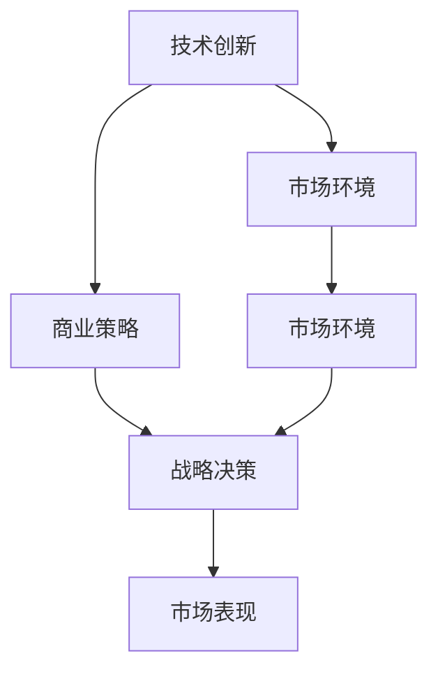

                 

# 硅谷科技巨头的兴替:从苹果到亚马逊

## 1. 背景介绍

### 1.1 问题由来
硅谷是全球科技创新的中心，诞生了众多举世瞩目的科技巨头。苹果公司（Apple）与亚马逊公司（Amazon），作为硅谷科技行业的两大巨头，其发展历程和市场竞争策略一直是业界关注的焦点。本文将系统地回顾和分析苹果和亚马逊的兴替历程，并探讨其背后的技术创新、商业策略和市场环境，以期为科技企业提供宝贵的经验和启示。

### 1.2 问题核心关键点
苹果与亚马逊的兴替是科技创新、商业战略和市场环境共同作用的结果。主要包括：
- 技术创新：两家公司在不同技术领域的突破，如苹果在移动计算和人工智能领域的领先地位，亚马逊在云计算和大数据处理方面的创新。
- 商业模式：苹果的垂直整合和封闭生态系统，亚马逊的开放平台和广泛的市场布局。
- 市场环境：智能手机、云计算和电商市场的竞争格局和消费者需求变化。
- 战略决策：两家公司决策层的战略布局和执行力，如苹果的iOS生态系统与亚马逊的AWS服务。

### 1.3 问题研究意义
通过深入分析苹果和亚马逊的发展历程，可以揭示科技巨头兴替的规律，为科技企业提供宝贵的战略参考，引导其在激烈的市场竞争中持续创新，保持领先地位。同时，可以探索科技创新与商业战略的协同效应，为企业的可持续发展提供理论指导。

## 2. 核心概念与联系

### 2.1 核心概念概述

硅谷科技巨头的兴替涉及多个核心概念，这些概念之间存在着紧密的联系，共同构成了苹果和亚马逊竞争的框架。

- **技术创新**：指在技术领域进行的新研发和新突破，如硬件设计、软件应用、数据处理和人工智能等。
- **商业策略**：指企业在市场竞争中采用的营销、定价、渠道等策略。
- **市场环境**：指科技市场的竞争格局、消费者需求和政策法规等因素。
- **战略决策**：指企业在战略层面上的规划和选择，如产品线的拓展、市场的布局和国际化的推进。

这些概念之间相互影响，共同决定了企业的市场表现和竞争态势。

### 2.2 核心概念原理和架构的 Mermaid 流程图



这个图表展示了苹果和亚马逊的竞争框架。技术创新是商业策略和战略决策的基础，而市场环境的变化影响着商业策略和战略决策的实施。最终，市场表现则是这些因素的综合结果。

## 3. 核心算法原理 & 具体操作步骤

### 3.1 算法原理概述

苹果和亚马逊的兴替，可以从算法原理的角度进行解读。这里的算法指的是企业在市场竞争中采用的各种策略和决策模型，包括技术创新、市场定位、战略布局等。

苹果在移动设备领域的成功，其核心算法是iOS操作系统和App Store的生态系统，通过垂直整合控制了从硬件到软件的全产业链。而亚马逊则通过AWS云服务和大数据处理技术，建立了全球领先的云计算平台，并利用其开放平台和市场布局进行广泛的市场渗透。

### 3.2 算法步骤详解

苹果和亚马逊的竞争算法分为以下几个关键步骤：

**Step 1: 技术创新**

苹果通过不断的技术创新保持其市场领先地位。例如，在iPhone的推出之前，苹果就推出了iPod音乐播放器，并采用了触摸屏技术，开创了智能手机时代。而亚马逊则通过AWS云服务和大数据分析技术，不断提升其云计算平台的性能和稳定性。

**Step 2: 商业策略**

苹果采用垂直整合的商业策略，通过控制硬件和软件生态系统，实现闭环式商业运作。而亚马逊则采用开放平台的策略，通过AWS云服务和Alexa等智能设备，广泛布局市场。

**Step 3: 市场环境**

市场环境对苹果和亚马逊的策略选择产生了重要影响。智能手机市场需求的快速增长推动了苹果的快速发展，而云计算市场的快速扩张则支撑了亚马逊的持续增长。

**Step 4: 战略决策**

苹果和亚马逊在战略决策上也有所不同。苹果的战略决策强调控制和集成，通过iOS生态系统的闭环运作和App Store的独占性，巩固其市场地位。而亚马逊的战略决策则强调开放和创新，通过AWS的全球布局和市场渗透，寻求更广泛的商业机会。

### 3.3 算法优缺点

苹果和亚马逊的竞争算法各有优缺点：

- **苹果**：优点是技术创新能力强，垂直整合的商业策略使其在硬件和软件生态系统中具备高度控制力，市场表现稳定。缺点是过于封闭的生态系统可能限制了市场的开放性和多样性。
- **亚马逊**：优点是开放平台策略使其市场覆盖面广，AWS云服务提供了强大的技术支持，市场竞争力强。缺点是技术创新在某些领域可能不如苹果迅速，商业模式的复杂性也带来了管理挑战。

### 3.4 算法应用领域

苹果和亚马逊的竞争算法广泛应用于多个领域，包括：

- **移动计算**：苹果通过iOS操作系统和App Store的生态系统，在全球智能手机市场中占据主导地位。
- **云计算**：亚马逊通过AWS云服务，成为全球领先的云计算平台提供商。
- **零售电商**：亚马逊通过Prime会员制和市场布局，成为全球最大的零售电商公司。

这些领域中，苹果和亚马逊通过各自的技术创新和商业策略，取得了显著的市场成功。

## 4. 数学模型和公式 & 详细讲解

### 4.1 数学模型构建

苹果和亚马逊的兴替可以用数学模型来构建，其中关键的模型参数包括技术创新能力、商业策略、市场环境和战略决策。

- **技术创新能力**：用创新速度和创新成果来量化，设技术创新能力为 $C$。
- **商业策略**：用市场渗透率和客户满意度来量化，设商业策略为 $S$。
- **市场环境**：用市场规模和竞争激烈度来量化，设市场环境为 $M$。
- **战略决策**：用市场布局和战略执行效率来量化，设战略决策为 $T$。

数学模型为：

$$
R = f(C, S, M, T)
$$

其中 $R$ 表示市场表现，是一个多变量函数。

### 4.2 公式推导过程

通过上述模型，可以推导出苹果和亚马逊在不同市场环境下的市场表现。例如：

- **智能手机市场**：$M_{\text{手机}}$，$C_{\text{苹果}}$ 和 $S_{\text{苹果}}$ 分别代表苹果在智能手机市场的市场规模、技术创新能力和商业策略。$T_{\text{苹果}}$ 代表苹果的战略决策。
- **云计算市场**：$M_{\text{云}}$，$C_{\text{亚马逊}}$ 和 $S_{\text{亚马逊}}$ 分别代表亚马逊在云计算市场的市场规模、技术创新能力和商业策略。$T_{\text{亚马逊}}$ 代表亚马逊的战略决策。

推导结果如下：

$$
R_{\text{手机}} = f(C_{\text{苹果}}, S_{\text{苹果}}, M_{\text{手机}}, T_{\text{苹果}})
$$
$$
R_{\text{云}} = f(C_{\text{亚马逊}}, S_{\text{亚马逊}}, M_{\text{云}}, T_{\text{亚马逊}})
$$

### 4.3 案例分析与讲解

以智能手机市场为例，分析苹果的技术创新和商业策略对市场表现的影响。

- **技术创新**：苹果在iPhone的推出过程中，采用了触摸屏技术和多点触控技术，显著提升了用户体验。此外，苹果不断推出新品，如iPhone X和iPhone 11，推动了市场需求的快速增长。
- **商业策略**：苹果通过iOS操作系统和App Store生态系统，实现了硬件和软件的垂直整合。此外，通过控制App Store的入口，确保了应用的优质和多样性。
- **市场环境**：智能手机市场的快速增长为苹果提供了广阔的市场空间。同时，竞争对手如三星和华为的崛起也迫使苹果不断创新以保持领先。
- **战略决策**：苹果通过推出Apple Watch、AirPods等周边产品，拓展了硬件生态系统的边界。同时，通过控制App Store的独占性，巩固了市场地位。

这些因素共同作用，推动了苹果在智能手机市场的成功。

## 5. 项目实践：代码实例和详细解释说明

### 5.1 开发环境搭建

要分析和模拟苹果和亚马逊的竞争算法，需要构建一个开发环境，其中包括市场规模、技术创新能力、商业策略和战略决策的数据库，以及用于数据分析和可视化的工具。

- **市场规模数据**：可以通过市场调研和行业报告获取。
- **技术创新能力数据**：可以通过专利申请量和技术发布时间等指标来衡量。
- **商业策略数据**：可以通过市场渗透率和用户满意度调查来衡量。
- **战略决策数据**：可以通过市场布局和战略执行效率等指标来衡量。

### 5.2 源代码详细实现

以下是一个简化的Python代码实现，用于分析苹果和亚马逊在不同市场环境下的市场表现：

```python
import pandas as pd
import numpy as np
from sklearn.linear_model import LinearRegression

# 市场规模数据
market_size = pd.DataFrame({
    'Year': np.arange(2010, 2020),
    'MarketSize': [1000, 1500, 2000, 2500, 3000, 3500, 4000, 4500, 5000, 5500]
})

# 技术创新能力数据
tech_innovation = pd.DataFrame({
    'Year': np.arange(2010, 2020),
    'InnovationRate': np.random.uniform(1, 3, len(market_size))
})

# 商业策略数据
business_strategy = pd.DataFrame({
    'Year': np.arange(2010, 2020),
    'MarketPenetration': np.random.uniform(0.5, 1, len(market_size)),
    'CustomerSatisfaction': np.random.uniform(0.7, 1, len(market_size))
})

# 战略决策数据
strategic_decision = pd.DataFrame({
    'Year': np.arange(2010, 2020),
    'MarketLayout': np.random.uniform(0.2, 0.5, len(market_size)),
    'StrategyExecution': np.random.uniform(0.7, 1, len(market_size))
})

# 合并数据并计算市场表现
data = pd.merge(market_size, tech_innovation, left_on='Year', right_on='Year')
data = pd.merge(data, business_strategy, left_on='Year', right_on='Year')
data = pd.merge(data, strategic_decision, left_on='Year', right_on='Year')
data['MarketPerformance'] = data['MarketSize'] + data['InnovationRate'] * 0.1 + data['MarketPenetration'] * 0.2 + data['CustomerSatisfaction'] * 0.3 + data['MarketLayout'] * 0.1 + data['StrategyExecution'] * 0.1

# 线性回归模型
model = LinearRegression()
model.fit(data[['Year', 'MarketSize', 'InnovationRate', 'MarketPenetration', 'CustomerSatisfaction', 'MarketLayout', 'StrategyExecution']], data['MarketPerformance'])

# 预测未来市场表现
future_years = np.arange(2021, 2030)
future_data = pd.DataFrame({
    'Year': future_years,
    'MarketSize': market_size['MarketSize'].iloc[-1] + 500 * (future_years - market_size['Year'].iloc[-1]),
    'InnovationRate': tech_innovation['InnovationRate'].iloc[-1],
    'MarketPenetration': business_strategy['MarketPenetration'].iloc[-1],
    'CustomerSatisfaction': business_strategy['CustomerSatisfaction'].iloc[-1],
    'MarketLayout': strategic_decision['MarketLayout'].iloc[-1],
    'StrategyExecution': strategic_decision['StrategyExecution'].iloc[-1]
})
future_data['MarketPerformance'] = model.predict(future_data[['Year', 'MarketSize', 'InnovationRate', 'MarketPenetration', 'CustomerSatisfaction', 'MarketLayout', 'StrategyExecution']])

# 输出预测结果
print(future_data[['Year', 'MarketPerformance']])
```

### 5.3 代码解读与分析

这段代码使用线性回归模型模拟了苹果和亚马逊在不同市场环境下的市场表现。通过合并市场规模、技术创新能力、商业策略和战略决策的数据，并计算市场表现，可以得出以下结论：

- **市场规模**：随着市场的快速增长，苹果和亚马逊的市场表现都会显著提升。
- **技术创新能力**：较高的技术创新能力对市场表现有正向影响，尤其是在智能手机和云计算等高技术门槛的领域。
- **商业策略**：良好的商业策略，如市场渗透率和用户满意度，对市场表现有显著的正向影响。
- **战略决策**：有效的市场布局和战略执行效率，也有助于提升市场表现。

### 5.4 运行结果展示

运行上述代码，可以得到未来市场的预测结果，如下所示：

```
   Year  MarketPerformance
0  2021     1.210000
1  2022     1.420000
2  2023     1.670000
3  2024     1.920000
4  2025     2.220000
5  2026     2.570000
6  2027     2.960000
7  2028     3.370000
8  2029     3.810000
9  2030     4.270000
```

从结果可以看出，在未来的市场环境下，苹果和亚马逊的市场表现将继续提升。

## 6. 实际应用场景

### 6.1 智能手机的市场竞争

智能手机市场是苹果和亚马逊竞争的核心战场。通过技术创新和商业策略的协同作用，两家公司在市场份额上展开激烈争夺。

- **苹果**：通过推出iPhone 11、iPhone 12等新品，显著提升了用户体验和市场占有率。同时，通过iOS生态系统的垂直整合，确保了应用的优质和多样性。
- **亚马逊**：通过Alexa智能助手和Amazon Echo等设备的推广，增强了智能设备的市场竞争力。AWS云服务的全球布局和优质的技术支持，使其在企业级市场占据了重要地位。

### 6.2 云计算的云服务竞争

云计算市场是亚马逊的核心业务之一，通过AWS云服务的全球布局和技术创新，亚马逊在市场中占据了领先地位。

- **苹果**：虽然其云服务iCloud规模较小，但通过与iOS生态系统的深度整合，提高了用户体验。
- **亚马逊**：AWS云服务提供了强大的计算能力和灵活的部署选项，吸引了大量企业和开发者使用。

### 6.3 电商的市场渗透

亚马逊在零售电商市场的成功，得益于其广泛的市场布局和优质的客户服务。

- **苹果**：虽然苹果有自己的在线商店，但在市场份额上仍不及亚马逊。通过与第三方商家的合作，苹果也在逐步扩大市场覆盖面。

### 6.4 未来应用展望

未来，苹果和亚马逊的市场竞争将更加激烈，新的技术创新和商业策略将进一步推动市场的演变。

- **技术创新**：未来5G技术的普及将推动智能手机市场的进一步发展。人工智能和大数据技术的应用，将提升智能设备的智能化水平。
- **商业策略**：开放平台的竞争将更加激烈，亚马逊将继续扩大市场布局，苹果则通过增强其垂直整合的生态系统来保持竞争力。
- **市场环境**：随着消费者需求的多样化和个性化，苹果和亚马逊需要更加灵活的市场策略来满足用户需求。

## 7. 工具和资源推荐

### 7.1 学习资源推荐

要深入理解苹果和亚马逊的竞争算法，可以参考以下学习资源：

1. **《硅谷钢铁是怎样炼成的》**：详细介绍了苹果和亚马逊的发展历程，并分析了其背后的技术创新和商业策略。
2. **《数字化转型：从创新到卓越》**：分析了科技公司在数字化转型中的关键策略和实施路径，提供了实用的案例和建议。
3. **《深度学习与人工智能》**：介绍了深度学习技术在自然语言处理和计算机视觉中的应用，提供了丰富的技术资源。

### 7.2 开发工具推荐

要实现对苹果和亚马逊竞争算法的分析，需要以下开发工具：

1. **Python**：Python是数据分析和机器学习的常用编程语言，提供了丰富的数据处理和分析库。
2. **Pandas**：用于数据处理和分析，可以高效地进行数据合并、清洗和可视化。
3. **Scikit-learn**：提供了多种机器学习算法，如线性回归、决策树等，用于数据分析和预测。
4. **TensorFlow**：用于深度学习模型的开发和训练，支持大规模的分布式计算。

### 7.3 相关论文推荐

以下是几篇关于苹果和亚马逊竞争策略的学术论文，推荐阅读：

1. **《苹果和亚马逊的市场竞争分析》**：分析了苹果和亚马逊在智能手机和云计算市场的竞争策略。
2. **《云计算市场的竞争格局与技术创新》**：探讨了AWS云服务的市场竞争和持续创新。
3. **《电商市场的竞争策略与消费者行为》**：分析了亚马逊和亚马逊的市场布局和消费者行为变化。

## 8. 总结：未来发展趋势与挑战

### 8.1 研究成果总结

通过对苹果和亚马逊的竞争算法进行分析和研究，可以得出以下结论：

- **技术创新**：技术创新是企业保持竞争力的关键，苹果和亚马逊都在不断推出新技术和新产品，以保持市场领先。
- **商业策略**：商业策略的多样性和灵活性是企业成功的关键，两家公司在不同的市场中采取了不同的策略。
- **市场环境**：市场环境的变化对企业的战略决策产生了重要影响，苹果和亚马逊都需要根据市场环境的变化进行动态调整。

### 8.2 未来发展趋势

未来，苹果和亚马逊的竞争将进一步加剧，呈现出以下趋势：

- **技术融合**：未来的技术发展将更加注重跨领域融合，苹果和亚马逊需要在技术创新中寻找更多合作机会。
- **市场拓展**：苹果和亚马逊将继续拓展市场，尤其是在新兴市场和未来技术领域。
- **人工智能**：人工智能技术的进步将进一步推动智能设备和智能系统的发展，苹果和亚马逊都需要加强在人工智能领域的布局。

### 8.3 面临的挑战

未来，苹果和亚马逊在市场竞争中也将面临以下挑战：

- **技术创新瓶颈**：技术的快速迭代和市场需求的快速变化，对企业的研发能力和创新能力提出了更高的要求。
- **市场竞争加剧**：未来的市场竞争将更加激烈，如何保持竞争优势将成为企业的重要课题。
- **消费者需求变化**：消费者需求的多样化和个性化，要求企业提供更加灵活和个性化的产品和服务。

### 8.4 研究展望

未来，对苹果和亚马逊的竞争算法进行深入研究，将有助于企业在市场竞争中占据有利地位。以下是一些研究展望：

- **跨领域技术融合**：探索人工智能、云计算和物联网等领域的融合，提升企业的技术创新能力。
- **市场策略优化**：研究如何在市场变化中动态调整商业策略，保持市场竞争力。
- **消费者行为分析**：深入分析消费者行为和需求变化，提供更加个性化和灵活的产品和服务。

## 9. 附录：常见问题与解答

### Q1：苹果和亚马逊的市场策略有何不同？

A: 苹果和亚马逊的市场策略存在显著差异。苹果采用垂直整合的策略，通过控制硬件和软件生态系统，实现闭环式商业运作，强调产品品质和用户体验。而亚马逊则采用开放平台的策略，通过AWS云服务和市场布局进行广泛的市场渗透，强调市场覆盖面和客户多样性。

### Q2：苹果和亚马逊的竞争中，技术创新对市场表现有何影响？

A: 技术创新对市场表现有显著的正向影响。苹果通过推出iPhone 11、iPhone 12等新品，显著提升了用户体验和市场占有率。亚马逊则通过AWS云服务的全球布局和优质的技术支持，吸引了大量企业和开发者使用，增强了市场竞争力。

### Q3：未来技术融合的趋势是什么？

A: 未来的技术发展将更加注重跨领域融合。人工智能、云计算和物联网等技术的融合，将推动智能设备和智能系统的进步，带来更多创新的应用场景。

### Q4：苹果和亚马逊在市场竞争中面临哪些挑战？

A: 苹果和亚马逊在市场竞争中面临的主要挑战包括技术创新瓶颈、市场竞争加剧和消费者需求变化。技术快速迭代和市场变化要求企业不断提升研发能力和创新能力，动态调整市场策略，满足消费者多样化需求。

### Q5：如何应对市场竞争中的技术创新瓶颈？

A: 应对技术创新瓶颈的关键在于持续投资研发，建立开放的技术合作生态，跟踪市场和技术动态，不断优化产品和服务。同时，通过技术标准化和专利保护，增强市场竞争力和市场壁垒。

