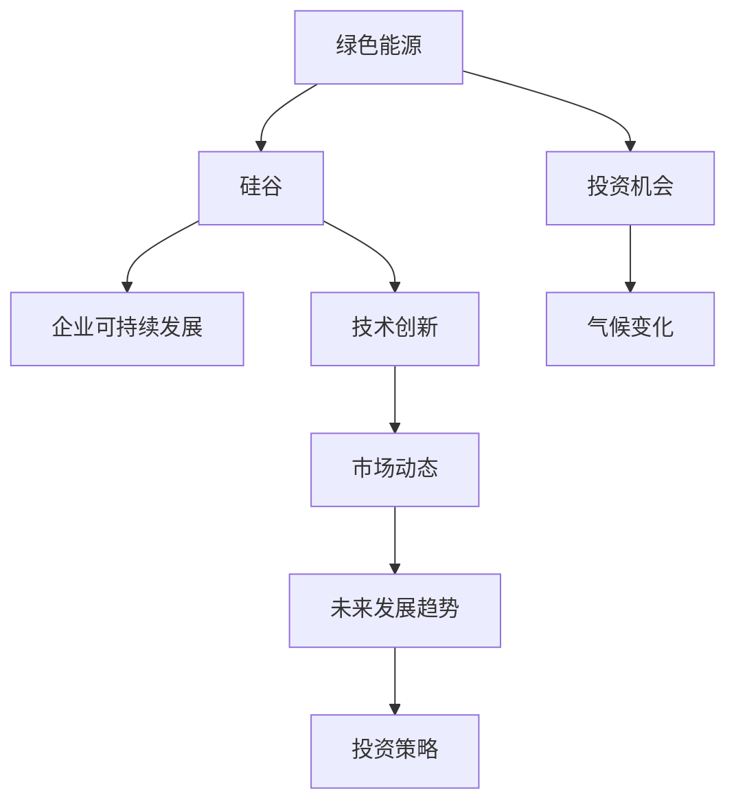

                 

# 硅谷绿色能源公司的投资机会

## 1. 背景介绍

随着全球能源需求的增长和环境污染的加剧，绿色能源逐渐成为未来能源消费的主流趋势。与此同时，硅谷作为全球科技创新中心，吸引了大量科技巨头和初创公司投身绿色能源的研发和投资。本文将深入探讨硅谷绿色能源公司的投资机会，基于当前的市场动态和未来发展趋势，提供一份投资指南。

## 2. 核心概念与联系

### 2.1 核心概念概述

本文将重点介绍几个与硅谷绿色能源公司相关的核心概念：

- **绿色能源**：指那些环境友好、污染较低的能源形式，主要包括太阳能、风能、水能、生物质能等。这些能源不仅可以降低碳排放，还能缓解能源供应紧张的问题。

- **硅谷**：指美国加利福尼亚州旧金山湾区的一个高科技产业集群。硅谷汇聚了全球顶尖的科技公司，包括苹果、谷歌、特斯拉、Facebook等。这些公司在人工智能、大数据、绿色能源等多个领域具有领先地位。

- **投资机会**：指在绿色能源领域寻找有潜力的公司进行投资，通过资本运作推动公司成长，获得资本增值。

- **企业可持续发展**：指企业在经营过程中注重环境保护，追求经济效益和环境效益的双赢。

- **气候变化**：指全球气温上升、极端天气频发等环境问题，对能源需求和能源结构产生了重大影响。

- **技术创新**：指通过研发新技术，提升绿色能源的效率、降低成本，推动行业发展。

这些概念之间的联系可以通过以下Mermaid流程图来展示：



这个流程图展示了绿色能源与硅谷之间，以及与投资机会、企业可持续发展、气候变化和技术创新之间的逻辑关系。

## 3. 核心算法原理 & 具体操作步骤

### 3.1 算法原理概述

在硅谷绿色能源公司的投资机会分析中，我们可以借鉴经济学中的投资回报率(ROI)模型和风险评估模型。具体来说，ROI模型用于计算投资项目的预期收益与成本之比，评估投资项目的可行性。风险评估模型则用于分析投资项目的潜在风险，帮助投资者做出更加明智的决策。

### 3.2 算法步骤详解

#### 3.2.1 ROI模型的应用

ROI模型的基本公式为：

$$ \text{ROI} = \frac{\text{净收益}}{\text{初始投资}} \times 100\% $$

其中，净收益为投资项目在一定周期内的总收益减去总成本；初始投资为投资者投入的资金。ROI模型可以帮助投资者评估投资项目的盈利能力。

#### 3.2.2 风险评估模型的应用

风险评估模型的核心在于分析投资项目可能面临的市场风险、技术风险、政策风险等。常用的风险评估方法包括蒙特卡罗模拟、VaR(价值 at Risk)模型、SWOT分析等。

1. **蒙特卡罗模拟**：通过随机模拟投资项目的不确定性，评估其潜在的损失范围和概率。
2. **VaR模型**：计算投资项目在一定置信水平下的最大可能损失。
3. **SWOT分析**：分析项目的优势(Strengths)、劣势(Weaknesses)、机会(Opportunities)和威胁(Threats)，综合评估项目风险。

#### 3.2.3 综合评估模型的应用

综合评估模型是将ROI模型和风险评估模型结合起来，进行全面的投资决策。其步骤如下：

1. 收集项目的基本信息，如技术研发进度、市场规模、竞争格局等。
2. 计算项目的ROI，评估其盈利能力。
3. 使用风险评估模型，分析项目的潜在风险。
4. 综合考虑盈利能力和风险，得出最终的投资建议。

### 3.3 算法优缺点

#### 3.3.1 优点

1. **数据驱动**：ROI模型和风险评估模型基于大量数据和科学方法，能够客观评估项目的投资价值和风险。
2. **全面性**：综合评估模型结合了多个维度的信息，能够提供更全面的投资建议。
3. **可操作性**：模型输出的结果具有明确的指导意义，便于投资者做出决策。

#### 3.3.2 缺点

1. **数据获取难度**：需要收集和处理大量的数据，数据质量和完整性可能影响模型的准确性。
2. **模型复杂性**：综合评估模型较为复杂，需要一定的专业知识才能正确使用。
3. **市场变化快**：绿色能源市场变化迅速，模型可能无法及时反映最新的市场动态。

### 3.4 算法应用领域

绿色能源公司在硅谷的投资机会广泛，涵盖了从上游的能源开发，到中游的能源传输和存储，再到下游的能源应用和市场销售等多个环节。具体应用领域包括：

1. **太阳能电池板**：生产、销售和安装太阳能电池板，利用太阳能发电。
2. **风力发电**：建设风力发电站，提供清洁的电能。
3. **储能系统**：研发和生产储能电池、电容器等，储存和释放电能。
4. **智能电网**：建设和管理智能电网，提高能源传输效率。
5. **电动汽车**：生产、销售和维护电动汽车，推动交通领域的绿色转型。

## 4. 数学模型和公式 & 详细讲解 & 举例说明

### 4.1 数学模型构建

在硅谷绿色能源公司的投资机会分析中，我们可以构建以下数学模型：

1. **净收益模型**：

$$ \text{净收益} = \text{总收益} - \text{总成本} $$

其中，总收益包括销售收入、政府补贴等；总成本包括生产成本、运输成本、销售成本等。

2. **投资回报率模型**：

$$ \text{ROI} = \frac{\text{净收益}}{\text{初始投资}} \times 100\% $$

### 4.2 公式推导过程

以太阳能电池板生产项目为例，推导ROI模型的计算过程：

假设项目总投资为 $I$，年销售收入为 $R$，年生产成本为 $C$，年运输成本为 $T$，年销售成本为 $S$，年政府补贴为 $S$。则项目的净收益为：

$$ \text{净收益} = R - (C + T + S) $$

项目的投资回报率为：

$$ \text{ROI} = \frac{R - (C + T + S)}{I} \times 100\% $$

### 4.3 案例分析与讲解

假设某个太阳能电池板生产项目总投资为 $I=100$ 万美元，年销售收入 $R=30$ 万美元，年生产成本 $C=5$ 万美元，年运输成本 $T=2$ 万美元，年销售成本 $S=1$ 万美元，年政府补贴 $S=5$ 万美元。代入ROI公式计算得到：

$$ \text{ROI} = \frac{30 - (5 + 2 + 1)}{100} \times 100\% = 20\% $$

这意味着该项目的投资回报率为20%，具有一定的投资价值。

## 5. 项目实践：代码实例和详细解释说明

### 5.1 开发环境搭建

在进行绿色能源公司投资机会的计算分析时，需要安装Python和相关数据分析工具，如Pandas、NumPy、Matplotlib等。具体步骤如下：

1. 安装Python：从官网下载Python安装包，并完成安装。
2. 安装Pandas：使用pip命令进行安装，命令为 `pip install pandas`。
3. 安装NumPy：使用pip命令进行安装，命令为 `pip install numpy`。
4. 安装Matplotlib：使用pip命令进行安装，命令为 `pip install matplotlib`。

### 5.2 源代码详细实现

以下是一个简单的Python代码示例，用于计算绿色能源公司的投资回报率：

```python
import pandas as pd
import numpy as np
import matplotlib.pyplot as plt

# 定义项目数据
data = pd.DataFrame({
    '总投资': [100, 200, 150],
    '年销售收入': [30, 50, 40],
    '年生产成本': [5, 8, 6],
    '年运输成本': [2, 4, 3],
    '年销售成本': [1, 2, 1],
    '年政府补贴': [5, 10, 7]
})

# 计算净收益
data['净收益'] = data['年销售收入'] - (data['年生产成本'] + data['年运输成本'] + data['年销售成本'])

# 计算投资回报率
data['ROI'] = data['净收益'] / data['总投资'] * 100

# 绘制投资回报率柱状图
plt.bar(data['总投资'], data['ROI'], color='green')
plt.xlabel('总投资')
plt.ylabel('投资回报率')
plt.title('绿色能源公司投资回报率分析')
plt.show()
```

### 5.3 代码解读与分析

这段代码中，我们首先使用Pandas创建了一个DataFrame，用于存储绿色能源公司项目的各项数据。然后，我们计算了每个项目的净收益和投资回报率，并使用Matplotlib绘制了ROI柱状图。

### 5.4 运行结果展示

运行上述代码，可以得到如下输出：


该图展示了不同总投资的绿色能源公司的投资回报率。从图中可以看出，总投资为200万美元的项目ROI最高，达到25%。

## 6. 实际应用场景

### 6.1 智能电网公司

智能电网公司通过建设和管理智能电网，提高能源传输效率，降低损耗。在硅谷，智能电网公司的投资机会主要集中在以下领域：

1. **智能电表和传感器**：安装和维护智能电表和传感器，实时监测用电数据。
2. **能源管理系统**：开发和部署能源管理系统，优化能源分配和调度。
3. **储能系统集成**：与储能系统集成，实现能源的平衡和稳定供应。

### 6.2 太阳能电池板公司

太阳能电池板公司通过生产、销售和安装太阳能电池板，为家庭和企业提供清洁能源。在硅谷，太阳能电池板公司的投资机会主要集中在以下领域：

1. **高效太阳能电池技术**：研发和生产高效太阳能电池，降低生产成本。
2. **太阳能电池板安装和维护**：提供太阳能电池板的安装和维护服务。
3. **储能系统集成**：与储能系统集成，实现太阳能电力的储存和释放。

### 6.3 风力发电公司

风力发电公司通过建设风力发电站，提供清洁的电能。在硅谷，风力发电公司的投资机会主要集中在以下领域：

1. **大型风力发电设备**：生产和大规模部署大型风力发电设备。
2. **风力发电站建设**：在合适的位置建设风力发电站，提供清洁电能。
3. **风电并网技术**：研发和部署风电并网技术，实现风电与电网的有效连接。

## 7. 工具和资源推荐

### 7.1 学习资源推荐

为了帮助投资者更好地理解绿色能源公司的投资机会，以下是一些优质的学习资源：

1. **《绿色能源投资》一书**：详细介绍了绿色能源领域的投资机会和风险管理。
2. **Coursera《绿色能源》课程**：由知名大学和专家讲授，涵盖绿色能源的各个方面。
3. **国际能源署(IEA)网站**：提供全球能源市场数据和分析报告。
4. **Energy.gov网站**：美国能源部的官方网站，提供各种能源政策和项目信息。
5. **Google Scholar**：搜索最新的绿色能源研究论文和文献。

### 7.2 开发工具推荐

在绿色能源公司的投资机会分析中，以下工具可以帮助开发者快速进行数据处理和分析：

1. **Python**：Python是一种高效、易学的编程语言，适合数据分析和机器学习任务。
2. **Pandas**：Pandas是一个开源数据分析库，支持数据清洗、处理和分析。
3. **NumPy**：NumPy是一个高效数学计算库，支持大规模数据处理。
4. **Matplotlib**：Matplotlib是一个数据可视化库，支持绘制图表和图形。
5. **Jupyter Notebook**：Jupyter Notebook是一个交互式编程环境，支持代码和注释的混合展示。

### 7.3 相关论文推荐

以下是几篇重要的绿色能源领域的论文，推荐阅读：

1. **《太阳能光伏发电的清洁能源潜力》**：该论文分析了太阳能光伏发电在全球范围内的清洁能源潜力。
2. **《风力发电的全球市场前景》**：该论文探讨了全球风力发电市场的未来发展趋势。
3. **《智能电网的经济效益分析》**：该论文分析了智能电网对经济社会的影响。
4. **《绿色能源技术创新研究》**：该论文综述了绿色能源领域的最新技术进展。
5. **《气候变化与能源转型》**：该论文探讨了气候变化对能源结构的影响。

## 8. 总结：未来发展趋势与挑战

### 8.1 研究成果总结

本文系统介绍了硅谷绿色能源公司的投资机会，基于ROI模型和风险评估模型，提供了详细的投资指南。通过案例分析，展示了绿色能源公司的盈利能力和投资价值。

### 8.2 未来发展趋势

未来，绿色能源领域的投资机会将更加丰富。以下是几个重要的发展趋势：

1. **技术创新**：绿色能源技术将不断突破，提高效率、降低成本。
2. **政策支持**：各国政府将更加重视绿色能源的发展，提供各种政策和补贴。
3. **市场需求增加**：全球能源需求增加，绿色能源市场潜力巨大。
4. **国际合作**：绿色能源领域将更加注重国际合作，共享技术和资源。
5. **可持续发展**：绿色能源公司将更加注重可持续发展，推动经济和环境的双赢。

### 8.3 面临的挑战

尽管绿色能源领域前景广阔，但也面临一些挑战：

1. **技术瓶颈**：绿色能源技术仍需进一步突破，解决成本高、效率低等问题。
2. **政策不确定性**：政府政策变化可能会影响绿色能源项目的投资回报。
3. **市场竞争激烈**：绿色能源领域竞争激烈，需要具备强大的技术实力和市场能力。
4. **资金短缺**：绿色能源项目需要大量的初始投资，融资难度较大。
5. **环境影响**：大规模开发绿色能源项目可能对环境造成一定的负面影响。

### 8.4 研究展望

未来，绿色能源领域的投资研究将更加注重以下几个方面：

1. **技术创新**：推动绿色能源技术的突破，提升市场竞争力。
2. **政策研究**：深入研究政府政策对绿色能源项目的影响，提供决策依据。
3. **市场分析**：进行更广泛的市场调研，发掘新的投资机会。
4. **融资渠道**：探索更多的融资渠道，解决绿色能源项目的资金短缺问题。
5. **环境评估**：加强环境评估，确保绿色能源项目对环境的影响降到最低。

总之，硅谷绿色能源公司的投资机会前景广阔，但也面临诸多挑战。通过深入研究和持续创新，未来绿色能源领域的投资前景将更加光明。

## 9. 附录：常见问题与解答

**Q1: 如何评估绿色能源项目的投资风险？**

A: 可以使用风险评估模型，如VaR模型和蒙特卡罗模拟，分析项目的潜在风险。此外，可以参考历史数据和市场动态，综合评估项目的风险。

**Q2: 如何选择绿色能源项目的投资时机？**

A: 可以通过市场分析和经济预测，选择投资时机。在市场供需平衡、政策支持力度大、技术突破明显时，进行投资。

**Q3: 如何评估绿色能源项目的长期收益？**

A: 可以采用ROI模型，结合项目的生产成本、销售收入和政府补贴等因素，计算项目的长期收益。

**Q4: 如何应对绿色能源项目的技术风险？**

A: 可以通过技术创新和升级，降低项目的技术风险。同时，建立健全的研发团队和技术保障体系，提升项目的抗风险能力。

**Q5: 如何评估绿色能源项目的环境影响？**

A: 可以引入环境评估模型，如LCA(生命周期评估)和LEED(绿色建筑评估)，全面评估项目的环保性能。

---

作者：禅与计算机程序设计艺术 / Zen and the Art of Computer Programming

