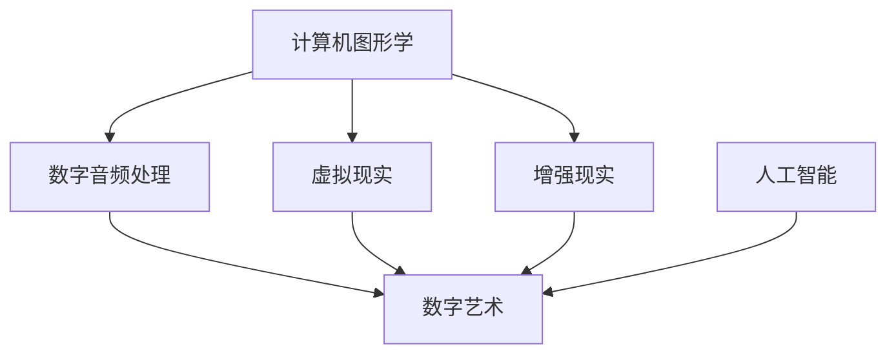

                 

# 硅谷艺术与科技的融合:新媒体艺术

## 1. 背景介绍

### 1.1 问题由来

硅谷，这个全球科技创新中心，不仅仅孕育了苹果、谷歌、Facebook等科技巨头，更是文化创意产业的重要发源地。随着科技的迅猛发展，硅谷开始将艺术与科技融合，催生了新媒体艺术这一新兴领域。新媒体艺术通过将数字技术、人工智能、虚拟现实等前沿科技应用于艺术创作，为传统艺术注入了新的活力和可能性。

### 1.2 问题核心关键点

新媒体艺术的核心关键点在于将科技与艺术深度结合，探索新的表达形式与叙事方式。其核心技术包括计算机图形学、数字音频处理、虚拟现实(VR)、增强现实(AR)、人工智能(AI)等。新媒体艺术通过这些技术，实现了跨越时空的交互体验，颠覆了传统的艺术创作和欣赏方式。

## 2. 核心概念与联系

### 2.1 核心概念概述

- 新媒体艺术(New Media Art)：指将数字技术、虚拟现实、增强现实、人工智能等现代科技与传统艺术形式结合，创作出新型艺术作品的艺术形式。
- 计算机图形学(Computer Graphics)：研究如何利用计算机生成和处理图像的学科，是数字艺术和虚拟现实的重要基础。
- 数字音频处理(Digital Audio Processing)：研究如何通过计算机技术处理和合成音频信号，为数字艺术提供声效支持。
- 虚拟现实(Virtual Reality)：利用计算机模拟一个虚拟世界，使用户可以沉浸其中，实现虚拟与现实的融合。
- 增强现实(Augmented Reality)：通过计算机技术将虚拟信息叠加在现实世界中，增强用户的感官体验。
- 人工智能(Artificial Intelligence)：通过机器学习和深度学习技术，使计算机具备自主学习和决策能力，为新媒体艺术提供智能化支持。

这些核心概念之间的逻辑关系可以通过以下Mermaid流程图来展示：



这个流程图展示了核心概念之间的联系：

1. 计算机图形学和数字音频处理为新媒体艺术提供了基础的视觉和声效支持。
2. 虚拟现实和增强现实通过将虚拟信息叠加在现实世界，为新媒体艺术提供了丰富的交互体验。
3. 人工智能则通过自主学习与决策能力，为新媒体艺术提供了智能化的表现形式。

## 3. 核心算法原理 & 具体操作步骤

### 3.1 算法原理概述

新媒体艺术的核心算法原理主要集中在计算机图形学、数字音频处理、虚拟现实、增强现实和人工智能等方面。以下将详细介绍这些核心算法的原理：

- 计算机图形学：通过数学模型和算法，利用计算机生成和处理图像，实现视觉效果的创新。
- 数字音频处理：利用数字信号处理技术，对音频信号进行编码、解码、滤波、混合等操作，实现声音效果的创新。
- 虚拟现实：通过计算机生成三维环境，使用户能够身临其境地感受虚拟世界。
- 增强现实：通过计算机技术将虚拟信息叠加在现实世界中，增强用户的感官体验。
- 人工智能：通过机器学习和深度学习技术，使计算机具备自主学习和决策能力。

### 3.2 算法步骤详解

#### 计算机图形学

1. **模型构建**：选择适合的几何模型，如三角形、多边形等，构建虚拟场景的框架。
2. **着色渲染**：为模型添加材质、光照、纹理等，实现逼真的视觉效果。
3. **交互设计**：设计用户与虚拟场景的交互方式，如点击、拖拽、手势等。
4. **渲染输出**：利用GPU等硬件加速，将渲染结果输出到屏幕或虚拟现实头盔中。

#### 数字音频处理

1. **音频采集**：通过麦克风、录音笔等设备采集音频信号。
2. **信号处理**：对音频信号进行预处理，如降噪、均衡、压缩等。
3. **音频合成**：将处理后的音频信号与合成音频（如音乐、语音等）进行混合，实现声音效果的创新。
4. **音效输出**：通过扬声器或耳机将音频信号输出给用户。

#### 虚拟现实

1. **场景构建**：创建虚拟世界的场景和环境，如虚拟城市、森林等。
2. **交互设计**：设计用户与虚拟环境的交互方式，如行走、跳跃、碰撞等。
3. **位置跟踪**：通过传感器获取用户的位置和方向信息。
4. **渲染输出**：将虚拟场景和用户交互信息渲染到VR头盔中，使用户能够沉浸其中。

#### 增强现实

1. **目标检测**：通过摄像头获取现实世界的图像，识别并定位虚拟物体。
2. **对象融合**：将虚拟对象叠加在现实世界的图像中。
3. **环境跟踪**：通过传感器获取用户的位置和方向信息，实现虚拟对象与环境的动态交互。
4. **渲染输出**：将增强现实场景渲染到用户的屏幕上，实现虚拟与现实的融合。

#### 人工智能

1. **数据采集**：通过传感器或摄像头获取用户的行为数据。
2. **特征提取**：利用机器学习算法提取用户行为特征。
3. **模型训练**：使用深度学习算法训练模型，使其具备自主学习和决策能力。
4. **智能交互**：通过模型预测用户行为，实现智能化的艺术表现。

### 3.3 算法优缺点

#### 计算机图形学

- **优点**：
  - 实现逼真的视觉效果。
  - 提供丰富的交互方式。
  - 支持实时渲染，响应速度快。

- **缺点**：
  - 需要复杂的数学模型和算法支持。
  - 对硬件要求较高，成本较高。

#### 数字音频处理

- **优点**：
  - 实现多样化的声音效果。
  - 支持实时处理和输出。
  - 使用广泛，易于集成。

- **缺点**：
  - 对音频信号处理的要求较高。
  - 处理复杂的声音效果可能较为困难。

#### 虚拟现实

- **优点**：
  - 提供沉浸式的用户体验。
  - 支持动态交互，增强用户参与感。
  - 应用广泛，拓展性强。

- **缺点**：
  - 需要专用设备支持，成本较高。
  - 对用户的操作习惯要求较高。

#### 增强现实

- **优点**：
  - 增强现实与现实世界融合，增加互动性。
  - 支持多种交互方式，灵活性高。
  - 支持跨平台应用，便捷性强。

- **缺点**：
  - 对摄像头和传感器的精度要求较高。
  - 用户体验可能受限于设备性能。

#### 人工智能

- **优点**：
  - 提供智能化的交互方式。
  - 支持自主学习和决策，灵活性强。
  - 应用广泛，拓展性强。

- **缺点**：
  - 对数据量和计算资源要求较高。
  - 模型训练和部署可能较为复杂。

### 3.4 算法应用领域

新媒体艺术的应用领域非常广泛，涵盖了艺术展览、互动装置、数字雕塑、虚拟现实游戏等多个领域。

- **艺术展览**：通过计算机图形学和数字音频处理，创作出视觉和声效结合的交互式艺术作品。
- **互动装置**：利用增强现实和人工智能，创建可互动的艺术装置，增强观众参与感。
- **数字雕塑**：通过计算机图形学和虚拟现实技术，实现三维空间中的动态雕塑展示。
- **虚拟现实游戏**：结合虚拟现实和人工智能，创建沉浸式的游戏体验，增强用户沉浸感。

## 4. 数学模型和公式 & 详细讲解 & 举例说明

### 4.1 数学模型构建

#### 计算机图形学

在计算机图形学中，常用的数学模型包括几何模型、光照模型、纹理模型等。以下以几何模型为例，介绍其数学构建：

1. **几何模型**：常用的几何模型有三角形、四边形、多边形等。通过定义顶点坐标和连接关系，可以构建出任意复杂的三维场景。

2. **光照模型**：用于模拟光线的反射和折射，常用的模型有Phong模型、Blinn模型等。

3. **纹理模型**：用于模拟物体的表面纹理，常用的模型有Bump Mapping、Normal Mapping等。

#### 数字音频处理

数字音频处理常用的数学模型包括时域模型、频域模型、时频混合模型等。以下以时域模型为例，介绍其数学构建：

1. **时域模型**：时域模型直接处理音频信号的时间序列，常用的模型有窗口函数、短时傅里叶变换等。

2. **频域模型**：频域模型将音频信号转换为频谱形式，常用的模型有傅里叶变换、短时傅里叶变换等。

3. **时频混合模型**：将时域和频域模型结合，常用的模型有小波变换、STFT等。

#### 虚拟现实

虚拟现实中常用的数学模型包括空间几何模型、位置跟踪模型等。以下以空间几何模型为例，介绍其数学构建：

1. **空间几何模型**：用于表示虚拟世界的几何结构和环境信息，常用的模型有球体、立方体、多边形等。

2. **位置跟踪模型**：用于获取用户的位置和方向信息，常用的模型有陀螺仪、加速度计、激光雷达等。

#### 增强现实

增强现实中常用的数学模型包括目标检测模型、对象融合模型等。以下以目标检测模型为例，介绍其数学构建：

1. **目标检测模型**：用于识别和定位虚拟物体，常用的模型有卷积神经网络、深度神经网络等。

2. **对象融合模型**：用于将虚拟对象与现实世界的图像进行融合，常用的模型有混合几何变换、投影变换等。

#### 人工智能

人工智能中常用的数学模型包括线性回归模型、逻辑回归模型、深度神经网络模型等。以下以深度神经网络模型为例，介绍其数学构建：

1. **深度神经网络模型**：用于模拟人脑的神经网络结构，常用的模型有卷积神经网络、循环神经网络等。

2. **线性回归模型**：用于解决回归问题，常用的模型有线性回归、多项式回归等。

3. **逻辑回归模型**：用于解决分类问题，常用的模型有逻辑回归、Softmax回归等。

### 4.2 公式推导过程

#### 计算机图形学

1. **几何模型**：

   $$
   \begin{aligned}
   P_1 &= \begin{bmatrix} x_1 \\ y_1 \\ z_1 \end{bmatrix} \\
   P_2 &= \begin{bmatrix} x_2 \\ y_2 \\ z_2 \end{bmatrix} \\
   P_3 &= \begin{bmatrix} x_3 \\ y_3 \\ z_3 \end{bmatrix} \\
   \end{aligned}
   $$

2. **光照模型**：

   $$
   I = \rho \cdot (k_d \cdot \frac{L}{\|L\|} \cdot \frac{\|R\|}{\|V\|} + k_s \cdot \max(\cos(\theta), 0) \cdot \frac{I}{\|V\|})
   $$

   其中 $\rho$ 为表面反射系数，$L$ 为光源方向向量，$R$ 为表面法向量，$V$ 为视光线方向向量，$\theta$ 为入射角。

3. **纹理模型**：

   $$
   T(x, y) = \begin{cases}
   0 & \text{if } x < 0 \text{ or } y < 0 \\
   \max(0, 1 - \frac{x}{X}) \cdot \max(0, 1 - \frac{y}{Y}) & \text{otherwise}
   \end{cases}
   $$

   其中 $(x, y)$ 为纹理坐标，$X$ 和 $Y$ 为纹理图像的尺寸。

#### 数字音频处理

1. **时域模型**：

   $$
   x[n] = \sum_{k=-\infty}^{\infty} h[k] \cdot y[n-k]
   $$

   其中 $x[n]$ 为输出信号，$y[n]$ 为输入信号，$h[k]$ 为系统脉冲响应。

2. **频域模型**：

   $$
   X(f) = \int_{-\infty}^{\infty} x(t) \cdot e^{-j2\pi ft} \, dt
   $$

   其中 $X(f)$ 为频域信号，$x(t)$ 为时域信号，$f$ 为频率，$j$ 为虚数单位。

3. **时频混合模型**：

   $$
   X(f, t) = \frac{1}{\sqrt{T}} \cdot \int_{-\infty}^{\infty} x(t) \cdot e^{-j2\pi ft} \, dt
   $$

   其中 $X(f, t)$ 为时频混合信号，$x(t)$ 为时域信号，$f$ 为频率，$t$ 为时间，$T$ 为信号长度。

#### 虚拟现实

1. **空间几何模型**：

   $$
   \begin{aligned}
   P &= \begin{bmatrix} x \\ y \\ z \end{bmatrix} \\
   R &= \begin{bmatrix} R_{11} & R_{12} & R_{13} \\
   R_{21} & R_{22} & R_{23} \\
   R_{31} & R_{32} & R_{33} \end{bmatrix}
   \end{aligned}
   $$

   其中 $P$ 为点坐标，$R$ 为旋转矩阵。

2. **位置跟踪模型**：

   $$
   \begin{aligned}
   a &= \frac{d}{dt} \dot{p} \\
   \ddot{p} &= R \cdot g + \dot{p} \cdot \omega
   \end{aligned}
   $$

   其中 $a$ 为加速度，$\dot{p}$ 为速度，$g$ 为重力加速度，$R$ 为旋转矩阵，$\omega$ 为角速度。

#### 增强现实

1. **目标检测模型**：

   $$
   \begin{aligned}
   S &= \frac{1}{N} \sum_{i=1}^N \omega_i \cdot I_i \\
   \omega_i &= \frac{1}{1 + e^{-\delta_i}} \\
   \delta_i &= -\log(\frac{1}{1+e^{-s_i}})
   \end{aligned}
   $$

   其中 $S$ 为置信度，$I_i$ 为第 $i$ 帧的特征向量，$\omega_i$ 为置信度权重，$\delta_i$ 为置信度损失，$s_i$ 为置信度阈值。

2. **对象融合模型**：

   $$
   Y = \begin{cases}
   Y_{\text{real}} & \text{if } D < T \\
   Y_{\text{virtual}} & \text{otherwise}
   \end{cases}
   $$

   其中 $Y$ 为融合结果，$Y_{\text{real}}$ 为真实场景，$Y_{\text{virtual}}$ 为虚拟对象，$D$ 为深度值，$T$ 为阈值。

#### 人工智能

1. **线性回归模型**：

   $$
   y = \beta_0 + \beta_1 x_1 + \beta_2 x_2 + \cdots + \beta_p x_p + \epsilon
   $$

   其中 $y$ 为因变量，$\beta_0$ 为截距，$\beta_1, \beta_2, \cdots, \beta_p$ 为回归系数，$x_1, x_2, \cdots, x_p$ 为自变量，$\epsilon$ 为误差项。

2. **逻辑回归模型**：

   $$
   \begin{aligned}
   P(y=1|x) &= \frac{1}{1 + e^{-\hat{y}}} \\
   \hat{y} &= \sum_{i=1}^n \beta_i x_i
   \end{aligned}
   $$

   其中 $P(y=1|x)$ 为正类概率，$\hat{y}$ 为线性判别函数，$\beta_i$ 为回归系数，$x_i$ 为特征向量。

3. **深度神经网络模型**：

   $$
   \begin{aligned}
   y &= \sigma(\hat{y}) \\
   \hat{y} &= \sum_{i=1}^n w_i x_i + b
   \end{aligned}
   $$

   其中 $y$ 为输出，$\sigma$ 为激活函数，$\hat{y}$ 为线性预测函数，$w_i$ 为权重，$x_i$ 为输入，$b$ 为偏置项。

### 4.3 案例分析与讲解

#### 案例1: 交互式艺术装置

一位艺术家使用增强现实技术创作了一台交互式艺术装置。用户可以通过智能手机的摄像头看到艺术装置中的虚拟元素，并与它们进行互动。该装置使用了计算机图形学和增强现实技术，实现了虚拟与现实的融合。

- **计算机图形学**：艺术装置中的虚拟元素是通过几何模型和纹理模型构建的，具有逼真的视觉效果。
- **增强现实**：通过摄像头获取现实世界的图像，识别并定位虚拟物体，用户可以通过手势与虚拟元素进行互动。

#### 案例2: 虚拟现实游戏

一家游戏公司开发了一款虚拟现实游戏，用户可以在虚拟世界中探索、冒险、战斗。该游戏使用了虚拟现实技术和人工智能技术，实现了智能化的游戏体验。

- **虚拟现实**：游戏场景和环境是通过空间几何模型构建的，用户可以身临其境地感受到虚拟世界的逼真感。
- **人工智能**：游戏角色可以根据用户的动作和行为进行自主学习和决策，具有智能化的交互方式。

## 5. 项目实践：代码实例和详细解释说明

### 5.1 开发环境搭建

- **Python**：安装Python 3.7及以上版本，并配置好IDE，如PyCharm、VS Code等。
- **OpenCV**：安装OpenCV库，用于图像处理和视频编码。
- **PyOpenGL**：安装PyOpenGL库，用于3D图形渲染。
- **PyAudio**：安装PyAudio库，用于音频处理。
- **TensorFlow**：安装TensorFlow库，用于深度学习模型的构建和训练。
- **CUDA**：安装NVIDIA CUDA库，用于GPU加速计算。

### 5.2 源代码详细实现

以下是一个使用Python和PyOpenGL实现数字艺术的代码示例，包括计算机图形学的基本操作：

```python
import numpy as np
from OpenGL.GL import *
from OpenGL.GLUT import *
from OpenGL.GLU import *

# 初始化GLUT窗口
def init():
    glClearColor(0.0, 0.0, 0.0, 0.0)
    gluPerspective(45.0, 800.0/600.0, 0.1, 100.0)
    glTranslatef(0.0, 0.0, -5.0)

# 绘制几何模型
def draw():
    glClear(GL_COLOR_BUFFER_BIT | GL_DEPTH_BUFFER_BIT)
    glColor3f(1.0, 1.0, 1.0)
    glBegin(GL_TRIANGLES)
    glVertex3f(-0.5, -0.5, 0.0)
    glVertex3f(0.5, -0.5, 0.0)
    glVertex3f(0.0, 0.5, 0.0)
    glEnd()

# 主循环
def main():
    glutInit()
    glutInitDisplayMode(GLUT_DOUBLE | GLUT_RGB | GLUT_DEPTH)
    glutInitWindowSize(800, 600)
    glutCreateWindow(b"Digital Art")
    init()
    glutDisplayFunc(draw)
    glutMainLoop()

if __name__ == "__main__":
    main()
```

### 5.3 代码解读与分析

- **初始化GLUT窗口**：使用glutInit、glutInitDisplayMode、glutInitWindowSize等函数设置窗口大小、显示模式、深度测试等参数。
- **绘制几何模型**：使用glClear、glColor3f、glBegin、glVertex3f等函数绘制几何模型。
- **主循环**：使用glutDisplayFunc、glutMainLoop等函数实现主循环，调用draw函数绘制场景。

## 6. 实际应用场景

### 6.1 艺术展览

新媒体艺术在艺术展览中的应用非常广泛。例如，一家艺术博物馆通过计算机图形学和增强现实技术，展示了一幅数字化的名画。观众可以通过智能手机的摄像头看到虚拟的画框、画作的细节和互动元素，与艺术作品进行互动。这种交互式的展示方式，不仅增强了观众的参与感，还丰富了展览的内容和形式。

### 6.2 数字雕塑

一位艺术家使用计算机图形学和虚拟现实技术，创作了一尊数字雕塑。观众可以通过虚拟现实头盔，全方位、多角度地欣赏这座雕塑，甚至可以近距离观察雕塑的每一个细节。这种数字雕塑的展示方式，打破了传统艺术展览的时间和空间限制，让观众能够更加深入地体验艺术作品。

### 6.3 虚拟现实游戏

一家游戏公司开发了一款虚拟现实游戏，用户可以在虚拟世界中探索、冒险、战斗。该游戏使用了虚拟现实技术和人工智能技术，实现了智能化的游戏体验。用户可以通过头戴式显示器和手柄，与虚拟环境进行互动，感受身临其境的游戏体验。这种虚拟现实游戏，为玩家提供了全新的游戏方式，拓展了游戏的多样性和趣味性。

### 6.4 未来应用展望

随着科技的不断进步，新媒体艺术将更加普及和多样。未来，新媒体艺术将更多地应用于智能家居、智能办公、智能城市等多个领域，为人们提供更加个性化、智能化的生活体验。例如，智能家居可以通过增强现实技术，实时展示家居布局和装修效果；智能办公可以通过虚拟现实技术，实现虚拟会议室和培训场景；智能城市可以通过数字模型和人工智能，展示城市规划和交通状况。新媒体艺术将成为未来人机交互的重要手段，为人们带来更加便捷、高效、沉浸的体验。

## 7. 工具和资源推荐

### 7.1 学习资源推荐

为了帮助开发者系统掌握新媒体艺术的理论基础和实践技巧，这里推荐一些优质的学习资源：

- **《计算机图形学基础》**：由Mark Harris编写，详细介绍了计算机图形学的基本原理和算法。
- **《数字音频处理技术》**：由Gerald Coatrieux编写，详细介绍了数字音频处理的原理和应用。
- **《虚拟现实技术》**：由Douglas Thibault编写，详细介绍了虚拟现实技术的原理和实现。
- **《增强现实技术》**：由Rebecca Slayter编写，详细介绍了增强现实技术的原理和应用。
- **《深度学习技术》**：由Ian Goodfellow、Yoshua Bengio、Aaron Courville编写，详细介绍了深度学习的原理和应用。

通过这些资源的学习实践，相信你一定能够快速掌握新媒体艺术的精髓，并用于解决实际的NLP问题。

### 7.2 开发工具推荐

- **Python**：Python是一种高级编程语言，支持多种库和框架，适合快速迭代研究。
- **OpenCV**：OpenCV是一个开源计算机视觉库，支持图像处理、视频编码等功能。
- **PyOpenGL**：PyOpenGL是一个Python与OpenGL的接口，支持3D图形渲染和交互。
- **PyAudio**：PyAudio是一个Python音频处理库，支持音频信号的采集、处理和输出。
- **TensorFlow**：TensorFlow是一个开源深度学习框架，支持模型的构建、训练和部署。
- **CUDA**：CUDA是一个NVIDIA的并行计算平台和编程模型，支持GPU加速计算。

合理利用这些工具，可以显著提升新媒体艺术的开发效率，加快创新迭代的步伐。

### 7.3 相关论文推荐

- **《计算机图形学基础》**：By Mark Harris，Wiley，2016。
- **《数字音频处理技术》**：By Gerald Coatrieux，Pearson，2018。
- **《虚拟现实技术》**：By Douglas Thibault，Academic Press，2005。
- **《增强现实技术》**：By Rebecca Slayter，Artech House，2019。
- **《深度学习技术》**：By Ian Goodfellow、Yoshua Bengio、Aaron Courville，MIT Press，2016。

这些论文代表了大语言模型微调技术的发展脉络。通过学习这些前沿成果，可以帮助研究者把握学科前进方向，激发更多的创新灵感。

## 8. 总结：未来发展趋势与挑战

### 8.1 研究成果总结

本文对新媒体艺术的理论基础和实践技巧进行了全面系统的介绍。主要内容包括计算机图形学、数字音频处理、虚拟现实、增强现实和人工智能等核心算法原理和操作步骤。通过系统梳理，帮助读者更好地理解新媒体艺术的核心概念和关键技术。

### 8.2 未来发展趋势

展望未来，新媒体艺术将呈现以下几个发展趋势：

- **跨领域融合**：新媒体艺术将与其他技术领域，如物联网、区块链、人工智能等进行更加深入的融合，拓展其应用范围和表现形式。
- **实时交互**：新媒体艺术将更加注重实时交互和动态变化，提升用户体验的沉浸感和互动性。
- **智能系统**：新媒体艺术将更多地应用人工智能技术，实现智能化和自主化的表现形式。
- **个性化定制**：新媒体艺术将更多地考虑用户的个性化需求，提供更加个性化、定制化的艺术作品和交互体验。
- **跨文化交流**：新媒体艺术将突破地域和语言的限制，实现跨文化、跨语言的交流和互动。

### 8.3 面临的挑战

尽管新媒体艺术已经取得了一定的进展，但在迈向更加智能化、普适化应用的过程中，仍然面临诸多挑战：

- **技术复杂性**：新媒体艺术需要多种技术的综合应用，技术复杂性较高，开发难度较大。
- **用户接受度**：新媒体艺术需要用户掌握一定的技术手段，部分用户可能对新技术接受度不高。
- **设备普及度**：新媒体艺术需要特定的硬件设备支持，设备普及度较低，限制了其广泛应用。
- **内容创作**：新媒体艺术的内容创作和设计需要较高的专业水平，对创作者的技术能力要求较高。
- **版权保护**：新媒体艺术中可能包含大量数字内容，版权保护和知识产权问题亟待解决。

### 8.4 研究展望

面对新媒体艺术所面临的挑战，未来的研究需要在以下几个方面寻求新的突破：

- **技术集成**：开发更加集成化和模块化的技术框架，降低新媒体艺术的开发难度。
- **用户友好性**：设计更加易用、易懂的用户界面和交互方式，提升用户的接受度和使用体验。
- **设备普及**：开发更加便携、低成本的硬件设备，降低新媒体艺术的应用门槛。
- **内容创作**：探索更加便捷、高效的内容创作工具，降低创作者的技术门槛。
- **版权保护**：建立更加完善的网络版权保护机制，确保新媒体艺术的知识产权不受侵犯。

这些研究方向的探索，必将引领新媒体艺术技术迈向更高的台阶，为构建安全、可靠、可解释、可控的智能系统铺平道路。面向未来，新媒体艺术还需要与其他人工智能技术进行更深入的融合，如知识表示、因果推理、强化学习等，多路径协同发力，共同推动自然语言理解和智能交互系统的进步。只有勇于创新、敢于突破，才能不断拓展新媒体艺术的边界，让智能技术更好地造福人类社会。

## 9. 附录：常见问题与解答

**Q1: 什么是新媒体艺术？**

A: 新媒体艺术是一种将数字技术、虚拟现实、增强现实、人工智能等现代科技与传统艺术形式结合，创作出新型艺术作品的艺术形式。

**Q2: 新媒体艺术有哪些核心技术？**

A: 新媒体艺术的核心技术包括计算机图形学、数字音频处理、虚拟现实、增强现实和人工智能等。

**Q3: 如何使用计算机图形学创建虚拟场景？**

A: 使用几何模型、光照模型和纹理模型等，可以创建逼真的虚拟场景。具体实现需要定义顶点坐标、旋转矩阵、几何模型等。

**Q4: 如何通过增强现实技术展示虚拟元素？**

A: 通过摄像头获取现实世界的图像，识别并定位虚拟物体，使用户可以通过手势与虚拟元素进行互动。

**Q5: 未来新媒体艺术的发展趋势是什么？**

A: 新媒体艺术将呈现跨领域融合、实时交互、智能系统、个性化定制、跨文化交流等发展趋势。

---

作者：禅与计算机程序设计艺术 / Zen and the Art of Computer Programming

