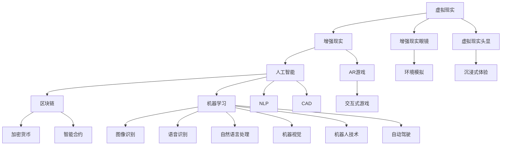

                 

# 硅谷虚拟现实:元宇宙的科技冲击

> 关键词：硅谷,虚拟现实,元宇宙,科技,冲击,未来展望

## 1. 背景介绍

随着技术的迅猛发展，虚拟现实（Virtual Reality, VR）和元宇宙（Metaverse）正在迅速崛起，成为未来科技的重要方向。硅谷作为全球科技创新的中心，无疑在这一领域扮演着重要角色。本文将深入探讨硅谷在虚拟现实和元宇宙领域的最新进展、核心技术、应用场景及未来趋势，为读者提供全面、系统的了解。

## 2. 核心概念与联系

### 2.1 核心概念概述

虚拟现实和元宇宙是当今科技领域的热门话题。虚拟现实主要指的是通过计算机技术模拟出一个三维空间，使用户能够沉浸在这个虚拟空间中，仿佛身临其境。而元宇宙则是一个更广阔的概念，它不仅包括虚拟现实技术，还涵盖了区块链、云计算、人工智能等多个前沿技术领域。

硅谷作为全球科技创新中心，汇聚了大量顶尖技术和企业，包括Facebook、Google、NVIDIA等，它们在虚拟现实和元宇宙领域都有着重要贡献。

### 2.2 核心概念原理和架构的 Mermaid 流程图



这个流程图展示了虚拟现实和元宇宙的核心技术架构及其相互关系。

## 3. 核心算法原理 & 具体操作步骤

### 3.1 算法原理概述

虚拟现实和元宇宙的核心算法原理主要包括图形渲染、实时计算、物理引擎、人工智能、区块链等。这些技术共同构成了沉浸式、交互式的虚拟环境。

- **图形渲染**：使用各种渲染算法和工具，将三维场景转换为视觉图像，提供逼真的视觉体验。
- **实时计算**：使用高性能GPU、TPU等硬件设备，实现低延迟、高帧率的实时渲染和交互。
- **物理引擎**：模拟物理定律，使得虚拟环境中的物体和环境具有真实的物理特性，如碰撞、重力等。
- **人工智能**：利用机器学习、自然语言处理等技术，实现自然语言交互、智能推荐、环境感知等。
- **区块链**：实现虚拟世界中的资产管理和交易，确保数据安全和透明性。

### 3.2 算法步骤详解

虚拟现实和元宇宙的开发步骤大致可以分为以下几步：

1. **场景设计**：确定虚拟场景的内容和风格，包括地形、建筑、角色等。
2. **引擎选择**：选择合适的图形渲染引擎（如Unity、Unreal Engine）和物理引擎。
3. **数据采集与建模**：采集真实世界的图像、地形数据，使用3D建模软件生成虚拟模型。
4. **交互设计**：设计用户与虚拟环境之间的交互方式，如点击、拖拽、语音命令等。
5. **AI整合**：集成自然语言处理、语音识别、物体识别等AI技术，实现更自然的交互体验。
6. **区块链整合**：引入区块链技术，实现虚拟资产的创建、交易和管理。

### 3.3 算法优缺点

虚拟现实和元宇宙技术具有以下优点：
- **沉浸式体验**：提供逼真的虚拟环境，使用户能够沉浸其中，仿佛身临其境。
- **交互性高**：使用户能够通过手势、语音等方式与虚拟环境进行互动，提升用户体验。
- **应用广泛**：可以应用于游戏、教育、医疗、旅游等多个领域，带来新的商业机会。

同时，也存在一些缺点：
- **技术门槛高**：需要高水平的图形渲染、实时计算和物理引擎技术，开发成本较高。
- **硬件需求大**：需要高性能的GPU、TPU等硬件设备，普通消费者难以负担。
- **隐私与安全**：大量数据在虚拟环境中的传输和存储，可能存在隐私泄露和安全风险。

### 3.4 算法应用领域

虚拟现实和元宇宙技术在多个领域有着广泛应用，包括但不限于：

- **游戏**：如《堡垒之夜》、《使命召唤》等，使用户能够进入一个虚拟的游戏世界。
- **教育**：如虚拟实验室、虚拟教室，提供沉浸式学习体验。
- **医疗**：如虚拟手术室、虚拟康复训练，提升医疗教学和康复效果。
- **旅游**：如虚拟旅游、虚拟城市，提供全新的旅游体验。
- **房地产**：如虚拟看房、虚拟设计，提高房地产销售效率。
- **社交**：如虚拟会议、虚拟社交平台，提供新型社交方式。

## 4. 数学模型和公式 & 详细讲解 & 举例说明

### 4.1 数学模型构建

虚拟现实和元宇宙的数学模型通常包括以下几个部分：

- **几何模型**：使用三维坐标系和矩阵变换，表示虚拟世界中的物体和环境。
- **物理模型**：使用牛顿力学、刚体动力学等，模拟虚拟物体的运动和交互。
- **视觉模型**：使用光线追踪、投影变换等，生成逼真的视觉图像。
- **用户交互模型**：使用手势识别、语音识别等技术，实现用户与虚拟环境的互动。

### 4.2 公式推导过程

以一个简单的三维物体的渲染为例，其数学模型推导如下：

$$
\mathbf{M} = \mathbf{R} \mathbf{T} \mathbf{S} \mathbf{C}
$$

其中，$\mathbf{M}$ 表示物体的变换矩阵，$\mathbf{R}$ 表示旋转变换，$\mathbf{T}$ 表示平移变换，$\mathbf{S}$ 表示缩放变换，$\mathbf{C}$ 表示纹理映射。

### 4.3 案例分析与讲解

以《堡垒之夜》中的虚拟环境为例，其渲染过程如下：

1. **场景加载**：从本地文件或云端加载场景数据。
2. **光照计算**：根据光源位置和强度，计算场景中的光照效果。
3. **物体渲染**：使用图形渲染引擎对场景中的每个物体进行渲染，生成像素点。
4. **物理模拟**：使用物理引擎模拟物体间的碰撞、重力等效果。
5. **交互响应**：根据用户的操作，更新场景中的物体状态，实现互动。

## 5. 项目实践：代码实例和详细解释说明

### 5.1 开发环境搭建

搭建虚拟现实和元宇宙开发环境，需要以下步骤：

1. **安装操作系统**：建议使用Windows 10、Ubuntu 18.04等稳定操作系统。
2. **安装图形渲染引擎**：如Unity、Unreal Engine等，并下载对应的SDK。
3. **安装物理引擎**：如PhysX、Box2D等。
4. **安装AI框架**：如TensorFlow、PyTorch等，并下载预训练模型。
5. **安装区块链框架**：如Ethereum、Hyperledger等。

### 5.2 源代码详细实现

以下是一个简单的虚拟现实游戏的开发示例：

```python
# 导入必要的库
import unity3d
import physics
import ai

# 初始化Unity3D引擎
engine = unity3d.Engine()

# 创建场景
scene = engine.create_scene()

# 创建光源
light = scene.add_light()

# 创建物体
cube = scene.add_cube()
cube.set_position((0, 0, 0))
cube.set_rotation((0, 0, 0))

# 创建碰撞体
collider = physics.create_collider(cube)
collider.set_shape("sphere")

# 创建AI对象
ai_obj = ai.create_ai(cube)
ai_obj.set_state("idle")

# 运行游戏
engine.run()
```

### 5.3 代码解读与分析

上述代码创建了一个简单的虚拟现实场景，包括光源、物体、碰撞体和AI对象。其中，Unity3D引擎提供了方便的API，可以轻松创建和操作场景中的各个组件。

## 6. 实际应用场景

### 6.1 游戏

虚拟现实游戏是目前元宇宙技术的主要应用场景之一。如《堡垒之夜》、《使命召唤》等游戏，通过提供沉浸式、交互式的虚拟体验，吸引了大量玩家。

### 6.2 教育

虚拟现实技术在教育领域也有广泛应用。如虚拟实验室、虚拟教室等，可以提供真实的实验环境和互动体验，提升学生的学习效果。

### 6.3 医疗

虚拟现实和元宇宙技术在医疗领域也有重要应用。如虚拟手术室、虚拟康复训练等，可以提高医疗教学和康复效果。

### 6.4 旅游

虚拟现实技术可以提供全新的旅游体验。如虚拟旅游、虚拟城市等，用户可以在虚拟世界中自由探索，体验不同的旅游场景。

### 6.5 房地产

虚拟现实和元宇宙技术在房地产领域也有广泛应用。如虚拟看房、虚拟设计等，可以提高房地产销售效率。

### 6.6 社交

虚拟现实和元宇宙技术可以提供新型社交方式。如虚拟会议、虚拟社交平台等，用户可以在虚拟环境中进行互动。

## 7. 工具和资源推荐

### 7.1 学习资源推荐

为了帮助开发者系统掌握虚拟现实和元宇宙技术，推荐以下学习资源：

1. **《Unity3D开发手册》**：由Unity官方出版，全面介绍了Unity3D引擎的开发流程和最佳实践。
2. **《Unreal Engine官方文档》**：由Epic Games发布，提供了详细的Unreal Engine开发指南。
3. **《PyTorch深度学习入门》**：由PyTorch官方出版，全面介绍了PyTorch框架的使用方法和应用场景。
4. **《TensorFlow官方文档》**：由Google发布，提供了详细的TensorFlow开发指南和教程。
5. **《区块链基础与实践》**：由区块链技术专家出版，介绍了区块链技术的原理和应用。

### 7.2 开发工具推荐

以下是几款常用的虚拟现实和元宇宙开发工具：

1. **Unity3D**：由Unity Technologies开发，是当前最流行的虚拟现实开发引擎之一。
2. **Unreal Engine**：由Epic Games开发，提供了强大的图形渲染和物理引擎。
3. **TensorFlow**：由Google开发，支持深度学习模型的训练和推理。
4. **PyTorch**：由Facebook开发，支持深度学习模型的训练和推理。
5. **Web3.js**：由以太坊基金会开发，支持Web3技术的开发和应用。

### 7.3 相关论文推荐

以下是几篇虚拟现实和元宇宙领域的经典论文，推荐阅读：

1. **《虚拟现实中的渲染技术研究》**：详细介绍了虚拟现实场景中的渲染算法和技术。
2. **《基于人工智能的虚拟现实交互技术》**：介绍了人工智能在虚拟现实交互中的应用。
3. **《区块链技术在元宇宙中的应用》**：介绍了区块链技术在元宇宙中的具体应用。

## 8. 总结：未来发展趋势与挑战

### 8.1 研究成果总结

虚拟现实和元宇宙技术在近年来取得了显著进展，成为未来科技的重要方向。其核心技术包括图形渲染、实时计算、物理引擎、人工智能和区块链等，这些技术共同构成了沉浸式、交互式的虚拟环境。

### 8.2 未来发展趋势

未来虚拟现实和元宇宙技术将继续快速发展，呈现以下趋势：

1. **技术融合**：虚拟现实和元宇宙技术将与其他前沿技术（如5G、物联网、AR等）深度融合，带来更丰富的应用场景。
2. **用户普及**：随着技术的成熟和成本的降低，虚拟现实和元宇宙技术将逐步普及，应用场景更加广泛。
3. **跨平台互通**：不同平台之间的互通将成为现实，提升用户体验和应用范围。
4. **内容生态建设**：丰富的内容生态将成为虚拟现实和元宇宙发展的关键，带来更多的应用场景和商业机会。

### 8.3 面临的挑战

尽管虚拟现实和元宇宙技术取得了显著进展，但也面临以下挑战：

1. **技术瓶颈**：高性能硬件设备的开发和普及仍需时间，现有设备难以满足大规模用户需求。
2. **内容缺乏**：高质量的内容生态尚未建立，现有内容难以满足用户需求。
3. **隐私与安全**：大量数据在虚拟环境中的传输和存储，可能存在隐私泄露和安全风险。
4. **技术规范**：虚拟现实和元宇宙技术缺乏统一的标准和规范，导致不同平台之间的互通性差。
5. **伦理与法律**：虚拟现实和元宇宙技术可能带来的伦理和法律问题，需要进一步研究和规范。

### 8.4 研究展望

未来的虚拟现实和元宇宙技术需要从以下几个方向进行深入研究：

1. **技术突破**：提升图形渲染、实时计算和物理引擎的性能，降低硬件成本，提升用户体验。
2. **内容创新**：开发更多高质量的内容，丰富虚拟现实和元宇宙的应用场景。
3. **跨平台互通**：制定统一的技术标准和规范，提升不同平台之间的互通性。
4. **伦理与法律**：加强对虚拟现实和元宇宙技术的伦理和法律研究，确保技术的健康发展。
5. **社会影响**：关注虚拟现实和元宇宙技术对社会的影响，确保技术应用的安全性和可靠性。

## 9. 附录：常见问题与解答

**Q1: 虚拟现实和元宇宙技术的主要特点是什么？**

A: 虚拟现实和元宇宙技术的主要特点包括沉浸式体验、高交互性、实时渲染、物理引擎、人工智能和区块链等。

**Q2: 虚拟现实和元宇宙技术的核心算法有哪些？**

A: 虚拟现实和元宇宙技术的核心算法包括图形渲染、实时计算、物理引擎、人工智能和区块链等。

**Q3: 虚拟现实和元宇宙技术在教育领域有哪些应用？**

A: 虚拟现实和元宇宙技术在教育领域的应用包括虚拟实验室、虚拟教室、虚拟实习、虚拟旅游等。

**Q4: 虚拟现实和元宇宙技术在医疗领域有哪些应用？**

A: 虚拟现实和元宇宙技术在医疗领域的应用包括虚拟手术室、虚拟康复训练、虚拟病人等。

**Q5: 虚拟现实和元宇宙技术在社交领域有哪些应用？**

A: 虚拟现实和元宇宙技术在社交领域的应用包括虚拟会议、虚拟社交平台、虚拟社交游戏等。

**Q6: 虚拟现实和元宇宙技术的发展前景如何？**

A: 虚拟现实和元宇宙技术的发展前景广阔，将在游戏、教育、医疗、旅游、房地产、社交等领域带来革命性变化。

---

作者：禅与计算机程序设计艺术 / Zen and the Art of Computer Programming

