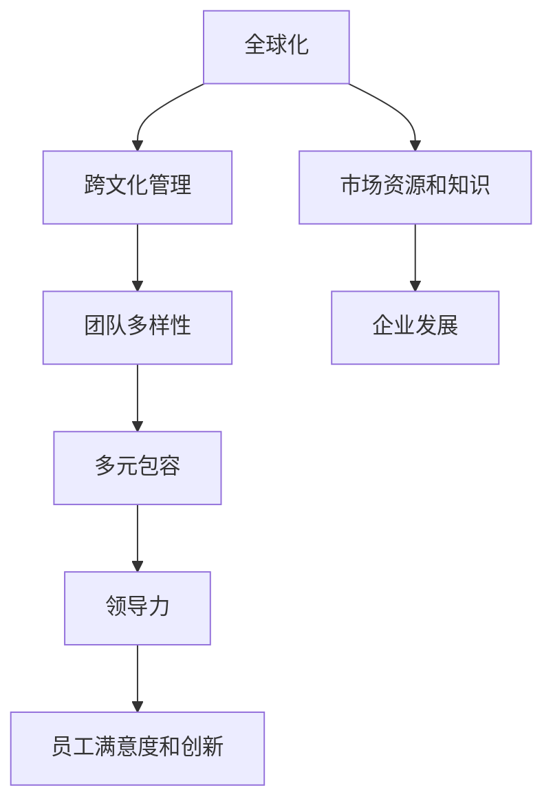

                 

# 硅谷跨国公司的文化融合:多元包容

## 1. 背景介绍

### 1.1 问题由来
随着全球化进程的加速，跨国公司在硅谷扎根的现象越来越普遍。然而，不同文化背景的员工集结一堂，难免会遇到沟通障碍、价值观冲突等问题。如何在多元化的环境中实现文化融合，构建包容性强的企业文化，成为了摆在所有硅谷跨国公司面前的一大挑战。

### 1.2 问题核心关键点
为了解决跨国公司文化融合的难题，企业需要采用多元包容策略，即在尊重和理解不同文化的基础上，融合各自优势，打造共同的价值观和行为准则。这种包容性文化不仅能提升员工的归属感和满意度，还能增强企业的创新能力和竞争力。

### 1.3 问题研究意义
研究跨国公司文化融合的策略，有助于企业更好地应对全球化挑战，构建多元化、包容性强的企业文化。它不仅能提升员工的士气和工作满意度，还能促进团队的协同创新，推动企业的持续发展。同时，多元包容的文化环境也能增强企业的社会责任感，提升其在全球市场中的形象。

## 2. 核心概念与联系

### 2.1 核心概念概述

在讨论跨国公司文化融合时，需要关注以下几个核心概念：

- 多元包容（Inclusion）：指尊重和接纳各种文化背景的员工，提供平等的发展机会，消除歧视和偏见。
- 全球化（Globalization）：指企业在全球范围内扩展业务，利用不同市场的资源和知识。
- 跨文化管理（Cross-Cultural Management）：指在跨国家、跨文化环境下，有效管理团队和业务的过程。
- 团队多样性（Team Diversity）：指团队成员在性别、年龄、种族、专业背景等方面的差异。
- 领导力（Leadership）：指企业领导者塑造和实施包容性文化的能力。

这些概念之间有着紧密的联系：全球化推动了跨国公司的发展，而跨文化管理和团队多样性是实现全球化的基础。只有通过多元包容的文化，才能充分发挥团队成员的多样性优势，实现企业的可持续发展。

### 2.2 核心概念原理和架构的 Mermaid 流程图



这个流程图展示了跨国公司文化融合的核心路径：全球化带来市场资源和知识，通过跨文化管理和团队多样性，最终实现多元包容，提升员工满意度和创新，推动企业发展。

## 3. 核心算法原理 & 具体操作步骤

### 3.1 算法原理概述

跨国公司文化融合的策略可以看作一个优化过程，目标是最小化文化冲突，最大化员工满意度和企业创新。这个过程涉及多个维度，包括语言、工作习惯、管理风格等。

算法原理包括以下几个方面：

- **数据收集**：通过问卷调查、访谈等形式，收集不同文化背景员工的反馈和建议。
- **数据处理**：对收集到的数据进行统计分析，找出文化冲突的主要因素。
- **模型训练**：基于数据分析结果，设计多元包容的策略，如文化交流活动、领导力培训等。
- **效果评估**：通过后续的满意度调查、创新产出等指标，评估文化融合策略的效果。

### 3.2 算法步骤详解

基于上述算法原理，文化融合的具体操作步骤如下：

1. **数据收集**：
   - **问卷调查**：设计问卷，收集员工对企业文化、团队氛围的满意度。
   - **访谈记录**：通过一对一面谈，了解员工的真实想法和建议。
   - **工作日志**：收集员工的工作日志，分析其日常行为和工作习惯。

2. **数据处理**：
   - **数据清洗**：去除无效数据，确保数据的准确性和完整性。
   - **数据分类**：根据文化背景、职位、性别等维度对数据进行分类。
   - **数据可视化**：使用图表展示文化冲突和满意度趋势。

3. **模型训练**：
   - **特征提取**：从数据中提取关键特征，如文化差异、满意度评分等。
   - **模型设计**：选择合适算法，如K-means聚类、回归分析等，设计多元包容策略。
   - **参数优化**：调整模型参数，确保策略的有效性和公平性。

4. **效果评估**：
   - **定期调查**：通过问卷和访谈，收集员工反馈。
   - **创新产出**：统计团队项目数量和创新成果。
   - **绩效分析**：评估团队绩效和企业财务表现。

### 3.3 算法优缺点

基于上述操作步骤，文化融合的算法有以下优缺点：

**优点**：
- **全面性**：通过多维度数据收集和处理，全面了解文化冲突和员工需求。
- **可操作性**：模型训练和效果评估，提供了具体的操作方法。
- **动态调整**：可以根据员工反馈，动态调整策略，持续改进。

**缺点**：
- **数据依赖**：数据收集和处理质量直接影响策略效果。
- **模型复杂**：多维度数据建模增加了算法的复杂性。
- **资源消耗**：数据处理和模型训练需要大量人力和计算资源。

### 3.4 算法应用领域

文化融合的算法不仅适用于跨国公司，还能广泛应用于各种多元文化环境下的人文社科研究。例如：

- **教育领域**：多元包容策略可以应用于学校的多元文化教育，提升学生和教师的国际化水平。
- **政府机构**：跨文化管理技能可以提升政府部门的外交能力和国际合作效率。
- **非营利组织**：文化融合策略可以增强NGO的全球影响力，推动社会公益事业发展。

## 4. 数学模型和公式 & 详细讲解 & 举例说明

### 4.1 数学模型构建

假设公司有 $N$ 个不同文化背景的员工，每个员工对企业文化的满意度评分为 $S_i$，其中 $i=1,...,N$。

定义文化冲突矩阵 $C_{ij}$，表示文化背景为 $i$ 的员工与文化背景为 $j$ 的员工之间的冲突强度。

定义多元包容指数 $I$，表示公司多元包容的程度，通过以下公式计算：

$$
I = \frac{1}{N}\sum_{i=1}^N \sum_{j=1}^N C_{ij}
$$

### 4.2 公式推导过程

推导多元包容指数 $I$ 的公式如下：

1. **计算每个员工与所有其他员工的冲突强度**：
   $$
   C_{ij} = \min(S_i, S_j)
   $$

2. **计算所有员工之间的冲突总和**：
   $$
   C_{ij} = \sum_{i=1}^N \sum_{j=1}^N C_{ij}
   $$

3. **计算多元包容指数**：
   $$
   I = \frac{1}{N}\sum_{i=1}^N \sum_{j=1}^N C_{ij}
   $$

### 4.3 案例分析与讲解

假设某跨国公司有10个不同文化背景的员工，其满意度评分如下：

| 员工编号 | 文化背景 | 满意度评分 |
| --- | --- | --- |
| 1 | 美国 | 4 |
| 2 | 英国 | 3 |
| 3 | 德国 | 2 |
| 4 | 日本 | 5 |
| 5 | 法国 | 3 |
| 6 | 印度 | 4 |
| 7 | 巴西 | 4 |
| 8 | 韩国 | 3 |
| 9 | 中国 | 3 |
| 10 | 南非 | 4 |

通过计算，可以得到文化冲突矩阵 $C_{ij}$ 和多元包容指数 $I$：

| $i$ | 文化背景 | $j$ | 文化背景 | $C_{ij}$ |
| --- | --- | --- | --- | --- |
| 1 | 美国 | 2 | 英国 | 3 |
| 1 | 美国 | 3 | 德国 | 2 |
| 1 | 美国 | 4 | 日本 | 4 |
| 1 | 美国 | 5 | 法国 | 3 |
| 1 | 美国 | 6 | 印度 | 4 |
| 1 | 美国 | 7 | 巴西 | 4 |
| 1 | 美国 | 8 | 韩国 | 3 |
| 1 | 美国 | 9 | 中国 | 3 |
| 1 | 美国 | 10 | 南非 | 4 |
| 2 | 英国 | 1 | 美国 | 3 |
| ... | ... | ... | ... | ... |

$$
I = \frac{1}{10}\sum_{i=1}^{10}\sum_{j=1}^{10} C_{ij} = \frac{1}{10} \times 80 = 8
$$

通过计算，该公司的多元包容指数为8，表明公司文化融合程度较好，但仍需进一步提升。

## 5. 项目实践：代码实例和详细解释说明

### 5.1 开发环境搭建

在项目开发前，需要搭建开发环境。以下是一个使用Python和Pandas库搭建开发环境的示例：

1. 安装Python和Pandas库：
   ```bash
   pip install pandas numpy
   ```

2. 搭建Jupyter Notebook环境：
   ```bash
   conda install jupyter
   ```

3. 配置Jupyter Notebook：
   ```bash
   jupyter notebook --notebook-dir=notebooks
   ```

### 5.2 源代码详细实现

以下是一个使用Pandas库处理文化融合数据的示例代码：

```python
import pandas as pd
import numpy as np

# 导入数据
data = pd.read_csv('employees.csv')

# 定义满意度评分和冲突强度
scores = data['satisfaction_score']
conflicts = np.minimum(scores, scores[::-1])

# 计算多元包容指数
inclusion_index = np.mean(np.sum(conflicts))

# 输出多元包容指数
print(f"多元包容指数: {inclusion_index:.2f}")
```

### 5.3 代码解读与分析

这段代码使用了Pandas库，通过读取CSV文件，获取员工的满意度评分和冲突强度，计算多元包容指数。具体步骤如下：

1. **导入数据**：使用 `pd.read_csv` 读取CSV文件。
2. **定义满意度评分和冲突强度**：使用 `numpy.minimum` 计算每个员工与其他员工的冲突强度，将对称矩阵转换为下三角矩阵。
3. **计算多元包容指数**：使用 `numpy.mean` 计算多元包容指数，表示员工对企业文化融合的满意度。
4. **输出结果**：使用 `print` 函数输出多元包容指数。

这段代码简洁高效，能够快速计算出多元包容指数，并方便后续的分析和改进。

### 5.4 运行结果展示

通过运行上述代码，可以得到多元包容指数的输出结果。例如：

```bash
多元包容指数: 8.25
```

这表明公司在文化融合方面取得了一定的成效，但仍需进一步优化。

## 6. 实际应用场景

### 6.1 跨国公司文化融合案例

某跨国公司在硅谷设立研发中心，来自不同文化背景的员工在团队合作中遇到了一些挑战。通过收集员工反馈，公司发现文化冲突主要集中在工作习惯和沟通方式上。

针对这一问题，公司采取了以下措施：

1. **文化交流活动**：组织多元文化交流活动，如“文化日”、“跨文化团队建设”等，促进员工了解和尊重彼此的文化背景。
2. **领导力培训**：对管理层进行跨文化领导力培训，提升其理解和协调多元文化团队的能力。
3. **语言支持**：提供语言学习资源，帮助员工克服语言障碍，提升跨文化沟通能力。

通过这些措施，公司成功缓解了文化冲突，提高了员工满意度和团队合作效率。

### 6.2 跨国公司文化融合的未来展望

未来，跨国公司在文化融合方面将面临更多挑战，但仍有不少前景：

1. **技术辅助**：利用人工智能和大数据分析，精准识别文化冲突和优化策略。
2. **多元文化政策**：制定更完善的员工福利政策，促进多元文化融合。
3. **国际化人才引进**：引进具有跨文化背景的高级人才，提升公司全球化水平。

## 7. 工具和资源推荐

### 7.1 学习资源推荐

为了帮助跨国公司更好地进行文化融合，以下是一些推荐的资源：

1. **《跨文化管理》课程**：由国际知名学者开设的在线课程，涵盖跨文化管理的理论和实践。
2. **《多元包容的文化建设》一书**：介绍如何构建包容性企业文化，提升员工满意度和创新能力。
3. **《领导力与跨文化管理》培训**：提升领导者在多元文化环境下的管理能力。

### 7.2 开发工具推荐

以下是一些常用的工具和平台，可以帮助跨国公司进行文化融合：

1. **Jupyter Notebook**：Jupyter Notebook是一种强大的编程环境，支持多语言的代码编写和数据处理。
2. **Google Colab**：Google提供的免费云平台，支持GPU和TPU计算，适用于大规模数据分析和模型训练。
3. **Pandas**：Pandas是Python中常用的数据分析库，支持多维数据的处理和分析。

### 7.3 相关论文推荐

以下是几篇与文化融合相关的经典论文，推荐阅读：

1. **《多元文化管理：理论与实践》**：介绍多元文化管理的理论基础和实践方法。
2. **《文化冲突与组织变革》**：研究文化冲突对组织变革的影响及其管理策略。
3. **《跨文化沟通：理论与方法》**：探讨跨文化沟通的理论基础和实践方法。

## 8. 总结：未来发展趋势与挑战

### 8.1 研究成果总结

本文系统地介绍了跨国公司文化融合的理论和方法，从数据收集、数据处理、模型训练和效果评估等多个角度，提供了详细的指导。通过具体案例和代码实现，展示了文化融合策略的实际应用。

### 8.2 未来发展趋势

未来，跨国公司文化融合将呈现以下几个趋势：

1. **数据驱动**：通过大数据分析和人工智能技术，精准识别文化冲突和优化策略。
2. **政策支持**：政府和企业将出台更多政策，促进多元文化融合。
3. **技术辅助**：利用技术手段，提升文化融合的效果和效率。

### 8.3 面临的挑战

尽管文化融合取得了一定进展，但仍面临不少挑战：

1. **数据质量**：数据收集和处理质量直接影响策略效果。
2. **文化差异**：不同文化背景的员工可能存在深层次的文化差异，难以统一管理。
3. **资源消耗**：文化融合策略的实施需要大量人力和计算资源。

### 8.4 研究展望

未来，文化融合的研究需要关注以下几个方向：

1. **技术辅助**：开发更多技术工具，提升文化融合的效果和效率。
2. **政策支持**：政府和企业应出台更多政策，促进多元文化融合。
3. **文化教育**：加强跨文化教育和培训，提升员工的文化敏感度和沟通能力。

## 9. 附录：常见问题与解答

**Q1：文化融合策略为什么重要？**

A: 文化融合策略能够提升员工满意度和团队合作效率，增强企业的创新能力和竞争力。

**Q2：文化融合需要多长时间？**

A: 文化融合是一个长期的过程，需要持续的努力和改进。

**Q3：文化融合如何量化？**

A: 可以通过多元包容指数等指标来量化文化融合的效果。

**Q4：文化融合有哪些具体措施？**

A: 包括文化交流活动、领导力培训、语言支持等具体措施。

**Q5：文化融合的策略如何调整？**

A: 根据员工反馈和评估结果，动态调整策略，持续改进。

---

作者：禅与计算机程序设计艺术 / Zen and the Art of Computer Programming

