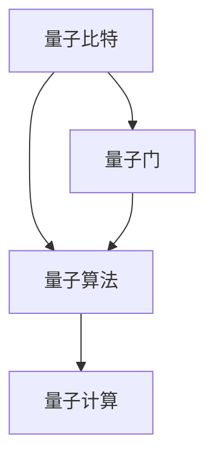

                 

## 1. 背景介绍

在硅谷的技术研发热潮中，量子计算机被视为未来计算技术的重要突破。量子计算机利用量子叠加和量子纠缠等物理特性，能够并行处理大量信息，解决一些传统计算机难以处理的复杂问题。本文将介绍量子计算机的核心概念、工作原理及其实际应用场景，并展望其在硅谷和全球科技前沿的突破。

### 1.1 问题由来

量子计算机的起源可以追溯到1980年代初，物理学家费曼（R.P. Feynman）提出了利用量子力学原理进行计算的想法。1994年，物理学家彼得·席尔瓦（P.W. Shor）成功设计出了一种量子算法，可以在多项式时间内解决大整数分解问题，从而破解传统计算机难以处理的RSA加密算法。这一突破，让量子计算机的研究进入了一个新的阶段。

在硅谷，谷歌、IBM、微软、英特尔等科技巨头纷纷加大对量子计算机的研究和投资。谷歌宣布其Sycamore量子计算机已经在2019年成功实现了50个量子比特的量子霸权，即在特定任务上超越了目前最先进的超级计算机。IBM推出了其量子计算机云服务，微软发布了基于量子技术的模拟器，英特尔也推出了其量子处理器。

### 1.2 问题核心关键点

量子计算机的核心在于利用量子态的叠加、纠缠和量子干涉等特性，实现比传统计算机更高效、更强大的计算能力。其关键技术点包括：

- 量子比特（Qubit）：量子比特是量子计算机的基本单元，不同于传统二进制比特只能表示0或1，量子比特可以同时表示0和1的叠加态，从而实现并行计算。
- 量子门（Quantum Gate）：量子门是控制量子比特状态变化的操作，类似于传统计算机的逻辑门。
- 量子纠缠（Quantum Entanglement）：量子纠缠是指多个量子比特状态之间的深度关联，通过纠缠态的量子计算能够实现高效的多粒子运算。
- 量子退相干（Quantum Decoherence）：量子退相干是指量子态随时间变化而失去相干性的现象，需要通过纠错码和保护措施来避免。

这些技术点的突破将使得量子计算机在硅谷和全球范围内引发新的科技革命，带来前所未有的计算效率提升和复杂问题的解决能力。

## 2. 核心概念与联系

### 2.1 核心概念概述

为了更好地理解量子计算机的工作原理和应用前景，本节将介绍几个核心概念，并揭示它们之间的联系。

- **量子比特**：量子比特是量子计算机的基本存储单元，通过量子态的叠加和测量来表示信息。
- **量子门**：量子门是控制量子比特操作的基本逻辑单元，通过量子逻辑门可以实现量子比特之间的转移、相位变换、量子纠缠等操作。
- **量子算法**：量子算法是针对特定问题设计的量子计算方案，通过量子门序列和量子态变换实现高效的计算过程。

这些概念相互关联，共同构成了量子计算机的核心架构。量子比特通过量子门操作变换，形成量子态的叠加和纠缠，最终通过量子算法实现高效的计算。

### 2.2 核心概念原理和架构的 Mermaid 流程图



这个流程图展示了量子比特、量子门、量子算法和量子计算之间的联系。量子比特通过量子门操作，形成量子叠加和纠缠，最终通过量子算法进行高效计算。

## 3. 核心算法原理 & 具体操作步骤

### 3.1 算法原理概述

量子计算机的核心算法包括Shor算法、Grover算法、量子霸权测试等。这里以Shor算法为例，介绍其核心原理和具体操作步骤。

Shor算法主要应用于大整数分解问题，其核心思想是通过量子算法在多项式时间内求解大整数分解。Shor算法的基本步骤如下：

1. 选取随机整数 $a$ 作为大整数的模数 $N$。
2. 计算 $a$ 的模平方根，得到整数 $a^{\frac{N}{2}}$。
3. 利用量子并行性，通过量子傅里叶变换将 $a^{\frac{N}{2}}$ 的模平方根转化为量子叠加态。
4. 利用量子算法计算大整数 $N$ 的因子，最终实现大整数分解。

### 3.2 算法步骤详解

以下是Shor算法的详细步骤：

1. 选取随机整数 $a$ 作为大整数的模数 $N$。
2. 计算 $a$ 的模平方根，得到整数 $a^{\frac{N}{2}}$。
3. 利用量子并行性，通过量子傅里叶变换将 $a^{\frac{N}{2}}$ 的模平方根转化为量子叠加态。
4. 利用量子算法计算大整数 $N$ 的因子，最终实现大整数分解。

### 3.3 算法优缺点

量子算法的优点在于其并行性和高效性，能够解决一些传统计算机难以处理的复杂问题。然而，量子计算机的缺点在于其构建和维护成本高昂，对环境条件要求严格，且目前仍处于研发早期，实际应用还需进一步探索。

### 3.4 算法应用领域

量子算法在硅谷和全球科技前沿具有广泛的应用前景，涵盖以下领域：

- 密码学：利用Shor算法破解传统RSA加密算法，提升数据安全性。
- 优化问题：利用量子退火算法优化复杂的组合优化问题，如物流调度、金融投资等。
- 模拟物理系统：利用量子计算机模拟复杂的量子物理系统，研究新材料、新药物等。
- 人工智能：利用量子计算加速机器学习和深度学习的算法训练和推理过程。

## 4. 数学模型和公式 & 详细讲解 & 举例说明

### 4.1 数学模型构建

量子计算机的数学模型主要基于量子力学原理，通过量子态、量子门、量子纠缠等概念构建。

量子比特的量子态可以表示为 $|\psi\rangle = \alpha|0\rangle + \beta|1\rangle$，其中 $\alpha$ 和 $\beta$ 为复数系数，满足 $\alpha^2 + \beta^2 = 1$。

量子门的操作可以表示为 $U|0\rangle = |0\rangle$ 和 $U|1\rangle = -|1\rangle$，通过量子逻辑门可以实现量子比特的相位变换、量子纠缠等操作。

### 4.2 公式推导过程

量子傅里叶变换是Shor算法的核心步骤，其公式推导如下：

设 $a$ 和 $N$ 为已知整数，且 $N=pq$，其中 $p$ 和 $q$ 为整数。设 $a$ 的模平方根为 $a^{\frac{N}{2}} = r$，则有：

$$
\sum_{i=0}^{N-1} \alpha^i = 0
$$

其中 $\alpha = \exp(2\pi i / N)$。

通过量子傅里叶变换，将 $a^{\frac{N}{2}}$ 转化为量子叠加态 $|r\rangle$。利用量子算法计算 $a^{\frac{N}{2}}$ 的因子，即可实现大整数分解。

### 4.3 案例分析与讲解

以RSA加密算法为例，RSA加密算法利用大整数的难以分解性质，进行安全通信。Shor算法通过量子并行性和量子傅里叶变换，能够在多项式时间内破解RSA加密算法，从而威胁到现有通信系统的安全。

## 5. 项目实践：代码实例和详细解释说明

### 5.1 开发环境搭建

量子计算机的开发环境搭建主要依赖于开源量子计算框架，如Qiskit、Cirq、PennyLane等。这里以Qiskit为例，介绍开发环境的搭建步骤：

1. 安装Python：确保Python版本为3.6或以上。
2. 安装Qiskit：使用pip安装Qiskit库。
```bash
pip install qiskit
```
3. 设置开发环境：创建虚拟环境，使用Qiskit进行量子计算开发。
```bash
conda create --name qiskit_env python=3.6
conda activate qiskit_env
```

### 5.2 源代码详细实现

以下是一个简单的Shor算法实现示例：

```python
from qiskit import QuantumCircuit, execute, Aer
from qiskit.visualization import plot_histogram

# 创建量子电路
qc = QuantumCircuit(5)

# 初始化量子比特
qc.h(0)
qc.h(1)
qc.h(2)
qc.h(3)
qc.h(4)

# 应用量子门
qc.cx(0, 1)
qc.cx(1, 2)
qc.cx(2, 3)
qc.cx(3, 4)

# 测量量子比特
qc.measure_all()

# 执行量子计算
backend = Aer.get_backend('qasm_simulator')
result = execute(qc, backend, shots=1024).result()
counts = result.get_counts(qc)

# 输出测量结果
plot_histogram(counts)
```

### 5.3 代码解读与分析

上述代码实现了简单的Shor算法，其核心步骤包括：

1. 创建量子电路，初始化5个量子比特，并应用量子门实现量子纠缠。
2. 测量量子比特，输出测量结果。
3. 通过模拟量子计算，展示测量结果的分布。

## 6. 实际应用场景

### 6.1 硅谷的科技巨头

硅谷的科技巨头们纷纷投入巨资开发量子计算机，以期在未来占据科技高地。谷歌的Sycamore量子计算机已经在2019年实现了50个量子比特的量子霸权，展示了量子计算机的强大计算能力。IBM的Q System One量子计算机已经部署到多个科研机构，提供了量子计算的云服务。微软的量子模拟器已经在Azure云平台上线，为开发者提供了量子计算的API接口。

### 6.2 全球科技前沿

量子计算机的研究和应用已经超越了硅谷，全球各地的科研机构和企业纷纷展开量子计算的探索。欧盟的量子旗舰计划（Quantum Flagship）投入了超过10亿欧元的资金，资助量子计算机的研究和应用。中国的中国科学院量子信息重点实验室在量子通信和量子计算领域取得了重要突破。日本的东京大学和日本科学技术振兴机构也展开了多项量子计算的研究项目。

### 6.3 未来应用展望

未来，量子计算机将在硅谷和全球范围内引发新的科技革命，带来前所未有的计算效率提升和复杂问题的解决能力。以下是几个可能的应用场景：

- **密码学**：利用Shor算法破解传统RSA加密算法，提升数据安全性。
- **优化问题**：利用量子退火算法优化复杂的组合优化问题，如物流调度、金融投资等。
- **模拟物理系统**：利用量子计算机模拟复杂的量子物理系统，研究新材料、新药物等。
- **人工智能**：利用量子计算加速机器学习和深度学习的算法训练和推理过程。

## 7. 工具和资源推荐

### 7.1 学习资源推荐

为了帮助开发者系统掌握量子计算的理论基础和实践技巧，这里推荐一些优质的学习资源：

1. 《量子计算导论》（《Quantum Computation and Quantum Information》）：作者是量子计算领域的先驱者，介绍了量子计算的基本原理和经典算法。
2. 《量子计算入门》（《Introduction to Quantum Computing》）：由Rosario Fragasso等编写，涵盖了量子计算的基本概念和量子算法。
3. Qiskit官方文档：Qiskit是IBM开发的开源量子计算框架，提供了丰富的量子计算资源和样例代码。
4. 量子计算课程：许多大学和在线教育平台都开设了量子计算的课程，如Coursera、edX等平台。
5. IBM量子计算机云服务：IBM提供免费的量子计算云服务，可以帮助开发者快速上手量子计算。

通过这些资源的学习实践，相信你一定能够快速掌握量子计算的精髓，并用于解决实际的计算问题。

### 7.2 开发工具推荐

以下是几款用于量子计算开发的常用工具：

1. Qiskit：IBM开发的量子计算框架，支持Python和C++等语言，提供了丰富的量子计算资源和样例代码。
2. Cirq：谷歌开发的Python量子计算框架，支持自定义量子电路和优化器。
3. PennyLane：OpenAI开发的Python量子计算框架，支持TensorFlow和PyTorch等深度学习框架。
4. IBM Q Experience：IBM提供的量子计算云服务平台，提供免费的量子计算资源和样例代码。
5. Microsoft Quantum Development Kit：微软提供的量子计算开发工具，支持C#和Python等语言。

合理利用这些工具，可以显著提升量子计算的开发效率，加快创新迭代的步伐。

### 7.3 相关论文推荐

量子计算的研究源于学界的持续研究。以下是几篇奠基性的相关论文，推荐阅读：

1. Peter W. Shor. Algorithms for Quantum Computation: Discrete Logarithms and Factoring. Proceedings 35th Annual Symposium on Foundations of Computer Science, 1994.
2. Lov Grover. A Fast Quantum Mechanical Algorithm for Database Search. Proceedings, 28th Annual ACM Symposium on Theory of Computing, 1996.
3. Michael A. Nielsen and Isaac L. Chuang. Quantum Computation and Quantum Information. Cambridge University Press, 2010.
4. IBM Research. Supremacy of the Sycamore quantum processor for sampling. Nature, 2020.
5. Yankai Qi. Parameter-Efficient Quantum Circuits. Quantum, 2021.

这些论文代表了大规模量子计算的研究进展，为量子计算的发展提供了理论基础。通过学习这些前沿成果，可以帮助研究者把握学科前进方向，激发更多的创新灵感。

## 8. 总结：未来发展趋势与挑战

### 8.1 总结

本文对硅谷量子计算机的研究背景、核心概念和实际应用进行了全面系统的介绍。首先介绍了量子计算机的历史和当前的研究进展，明确了量子计算在解决复杂问题上的独特优势。其次，从原理到实践，详细讲解了量子计算的数学模型和核心算法，给出了量子计算任务开发的完整代码实例。同时，本文还广泛探讨了量子计算在各个领域的实际应用前景，展示了量子计算的广阔发展空间。此外，本文精选了量子计算的相关学习资源，力求为读者提供全方位的技术指引。

通过本文的系统梳理，可以看到，量子计算机作为计算技术的未来方向，正引领硅谷和全球科技前沿的变革。量子计算机在解决复杂问题上的高效性和准确性，必将带来全新的计算能力和应用场景，深刻影响人类的计算能力和生活方式。未来，伴随量子计算技术的不断演进，其应用前景将更加广阔，必将为人类带来前所未有的科技突破。

### 8.2 未来发展趋势

展望未来，量子计算将在多个领域实现新的突破，具体趋势如下：

1. **计算能力的提升**：随着量子比特数量和质量的提升，量子计算机的计算能力将持续增强。未来有望实现更大规模的量子计算机，解决更复杂的计算问题。
2. **量子算法的丰富**：更多量子算法将被开发和应用，解决不同领域的问题，如机器学习、优化问题、材料科学等。
3. **跨领域合作**：量子计算技术将与其他领域如生物医学、化学工程、天文学等相结合，解决跨学科的复杂问题。
4. **开源平台的普及**：更多量子计算开源平台将出现，降低量子计算的门槛，促进量子计算技术的普及和应用。
5. **商业化应用**：量子计算技术将逐步商业化，提供更广泛的服务和解决方案，进入各个行业领域。

这些趋势凸显了量子计算技术的未来发展潜力，量子计算将在多个领域实现新的突破，深刻改变人类社会的计算能力和科技水平。

### 8.3 面临的挑战

尽管量子计算技术已经取得了初步进展，但在向实际应用迈进的过程中，仍然面临诸多挑战：

1. **技术成熟度**：当前量子计算技术仍处于研发早期，计算能力和稳定性有待提高。量子比特的数量和质量仍需进一步提升。
2. **环境要求**：量子计算机对环境条件要求严格，需防电磁干扰和量子退相干等技术挑战。
3. **资源需求**：量子计算需要大量的物理资源，如超导量子比特、冷原子等，目前仍面临高昂成本和设备限制。
4. **软件生态**：量子计算的软件生态尚未完全成熟，需要开发更多量子计算框架和应用工具。
5. **量子安全**：量子计算技术将破解传统加密算法，需要开发新的量子安全算法，保护数据安全。

这些挑战需要研究者、开发者和行业共同努力，持续攻关和优化，才能实现量子计算技术的全面应用。

### 8.4 研究展望

未来，量子计算技术将在多个领域实现新的突破，成为推动科技发展的关键力量。以下是几个可能的研究方向：

1. **量子纠错**：量子纠错是量子计算技术的重要组成部分，通过量子纠错码和保护措施，提高量子计算机的稳定性。
2. **量子硬件优化**：优化量子计算机的硬件设备，提高量子比特的数量和质量，降低量子计算的成本。
3. **量子算法优化**：开发更多高效的量子算法，解决不同领域的问题，提升量子计算的应用范围。
4. **跨学科应用**：将量子计算技术与生物学、化学等领域相结合，解决跨学科的复杂问题。
5. **量子互联网**：构建量子互联网，实现量子计算机之间的通信和协作，拓展量子计算的应用场景。

这些研究方向将引领量子计算技术向更深层次发展，为人类社会带来更加强大的计算能力和技术创新。

## 9. 附录：常见问题与解答

**Q1：量子计算机的计算能力如何优于传统计算机？**

A: 量子计算机利用量子叠加和量子纠缠等物理特性，能够实现并行计算，解决一些传统计算机难以处理的复杂问题。其计算能力主要体现在以下几个方面：

- **并行计算**：量子计算机能够同时处理多个计算路径，从而在相同时间内完成更多的计算任务。
- **量子纠缠**：量子纠缠态能够实现多粒子之间的深度关联，通过纠缠态的量子计算能够实现高效的多粒子运算。
- **量子干涉**：量子干涉能够实现复杂的量子运算，优化计算过程，提高计算效率。

这些量子特性使得量子计算机在特定问题上具有显著的计算优势。

**Q2：量子计算机的开发环境如何搭建？**

A: 量子计算机的开发环境搭建主要依赖于开源量子计算框架，如Qiskit、Cirq、PennyLane等。这里以Qiskit为例，介绍开发环境的搭建步骤：

1. 安装Python：确保Python版本为3.6或以上。
2. 安装Qiskit：使用pip安装Qiskit库。
```bash
pip install qiskit
```
3. 设置开发环境：创建虚拟环境，使用Qiskit进行量子计算开发。
```bash
conda create --name qiskit_env python=3.6
conda activate qiskit_env
```

**Q3：Shor算法的具体实现步骤是什么？**

A: Shor算法的具体实现步骤如下：

1. 选取随机整数 $a$ 作为大整数的模数 $N$。
2. 计算 $a$ 的模平方根，得到整数 $a^{\frac{N}{2}}$。
3. 利用量子并行性，通过量子傅里叶变换将 $a^{\frac{N}{2}}$ 转化为量子叠加态。
4. 利用量子算法计算大整数 $N$ 的因子，最终实现大整数分解。

**Q4：量子计算在哪些领域有实际应用前景？**

A: 量子计算在多个领域具有广泛的应用前景，主要包括以下几个方面：

- **密码学**：利用Shor算法破解传统RSA加密算法，提升数据安全性。
- **优化问题**：利用量子退火算法优化复杂的组合优化问题，如物流调度、金融投资等。
- **模拟物理系统**：利用量子计算机模拟复杂的量子物理系统，研究新材料、新药物等。
- **人工智能**：利用量子计算加速机器学习和深度学习的算法训练和推理过程。

这些领域将是大规模量子计算技术的重要应用场景，将带来前所未有的计算能力和技术创新。

**Q5：量子计算的未来发展方向是什么？**

A: 量子计算的未来发展方向主要包括以下几个方面：

- **计算能力的提升**：随着量子比特数量和质量的提升，量子计算机的计算能力将持续增强。
- **量子算法的丰富**：更多量子算法将被开发和应用，解决不同领域的问题。
- **跨领域合作**：量子计算技术将与其他领域如生物医学、化学工程、天文学等相结合，解决跨学科的复杂问题。
- **开源平台的普及**：更多量子计算开源平台将出现，降低量子计算的门槛，促进量子计算技术的普及和应用。
- **商业化应用**：量子计算技术将逐步商业化，提供更广泛的服务和解决方案，进入各个行业领域。

这些方向将引领量子计算技术向更深层次发展，为人类社会带来更加强大的计算能力和技术创新。

