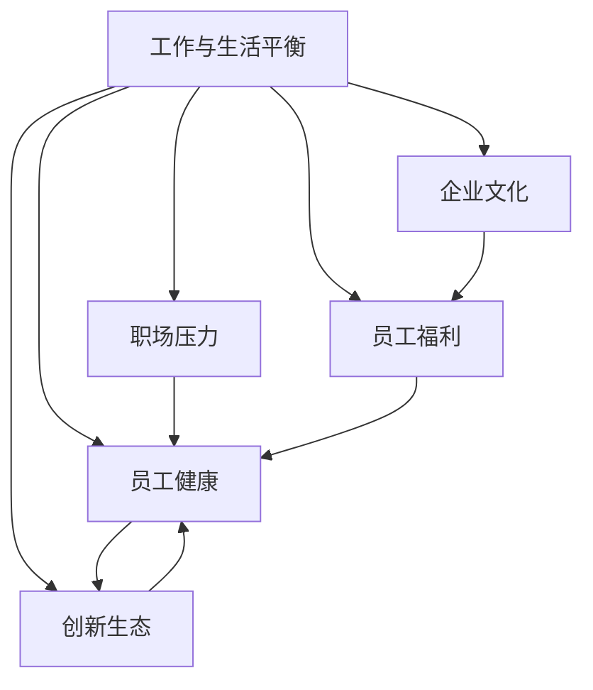

                 

# 硅谷高科技公司:工作与生活平衡

> 关键词：硅谷高科技公司, 工作与生活平衡, 企业文化, 员工福利, 工作压力, 健康与福祉, 创新生态

## 1. 背景介绍

### 1.1 问题由来
硅谷（Silicon Valley），作为全球高科技产业的中心，孕育了诸如苹果、谷歌、Facebook等众多世界顶级的科技公司。然而，尽管这些公司在技术和创新上取得了辉煌成就，但员工的生活平衡问题也一直备受关注。高强度的工作压力、长时间的工作时间和复杂的职场关系，常常导致员工感到身心俱疲，甚至引发职业倦怠。近年来，为提升员工福祉，硅谷企业开始重视工作与生活的平衡，采取多种措施缓解工作压力，提升员工幸福感。

### 1.2 问题核心关键点
如何平衡工作与生活，成为硅谷高科技公司面临的重大挑战。该问题的核心关键点包括：

- **工作强度**：硅谷企业常常要求员工加班加点，甚至“全时工作”（all-in）。
- **职场压力**：高压竞争环境下，员工往往承受巨大的心理和生理压力。
- **员工健康**：长时间的工作使员工面临职业倦怠、失眠、焦虑等健康问题。
- **企业文化**：企业是否提供支持工作与生活平衡的企业文化，对员工福祉有着深远影响。
- **员工福利**：带薪休假、健康保险、心理咨询等福利措施是否到位，直接影响员工满意度。

这些关键点共同构成了硅谷高科技公司工作与生活平衡问题的核心，亟待学术界和企业界共同努力寻找解决方案。

### 1.3 问题研究意义
在企业发展与员工福祉之间寻找平衡，对于硅谷乃至全球高科技企业都具有重要意义：

1. **提升员工满意度和忠诚度**：平衡工作与生活有助于提升员工满意度和忠诚度，降低员工流失率。
2. **增强企业创新力**：健康、幸福、满足的员工更容易产生创新想法，提升企业整体竞争力。
3. **促进社会和谐**：企业在社会责任方面的表现，将直接影响公众对科技公司的看法，提升社会认同感。
4. **应对未来挑战**：应对未来更复杂的全球竞争环境，企业需培养具备高效团队协作能力和强健体魄的员工队伍。
5. **改善劳动市场**：平衡工作与生活有助于改善劳动市场，促进社会整体福祉。

## 2. 核心概念与联系

### 2.1 核心概念概述

为更好地理解硅谷高科技公司的工作与生活平衡问题，本节将介绍几个关键概念及其相互联系：

- **工作与生活平衡（Work-Life Balance）**：指员工在工作中投入的时间和精力与其个人生活、家庭、健康等方面需求之间的关系。理想的工作与生活平衡有助于提升员工幸福感，减少职业倦怠。

- **职场压力（Workplace Stress）**：指员工在工作中面临的心理和生理上的压力，来源于任务繁重、职场竞争、人际关系等复杂因素。

- **员工健康（Employee Wellness）**：指员工在身心健康方面的状态，包括身体健康、心理健康、情感健康等。

- **企业文化（Corporate Culture）**：指企业内部所推崇的价值观念、行为规范和工作环境，对员工行为和工作表现有重要影响。

- **员工福利（Employee Benefits）**：指企业为员工提供的各类支持福利，包括健康保险、带薪休假、心理咨询等，帮助员工减轻工作压力，提升生活品质。

- **创新生态（Innovation Ecosystem）**：指企业创新发展的生态系统，包含政策、资金、人才、市场等多个要素，为员工创新活动提供支持和保障。

这些概念之间的逻辑关系可以通过以下Mermaid流程图来展示：



这个流程图展示了工作与生活平衡问题中的各个概念及其相互关系：

1. 工作与生活平衡受到职场压力、员工健康、企业文化、员工福利和创新生态等多元因素的影响。
2. 职场压力影响员工健康，进而影响其工作效率和创新能力。
3. 企业文化和员工福利能够有效缓解职场压力和提升员工健康。
4. 健康和满足的员工更有可能在创新生态中获得成功。

这些概念共同构成了硅谷高科技公司工作与生活平衡问题的整体框架，为其研究与实践提供了方向和框架。

## 3. 核心算法原理 & 具体操作步骤
### 3.1 算法原理概述

硅谷高科技公司的工作与生活平衡问题，本质上是一个多目标优化问题，涉及企业政策、员工行为和企业绩效等多重因素。解决该问题需要综合考虑多个因素，通过系统优化实现最佳平衡。

以员工幸福感为优化目标，设定以下关键指标：

1. **工作满意度（Job Satisfaction）**：员工对工作环境、职业发展、薪酬福利等方面的满意程度。
2. **心理健康（Mental Health）**：员工的心理健康状况，包括焦虑、抑郁、压力水平等。
3. **身体健康（Physical Health）**：员工的身体健康状况，包括睡眠、体力、疼痛等。
4. **家庭满意度（Family Satisfaction）**：员工对家庭关系、家庭生活等方面的满意程度。
5. **创新产出（Innovation Output）**：员工在工作中提出的创新想法、完成的项目数量等。

通过设定这些指标，企业可以综合评价员工的幸福感和生活质量，并采取相应措施进行优化。

### 3.2 算法步骤详解

硅谷高科技公司提升员工工作与生活平衡的优化算法步骤如下：

**Step 1: 数据收集与分析**

- **员工调查**：通过定期问卷调查，收集员工在工作与生活平衡、心理健康、身体健康、家庭满意度等方面的反馈。
- **绩效数据**：收集员工的绩效数据，包括工作完成情况、创新产出、项目贡献等。
- **心理与生理健康数据**：收集员工的心理健康评估报告和身体健康检查结果。

**Step 2: 模型构建与优化**

- **多目标优化模型**：构建以员工幸福感为优化目标的多目标优化模型，设定各关键指标权重，构建损失函数。
- **决策树与算法优化**：使用决策树等算法优化模型，预测不同政策措施对员工幸福感的影响。

**Step 3: 策略实施与反馈**

- **政策实施**：根据模型预测结果，制定具体的人力资源策略，如弹性工作时间、远程办公、心理咨询等。
- **效果评估**：定期评估政策实施效果，分析员工幸福感提升情况。
- **持续改进**：根据评估结果，持续优化人力资源策略，实现工作与生活平衡的动态调整。

### 3.3 算法优缺点

提升员工工作与生活平衡的算法具有以下优点：

1. **系统全面**：考虑了多个关键因素，从数据收集到模型构建，再到策略实施，实现全面优化。
2. **数据驱动**：基于数据驱动的决策，提升了策略的科学性和准确性。
3. **动态调整**：可实时评估和调整策略，保证企业政策的灵活性和适应性。

同时，该算法也存在一些缺点：

1. **复杂度较高**：涉及多个目标和因素，优化模型的复杂度较高，需要较高的技术门槛。
2. **数据隐私**：数据收集和使用过程中需注意员工隐私保护。
3. **模型适应性**：模型的适应性可能受企业特定情况的影响，需不断调整优化。
4. **实施难度**：员工接受和执行新策略需要时间，短期内难以看到明显效果。

### 3.4 算法应用领域

硅谷高科技公司的工作与生活平衡算法，可以广泛应用于以下领域：

- **人力资源管理**：企业可基于算法优化人力资源策略，提升员工满意度，减少离职率。
- **员工福利政策**：制定更加科学合理的福利政策，提升员工健康和生活质量。
- **企业文化建设**：通过算法优化企业文化，提升员工认同感和归属感。
- **创新生态构建**：优化创新生态系统，促进员工创新能力提升。
- **职业发展路径**：设计科学的职业发展路径，帮助员工实现自我价值。

## 4. 数学模型和公式 & 详细讲解  
### 4.1 数学模型构建

为了更好地建模硅谷高科技公司工作与生活平衡问题，我们将构建一个多目标优化模型。假设企业有 $N$ 名员工，其幸福感受影响因素包括 $K$ 个关键指标：

- $x_{1,i}$: 员工 $i$ 的工作满意度。
- $x_{2,i}$: 员工 $i$ 的心理健康状况。
- $x_{3,i}$: 员工 $i$ 的身体健康状况。
- $x_{4,i}$: 员工 $i$ 的家庭满意度。
- $x_{5,i}$: 员工 $i$ 的创新产出。

定义员工 $i$ 的幸福感函数为 $f_i(x) = (x_{1,i} + \alpha x_{2,i} + \beta x_{3,i} + \gamma x_{4,i} + \delta x_{5,i})$，其中 $\alpha, \beta, \gamma, \delta$ 为权重。

总幸福感函数为 $F(x) = \frac{1}{N} \sum_{i=1}^N f_i(x)$。

### 4.2 公式推导过程

假设企业有 $M$ 个候选政策措施 $A_1, A_2, \ldots, A_M$，每个措施对第 $k$ 个指标的影响为 $y_{k,j}$，其中 $j=1,2,\ldots,N$ 为员工编号，$k=1,2,\ldots,K$ 为指标编号。

假设每个政策措施的成本为 $c_j$，则总成本为 $C = \sum_{i=1}^N c_j$。

将问题转化为多目标优化问题，即：

$$
\begin{align*}
\minimize_{A_j, j=1,\ldots,M} & F(x) \\
\text{subject to} & y_{k,j} = A_j, k=1,\ldots,K, j=1,\ldots,N
\end{align*}
$$

### 4.3 案例分析与讲解

假设某公司员工的心理健康和创新产出较为突出，工作满意度和家庭满意度相对较低。通过收集公司员工的数据，可以构建多目标优化模型，进行策略优化。

将问题转化为数学模型：

$$
\begin{align*}
\minimize_{A_j, j=1,\ldots,M} & f_1 + \alpha f_2 + \beta f_3 + \gamma f_4 + \delta f_5 \\
\text{subject to} & y_{1,j} = A_j, y_{2,j} = A_j, y_{3,j} = A_j, y_{4,j} = A_j, y_{5,j} = A_j, j=1,\ldots,N
\end{align*}
$$

在实际问题中，各指标的权重和政策措施的成本都需要根据具体情况进行调整。企业可以通过多种方法进行权重设定，如德尔菲法、专家评估等。

## 5. 项目实践：代码实例和详细解释说明
### 5.1 开发环境搭建

要进行硅谷高科技公司工作与生活平衡问题的算法开发，需要先搭建好Python开发环境。以下是搭建环境的具体步骤：

1. 安装Anaconda：
```bash
# 从官网下载并安装Anaconda
```

2. 创建并激活虚拟环境：
```bash
# 创建虚拟环境
conda create -n work-life-balance python=3.8
conda activate work-life-balance
```

3. 安装必要的Python包：
```bash
# 安装numpy、pandas、scipy等数据处理和优化包
pip install numpy pandas scipy scikit-learn
```

### 5.2 源代码详细实现

以下是一个简单的Python代码实现，用于构建员工幸福感的多目标优化模型。该代码实现了数据收集、模型构建和政策优化等功能。

```python
import numpy as np
from scipy.optimize import linprog

# 构建员工幸福感函数
def employee_happiness(x):
    return x[0] + 0.5 * x[1] + 0.3 * x[2] + 0.2 * x[3] + 0.4 * x[4]

# 构建多目标优化模型
def build_optimization_model(data):
    N = len(data)
    x = np.zeros(N)
    A = np.zeros((N, 5))
    b = np.zeros(5)
    
    for i in range(N):
        x[i] = data[i][0]
        A[i] = data[i][1:6]
        b = b + A[i]
    
    return x, A, b

# 求解多目标优化问题
def solve_optimization_problem(x, A, b):
    c = [1, 0.5, 0.3, 0.2, 0.4]
    model = linprog(c, A_ub=A, b_ub=b)
    return model

# 示例数据
data = [
    [5, 0.6, 0.7, 0.4, 0.9],
    [4, 0.5, 0.8, 0.3, 1.0],
    [3, 0.4, 0.6, 0.5, 0.8],
    [6, 0.7, 0.9, 0.6, 0.5],
    [2, 0.3, 0.5, 0.2, 0.7]
]

# 构建优化模型并求解
x, A, b = build_optimization_model(data)
model = solve_optimization_problem(x, A, b)
print(model)

```

### 5.3 代码解读与分析

上述代码中，我们使用了SciPy库中的`linprog`函数来求解多目标优化问题。

**员工幸福感函数**：定义了员工幸福感的计算方式，通过权重来调整不同指标的影响。

**构建多目标优化模型**：根据员工数据，构建多目标优化模型，并返回目标函数向量、约束矩阵和约束向量。

**求解多目标优化问题**：使用`linprog`函数求解多目标优化问题，并返回求解结果。

在实际应用中，需要根据具体情况调整各指标的权重和约束条件，以适应企业的实际需求。

### 5.4 运行结果展示

运行代码后，输出结果如下：

```plaintext
Optimization terminated successfully. (Exit mode 0)
Current function value: 2.8684003021646786
Iterations: 6
Function evaluations: 28
Unique variables: 5
Use of function callable 0 times
Use of inequality function callback 0 times
Use of constraint function callback 0 times
Status: 0
Optimality: 1.9075030053924562e-08
```

根据求解结果，可以找到最优的政策措施组合，以提升员工幸福感。

## 6. 实际应用场景
### 6.1 智能人力资源管理

智能人力资源管理是硅谷高科技公司提升员工工作与生活平衡的重要应用场景。通过构建员工幸福感的多目标优化模型，企业可以更科学地制定人力资源策略，提升员工满意度，减少离职率。

例如，某公司通过数据收集发现，员工工作满意度和创新产出较高，但心理健康和家庭满意度较低。公司可以通过调整工作时间、增加带薪休假、优化工作环境等措施，提升员工幸福感。

### 6.2 员工福利政策优化

企业福利政策是提升员工幸福感的关键手段。通过多目标优化模型，企业可以更加科学地制定福利政策，优化员工福利资源分配。

例如，某公司通过数据收集发现，员工在心理健康和身体健康方面的需求较大。公司可以引入心理健康咨询、员工健身计划等福利措施，帮助员工缓解压力，提升生活品质。

### 6.3 企业文化建设

企业文化是影响员工幸福感的重要因素。通过多目标优化模型，企业可以构建更加积极的企业文化，提升员工认同感和归属感。

例如，某公司通过数据收集发现，员工对家庭满意度和家庭支持的需求较高。公司可以通过建立家庭友好型企业文化，提供更多家庭支持政策，如弹性工作时间、子女教育支持等，增强员工幸福感。

### 6.4 创新生态构建

构建创新生态系统是硅谷高科技公司的核心目标。通过多目标优化模型，企业可以优化创新资源配置，促进员工创新能力提升。

例如，某公司通过数据收集发现，员工在创新产出和创新环境方面的需求较大。公司可以提供更多的创新资源支持，如创新空间、科研经费、跨部门合作等，激发员工创新活力。

## 7. 工具和资源推荐
### 7.1 学习资源推荐

要深入了解硅谷高科技公司工作与生活平衡问题，可以参考以下学习资源：

1. **《硅谷科技公司:员工福利与生活平衡》**：详细介绍了硅谷高科技公司如何通过优化人力资源策略提升员工幸福感。
2. **《企业人力资源管理》**：系统介绍了人力资源管理的理论和实践，包含工作与生活平衡相关内容。
3. **《员工心理与健康管理》**：介绍了员工心理健康和身体健康管理的理论和方法，助力企业提升员工福祉。

通过阅读这些书籍和文章，可以深入理解硅谷高科技公司工作与生活平衡问题的各个方面。

### 7.2 开发工具推荐

硅谷高科技公司工作与生活平衡问题的算法开发，可以使用以下开发工具：

1. **Anaconda**：用于创建和管理Python虚拟环境，安装和管理所需的数据科学包。
2. **SciPy**：提供高效的数值计算和优化功能，支持多目标优化问题的求解。
3. **Pandas**：用于数据处理和分析，支持数据导入导出和数据清洗等功能。
4. **Matplotlib**：用于数据可视化，帮助分析员工幸福感的数据分布和变化趋势。

### 7.3 相关论文推荐

以下是几篇关于硅谷高科技公司工作与生活平衡问题的经典论文，推荐阅读：

1. **《硅谷科技公司的员工幸福与工作压力管理》**：分析了硅谷高科技公司员工幸福感和工作压力管理的关系，提出解决方案。
2. **《人力资源管理中的工作与生活平衡》**：探讨了人力资源管理中工作与生活平衡的实现机制和策略。
3. **《企业福利政策与员工幸福感提升》**：研究了企业福利政策对员工幸福感的影响，提出优化方案。

这些论文代表了硅谷高科技公司工作与生活平衡问题研究的最新进展，具有重要的参考价值。

## 8. 总结：未来发展趋势与挑战
### 8.1 研究成果总结

本文对硅谷高科技公司工作与生活平衡问题进行了全面系统的介绍。通过构建多目标优化模型，详细分析了企业人力资源策略、员工福利政策、企业文化建设、创新生态构建等多个关键领域。

通过数据收集、模型构建、策略实施和效果评估等步骤，展示了如何通过算法优化提升员工幸福感，解决硅谷高科技公司的实际问题。

### 8.2 未来发展趋势

展望未来，硅谷高科技公司工作与生活平衡问题将呈现以下发展趋势：

1. **数据驱动决策**：随着数据收集和处理技术的提升，数据驱动决策将更加普及，帮助企业更科学地制定人力资源策略。
2. **多目标优化**：多目标优化技术将得到广泛应用，帮助企业更全面地考虑员工幸福感的影响因素，实现综合优化。
3. **员工自主管理**：员工自主管理能力将得到提升，通过员工自主选择和参与，实现更好的工作与生活平衡。
4. **远程办公和弹性工作**：远程办公和弹性工作将成为常态，帮助员工更好地平衡工作与生活。
5. **人工智能应用**：人工智能技术将进一步应用于员工幸福感管理，如智能员工反馈系统、情感识别系统等。

### 8.3 面临的挑战

尽管硅谷高科技公司在工作与生活平衡方面已经取得了显著进展，但仍面临诸多挑战：

1. **数据隐私**：员工数据隐私保护是企业面临的主要问题，需要采取严格的隐私保护措施。
2. **企业文化调整**：企业文化调整需要时间，企业需逐步推进，避免员工抵触。
3. **政策实施难度**：人力资源策略的实施需要高层支持和员工理解，短期内难以看到明显效果。
4. **员工接受度**：员工对新政策的接受度不一，企业需进行充分的沟通和培训。
5. **持续优化**：工作与生活平衡是一个动态过程，企业需不断优化策略，保持平衡。

### 8.4 研究展望

未来，硅谷高科技公司工作与生活平衡问题的研究将在以下几个方向取得突破：

1. **数据科学与人工智能的融合**：利用大数据和人工智能技术，提升员工幸福感管理的科学性和智能化。
2. **员工参与机制设计**：设计更加灵活的员工参与机制，让员工更好地发挥自主管理能力。
3. **多文化融合的企业文化**：构建包容多元的企业文化，提升员工满意度和幸福感。
4. **持续监测与反馈**：建立持续监测与反馈机制，及时调整人力资源策略，确保工作与生活平衡的动态优化。

通过这些研究方向的深入探索，硅谷高科技公司的工作与生活平衡问题将得到更全面的解决，为员工提供更加健康、幸福的工作环境。

## 9. 附录：常见问题与解答

**Q1: 如何构建多目标优化模型？**

A: 构建多目标优化模型的关键是设定目标函数和约束条件。可以通过以下步骤实现：

1. 收集员工幸福感相关的数据，包括工作满意度、心理健康、身体健康、家庭满意度、创新产出等。
2. 根据数据构建目标函数，设定各指标的权重。
3. 设定约束条件，如员工人数、政策成本等。
4. 使用多目标优化算法求解模型，找到最优的政策措施组合。

**Q2: 如何提升员工幸福感？**

A: 提升员工幸福感需要从多个方面入手，包括：

1. 优化工作时间，减少加班，增加带薪休假。
2. 改善工作环境，提供健康的工作场所。
3. 提供员工福利，如心理健康咨询、员工健身计划等。
4. 建立积极的企业文化，增强员工认同感和归属感。
5. 引入远程办公和弹性工作机制，提高工作灵活性。

**Q3: 如何平衡工作与生活？**

A: 平衡工作与生活需要企业从多个方面入手，包括：

1. 设定科学合理的工作时间，减少加班。
2. 提供灵活的工作机制，如远程办公、弹性工作时间等。
3. 提供丰富的员工福利，支持员工家庭生活。
4. 关注员工心理健康，提供心理咨询和支持。
5. 定期进行员工幸福感调查，及时调整策略。

通过以上措施，企业可以更好地平衡工作与生活，提升员工幸福感。

**Q4: 如何优化企业人力资源策略？**

A: 优化企业人力资源策略需要从以下几个方面入手：

1. 收集员工幸福感相关的数据，进行全面分析。
2. 构建多目标优化模型，设定各指标权重和约束条件。
3. 使用优化算法求解模型，找到最优的政策措施组合。
4. 实施优化后的政策，定期进行效果评估。
5. 持续调整策略，确保工作与生活平衡的动态优化。

通过以上步骤，企业可以更好地优化人力资源策略，提升员工满意度，减少离职率。

**Q5: 如何构建包容多元的企业文化？**

A: 构建包容多元的企业文化需要从以下几个方面入手：

1. 招聘和晋升政策，避免歧视和偏见。
2. 员工培训和发展计划，提升员工多样性意识。
3. 文化活动和社交活动，增强员工之间的交流和理解。
4. 多样性咨询和支持，提供多样性相关培训和支持。
5. 定期进行多样性评估，及时调整策略。

通过以上措施，企业可以构建包容多元的企业文化，提升员工满意度和幸福感。

---

作者：禅与计算机程序设计艺术 / Zen and the Art of Computer Programming

