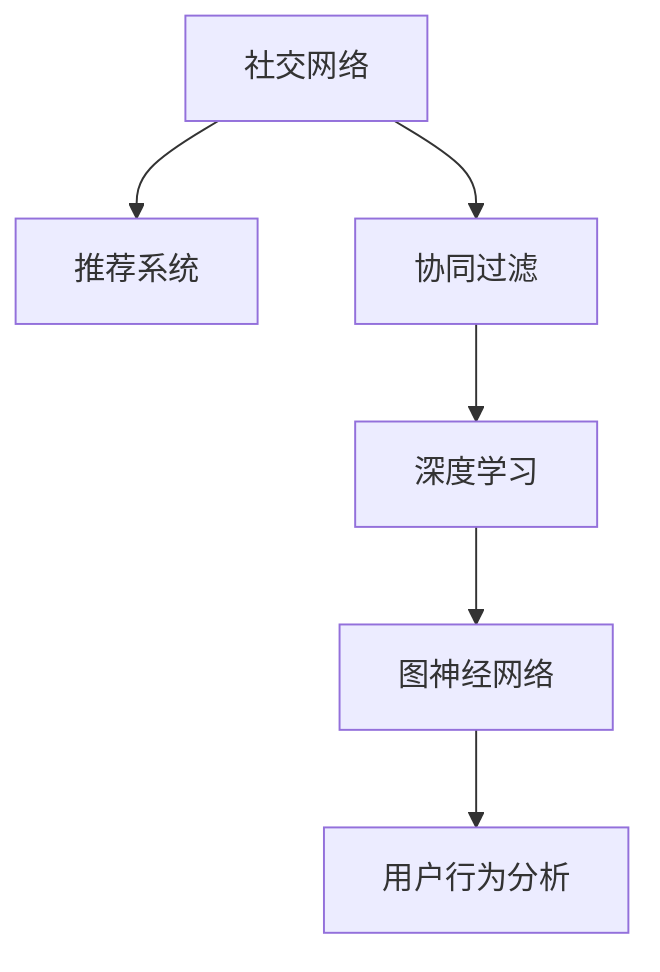

                 

# 社交网络推荐系统的进步：连接用户兴趣与社交关系

> 关键词：社交网络,推荐系统,协同过滤,深度学习,图神经网络,用户行为分析

## 1. 背景介绍

在当今信息爆炸的时代，社交网络推荐系统（Social Network Recommendation Systems）已成为互联网公司吸引用户、提升用户体验的关键手段之一。社交网络推荐系统不仅能够为用户提供个性化的信息流，还能够帮助用户发现潜在的朋友、推荐合适的文章或商品，甚至可以用于疾病预测、情感分析等高级应用。因此，构建高效、精准、灵活的社交网络推荐系统，对于挖掘用户价值、提升社交网络平台的用户粘性和活跃度具有重要意义。

然而，传统的基于内容的推荐方法已经无法满足用户日益增长的个性化需求。因此，越来越多的推荐系统开始采用协同过滤（Collaborative Filtering）技术，利用用户历史行为数据和社交关系信息进行推荐。协同过滤技术根据用户的历史行为数据和已有的社交关系，推荐与用户偏好相似的其他用户喜欢的内容或物品，从而实现更准确的推荐。

## 2. 核心概念与联系

### 2.1 核心概念概述

为更好地理解社交网络推荐系统的工作原理，本节将介绍几个核心概念：

- **社交网络**：指用户通过相互关注、点赞、评论等方式形成的基于关系的网络，如微信朋友圈、微博等。
- **推荐系统**：利用用户历史行为数据和偏好信息，为用户推荐其可能感兴趣的内容或物品的系统。
- **协同过滤**：根据用户行为数据和已有的社交关系，为相似用户推荐相似的物品或内容。
- **深度学习**：一种通过多层神经网络对数据进行学习和表示的技术，常用于构建复杂、高精度的推荐模型。
- **图神经网络**：一种用于处理图结构数据的神经网络，在社交网络推荐系统中被广泛应用。

这些核心概念之间的逻辑关系可以通过以下Mermaid流程图来展示：



这个流程图展示出社交网络推荐系统的核心概念及其之间的关系：

1. 社交网络作为推荐系统的数据来源，提供用户的社交关系和行为数据。
2. 协同过滤技术利用用户行为数据和社交关系信息，为用户推荐其感兴趣的内容。
3. 深度学习技术可以用于构建更加复杂的推荐模型，提高推荐精度。
4. 图神经网络适用于社交网络数据结构，能够挖掘社交网络中的深层关系和模式。
5. 用户行为分析能够挖掘用户的历史行为特征，提升推荐效果。

这些核心概念共同构成了社交网络推荐系统的基本框架，使得推荐系统能够从多个维度全面挖掘用户价值，实现更精准的推荐。

## 3. 核心算法原理 & 具体操作步骤

### 3.1 算法原理概述

社交网络推荐系统是一种基于协同过滤的推荐系统，它主要依赖于用户历史行为数据和社交关系信息。基于协同过滤的推荐系统一般包括以下几个关键步骤：

1. **用户画像建立**：收集用户的行为数据和社交关系数据，构建用户画像。
2. **相似度计算**：根据用户画像计算不同用户之间的相似度，一般采用余弦相似度或皮尔逊相关系数等指标。
3. **物品推荐**：根据相似度计算结果，为当前用户推荐与相似用户共同喜欢的物品或内容。

### 3.2 算法步骤详解

**Step 1: 用户画像建立**
- 收集用户的行为数据，如浏览、点赞、评论等。
- 收集用户的社交关系数据，如好友、关注等。
- 将行为数据和社交关系数据进行合并，构建用户画像。

**Step 2: 相似度计算**
- 对于每个用户，计算其与其他用户的相似度，一般采用余弦相似度或皮尔逊相关系数。
- 对于每个物品，计算其与其他物品的相似度，一般采用余弦相似度或欧式距离。
- 构建相似度矩阵，记录不同用户和物品之间的相似度。

**Step 3: 物品推荐**
- 对于当前用户，根据相似度矩阵，选取与其相似度最高的若干用户。
- 对于这些相似用户喜欢的物品，计算当前用户对该物品的评分。
- 选取评分较高的物品，作为当前用户的推荐结果。

### 3.3 算法优缺点

基于协同过滤的社交网络推荐系统具有以下优点：

- 利用用户之间的社交关系，推荐结果更加个性化和可信。
- 能够推荐用户可能感兴趣的物品，提升用户体验。
- 能够处理未标记数据，不需要大量的标注数据。

同时，该方法也存在一些局限性：

- 数据稀疏性问题：用户数据和物品数据可能比较稀疏，导致相似度计算不准确。
- 冷启动问题：新用户或新物品没有足够的历史行为数据，难以进行推荐。
- 过度依赖用户数据：推荐结果依赖于用户历史数据，当用户历史行为数据较少时，推荐效果不佳。

### 3.4 算法应用领域

基于协同过滤的社交网络推荐系统已经在诸多领域得到了广泛的应用，如电子商务、社交媒体、新闻推荐等。以下是一些典型的应用场景：

- **电商推荐**：根据用户的历史购买记录和浏览行为，为用户推荐可能感兴趣的商品。
- **社交媒体推荐**：根据用户的好友关系和互动行为，为用户推荐可能感兴趣的内容或好友。
- **新闻推荐**：根据用户的历史阅读记录和兴趣标签，为用户推荐可能感兴趣的新闻文章。
- **音乐推荐**：根据用户的听歌历史和评分数据，为用户推荐可能喜欢的歌曲。

## 4. 数学模型和公式 & 详细讲解

### 4.1 数学模型构建

社交网络推荐系统可以使用多种数学模型进行建模。下面以矩阵分解模型为例进行介绍。

设用户数为 $U$，物品数为 $I$，用户与物品的评分矩阵为 $\mathbf{R} \in \mathbb{R}^{U \times I}$。假设用户 $u$ 对物品 $i$ 的评分可以表示为：

$$
\hat{r}_{ui} = \mathbf{u}_u^T \mathbf{v}_i
$$

其中，$\mathbf{u}_u$ 和 $\mathbf{v}_i$ 分别表示用户 $u$ 和物品 $i$ 的潜在因子向量。将上述公式矩阵化，可以得到：

$$
\mathbf{R} \approx \mathbf{U} \mathbf{V}^T
$$

其中，$\mathbf{U} \in \mathbb{R}^{U \times F}$ 和 $\mathbf{V} \in \mathbb{R}^{I \times F}$ 分别为用户和物品的因子矩阵，$F$ 为因子数量。

### 4.2 公式推导过程

假设评分矩阵 $\mathbf{R}$ 中每个元素的真实评分是未知的，需要通过矩阵分解进行估计。假设真实评分 $r_{ui}$ 的误差服从均值为 $0$ 的高斯分布，即：

$$
r_{ui} = \mathbf{u}_u^T \mathbf{v}_i + \epsilon_{ui}
$$

其中，$\epsilon_{ui} \sim \mathcal{N}(0,\sigma^2)$。为了最小化预测误差 $\epsilon_{ui}$，可以定义损失函数：

$$
\mathcal{L} = \frac{1}{2} \sum_{u=1}^U \sum_{i=1}^I (r_{ui} - \hat{r}_{ui})^2 + \frac{\lambda}{2} (\|\mathbf{U}\|_F^2 + \|\mathbf{V}\|_F^2)
$$

其中，$\|\cdot\|_F$ 表示矩阵的 Frobenius 范数，$\lambda$ 为正则化系数。

使用梯度下降法求解上述损失函数，可以得到：

$$
\frac{\partial \mathcal{L}}{\partial \mathbf{U}} = \mathbf{V}^T(\mathbf{R} - \mathbf{U} \mathbf{V}^T) \mathbf{U} - \lambda \mathbf{U}
$$

$$
\frac{\partial \mathcal{L}}{\partial \mathbf{V}} = \mathbf{U}^T(\mathbf{R} - \mathbf{U} \mathbf{V}^T) \mathbf{V} - \lambda \mathbf{V}
$$

更新 $\mathbf{U}$ 和 $\mathbf{V}$ 的公式为：

$$
\mathbf{U} \leftarrow \mathbf{U} - \eta \frac{\partial \mathcal{L}}{\partial \mathbf{U}}
$$

$$
\mathbf{V} \leftarrow \mathbf{V} - \eta \frac{\partial \mathcal{L}}{\partial \mathbf{V}}
$$

其中，$\eta$ 为学习率。

### 4.3 案例分析与讲解

以电商推荐为例，假设用户 $u$ 对物品 $i$ 的评分是 $r_{ui}$，已知用户 $u$ 的历史评分数据 $r_{u_1i_1}, r_{u_2i_2}, \ldots, r_{u_mi_m}$，物品 $i$ 的历史评分数据 $r_{i_1u_1}, r_{i_2u_2}, \ldots, r_{i_nu_n}$。

首先，将用户 $u$ 和物品 $i$ 的历史评分数据进行矩阵分解，得到用户和物品的因子向量 $\mathbf{u}_u$ 和 $\mathbf{v}_i$。然后，根据上述公式计算用户 $u$ 对物品 $i$ 的评分预测 $\hat{r}_{ui}$。最后，将预测评分 $\hat{r}_{ui}$ 与实际评分 $r_{ui}$ 进行比较，使用均方误差作为损失函数，进行梯度下降更新。

## 5. 项目实践：代码实例和详细解释说明

### 5.1 开发环境搭建

在进行社交网络推荐系统的开发前，我们需要准备好开发环境。以下是使用Python进行TensorFlow开发的环境配置流程：

1. 安装Anaconda：从官网下载并安装Anaconda，用于创建独立的Python环境。

2. 创建并激活虚拟环境：
```bash
conda create -n tf-env python=3.8 
conda activate tf-env
```

3. 安装TensorFlow：根据CUDA版本，从官网获取对应的安装命令。例如：
```bash
conda install tensorflow -c tensorflow
```

4. 安装各类工具包：
```bash
pip install numpy pandas scikit-learn matplotlib tqdm jupyter notebook ipython
```

完成上述步骤后，即可在`tf-env`环境中开始推荐系统开发。

### 5.2 源代码详细实现

这里我们以电商推荐系统为例，给出使用TensorFlow进行推荐系统的完整代码实现。

首先，定义推荐系统的评分矩阵：

```python
import tensorflow as tf
import numpy as np

# 假设评分矩阵为10x10的随机矩阵
R = np.random.randn(10, 10)
```

然后，定义用户和物品的因子向量：

```python
# 定义用户和物品的因子矩阵
F = 10
U = np.random.randn(10, F)
V = np.random.randn(10, F)
```

接着，定义损失函数和梯度下降算法：

```python
# 定义损失函数
def loss_function(r, u_u, v_i, u, v, lambda_):
    return 0.5 * tf.reduce_sum(tf.square(r - tf.reduce_sum(tf.multiply(u_u, v_i), axis=1))) + lambda_ * (tf.reduce_sum(tf.square(u)) + tf.reduce_sum(tf.square(v)))

# 定义梯度下降算法
def gradient_descent(r, u_u, v_i, u, v, lambda_, learning_rate):
    with tf.GradientTape() as tape:
        loss = loss_function(r, u_u, v_i, u, v, lambda_)
    grads = tape.gradient(loss, [u, v])
    return grads

# 初始化梯度下降算法参数
u, v = tf.Variable(U), tf.Variable(V)
lambda_ = 0.1
learning_rate = 0.01

# 训练100次
for i in range(100):
    grads = gradient_descent(R, u_u, v_i, u, v, lambda_, learning_rate)
    u.assign_sub(grads[0])
    v.assign_sub(grads[1])
```

最后，进行预测和推荐：

```python
# 假设用户u对物品i的评分
u = np.array([0.5, 0.3, 0.1, 0.7, 0.4, 0.6, 0.2, 0.8, 0.5, 0.3])
v = np.array([0.7, 0.4, 0.5, 0.6, 0.1, 0.3, 0.2, 0.5, 0.8, 0.1])

# 预测用户u对物品i的评分
predict_r = tf.matmul(u, v)

# 输出预测评分
print(predict_r)
```

以上就是使用TensorFlow对电商推荐系统进行训练和预测的完整代码实现。可以看到，TensorFlow通过自动微分和梯度下降算法，极大地简化了推荐系统的实现过程。

### 5.3 代码解读与分析

让我们再详细解读一下关键代码的实现细节：

**评分矩阵定义**：
- 使用NumPy定义一个10x10的随机评分矩阵 $R$，表示用户对物品的评分。

**用户和物品因子向量定义**：
- 定义用户和物品的因子矩阵 $U$ 和 $V$，分别表示用户和物品的潜在因子向量。因子数量 $F$ 为10。

**损失函数定义**：
- 使用TensorFlow定义均方误差损失函数，包含真实评分与预测评分的差值和正则化项。

**梯度下降算法定义**：
- 使用TensorFlow定义梯度下降算法，通过自动微分计算损失函数的梯度。

**模型训练**：
- 通过梯度下降算法更新用户和物品的因子向量 $U$ 和 $V$，迭代100次以收敛。

**预测和推荐**：
- 通过矩阵乘法计算用户 $u$ 对物品 $i$ 的评分预测。
- 输出预测评分，进行后续推荐或进一步优化。

可以看到，TensorFlow通过定义高阶数学表达式和自动微分机制，使得推荐系统的实现变得非常简洁。开发者只需关注模型设计和参数更新，而无需过多关注底层的计算细节。

当然，在工业级的系统实现中，还需要考虑更多因素，如模型的保存和部署、超参数的自动搜索、更灵活的任务适配层等。但核心的推荐算法基本与此类似。

## 6. 实际应用场景

### 6.1 电商推荐

基于协同过滤的电商推荐系统已经被广泛应用于各大电商平台。通过分析用户的历史购买记录、浏览行为和评分数据，电商推荐系统能够为用户推荐其可能感兴趣的商品，提升用户满意度和转化率。

具体而言，电商推荐系统可以包括以下几个关键步骤：

1. **用户画像建立**：收集用户的行为数据和社交关系数据，构建用户画像。
2. **物品推荐**：根据相似度计算结果，为用户推荐与其相似用户共同喜欢的物品。
3. **推荐结果优化**：结合用户反馈数据和物品反馈数据，进一步优化推荐结果。

### 6.2 社交媒体推荐

社交媒体推荐系统能够根据用户的历史互动行为和好友关系，为用户推荐可能感兴趣的内容或好友。通过分析用户的点赞、评论、转发等互动行为，社交媒体推荐系统能够挖掘用户兴趣和偏好，提供个性化的信息流。

具体而言，社交媒体推荐系统可以包括以下几个关键步骤：

1. **用户画像建立**：收集用户的行为数据和社交关系数据，构建用户画像。
2. **内容推荐**：根据相似度计算结果，为用户推荐其可能感兴趣的内容。
3. **好友推荐**：根据相似度计算结果，为用户推荐可能感兴趣的好友。

### 6.3 新闻推荐

新闻推荐系统能够根据用户的历史阅读记录和兴趣标签，为用户推荐可能感兴趣的新闻文章。通过分析用户的阅读记录和点击行为，新闻推荐系统能够挖掘用户兴趣和偏好，提供个性化的新闻内容。

具体而言，新闻推荐系统可以包括以下几个关键步骤：

1. **用户画像建立**：收集用户的行为数据和兴趣标签，构建用户画像。
2. **文章推荐**：根据相似度计算结果，为用户推荐其可能感兴趣的文章。
3. **热门推荐**：根据热门文章排序，为用户提供最新的新闻资讯。

## 7. 工具和资源推荐

### 7.1 学习资源推荐

为了帮助开发者系统掌握社交网络推荐系统的理论基础和实践技巧，这里推荐一些优质的学习资源：

1. 《Recommender Systems: Algorithms and Applications》：经典的推荐系统教材，介绍了各种推荐算法的原理和实现。
2. 《Deep Learning》：由深度学习专家Yoshua Bengio等人合著的教材，全面介绍了深度学习的基础知识和应用。
3. 《Graph Neural Networks: A Review of Methods and Applications》：综述性论文，介绍了图神经网络的研究进展和应用方向。
4. 《PyTorch Tutorials》：PyTorch官方文档，提供了丰富的代码示例和教程，适合初学者和进阶开发者。
5. 《TensorFlow 2.0 in Practice》：TensorFlow官方教程，介绍了TensorFlow的使用方法和实践技巧。

通过对这些资源的学习实践，相信你一定能够快速掌握社交网络推荐系统的精髓，并用于解决实际的推荐问题。

### 7.2 开发工具推荐

高效的开发离不开优秀的工具支持。以下是几款用于社交网络推荐系统开发的常用工具：

1. PyTorch：基于Python的开源深度学习框架，灵活动态的计算图，适合快速迭代研究。
2. TensorFlow：由Google主导开发的开源深度学习框架，生产部署方便，适合大规模工程应用。
3. TensorBoard：TensorFlow配套的可视化工具，可实时监测模型训练状态，并提供丰富的图表呈现方式。
4. Weights & Biases：模型训练的实验跟踪工具，可以记录和可视化模型训练过程中的各项指标，方便对比和调优。
5. Jupyter Notebook：交互式编程环境，适合进行数据分析、模型训练和可视化等任务。

合理利用这些工具，可以显著提升社交网络推荐系统的开发效率，加快创新迭代的步伐。

### 7.3 相关论文推荐

社交网络推荐系统的发展得益于学界的持续研究。以下是几篇奠基性的相关论文，推荐阅读：

1. BPR: Bayesian Personalized Ranking from Casual Implicit Feedback：提出基于概率模型的协同过滤推荐算法，广泛应用于电商推荐系统。
2. Collaborative Filtering for Implicit Feedback Datasets：深入分析协同过滤算法的原理和实现，提供详细的评估和比较。
3. Knowledge Graph Enhanced Collaborative Filtering：提出知识图嵌入（Knowledge Graph Embedding）方法，将知识图与协同过滤结合，提升推荐效果。
4. Network Embedding as Matrix Factorization：提出基于网络嵌入的协同过滤方法，适用于社交网络推荐系统。
5. Deep Collaborative Filtering using Neural Network Factorization：提出深度学习模型，通过多层次神经网络实现推荐系统，提升推荐精度和泛化能力。

这些论文代表了大规模推荐系统的发展脉络。通过学习这些前沿成果，可以帮助研究者把握学科前进方向，激发更多的创新灵感。

## 8. 总结：未来发展趋势与挑战

### 8.1 总结

本文对基于协同过滤的社交网络推荐系统进行了全面系统的介绍。首先阐述了社交网络推荐系统的研究背景和意义，明确了协同过滤在推荐系统中的应用价值。其次，从原理到实践，详细讲解了协同过滤的数学模型和实现步骤，给出了推荐系统开发的完整代码实例。同时，本文还广泛探讨了推荐系统在电商、社交媒体、新闻等诸多领域的应用前景，展示了协同过滤范式的巨大潜力。最后，本文精选了推荐系统的各类学习资源，力求为读者提供全方位的技术指引。

通过本文的系统梳理，可以看到，基于协同过滤的推荐系统已经成为社交网络推荐系统的主流范式，在各类推荐场景中发挥着重要作用。推荐系统能够全面挖掘用户价值，实现个性化推荐，为社交网络平台带来了巨大的用户粘性和活跃度提升。未来，伴随推荐算法和数据的持续进步，社交网络推荐系统必将在更多领域得到应用，为人们提供更加个性化、精准、高效的信息服务。

### 8.2 未来发展趋势

展望未来，社交网络推荐系统将呈现以下几个发展趋势：

1. **深度学习与协同过滤结合**：深度学习可以用于构建更加复杂、高精度的推荐模型，提升推荐系统的预测能力和泛化能力。
2. **图神经网络应用广泛**：图神经网络可以处理社交网络中的复杂关系，挖掘用户和物品之间的深层特征，提升推荐效果。
3. **跨模态推荐技术成熟**：社交网络推荐系统将结合视觉、语音、文本等多种模态数据，提升推荐效果和用户体验。
4. **个性化推荐技术突破**：推荐系统将更多地利用用户行为和社交关系数据，实现更加精准、灵活的推荐。
5. **推荐系统开放生态发展**：推荐系统将与其他技术进行更深入的融合，如搜索、广告、个性化服务等，形成更完善的技术生态。
6. **推荐系统隐私保护提升**：推荐系统将更多地关注用户隐私保护，通过差分隐私、联邦学习等技术，保护用户数据安全。

以上趋势凸显了社交网络推荐系统的广阔前景。这些方向的探索发展，必将进一步提升推荐系统的性能和应用范围，为人们提供更加丰富、精准、安全的个性化信息服务。

### 8.3 面临的挑战

尽管社交网络推荐系统已经取得了显著进展，但在迈向更加智能化、普适化应用的过程中，仍面临诸多挑战：

1. **数据稀疏性问题**：用户和物品的数据可能比较稀疏，导致推荐系统无法充分挖掘用户和物品的特征，影响推荐效果。
2. **冷启动问题**：新用户或新物品没有足够的历史数据，难以进行有效的推荐。
3. **推荐系统偏见问题**：推荐系统可能存在性别、年龄、地域等偏见，影响推荐公平性。
4. **推荐系统鲁棒性不足**：推荐系统可能对输入数据的微小变化非常敏感，导致推荐结果不稳定。
5. **推荐系统隐私问题**：推荐系统需要收集和分析大量用户数据，可能存在隐私泄露风险。
6. **推荐系统过拟合问题**：推荐系统可能过度拟合训练数据，导致在实际应用中效果不佳。

### 8.4 研究展望

面对社交网络推荐系统所面临的种种挑战，未来的研究需要在以下几个方面寻求新的突破：

1. **数据挖掘技术改进**：探索如何利用用户行为和社交关系数据，提升推荐系统的数据挖掘能力，解决数据稀疏性问题。
2. **跨模态推荐技术发展**：探索如何将视觉、语音、文本等多种模态数据结合，提升推荐系统的表现能力。
3. **推荐系统公平性提升**：探索如何在推荐系统中加入公平性约束，消除系统中的偏见问题。
4. **推荐系统鲁棒性增强**：探索如何提升推荐系统的鲁棒性，应对输入数据的微小变化。
5. **推荐系统隐私保护**：探索如何在推荐系统中保护用户隐私，防止数据泄露和滥用。
6. **推荐系统过拟合避免**：探索如何避免推荐系统的过拟合问题，提升模型的泛化能力。

这些研究方向的探索，必将引领社交网络推荐系统走向更高的台阶，为人们提供更加智能、个性化、安全的推荐服务。面向未来，社交网络推荐系统还需要与其他技术进行更深入的融合，如搜索、广告、个性化服务等，多路径协同发力，共同推动推荐系统的进步。只有勇于创新、敢于突破，才能不断拓展社交网络推荐系统的边界，让推荐系统更好地服务于人们的生活。

## 9. 附录：常见问题与解答

**Q1：如何衡量推荐系统的推荐效果？**

A: 推荐系统的推荐效果可以通过多种指标进行评估，常用的指标包括：

1. **准确率（Accuracy）**：推荐系统推荐的物品与用户实际兴趣匹配的准确率。
2. **召回率（Recall）**：推荐系统推荐的物品中，用户实际感兴趣物品的比例。
3. **F1-score**：准确率和召回率的调和平均数，综合评估推荐系统的效果。
4. **ROC曲线和AUC**：通过绘制ROC曲线和计算AUC值，评估推荐系统的区分能力。

不同的应用场景可能需要关注不同的指标，开发者应根据具体需求进行选择。

**Q2：推荐系统在实际应用中如何保护用户隐私？**

A: 推荐系统在实际应用中需要保护用户隐私，以下是几种常见的方法：

1. **差分隐私**：在推荐系统的训练和预测过程中，加入噪声，保护用户数据不被泄露。
2. **联邦学习**：在推荐系统的训练过程中，采用联邦学习算法，将模型训练在用户端进行，避免将用户数据集中存储。
3. **匿名化处理**：在推荐系统的数据处理过程中，进行匿名化处理，保护用户隐私。
4. **数据访问控制**：在推荐系统的数据访问过程中，采用严格的访问控制措施，防止未经授权的数据访问。

这些方法需要根据具体应用场景进行选择和组合，以确保用户数据的隐私和安全。

**Q3：推荐系统在实际应用中如何避免过拟合？**

A: 推荐系统在实际应用中需要避免过拟合，以下是几种常见的方法：

1. **正则化**：在推荐系统的模型训练过程中，加入正则化项，防止模型过拟合训练数据。
2. **交叉验证**：在推荐系统的模型训练过程中，进行交叉验证，评估模型的泛化能力。
3. **模型集成**：在推荐系统的模型预测过程中，采用模型集成技术，提高模型的泛化能力。
4. **数据增强**：在推荐系统的数据处理过程中，进行数据增强，增加训练数据的多样性。

这些方法需要根据具体应用场景进行选择和组合，以确保推荐系统的泛化能力和稳定性。

**Q4：推荐系统在实际应用中如何避免冷启动问题？**

A: 推荐系统在实际应用中需要避免冷启动问题，以下是几种常见的方法：

1. **基于用户画像的推荐**：在推荐系统的初期，可以使用用户画像来推测用户的兴趣和偏好，进行推荐。
2. **基于物品属性的推荐**：在推荐系统的初期，可以使用物品属性来推测用户的兴趣和偏好，进行推荐。
3. **基于协同过滤的推荐**：在推荐系统的初期，可以使用协同过滤方法，利用已有的用户和物品数据进行推荐。
4. **基于知识图嵌入的推荐**：在推荐系统的初期，可以使用知识图嵌入方法，挖掘用户和物品之间的深层关系，进行推荐。

这些方法需要根据具体应用场景进行选择和组合，以确保推荐系统的有效性和精准性。

---

作者：禅与计算机程序设计艺术 / Zen and the Art of Computer Programming

