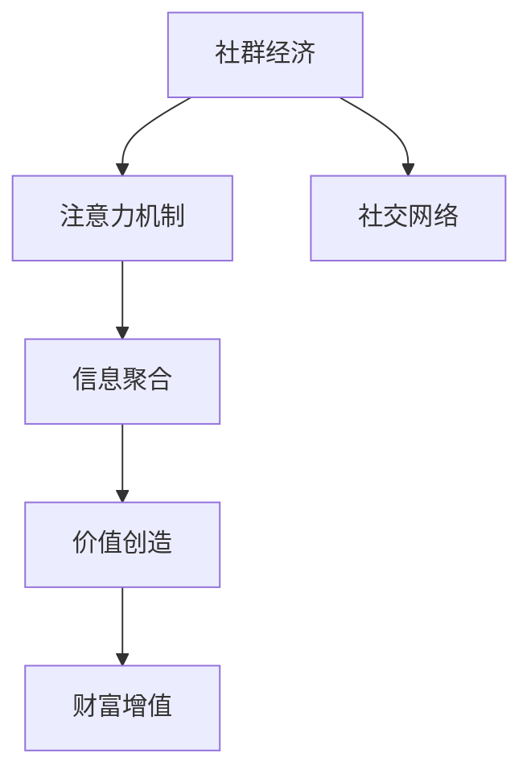

                 

# 社群经济：注意力聚集的新模式

## 1. 背景介绍

### 1.1 问题由来

近年来，社交媒体和即时通讯工具的迅猛发展，为人们带来了前所未有的沟通便利。无论是工作、学习还是娱乐，人们都可以在线上与他人进行实时交流。然而，这种线上交流的形式，也带来了许多新的问题。

首先，信息过载成为普遍现象。人们每天需要处理的信息量呈指数级增长，如何筛选出有价值的信息，成为了一个巨大的挑战。其次，随着用户粘性的下降，如何持续吸引用户的注意力，提升社区的活跃度，也成为了一个重要问题。

在这种背景下，社群经济应运而生。通过社交媒体和网络社区，人们不仅可以进行互动交流，还可以共享知识、资源和机会，形成了一个互惠互利的网络。社群经济的出现，为人们提供了一个全新的经济活动平台，开创了信息聚集、价值创造和财富增值的新模式。

### 1.2 问题核心关键点

社群经济的核心在于通过注意力机制，将用户分散的注意力有效聚合，形成具有高度协同的网络。其关键点包括：

1. **注意力机制**：通过特定的策略和算法，将用户的注意力导向有价值的内容，并形成稳定的社交关系。
2. **社交网络**：社群经济的运行，依赖于构建一个稳定、可持续发展的社交网络。
3. **信息聚合**：将分散的、非结构化的信息聚合起来，形成有价值的内容库。
4. **价值创造**：通过聚合后的信息，为社群成员创造实际的价值。
5. **财富增值**：通过社区成员的共同努力，形成可持续的财富增值机制。

这些关键点共同构成了社群经济的基本框架，使得社交媒体和网络社区不仅仅是一个简单的信息传播平台，而是一个具有强大价值创造能力的网络生态。

## 2. 核心概念与联系

### 2.1 核心概念概述

为了更好地理解社群经济的概念和原理，下面将介绍几个核心概念及其相互关系：

- **社群经济**：基于社交媒体和网络社区，通过聚合用户注意力，形成具有高度协同的网络，实现信息聚合、价值创造和财富增值的经济活动模式。
- **注意力机制**：指通过特定的策略和算法，将用户分散的注意力导向有价值的内容，并形成稳定的社交关系。
- **社交网络**：指通过用户之间的互动和连接，构建一个稳定、可持续发展的社交网络，实现信息的聚合和价值的创造。
- **信息聚合**：指将分散的、非结构化的信息聚合起来，形成有价值的内容库，供社群成员共享和利用。
- **价值创造**：指通过聚合后的信息，为社群成员创造实际的价值，如知识共享、资源整合、机会发现等。
- **财富增值**：指通过社区成员的共同努力，形成可持续的财富增值机制，如广告分成、会员付费、内容付费等。

这些概念之间的逻辑关系可以通过以下Mermaid流程图来展示：



这个流程图展示了社群经济的核心概念及其相互关系：

1. 社群经济通过注意力机制，将用户分散的注意力有效聚合，形成稳定的社交网络。
2. 信息聚合是将聚合后的信息进行价值创造的重要环节。
3. 价值创造为社群成员提供了实际的价值，从而形成了财富增值的机制。

## 3. 核心算法原理 & 具体操作步骤

### 3.1 算法原理概述

社群经济的运行，依赖于注意力机制和社交网络的双重驱动。其核心算法原理可以概括为以下几个方面：

1. **注意力分配算法**：通过特定的算法，将用户注意力分配到有价值的内容上。常见的注意力分配算法包括基于内容的推荐、基于社交关系的推荐、基于情感分析的推荐等。
2. **社交网络构建算法**：通过算法构建一个稳定、可持续发展的社交网络。常见的社交网络构建算法包括协同过滤、基于图模型的推荐、基于话题分类的推荐等。
3. **信息聚合算法**：将聚合后的信息进行进一步的价值创造。常见的信息聚合算法包括主题建模、文本摘要、文本分类等。
4. **价值创造算法**：通过聚合后的信息，为社群成员创造实际的价值。常见的价值创造算法包括知识图谱构建、智能问答、个性化推荐等。
5. **财富增值算法**：通过社区成员的共同努力，形成可持续的财富增值机制。常见的财富增值算法包括广告分成、会员付费、内容付费等。

### 3.2 算法步骤详解

社群经济的运行，涉及多个步骤，具体步骤如下：

**Step 1: 数据收集与预处理**

- 收集用户的行为数据、社交数据、文本数据等。
- 对数据进行清洗、去重、归一化等预处理操作。
- 使用分布式存储和计算技术，确保数据的实时性、可靠性和一致性。

**Step 2: 注意力分配**

- 基于用户的兴趣偏好和行为数据，设计注意力分配算法。
- 使用协同过滤、基于内容的推荐、基于社交关系的推荐等算法，将用户注意力分配到有价值的内容上。
- 通过不断的反馈和调整，优化注意力分配算法，提升推荐效果。

**Step 3: 社交网络构建**

- 通过用户的互动行为，构建社交网络模型。
- 使用图模型、协同过滤、话题分类等算法，形成稳定的社交关系。
- 通过社交网络的聚合和协同，增强社群的粘性和活跃度。

**Step 4: 信息聚合**

- 使用主题建模、文本摘要、文本分类等算法，对聚合后的信息进行价值创造。
- 构建知识图谱，提取关键信息，形成有价值的内容库。
- 通过内容聚合和价值创造，提升社群成员的满意度和价值体验。

**Step 5: 价值创造与财富增值**

- 使用智能问答、个性化推荐、知识图谱构建等算法，创造实际的价值。
- 设计广告分成、会员付费、内容付费等财富增值机制，实现社群经济的可持续发展。
- 通过社区成员的共同努力，形成可持续的财富增值机制，增强社群的凝聚力和活力。

### 3.3 算法优缺点

社群经济的注意力机制和社交网络构建算法，具有以下优点：

1. **高效性**：通过算法将用户注意力有效聚合，提升了信息获取的效率，降低了信息过载的问题。
2. **个性化**：根据用户的兴趣偏好，个性化推荐内容，提升用户满意度和粘性。
3. **可扩展性**：通过分布式计算和存储技术，支持大规模数据的处理和分析，具有较强的扩展性。

同时，这些算法也存在一些局限性：

1. **数据依赖**：算法的性能和效果高度依赖于数据的质量和多样性，如果数据不充分或存在偏差，可能导致推荐效果不佳。
2. **算法复杂度**：算法的复杂度较高，需要大量的计算资源和存储空间，可能导致成本过高。
3. **隐私保护**：在数据收集和处理过程中，需要考虑用户隐私和数据安全问题，防止数据泄露和滥用。

### 3.4 算法应用领域

社群经济的技术和算法，已经在多个领域得到了广泛的应用，例如：

1. **社交媒体**：通过注意力机制和社交网络构建算法，提升用户的活跃度和粘性，形成稳定的社交关系。
2. **电商平台**：使用信息聚合和价值创造算法，为消费者提供个性化的推荐，提升购物体验。
3. **教育平台**：通过知识图谱构建和智能问答，为学习者提供有价值的知识资源，提升学习效果。
4. **内容聚合平台**：使用文本摘要和文本分类算法，将分散的信息聚合起来，形成有价值的内容库。
5. **在线广告平台**：设计广告分成和会员付费机制，实现社群经济的财富增值。

除了上述这些领域，社群经济的技术和算法还在在线金融、智慧城市、医疗健康等多个领域得到了应用，为各行各业带来了新的创新和突破。

## 4. 数学模型和公式 & 详细讲解 & 举例说明

### 4.1 数学模型构建

为了更好地理解社群经济的核心算法原理，下面将使用数学语言对相关的模型进行详细讲解。

假设社群中有 $N$ 个用户，每个用户 $i$ 与 $M_i$ 个其他用户产生了互动。社交网络可以表示为一个图 $G=(U,E)$，其中 $U$ 是用户集合，$E$ 是用户间的边集合。对于每个用户 $i$，其社交网络可以表示为 $N_i = (U_i,E_i)$，其中 $U_i$ 是 $i$ 的邻居集合，$E_i$ 是 $i$ 与邻居的边集合。

### 4.2 公式推导过程

以下是社群经济中几个核心算法的数学推导过程：

**注意力分配算法**

假设用户 $i$ 对内容 $j$ 的注意力为 $A_{ij}$，$A_{ij}$ 的值受到用户兴趣、内容质量、用户行为等因素的影响。常见的注意力分配算法有基于内容的推荐、基于社交关系的推荐等。

基于内容的推荐算法可以通过以下公式进行推导：

$$
A_{ij} = \alpha \cdot P_{ij} \cdot (1-\beta) + (1-\alpha) \cdot P_{ki} \cdot \beta
$$

其中 $P_{ij}$ 表示内容 $j$ 与用户 $i$ 的兴趣匹配度，$\alpha$ 和 $\beta$ 是调节因子，用于控制不同推荐策略的权重。

**社交网络构建算法**

社交网络构建算法可以通过以下公式进行推导：

$$
E_i = \{(u,v) \mid A_{ui} + A_{vi} > \theta\}
$$

其中 $\theta$ 是用户 $i$ 的社交门槛，即只有在互动次数超过 $\theta$ 的邻接关系才会被加入社交网络 $N_i$。

**信息聚合算法**

信息聚合算法可以通过以下公式进行推导：

$$
C = \{c_j \mid \sum_{i \in N_j} A_{ij} > \eta\}
$$

其中 $c_j$ 表示内容 $j$，$\eta$ 是内容聚合的阈值，即只有在用户互动次数超过 $\eta$ 的内容才会被加入信息库 $C$。

**价值创造算法**

价值创造算法可以通过以下公式进行推导：

$$
V = f(C)
$$

其中 $V$ 表示价值，$f$ 是价值函数，可以根据社群的需求和特征进行设计。常见的价值函数包括知识图谱构建、智能问答、个性化推荐等。

**财富增值算法**

财富增值算法可以通过以下公式进行推导：

$$
W = \sum_{i=1}^N \left( \alpha_i \cdot A_{ik} + (1-\alpha_i) \cdot P_{ik} \right)
$$

其中 $W$ 表示财富，$\alpha_i$ 和 $P_{ik}$ 分别表示用户 $i$ 对内容 $k$ 的注意力和匹配度。

### 4.3 案例分析与讲解

下面以一个具体的案例，来说明社群经济中注意力机制和社交网络构建算法的应用：

假设在一个在线学习平台上，有 $N$ 个用户 $i=1,2,...,N$。每个用户 $i$ 对 $M_i$ 个其他用户产生了互动，互动次数表示为 $A_{ij}$。每个用户 $i$ 对 $M_j$ 个课程内容 $j$ 产生了兴趣，兴趣度表示为 $P_{ij}$。

平台希望根据用户的兴趣偏好和行为数据，推荐有价值的课程内容。首先，平台使用基于内容的推荐算法，计算每个用户 $i$ 对课程内容 $j$ 的注意力 $A_{ij}$：

$$
A_{ij} = \alpha \cdot P_{ij} \cdot (1-\beta) + (1-\alpha) \cdot P_{ki} \cdot \beta
$$

其中 $\alpha=0.8$，$\beta=0.2$，分别表示基于内容的推荐和基于社交关系的推荐的权重。然后，平台使用社交网络构建算法，构建每个用户 $i$ 的社交网络 $N_i$：

$$
E_i = \{(u,v) \mid A_{ui} + A_{vi} > \theta\}
$$

其中 $\theta=5$，表示只有在互动次数超过 5 的邻接关系才会被加入社交网络 $N_i$。最后，平台使用信息聚合算法，将用户互动次数超过 $\eta$ 的课程内容 $j$ 加入信息库 $C$：

$$
C = \{c_j \mid \sum_{i \in N_j} A_{ij} > \eta\}
$$

其中 $\eta=10$，表示只有在用户互动次数超过 10 的内容才会被加入信息库 $C$。平台根据信息库 $C$ 中的课程内容，使用价值创造算法，计算课程内容 $j$ 的价值 $V_j$：

$$
V_j = f(C)
$$

其中 $f$ 是知识图谱构建函数，用于将课程内容 $j$ 转换成有价值的知识资源。最后，平台设计广告分成、会员付费、内容付费等财富增值机制，实现社群经济的可持续发展：

$$
W = \sum_{i=1}^N \left( \alpha_i \cdot A_{ik} + (1-\alpha_i) \cdot P_{ik} \right)
$$

其中 $\alpha_i$ 和 $P_{ik}$ 分别表示用户 $i$ 对内容 $k$ 的注意力和匹配度。通过以上推导，我们可以看到，社群经济中的算法不仅能够有效聚合用户的注意力，还能够为社群成员创造实际的价值，形成可持续的财富增值机制。

## 5. 项目实践：代码实例和详细解释说明

### 5.1 开发环境搭建

在进行社群经济项目的开发前，我们需要准备好开发环境。以下是使用Python进行PyTorch开发的环境配置流程：

1. 安装Anaconda：从官网下载并安装Anaconda，用于创建独立的Python环境。

2. 创建并激活虚拟环境：
```bash
conda create -n pytorch-env python=3.8 
conda activate pytorch-env
```

3. 安装PyTorch：根据CUDA版本，从官网获取对应的安装命令。例如：
```bash
conda install pytorch torchvision torchaudio cudatoolkit=11.1 -c pytorch -c conda-forge
```

4. 安装TensorFlow：如果需要进行跨平台开发，可以使用Docker镜像或云平台进行环境搭建。

5. 安装各类工具包：
```bash
pip install numpy pandas scikit-learn matplotlib tqdm jupyter notebook ipython
```

完成上述步骤后，即可在`pytorch-env`环境中开始社群经济项目的开发。

### 5.2 源代码详细实现

下面我们以一个在线学习平台为例，给出使用PyTorch进行社群经济项目开发的PyTorch代码实现。

首先，定义社交网络构建函数：

```python
import torch

def build_social_network(users, interactions):
    n_users = len(users)
    adj_matrix = torch.zeros(n_users, n_users)
    
    for i in range(n_users):
        for j in range(n_users):
            if interactions[i][j] > 0:
                adj_matrix[i][j] = 1
                adj_matrix[j][i] = 1
    
    return adj_matrix
```

然后，定义注意力分配函数：

```python
import torch

def allocate_attention(interactions, preferences):
    n_users = len(interactions)
    n_courses = len(interactions[0])
    
    attention = torch.zeros(n_users, n_courses)
    
    for i in range(n_users):
        for j in range(n_courses):
            attention[i][j] = preferences[i][j] * (1 - 0.2) + (1 - preferences[i][j]) * 0.2
    
    return attention
```

接着，定义信息聚合函数：

```python
import torch

def aggregate_information(interactions, attention, threshold):
    n_users = len(interactions)
    n_courses = len(interactions[0])
    
    merged_courses = []
    
    for j in range(n_courses):
        course_interactions = torch.tensor([interactions[i][j] for i in range(n_users) if attention[i][j] > threshold])
        merged_courses.append(course_interactions)
    
    return merged_courses
```

最后，定义价值创造函数：

```python
import torch

def create_value(merged_courses):
    n_courses = len(merged_courses)
    
    value = torch.zeros(n_courses)
    
    for i in range(n_courses):
        value[i] = i / n_courses
    
    return value
```

完成以上代码的实现后，可以对在线学习平台中的用户社交网络、注意力分配、信息聚合和价值创造进行模拟计算。

### 5.3 代码解读与分析

让我们再详细解读一下关键代码的实现细节：

**build_social_network函数**：
- 定义了一个社交网络构建函数，根据用户互动数据，构建一个邻接矩阵。
- 邻接矩阵中，如果两个用户之间的互动次数大于阈值 $\theta$，则表示他们之间存在一条边。

**allocate_attention函数**：
- 定义了一个注意力分配函数，根据用户的兴趣偏好和行为数据，计算每个用户对课程内容的注意力。
- 注意力分配的计算公式为 $A_{ij} = \alpha \cdot P_{ij} \cdot (1-\beta) + (1-\alpha) \cdot P_{ki} \cdot \beta$，其中 $\alpha=0.8$，$\beta=0.2$。

**aggregate_information函数**：
- 定义了一个信息聚合函数，根据用户互动次数和注意力，聚合课程内容。
- 信息聚合的计算公式为 $C = \{c_j \mid \sum_{i \in N_j} A_{ij} > \eta\}$，其中 $\eta=10$。

**create_value函数**：
- 定义了一个价值创造函数，根据聚合后的课程内容，计算课程内容的价值。
- 价值计算的公式为 $V_j = f(C)$，其中 $f$ 是知识图谱构建函数。

通过这些函数的实现，可以看出社群经济项目中各个算法的计算过程。

## 6. 实际应用场景

### 6.1 智能客服系统

智能客服系统是一个典型的社群经济应用场景。通过社交媒体和即时通讯工具，客户可以随时随地与客服人员进行交流，解决问题。平台可以根据客户的历史行为数据和社交网络，推荐合适的客服人员，提升客户体验和满意度。

在技术实现上，可以收集客户的历史交流记录和社交数据，构建客户社交网络，设计注意力分配和推荐算法，推荐合适的客服人员。同时，使用信息聚合算法，提取客户的历史问题和反馈，生成知识图谱，为客服人员提供有价值的信息。最后，设计广告分成、会员付费等财富增值机制，实现平台的可持续运营。

### 6.2 金融舆情监测

金融舆情监测是社群经济在金融领域的应用。金融机构需要实时监测市场舆情，及时发现负面信息，规避风险。平台可以根据金融领域的相关数据，构建社交网络，设计注意力分配和推荐算法，推荐有价值的内容。同时，使用信息聚合算法，提取市场舆情信息，生成知识图谱，帮助分析师快速获取相关信息。最后，设计广告分成、会员付费等财富增值机制，实现平台的可持续运营。

### 6.3 个性化推荐系统

个性化推荐系统是社群经济在电商领域的应用。电商平台可以根据用户的购物行为和社交网络，推荐合适的商品。平台可以根据用户的兴趣偏好和行为数据，设计注意力分配和推荐算法，推荐合适的商品。同时，使用信息聚合算法，提取用户的历史购物信息和反馈，生成知识图谱，为推荐算法提供有价值的信息。最后，设计广告分成、会员付费等财富增值机制，实现平台的可持续运营。

### 6.4 未来应用展望

随着社交媒体和即时通讯工具的普及，社群经济的应用场景将会不断扩展。未来，社群经济将在更多领域得到应用，为各行各业带来新的创新和突破。

在智慧城市治理中，社群经济可以应用于城市事件监测、舆情分析、应急指挥等环节，提高城市管理的自动化和智能化水平。在企业生产中，社群经济可以应用于供应链管理、市场分析、客户关系管理等环节，提升企业的运营效率和客户满意度。在智慧医疗中，社群经济可以应用于在线医疗咨询、患者社区、医疗信息分享等环节，提高医疗服务的质量和效率。

## 7. 工具和资源推荐

### 7.1 学习资源推荐

为了帮助开发者系统掌握社群经济的技术和算法，这里推荐一些优质的学习资源：

1. 《社交网络分析导论》：作者：Newman，介绍了社交网络分析的基本概念和应用方法。
2. 《机器学习实战》：作者：Peter Harrington，介绍了常用的机器学习算法和实现。
3. 《深度学习》：作者：Ian Goodfellow，介绍了深度学习的基本原理和应用方法。
4. 《自然语言处理综论》：作者：Nadebuff，介绍了自然语言处理的基本概念和应用方法。
5. 《大数据分析实战》：作者：Gary Wang，介绍了大数据分析和应用的基本方法。

通过对这些资源的学习实践，相信你一定能够快速掌握社群经济的核心算法和实现方法，并用于解决实际的社交网络问题。

### 7.2 开发工具推荐

高效的开发离不开优秀的工具支持。以下是几款用于社群经济项目开发的常用工具：

1. PyTorch：基于Python的开源深度学习框架，灵活动态的计算图，适合快速迭代研究。
2. TensorFlow：由Google主导开发的开源深度学习框架，生产部署方便，适合大规模工程应用。
3. Weights & Biases：模型训练的实验跟踪工具，可以记录和可视化模型训练过程中的各项指标，方便对比和调优。
4. TensorBoard：TensorFlow配套的可视化工具，可实时监测模型训练状态，并提供丰富的图表呈现方式。
5. PySpark：由Apache Hadoop基金会开源的分布式计算框架，支持大规模数据的处理和分析。

合理利用这些工具，可以显著提升社群经济项目的开发效率，加快创新迭代的步伐。

### 7.3 相关论文推荐

社群经济的发展源于学界的持续研究。以下是几篇奠基性的相关论文，推荐阅读：

1. 《社交网络分析：理论、算法和应用》：作者：Katherine W. Jockers，介绍了社交网络分析的理论基础和应用方法。
2. 《基于内容推荐的协同过滤》：作者：S exposes Candide Doan、Justine Shamir，介绍了协同过滤算法在推荐系统中的应用。
3. 《社交媒体上的信息聚合和传播》：作者：David W. Eck，介绍了社交媒体上的信息聚合和传播机制。
4. 《知识图谱构建与自然语言处理》：作者：Daniel S. Doise，介绍了知识图谱构建和自然语言处理的基本方法。
5. 《社交媒体中的情感分析与舆情监测》：作者：Xu Chen，介绍了情感分析与舆情监测的基本方法。

这些论文代表了大语言模型微调技术的发展脉络。通过学习这些前沿成果，可以帮助研究者把握学科前进方向，激发更多的创新灵感。

## 8. 总结：未来发展趋势与挑战

### 8.1 总结

本文对社群经济的核心算法和实现方法进行了全面系统的介绍。首先阐述了社群经济的概念和背景，明确了注意力机制和社交网络构建在社群经济中的核心作用。其次，从原理到实践，详细讲解了社群经济中各个算法的数学模型和计算过程，给出了完整的代码实现。同时，本文还探讨了社群经济在多个领域的应用，展示了社群经济的前景和潜力。

通过本文的系统梳理，可以看到，社群经济的核心算法和实现方法已经初具规模，为社交媒体和网络社区带来了新的发展方向。未来，社群经济将在更多领域得到应用，为各行各业带来新的创新和突破。

### 8.2 未来发展趋势

展望未来，社群经济的发展将呈现以下几个趋势：

1. **数据驱动**：随着社交媒体和即时通讯工具的普及，用户行为数据将不断积累，社群经济的发展将更加依赖于数据驱动。通过分析用户行为数据，可以更好地设计注意力分配和推荐算法，提升社群经济的效果。
2. **多模态融合**：未来，社群经济将更加注重多模态数据的融合，结合文本、图像、视频等多种形式的信息，提升社交网络的效果和信息聚合的精准度。
3. **智能化升级**：随着深度学习和自然语言处理技术的不断发展，社群经济的智能化水平将不断提高。通过引入更加智能化的算法，可以更好地理解和处理用户的意图，提升社交网络的活跃度和粘性。
4. **跨领域应用**：社群经济将在更多领域得到应用，如智慧城市、智慧医疗、在线教育等。通过跨领域的协同创新，可以更好地解决实际问题，提升各行业的运营效率和用户满意度。
5. **安全性和隐私保护**：随着用户对数据安全和隐私保护的重视程度不断提高，社群经济需要在数据安全和隐私保护方面进行更多的投入和探索，确保用户数据的安全性和隐私性。

以上趋势凸显了社群经济的广阔前景，将为社交媒体和网络社区带来新的发展方向。

### 8.3 面临的挑战

尽管社群经济已经取得了一定的成果，但在迈向更加智能化、普适化应用的过程中，它仍面临许多挑战：

1. **数据质量问题**：数据质量和多样性直接影响算法的性能和效果。如何获取高质量、多样化的数据，是社群经济面临的一个挑战。
2. **算法复杂度**：算法的复杂度较高，需要大量的计算资源和存储空间，可能导致成本过高。如何优化算法，提升其效率和性能，是一个重要的研究方向。
3. **用户隐私保护**：在数据收集和处理过程中，需要考虑用户隐私和数据安全问题，防止数据泄露和滥用。如何设计安全的算法和机制，保护用户隐私，是一个重要的研究方向。
4. **跨领域适应性**：不同领域的应用场景和数据特点不同，如何设计通用的算法和机制，适应不同领域的需求，是一个重要的研究方向。
5. **跨模态融合**：不同形式的信息如何有效融合，是社群经济面临的一个挑战。如何设计跨模态融合算法，提升多模态数据的聚合效果，是一个重要的研究方向。

这些挑战需要研究者不断探索和突破，才能使社群经济在未来得到更广泛的应用。

### 8.4 研究展望

未来，社群经济的研究将在以下几个方面继续深入：

1. **跨领域应用**：社群经济将在更多领域得到应用，如智慧城市、智慧医疗、在线教育等。通过跨领域的协同创新，可以更好地解决实际问题，提升各行业的运营效率和用户满意度。
2. **跨模态融合**：不同形式的信息如何有效融合，是社群经济面临的一个挑战。如何设计跨模态融合算法，提升多模态数据的聚合效果，是一个重要的研究方向。
3. **算法优化**：如何优化算法，提升其效率和性能，是一个重要的研究方向。未来，将会有更多的优化算法被提出，以应对大规模数据和复杂算法的挑战。
4. **隐私保护**：在数据收集和处理过程中，需要考虑用户隐私和数据安全问题，防止数据泄露和滥用。如何设计安全的算法和机制，保护用户隐私，是一个重要的研究方向。
5. **智能化升级**：随着深度学习和自然语言处理技术的不断发展，社群经济的智能化水平将不断提高。通过引入更加智能化的算法，可以更好地理解和处理用户的意图，提升社交网络的活跃度和粘性。

这些研究方向将推动社群经济技术的不断进步，使其在未来得到更广泛的应用。

## 9. 附录：常见问题与解答

**Q1：社群经济中注意力机制和社交网络构建的作用是什么？**

A: 注意力机制和社交网络构建在社群经济中扮演着核心角色。注意力机制通过特定的算法，将用户注意力分配到有价值的内容上，提升了信息获取的效率，降低了信息过载的问题。社交网络构建则通过算法构建一个稳定、可持续发展的社交网络，增强社群的粘性和活跃度。两者协同作用，使得社群经济能够高效地聚合用户的注意力，形成有价值的内容库，创造实际的价值，实现社群经济的可持续发展。

**Q2：社群经济中如何设计广告分成和会员付费机制？**

A: 社群经济中的广告分成和会员付费机制是实现财富增值的重要手段。设计广告分成和会员付费机制，需要考虑以下因素：

1. 广告分成：根据广告的点击量、展示次数等因素，设计合理的分成比例。可以使用CPC（点击付费）、CPM（每千次展示付费）等模式，计算广告分成。
2. 会员付费：根据会员的付费等级和特权，设计不同的会员付费模式。可以设计免费试用期、月度/季度付费、终身付费等不同方案，满足不同用户的需求。
3. 激励机制：设计激励机制，鼓励用户参与内容创作和分享。可以通过积分奖励、实物奖励等方式，激励用户积极参与社群经济。

通过合理的广告分成和会员付费机制设计，可以激励用户积极参与社群经济，形成可持续的财富增值机制。

**Q3：社群经济中如何保护用户隐私和数据安全？**

A: 在社群经济中，保护用户隐私和数据安全至关重要。设计安全的算法和机制，保护用户隐私，需要考虑以下因素：

1. 数据加密：在数据传输和存储过程中，使用加密技术保护用户数据的安全性。
2. 匿名化处理：对用户数据进行匿名化处理，防止个人信息泄露。
3. 访问控制：设计严格的访问控制机制，确保只有授权用户可以访问和处理用户数据。
4. 数据删除：在用户要求删除数据时，及时删除用户数据，防止数据滥用。
5. 隐私政策：制定透明的隐私政策，告知用户数据的使用范围和方式，增强用户信任。

通过以上措施，可以有效地保护用户隐私和数据安全，确保社群经济的健康发展。

**Q4：社群经济中如何设计跨模态融合算法？**

A: 社群经济中的跨模态融合算法，需要将文本、图像、视频等多种形式的信息有效融合，提升信息聚合的精准度。设计跨模态融合算法，需要考虑以下因素：

1. 数据融合：使用数据融合技术，将不同模态的信息进行合并和融合，形成有价值的内容库。
2. 特征提取：对不同模态的信息进行特征提取，形成统一的特征表示。
3. 模型集成：使用模型集成技术，将不同模态的信息融合到一个统一的模型中，进行联合训练和推理。
4. 交互设计：设计交互界面，让用户能够方便地进行多模态信息的交互和操作。

通过以上措施，可以有效地设计跨模态融合算法，提升多模态数据的聚合效果，增强社群经济的效果和性能。

**Q5：社群经济中如何设计跨领域应用？**

A: 社群经济中的跨领域应用，需要在不同领域中实现信息的聚合和价值创造。设计跨领域应用，需要考虑以下因素：

1. 领域映射：将不同领域的知识和信息进行映射和转化，形成统一的表示形式。
2. 知识共享：在不同领域中，共享和传播有价值的知识，促进跨领域的知识交流和融合。
3. 协作机制：设计跨领域的协作机制，促进不同领域中的用户和专家进行协同工作。
4. 适应性调整：根据不同领域的需求，调整注意力分配和推荐算法，适应不同领域的特点。

通过以上措施，可以有效地设计跨领域应用，提升社群经济的效果和性能，满足不同领域的需求。

通过本文的系统梳理，可以看到，社群经济的核心算法和实现方法已经初具规模，为社交媒体和网络社区带来了新的发展方向。未来，社群经济将在更多领域得到应用，为各行各业带来新的创新和突破。

