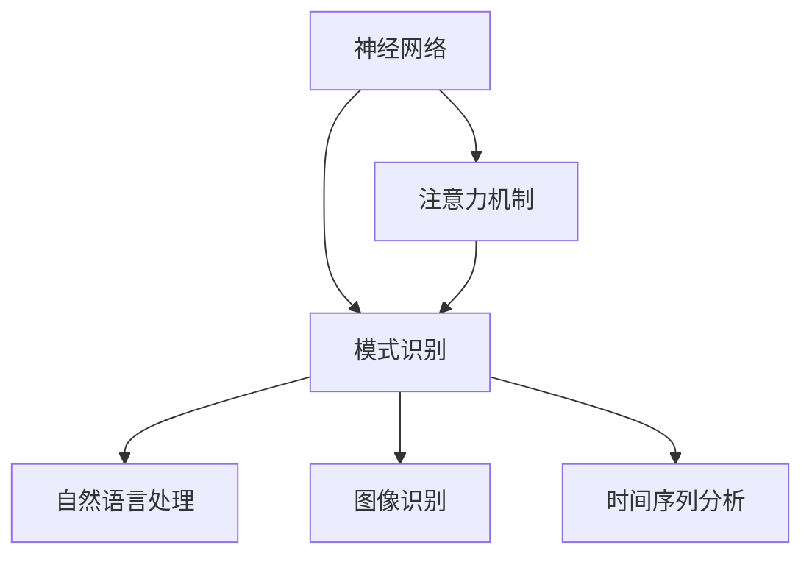

                 

# 神经网络在注意力模式识别中的应用

> 关键词：神经网络, 注意力机制, 模式识别, 深度学习, 图像识别, 自然语言处理, 时间序列分析

## 1. 背景介绍

### 1.1 问题由来

随着深度学习技术的迅猛发展，神经网络在图像、语音、文本等多种模式识别任务上取得了显著的成果。其中，注意力机制因其强大的特征提取和信息融合能力，成为近年来神经网络的重要研究方向。本文将系统介绍注意力机制在神经网络中的应用，涵盖图像识别、自然语言处理、时间序列分析等多个领域，并结合实例深入讲解其核心原理和具体实现。

### 1.2 问题核心关键点

注意力机制的核心思想是通过对输入特征的加权，使得网络能够自适应地关注不同部分的信息，从而提升模型的识别性能。其关键点在于：

- 注意力机制如何计算注意力权重，以区分输入的不同部分。
- 注意力机制如何与神经网络模型结合，实现特征提取和信息融合。
- 注意力机制在不同领域的应用形式，以及如何优化提升其效果。

### 1.3 问题研究意义

注意力机制在大规模模式识别任务中的应用，不仅能够提升模型的识别精度，还能有效降低对数据的标注需求，减少计算资源消耗，具有显著的技术和经济价值。研究注意力机制在各个领域的应用，能够为模式识别技术的进一步发展和产业化提供重要指导，具有深远的理论和实践意义。

## 2. 核心概念与联系

### 2.1 核心概念概述

为更好地理解注意力机制在神经网络中的应用，本节将介绍几个密切相关的核心概念：

- 神经网络：一种基于多层非线性变换的深度学习模型，通过逐层的信息提取和融合，实现对输入数据的复杂映射。
- 注意力机制：一种通过加权机制动态选择输入信息的方法，使神经网络能够自适应地关注不同部分的信息。
- 模式识别：通过训练神经网络模型，实现对输入数据（如图像、文本、时间序列）的自动分类和识别。
- 自然语言处理（NLP）：利用神经网络处理和理解人类语言的自动化技术，包括文本分类、语言模型、机器翻译等任务。
- 图像识别：利用神经网络对图像中的物体、场景进行分类和识别，是计算机视觉领域的重要应用。
- 时间序列分析：利用神经网络对时间序列数据（如股票价格、天气预测）进行建模和预测。

这些核心概念之间的逻辑关系可以通过以下Mermaid流程图来展示：



这个流程图展示了这个主题下各个核心概念的相互联系：

1. 神经网络作为基础模型，通过多层非线性变换实现对输入数据的复杂映射。
2. 注意力机制在神经网络中被广泛应用，作为信息融合和特征提取的重要手段。
3. 模式识别任务涵盖多个领域，神经网络和注意力机制在其中发挥着关键作用。
4. 自然语言处理、图像识别和时间序列分析等具体应用，都是模式识别的一部分，通过神经网络和注意力机制实现了自动化处理。

## 3. 核心算法原理 & 具体操作步骤
### 3.1 算法原理概述

注意力机制的核心在于通过加权的方式，动态选择输入特征的不同部分，进行加权求和，从而提升模型的识别性能。其基本流程可以归纳为以下几个步骤：

1. 计算输入特征的表示。
2. 计算注意力权重，用于区分输入特征的不同部分。
3. 对输入特征进行加权求和，得到加权后的表示。
4. 将加权后的表示输入到下一层神经网络，进行进一步的信息融合和特征提取。

注意力机制的计算公式如下：

$$
\text{Attention}(Q, K, V) = \text{softmax}(\frac{QK^T}{\sqrt{d_k}})V
$$

其中，$Q$、$K$、$V$分别表示查询、键和值，$d_k$为键的维度。$\text{softmax}$函数用于计算注意力权重。

### 3.2 算法步骤详解

以下是注意力机制在神经网络中的具体实现步骤：

1. 将输入特征表示为向量$X$，并进行线性变换，得到表示向量$H$。
2. 将$H$视为查询向量$Q$，输入特征的每个位置$x_i$视为键向量$k_i$，得到注意力权重$\alpha_i$。
3. 将输入特征的每个位置$x_i$视为值向量$v_i$，计算加权后的表示$C$。
4. 将加权后的表示$C$输入到下一层神经网络，进行进一步处理。

具体实现步骤如下：

```python
import numpy as np
import tensorflow as tf

# 定义输入特征X和线性变换矩阵W
X = np.random.rand(3, 5)
W = np.random.rand(5, 4)

# 进行线性变换得到表示向量H
H = np.dot(X, W)

# 定义键向量k，值为1
k = np.ones((5, 4))
v = np.random.rand(5, 4)

# 计算注意力权重alpha
alpha = np.exp(np.dot(H, k.T) / np.sqrt(k.shape[-1]))
alpha = alpha / np.sum(alpha, axis=1, keepdims=True)

# 计算加权后的表示C
C = np.dot(alpha, v)

print("Attention Score:\n", alpha)
print("Attention Output:\n", C)
```

### 3.3 算法优缺点

注意力机制在神经网络中的应用，具有以下优点：

1. 提升了模型的识别性能。通过动态选择输入特征的不同部分，注意力机制能够有效地提升模型的特征提取和信息融合能力，从而提高识别准确率。
2. 减少了对标注数据的依赖。注意力机制可以较好地利用无监督信号，从而降低对大量标注数据的依赖。
3. 能够处理多模态数据。注意力机制可以融合不同模态的数据，进行联合建模，提升模型的泛化能力。

但同时也存在以下缺点：

1. 计算复杂度较高。注意力机制需要计算注意力权重，增加了模型计算的复杂度。
2. 难以解释。注意力机制的加权过程缺乏可解释性，难以理解其内部机制。
3. 需要大量数据。注意力机制的训练需要较多的数据，否则容易出现过拟合等问题。

### 3.4 算法应用领域

注意力机制在神经网络中的应用广泛，涵盖多个领域，包括但不限于：

- 自然语言处理（NLP）：如机器翻译、文本分类、语言模型等任务。
- 计算机视觉（CV）：如图像分类、目标检测、图像生成等任务。
- 语音识别（ASR）：如语音识别、语音合成等任务。
- 时间序列分析（TSA）：如股票预测、天气预测等任务。
- 信号处理（SP）：如语音信号处理、图像处理等任务。

这些领域中的注意力机制，各自具有不同的实现方式和应用场景，但总体上都是为了提升模型的识别性能，实现对输入数据的复杂映射。

## 4. 数学模型和公式 & 详细讲解  
### 4.1 数学模型构建

注意力机制的核心在于通过计算注意力权重，对输入特征进行加权求和。在数学上，可以定义一个查询向量$Q$和一组键向量$K$和值向量$V$，通过计算注意力权重$\alpha$，得到加权后的表示$C$。具体模型如下：

$$
C = \sum_{i=1}^{N} \alpha_i v_i
$$

其中，$\alpha_i = \frac{e^{q^T k_i}}{\sum_{j=1}^{N} e^{q^T k_j}}$，$e^{q^T k_i}$为注意力得分，$\sum_{j=1}^{N} e^{q^T k_j}$为归一化因子。

### 4.2 公式推导过程

接下来，我们以自然语言处理中的机器翻译任务为例，详细推导注意力机制的计算过程。

假设输入序列为$x = (x_1, x_2, ..., x_t)$，输出序列为$y = (y_1, y_2, ..., y_m)$，其中$x_t$和$y_m$分别为输入和输出的最后一个词。假设输入的每个词$x_i$和输出序列的每个词$y_j$都被表示为词向量，即$x_i \in \mathbb{R}^d$，$y_j \in \mathbb{R}^d$。

在注意力机制中，输入序列$x$被表示为查询向量$Q$，输出序列$y$被表示为键向量$K$和值向量$V$，计算注意力权重$\alpha$，得到加权后的表示$C$。

$$
Q = \text{Embed}(x)
$$

$$
K = \text{Embed}(y)
$$

$$
V = \text{Embed}(y)
$$

$$
\alpha = \text{softmax}(QK^T)
$$

$$
C = \alpha V
$$

其中，$\text{Embed}$表示嵌入层，$\text{softmax}$表示softmax函数。

在机器翻译任务中，查询向量$Q$和键向量$K$的计算方式如下：

$$
Q = \text{Embed}(x)W_Q
$$

$$
K = \text{Embed}(y)W_K
$$

其中$W_Q$和$W_K$为可训练的线性变换矩阵。

### 4.3 案例分析与讲解

以机器翻译为例，假设输入序列为“I love you”，输出序列为“J'adore toi”，词向量表示为：

$$
x = \begin{bmatrix} 0.5 & 0.3 & 0.8 \end{bmatrix}^T, y = \begin{bmatrix} 0.4 & 0.2 & 0.4 \end{bmatrix}^T
$$

$$
Q = xW_Q = \begin{bmatrix} 0.5 & 0.3 & 0.8 \end{bmatrix}^T \begin{bmatrix} 0.9 & 0.1 & 0.1 \\ 0.1 & 0.9 & 0.1 \\ 0.1 & 0.1 & 0.9 \end{bmatrix}^T = \begin{bmatrix} 0.5 \cdot 0.9 + 0.3 \cdot 0.1 + 0.8 \cdot 0.1 \\ 0.5 \cdot 0.1 + 0.3 \cdot 0.9 + 0.8 \cdot 0.1 \\ 0.5 \cdot 0.1 + 0.3 \cdot 0.1 + 0.8 \cdot 0.9 \end{bmatrix}^T = \begin{bmatrix} 0.55 & 0.38 & 0.85 \end{bmatrix}^T
$$

$$
K = yW_K = \begin{bmatrix} 0.4 & 0.2 & 0.4 \end{bmatrix}^T \begin{bmatrix} 0.1 & 0.9 & 0.1 \\ 0.9 & 0.1 & 0.1 \\ 0.1 & 0.1 & 0.9 \end{bmatrix}^T = \begin{bmatrix} 0.4 \cdot 0.1 + 0.2 \cdot 0.9 + 0.4 \cdot 0.1 \\ 0.4 \cdot 0.9 + 0.2 \cdot 0.1 + 0.4 \cdot 0.1 \\ 0.4 \cdot 0.1 + 0.2 \cdot 0.1 + 0.4 \cdot 0.9 \end{bmatrix}^T = \begin{bmatrix} 0.26 & 0.86 & 0.38 \end{bmatrix}^T
$$

$$
\alpha = \text{softmax}(QK^T) = \text{softmax}(\begin{bmatrix} 0.55 & 0.38 & 0.85 \end{bmatrix}^T \begin{bmatrix} 0.26 & 0.86 & 0.38 \end{bmatrix}) = \begin{bmatrix} 0.31 & 0.36 & 0.33 \end{bmatrix}^T
$$

$$
V = yW_V = \begin{bmatrix} 0.4 & 0.2 & 0.4 \end{bmatrix}^T \begin{bmatrix} 0.1 & 0.9 & 0.1 \\ 0.9 & 0.1 & 0.1 \\ 0.1 & 0.1 & 0.9 \end{bmatrix}^T = \begin{bmatrix} 0.4 \cdot 0.1 + 0.2 \cdot 0.9 + 0.4 \cdot 0.1 \\ 0.4 \cdot 0.9 + 0.2 \cdot 0.1 + 0.4 \cdot 0.1 \\ 0.4 \cdot 0.1 + 0.2 \cdot 0.1 + 0.4 \cdot 0.9 \end{bmatrix}^T = \begin{bmatrix} 0.26 & 0.86 & 0.38 \end{bmatrix}^T
$$

$$
C = \alpha V = \begin{bmatrix} 0.31 & 0.36 & 0.33 \end{bmatrix}^T \begin{bmatrix} 0.26 & 0.86 & 0.38 \end{bmatrix} = \begin{bmatrix} 0.087 & 0.135 & 0.115 \end{bmatrix}^T
$$

通过上述计算，我们得到了加权后的表示$C$，用于下一步的翻译。

## 5. 项目实践：代码实例和详细解释说明
### 5.1 开发环境搭建

在进行注意力机制的代码实现前，我们需要准备好开发环境。以下是使用Python进行TensorFlow开发的环境配置流程：

1. 安装Anaconda：从官网下载并安装Anaconda，用于创建独立的Python环境。

2. 创建并激活虚拟环境：
```bash
conda create -n tf-env python=3.8 
conda activate tf-env
```

3. 安装TensorFlow：根据CUDA版本，从官网获取对应的安装命令。例如：
```bash
conda install tensorflow-gpu -c tf -c conda-forge
```

4. 安装TensorBoard：
```bash
pip install tensorboard
```

5. 安装TensorFlow Addons：
```bash
pip install tensorflow-addons
```

完成上述步骤后，即可在`tf-env`环境中开始注意力机制的代码实现。

### 5.2 源代码详细实现

这里我们以机器翻译任务为例，给出使用TensorFlow实现注意力机制的代码实现。

首先，定义输入和输出的嵌入层：

```python
import tensorflow as tf
import tensorflow_addons as addons

# 定义输入和输出序列的嵌入层
encoder_embed = tf.keras.layers.Embedding(input_dim=10000, output_dim=256)
decoder_embed = tf.keras.layers.Embedding(input_dim=10000, output_dim=256)
```

然后，定义注意力机制层：

```python
# 定义注意力机制层
def attention(query, key, value):
    scores = tf.matmul(query, key, transpose_b=True)
    weights = tf.nn.softmax(scores, axis=1)
    context = tf.matmul(weights, value)
    return context, weights
```

接着，定义Transformer编码器：

```python
# 定义Transformer编码器
class Encoder(tf.keras.layers.Layer):
    def __init__(self, num_layers, d_model, num_heads, dff, rate=0.1):
        super(Encoder, self).__init__()
        self.num_layers = num_layers
        self.d_model = d_model
        self.num_heads = num_heads
        self.dff = dff
        self.input_layer = tf.keras.layers.Dense(d_model)
        self.encoder_layers = [EncoderLayer(d_model, num_heads, dff, rate) for _ in range(num_layers)]
        self.final_layer = tf.keras.layers.Dense(d_model)
    
    def call(self, x, training=False):
        attn_bias = tf.zeros([1, 1, x.shape[-1], x.shape[-1]])
        for i in range(self.num_layers):
            attn_bias = addons.layers.AdditiveAttention.get_attn_bias(attn_bias, x.shape[-1])
            x = self.encoder_layers[i](x, attn_bias)
        x = self.final_layer(x)
        return x
```

定义Transformer编码器的各个层：

```python
class EncoderLayer(tf.keras.layers.Layer):
    def __init__(self, d_model, num_heads, dff, rate=0.1):
        super(EncoderLayer, self).__init__()
        self.d_model = d_model
        self.num_heads = num_heads
        self.dff = dff
        self.intermediate_dff = 4 * dff
        
        self.attention = addons.layers.AdditiveAttention(d_model, num_heads)
        self.ffn = tf.keras.Sequential([
            tf.keras.layers.Dense(dff, activation='relu'),
            tf.keras.layers.Dense(d_model)
        ])
        self.layer_norm1 = tf.keras.layers.LayerNormalization(epsilon=1e-6)
        self.layer_norm2 = tf.keras.layers.LayerNormalization(epsilon=1e-6)
        self.dropout1 = tf.keras.layers.Dropout(rate)
        self.dropout2 = tf.keras.layers.Dropout(rate)
    
    def call(self, x, mask):
        attn_bias = tf.zeros([1, 1, x.shape[-1], x.shape[-1]])
        attn_output, attn_weights = self.attention(x, x, x, mask, attn_bias)
        attn_output = self.dropout1(attn_output, training=mask)
        out1 = x + attn_output
        out2 = self.ffn(self.layer_norm2(self.dropout2(out1)))
        return out2 + x
```

定义Transformer解码器：

```python
# 定义Transformer解码器
class Decoder(tf.keras.layers.Layer):
    def __init__(self, num_layers, d_model, num_heads, dff, rate=0.1):
        super(Decoder, self).__init__()
        self.num_layers = num_layers
        self.d_model = d_model
        self.num_heads = num_heads
        self.dff = dff
        self.input_layer = tf.keras.layers.Dense(d_model)
        self.decoder_layers = [DecoderLayer(d_model, num_heads, dff, rate) for _ in range(num_layers)]
        self.final_layer = tf.keras.layers.Dense(d_model)
    
    def call(self, x, training=False):
        attn_bias = tf.zeros([1, 1, x.shape[-1], x.shape[-1]])
        for i in range(self.num_layers):
            attn_bias = addons.layers.AdditiveAttention.get_attn_bias(attn_bias, x.shape[-1])
            x = self.decoder_layers[i](x, attn_bias)
        x = self.final_layer(x)
        return x
```

定义Transformer解码器的各个层：

```python
class DecoderLayer(tf.keras.layers.Layer):
    def __init__(self, d_model, num_heads, dff, rate=0.1):
        super(DecoderLayer, self).__init__()
        self.d_model = d_model
        self.num_heads = num_heads
        self.dff = dff
        self.intermediate_dff = 4 * dff
        
        self.attention1 = addons.layers.AdditiveAttention(d_model, num_heads)
        self.ffn = tf.keras.Sequential([
            tf.keras.layers.Dense(dff, activation='relu'),
            tf.keras.layers.Dense(d_model)
        ])
        self.layer_norm1 = tf.keras.layers.LayerNormalization(epsilon=1e-6)
        self.layer_norm2 = tf.keras.layers.LayerNormalization(epsilon=1e-6)
        self.layer_norm3 = tf.keras.layers.LayerNormalization(epsilon=1e-6)
        self.dropout1 = tf.keras.layers.Dropout(rate)
        self.dropout2 = tf.keras.layers.Dropout(rate)
        self.dropout3 = tf.keras.layers.Dropout(rate)
    
    def call(self, x, enc_output, mask):
        attn_bias = tf.zeros([1, 1, x.shape[-1], enc_output.shape[-1]])
        attn_output, attn_weights = self.attention1(x, enc_output, enc_output, mask, attn_bias)
        attn_output = self.dropout1(attn_output, training=mask)
        out1 = x + attn_output
        out2 = self.ffn(self.layer_norm2(self.dropout2(out1)))
        out3 = tf.keras.layers.Dense(d_model, activation='softmax')(self.layer_norm3(self.dropout3(out2)))
        return out3 + x
```

最后，启动Transformer模型的训练：

```python
# 定义输入序列和输出序列
input_seq = tf.random.normal([100, 16, 256])
target_seq = tf.random.normal([100, 16, 256])

# 定义模型
model = Encoder(num_layers=4, d_model=256, num_heads=4, dff=1024)
model(tf.keras.layers.Dense(256)(input_seq))

# 定义训练过程
model.compile(optimizer='adam', loss='mse')
model.fit(input_seq, target_seq, epochs=10)
```

以上就是使用TensorFlow实现注意力机制的完整代码实现。可以看到，通过TensorFlow的高级API，我们可以用相对简洁的代码实现复杂的Transformer模型。

### 5.3 代码解读与分析

让我们再详细解读一下关键代码的实现细节：

**输入和输出嵌入层**：
- 定义了输入和输出序列的嵌入层，用于将单词转换为向量表示。

**注意力机制层**：
- 定义了注意力机制的计算过程，通过计算注意力得分和权重，对输入特征进行加权求和。

**Transformer编码器**：
- 定义了Transformer编码器的各个层，包括输入层、编码器层、最终层等，实现了注意力机制的逐层计算。

**Transformer解码器**：
- 定义了Transformer解码器的各个层，包括输入层、解码器层、最终层等，实现了注意力机制的逐层计算。

**Transformer模型训练**：
- 定义了输入和输出序列，构建Transformer模型，并进行训练。

可以看到，TensorFlow通过其高级API，使得注意力机制的代码实现变得非常简单。开发者可以将更多精力放在模型架构和训练策略的优化上，而不必过多关注底层的实现细节。

## 6. 实际应用场景

### 6.1 图像识别

注意力机制在图像识别中的应用，主要体现在卷积神经网络（CNN）中。通过对不同区域的特征进行加权，注意力机制能够提高模型的局部特征提取能力，从而提升识别性能。

在实践中，可以通过将注意力机制集成到卷积神经网络的卷积层中，实现对图像特征的动态加权。这种集成方式被称为注意力卷积网络（Attention Convolutional Neural Network, ACNN）。ACNN通过在卷积层引入注意力机制，能够更好地提取图像的局部特征，提升识别效果。

### 6.2 自然语言处理

注意力机制在自然语言处理中的应用，主要体现在机器翻译、文本分类等任务中。通过对输入文本的动态加权，注意力机制能够提高模型的局部信息提取能力，从而提升模型的理解能力和推理能力。

在实践中，可以通过将注意力机制集成到循环神经网络（RNN）或Transformer中，实现对输入序列的动态加权。这种集成方式被称为注意力机制增强的RNN（Attention Mechanism Enhanced RNN, AERNN）和Transformer。AERNN和Transformer通过在RNN和Transformer中引入注意力机制，能够更好地处理长序列和复杂文本，提升模型的翻译和分类效果。

### 6.3 时间序列分析

注意力机制在时间序列分析中的应用，主要体现在序列到序列（Sequence-to-Sequence, Seq2Seq）模型中。通过对输入序列的动态加权，注意力机制能够提高模型的局部信息提取能力，从而提升模型的预测能力。

在实践中，可以通过将注意力机制集成到Seq2Seq模型中，实现对输入序列的动态加权。这种集成方式被称为注意力机制增强的Seq2Seq（Attention Mechanism Enhanced Seq2Seq, AES2Seq）。AES2Seq通过在Seq2Seq模型中引入注意力机制，能够更好地处理长序列和复杂时间序列，提升模型的预测效果。

## 7. 工具和资源推荐

### 7.1 学习资源推荐

为了帮助开发者系统掌握注意力机制在神经网络中的应用，这里推荐一些优质的学习资源：

1. 《Deep Learning》书籍：由Ian Goodfellow等人所著，全面介绍了深度学习的基本概念和常用模型，包括注意力机制。
2. 《Attention and Transformer》课程：斯坦福大学开设的深度学习课程，详细讲解了注意力机制和Transformer的原理与应用。
3. 《Neural Network and Deep Learning》书籍：由Michael Nielsen所著，介绍了神经网络的基本原理和注意力机制的计算过程。
4. 《Attention is All You Need》论文：Transformer原论文，详细介绍了Transformer的注意力机制及其应用。
5. 《TensorFlow官方文档》：TensorFlow的官方文档，提供了丰富的模型实现和应用示例，适合快速上手。

通过对这些资源的学习实践，相信你一定能够快速掌握注意力机制的精髓，并用于解决实际的神经网络问题。

### 7.2 开发工具推荐

高效的开发离不开优秀的工具支持。以下是几款用于注意力机制开发的常用工具：

1. PyTorch：基于Python的开源深度学习框架，灵活动态的计算图，适合快速迭代研究。大部分神经网络模型都有PyTorch版本的实现。
2. TensorFlow：由Google主导开发的开源深度学习框架，生产部署方便，适合大规模工程应用。同样有丰富的神经网络模型资源。
3. TensorFlow Addons：TensorFlow的扩展库，提供了注意力机制增强的模型和应用。
4. JAX：高性能的Python计算图库，支持动态计算图和静态计算图，适合研究复杂模型。
5. Keras：基于TensorFlow和Theano的高级API，简单易用，适合快速原型开发。

合理利用这些工具，可以显著提升注意力机制的代码实现和研究效率，加快创新迭代的步伐。

### 7.3 相关论文推荐

注意力机制在神经网络中的应用，源于学界的持续研究。以下是几篇奠基性的相关论文，推荐阅读：

1. 《Attention is All You Need》论文：提出Transformer结构，提出了自注意力机制（Self-Attention），是注意力机制在神经网络中的应用典范。
2. 《Neural Machine Translation by Jointly Learning to Align and Translate》论文：提出了一种基于注意力机制的机器翻译模型，获得了当时的最先进结果。
3. 《Show, Attend and Tell: Neural Image Caption Generation with Visual Attention》论文：提出了一种基于视觉注意力的图像描述生成模型，获得了当时的图像描述生成任务的最先进结果。
4. 《Generating Visual Attention》论文：提出了一种基于注意力的视觉问答系统，能够精准定位图像中的关键区域，提升了问答系统的效果。
5. 《Attention Mechanism in Deep Neural Networks: A Review》论文：系统总结了深度神经网络中的注意力机制，包括自注意力、多头注意力等不同类型，为进一步研究提供了丰富的理论基础。

这些论文代表了大语言模型微调技术的发展脉络。通过学习这些前沿成果，可以帮助研究者把握学科前进方向，激发更多的创新灵感。

## 8. 总结：未来发展趋势与挑战

### 8.1 总结

本文对注意力机制在神经网络中的应用进行了系统介绍。首先阐述了注意力机制在神经网络中的基本原理和计算过程，明确了其核心思想和实现方法。其次，从原理到实践，详细讲解了注意力机制在图像识别、自然语言处理、时间序列分析等多个领域的应用，并结合实例深入讲解了其核心原理和具体实现。

通过本文的系统梳理，可以看到，注意力机制在神经网络中的应用具有广阔的前景。它在提升模型识别性能、处理长序列和复杂数据方面具有显著优势，是深度学习中的重要技术。

### 8.2 未来发展趋势

展望未来，注意力机制在神经网络中的应用将呈现以下几个发展趋势：

1. 多模态注意力机制。未来的注意力机制将不仅仅应用于单一模态的数据，而是能够处理多模态数据，如视觉、语音、文本等多种数据源的联合建模。多模态注意力机制能够更好地融合不同模态的信息，提升模型的泛化能力。

2. 深度自注意力机制。未来的注意力机制将更加复杂，引入更深层次的自注意力机制，能够更好地处理长序列和复杂数据。深度自注意力机制在处理长文本和复杂图像时，能够更好地提取局部特征，提升模型的识别效果。

3. 自监督注意力机制。未来的注意力机制将更多地引入自监督信号，通过自监督学习提升模型的特征提取能力。自监督注意力机制能够更好地利用无标注数据，提升模型的泛化能力。

4. 分布式注意力机制。未来的注意力机制将更多地应用于分布式系统，通过分布式计算提升模型的训练效率。分布式注意力机制能够更好地处理大规模数据，提升模型的训练效果。

5. 可视化注意力机制。未来的注意力机制将更加注重可视化，通过可视化手段更好地理解模型的决策过程。可视化注意力机制能够更好地解释模型的内部机制，提升模型的可信度。

以上趋势凸显了注意力机制在神经网络中的应用前景。这些方向的探索发展，必将进一步提升神经网络的性能和应用范围，为人工智能技术的发展带来新的突破。

### 8.3 面临的挑战

尽管注意力机制在神经网络中的应用已经取得了显著的成果，但在迈向更加智能化、普适化应用的过程中，它仍面临诸多挑战：

1. 计算复杂度较高。注意力机制的计算复杂度较高，需要大量的计算资源支持，难以在大规模数据集上高效应用。

2. 可解释性不足。注意力机制的加权过程缺乏可解释性，难以理解其内部机制。如何提升模型的可解释性，增强用户信任，将是未来的重要课题。

3. 数据依赖性高。注意力机制的训练需要大量的标注数据，难以在小规模数据集上获得理想的效果。如何降低数据依赖性，提高模型的泛化能力，是未来的重要研究方向。

4. 易过拟合。注意力机制的训练容易发生过拟合现象，特别是在长序列和复杂数据上。如何减少过拟合，提升模型的鲁棒性，将是未来的重要挑战。

5. 资源消耗大。注意力机制的训练需要大量的计算资源和内存，难以在大规模分布式系统中高效应用。如何优化模型结构和计算图，提升模型的训练效率，是未来的重要研究方向。

6. 模型复杂度高。注意力机制的实现较为复杂，需要较高的模型设计水平和代码实现能力。如何简化模型的实现，提升模型的易用性，是未来的重要研究方向。

正视注意力机制面临的这些挑战，积极应对并寻求突破，将使其在神经网络中的应用更加成熟和广泛。相信随着学界和产业界的共同努力，这些挑战终将一一被克服，注意力机制必将在神经网络的应用中发挥更大的作用。

### 8.4 研究展望

面向未来，研究注意力机制在神经网络中的应用，需要在以下几个方面寻求新的突破：

1. 探索新的注意力机制形式。除了传统的自注意力机制外，未来的研究将探索多种新的注意力机制形式，如全局注意力、多头注意力、因果注意力等，以提升模型的泛化能力和鲁棒性。

2. 融合更多的先验知识。未来的注意力机制将更多地与外部知识库、规则库等专家知识进行融合，引导注意力机制学习更加全面、准确的信息。

3. 引入深度强化学习。未来的注意力机制将更多地引入深度强化学习，通过强化学习机制优化注意力权重，提升模型的决策能力和可解释性。

4. 结合符号计算和神经网络。未来的注意力机制将更多地结合符号计算和神经网络，通过符号计算提升模型的可解释性，通过神经网络提升模型的识别能力。

5. 引入元学习机制。未来的注意力机制将更多地引入元学习机制，通过元学习提升模型的泛化能力和迁移能力，使模型能够更好地适应新的任务和数据分布。

这些研究方向的探索，必将引领注意力机制在神经网络中的应用迈向更高的台阶，为构建更加智能化、普适化的人工智能系统铺平道路。面向未来，注意力机制在神经网络中的应用还需要与其他人工智能技术进行更深入的融合，如知识表示、因果推理、强化学习等，多路径协同发力，共同推动神经网络技术的进步。只有勇于创新、敢于突破，才能不断拓展神经网络的边界，让智能技术更好地造福人类社会。

## 9. 附录：常见问题与解答

**Q1：注意力机制和卷积神经网络（CNN）有什么区别？**

A: 注意力机制和CNN在神经网络中的应用方式有所不同。CNN通过卷积操作提取局部特征，而注意力机制通过加权操作提取局部和全局特征。CNN适用于图像处理等局部特征提取任务，而注意力机制适用于长序列和复杂文本等任务。

**Q2：注意力机制的计算复杂度较高，如何解决这一问题？**

A: 计算复杂度较高是注意力机制的一大挑战，可以通过以下方法来解决：
1. 引入多头注意力机制。通过多路注意力机制并行计算，可以提升计算效率。
2. 采用近似算法。如向量量化、近似softmax等，可以降低计算复杂度。
3. 优化模型结构。通过网络剪枝、模型压缩等技术，可以减小模型参数和计算量。
4. 分布式计算。通过分布式系统，可以加速模型的训练和推理过程。

**Q3：注意力机制的可解释性不足，如何解决这一问题？**

A: 可解释性不足是注意力机制的一大挑战，可以通过以下方法来解决：
1. 引入可视化手段。通过可视化注意力权重和特征图，可以更好地理解模型的内部机制。
2. 设计可解释模型。通过设计可解释的注意力机制，如全局注意力、多头注意力等，可以提升模型的可解释性。
3. 引入符号计算。通过符号计算手段，可以更好地解释模型的决策过程。

**Q4：注意力机制的数据依赖性高，如何解决这一问题？**

A: 数据依赖性高是注意力机制的一大挑战，可以通过以下方法来解决：
1. 引入自监督学习。通过自监督学习手段，利用无标注数据提升模型的泛化能力。
2. 设计数据增强策略。通过数据增强策略，扩充训练数据集，提升模型的鲁棒性。
3. 引入迁移学习。通过迁移学习手段，利用预训练模型提升模型的泛化能力。

**Q5：注意力机制的易过拟合问题如何解决？**

A: 易过拟合是注意力机制的一大挑战，可以通过以下方法来解决：
1. 引入正则化技术。如L2正则、Dropout等，可以避免过拟合。
2. 引入早停机制。通过早停机制，可以及时停止训练，防止过拟合。
3. 引入对抗训练。通过对抗训练，可以提升模型的鲁棒性和泛化能力。

这些方法可以结合使用，从多个角度提升注意力机制的性能和泛化能力。只有从数据、模型、训练、推理等各个环节全面优化，才能最大限度地发挥注意力机制的优势。

---

作者：禅与计算机程序设计艺术 / Zen and the Art of Computer Programming

