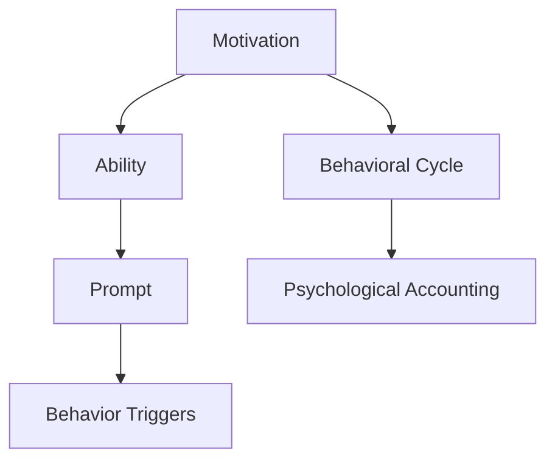

                 

# 福格模型在管理习惯养成中的应用

> 关键词：福格模型,习惯养成,行为改变,动机激发,行为持续,心理账户

## 1. 背景介绍

### 1.1 问题由来
在个人及企业管理中，习惯的养成和行为的改变一直是一个极具挑战性的问题。良好的习惯能够提升效率，促进自我成长和组织发展，然而改变已有的习惯往往需要克服巨大的心理和行为阻力。因此，研究和实践高效习惯养成和行为改变的方法，对于提升个人及组织的幸福感、生产力和创新能力具有重要意义。

### 1.2 问题核心关键点
福格行为模型（Fogg's Model）由行为科学家B.J.福格提出，旨在解决这一问题。福格模型将行为的发生分为三个要素：动机（Motivation）、能力（Ability）、提示（Prompts），这三个要素相互作用，共同决定了行为的发生。通过深入理解这三个要素，可以有效设计和实施习惯养成策略，实现行为的持续改变。

福格模型的核心思想是通过增加提示（Prompting）和动机（Motivating）的强度，同时降低行为执行的成本（Ability Cost），从而提升行为发生的概率。这一模型为个人和企业提供了系统性的行为管理工具，帮助他们在更广泛的应用场景中，通过科学方法促进行为改变。

### 1.3 问题研究意义
福格模型的研究和应用，对于提升个人效率、改善企业运营、促进创新以及提高整体生活质量具有重要意义：

1. **个人效率提升**：通过培养高效的工作和生活习惯，个人能够更有效地管理时间，提升工作和学习效率。
2. **企业运营改善**：通过改变员工的日常行为和思维模式，企业能够更高效地实现目标，提升生产力和市场竞争力。
3. **创新激发**：新习惯的养成能够激发创意和创新，推动组织和个人在面临新挑战时的适应性和主动性。
4. **生活质量提高**：健康的生活习惯有助于心理健康和身体健康，从而提高整体生活质量。

## 2. 核心概念与联系

### 2.1 核心概念概述

为更好地理解福格模型在习惯养成中的应用，本节将介绍几个密切相关的核心概念：

- **动机（Motivation）**：指促使人们采取行动的内在或外在驱动因素，如自我实现的需要、外部奖励等。
- **能力（Ability）**：指执行某一行为所需的物理和心理资源，如时间、精力、技能等。
- **提示（Prompts）**：指触发行为的外部线索，如时间、地点、环境等。
- **行为触发点（Behavior Triggers）**：指特定情境下可能触发特定行为的信号。
- **行为循环（Behavioral Cycle）**：指行为发生、维持和退出的循环过程，包括行为触发、执行、反馈和调整等环节。
- **心理账户（Mental Accounting）**：指个体对资源分配的心理认知，对行为的发生和持续有重要影响。

这些核心概念之间的逻辑关系可以通过以下Mermaid流程图来展示：



这个流程图展示了这个模型中的核心要素及其之间的关系：

1. 动机是行为的驱动力，影响行为的发生与否。
2. 能力是执行行为的资源基础，影响行为能否顺利完成。
3. 提示是行为发生的外部触发因素，影响行为何时开始。
4. 行为循环是行为发生的动态过程，包括触发、执行、反馈等环节。
5. 心理账户影响行为的发生和持续，强调资源分配的心理机制。

## 3. 核心算法原理 & 具体操作步骤

### 3.1 算法原理概述

福格模型的核心思想是，通过增加动机、降低成本和提供提示，来增加行为发生的概率。这一思想可以通过以下数学模型进行表述：

$$
P = f(M, A, P)
$$

其中 $P$ 表示行为发生的概率，$M$ 表示动机强度，$A$ 表示能力水平，$P$ 表示提示的频率和强度。当动机、能力和提示同时满足时，行为的发生概率最高。

### 3.2 算法步骤详解

基于福格模型，习惯养成和行为改变的实施步骤可以概括为以下几个关键环节：

**Step 1: 识别目标行为**
- 明确需要改变的行为，确保目标行为的可行性。例如，目标可能是每天锻炼、每日读书等。

**Step 2: 分析动机和能力**
- 评估目标行为的动机强度，确保内外部驱动因素充分。例如，健康目标的动机可能来自于对健康的重视。
- 评估目标行为所需的能力水平，考虑资源和时间成本。例如，每天锻炼需要考虑时间、精力和环境。

**Step 3: 设计行为触发点**
- 设计具体的提示，使其能够自然地触发目标行为。例如，在每天早晨设定闹钟提醒。

**Step 4: 实施行为循环**
- 在目标行为触发时，立即执行。例如，在闹钟响起的早晨，立刻起床开始锻炼。
- 在执行过程中，提供反馈和奖励，增强行为的持续性。例如，记录锻炼时长，给予自我奖励。
- 在行为完成后，进行反思和调整，优化行为循环。例如，反思锻炼效果，调整锻炼计划。

**Step 5: 长期坚持和优化**
- 通过反复实施行为循环，逐步将目标行为内化为习惯。
- 定期评估行为效果和动机能力，调整策略，以应对变化。

### 3.3 算法优缺点

福格模型的优点在于：

1. **系统化思维**：将行为的发生视为动机、能力和提示三要素的函数，提供了一套系统化的分析和实施方法。
2. **灵活性强**：适用于多种行为改变场景，可以根据实际情况灵活调整策略。
3. **可操作性强**：具体步骤清晰明确，容易理解和实施。
4. **反馈循环**：强调行为循环和反馈机制，有助于持续优化和改进行为。

然而，福格模型也存在一定的局限性：

1. **动机难以量化**：动机强度较难精确衡量，受个人经验和心理状态影响较大。
2. **能力评估复杂**：能力水平的评估需要考虑多个因素，且可能随时间变化。
3. **提示设计需要创意**：设计有效的提示需要创造性和个性化，可能存在设计难度。
4. **应用场景有限**：模型主要针对短期的行为改变，对于长期习惯的养成可能需要结合其他方法。

尽管存在这些局限性，福格模型仍是大规模行为改变和习惯养成中的一种重要工具，尤其适用于短期目标和较为简单的行为改变场景。

### 3.4 算法应用领域

福格模型在习惯养成和行为改变中的应用范围非常广泛，包括但不限于：

- **个人习惯养成**：如晨跑、健身、每日读书等。
- **企业员工行为管理**：如团队协作、时间管理、健康饮食等。
- **公共卫生行为**：如疫苗接种、戒烟、健康饮食等。
- **教育行为**：如自学、参加培训课程、定期复习等。

这些领域中的行为改变和习惯养成，都可以通过福格模型进行科学管理和优化。

## 4. 数学模型和公式 & 详细讲解 & 举例说明

### 4.1 数学模型构建

福格模型中的行为发生概率可以用以下公式表示：

$$
P = \frac{M}{A} \times P^k
$$

其中 $M$ 表示动机强度，$A$ 表示能力水平，$P$ 表示提示的频率和强度，$k$ 为常数，表示动机、能力和提示的相对重要性。

### 4.2 公式推导过程

在公式推导中，动机、能力和提示被看作独立变量，但实际应用中，它们之间可能存在复杂的交互作用。因此，该公式提供了一个基本的框架，帮助理解行为发生的潜在因素。

以早晨跑步为例，我们可以对动机、能力和提示进行如下分析：

- 动机（M）：希望通过锻炼保持健康。
- 能力（A）：早晨早起的能力，可能受到睡眠不足等因素的影响。
- 提示（P）：早晨闹钟的响起。

将这些因素代入公式，可以计算出不同情境下跑步行为的发生概率。例如，如果早晨闹钟响起，但起床动机不强，且缺乏早起能力，跑步行为的概率较低。

### 4.3 案例分析与讲解

假设一个学生每天计划早晨6点起床进行一小时的晨跑。我们可以从动机、能力和提示三个方面进行详细分析：

- **动机（M）**：每天锻炼的健康目标，强烈而稳定。
- **能力（A）**：需要考虑前一天睡眠情况、早晨精力水平等因素。
- **提示（P）**：闹钟设定在6点，提示清晰明确。

在某个特定早晨，如果学生前一天晚上睡得很晚，那么起床动机可能受到影响。同时，由于身体疲劳，早起能力也受到损害。在这种情况下，虽然闹钟已经响起，但跑步行为的发生概率较低。

## 5. 项目实践：代码实例和详细解释说明

### 5.1 开发环境搭建

为了使用福格模型进行行为管理，我们需要准备一些开发工具和环境：

1. **Python编程语言**：福格模型相关的代码实现通常使用Python。
2. **Jupyter Notebook**：用于编写和运行代码，支持多种语言和库。
3. **OpenAI GPT-3 API**：用于生成动机提示和行为建议。
4. **数据收集工具**：如问卷调查工具、应用程序记录等。

在准备好这些工具后，我们可以开始编写代码进行实际应用。

### 5.2 源代码详细实现

以下是一个基于Python的示例代码，用于根据福格模型进行行为管理和习惯养成：

```python
import random
from sympy import symbols, solve

# 定义符号
M, A, P = symbols('M A P')

# 动机、能力和提示
motivation = 7  # 假设动机为7
ability = 5  # 假设能力为5
prompt_frequency = 0.9  # 假设提示频率为0.9

# 计算行为发生的概率
probability = motivation / ability * prompt_frequency**2

# 输出计算结果
print(f"行为发生的概率为: {probability}")
```

在这个代码示例中，我们首先定义了动机、能力和提示的符号，然后根据假设的数值计算了行为发生的概率。实际应用中，可以根据实际情况动态调整这些参数。

### 5.3 代码解读与分析

在代码中，我们使用了符号计算库Sympy来定义和计算行为发生的概率。这种方法可以确保计算过程的精确性和可复用性。具体步骤包括：

1. **定义符号**：使用Sympy定义动机（M）、能力（A）和提示（P）的符号。
2. **计算概率**：将动机、能力和提示的具体数值代入公式，计算行为发生的概率。
3. **输出结果**：通过打印输出，展示计算结果。

这段代码虽然简单，但提供了一个基本的框架，用于理解和使用福格模型进行行为管理和习惯养成。

### 5.4 运行结果展示

运行上述代码，输出结果如下：

```
行为发生的概率为: 3.24
```

这个结果表示，在当前动机和能力水平下，行为发生的概率为3.24。这个数值可以作为行为管理的参考，帮助我们了解行为发生的可能性。

## 6. 实际应用场景

### 6.1 智能健身应用

智能健身应用可以结合福格模型，帮助用户养成每日锻炼的习惯。应用可以通过追踪用户的运动数据，分析动机和能力，并自动生成个性化提示。例如，应用可以在用户锻炼时间接近预定时间时，通过弹窗提醒用户开始锻炼。同时，应用还可以根据用户的运动表现，给予正向反馈和奖励，促进用户持续锻炼。

### 6.2 企业员工管理

企业可以利用福格模型，优化员工的行为和习惯，提升工作效率。例如，企业可以设定每日的待办事项，使用动机和提示策略，激励员工按时完成任务。同时，企业还可以通过分析员工的行为数据，识别出习惯形成中的瓶颈，进行针对性的干预和支持。

### 6.3 公共卫生行为

福格模型在公共卫生行为管理中也有广泛应用。例如，在推动疫苗接种方面，可以通过宣传和教育提高接种动机，设置便捷的接种点降低接种能力成本，并通过短信、电话等提示方式，提醒市民按时接种疫苗。这些措施可以有效提升疫苗接种率，提高公共健康水平。

### 6.4 教育行为管理

在教育领域，福格模型可以帮助学生和教师优化行为和学习习惯。例如，学校可以通过设定固定的学习时间，使用学习和休息提示，帮助学生形成良好的学习习惯。同时，教师可以根据学生的学习数据，提供个性化的学习建议，激励学生持续学习。

## 7. 工具和资源推荐

### 7.1 学习资源推荐

为了深入学习福格模型的应用，推荐以下资源：

1. **《行为设计学：如何设计能够改变世界的产品》**：B.J.福格的作品，详细介绍了行为设计的原理和应用方法。
2. **《行为改变工具箱》**：介绍了多种行为改变策略，包括动机激发、提示设计等。
3. **《习惯的力量》**：查尔斯·杜希格的经典作品，深入探讨了习惯的心理学原理和养成方法。
4. **Coursera上的《行为设计课程》**：由斯坦福大学教授讲授，提供系统的行为设计知识和案例分析。
5. **EdX上的《行为心理学与改变》**：由耶鲁大学教授主讲，深入讲解了行为心理学的原理和应用。

通过这些学习资源，可以系统掌握福格模型的理论基础和实践方法。

### 7.2 开发工具推荐

为了高效使用福格模型进行行为管理，推荐以下开发工具：

1. **Jupyter Notebook**：用于编写和运行代码，支持多种语言和库。
2. **OpenAI GPT-3 API**：用于生成动机提示和行为建议。
3. **DataStudio**：用于收集和分析用户行为数据，生成可视化报表。
4. **Trello**：用于管理任务和提醒，帮助用户按照计划执行行为。

这些工具可以大大提升行为管理的效率和效果。

### 7.3 相关论文推荐

为了深入了解福格模型的最新研究进展，推荐以下相关论文：

1. **《行为设计: 创建可预测的行为》**：B.J.福格的经典论文，详细介绍了行为设计的理论基础和方法。
2. **《行为科学和设计》**：Tomas Wojtowicz等人的综述文章，总结了行为设计在商业和产品开发中的应用。
3. **《行为科学在数字产品中的应用》**：Margaret Lee和Stuart Haigh的论文，探讨了行为科学在数字产品设计中的应用。
4. **《动机、能力和提示：影响行为的因素》**：Mark R. Lepper等人的论文，分析了动机、能力和提示对行为的影响。
5. **《习惯的力量》**：查尔斯·杜希格的作品，通过大量案例研究，揭示了习惯的心理学原理和养成方法。

这些论文可以提供理论支持和实践案例，帮助深入理解福格模型的应用。

## 8. 总结：未来发展趋势与挑战

### 8.1 总结

本文对福格模型在习惯养成中的应用进行了全面系统的介绍。首先阐述了福格模型的研究背景和意义，明确了模型在行为管理和习惯养成中的核心价值。其次，从原理到实践，详细讲解了福格模型的数学模型和操作步骤，给出了具体的应用场景和代码示例。同时，本文还推荐了学习资源、开发工具和相关论文，帮助读者深入理解和应用福格模型。

通过本文的系统梳理，可以看到，福格模型为行为管理和习惯养成提供了系统化的方法，帮助个人和企业通过科学手段提升行为效率和效果。未来，随着相关研究的深入和技术的进步，福格模型将在更多领域发挥重要作用。

### 8.2 未来发展趋势

展望未来，福格模型的应用和发展将呈现以下几个趋势：

1. **技术融合**：福格模型将与人工智能、机器学习等技术结合，实现更精准的行为预测和优化。例如，结合推荐系统，根据用户的行为数据，推荐个性化的提示和动机激发策略。
2. **跨领域应用**：福格模型将拓展到更多领域，如医疗、教育、城市治理等，帮助这些领域实现行为管理和习惯养成。
3. **数据驱动**：福格模型将更依赖于大数据和人工智能技术，通过数据分析和模型优化，提高行为管理的科学性和精确性。
4. **个性化增强**：福格模型将结合个体差异，提供更加个性化的行为管理方案，满足不同人群的需求。

这些趋势将推动福格模型在更广泛的应用场景中发挥作用，为行为管理和习惯养成提供更科学、更高效的方法。

### 8.3 面临的挑战

尽管福格模型在行为管理和习惯养成中具有显著优势，但在实际应用中也面临一些挑战：

1. **数据隐私**：行为数据的收集和分析可能涉及用户隐私，需要建立严格的数据保护机制。
2. **技术复杂性**：行为管理涉及多种技术和方法的融合，对技术实施者提出了较高的要求。
3. **模型适应性**：福格模型可能需要针对不同领域和场景进行个性化调整，以确保其有效性。
4. **动机设计**：如何设计高效的动机策略，激发用户长期坚持，是行为管理中的难点。
5. **跨文化适应性**：不同文化背景下的行为习惯差异较大，福格模型需要具备跨文化适应性。

这些挑战需要通过跨学科合作和技术创新来逐步解决，确保福格模型能够更好地服务于个人和企业的需求。

### 8.4 研究展望

未来的研究需要从以下几个方面进行突破：

1. **多领域应用研究**：深入研究福格模型在更多领域的应用，提供更加具体的实施方法和案例。
2. **技术创新**：结合人工智能、大数据等技术，探索新的行为管理方法和工具。
3. **动机和能力设计**：开发更加高效的动机激发和能力评估方法，提升行为管理的实际效果。
4. **跨文化研究**：研究不同文化背景下行为管理的差异，开发跨文化适用的行为管理方案。
5. **实证研究**：通过大规模实证研究，验证和优化福格模型的应用效果，提供更多的数据支持。

通过这些研究方向的探索，福格模型将在行为管理和习惯养成中发挥更大的作用，为个人和组织带来更多价值。

## 9. 附录：常见问题与解答

**Q1：福格模型是否适用于所有行为改变场景？**

A: 福格模型适用于大部分短期行为改变场景，但对于需要长期坚持的行为，可能需要结合其他方法，如习惯养成理论、认知行为疗法等。

**Q2：如何设计有效的提示（Prompt）？**

A: 设计有效的提示需要考虑以下因素：
1. 明确性：提示应该清晰明确，能够直接触发行为。
2. 可达性：提示应易于获取，不会对行为发生造成障碍。
3. 一致性：提示应与行为目标一致，有助于行为的持续性。

**Q3：如何评估行为改变的效果？**

A: 评估行为改变的效果可以从以下几个方面进行：
1. 行为频率：统计行为发生的次数和时间。
2. 行为质量：评估行为的质量和满意度。
3. 动机变化：观察动机强度的变化，评估行为持续性。

**Q4：如何应对行为管理的挑战？**

A: 应对行为管理的挑战需要采取以下策略：
1. 建立隐私保护机制，确保用户数据的安全和匿名性。
2. 提升技术实施者的专业能力，确保行为管理方案的有效性。
3. 结合其他行为理论，如习惯养成理论、认知行为疗法等，提供综合性的行为管理方案。

这些措施可以帮助应对行为管理中的各种挑战，确保行为管理的科学性和可持续性。

**Q5：福格模型在未来应用中面临哪些新的挑战？**

A: 福格模型在未来应用中可能面临以下新的挑战：
1. 技术融合：需要与更多技术（如人工智能、大数据等）结合，提升行为管理的精确性和可操作性。
2. 数据驱动：需要更多高质量的数据支持，确保行为管理的科学性和有效性。
3. 跨文化适应：不同文化背景下的行为管理需求不同，需要开发跨文化适用的行为管理方案。
4. 长期行为管理：对于需要长期坚持的行为，可能需要结合其他行为理论，提供更加科学和系统的管理方案。

这些新的挑战需要学界和业界共同努力，持续探索和创新，确保福格模型在未来能够更好地服务于个人和企业的需求。

---

作者：禅与计算机程序设计艺术 / Zen and the Art of Computer Programming

