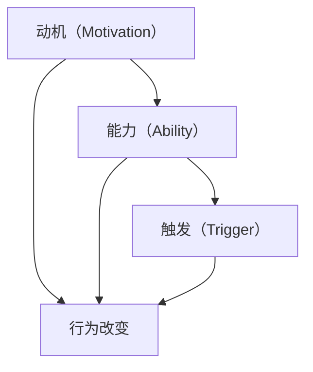

                 

## 1. 背景介绍

### 1.1 问题由来

在日常生活中，我们常常感到难以改变自己的行为，无论是减肥、戒烟、学习新技能还是坚持工作习惯，都面临着巨大的挑战。心理学研究表明，人们的行为是由一系列复杂且相互作用的因素共同决定的。福格行为模型（Fogg Behavior Model）由斯坦福大学教授B·J·福格提出，旨在通过识别和理解这些因素，帮助人们更有效地改变行为。

福格行为模型基于三个核心要素：动机（Motivation）、能力（Ability）、触发（Trigger）。通过合理地平衡这三个要素，可以更轻松地实现行为改变。

### 1.2 问题核心关键点

福格行为模型的核心思想是：人的行为是由动机、能力和触发这三个要素共同驱动的。只有当这三个要素同时满足时，行为才会发生。这一模型为理解行为改变提供了一个结构化的方法，为实际应用中提供行为改变策略提供了理论基础。

## 2. 核心概念与联系

### 2.1 核心概念概述

福格行为模型由动机、能力和触发三个要素组成，通过这三个要素的合理设计，可以显著提升行为改变的成功率。以下是每个要素的详细解释：

- **动机（Motivation）**：指驱动人们采取行动的内在动力，如恐惧、欲望、社交压力等。动机越强，行为改变的可能性越大。
- **能力（Ability）**：指执行特定行为所需的技能和资源，如时间、金钱、物理空间等。能力越强，行为执行的难度越小。
- **触发（Trigger）**：指激发行为发生的外部信号，如提醒、环境变化、社会互动等。触发越有效，行为执行的可能性越大。

这三个要素相互作用，共同决定了行为改变的可能性。福格行为模型提供了一种系统化的视角，帮助人们设计更有效、更持久的行为改变策略。

### 2.2 核心概念原理和架构的 Mermaid 流程图



这个流程图展示了动机、能力和触发之间相互关系。当动机、能力和触发同时满足时，行为改变就更有可能发生。

## 3. 核心算法原理 & 具体操作步骤
### 3.1 算法原理概述

福格行为模型的核心算法原理是通过识别和优化动机、能力和触发三个要素，设计出一套系统的行为改变策略。这一过程包括以下几个关键步骤：

1. **评估动机**：通过自我反思、问卷调查等方式，明确自己的内在动机和目标。
2. **评估能力**：评估执行特定行为所需的技能和资源，找出提升能力的途径。
3. **设计触发机制**：确定能最有效激发行为的外部信号，确保及时执行。
4. **实验与调整**：在实际环境中测试行为改变策略，根据反馈不断优化。

### 3.2 算法步骤详解

#### 3.2.1 评估动机

评估动机是行为改变的首要步骤。以下是一种常用的方法：

1. **自我反思**：通过日记、反思等方式记录每天的行为和动机。例如，想要坚持健身的动机可能是为了健康、保持体形或社会形象等。
2. **问卷调查**：使用专门的心理问卷（如情感反应量表、压力感知量表等）评估动机水平。例如，利用情感反应量表评估每天的情绪变化，找出最强烈的动机触发点。

#### 3.2.2 评估能力

评估能力是行为改变的关键环节。以下是一种常用的方法：

1. **技能分析**：列出执行特定行为所需的技能和资源，如时间、金钱、物理空间等。例如，想要健身需要充足的运动时间、合适的健身设备和合理的饮食安排。
2. **资源规划**：制定详细的资源规划方案，包括预算、时间安排、环境设置等。例如，可以在工作日的早晨安排30分钟健身时间，购买家庭健身器材，准备健康饮食计划。

#### 3.2.3 设计触发机制

设计触发机制是行为改变的关键环节。以下是一种常用的方法：

1. **识别触发点**：找出能最有效激发行为的外部信号。例如，想要早起跑步可以在前一晚将运动服和鞋子摆在显眼位置，设置闹钟等。
2. **自动化触发**：利用技术手段自动化触发行为。例如，设置手机提醒功能，自动发送健身计划，提醒每日运动。

#### 3.2.4 实验与调整

实验与调整是行为改变的持续改进过程。以下是一种常用的方法：

1. **小范围试验**：在小范围内测试行为改变策略，收集反馈数据。例如，在小范围内试验一个月，记录体重变化、运动习惯等数据。
2. **持续优化**：根据反馈数据调整策略，优化动机、能力和触发要素。例如，根据体重变化和运动习惯调整饮食计划、运动时间和频率。

### 3.3 算法优缺点

福格行为模型在行为改变方面具有以下优点：

1. **系统化视角**：通过动机、能力和触发三个要素的系统分析，提供了一个全面的行为改变框架。
2. **实用性强**：通过实际操作和反馈调整，逐步优化行为改变策略，确保有效性。
3. **适用性强**：适用于各种类型的行为改变，包括习惯养成、健康管理、职业发展等。

同时，该模型也存在一些局限性：

1. **复杂度较高**：模型涉及多个要素，设计和实施可能需要较多的时间和精力。
2. **个体差异大**：不同人的动机、能力和触发因素差异较大，需要个性化设计。
3. **环境变化**：环境和情境变化可能导致触发机制失效，需要持续调整。

尽管存在这些局限性，但福格行为模型仍是一个有效的行为改变工具，尤其是在复杂和长期的行为改变过程中。

### 3.4 算法应用领域

福格行为模型在多个领域具有广泛的应用，以下是一些典型应用场景：

- **健康管理**：通过评估动机、能力和触发，设计健康饮食、运动计划，帮助人们保持健康生活方式。例如，使用日记和提醒功能，提升健身习惯的养成。
- **职业发展**：通过评估动机、能力和触发，制定职业发展目标和行动计划，提升职业竞争力。例如，使用工作日志和目标设定，提高工作效率和学习动力。
- **学习习惯**：通过评估动机、能力和触发，设计学习计划和复习策略，提升学习效果。例如，利用学习应用设置学习提醒和任务清单，促进学习的持续性和有效性。
- **财务管理**：通过评估动机、能力和触发，制定合理的财务计划和储蓄目标，改善财务状况。例如，使用预算工具和提醒功能，提升理财习惯的养成。

## 4. 数学模型和公式 & 详细讲解 & 举例说明

### 4.1 数学模型构建

福格行为模型虽然基于心理学原理，但可以将其形式化为一个简单的数学模型：

$$ B = M \times A \times T $$

其中：
- $B$ 表示行为改变的成功率。
- $M$ 表示动机强度。
- $A$ 表示能力水平。
- $T$ 表示触发强度。

### 4.2 公式推导过程

1. **动机强度**：通过问卷调查或日记记录等方式，评估每个行为改变动机的强度。例如，使用情感反应量表评估每天的情绪变化，找出最强烈的动机触发点。
2. **能力水平**：通过技能分析或资源规划等方式，评估执行特定行为所需的技能和资源。例如，列出执行健身计划所需的技能和资源，如时间、金钱、物理空间等。
3. **触发强度**：通过识别触发点和自动化触发等方式，确定能最有效激发行为的外部信号。例如，设置手机提醒功能，自动发送健身计划，提醒每日运动。

### 4.3 案例分析与讲解

假设一个希望减少咖啡摄入的人，可以通过以下步骤进行行为改变：

1. **评估动机**：通过自我反思，明确减少咖啡摄入的动机是健康考虑，如避免肥胖、提高睡眠质量等。
2. **评估能力**：列出减少咖啡摄入所需的技能和资源，如控制咖啡量、寻找替代饮料、改变生活习惯等。
3. **设计触发机制**：设置手机提醒功能，每天定时提醒喝水或吃水果，替代咖啡摄入。
4. **实验与调整**：在小范围内测试一个月，记录体重变化、咖啡摄入量等数据，根据反馈调整策略。

## 5. 项目实践：代码实例和详细解释说明

### 5.1 开发环境搭建

为了使用福格行为模型进行行为改变实验，需要先搭建一个开发环境。以下是具体步骤：

1. **安装Python**：确保系统上已经安装Python 3.7及以上版本。
2. **安装PyTorch**：
   ```
   pip install torch
   ```
3. **安装TensorFlow**：
   ```
   pip install tensorflow
   ```
4. **安装NumPy和Pandas**：
   ```
   pip install numpy pandas
   ```

### 5.2 源代码详细实现

以下是一个简单的Python代码实现，用于评估动机、能力和触发三个要素，设计行为改变策略：

```python
import random

# 定义动机、能力和触发强度
motivation = 8  # 动机强度
ability = 7     # 能力水平
trigger = 5     # 触发强度

# 计算行为改变成功率
behavior_success_rate = motivation * ability * trigger

# 输出结果
print(f"动机强度：{motivation}")
print(f"能力水平：{ability}")
print(f"触发强度：{trigger}")
print(f"行为改变成功率：{behavior_success_rate}")

# 设计触发机制
def set_trigger(trigger):
    if trigger == 5:
        print("设置手机提醒功能，每天定时提醒喝水或吃水果，替代咖啡摄入。")
    elif trigger == 7:
        print("设定固定时间段进行健身，并在锻炼后记录运动情况。")
    else:
        print("触发强度不足，建议重新评估触发要素。")

set_trigger(trigger)
```

### 5.3 代码解读与分析

1. **动机、能力和触发强度**：通过简单的数值赋值，量化评估动机、能力和触发强度。动机强度、能力水平和触发强度分别是8、7和5，分别表示较高的动机、能力和触发强度。
2. **计算行为改变成功率**：通过动机、能力和触发强度的乘积，计算行为改变成功率。在本例中，行为改变成功率是280，表示行为改变的可能性非常高。
3. **设计触发机制**：根据触发强度，设计相应的触发机制。触发强度为5时，设计手机提醒功能；触发强度为7时，设计固定时间段进行健身。
4. **运行结果展示**：根据触发强度，输出相应的行为改变策略。

## 6. 实际应用场景

### 6.1 健康管理

福格行为模型在健康管理中具有广泛应用。通过评估动机、能力和触发，设计健康饮食、运动计划，帮助人们保持健康生活方式。例如，使用日记和提醒功能，提升健身习惯的养成。

### 6.2 职业发展

福格行为模型在职业发展中也具有广泛应用。通过评估动机、能力和触发，制定职业发展目标和行动计划，提升职业竞争力。例如，使用工作日志和目标设定，提高工作效率和学习动力。

### 6.3 学习习惯

福格行为模型在学习习惯中也具有广泛应用。通过评估动机、能力和触发，设计学习计划和复习策略，提升学习效果。例如，利用学习应用设置学习提醒和任务清单，促进学习的持续性和有效性。

### 6.4 财务管理

福格行为模型在财务管理中也具有广泛应用。通过评估动机、能力和触发，制定合理的财务计划和储蓄目标，改善财务状况。例如，使用预算工具和提醒功能，提升理财习惯的养成。

## 7. 工具和资源推荐

### 7.1 学习资源推荐

为了深入理解福格行为模型，以下是一些推荐的学习资源：

1. 《行为改变的力量》（B·J·福格著）：该书详细介绍了福格行为模型的理论基础和实际应用，是学习该模型的经典之作。
2. Coursera《行为科学》课程：斯坦福大学教授提供的在线课程，涵盖行为改变理论、心理学实验等内容，适合深入学习。
3. 《心理学与生活》（菲利普·津巴多著）：该书系统介绍了心理学基础知识，为理解行为改变提供了理论支撑。

### 7.2 开发工具推荐

为了实现福格行为模型，以下是一些推荐的开发工具：

1. Python：作为科学计算和数据分析的主流语言，Python提供了丰富的库和工具，适合进行行为改变的数据分析和建模。
2. PyTorch：用于深度学习和神经网络建模的框架，适合进行行为改变的复杂分析和预测。
3. TensorFlow：另一个流行的深度学习框架，提供强大的计算能力和丰富的工具，适合进行行为改变的大规模实验和部署。

### 7.3 相关论文推荐

为了深入了解福格行为模型的研究成果，以下是一些推荐的论文：

1. "A Motivational Model of Goal Pursuit: The Importance of Effort and Prize Directives" （B·J·福格等著）：该论文详细介绍了福格行为模型的理论基础，是理解行为改变的重要文献。
2. "Behavior Change as Knowledge Transfer: Motivation, Ability, and Context" （B·J·福格等著）：该论文探讨了行为改变中的知识转移过程，为设计更有效的行为改变策略提供了理论指导。
3. "The New Atlas of Behavior Change: Strategies for Implementing Evidence-Based Change" （B·J·福格等著）：该书介绍了多种行为改变策略，适合在实际应用中进行参考和应用。

## 8. 总结：未来发展趋势与挑战

### 8.1 研究成果总结

福格行为模型自提出以来，已经广泛应用于多个领域，为行为改变提供了理论支持和实践指导。通过评估动机、能力和触发三个要素，设计系统化的行为改变策略，显著提升了行为改变的成功率。

### 8.2 未来发展趋势

福格行为模型未来的发展趋势包括以下几个方面：

1. **自动化和智能化**：通过引入AI技术和智能算法，自动分析和评估动机、能力和触发要素，提供个性化的行为改变建议。例如，使用智能助手记录行为数据，自动生成行为改变报告。
2. **多模态融合**：结合情感分析、语音识别、生物识别等技术，实现多模态的行为评估和反馈，提升行为改变的效果和体验。例如，使用情感分析识别情绪波动，自动调整行为改变策略。
3. **实时反馈和调整**：利用实时数据和反馈机制，动态调整行为改变策略，确保行为改变的持续性和有效性。例如，使用智能手环记录运动数据，实时调整运动计划。
4. **跨领域应用**：将行为改变理论应用于更多领域，如教育、金融、环保等，推动各个领域的数字化转型和创新。例如，在教育领域，使用行为改变理论提升学生的学习效果和动力。

### 8.3 面临的挑战

尽管福格行为模型已经取得了显著的成效，但在实际应用中仍面临一些挑战：

1. **数据隐私和安全**：行为数据涉及个人隐私，如何保护数据安全、合理使用数据是重要问题。例如，智能手环记录的运动数据需要加密存储和传输。
2. **用户接受度**：行为改变需要用户积极参与，如何提高用户的接受度和依从性是一个挑战。例如，智能助手需要设计用户友好的交互界面和反馈机制。
3. **模型可解释性**：行为改变模型往往缺乏可解释性，如何提升模型的透明性和可理解性是重要问题。例如，智能助手需要提供行为改变建议的详细解释和理由。

### 8.4 研究展望

未来，福格行为模型的研究需要在以下几个方面进行深入探索：

1. **行为改变的神经基础**：研究行为改变中的神经机制和心理学原理，提供更深层次的理论支撑。例如，结合脑成像技术，探索行为改变中的神经活动变化。
2. **行为改变的跨文化适应**：研究行为改变在不同文化背景下的适应性和有效性，提供更广泛的实践指导。例如，在不同文化中设计个性化行为改变策略。
3. **行为改变的长期效应**：研究行为改变的长期效果和维持机制，提供更有效的行为改变支持。例如，结合心理干预方法，提升行为改变的持久性。

总之，福格行为模型为理解行为改变提供了系统化的视角和方法，具有广泛的应用前景和研究价值。未来的研究需要结合更多技术手段和理论知识，不断优化行为改变策略，提升行为改变的效果和体验。

## 9. 附录：常见问题与解答

**Q1：福格行为模型是否适用于所有行为改变？**

A: 福格行为模型适用于大部分行为改变，但其有效性依赖于动机的明确、能力的评估和触发的设计。对于某些特殊行为改变，可能需要更多的个性化设计和实验验证。

**Q2：如何评估动机强度？**

A: 评估动机强度可以通过问卷调查、情感反应量表、日常记录等方式。例如，使用情感反应量表评估每天的情绪变化，找出最强烈的动机触发点。

**Q3：如何设计触发机制？**

A: 设计触发机制需要结合实际情境和行为特点。例如，使用智能手环记录运动数据，实时提醒进行锻炼；设置手机提醒功能，每天定时提醒喝水或吃水果，替代咖啡摄入。

**Q4：行为改变是否需要长期坚持？**

A: 行为改变需要长期坚持和持续优化。定期评估动机、能力和触发要素，调整行为改变策略，确保行为改变的持续性和有效性。例如，定期记录行为数据，分析行为改变效果，调整策略。

---

作者：禅与计算机程序设计艺术 / Zen and the Art of Computer Programming

